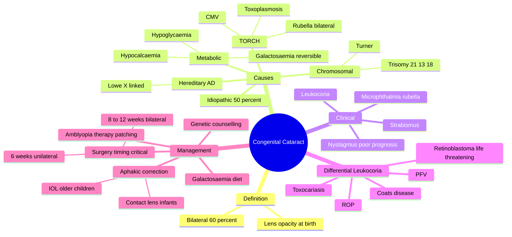

# Congenital Cataract

Related: [[Age-related Cataract]], [[Leukocoria]], [[Retinoblastoma]]

> [!tip] **FCPS/MRCP Priority: MEDIUM**
> Lens opacity at birth. Causes: idiopathic, hereditary, intrauterine infection (rubella), galactosemia, Lowe syndrome. Visual axis opacity = surgery within 6 weeks to prevent amblyopia.

---

## Learning Objectives
- [ ] Define congenital cataract and list its major causes
- [ ] Describe the clinical features and the differential of leukocoria
- [ ] Discuss the metabolic and infectious causes (galactosaemia, rubella)
- [ ] Outline the workup of a newborn with bilateral cataracts
- [ ] State the timing and principles of surgical management
- [ ] Recognise the importance of early intervention to prevent amblyopia
- [ ] Apply the genetic and family implications for counselling

---

## 1. Definition / Epidemiology / Classification

### Definition
- **Congenital cataract:** Lens opacity present at birth (or within first year of life)
- Bilateral in approximately 60% of cases
- May be isolated or part of a syndrome
- Cause must always be investigated — some causes are sight- and life-threatening

### Epidemiology
- Incidence ≈ 1–6 per 10,000 live births
- Leading cause of treatable childhood blindness worldwide
- Bilateral cases are more often hereditary/metabolic
- Unilateral cases more often idiopathic or due to local dysgenesis

### Classification (by morphology)
- **Total / complete** — whole lens opacified
- **Nuclear** — central embryonic/fetal nucleus opacity
- **Lamellar (zonular)** — most common morphological type; shell around clear nucleus
- **Capsular (anterior or posterior)** — capsular involvement
- **Polar** — subcapsular at anterior or posterior pole
- **Sutural** — opacity confined to Y-sutures
- **Membranous** — flattened, absorbed lens matter

### Classification (by aetiology — see Section 2)

---

## 2. Causes / Pathophysiology

### Idiopathic (≈ 50%)
- No identifiable cause after workup
- Diagnosis of exclusion

### Hereditary (≈ 30%)
- **Autosomal dominant** — most common hereditary form (isolated, often bilateral)
- **X-linked** — Lowe syndrome (oculocerebrorenal), Nance-Horan syndrome
- **Autosomal recessive** — galactosaemia, Fabry disease, mannosidosis
- Often associated with specific crystallin gene mutations (CRYAA, CRYBB2, CRYGC)

### Intrauterine Infection (TORCH)
- **Rubella** (most common infectious cause) — bilateral, dense central cataract, classic "salt-and-pepper" retinopathy, sensorineural deafness, PDA, microphthalmia
- **CMV** — chorioretinitis, microcephaly, hepatosplenomegaly
- **Toxoplasmosis** — focal chorioretinitis, hydrocephalus, intracranial calcification
- **HSV** — keratitis, chorioretinitis
- **Syphilis** — interstitial keratitis, "salt-and-pepper" fundus

### Metabolic
- **Galactosaemia** (classic, AR) — "oil-droplet" cataract, **reversible** with lactose-free diet if treated early
- **Hypocalcaemia** (hypoparathyroidism, pseudohypoparathyroidism) — lamellar cataract
- **Hypoglycaemia** — lamellar cataract
- **Mannosidosis, Fabry disease** — bilateral PSC
- **Lowe syndrome** — bilateral dense cataracts, hypotonia, intellectual disability, Fanconi renal tubular acidosis

### Chromosomal
- **Trisomy 21** (Down syndrome)
- **Trisomy 13** (Patau)
- **Trisomy 18** (Edwards)
- **Turner syndrome** (45,XO)

### Other / Syndromic
- **Norrie disease** — bilateral congenital cataracts, retinal dysplasia, sensorineural deafness
- **Conradi syndrome** — chondrodysplasia punctata, asymmetric limb shortening, cataract
- **Prematurity** — associated with low birthweight, often transient
- **Birth trauma** — direct lens injury
- **Maternal drugs** — corticosteroids, thiazides
- **Anterior segment dysgenesis** — Peters anomaly, Axenfeld-Rieger
- **Persistent fetal vasculature (PFV)** — secondary to failure of regression of hyaloid system

### Pathophysiology
- Disruption of normal lens crystallin arrangement → light scattering
- Maternal rubella virus interferes with embryonic lens development during weeks 4–7
- In galactosaemia, galactitol accumulates in lens via aldose reductase → osmotic hydration → lens fibre swelling
- Genetic mutations alter crystallin protein structure and transparency

---

## 3. Clinical Features

### History
- **Family history** of cataract or hereditary disease
- **Maternal illness in pregnancy** (rash, fever — rubella; lymphadenopathy)
- **Maternal drug use** (steroids)
- **Birth history** — prematurity, birth trauma, low birthweight
- **Visual behaviour** — poor fixation, no eye contact by 6–8 weeks
- **Leukocoria** noticed by parents or on red-reflex screening
- **Strabismus** (often first presenting sign)
- **Nystagmus** — implies dense bilateral cataract with poor visual prognosis

### Examination
- **Leukocoria** (white pupillary reflex)
- Absent red reflex (or asymmetric)
- **Lens opacity** on slit-lamp or direct ophthalmoscopy
- **Microphthalmia** (small eye — rubella, intrauterine infection)
- **Nystagmus** (bilateral dense)
- **Strabismus**
- Search for associated dysmorphic features, organomegaly, cardiac murmur

### Associated Systemic Features
- **Rubella:** sensorineural deafness, PDA, "blueberry muffin" rash
- **Galactosaemia:** jaundice, hepatomegaly, failure to thrive, E. coli sepsis
- **Lowe syndrome:** hypotonia, intellectual disability, Fanconi syndrome
- **Down syndrome:** epicanthic folds, flat nasal bridge, single palmar crease, cardiac defects

---

## 4. Investigations

### Mandatory
- **Urgent referral** to paediatric ophthalmologist
- **Family pedigree**
- **Maternal and birth history**
- **Full paediatric examination**

### Laboratory
- **TORCH screen** (Toxoplasma, Rubella, CMV, HSV, syphilis serology)
- **Urine reducing substances** (galactosaemia screen — non-glucose reducer)
- **Serum galactose-1-phosphate uridyl transferase** (confirm galactosaemia)
- **Serum calcium, phosphate** (hypocalcaemia)
- **Blood glucose** (hypoglycaemia)
- **Liver function tests** (galactosaemia, infection)
- **Urine amino acids / organic acids** (Lowe, Fabry, mannosidosis)

### Genetic
- **Karyotype** (if dysmorphic features — trisomies)
- **Targeted genetic testing / panel** for hereditary cataracts
- **Crystallin gene sequencing** in familial cases

### Ocular Imaging
- **B-scan ultrasonography** — if fundus not visible (to exclude retinoblastoma, retinal detachment)
- **Ultrasound biomicroscopy (UBM)** — for anterior segment anomalies

---

## 5. Differential Diagnosis (Leukocoria)

| Condition | Distinguishing Features |
|-----------|------------------------|
| **Retinoblastoma** | Life-threatening; retinal mass with calcification; cataract rare |
| **Persistent fetal vasculature (PFV)** | Microphthalmic eye, retrolental fibrovascular plaque |
| **Coats disease** | Unilateral, males, exudative retinal detachment, telangiectasia |
| **Toxocariasis** | Granuloma, posterior pole mass, contact with puppies |
| **ROP (Stage 5)** | History of prematurity, low birthweight, oxygen therapy |
| **Retinal detachment** | B-scan shows detached retina, trauma history |
| **PHPV** (persistent hyperplastic primary vitreous) | Same as PFV — older terminology |
| **Corneal opacity** | Peters anomaly, sclerocornea, congenital glaucoma (buphthalmos) |
| **Retinal dysplasia** | Norrie disease, Walker-Warburg |
| **Coloboma** | Inferonasal iris/retinal defect |

> [!warning] **Always rule out retinoblastoma — life-threatening!**

---

## 6. Management

### Urgent Referral
- **All suspected cases** — to paediatric ophthalmologist urgently

### Workup
- Family history, maternal history, full examination
- Investigations as in Section 4

### Specific Treatments
- **Galactosaemia:** Strict **lactose-free (galactose-free) diet** — cataract may partially/fully reverse
- **Hypocalcaemia:** Calcium and vitamin D supplementation
- **Hypoglycaemia:** Treat underlying cause

### Surgical
- **Indications:** Visually significant central opacity (>3 mm), dense bilateral, preventing visual development
- **Procedure:** Lensectomy (lens aspiration) ± primary posterior capsulotomy ± anterior vitrectomy
- **Timing — critical:**
  - **Unilateral dense cataract: within 6 weeks of birth** (visual pathway matures asymmetrically)
  - **Bilateral dense cataract: within 8–12 weeks**
  - Earlier surgery = less amblyopia but higher anaesthetic/surgical risk
  - Later surgery = more amblyopia, poorer visual outcome
- **Aphakic correction:**
  - **Infants:** Contact lens (preferred) or spectacles
  - **Older children (>2 years):** Intraocular lens (IOL) implant
- **Amblyopia therapy:** Patching of the better eye to force use of operated eye
- **Long-term follow-up:** Monitor for glaucoma, RD, posterior capsular opacification

### Genetic Counselling
- For hereditary cases — autosomal dominant, X-linked, or AR patterns
- Discuss recurrence risk (often 25–50%)

---

## 7. Complications

### Pre-operative
- **Amblyopia** (deprivation amblyopia — main cause of visual loss)
- **Nystagmus** (if dense bilateral — poor prognostic sign)
- **Strabismus**

### Post-operative
- **Posterior capsular opacification (PCO)** — common, treat with Nd:YAG laser (older children) or surgical capsulectomy (infants)
- **Secondary (afakic) glaucoma** — open-angle, develops years later
- **Retinal detachment**
- **Endophthalmitis** (rare)
- **IOL-related complications** (in older children) — decentration, uveitis

### Disease-related
- Underlying syndrome progression (e.g., Lowe, galactosaemia, rubella)
- Hearing loss, intellectual disability (depending on aetiology)

---

## 8. Red Flags / Emergencies

- **Leukocoria in any infant** — urgent referral to rule out retinoblastoma
- **Bilateral dense cataracts** — surgical emergency to prevent amblyopia
- **Family history of retinoblastoma** — treat as retinoblastoma until proven otherwise
- **Galactosaemia** with feeding intolerance, jaundice, hepatomegaly — start lactose-free diet immediately
- **Microphthalmia** — think congenital rubella, PFV
- **Dense unilateral cataract** — operating theatre within 6 weeks
- **Nystagmus** — implies dense bilateral cataract with poor vision — urgent

---

## 9. FCPS/MRCP High-Yield Summary

| Topic | Key Points |
|-------|------------|
| Most common cause | Idiopathic (50%); of identifiable: hereditary, rubella |
| Most common infection | Rubella |
| Reversible cause | Galactosaemia (lactose-free diet) |
| Most common hereditary | Autosomal dominant |
| Urgent surgery | Within 6 weeks (unilateral), 8–12 weeks (bilateral) |
| Aphakic correction | Contact lens (infants), IOL (older) |
| Differential of leukocoria | Retinoblastoma, PFV, Coats, ROP, toxocariasis |
| Amblyopia | Deprivation amblyopia = main cause of visual loss |

---

## 10. Viva Questions

1. **Q:** What is the most common cause of congenital cataract?
   **A:** Idiopathic; among identifiable causes, intrauterine infection (rubella) and hereditary (AD most common).

2. **Q:** What is the differential diagnosis of leukocoria?
   **A:** Retinoblastoma, congenital cataract, persistent fetal vasculature, Coats disease, ROP, toxocariasis, retinal detachment, corneal opacity.

3. **Q:** When is surgery indicated for congenital cataract?
   **A:** If visually significant — within 6 weeks for unilateral, 8–12 weeks for bilateral — to prevent amblyopia.

4. **Q:** Why is galactosaemia important to recognise?
   **A:** It is the only reversible cause of congenital cataract — lactose-free diet can prevent or reverse lens opacity.

5. **Q:** What is the most serious differential of congenital cataract presenting with leukocoria?
   **A:** Retinoblastoma — life-threatening; urgent B-scan and referral.

---

## 11. Common Confusions / Exam Traps

| Confusion | Clarification |
|-----------|---------------|
| "Rubella cataract is unilateral" | It is **bilateral** and dense, central — often the index feature of congenital rubella syndrome |
| "Galactosaemia cataract is permanent" | **Reversible** with early lactose-free diet — one of the few reversible cataracts |
| "All congenital cataracts need surgery" | Only **visually significant** central opacities (>3 mm) need surgery; small peripheral ones can be observed |
| "Surgery timing is not critical" | **Critical** — within 6 weeks (unilateral) or 8–12 weeks (bilateral) to prevent irreversible amblyopia |
| "Lowe syndrome is autosomal dominant" | Lowe syndrome is **X-linked recessive** — affects boys, carrier mothers |
| "Strabismus means cataract" | Strabismus is a common presentation but differential includes retinoblastoma, refractive error |
| "IOL is the first choice in infants" | **Contact lens** preferred in infants; IOL in children >2 years |

---

## 12. Mnemonics

1. **"RUBELLA RIPS the lens"** — Rubella = bilateral cataract, Retinopathy (salt-pepper), Inner ear (deaf), PDA, Small eye
2. **"GALACTOSE gone = cataract gone"** — Galactosaemia = reversible cataract with diet
3. **"6 weeks for ONE eye, 8 weeks for TWO"** — 6 weeks unilateral, 8–12 weeks bilateral surgery to prevent amblyopia
4. **"AD = most hereditary"** — Autosomal Dominant is the most common hereditary pattern

---

## 13. Mind Map

---

## 14. One-Page Revision Card

| **Topic** | **Congenital Cataract** |
|-----------|------------------------|
| **Definition** | Lens opacity at birth or within first year |
| **Most common cause** | Idiopathic (50%) |
| **Most common infection** | Rubella (bilateral, salt-and-pepper retinopathy, PDA, deafness) |
| **Reversible cause** | Galactosaemia — lactose-free diet |
| **Hereditary pattern** | Autosomal dominant (most common); Lowe = X-linked |
| **Differential of leukocoria** | Retinoblastoma (life-threatening), PFV, Coats, ROP |
| **Surgery timing** | 6 weeks (unilateral), 8–12 weeks (bilateral) |
| **Aphakic correction** | Contact lens (infants), IOL (older children) |
| **Main complication** | Deprivation amblyopia |
| **Viva Pearl** | "6 weeks for ONE, 8 for TWO" |

---

## Spaced Repetition Trackers

### 24-Hour Recall Prompts
- [ ] Define congenital cataract and list 4 causes
- [ ] Name the reversible cause and explain management
- [ ] State the surgery timing for unilateral vs bilateral dense cataract
- [ ] List 5 differentials of leukocoria
- [ ] Describe the clinical features of congenital rubella

### Revision Schedule
- [ ] **Day 1** completed (creation + 24h recall)
- [ ] **Day 3** revision completed
- [ ] **Day 7** revision completed
- [ ] **Day 15** revision completed
- [ ] **Day 30** revision completed
- [ ] **Day 90** revision completed

---

## Must Know / Should Know / Nice to Know

### Must Know (Core for passing)
- [x] Definition of congenital cataract
- [x] Most common causes (idiopathic, hereditary, rubella)
- [x] Galactosaemia is reversible (lactose-free diet)
- [x] Surgery timing: 6 weeks unilateral, 8–12 weeks bilateral
- [x] Differential of leukocoria — retinoblastoma is life-threatening
- [x] Aphakic correction: contact lens in infants, IOL in older children

### Should Know (High probability)
- [x] Rubella features (bilateral cataract, salt-pepper retina, PDA, deafness)
- [x] Lowe syndrome (X-linked, hypotonia, intellectual disability, Fanconi)
- [x] Investigation workup (TORCH, urine reducing substances, calcium, karyotype)
- [x] Amblyopia management (patching)
- [x] Posterior capsular opacification (PCO) as common complication

### Nice to Know (Differentiator)
- [ ] Crystallin gene mutations (CRYAA, CRYBB2, CRYGC)
- [ ] Norrie disease and Conradi syndrome
- [ ] Aldose reductase mechanism in galactosaemia
- [ ] Surgical technique details (lensectomy, anterior vitrectomy)

---

## My Weak Points
- [ ] Add personal weak areas here

---

## Self-Test Scorecard

| Section | Score /5 |
|---------|----------|
| Understanding: | /10 |
| Recall: | /10 |
| MCQ Performance: | /10 |
| SBA Performance: | /10 |
| Viva Confidence: | /10 |
| Total: | /50 |

> [!tip] **Interpretation:** <35 = weak topic, 35–44 = acceptable but insecure, 45+ = strong exam-ready topic.

---

## Exam Answer Modes

### Long Answer Skeleton
1. **Definition** — lens opacity present at birth
2. **Causes** — idiopathic, hereditary (AD), intrauterine infection (rubella), metabolic (galactosaemia, hypocalcaemia), chromosomal (Down, Patau, Edwards, Turner)
3. **Clinical features** — leukocoria, strabismus, nystagmus (poor prognosis), microphthalmia (rubella)
4. **Differential of leukocoria** — retinoblastoma, PFV, Coats, ROP, toxocariasis, RD
5. **Workup** — TORCH, urine reducing substances, calcium, karyotype
6. **Management** — diet for galactosaemia; surgery timing (6 weeks unilateral, 8–12 bilateral); aphakic correction (contact lens/IOL); amblyopia therapy; genetic counselling

### Short Note Skeleton
- Definition + morphology classification
- Common causes: rubella, galactosaemia, hereditary AD
- Management: surgery timing, aphakic correction
- Key complication: amblyopia

### Viva One-Liners
- **Q:** Most common infection causing congenital cataract? → **A:** Rubella
- **Q:** Reversible cause? → **A:** Galactosaemia (lactose-free diet)
- **Q:** When to operate unilateral cataract? → **A:** Within 6 weeks of birth
- **Q:** Most common hereditary pattern? → **A:** Autosomal dominant
- **Q:** What is the most dangerous differential? → **A:** Retinoblastoma
- **Q:** Aphakic correction in infants? → **A:** Contact lens

### Ward-Case Discussion Points
- Identify leukocoria on red-reflex examination
- Distinguish congenital cataract from retinoblastoma (urgent B-scan)
- Elicit maternal history (rubella, drugs)
- Recognise galactosaemia (lactose-free diet)
- Counsel family on visual prognosis, amblyopia, surgery timing
- Genetic counselling for hereditary cases

### Last-Night-Before-Exam Sheet
- **Top 5 facts:** Idiopathic (50%), Rubella (bilateral + salt-pepper), Galactosaemia (reversible), 6 weeks (unilateral) / 8–12 (bilateral), Retinoblastoma = most dangerous differential
- **2 mnemonics:** "6 weeks for ONE, 8 weeks for TWO"; "RUBELLA RIPS"
- **Must-know differential:** Retinoblastoma, PFV, Coats, ROP, toxocariasis
- **Viva:** Most common infection = rubella; Most common reversible = galactosaemia

---

## Summary

Congenital cataract is a lens opacity present at birth (or within first year). Major causes: idiopathic (50%), hereditary (AD), intrauterine infection (rubella — most common), metabolic (galactosaemia — **reversible**), chromosomal (Down, Patau, Edwards, Turner). Clinical features include leukocoria, strabismus, nystagmus (poor prognostic sign in bilateral cases), and microphthalmia. **Urgent workup** includes TORCH screen, urine reducing substances, calcium, karyotype. The most important differential of leukocoria is **retinoblastoma** — life-threatening. Visually significant central cataracts require **surgery within 6 weeks (unilateral) or 8–12 weeks (bilateral)** to prevent amblyopia. Aphakic correction uses contact lens in infants, IOL in older children. Long-term complications include PCO, glaucoma, retinal detachment.

---

## MCQs (10)

1. **Question:** The most common intrauterine infection causing congenital cataract is:
   **Options:** A. CMV B. Toxoplasmosis C. Rubella D. HSV E. Syphilis
   **Answer:** C
   **Explanation:** Rubella is the classic infectious cause — bilateral, dense cataract with salt-and-pepper retinopathy, PDA, sensorineural deafness.

2. **Question:** Which of the following is a reversible cause of congenital cataract?
   **Options:** A. Rubella B. Galactosaemia C. Lowe syndrome D. Trisomy 21 E. Birth trauma
   **Answer:** B
   **Explanation:** Galactosaemia (classic, AR) — strict lactose-free diet can reverse the "oil-droplet" cataract if treated early.

3. **Question:** Surgery for visually significant unilateral congenital cataract should be performed within:
   **Options:** A. 24 hours B. 6 weeks C. 6 months D. 1 year E. 5 years
   **Answer:** B
   **Explanation:** Within 6 weeks of birth to prevent irreversible deprivation amblyopia in the affected eye.

4. **Question:** The most common hereditary pattern in isolated congenital cataract is:
   **Options:** A. Autosomal recessive B. Autosomal dominant C. X-linked recessive D. X-linked dominant E. Mitochondrial
   **Answer:** B
   **Explanation:** Autosomal dominant is the most common hereditary pattern; Lowe syndrome is the classic X-linked cause.

5. **Question:** A newborn with bilateral dense cataracts, jaundice, hepatomegaly, and failure to thrive is most likely to have:
   **Options:** A. Congenital rubella B. Galactosaemia C. Lowe syndrome D. Trisomy 21 E. Toxoplasmosis
   **Answer:** B
   **Explanation:** Galactosaemia presents with feeding intolerance, jaundice, hepatomegaly, and bilateral "oil-droplet" cataracts — reversible with lactose-free diet.

6. **Question:** The most important and life-threatening differential diagnosis of leukocoria in a child is:
   **Options:** A. Congenital cataract B. Retinoblastoma C. Coats disease D. Persistent fetal vasculature E. ROP
   **Answer:** B
   **Explanation:** Retinoblastoma is the most life-threatening cause of leukocoria — urgent B-scan and referral required.

7. **Question:** The preferred aphakic correction in an infant after cataract surgery is:
   **Options:** A. Spectacles B. Contact lens C. Intraocular lens D. No correction E. Laser
   **Answer:** B
   **Explanation:** Contact lens is preferred in infants (<2 years) due to growing eye; IOL is reserved for older children.

8. **Question:** The characteristic fundus finding in congenital rubella syndrome (other than cataract) is:
   **Options:** A. Cherry-red spot B. Bone-spicule pigmentation C. Salt-and-pepper retinopathy D. Chorioretinitis scar E. Retinal detachment
   **Answer:** C
   **Explanation:** "Salt-and-pepper" retinopathy is the classic fundus finding of congenital rubella.

9. **Question:** A 4-week-old infant has unilateral dense central cataract. The best management is:
   **Options:** A. Observe until 6 months B. Lensectomy within 6 weeks C. Topical steroid D. Dilatation E. Spectacles
   **Answer:** B
   **Explanation:** Unilateral dense cataract = surgery within 6 weeks to prevent amblyopia.

10. **Question:** Lowe syndrome classically presents with all of the following EXCEPT:
    **Options:** A. Bilateral cataracts B. Hypotonia C. Fanconi syndrome D. Autosomal dominant inheritance E. Intellectual disability
    **Answer:** D
    **Explanation:** Lowe syndrome is X-linked recessive, NOT autosomal dominant.

---

## SBA Questions (10)

1. **Scenario:** A 3-week-old infant is found to have bilateral leukocoria on red-reflex screening. Mother had a febrile illness with rash in the first trimester. Examination shows sensorineural deafness and a cardiac murmur.
   **Question:** What is the most likely diagnosis?
   **Options:** A. Retinoblastoma B. Congenital rubella cataract C. Galactosaemia D. Coats disease E. Persistent fetal vasculature
   **Answer:** B
   **Explanation:** Maternal first-trimester rash (rubella) + bilateral cataract + deafness + PDA = congenital rubella syndrome.

2. **Scenario:** A newborn develops feeding intolerance, jaundice, hepatomegaly, and bilateral cataracts. Urine shows a non-glucose reducing substance.
   **Question:** What is the most appropriate next step?
   **Options:** A. Lensectomy within 6 weeks B. Start lactose-free diet C. Topical steroid D. IV antibiotics E. Genetic counselling only
   **Answer:** B
   **Explanation:** Galactosaemia — non-glucose reducing substance (galactose) in urine; immediate lactose-free diet can reverse cataract and prevent E. coli sepsis.

3. **Scenario:** A 6-week-old infant has unilateral dense cataract. The ophthalmologist recommends urgent surgery.
   **Question:** What is the main reason for operating within 6 weeks?
   **Options:** A. To prevent endophthalmitis B. To prevent irreversible deprivation amblyopia C. To prevent retinal detachment D. To prevent glaucoma E. To prevent nystagmus
   **Answer:** B
   **Explanation:** Visual pathway matures rapidly; delayed surgery leads to permanent amblyopia. Critical period is 6 weeks for unilateral.

4. **Scenario:** A 4-month-old boy with hypotonia, intellectual disability, and bilateral cataracts is found to have aminoaciduria and renal tubular acidosis.
   **Question:** What is the most likely diagnosis?
   **Options:** A. Galactosaemia B. Lowe syndrome C. Congenital rubella D. Trisomy 21 E. Fabry disease
   **Answer:** B
   **Explanation:** Lowe (oculocerebrorenal) syndrome: bilateral cataracts, hypotonia, intellectual disability, Fanconi syndrome. X-linked recessive.

5. **Scenario:** A newborn has a unilateral white pupillary reflex. On B-scan, a calcified intraocular mass is seen.
   **Question:** What is the most likely diagnosis?
   **Options:** A. Congenital cataract B. Retinoblastoma C. Coats disease D. PFV E. ROP
   **Answer:** B
   **Explanation:** Calcified intraocular mass = retinoblastoma until proven otherwise. Urgent oncological referral.

6. **Scenario:** A 1-month-old infant has bilateral nuclear cataracts. Family history reveals father and paternal grandmother with childhood cataracts requiring surgery.
   **Question:** What is the most likely inheritance pattern?
   **Options:** A. Autosomal recessive B. Autosomal dominant C. X-linked recessive D. Mitochondrial E. Sporadic
   **Answer:** B
   **Explanation:** Vertical transmission across generations affecting both sexes = autosomal dominant.

7. **Scenario:** A 5-week-old infant is diagnosed with unilateral dense cataract. Surgery is planned.
   **Question:** What is the most appropriate method of aphakic correction post-operatively in this infant?
   **Options:** A. Spectacles B. Contact lens C. Primary IOL implant D. Laser refractive surgery E. No correction needed
   **Answer:** B
   **Explanation:** Contact lens is preferred in infants; primary IOL is not used in infants <2 years due to high complications and growing eye.

8. **Scenario:** A child with congenital cataract surgery in infancy develops gradual blurring of vision 2 years post-operatively. Examination shows hazy posterior capsule.
   **Options:** A. Retinal detachment B. Posterior capsular opacification C. Endophthalmitis D. Secondary glaucoma E. IOL dislocation
   **Question:** What is the most likely diagnosis?
   **Answer:** B
   **Explanation:** PCO is the most common late complication of paediatric cataract surgery — treat with surgical capsulectomy (laser difficult in children).

9. **Scenario:** A 6-week-old infant with bilateral congenital cataract is being prepared for surgery. Pre-operative workup is requested.
   **Question:** Which investigation is most important to identify a reversible cause?
   **Options:** A. Karyotype B. TORCH screen C. Urine reducing substances D. MRI brain E. EEG
   **Answer:** C
   **Explanation:** Urine reducing substances (non-glucose) detects galactosaemia — a reversible cause of cataract.

10. **Scenario:** A newborn is noted to have unilateral microphthalmia with a retrolental fibrovascular plaque on examination.
    **Question:** What is the most likely diagnosis?
    **Options:** A. Retinoblastoma B. Persistent fetal vasculature (PFV) C. Coats disease D. ROP E. Congenital rubella
    **Answer:** B
    **Explanation:** PFV (formerly PHPV) = failure of regression of hyaloid vascular system; small eye, retrolental plaque, cataract.

---

## Flashcards

- **Q:** What is the most common intrauterine infection causing congenital cataract?
  **A:** Rubella — bilateral dense cataract with salt-and-pepper retinopathy, PDA, sensorineural deafness.
- **Q:** What is the only reversible cause of congenital cataract?
  **A:** Galactosaemia (classic) — strict lactose-free diet can reverse the lens opacity.
- **Q:** When should surgery be done for a unilateral dense congenital cataract?
  **A:** Within 6 weeks of birth to prevent irreversible deprivation amblyopia.
- **Q:** What is the most life-threatening differential of leukocoria?
  **A:** Retinoblastoma — urgent B-scan, calcified mass.
- **Q:** What is the preferred aphakic correction in an infant?
  **A:** Contact lens (IOL reserved for children >2 years).

---

## Answer Key with Explanations

### MCQs
1. **C** — Rubella is the most common infection (bilateral, salt-pepper retina, PDA, deafness)
2. **B** — Galactosaemia is the only reversible cause; lactose-free diet reverses it
3. **B** — Within 6 weeks for unilateral dense cataract
4. **B** — Autosomal dominant is most common hereditary pattern
5. **B** — Galactosaemia: feeding intolerance, jaundice, hepatomegaly, cataracts
6. **B** — Retinoblastoma is life-threatening; urgent B-scan
7. **B** — Contact lens is preferred in infants
8. **C** — Salt-and-pepper retinopathy is the rubella fundus sign
9. **B** — Unilateral dense cataract needs surgery within 6 weeks
10. **D** — Lowe syndrome is X-linked recessive, not AD

### SBAs
1. **B** — Maternal first-trimester rash + bilateral cataract + deafness = congenital rubella
2. **B** — Galactosaemia needs immediate lactose-free diet
3. **B** — Main reason for early surgery = prevent deprivation amblyopia
4. **B** — Cataract + hypotonia + Fanconi = Lowe syndrome (X-linked)
5. **B** — Calcified mass = retinoblastoma
6. **B** — Vertical inheritance = autosomal dominant
7. **B** — Contact lens in infants; IOL avoided <2 years
8. **B** — Posterior capsular opacification is the most common late complication
9. **C** — Urine reducing substances detects galactosaemia (reversible)
10. **B** — Microphthalmia + retrolental plaque = PFV

---

## Tags
#medicine #davidson #ophthalmology #congenital #cataract #fcps #mrcp #leukocoria #retinoblastoma #rubella #galactosaemia #amblyopia

## PasTest Scenario SBAs (Clinical Vignettes)

> **Auto-generated PasTest/Mediscope-style scenario SBAs** grounded in the authored source. Each scenario tests a real clinical fact (triad, specific sign, contraindication, trial, first-line Rx) extracted from the topic. *Source: Ch 28: Medical Ophthalmology — Congenital Cataract*

**Q1.** What is the most appropriate first-line therapy for Congenital Cataract?

  - **A.** Hypoglycaemia:
  - **B.** An advanced/surgical therapy reserved for refractory disease
  - **C.** Symptomatic treatment only, no disease-modifying therapy
  - **D.** Empiric broad-spectrum therapy without specific indication

  > **Answer: A** — Hypoglycaemia:
  >
  > *Source:* **Hypoglycaemia:** Treat underlying cause

