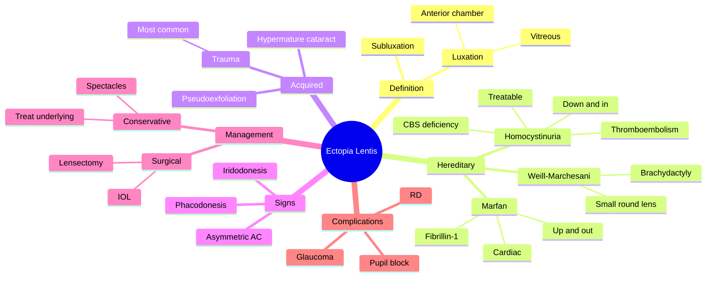

# Ectopia Lentis (Lens Dislocation)

Related: [[Marfan Syndrome]], [[Homocystinuria]], [[Traumatic Cataract]]

> [!tip] **FCPS/MRCP Priority: MEDIUM**
> Lens subluxation (partial) or luxation (complete). Marfan = up and out (superotemporal). Homocystinuria = down and in (inferonasal). Trauma common cause.

---

## Learning Objectives
- [ ] Define ectopia lentis and differentiate subluxation from luxation
- [ ] List the hereditary and acquired causes
- [ ] Describe clinical signs (iridodonesis, phacodonesis)
- [ ] Differentiate Marfan from homocystinuria clinically
- [ ] Outline management of lens dislocation
- [ ] Recognise indications for surgical removal
- [ ] Identify systemic associations requiring referral (cardiology, metabolic)

---

## 1. Definition

- **Ectopia lentis:** Displacement of the crystalline lens
- **Subluxation:** Partial, lens still in pupillary area
- **Luxation (dislocation):** Complete, lens displaced from its normal position (anterior chamber, vitreous)

---

## 2. Causes

### Hereditary
| Condition | Direction | Notes |
|-----------|-----------|-------|
| **Marfan syndrome** | **Up and out** (superotemporal) | Fibrillin-1 mutation, AD |
| **Homocystinuria** | **Down and in** (inferonasal) | CBS deficiency, AR, treatable |
| **Weill-Marchesani** | Anterior, small lens | Short stature, brachydactyly |
| **Ehlers-Danlos** | Variable | |
| **Sulfite oxidase deficiency** | | |
| **Hyperlysinemia** | | |

### Acquired
- **Trauma** (most common cause) — zonular dehiscence
- **Pseudoexfoliation syndrome**
- **Hypermature cataract** (weak zonules)
- **Uveitis** (long-standing)
- **Iatrogenic** (post-surgical)

---

## 3. Clinical Features

### Symptoms
- Decreased vision (refractive change, astigmatism)
- Monocular diplopia (phacodonesis)
- Iridodonesis (iris tremulous on movement)
- May be asymptomatic

### Signs
- **Iridodonesis** (tremulous iris)
- **Phacodonesis** (tremulous lens)
- Visible lens edge (subluxed)
- Lens in AC or vitreous (luxed)
- AC depth asymmetry
- **Pupil block** (anterior lens)
- Vitreous prolapse

### Associations / Features of Underlying
- **Marfan:** Tall, arachnodactyly, pectus excavatum, aortic root dilatation
- **Homocystinuria:** Marfanoid habitus, intellectual disability, **thromboembolism** (treatable cause!)
- **Weill-Marchesani:** Short, stocky, small lens

---

## 4. Investigations

- **Slit-lamp examination** (definitive) — identifies lens position, phacodonesis, iridodonesis
- **Refraction:** High astigmatism, aphakic portion
- **IOP measurement:** Rule out secondary glaucoma
- **Dilated fundus exam:** Look for retinal detachment, peripheral degenerations
- **Systemic work-up (suspected syndrome):**
  - Marfan: echocardiography (aortic root), FBN1 gene testing
  - Homocystinuria: plasma/urine homocysteine, methionine, CBS gene testing
- **B-scan ultrasonography** if media opaque

---

## 5. Differential Diagnosis

| Condition | Distinguishing |
|-----------|---------------|
| Aphakia | No lens in situ (history of surgical removal) |
| Microspherophakia | Small, round lens (Weill-Marchesani) |
| Coloboma of lens | Inferonasal notch, congenital |
| Marfan vs Homocystinuria | Direction + systemic features |

---

## 6. Management

### Conservative
- Spectacle / contact lens correction (aphakic or phakic portion)
- Treat underlying (e.g., pyridoxine, low-methionine diet for homocystinuria)
- Marfan: cardiology follow-up, aortic root surveillance, β-blocker
- Homocystinuria: pyridoxine (B6), folate, B12, methionine restriction, anticoagulation

### Surgical
- **Indications:**
  - Lens in AC (risk of endothelial damage, glaucoma)
  - Pupil block glaucoma
  - Visually significant (subluxed lens edge in visual axis)
  - Cataract in subluxed lens
- **Lensectomy** (pars plana approach) ± IOL (sutured, ACIOL, iris-fixated)
- Often combined with PPV

---

## 7. Complications

- Pupil block glaucoma (anteriorly dislocated lens)
- Secondary open-angle glaucoma
- Corneal endothelial decompensation (lens-AC touch)
- Uveitis (phacolytic / phacoanaphylactic)
- Retinal detachment (especially in Marfan / trauma)
- Amblyopia in children (visual axis involvement)
- Endophthalmitis (rare, after lens in AC)

---

## 8. Red Flags / Emergencies

- **Lens in anterior chamber** → emergency — risk of corneal endothelial damage and pupil block
- **Acute secondary glaucoma** (painful red eye, ↑ IOP)
- **Marfan + new chest/back pain** → urgent cardiology review (aortic dissection)
- **Homocystinuria + neurological signs** → consider stroke / venous sinus thrombosis
- **Sudden visual loss with floaters** → suspect retinal detachment

---

## 9. FCPS/MRCP High-Yield Summary

| Condition | Direction | Important |
|-----------|-----------|-----------|
| Marfan | Up and out | Cardiac involvement |
| Homocystinuria | Down and in | **Thromboembolism — treatable** |
| Weill-Marchesani | Small, round | Short stature |
| Trauma | Variable | Most common cause overall |

---

## 10. Viva Questions

1. **Q:** Differentiate Marfan from homocystinuria in ectopia lentis.
   **A:** Marfan = lens up and out (superotemporal), aortic dissection risk. Homocystinuria = lens down and in (inferonasal), **treatable** with pyridoxine/diet, **thromboembolism** risk (stroke, MI).

2. **Q:** What is iridodonesis?
   **A:** Tremulous iris on eye movement — sign of lens subluxation.

3. **Q:** What is phacodonesis?
   **A:** Tremulous lens on eye movement — sign of zonular weakness.

4. **Q:** Most common cause of acquired ectopia lentis?
   **A:** Trauma (blunt or penetrating ocular injury).

5. **Q:** When is surgery indicated in ectopia lentis?
   **A:** Lens in anterior chamber, pupil block, visual axis obstruction, cataract, or dislocated lens causing uveitis/glaucoma.

---

## 11. Common Confusions / Exam Traps

| Confusion | Clarification |
|-----------|---------------|
| "Marfan and homocystinuria look alike" | Both marfanoid, but Marfan = up/out + cardiac, Homocystinuria = down/in + thromboembolism + intellectual disability |
| "Ectopia lentis = subluxation only" | Subluxation = partial; luxation = complete (in AC or vitreous) |
| "Surgery always needed" | No — asymptomatic subluxation may be observed; surgery for complications |
| "Phacodonesis = iridodonesis" | Phacodonesis = tremulous lens; iridodonesis = tremulous iris — both seen together |
| "Homocystinuria lens is up" | NO — homocystinuria = down and in (inferonasal); Marfan = up and out |
| "Ectopia lentis is a primary ocular disease" | Often a clue to systemic disease — always consider Marfan, homocystinuria |

---

## 12. Mnemonics

1. **"Marfan = UP"** — Marf**a**n (think "A" for "Above" / "Apart" / superotemporal)
2. **"Homocystinuria = DOWN"** — **H**omocystinuria = **H**ypotensive / **H**eavy lens, down and in
3. **"TRAUMA = Top cause"** — T**R**A**U**M**A** is the **M**ost **A**cquired cause
4. **"Phacodonesis = Phac (lens) trembles"**; **"Iridodonesis = Iris trembles"**

---

## 13. Mind Map

---

## 14. One-Page Revision Card

| **Topic** | **Ectopia Lentis** |
|-----------|--------------------|
| **Definition** | Displacement of crystalline lens |
| **Subluxation** | Partial, lens edge in pupillary axis |
| **Luxation** | Complete — anterior chamber or vitreous |
| **Most common cause** | Trauma |
| **Marfan** | Up & out (superotemporal); cardiac risk |
| **Homocystinuria** | Down & in (inferonasal); **treatable**, thromboembolism |
| **Weill-Marchesani** | Small round lens, anterior; short stature |
| **Key sign** | Iridodonesis + phacodonesis |
| **Surgical indication** | AC lens, pupil block, visual axis, RD risk |
| **Viva Pearl** | "Marfan UP, Homocystinuria DOWN" |

---

## Spaced Repetition Trackers

### 24-Hour Recall Prompts
- [ ] Define subluxation vs luxation of the lens
- [ ] State direction of lens displacement in Marfan and Homocystinuria
- [ ] List 3 causes of acquired ectopia lentis
- [ ] Name 2 key signs on slit-lamp exam
- [ ] Identify 3 indications for surgical removal

### Revision Schedule
- [ ] **Day 1** completed (creation + 24h recall)
- [ ] **Day 3** revision completed
- [ ] **Day 7** revision completed
- [ ] **Day 15** revision completed
- [ ] **Day 30** revision completed
- [ ] **Day 90** revision completed

---

## Must Know / Should Know / Nice to Know

### Must Know (Core for passing)
- [x] Definition: subluxation vs luxation
- [x] Direction of lens in Marfan (up/out) and homocystinuria (down/in)
- [x] Trauma is the most common cause
- [x] Iridodonesis and phacodonesis
- [x] Treatability of homocystinuria (B6, diet)

### Should Know (High probability)
- [x] Weill-Marchesani features
- [x] Indications for surgery
- [x] Marfan cardiac follow-up
- [x] Cycloplegic refraction
- [x] Pupil block glaucoma

### Nice to Know (Differentiator)
- [ ] FBN1 gene (Marfan) and CBS gene (homocystinuria)
- [ ] Vitreous prolapse, IOL options (ACIOL, scleral-fixated)
- [ ] Pseudoexfoliation association

---

## My Weak Points
- [ ] Add personal weak areas here

---

## Self-Test Scorecard

| Section | Score /5 |
|---------|----------|
| Understanding: | /10 |
| Recall: | /10 |
| MCQ Performance: | /10 |
| SBA Performance: | /10 |
| Viva Confidence: | /10 |
| Total: | /50 |

> [!tip] **Interpretation:** <35 = weak topic, 35-44 = acceptable but insecure, 45+ = strong exam-ready topic.

---

## Exam Answer Modes

### Long Answer Skeleton
1. Definition (subluxation vs luxation)
2. Causes — hereditary (Marfan, homocystinuria, Weill-Marchesani) vs acquired (trauma, PXF, hypermature cataract)
3. Clinical features — iridodonesis, phacodonesis, decreased vision, monocular diplopia
4. Investigations — slit-lamp, refraction, IOP, fundus, systemic work-up
5. Management — conservative (spectacle, treat underlying) vs surgical (lensectomy, IOL)
6. Complications — pupil block, RD, glaucoma

### Short Note Skeleton
- Definition + subluxation vs luxation
- Causes (hereditary vs acquired)
- Marfan (up/out) vs homocystinuria (down/in) — one-liner
- Management principles

### Viva One-Liners
- **Q:** What is ectopia lentis? → **A:** Displacement of the crystalline lens from its normal position.
- **Q:** Marfan vs homocystinuria direction? → **A:** Marfan = up and out; Homocystinuria = down and in.
- **Q:** Most common cause? → **A:** Trauma.
- **Q:** What is iridodonesis? → **A:** Tremulous iris on eye movement.
- **Q:** What is phacodonesis? → **A:** Tremulous lens on eye movement.
- **Q:** When to operate? → **A:** AC lens, pupil block, visual axis obstruction, uveitis, RD risk.

### Ward-Case Discussion Points
- Differentiate Marfan from homocystinuria at the slit-lamp
- Examine for systemic features (aortic root, thromboembolism)
- Check IOP, fundus, AC depth
- Discuss medical vs surgical management
- Refer to cardiology (Marfan) or metabolic medicine (homocystinuria)

### Last-Night-Before-Exam Sheet
- **Top 5 facts:**
  1. Trauma = most common cause
  2. Marfan = up & out, cardiac
  3. Homocystinuria = down & in, treatable, thrombosis
  4. Iridodonesis = tremulous iris; phacodonesis = tremulous lens
  5. AC lens = emergency
- **Mnemonic:** "Marfan UP, Homocystinuria DOWN"
- **Must-know viva:** Differentiate Marfan and homocystinuria

---

## Summary

Ectopia lentis is lens subluxation or luxation. Causes: trauma (most common), hereditary syndromes (Marfan, homocystinuria, Weill-Marchesani). Marfan = up/out (cardiac), homocystinuria = down/in (treatable, thromboembolism). Surgical removal for complications or visual axis involvement.

## MCQs (10)

1. **Question:** In Marfan syndrome, ectopia lentis is characteristically directed:
   **Options:** A. Down and in B. Up and out C. Anteriorly D. Posteriorly E. Inferiorly
   **Answer:** B
   **Explanation:** Marfan = superotemporal (up and out) due to weak inferonasal zonules.

2. **Question:** In homocystinuria, the lens is typically dislocated:
   **Options:** A. Down and in B. Up and out C. Anteriorly D. Posteriorly E. Centrally
   **Answer:** A
   **Explanation:** Homocystinuria = inferonasal (down and in).

3. **Question:** The most common acquired cause of ectopia lentis is:
   **Options:** A. Marfan syndrome B. Homocystinuria C. Trauma D. Pseudoexfoliation syndrome E. Uveitis
   **Answer:** C
   **Explanation:** Trauma is the leading acquired cause due to zonular dehiscence.

4. **Question:** A tremulous iris on eye movement is called:
   **Options:** A. Phacodonesis B. Iridodonesis C. Hippus D. Nystagmus E. Photophobia
   **Answer:** B
   **Explanation:** Iridodonesis = iris tremulous. Phacodonesis = lens tremulous.

5. **Question:** Weill-Marchesani syndrome is associated with all of the following EXCEPT:
   **Options:** A. Short stature B. Brachydactyly C. Small spherical lens D. Aortic dissection E. Microspherophakia
   **Answer:** D
   **Explanation:** Weill-Marchesani has short stature, brachydactyly, small round lens (microspherophakia), but aortic dissection is a Marfan feature.

6. **Question:** Which investigation is most useful to confirm homocystinuria?
   **Options:** A. Slit-lamp only B. Plasma homocysteine C. Echocardiography D. MRI brain E. ERG
   **Answer:** B
   **Explanation:** Elevated plasma/urine homocysteine confirms the diagnosis.

7. **Question:** Emergency in ectopia lentis:
   **Options:** A. Lens subluxed in pupillary area B. Lens in anterior chamber C. Mild phacodonesis D. Iridodonesis E. Asymptomatic displacement
   **Answer:** B
   **Explanation:** Lens in AC is an emergency (endothelial damage, pupil block glaucoma).

8. **Question:** First-line treatment of homocystinuria to prevent thromboembolism:
   **Options:** A. Aspirin only B. Pyridoxine (B6) + dietary methionine restriction C. Warfarin lifelong D. Surgery E. Steroids
   **Answer:** B
   **Explanation:** Pyridoxine (B6) for B6-responsive cases, plus low-methionine diet ± anticoagulation.

9. **Question:** Fibrillin-1 gene mutation is associated with:
   **Options:** A. Homocystinuria B. Marfan syndrome C. Weill-Marchesani D. Ehlers-Danlos E. Stickler
   **Answer:** B
   **Explanation:** FBN1 (fibrillin-1) gene, chromosome 15, AD inheritance.

10. **Question:** Patient with Marfan syndrome needs follow-up mainly for:
    **Options:** A. Liver disease B. Renal failure C. Aortic root dilatation / dissection D. Diabetes E. Thyroid disease
    **Answer:** C
    **Explanation:** Marfan = aortic root dilatation, dissection risk — main cause of mortality. Regular echocardiography + β-blocker / ARB.

## SBA Questions (10)

1. **Scenario:** A 25-year-old tall man with long fingers (arachnodactyly), pectus excavatum, and lens subluxation superotemporally. Echocardiography shows aortic root dilatation.
   **Question:** Most likely diagnosis?
   **Options:** A. Homocystinuria B. Marfan syndrome C. Weill-Marchesani D. Ehlers-Danlos E. Klinefelter
   **Answer:** B
   **Explanation:** Tall, arachnodactyly, pectus, lens UP and OUT, aortic root = Marfan.

2. **Scenario:** A 6-year-old with marfanoid habitus, intellectual disability, downward lens subluxation, and a history of DVT.
   **Question:** Most likely diagnosis?
   **Options:** A. Marfan B. Homocystinuria C. Weill-Marchesani D. Ehlers-Danlos E. Trauma
   **Answer:** B
   **Explanation:** Down and in + thromboembolism + intellectual disability = homocystinuria (treatable).

3. **Scenario:** A 30-year-old presents with a red painful eye after blunt trauma. Slit-lamp shows the lens sitting in the anterior chamber, touching the corneal endothelium.
   **Question:** Best immediate management?
   **Options:** A. Topical antibiotic B. Observe C. Urgent lensectomy D. Cycloplegic only E. Laser PI
   **Answer:** C
   **Explanation:** Lens in AC = emergency lensectomy to prevent endothelial decompensation and pupil block.

4. **Scenario:** A short, stocky 20-year-old with small, round lenses that have dislocated anteriorly. He has brachydactyly.
   **Question:** Most likely diagnosis?
   **Options:** A. Marfan B. Homocystinuria C. Weill-Marchesani D. Trauma E. PXF
   **Answer:** C
   **Explanation:** Short stature, brachydactyly, small round lens (microspherophakia) = Weill-Marchesani.

5. **Scenario:** A 22-year-old with Marfan syndrome on routine follow-up. He has no visual complaints. Slit-lamp shows 1 mm superotemporal lens subluxation. IOP is normal. Visual axis is clear.
   **Question:** Most appropriate management?
   **Options:** A. Immediate lensectomy B. Topical steroid C. Observation + spectacle correction + cardiology review D. Laser PI E. Bilateral lens removal
   **Answer:** C
   **Explanation:** Asymptomatic subluxation with clear visual axis = observation, refraction, systemic follow-up.

6. **Scenario:** A 28-year-old known homocystinuria patient presents with sudden severe chest pain. BP 90/60, HR 120.
   **Question:** Most likely cause?
   **Options:** A. Aortic dissection B. Pulmonary embolism C. Pneumothorax D. MI from atherosclerosis E. Panic attack
   **Answer:** B
   **Explanation:** Homocystinuria = venous and arterial thromboembolism; PE is a leading cause of death.

7. **Scenario:** A 45-year-old presents with gradual monocular diplopia. Slit-lamp shows iridodonesis and phacodonesis. IOP 18. Fundus shows a subluxed lens edge in the visual axis.
   **Question:** Best management?
   **Options:** A. Glasses only B. Observation C. Lensectomy D. Laser PI E. Cycloplegic
   **Answer:** C
   **Explanation:** Visual axis involvement + symptoms = surgical removal (lensectomy ± IOL).

8. **Scenario:** A patient with ectopia lentis develops sudden painful red eye with IOP 48 mmHg. The lens is displaced anteriorly against the iris.
   **Question:** Mechanism of glaucoma?
   **Options:** A. Open angle B. Pupil block C. Neovascular D. Phacolytic E. Steroid-induced
   **Answer:** B
   **Explanation:** Anterior lens causes pupillary block → angle closure.

9. **Scenario:** A 35-year-old with pseudoexfoliation syndrome has progressive lens subluxation. Slit-lamp shows pseudoexfoliative material on the anterior lens capsule.
   **Question:** Why is the lens subluxed in PXF?
   **Options:** A. Trauma B. Weak zonules from PXF material C. Uveitis D. B6 deficiency E. Genetic
   **Answer:** B
   **Explanation:** PXF material deposits on zonules → zonular weakness → subluxation.

10. **Scenario:** A 19-year-old Marfan patient is on atenolol. He asks why he is on this medication.
    **Question:** Best explanation?
    **Options:** A. Treats lens subluxation B. Reduces risk of aortic dissection by reducing heart rate and dp/dt C. Treats glaucoma D. Anti-inflammatory E. Anticoagulation
    **Answer:** B
    **Explanation:** β-blockers reduce aortic stress (dp/dt), slowing aortic root dilatation.

## Flashcards

- **Q:** What is ectopia lentis?
  **A:** Displacement of the crystalline lens — subluxation (partial) or luxation (complete).
- **Q:** Direction of lens in Marfan vs Homocystinuria?
  **A:** Marfan = up and out (superotemporal); Homocystinuria = down and in (inferonasal).
- **Q:** Most common acquired cause of ectopia lentis?
  **A:** Trauma.
- **Q:** What is iridodonesis?
  **A:** Tremulous iris on eye movement — sign of lens subluxation.
- **Q:** Why is homocystinuria important to detect?
  **A:** Treatable (B6, diet) and carries risk of thromboembolism (stroke, MI, PE).

## Answer Key with Explanations

### MCQs
1. B — Marfan = superotemporal (up and out)
2. A — Homocystinuria = inferonasal (down and in)
3. C — Trauma is the most common acquired cause
4. B — Iridodonesis = tremulous iris
5. D — Aortic dissection is a Marfan feature, not Weill-Marchesani
6. B — Plasma homocysteine confirms homocystinuria
7. B — Lens in AC is an emergency
8. B — Pyridoxine + dietary methionine restriction is first-line
9. B — FBN1 (fibrillin-1) gene
10. C — Aortic root dilatation is the main cause of mortality in Marfan

### SBAs
1. B — Tall, arachnodactyly, lens UP, aortic root = Marfan
2. B — Down and in + thromboembolism + ID = homocystinuria
3. C — Lens in AC = emergency lensectomy
4. C — Short, brachydactyly, microspherophakia = Weill-Marchesani
5. C — Asymptomatic = observation + cardiology
6. B — Homocystinuria → PE is a major cause of death
7. C — Visual axis involvement = surgery
8. B — Anterior lens → pupil block
9. B — PXF weakens zonules
10. B — β-blockers slow aortic root dilatation

## Tags
#medicine #davidson #ophthalmology #ectopia-lentis #Marfan #homocystinuria #fcps #mrcp
