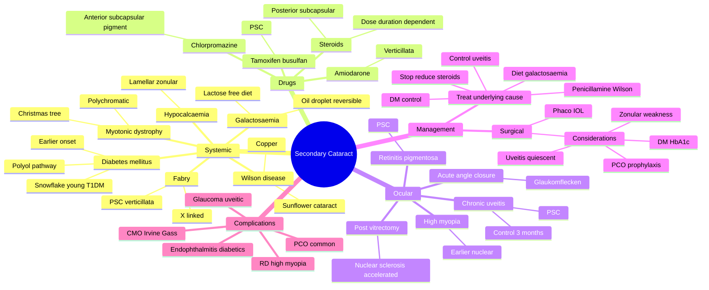

# Secondary Cataract

Related: [[Age-related Cataract]], [[Diabetes Mellitus (Ocular)]], [[Anterior Uveitis (Iritis)]]

> [!tip] **FCPS/MRCP Priority: HIGH**
> Cataract due to specific identifiable cause (DM, steroids, uveitis, etc.). Often posterior subcapsular. Treat underlying cause and the cataract. **Steroid-induced PSC is dose- and duration-dependent**; myotonic dystrophy = Christmas tree cataract; Wilson = sunflower cataract.

---

## Learning Objectives
- [ ] Define secondary cataract and differentiate from primary (age-related) cataract
- [ ] List the major systemic, drug-related, and ocular causes
- [ ] Describe the characteristic cataract patterns (PSC, snowflake, Christmas tree, sunflower, oil-droplet, lamellar)
- [ ] Identify reversible causes (galactosaemia) and treat them promptly
- [ ] Discuss steroid-induced cataract and dose-related risk
- [ ] Outline management: treat underlying + surgical removal
- [ ] Counsel patients on disease-related and drug-related risks

---

## 1. Definition / Epidemiology / Classification

### Definition
- **Secondary cataract:** Lens opacity due to a specific identifiable cause — systemic disease, drug, ocular disease, or trauma
- Distinguished from **primary (age-related) cataract** which has no specific identifiable cause beyond ageing
- Often presents **earlier** than age-related cataract
- May be **bilateral** in systemic causes (DM, steroids, myotonic dystrophy, galactosaemia)

### Epidemiology
- Diabetes mellitus: 2–5× increased risk of cataract; earlier onset (10–15 years)
- Steroid-induced: dose and duration related; ~15% of patients on long-term oral steroids; up to 50% on high-dose inhaled
- Uveitis: PSC in 20–30% of chronic anterior uveitis
- Myotonic dystrophy: nearly all patients develop characteristic cataract by age 50

### Classification (by cause)
- **Systemic (metabolic, genetic, others)**
- **Drug-induced**
- **Ocular (inflammatory, structural, post-surgical)**
- **Traumatic** (see Traumatic Cataract file)

---

## 2. Causes / Pathophysiology

### Systemic Causes

| Cause | Characteristic Cataract | Pathophysiology |
|-------|------------------------|-----------------|
| **Diabetes mellitus** | Bilateral, earlier onset, "snowflake" (young T1DM), cortical/PSC | Polyol pathway (aldose reductase) → sorbitol accumulation → osmotic hydration |
| **Galactosaemia** | "Oil-droplet" (reversible with diet) | Galactitol accumulation in lens |
| **Hypocalcaemia** (hypoparathyroidism, pseudohypoparathyroidism) | Lamellar (zonular) | Disturbance of calcium-dependent lens metabolism |
| **Myotonic dystrophy** | "Christmas tree" — polychromatic crystals, posterior subcapsular | Altered ion transport; early onset |
| **Wilson disease** | "Sunflower" cataract (copper deposition) | Copper deposition in anterior capsule |
| **Fabry disease** | Cornea verticillata + posterior subcapsular cataract | X-linked; α-galactosidase A deficiency |
| **Down syndrome** | Congenital/early cataract | Genetic |
| **Marfan / homocystinuria** | Ectopia lentis (lens subluxation) | Zonular weakness |

### Drug-Induced Causes

| Drug | Characteristic Cataract | Notes |
|------|------------------------|-------|
| **Corticosteroids** (systemic, topical, inhaled high-dose) | **Posterior subcapsular (PSC)** — dose- and duration-dependent | Most common drug cause; >10 mg/day prednisolone >1 year |
| **Antipsychotics** (chlorpromazine) | Anterior subcapsular pigment (stellate) | Yellow-brown deposits |
| **Statins** | Possible increased risk of cataract | Rare; debated |
| **Amiodarone** | Corneal verticillata + anterior subcapsular deposits | "Whorl-like" |
| **Busulfan, tamoxifen** | PSC or anterior subcapsular | Chemotherapy drugs |
| **Gold** (chrysotherapy) | Anterior capsular deposits (chrysiasis) | Rare |
| **Phenothiazines** | Similar to chlorpromazine | |

### Ocular Causes

- **Chronic anterior uveitis** (especially JIA — juvenile idiopathic arthritis)
- **High myopia** — nuclear sclerosis, earlier onset
- **Retinitis pigmentosa** — PSC
- **Chronic retinal detachment**
- **Intraocular tumours** (e.g., melanoma, retinoblastoma in adults)
- **Previous ocular surgery** (especially pars plana vitrectomy — accelerated nuclear sclerosis)
- **Trauma** (see Traumatic Cataract)
- **Acute angle closure** — glaukomflecken (small anterior subcapsular opacities)
- **Persistent fetal vasculature (PFV)**

### Pathophysiology
- **DM/galactosaemia:** polyol pathway — aldose reductase converts glucose/galactose to sorbitol/galactitol → intracellular osmotic stress
- **Steroids:** direct effect on lens epithelial cells; disrupts Na+/K+ ATPase; reduces crystallin synthesis
- **Uveitis:** inflammation causes posterior synechiae, iris bombe, lens epithelial damage
- **UV/radiation:** oxidative damage to lens proteins and DNA
- **Genetic mutations** in crystallins (α, β, γ) — protein aggregation

---

## 3. Clinical Features

### History
- **Underlying disease** (DM, myotonic dystrophy, Wilson, hypoparathyroidism)
- **Drug history** — steroids (dose, route, duration), antipsychotics, amiodarone, tamoxifen
- **Ocular history** — uveitis, myopia, RP, prior surgery
- **Family history** — hereditary causes
- **Bilateral, gradual painless decrease in vision**
- **Glare, photophobia** (PSC)
- **Reading difficulty** (PSC — central)
- Systemic features of underlying disease

### Examination
- **Visual acuity** (often disproportionately reduced for the lens opacity in PSC)
- **Slit-lamp findings (specific patterns):**
  - **PSC** — vacuoles and granular opacity at the posterior pole
  - **Snowflake** — fine white subcapsular opacities (T1DM young)
  - **Christmas tree** — polychromatic, iridescent crystals in the cortex (myotonic dystrophy)
  - **Sunflower** — golden-brown petal-like anterior capsular deposits (Wilson)
  - **Oil-droplet** — central refractive opacity (galactosaemia)
  - **Lamellar (zonular)** — shell-like opacity with clear centre (hypocalcaemia, galactosaemia)
- Signs of underlying disease:
  - DM: retinopathy, microaneurysms, dot-blot haemorrhages
  - Uveitis: KP, cells, flare, synechiae
  - Myotonic dystrophy: ptosis, frontal balding, myotonia, cataracts
  - Wilson: Kayser-Fleischer ring, hepatic signs, neurological signs
  - Hypoparathyroidism: tetany, Chvostek sign

---

## 4. Investigations

### Mandatory
- **Detailed drug history**
- **Systemic evaluation** for underlying disease
- **Slit-lamp examination** for specific pattern

### Systemic Workup (directed)
- **Fasting glucose, HbA1c** (DM)
- **Serum calcium, phosphate, PTH** (hypoparathyroidism)
- **Serum ceruloplasmin, 24-hour urinary copper, slit-lamp Kayser-Fleischer** (Wilson disease)
- **Creatine kinase, EMG** (myotonic dystrophy)
- **Genetic testing** (if suspected hereditary)
- **α-galactosidase A** (Fabry, males)

### Ocular Investigations
- **Dilated fundus examination** — diabetic retinopathy, RP changes, RD
- **OCT macula** — to assess macular oedema (DM, uveitis)
- **B-scan** — if fundus not visible
- **Anterior segment OCT** — morphology

---

## 5. Differential Diagnosis

| Condition | Distinguishing Features |
|-----------|------------------------|
| **Age-related (primary) cataract** | No identifiable cause beyond age; later onset |
| **Traumatic cataract** | History of trauma; unilateral; associated signs |
| **Congenital cataract** | Present at birth, hereditary/syndromic associations |
| **Posterior capsular opacification (PCO)** | After cataract surgery |
| **Subluxated lens** | Ectopia lentis (Marfan, homocystinuria) |
| **Complicated cataract from uveitis** | Uveitic cells/KP, synechiae |

---

## 6. Management

### General Principles
1. **Treat underlying cause** (DM control, stop/reduce steroids, treat uveitis)
2. **Surgical removal + IOL** when visually significant and patient symptomatic
3. **Address risk factors** (smoking, UV, steroids)

### Specific Treatments

#### Diabetes Mellitus
- **Optimise glycaemic control** (HbA1c target)
- Surgery when visually significant
- Pre-op: optimise DM, treat retinopathy
- Post-op: monitor for macular oedema (Irvine-Gass syndrome), infection risk

#### Steroid-Induced
- **Reduce dose or stop** if possible (under physician guidance)
- **Switch to non-steroidal** immunosuppressant if possible
- Cataract may improve slightly on stopping/lower dose
- Surgical removal + IOL when symptomatic

#### Uveitic Cataract
- **Control inflammation** for at least 3 months before surgery
- Topical/periocular/systemic steroids as needed
- Pre-op: rule out active uveitis, treat macular oedema
- Surgical removal + IOL; **caution** in JIA (high PCO, membranes)
- Consider primary posterior capsulotomy + anterior vitrectomy (children)
- Post-op: aggressive steroid; monitor for CMO, recurrence

#### Myotonic Dystrophy
- Genetic counselling
- Surgical removal when visually significant
- Anaesthetic precautions (cardiac, respiratory)

#### Wilson Disease
- Penicillamine, trientine, zinc therapy
- Ocular features may improve with treatment
- Surgical removal if visually significant

#### Galactosaemia
- **Strict lactose-free (galactose-free) diet**
- May reverse cataract if treated early
- Genetic counselling

#### Hypocalcaemia
- Calcium and vitamin D supplementation
- Treat underlying cause (hypoparathyroidism)

### Surgical
- **Standard phacoemulsification + IOL** (most cases)
- **Combined with PPV** if posterior segment pathology
- **Femtosecond laser-assisted** in selected cases
- Considerations:
  - **Smaller pupil** in uveitic — use iris hooks
  - **Posterior synechiae** — lyse before surgery
  - **Zonular weakness** (high myopia, trauma) — capsular tension ring
  - **DM** — higher risk of CMO, endophthalmitis
  - **Steroid cover** peri-operatively in uveitis

### Pre-operative Optimisation
- HbA1c <8.5% if possible
- Control uveitis for 3 months quiescent
- Treat any active infection
- Stop anticoagulants if safe

---

## 7. Complications

### Disease-related
- **Diabetic retinopathy progression** after surgery
- **Macular oedema** (especially Irvine-Gass)
- **Recurrent uveitis** post-operatively
- **Glaucoma** (uveitic, steroid-induced)

### Surgery-related (higher than primary cataract)
- **Posterior capsular opacification (PCO)** — more common in younger, uveitic, diabetic
- **Cystoid macular oedema (CMO / Irvine-Gass syndrome)**
- **Endophthalmitis** (slightly higher in diabetics)
- **Secondary glaucoma**
- **IOL dislocation/decentration** (high myopia, zonular loss)
- **Retinal detachment** (high myopia)
- **Pupil capture, synechiae** (uveitic)

### Long-term
- Progression of underlying disease
- Bilateral progression (systemic causes)

---

## 8. Red Flags / Emergencies

- **Acute painful red eye with hypopyon** in a diabetic — consider endophthalmitis
- **Sudden vision loss post-op** — RD, endophthalmitis, suprachoroidal haemorrhage
- **Active uveitis at time of planned surgery** — defer and control inflammation
- **Uncontrolled DM** (HbA1c >10%) — defer elective surgery
- **Sudden lens subluxation in a young patient** — think Marfan, homocystinuria
- **Sunflower cataract in a child** — think Wilson disease
- **Christmas tree cataract** — always think myotonic dystrophy
- **Bilateral PSC in a young adult** — check drug history (steroids)

---

## 9. FCPS/MRCP High-Yield Summary

| Cause | Type of Cataract | Pearl |
|-------|------------------|-------|
| **Diabetes mellitus** | Snowflake (young T1DM), cortical/PSC, earlier onset | Polyol pathway, aldose reductase |
| **Steroids** | **Posterior subcapsular (PSC)** | Dose and duration dependent; >10 mg/day >1 year |
| **Uveitis** | PSC / anterior subcapsular | Control inflammation 3 months before surgery |
| **Myotonic dystrophy** | "Christmas tree" — polychromatic crystals | AD; frontal balding, ptosis, myotonia |
| **Wilson disease** | "Sunflower" cataract (copper) | Kayser-Fleischer ring; treat with penicillamine |
| **Galactosaemia** | "Oil-droplet" (reversible) | Lactose-free diet reverses lens opacity |
| **Hypocalcaemia** | Lamellar (zonular) | Tetany, Chvostek sign |
| **Fabry disease** | PSC + cornea verticillata | X-linked; angiokeratoma, neuropathic pain |
| **Chlorpromazine** | Anterior subcapsular pigment | Long-term use |
| **Acute angle closure** | Glaukomflecken | Small anterior subcapsular opacities |

---

## 10. Viva Questions

1. **Q:** What is the typical steroid-induced cataract?
   **A:** Posterior subcapsular cataract (PSC), dose- and duration-dependent. May improve slightly on stopping or reducing the steroid.

2. **Q:** What is a "snowflake" cataract?
   **A:** Bilateral, fine, white subcapsular opacities seen in young type 1 diabetics. May progress rapidly.

3. **Q:** What is a Christmas tree cataract and which condition is it associated with?
   **A:** Polychromatic, iridescent crystals in the lens cortex — pathognomonic of myotonic dystrophy.

4. **Q:** What is a sunflower cataract?
   **A:** Golden-brown petal-like anterior capsular deposits due to copper deposition — associated with Wilson disease and intraocular copper foreign bodies (chalcosis).

5. **Q:** How should uveitic cataract be managed?
   **A:** Control inflammation for at least 3 months before surgery; peri-operative steroids; consider primary posterior capsulotomy + anterior vitrectomy in children; surgery technically more challenging.

6. **Q:** How does galactosaemia cause cataract?
   **A:** Galactose → galactitol via aldose reductase → accumulates in lens → osmotic hydration → "oil-droplet" cataract. Reversible with lactose-free diet if treated early.

7. **Q:** What is the drug with the most cataractogenic potential?
   **A:** Corticosteroids — chronic use, especially systemic >10 mg/day prednisolone equivalent for >1 year.

---

## 11. Common Confusions / Exam Traps

| Confusion | Clarification |
|-----------|---------------|
| "Steroid cataract is reversible" | **Rarely** improves on stopping; surgery is usually needed |
| "Snowflake cataract is in adult diabetics" | Snowflake is in **young T1DM**; adult diabetics have earlier cortical/PSC |
| "Christmas tree is age-related" | **Christmas tree is pathognomonic of myotonic dystrophy** (genetic, systemic) |
| "Wilson cataract is permanent" | May **improve** with chelation therapy (penicillamine) |
| "All diabetics need pre-op insulin" | Optimise, not always insulin — depends on type and control |
| "Uveitic cataract can be operated on anytime" | **No** — must be quiescent for ≥3 months |
| "Inhaled steroids don't cause cataract" | **Yes** — high-dose inhaled steroids can cause PSC |
| "Glaukomflecken is glaucoma" | Glaukomflecken = small anterior subcapsular opacities **after acute angle closure** (not a glaucoma sign per se) |
| "Antipsychotics always cause cataract" | Chlorpromazine causes anterior subcapsular pigment deposits, not all antipsychotics |

---

## 12. Mnemonics

1. **"DM = SCARLY"** — Diabetes: Snowflake (young T1DM), Cortical/PSC, Accelerated (earlier), Retinopathy, Lens (bilateral) — Y for "Young"
2. **"STEROID = PSC"** — Steroid-induced cataract is **Posterior Subcapsular** (dose & duration related)
3. **"Myotonic = Christmas Tree"** — Myotonic dystrophy = Christmas tree cataract (polychromatic crystals)
4. **"Wilson = Sunflower"** — Wilson disease = Sunflower cataract (copper deposition)
5. **"Glaucoma attack = Glaukomflecken"** — Acute angle closure → small anterior subcapsular opacities (glaukomflecken)

---

## 13. Mind Map

---

## 14. One-Page Revision Card

| **Topic** | **Secondary Cataract** |
|-----------|------------------------|
| **Definition** | Cataract with identifiable cause (systemic, drug, ocular) |
| **Most common drug cause** | **Corticosteroids** → **PSC** (dose & duration dependent) |
| **Snowflake cataract** | Young T1DM — bilateral fine white subcapsular |
| **Christmas tree cataract** | **Myotonic dystrophy** — polychromatic crystals |
| **Sunflower cataract** | **Wilson disease** (copper) or **chalcosis** (IOFB copper) |
| **Oil-droplet cataract** | **Galactosaemia** — **reversible** with lactose-free diet |
| **Lamellar (zonular) cataract** | Hypocalcaemia (hypoparathyroidism) |
| **Glaukomflecken** | Post acute angle closure — small anterior subcapsular |
| **Uveitic cataract management** | Control inflammation **≥3 months** before surgery |
| **DM cataract management** | Optimise glycaemic control; surgery when symptomatic |
| **Viva Pearl** | "Steroid = PSC"; "Christmas tree = Myotonic"; "Sunflower = Wilson" |

---

## Spaced Repetition Trackers

### 24-Hour Recall Prompts
- [ ] Define secondary cataract and list 3 main categories of causes
- [ ] Identify the characteristic cataract pattern for steroids, DM, myotonic dystrophy, and Wilson disease
- [ ] State the reversible cause of secondary cataract and its treatment
- [ ] Describe the management principles of uveitic cataract
- [ ] List 3 high-yield "named" cataracts (snowflake, Christmas tree, sunflower)

### Revision Schedule
- [ ] **Day 1** completed (creation + 24h recall)
- [ ] **Day 3** revision completed
- [ ] **Day 7** revision completed
- [ ] **Day 15** revision completed
- [ ] **Day 30** revision completed
- [ ] **Day 90** revision completed

---

## Must Know / Should Know / Nice to Know

### Must Know (Core for passing)
- [x] Definition of secondary cataract
- [x] **Steroid-induced PSC** — most common drug cause (dose & duration)
- [x] **DM** — earlier onset, snowflake in young T1DM, cortical/PSC in adults
- [x] **Myotonic dystrophy = Christmas tree cataract** (polychromatic crystals)
- [x] **Wilson disease = Sunflower cataract** (copper)
- [x] **Galactosaemia = Oil-droplet cataract (reversible with diet)**
- [x] Uveitic cataract — control inflammation 3 months before surgery

### Should Know (High probability)
- [x] Polyol pathway mechanism (DM, galactosaemia)
- [x] Hypocalcaemia causes lamellar cataract
- [x] Chlorpromazine — anterior subcapsular pigment
- [x] Acute angle closure → glaukomflecken
- [x] Post-vitrectomy nuclear sclerosis
- [x] Fabry disease — cornea verticillata + PSC

### Nice to Know (Differentiator)
- [ ] High-dose inhaled steroids and PSC
- [ ] Tamoxifen, busulfan — PSC risk
- [ ] Gold (chrysiasis) — anterior capsular deposits
- [ ] Amiodarone — verticillata + anterior subcapsular

---

## My Weak Points
- [ ] Add personal weak areas here

---

## Self-Test Scorecard

| Section | Score /5 |
|---------|----------|
| Understanding: | /10 |
| Recall: | /10 |
| MCQ Performance: | /10 |
| SBA Performance: | /10 |
| Viva Confidence: | /10 |
| Total: | /50 |

> [!tip] **Interpretation:** <35 = weak topic, 35–44 = acceptable but insecure, 45+ = strong exam-ready topic.

---

## Exam Answer Modes

### Long Answer Skeleton
1. **Definition** — lens opacity due to identifiable cause (systemic, drug, ocular)
2. **Systemic causes** — DM (polyol pathway), galactosaemia (reversible), myotonic dystrophy (Christmas tree), Wilson (sunflower), hypocalcaemia (lamellar), Fabry
3. **Drug causes** — Steroids (PSC, dose/duration), chlorpromazine (anterior subcapsular pigment), amiodarone, tamoxifen
4. **Ocular causes** — Uveitis (PSC), high myopia, RP, post-vitrectomy, acute angle closure (glaukomflecken)
5. **Management** — Treat underlying (DM control, stop/reduce steroids, control uveitis, penicillamine for Wilson, diet for galactosaemia); surgical removal + IOL when visually significant
6. **Complications** — PCO, CMO, endophthalmitis, RD, glaucoma

### Short Note Skeleton
- Definition + categories of causes
- Steroid = PSC (dose & duration)
- Christmas tree = myotonic dystrophy
- Sunflower = Wilson disease
- Treat underlying + surgical removal

### Viva One-Liners
- **Q:** Steroid-induced cataract type? → **A:** Posterior subcapsular (PSC) — dose and duration dependent
- **Q:** Christmas tree cataract association? → **A:** Myotonic dystrophy
- **Q:** Sunflower cataract association? → **A:** Wilson disease (or chalcosis from copper IOFB)
- **Q:** Reversible secondary cataract? → **A:** Galactosaemia — oil-droplet, reversed by lactose-free diet
- **Q:** Snowflake cataract? → **A:** Young type 1 diabetics — bilateral fine white subcapsular opacities
- **Q:** Uveitic cataract — when to operate? → **A:** After ≥3 months of inflammation control

### Ward-Case Discussion Points
- Take detailed drug history (steroids, antipsychotics, amiodarone)
- Recognise "named" cataract patterns and their associations
- Investigate underlying cause (DM, calcium, Wilson, myotonic)
- Optimise medical control before surgery
- Counsel patient on disease-related cataract risk
- Address reversible causes urgently (galactosaemia, hypocalcaemia)

### Last-Night-Before-Exam Sheet
- **Top 5 facts:** Steroid = PSC; Myotonic = Christmas tree; Wilson = Sunflower; Galactosaemia = Oil-droplet (reversible); DM = earlier + snowflake (young T1DM)
- **3 mnemonics:** "STEROID = PSC"; "Myotonic = Christmas Tree"; "Wilson = Sunflower"
- **Must-know named cataracts:** Snowflake, Christmas tree, Sunflower, Oil-droplet, Lamellar, Glaukomflecken
- **Viva:** Most common drug cause = steroids; Reversible = galactosaemia; Christmas tree = myotonic dystrophy

---

## Summary

Secondary cataract is a lens opacity due to an identifiable cause — **systemic (DM, galactosaemia, myotonic dystrophy, Wilson, hypocalcaemia, Fabry), drug-induced (steroids, chlorpromazine, amiodarone, tamoxifen), or ocular (uveitis, high myopia, RP, post-vitrectomy, acute angle closure).** Often **posterior subcapsular** in distribution. **Steroids** cause PSC in a dose- and duration-dependent manner. **Myotonic dystrophy** causes the pathognomonic "Christmas tree" cataract. **Wilson disease** causes "sunflower" cataract (copper deposition). **Galactosaemia** causes "oil-droplet" cataract, which is **reversible with a strict lactose-free diet**. Management requires **treating the underlying cause** (DM control, stop/reduce steroids, control uveitis ≥3 months, penicillamine for Wilson, diet for galactosaemia) and **surgical removal + IOL** when visually significant. Surgical complications are higher than primary cataract (PCO, CMO, endophthalmitis, RD).

---

## MCQs (10)

1. **Question:** Steroid-induced cataract is typically:
   **Options:** A. Nuclear B. Cortical C. **Posterior subcapsular** D. Anterior polar E. Lamellar
   **Answer:** C
   **Explanation:** Corticosteroid-induced cataract is the classic posterior subcapsular (PSC) — dose- and duration-dependent.

2. **Question:** "Christmas tree" cataract (polychromatic crystals in the lens) is pathognomonic of:
   **Options:** A. Diabetes mellitus B. Myotonic dystrophy C. Wilson disease D. Galactosaemia E. Steroid use
   **Answer:** B
   **Explanation:** Polychromatic iridescent crystals in the cortex = Christmas tree cataract, pathognomonic of myotonic dystrophy.

3. **Question:** "Sunflower" cataract is associated with:
   **Options:** A. Diabetes B. Myotonic dystrophy C. **Wilson disease (copper deposition)** D. Galactosaemia E. Fabry disease
   **Answer:** C
   **Explanation:** Sunflower cataract is due to copper deposition in the anterior lens capsule — Wilson disease (systemic copper overload) or chalcosis (copper IOFB).

4. **Question:** Which of the following secondary cataracts is reversible with treatment of the underlying cause?
   **Options:** A. Steroid-induced PSC B. Myotonic Christmas tree C. **Galactosaemia oil-droplet** D. Uveitic PSC E. Diabetic cortical
   **Answer:** C
   **Explanation:** Galactosaemia cataract is reversible with strict lactose-free diet if treated early — one of the few reversible cataracts.

5. **Question:** Snowflake cataract is characteristically seen in:
   **Options:** A. Elderly type 2 diabetics B. **Young type 1 diabetics** C. Patients on steroids D. Wilson disease E. Myotonic dystrophy
   **Answer:** B
   **Explanation:** Snowflake cataract — bilateral fine white subcapsular opacities in young T1DM; can progress rapidly.

6. **Question:** The polyol pathway (aldose reductase) is the key biochemical mechanism in cataract formation for which conditions?
   **Options:** A. Steroid and Wilson disease B. **Diabetes mellitus and galactosaemia** C. Myotonic and Fabry D. Uveitis and RP E. None
   **Answer:** B
   **Explanation:** Aldose reductase converts glucose/galactose to sorbitol/galactitol → osmotic hydration → lens fibre swelling (DM, galactosaemia).

7. **Question:** Uveitic cataract surgery should ideally be performed:
   **Options:** A. Immediately at diagnosis B. During active inflammation for best visualisation C. **After at least 3 months of controlled/quiescent inflammation** D. Only after cataract is mature E. Never
   **Answer:** C
   **Explanation:** Active uveitis at surgery → high risk of recurrence, CMO, synechiae, PCO. Wait for ≥3 months quiescence.

8. **Question:** Lamellar (zonular) cataract is characteristically seen in:
   **Options:** A. Diabetes B. **Hypocalcaemia (hypoparathyroidism)** C. Myotonic dystrophy D. Wilson E. Steroid use
   **Answer:** B
   **Explanation:** Hypocalcaemia (often from hypoparathyroidism or pseudohypoparathyroidism) causes classic lamellar/zonular cataract.

9. **Question:** Anterior subcapsular pigment deposits in a patient on long-term antipsychotic medication are most likely due to:
   **Options:** A. Haloperidol B. **Chlorpromazine** C. Risperidone D. Olanzapine E. Quetiapine
   **Answer:** B
   **Explanation:** Chlorpromazine (phenothiazine) is the classic antipsychotic causing anterior subcapsular yellow-brown pigment deposits.

10. **Question:** Glaukomflecken refers to:
    **Options:** A. Pigment dispersion in angle B. **Small anterior subcapsular opacities after acute angle closure** C. Retinal nerve fibre layer haemorrhage D. Corneal oedema E. Iris atrophy
    **Answer:** B
    **Explanation:** Glaukomflecken are small anterior subcapsular lens opacities following an attack of acute angle closure glaucoma — pathognomonic.

---

## SBA Questions (10)

1. **Scenario:** A 55-year-old woman on long-term oral prednisolone (15 mg/day for 2 years) for rheumatoid arthritis presents with bilateral gradual painless vision loss. Examination shows bilateral posterior subcapsular cataracts.
   **Question:** What is the most likely cause?
   **Options:** A. Age-related cataract B. **Steroid-induced PSC** C. Diabetic cataract D. Uveitic cataract E. Galactosaemia
   **Answer:** B
   **Explanation:** Long-term moderate-to-high-dose oral steroids cause bilateral PSC — dose- and duration-dependent.

2. **Scenario:** A 40-year-old man with frontal balding, ptosis, and grip myotonia presents with bilateral early cataracts. Slit-lamp shows polychromatic, iridescent crystals in the lens cortex.
   **Question:** What is the most likely diagnosis?
   **Options:** A. Steroid-induced cataract B. Wilson disease C. **Myotonic dystrophy** D. Galactosaemia E. Diabetes
   **Answer:** C
   **Explanation:** Polychromatic ("Christmas tree") cataract + myotonia + frontal balding + ptosis = myotonic dystrophy (autosomal dominant).

3. **Scenario:** A 25-year-old presents with Kayser-Fleischer rings, hepatic dysfunction, and a golden-brown petal-like opacity in the anterior lens capsule.
   **Question:** What is the most likely diagnosis?
   **Options:** A. Myotonic dystrophy B. **Wilson disease (sunflower cataract)** C. Galactosaemia D. Diabetes E. Steroid use
   **Answer:** B
   **Explanation:** Sunflower cataract + Kayser-Fleischer rings = Wilson disease (copper deposition).

4. **Scenario:** A 2-week-old infant develops feeding intolerance, jaundice, hepatomegaly, and bilateral cataracts. Urine shows a non-glucose reducing substance.
   **Question:** What is the most appropriate immediate management?
   **Options:** A. Lensectomy within 6 weeks B. **Immediate lactose-free (galactose-free) diet** C. Topical steroid D. IV antibiotics E. Genetic counselling only
   **Answer:** B
   **Explanation:** Galactosaemia — strict lactose-free diet prevents/reverses cataract and prevents E. coli sepsis.

5. **Scenario:** A 14-year-old girl with juvenile idiopathic arthritis (JIA) on methotrexate has chronic anterior uveitis with bilateral PSC. Vision is now 6/36 bilaterally.
   **Question:** What is the next step before cataract surgery?
   **Options:** A. Proceed with surgery immediately B. **Control inflammation for ≥3 months, then operate** C. Stop methotrexate D. Start cyclosporine E. Avoid surgery
   **Answer:** B
   **Explanation:** Uveitic cataract surgery should be done when uveitis has been quiescent for ≥3 months to reduce recurrence, CMO, and PCO risk.

6. **Scenario:** A 45-year-old woman on long-term chlorpromazine for schizophrenia is found to have anterior subcapsular pigment deposits in both lenses.
   **Question:** What is the most appropriate management?
   **Options:** A. Stop chlorpromazine immediately B. Surgery C. **Discuss with psychiatrist; consider switching; surgery when symptomatic** D. Topical steroid E. Observation only
   **Answer:** C
   **Explanation:** Chlorpromazine-induced deposits rarely resolve on stopping; discuss switching with psychiatrist; surgery when visually significant.

7. **Scenario:** A 60-year-old with diabetes mellitus (HbA1c 9.5%) presents with bilateral cortical cataracts and vision 6/60. He is planned for cataract surgery.
   **Question:** What is the most appropriate pre-operative step?
   **Options:** A. Proceed with surgery immediately B. **Optimise glycaemic control (HbA1c <8.5%)** C. Avoid surgery D. Start insulin E. Stop metformin
   **Answer:** B
   **Explanation:** Poorly controlled DM increases risk of endophthalmitis, CMO, and poor wound healing. Optimise before surgery.

8. **Scenario:** A patient presents with bilateral PSC and history of chronic anterior uveitis for 5 years. Examination shows posterior synechiae and pigmented KPs.
   **Question:** What is the most likely cause of the cataract?
   **Options:** A. Age-related B. Steroid-induced C. **Chronic uveitis (complicated cataract)** D. Diabetic E. Galactosaemia
   **Answer:** C
   **Explanation:** "Complicated cataract" of chronic uveitis is typically posterior subcapsular; associated with synechiae and KPs.

9. **Scenario:** A patient with chronic hypoparathyroidism develops gradual vision loss. Slit-lamp shows a shell-like opacity surrounding a clear nucleus.
   **Question:** What type of cataract is this?
   **Options:** A. Snowflake B. Christmas tree C. Sunflower D. **Lamellar (zonular)** E. Oil-droplet
   **Answer:** D
   **Explanation:** Lamellar/zonular cataract — shell-like opacity around a clear centre; classically associated with hypocalcaemia (hypoparathyroidism).

10. **Scenario:** A patient develops anterior subcapsular lens opacities 2 weeks after an acute attack of angle closure glaucoma. The IOP has been controlled.
    **Question:** What is the most likely diagnosis?
    **Options:** A. Steroid-induced B. **Glaukomflecken** C. Uveitic D. Diabetic E. None
    **Answer:** B
    **Explanation:** Glaukomflecken — small anterior subcapsular lens opacities after acute angle closure; pathognomonic.

---

## Flashcards

- **Q:** What is the most common drug-induced secondary cataract and which type?
  **A:** Corticosteroids → **posterior subcapsular (PSC)**, dose- and duration-dependent.
- **Q:** What is the characteristic cataract of myotonic dystrophy?
  **A:** "Christmas tree" cataract — polychromatic, iridescent crystals in the lens cortex.
- **Q:** What is the characteristic cataract of Wilson disease?
  **A:** "Sunflower" cataract — golden-brown petal-like anterior capsular deposits (copper).
- **Q:** Which secondary cataract is reversible with treatment?
  **A:** **Galactosaemia** — "oil-droplet" cataract; reverses with strict lactose-free diet.
- **Q:** When should uveitic cataract be operated on?
  **A:** After inflammation has been controlled for at least 3 months.

---

## Answer Key with Explanations

### MCQs
1. **C** — Steroid-induced PSC is the classic drug cause
2. **B** — Christmas tree cataract = myotonic dystrophy (polychromatic crystals)
3. **C** — Sunflower cataract = Wilson disease (copper)
4. **C** — Galactosaemia cataract is reversible with diet
5. **B** — Snowflake cataract = young T1DM
6. **B** — Polyol pathway (aldose reductase) — DM and galactosaemia
7. **C** — Uveitic cataract needs ≥3 months of inflammation control
8. **B** — Hypocalcaemia causes lamellar (zonular) cataract
9. **B** — Chlorpromazine is the classic antipsychotic causing anterior subcapsular deposits
10. **B** — Glaukomflecken = post-acute angle closure anterior subcapsular opacities

### SBAs
1. **B** — Long-term high-dose oral steroids → bilateral PSC
2. **C** — Polychromatic crystals + myotonia + balding + ptosis = myotonic dystrophy
3. **B** — Sunflower cataract + Kayser-Fleischer ring = Wilson disease
4. **B** — Galactosaemia → immediate lactose-free diet
5. **B** — Uveitic cataract → control inflammation ≥3 months before surgery
6. **C** — Chlorpromazine deposits rarely reverse; discuss with psychiatrist; surgery if symptomatic
7. **B** — Optimise DM control (HbA1c <8.5%) before surgery
8. **C** — Complicated cataract of chronic uveitis = PSC + synechiae
9. **D** — Lamellar/zonular cataract = hypocalcaemia (hypoparathyroidism)
10. **B** — Glaukomflecken after acute angle closure

---

## Tags
#medicine #davidson #ophthalmology #secondary #cataract #fcps #mrcp #diabetes #steroids #uveitis #myotonic-dystrophy #wilson-disease #galactosaemia

## PasTest Scenario SBAs (Clinical Vignettes)

> **Auto-generated PasTest/Mediscope-style scenario SBAs** grounded in the authored source. Each scenario tests a real clinical fact (triad, specific sign, contraindication, trial, first-line Rx) extracted from the topic. *Source: Ch 28: Medical Ophthalmology — Secondary Cataract*

**Q1.** Which of the following features is most specific or characteristic of Secondary Cataract?

  - **A.** Slit-lamp examination
  - **B.** A feature common to many acute inflammatory conditions
  - **C.** A non-specific sign that does not localise the diagnosis
  - **D.** An investigation finding rather than a clinical feature

  > **Answer: A** — Slit-lamp examination
  >
  > *Source:* n

---
### Mandatory
- **Detailed drug history**
- **Systemic evaluation** for underlying disease
- **Slit-lamp examination** for specific pattern

### Systemic Workup (directed)
- **Fasting glucose, 

**Q2.** What is the most appropriate first-line therapy for Secondary Cataract?

  - **A.** Smaller pupil
  - **B.** An advanced/surgical therapy reserved for refractory disease
  - **C.** Symptomatic treatment only, no disease-modifying therapy
  - **D.** Empiric broad-spectrum therapy without specific indication

  > **Answer: A** — Smaller pupil
  >
  > *Source:* **Smaller pupil** in uveitic — use iris hooks

