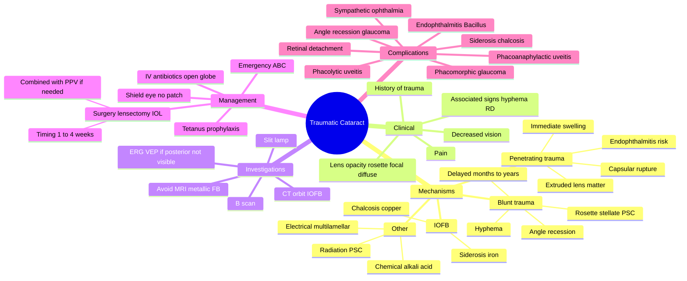

# Traumatic Cataract

Related: [[Blunt Ocular Trauma]], [[Penetrating Ocular Trauma]], [[Age-related Cataract]]

> [!tip] **FCPS/MRCP Priority: MEDIUM**
> Caused by blunt or penetrating injury. May be immediate or delayed. Often associated with other ocular injuries (corneal scar, iris, zonule, posterior segment). Rosette (stellate) PSC is the classic blunt injury pattern.

---

## Learning Objectives
- [ ] Define traumatic cataract and identify mechanisms of injury
- [ ] Differentiate blunt vs penetrating causes and their characteristic lens changes
- [ ] Recognise the typical rosette (stellate) cataract of blunt trauma
- [ ] Outline the systemic, ocular, and other physical causes of secondary/traumatic lens opacities
- [ ] Describe essential investigations (CT for IOFB, B-scan, ERG/VEP)
- [ ] Discuss management principles — timing, surgical approach, IOL
- [ ] Identify complications: phacomorphic glaucoma, phacolytic uveitis, phacoanaphylactic uveitis, RD

---

## 1. Definition / Epidemiology / Classification

### Definition
- **Traumatic cataract:** Lens opacification resulting from mechanical, chemical, electrical, or radiation injury to the eye
- Can be **immediate** (penetrating injury with capsular rupture) or **delayed** (blunt trauma — weeks to years)
- Almost always **unilateral** in young patients

### Epidemiology
- Most common cause of unilateral cataract in young patients
- Males predominate (occupational, sports, assault)
- Children: more commonly penetrating (sharp objects, toys)
- Adults: more commonly blunt (sports, RTA, assault)

### Classification
- **By mechanism:** blunt, penetrating, intraocular foreign body, electrical, chemical, radiation
- **By morphology:** rosette (stellate), posterior subcapsular, anterior capsular, cortical, total mature
- **By timing:** immediate (capsular rupture) vs delayed (months to years)

---

## 2. Mechanisms / Pathophysiology

### Blunt Trauma
- **Concussive force** transmitted through the eye — coup/contrecoup mechanism
- Causes **disruption of lens fibres** without necessarily rupturing the capsule
- **Rosette-shaped (stellate) posterior subcapsular cataract** is the most classic appearance
  - Flower-petal pattern of opacity
  - Central/paracentral posterior subcapsular
- Often **delayed** — appears weeks to years after the trauma
- May be associated with:
  - **Angle recession** (90–270°, risk of late glaucoma)
  - **Hyphema** (blood in anterior chamber)
  - **Iridodialysis** (iris tear from root)
  - **Cyclodialysis** (ciliary body separation)
  - **Vitreous haemorrhage**
  - **Commotio retinae** (Berlin oedema)
  - **Choroidal rupture**
  - **Retinal dialysis** (risk of late retinal detachment)

### Penetrating Trauma
- **Direct capsular rupture** → aqueous humour enters the lens → **rapid lens swelling and hydration**
- **Immediate** cortical opacification (white, fluffy)
- **Lens matter may extrude** into anterior chamber
- Very high risk of:
  - **Endophthalmitis** (especially with IOFB — Bacillus, Staphylococcus)
  - **Suppurative inflammation**
  - **Posterior segment injury**

### Intraocular Foreign Body (IOFB)
- Metallic FB:
  - **Iron (siderosis bulbi)** — chronic iron deposition → brownish cataract, retinal toxicity, optic atrophy
  - **Copper (chalcosis)** — sunflower cataract, Kayser-Fleischer-like ring
- Organic FB (wood, vegetable matter) — high endophthalmitis risk
- Glass, plastic — relatively inert

### Other Physical Causes
- **Electrical injury** — multilamellar cataract (delayed — months)
- **Chemical injury** — especially alkali (penetrates, coagulates); acid (coagulates, more localised)
- **Radiation** — ionising radiation causes posterior subcapsular cataract (delayed — years)
  - IR exposure (glass-blowers, foundry workers) — anterior capsular cataract
  - UV — usually causes photokeratitis, not cataract
- **Concussive (high-velocity projectile nearby)** — can cause cataract without direct impact

### Pathophysiology
- Mechanical disruption of lens fibres
- Capsular rupture → loss of barrier function → osmotic hydration of lens cortex
- Oxidative damage from free radicals (radiation, iron, copper)
- Cellular damage to lens epithelium → opacification

---

## 3. Clinical Features

### History
- **History of trauma** — essential to elicit
- Mechanism (blunt, penetrating, IOFB, chemical, electrical, radiation)
- Time since injury
- **Pain, decreased vision**
- Discharge, photophobia (if associated inflammation/infection)
- Tetanus immunisation status (in penetrating injuries)

### Examination
- **Visual acuity** (may be markedly reduced)
- **Lens opacity** on slit-lamp:
  - **Rosette (stellate)** PSC — classic for blunt
  - **Focal** anterior capsular — focal blunt impact
  - **Diffuse cortical** — penetrating
  - **Total white/mature** — long-standing
- **Other signs of trauma:**
  - Corneal scar/laceration
  - Iris defects (iridodialysis, sphincter tears)
  - Hyphema
  - Vitreous haemorrhage
  - Angle recession (gonioscopy)
  - Retinal dialysis, commotio retinae
- **Phacolytic uveitis** (if hypermature)
- **Intraocular pressure** (may be elevated — phacomorphic glaucoma; or low — globe rupture)
- **Seidel test** (positive in corneal/scleral perforation)

---

## 4. Investigations

### Mandatory
- **Full ocular examination** — including IOP
- **Visual acuity** with best correction
- **Slit-lamp examination**
- **Dilated fundus examination** (if safe and visible)
- **B-scan ultrasonography** — if fundus not visible (assess posterior segment, RD, IOFB)

### Imaging
- **CT orbit (non-contrast, thin slices)** — for suspected IOFB
  - **Avoid MRI** if metallic FB suspected (magnetic displacement)
- **Plain X-ray orbit** — older method; less sensitive
- **Anterior segment OCT (AS-OCT)** — for lens morphology
- **Ultrasound biomicroscopy (UBM)** — for zonular integrity, IOFB localisation

### Functional Tests (when posterior segment not visible)
- **Relative Afferent Pupillary Defect (RAPD)** — bright/dark test
- **Electroretinography (ERG)** — assesses retinal function
- **Visual Evoked Potential (VEP)** — assesses optic pathway
- **Standard flash test** — gross assessment

### Microbiology
- **Aqueous/vitreous tap** if endophthalmitis suspected (Gram stain, culture)

---

## 5. Differential Diagnosis

| Condition | Distinguishing Features |
|-----------|------------------------|
| **Age-related cataract** | No history of trauma, bilateral, gradual |
| **Secondary cataract (DM, steroids, uveitis)** | Systemic features, drug history |
| **Congenital cataract** | Present at birth, no trauma history |
| **Posterior capsular opacification (PCO)** | After cataract surgery |
| **Subluxated/dislocated lens** | Ectopia lentis — Marfan, homocystinuria |
| **Lens coloboma** | Congenital inferonasal notch |
| **Persistent fetal vasculature** | Congenital, microphthalmic eye |

---

## 6. Management

### Initial / Emergency
- **ABC** of trauma
- **Tetanus prophylaxis** (in penetrating injuries)
- **Systemic antibiotics** (in open globe — IV cefazolin + gentamicin or vancomycin + ceftazidime)
- **Shield eye** (not patch) — to prevent further damage
- **Antiemetics** — to prevent Valsalva and expulsion of intraocular contents
- **Avoid pressure** on the eye
- **NPO** for potential surgery
- **Urgent ophthalmology referral**

### Conservative
- **Small, non-progressive, peripheral, not affecting vision** — observe
- Topical steroid for inflammation
- Cycloplegic (atropine) for ciliary spasm

### Surgical
- **Indications:** Visually significant opacity, swollen lens (intumescent), causing glaucoma, uveitis
- **Procedure:** **Lensectomy (lens aspiration) ± IOL implant**
- **Timing:**
  - **Open globe:** primary repair first, lens surgery 1–2 weeks later
  - **Closed globe:** wait for acute inflammation to settle (1–4 weeks)
  - **Penetrating with capsular rupture:** often early to prevent phacotoxic/phacoanaphylactic uveitis
- **Approach:**
  - Phacoemulsification (in adults)
  - Lens aspiration (in children)
  - Combined with **pars plana vitrectomy (PPV)** if posterior segment involved
  - Combined with **IOFB removal** if present
- **IOL implantation:** Primary or secondary, depends on capsular support and ocular integrity

### Post-operative
- Topical steroid + antibiotic
- Cycloplegic
- Monitor for endophthalmitis, RD, glaucoma
- Long-term follow-up for angle-recession glaucoma (decades later)

### Special Considerations
- **Siderosis/chalcosis:** Remove IOFB urgently; treat with chelation if iron
- **Endophthalmitis:** Intravitreal antibiotics (vancomycin + ceftazidime) + vitrectomy
- **Traumatic aniridia:** Iris reconstruction later

---

## 7. Complications

### Immediate
- **Endophthalmitis** — highest risk with IOFB (Bacillus cereus, coagulase-negative staph)
- **Suppurative inflammation**
- **Expulsive choroidal haemorrhage**

### Early
- **Phacomorphic glaucoma** — intumescent (swollen) lens causes angle closure
- **Phacolytic uveitis** — leakage of lens protein from hypermature cataract
- **Phacoanaphylactic uveitis (phacoantigenic)** — granulomatous reaction to exposed lens protein
- **Secondary (lens-induced) glaucoma**
- **Posterior synechiae**

### Late
- **Subluxation/dislocation of IOL** (especially if zonular loss)
- **Posterior capsular opacification (PCO)**
- **Retinal detachment** — high risk (cicatricial, traumatic)
- **Angle-recession glaucoma** — can develop decades later
- **Cystoid macular oedema (CMO)**
- **Sympathetic ophthalmia** — bilateral granulomatous panuveitis (rare, 0.2–0.5%)
- **Corneal decompensation** (especially with IOFB and inflammation)
- **Optic atrophy** (siderosis)

---

## 8. Red Flags / Emergencies

- **Open globe injury** (penetrating/rupture) — shield eye, NPO, IV antibiotics, urgent theatre
- **Hyphema** (full) — risk of corneal staining, rebleed, glaucoma
- **IOFB** — CT scan, surgical removal
- **Endophthalmitis** — pain, ↓VA, hypopyon, vitritis — intravitreal antibiotics
- **Lens-induced uveitis** — pain, KP, hypopyon, raised IOP
- **Siderosis** — progressive vision loss, heterochromia, ERG changes
- **Sympathetic ophthalmia** — bilateral panuveitis weeks to years after penetrating injury
- **Retinal detachment** — flashes, floaters, field loss

---

## 9. FCPS/MRCP High-Yield Summary

| Topic | Key Points |
|-------|------------|
| Common type | Rosette (stellate) PSC — classic for blunt trauma |
| Blunt vs penetrating | Blunt: rosette, may be delayed; Penetrating: capsular rupture, immediate |
| Associations | Angle recession, hyphema, iridodialysis, RD |
| Imaging for IOFB | **CT orbit (avoid MRI for metallic FB)** |
| Endophthalmitis | Highest risk with organic/soil-contaminated IOFB (Bacillus) |
| Treatment | Lensectomy + IOL, combined with PPV/IOFB removal as needed |
| Lens-induced complications | Phacomorphic glaucoma, phacolytic uveitis, phacoanaphylactic |
| Sympathetic ophthalmia | Bilateral granulomatous panuveitis after penetrating injury |

---

## 10. Viva Questions

1. **Q:** What is the typical appearance of blunt traumatic cataract?
   **A:** Rosette or stellate posterior subcapsular cataract (flower-petal pattern).

2. **Q:** What imaging is used to detect a metallic intraocular foreign body?
   **A:** **CT orbit** — MRI is contraindicated for metallic FB due to risk of magnetic displacement.

3. **Q:** What is the most feared complication of penetrating ocular injury with IOFB?
   **A:** **Endophthalmitis** — especially with organic/soil-contaminated foreign body (Bacillus cereus).

4. **Q:** What is the difference between phacolytic and phacoanaphylactic uveitis?
   **A:** Phacolytic = leakage of lens protein from hypermature cataract (non-granulomatous, open-angle glaucoma). Phacoanaphylactic = immune (T-cell) reaction to exposed lens protein (granulomatous, after trauma/surgery).

5. **Q:** What is sympathetic ophthalmia?
   **A:** Bilateral granulomatous panuveitis that occurs after penetrating ocular injury or surgery; risk 0.2–0.5%; can be prevented by early enucleation of severely injured blind eye (controversial).

6. **Q:** When does blunt traumatic cataract typically present?
   **A:** May be immediate or delayed — can develop months to years after the initial trauma.

---

## 11. Common Confusions / Exam Traps

| Confusion | Clarification |
|-----------|---------------|
| "MRI is best for IOFB" | **NO** — CT is gold standard; MRI is **contraindicated** for metallic FB (magnetic displacement) |
| "Traumatic cataract is always immediate" | **No** — blunt trauma cataract may be **delayed** (weeks to years) |
| "Phacolytic = phacoanaphylactic" | Different: phacolytic = leakage from hypermature (sterile); phacoanaphylactic = immune (T-cell) to lens protein after capsule rupture |
| "All traumatic cataracts need surgery" | Small, peripheral, non-progressive, asymptomatic = observe |
| "Endophthalmitis is treated with topical antibiotics only" | Requires **intravitreal antibiotics** (vancomycin + ceftazidime) + possible vitrectomy |
| "Siderosis is benign" | **NO** — leads to retinal degeneration, optic atrophy, blindness if not treated |
| "Sympathetic ophthalmia is common" | Rare (0.2–0.5%); occurs after penetrating injury, can be devastating |

---

## 12. Mnemonics

1. **"ROSETTE = BLUNT"** — Rosette/stellate PSC = blunt trauma (flower-petal lens opacity)
2. **"CAPSULAR BREAK = IMMEDIATE SWELL"** — Capsular rupture (penetrating) → immediate lens hydration
3. **"CT for FB, never MRI"** — CT is gold standard for IOFB; MRI contraindicated for metallic FB
4. **"Iron = Iron (siderosis), Copper = Sunflower (chalcosis)"** — IOFB composition determines the chronic reaction

---

## 13. Mind Map

---

## 14. One-Page Revision Card

| **Topic** | **Traumatic Cataract** |
|-----------|------------------------|
| **Definition** | Lens opacity due to mechanical, chemical, electrical, or radiation injury |
| **Most common cause** | Blunt trauma (rosette PSC) or penetrating injury |
| **Classic sign (blunt)** | **Rosette (stellate) posterior subcapsular cataract** |
| **Timing** | Blunt: may be delayed (months–years); Penetrating: immediate |
| **Imaging for IOFB** | **CT orbit** — NEVER MRI (metallic FB risk) |
| **Worst complication** | **Endophthalmitis** (Bacillus if organic FB) |
| **Lens-induced complications** | Phacomorphic glaucoma, phacolytic uveitis, phacoanaphylactic |
| **Sympathetic ophthalmia** | Bilateral granulomatous panuveitis; rare (0.2–0.5%) |
| **Treatment** | Lensectomy + IOL; combine with PPV/IOFB removal as needed |
| **Viva Pearl** | "CT for FB, never MRI"; "Rosette = Blunt" |

---

## Spaced Repetition Trackers

### 24-Hour Recall Prompts
- [ ] Define traumatic cataract and identify the classic blunt injury pattern
- [ ] List 3 mechanisms that can cause traumatic cataract
- [ ] State the imaging modality of choice for suspected metallic IOFB
- [ ] Differentiate phacolytic from phacoanaphylactic uveitis
- [ ] List 3 lens-induced complications of traumatic cataract

### Revision Schedule
- [ ] **Day 1** completed (creation + 24h recall)
- [ ] **Day 3** revision completed
- [ ] **Day 7** revision completed
- [ ] **Day 15** revision completed
- [ ] **Day 30** revision completed
- [ ] **Day 90** revision completed

---

## Must Know / Should Know / Nice to Know

### Must Know (Core for passing)
- [x] Definition and mechanisms (blunt, penetrating, IOFB)
- [x] Classic rosette (stellate) PSC in blunt trauma
- [x] Imaging: **CT for IOFB, MRI contraindicated for metallic FB**
- [x] Management principles: shield, IV antibiotics, tetanus, surgery timing
- [x] Lens-induced complications: phacomorphic glaucoma, phacolytic uveitis, phacoanaphylactic uveitis
- [x] Endophthalmitis is the most feared early complication

### Should Know (High probability)
- [x] Siderosis (iron) vs chalcosis (copper) — IOFB chronic effects
- [x] Sympathetic ophthalmia — definition and risk
- [x] Angle-recession glaucoma (can develop decades later)
- [x] RD risk (cicatricial and retinal dialysis)
- [x] B-scan and ERG/VEP role when posterior segment not visible

### Nice to Know (Differentiator)
- [ ] Electrical injury — multilamellar cataract
- [ ] Glass-blower's cataract (IR) — anterior capsular
- [ ] Radiation-induced PSC (delayed years)
- [ ] Cyclodialysis cleft management

---

## My Weak Points
- [ ] Add personal weak areas here

---

## Self-Test Scorecard

| Section | Score /5 |
|---------|----------|
| Understanding: | /10 |
| Recall: | /10 |
| MCQ Performance: | /10 |
| SBA Performance: | /10 |
| Viva Confidence: | /10 |
| Total: | /50 |

> [!tip] **Interpretation:** <35 = weak topic, 35–44 = acceptable but insecure, 45+ = strong exam-ready topic.

---

## Exam Answer Modes

### Long Answer Skeleton
1. **Definition** — lens opacification due to mechanical, chemical, electrical, or radiation injury
2. **Mechanisms** — blunt (rosette PSC), penetrating (capsular rupture, immediate swelling), IOFB (siderosis/chalcosis), electrical, chemical, radiation
3. **Clinical features** — history of trauma, ↓VA, lens opacity, associated signs (corneal scar, hyphema, iridodialysis, RD)
4. **Investigations** — full ocular exam, B-scan, CT orbit (for IOFB), ERG/VEP, microbiology if endophthalmitis
5. **Management** — emergency (ABC, shield, IV antibiotics, tetanus), surgery (lensectomy + IOL, combined with PPV/IOFB removal)
6. **Complications** — endophthalmitis, phacomorphic/phacolytic/phacoanaphylactic uveitis, RD, angle-recession glaucoma, sympathetic ophthalmia

### Short Note Skeleton
- Definition + mechanisms
- Classic rosette (stellate) PSC in blunt trauma
- CT orbit for IOFB (avoid MRI metallic)
- Lensectomy + IOL; timing depends on inflammation
- Phacolytic vs phacoanaphylactic uveitis

### Viva One-Liners
- **Q:** Classic blunt traumatic cataract appearance? → **A:** Rosette/stellate PSC
- **Q:** Imaging for metallic IOFB? → **A:** CT orbit (never MRI)
- **Q:** Phacolytic vs phacoanaphylactic? → **A:** Phacolytic = leakage from hypermature; phacoanaphylactic = immune to lens protein
- **Q:** Most feared complication of IOFB? → **A:** Endophthalmitis (Bacillus)
- **Q:** What is sympathetic ophthalmia? → **A:** Bilateral granulomatous panuveitis after penetrating injury

### Ward-Case Discussion Points
- Recognise open globe vs closed globe injury
- Elicit mechanism (blunt, penetrating, IOFB)
- Apply initial management: shield, no patch, IV antibiotics, tetanus
- Order appropriate imaging (CT not MRI for metallic FB)
- Plan surgical timing based on inflammation
- Counsel on long-term complications (RD, glaucoma, sympathetic ophthalmia)

### Last-Night-Before-Exam Sheet
- **Top 5 facts:** Rosette PSC = blunt; Capsular rupture = immediate; CT for IOFB (not MRI); Endophthalmitis (Bacillus) is worst; Phacolytic ≠ phacoanaphylactic
- **2 mnemonics:** "ROSETTE = BLUNT"; "CT for FB, never MRI"
- **Must-know complications:** Phacomorphic, phacolytic, phacoanaphylactic; Sympathetic ophthalmia; RD; Angle-recession glaucoma
- **Viva:** Classic feature, IOFB imaging, endophthalmitis risk, sympathetic ophthalmia

---

## Summary

Traumatic cataract results from blunt or penetrating ocular injury, IOFB, electrical, chemical, or radiation damage. The **classic blunt pattern is a rosette (stellate) posterior subcapsular cataract**, which may be **delayed** (months to years). Penetrating injury causes immediate capsular rupture and lens swelling with high endophthalmitis risk. **CT orbit is the imaging of choice for suspected metallic IOFB (MRI contraindicated).** Management includes emergency measures (shield, IV antibiotics, tetanus), followed by lensectomy + IOL, often combined with PPV or IOFB removal. Important complications include endophthalmitis (Bacillus with organic FB), phacomorphic/phacolytic/phacoanaphylactic uveitis, retinal detachment, angle-recession glaucoma (decades later), and sympathetic ophthalmia (bilateral granulomatous panuveitis, rare).

---

## MCQs (10)

1. **Question:** Blunt ocular trauma typically causes which type of cataract?
   **Options:** A. Anterior polar B. Rosette-shaped posterior subcapsular C. Cortical D. Mature E. Nuclear sclerotic
   **Answer:** B
   **Explanation:** Blunt trauma characteristically produces a rosette or stellate PSC (flower-petal pattern).

2. **Question:** Penetrating ocular trauma with capsular rupture leads to:
   **Options:** A. Slow cataract B. Immediate lens swelling and opacification C. Iris atrophy D. Optic atrophy E. Anterior uveitis only
   **Answer:** B
   **Explanation:** Capsular rupture → aqueous humour enters lens → immediate osmotic hydration and swelling.

3. **Question:** The imaging modality of choice for a suspected metallic intraocular foreign body is:
   **Options:** A. MRI B. CT orbit C. Plain X-ray D. B-scan ultrasound E. PET scan
   **Answer:** B
   **Explanation:** CT orbit is gold standard; MRI is contraindicated for metallic FB due to risk of magnetic displacement and further damage.

4. **Question:** Siderosis bulbi is caused by:
   **Options:** A. Copper foreign body B. Iron foreign body C. Glass foreign body D. Wood foreign body E. Plastic foreign body
   **Answer:** B
   **Explanation:** Iron IOFB → chronic iron deposition → siderosis bulbi (brownish cataract, retinal degeneration, optic atrophy).

5. **Question:** Chalcosis (sunflower cataract) is caused by:
   **Options:** A. Iron foreign body B. Copper foreign body C. Lead foreign body D. Aluminium foreign body E. Gold foreign body
   **Answer:** B
   **Explanation:** Copper IOFB → chalcosis (sunflower cataract, Kayser-Fleischer-like ring).

6. **Question:** The most feared early complication of penetrating ocular injury with organic IOFB is:
   **Options:** A. Cataract B. Endophthalmitis (Bacillus cereus) C. Glaucoma D. Retinal detachment E. Ptosis
   **Answer:** B
   **Explanation:** Bacillus cereus causes fulminant endophthalmitis with organic/soil-contaminated IOFB.

7. **Question:** Phacoanaphylactic uveitis is best described as:
   **Options:** A. Bacterial infection of lens B. Immune (T-cell) reaction to exposed lens protein C. Leakage from hypermature cataract D. Acute angle closure E. Post-operative infection
   **Answer:** B
   **Explanation:** Phacoanaphylactic (phacoantigenic) uveitis = granulomatous immune reaction to exposed lens protein after capsule rupture.

8. **Question:** Sympathetic ophthalmia is:
   **Options:** A. Unilateral granulomatous uveitis B. Bilateral granulomatous panuveitis after penetrating injury C. Infection of the contralateral eye D. Allergic conjunctivitis E. Glaucoma
   **Answer:** B
   **Explanation:** Sympathetic ophthalmia = bilateral granulomatous panuveitis occurring weeks to years after penetrating injury or surgery (risk 0.2–0.5%).

9. **Question:** A 25-year-old presents with sudden painful loss of vision and a white pupil after being hit in the eye with a cricket ball 2 days ago. The most likely diagnosis is:
   **Options:** A. Retinal detachment B. Acute (swollen) traumatic cataract C. Vitreous haemorrhage D. Hyphema E. Angle recession
   **Answer:** B
   **Explanation:** Acute swollen traumatic cataract from blunt concussive injury (may be rosette pattern); can cause secondary glaucoma.

10. **Question:** Initial management of a suspected open globe injury includes all EXCEPT:
    **Options:** A. Eye shield (not patch) B. IV antibiotics C. Tetanus prophylaxis D. MRI scan E. NPO
    **Answer:** D
    **Explanation:** MRI is contraindicated in suspected open globe with possible metallic IOFB. Use CT.

---

## SBA Questions (10)

1. **Scenario:** A 30-year-old man presents with decreased vision, pain, and a white pupil after being hit in the eye with a tennis ball 6 hours ago. Examination shows a rosette-shaped lens opacity.
   **Question:** What is the most likely diagnosis?
   **Options:** A. Penetrating cataract B. Blunt traumatic cataract (rosette) C. Age-related cataract D. Diabetic cataract E. Steroid cataract
   **Answer:** B
   **Explanation:** Blunt trauma classically causes a rosette/stellate posterior subcapsular cataract.

2. **Scenario:** A 20-year-old presents with a corneal laceration, shallow anterior chamber, and a fluffy white lens opacity after a road traffic accident. A metallic foreign body is suspected.
   **Question:** What is the most appropriate imaging?
   **Options:** A. MRI orbit B. CT orbit C. Plain X-ray D. B-scan ultrasound E. Angiography
   **Answer:** B
   **Explanation:** CT orbit is the imaging of choice for suspected metallic IOFB. MRI is contraindicated.

3. **Scenario:** A patient with blunt ocular trauma 5 years ago now presents with a rosette-shaped PSC and reduced vision. Examination also shows raised IOP and a deep anterior chamber.
   **Question:** What is the most likely cause of the raised IOP?
   **Options:** A. Phacomorphic glaucoma B. Phacolytic uveitis C. Angle-recession glaucoma D. Acute angle closure E. Steroid response
   **Answer:** C
   **Explanation:** Angle-recession glaucoma is a late complication of blunt trauma — can develop years to decades later.

4. **Scenario:** A 28-year-old man had penetrating eye injury with an intraocular metallic foreign body 6 months ago. The foreign body was missed. He now presents with progressive loss of vision, heterochromia, and ERG changes.
   **Question:** What is the most likely diagnosis?
   **Options:** A. Endophthalmitis B. Siderosis bulbi C. Chalcosis D. Sympathetic ophthalmia E. Retinitis pigmentosa
   **Answer:** B
   **Explanation:** Siderosis bulbi = chronic iron toxicity from retained iron IOFB → cataract, heterochromia, retinal degeneration, optic atrophy.

5. **Scenario:** A 25-year-old had a penetrating eye injury treated surgically. Six weeks later, the contralateral eye develops granulomatous panuveitis.
   **Question:** What is the most likely diagnosis?
   **Options:** A. Bilateral endophthalmitis B. Sympathetic ophthalmia C. Scleritis D. Behçet disease E. Sarcoidosis
   **Answer:** B
   **Explanation:** Sympathetic ophthalmia = bilateral granulomatous panuveitis after penetrating injury or surgery.

6. **Scenario:** A patient with hypermature cataract presents with pain, redness, cells in anterior chamber, and raised IOP. There is no history of trauma.
   **Question:** What is the most likely diagnosis?
   **Options:** A. Phacomorphic glaucoma B. Phacolytic uveitis C. Acute angle closure D. Endophthalmitis E. Uveitis
   **Answer:** B
   **Explanation:** Phacolytic uveitis = leakage of lens protein from hypermature cataract → sterile inflammation + open-angle glaucoma.

7. **Scenario:** A 35-year-old metal worker presents with sudden onset painful red eye, hypopyon, and vitritis 3 days after a penetrating injury with a metallic fragment. Visual acuity is hand movements.
   **Question:** What is the most appropriate immediate management?
   **Options:** A. Topical steroid B. Intravitreal antibiotics + vitrectomy C. Oral antibiotic D. Observation E. Laser
   **Answer:** B
   **Explanation:** Endophthalmitis is the diagnosis; intravitreal antibiotics (vancomycin + ceftazidime) + vitrectomy is the standard.

8. **Scenario:** A patient with an old hypermature traumatic cataract develops sudden pain, redness, and raised IOP. The lens is intumescent and the anterior chamber is shallow.
   **Question:** What is the most likely cause?
   **Options:** A. Phacolytic uveitis B. Phacomorphic glaucoma C. Phacoanaphylactic uveitis D. Endophthalmitis E. Acute uveitis
   **Answer:** B
   **Explanation:** Phacomorphic glaucoma = intumescent (swollen) lens causes secondary angle closure.

9. **Scenario:** A patient presents 10 years after blunt ocular trauma with gradual vision loss. Examination shows rosette PSC and raised IOP. Gonioscopy reveals recession of the anterior chamber angle.
   **Question:** What is the most likely mechanism of the raised IOP?
   **Options:** A. Open-angle glaucoma B. Angle-recession glaucoma C. Acute angle closure D. Neovascular glaucoma E. Pigment dispersion
   **Answer:** B
   **Explanation:** Angle recession (90–270°) from blunt trauma leads to late-onset open-angle glaucoma, decades later.

10. **Scenario:** A 22-year-old receives an electrical shock. Three months later, he develops bilateral lens opacities.
    **Question:** What is the most likely type of cataract?
    **Options:** A. Rosette PSC B. Multilamellar cataract C. Cortical cataract D. Christmas tree cataract E. Sunflower cataract
    **Answer:** B
    **Explanation:** Electrical injury classically causes multilamellar cataract, often delayed by months.

---

## Flashcards

- **Q:** What is the classic lens opacity pattern in blunt ocular trauma?
  **A:** Rosette or stellate posterior subcapsular cataract (flower-petal pattern).
- **Q:** What is the imaging of choice for suspected metallic intraocular foreign body?
  **A:** CT orbit (NEVER MRI for metallic FB).
- **Q:** Differentiate phacolytic from phacoanaphylactic uveitis.
  **A:** Phacolytic = leakage of lens protein from hypermature cataract (sterile, open-angle). Phacoanaphylactic = immune (T-cell) reaction to exposed lens protein (granulomatous).
- **Q:** What is sympathetic ophthalmia?
  **A:** Bilateral granulomatous panuveitis occurring after penetrating ocular injury or surgery (risk 0.2–0.5%).
- **Q:** What is the most feared early complication of penetrating ocular injury with organic IOFB?
  **A:** Endophthalmitis (especially Bacillus cereus).

---

## Answer Key with Explanations

### MCQs
1. **B** — Rosette/stellate PSC is classic for blunt trauma
2. **B** — Capsular rupture → immediate lens hydration
3. **B** — CT is gold standard; MRI contraindicated for metallic FB
4. **B** — Iron IOFB → siderosis bulbi
5. **B** — Copper IOFB → chalcosis (sunflower cataract)
6. **B** — Bacillus cereus endophthalmitis with organic IOFB
7. **B** — Phacoanaphylactic = immune reaction to lens protein
8. **B** — Sympathetic ophthalmia = bilateral granulomatous panuveitis
9. **B** — Acute swollen (intumescent) traumatic cataract
10. **D** — MRI contraindicated in suspected open globe with metallic IOFB

### SBAs
1. **B** — Blunt trauma = rosette PSC
2. **B** — CT orbit for metallic IOFB
3. **C** — Angle-recession glaucoma is a late complication
4. **B** — Siderosis from retained iron IOFB
5. **B** — Sympathetic ophthalmia = bilateral granulomatous panuveitis
6. **B** — Phacolytic uveitis = leakage from hypermature cataract
7. **B** — Endophthalmitis = intravitreal antibiotics + vitrectomy
8. **B** — Phacomorphic glaucoma = intumescent lens
9. **B** — Angle-recession glaucoma develops decades later
10. **B** — Electrical injury = multilamellar cataract

---

## Tags
#medicine #davidson #ophthalmology #trauma #cataract #fcps #mrcp #iofb #endophthalmitis #siderosis #chalcosis #sympathetic-ophthalmia
