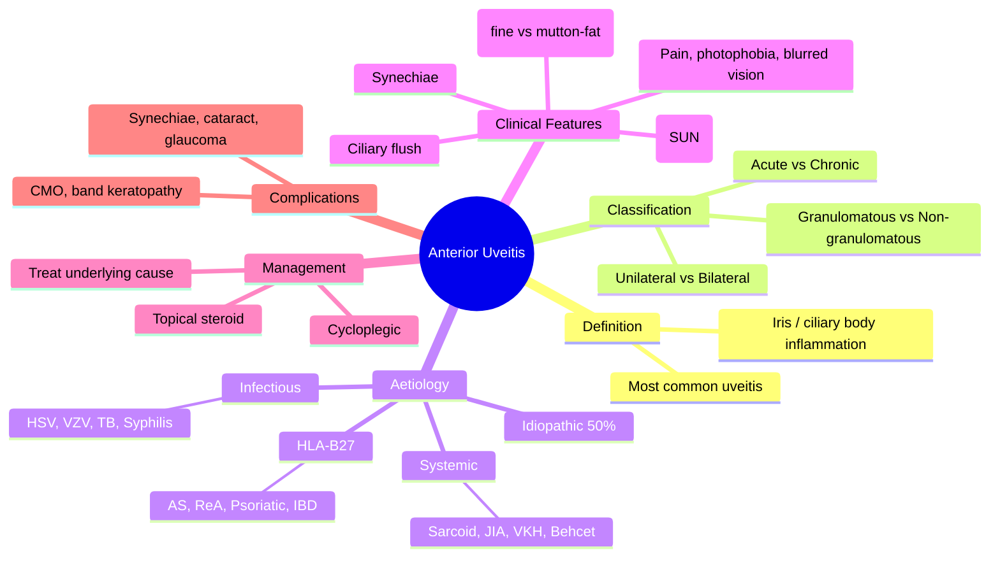

# Anterior Uveitis (Iritis / Iridocyclitis)

Related: [[Posterior Uveitis (Choroiditis)]], [[HLA-B27 Associated Uveitis]], [[Sarcoidosis (Ocular)]]

> [!tip] **FCPS/MRCP Priority: CRITICAL**
> Most common uveitis. Painful red eye + ↓VA + photophobia + KPs + cells/flare. Treat with topical steroid + cycloplegia. Investigate cause (HLA-B27, JIA, sarcoid, idiopathic).

---

## Learning Objectives
- [ ] Define anterior uveitis and distinguish from intermediate and posterior uveitis
- [ ] Describe the SUN classification of cells and flare
- [ ] Identify HLA-B27 associated causes and the JIA screening implication
- [ ] Differentiate granulomatous from non-granulomatous uveitis
- [ ] Apply the topical steroid + cycloplegia management strategy
- [ ] Recognise and manage complications (synechiae, glaucoma, cataract, CMO)
- [ ] Identify red flags for masquerade syndromes

---

## 1. Definition

- **Anterior uveitis (AU):** Inflammation of the iris (iritis), ciliary body (cyclitis), or both (iridocyclitis)
- Most common form of uveitis
- Acute or chronic

## 2. Classification

### By Course
- **Acute:** Sudden, limited (<3 months), often unilateral
- **Chronic:** Persistent >3 months, often bilateral, insidious
- **Recurrent:** Repeated episodes with inactive periods

### By Type
- **Non-granulomatous:** Fine KPs, mild inflammation (HLA-B27, idiopathic)
- **Granulomatous:** Mutton-fat KPs, iris nodules (sarcoid, TB, syphilis, VKH)

### By Laterality
- **Unilateral:** HLA-B27, trauma
- **Bilateral:** JIA (chronic), sarcoid, VKH, Behçet's, sympathetic ophthalmia

## 3. Aetiology

### Idiopathic (50%)
### HLA-B27 Associated (Acute, Unilateral)
- **Ankylosing spondylitis**
- **Reactive arthritis (Reiter's)**
- **Psoriatic arthritis**
- **IBD (UC, Crohn's)**

### Systemic
- **Sarcoidosis** (granulomatous)
- **Behçet's disease** (panuveitis, hypopyon)
- **Juvenile idiopathic arthritis** (chronic, bilateral, ANA+, often asymptomatic — important to screen)
- **TB**
- **Syphilis**
- **VKH syndrome** (granulomatous, panuveitis)
- **Sympathetic ophthalmia**

### Infectious
- HSV, VZV (HZV), CMV
- Lyme disease

### Other
- Trauma
- Masquerade (lymphoma, retinoblastoma in elderly)

## 4. Clinical Features

### Symptoms
- **Pain, photophobia, lacrimation**
- **Blurred vision** (cells/flare, CME)
- Red eye
- May be asymptomatic (chronic, JIA)

### Signs (Slit-lamp)
- **Ciliary flush** (perilimbal injection)
- **Cells and flare** in AC (SUN grading)
- **Keratic precipitates (KPs):**
  - **Fine (non-granulomatous)** — inferior
  - **Mutton-fat (granulomatous)** — diffuse
- **Iris nodules** (Koeppe at pupillary margin, Busacca on stroma)
- **Posterior synechiae** (iris to lens — fixed, irregular pupil)
- **Anterior synechiae** (peripheral, AC angle)
- **Hypopyon** (layered pus in AC — Behçet's, severe)
- **Iris atrophy** (sectoral — VZV/HZV)
- **IOP:** ↑ (trabeculitis, synechiae closure) or ↓ (ciliary shutdown)
- **Vitreous cells** (anterior vitreous)

## 5. Investigations

### First-line
- **History** (joint, skin, gut, urinary, respiratory)
- **Examination** (skin, joints, lymph nodes)
- **Blood tests:**
  - HLA-B27
  - ANA, RF
  - ACE (sarcoidosis)
  - Syphilis serology (VDRL, TPHA)
  - QuantiFERON-TB
  - FBC, ESR, CRP
- **Chest X-ray** (TB, sarcoid)

### Second-line
- **Anterior chamber tap** (PCR for HSV, VZV, CMV, TB)
- **Mantoux / IGRA**
- **Lysozyme**
- **Sarcoid workup** (CT chest, gallium scan)
- **MRI sacroiliac joints** (ankylosing spondylitis)
- **Anti-phospholipid** (Behçet's)
- **HLA-B51** (Behçet's, low yield)

## 6. Management

### Topical
- **Topical steroid** (prednisolone acetate 1%, dexamethasone) — mainstay
  - Hourly initially for severe
  - Taper over weeks to months
- **Cycloplegic** (atropine 1%, homatropine 2%, cyclopentolate 1%) — pain, prevent synechiae
- **Topical NSAID** (adjunct)

### Specific
- **HLA-B27:** Treat as above, screen for AS
- **Infectious (HSV/VZV):** Add oral antiviral
- **JIA:** Methotrexate, biologic (adalimumab)
- **Behçet's:** Systemic steroid, azathioprine, cyclosporine, anti-TNF
- **Sarcoidosis:** Steroid ± immunosuppression

### Complications
- **Posterior synechiae**
- **Cataract** (from chronic inflammation, steroids)
- **Glaucoma** (steroid, synechiae, trabeculitis)
- **CMO** (chronic)
- **Band keratopathy** (chronic, especially JIA, children)
- **Phthisis** (severe, end-stage)

## 7. FCPS/MRCP High-Yield Summary

| Topic | Key Points |
|-------|------------|
| Symptoms | Pain, photophobia, blurred vision |
| Signs | Ciliary flush, cells/flare, KPs, synechiae |
| Most common cause | Idiopathic |
| HLA-B27 | AS, reactive, psoriatic, IBD — acute unilateral |
| Granulomatous | Sarcoid, TB, syphilis, VKH |
| JIA | Chronic, bilateral, often asymptomatic — ANA+ |
| Treatment | Topical steroid + cycloplegia |

## 8. Red Flags / Emergencies
- Hypopyon uveitis (think Behçet's, infection)
- Bilateral granulomatous in a young adult (think sarcoid, VKH)
- Painless chronic uveitis in a child (think JIA — must screen!)
- Failure to respond to topical steroid → consider infectious cause, masquerade
- Elevated IOP at presentation (herpetic, Posner-Schlossman)
- Sectoral iris atrophy (HSV/VZV)

## 9. Viva Questions

1. **Q:** Differentiate granulomatous from non-granulomatous uveitis.
   **A:** Granulomatous = large mutton-fat KPs, iris nodules (Koeppe, Busacca), chronic (sarcoid, TB, syphilis, VKH). Non-granulomatous = fine KPs, no nodules, acute (HLA-B27, idiopathic).

2. **Q:** What are the most important investigations in a first episode of acute anterior uveitis?
   **A:** HLA-B27, syphilis serology, ACE (sarcoid), CXR (TB/sarcoid), ANA (if chronic, JIA suspicion).

3. **Q:** Why use a cycloplegic in uveitis?
   **A:** Relieves ciliary spasm (pain), prevents/breaks posterior synechiae, stabilises blood-aqueous barrier.

4. **Q:** What is JIA-associated uveitis?
   **A:** Chronic, bilateral, anterior, often asymptomatic. Screen JIA patients (especially ANA+, oligoarticular) every 3–6 months.

5. **Q:** How would you manage a patient with first-episode acute anterior uveitis presenting to A&E?
   **A:** Topical steroid (prednisolone acetate 1% hourly), cycloplegic (e.g., cyclopentolate 1% TDS), check IOP, dilate pupil to break early synechiae, then arrange ophthalmology clinic follow-up and aetiological workup (HLA-B27, syphilis, ACE, CXR).

6. **Q:** What is the SUN classification used for?
   **A:** Standardisation of Uveitis Nomenclature — grades anterior chamber cells and flare to monitor disease activity and response to treatment.

## 10. Common Confusions / Exam Traps

| Confusion | Clarification |
|-----------|---------------|
| "All anterior uveitis is acute" | Chronic forms exist — JIA, sarcoid, VKH |
| "Fine KPs mean non-infectious" | Fine KPs suggest non-granulomatous but infection (HSV) can also cause |
| "Hypopyon = infection" | Behçet's disease classically causes sterile hypopyon |
| "Cycloplegics are optional" | They prevent synechiae and relieve pain — essential, not optional |
| "HLA-B27 patients need immunosuppression" | AAU in HLA-B27 usually responds to topical; systemic therapy is for the spondyloarthropathy, not the eye |
| "Steroid-responsive = autoimmune" | Infectious uveitis (e.g., TB) may temporarily improve with steroids alone — never treat without coverage |
| "JIA uveitis is symptomatic" | Most JIA uveitis is asymptomatic — screening is essential |

## 11. Mnemonics

1. **"KPs Tell The Type"** — **F**ine KPs = non-granulomatous (HLA-B27); **Mutton-fat** KPs = granulomatous (sarcoid, TB, syphilis, VKH).
2. **"SUN Grading for AC"** — Standardisation of Uveitis Nomenclature: cells 0 (none) → 4 (>50); flare 0 → 4.
3. **"HLA-B27 Hits Hard, Hits Once"** — Acute, unilateral, sudden, hot red eye, very symptomatic.
4. **"Synechiae: I (Iris) is Stuck to L (Lens)"** — Posterior synechiae = iris-to-lens adhesions (irregular pupil).

## 12. Mind Map

## 13. One-Page Revision Card

| **Topic** | **Anterior Uveitis** |
|-----------|---------------------|
| **Definition** | Inflammation of iris ± ciliary body |
| **Key Symptom Triad** | Pain, photophobia, blurred vision |
| **Sign** | Ciliary flush, KPs, cells/flare, synechiae |
| **Most Common Cause** | Idiopathic (50%) |
| **HLA-B27** | Acute unilateral, AS/ReA/Psoriatic/IBD |
| **Granulomatous Causes** | Sarcoid, TB, Syphilis, VKH |
| **JIA Uveitis** | Chronic, bilateral, asymptomatic — screen! |
| **Treatment** | Topical steroid + cycloplegia |
| **Complications** | Synechiae, glaucoma, cataract, CMO |
| **Viva Pearl** | "Steroid + Cycloplegia + Dilate (break synechiae)" |

## 14. Summary

Anterior uveitis is the most common uveitis. Painful red eye with photophobia and ↓VA. Slit-lamp shows cells, flare, KPs, synechiae. Most are idiopathic, but check for HLA-B27 (acute), sarcoid/IBD/syphilis (granulomatous), and JIA (chronic bilateral, ANA+). Treatment: topical steroid + cycloplegia.

## Spaced Repetition Trackers

### 24-Hour Recall Prompts
- [ ] Define anterior uveitis and identify the three classic symptoms
- [ ] List the HLA-B27 associated conditions causing AU
- [ ] State the management triad (steroid + cycloplegia + treat cause)
- [ ] Describe KPs in granulomatous vs non-granulomatous AU
- [ ] Name 4 complications of chronic anterior uveitis
- [ ] Recall JIA uveitis screening recommendation

### Revision Schedule
- [ ] **Day 1** completed (creation + 24h recall)
- [ ] **Day 3** revision completed
- [ ] **Day 7** revision completed
- [ ] **Day 15** revision completed
- [ ] **Day 30** revision completed
- [ ] **Day 90** revision completed

## Must Know / Should Know / Nice to Know

### Must Know (Core for passing)
- [x] Definition and clinical features (pain, photophobia, ↓VA, ciliary flush)
- [x] Cells and flare in AC, KPs, synechiae
- [x] Management: topical steroid + cycloplegia
- [x] HLA-B27 association: AS, reactive arthritis, psoriatic, IBD
- [x] JIA uveitis (chronic bilateral, asymptomatic — screen)

### Should Know (High probability)
- [x] Granulomatous vs non-granulomatous differentiation
- [x] First-line investigations (HLA-B27, syphilis, ACE, CXR)
- [x] Complications: synechiae, glaucoma, cataract, CMO, band keratopathy
- [x] Specific treatments (JIA → MTX/biologics, Behçet's → immunosuppression)
- [x] Hypopyon — Behçet's vs infection

### Nice to Know (Differentiator)
- [ ] SUN grading (cells and flare)
- [ ] Iris nodules (Koeppe, Busacca, Berlin)
- [ ] Posner-Schlossman syndrome (glaucomatocyclitic crisis)
- [ ] Masquerade syndromes in elderly (lymphoma)
- [ ] Sympathetic ophthalmia (post-traumatic, bilateral)

## My Weak Points
- [ ] Add personal weak areas here

## Self-Test Scorecard

| Section | Score /5 |
|---------|----------|
| Understanding: | /10 |
| Recall: | /10 |
| MCQ Performance: | /10 |
| SBA Performance: | /10 |
| Viva Confidence: | /10 |
| Total: | /50 |

> [!tip] **Interpretation:** <35 = weak topic, 35-44 = acceptable but insecure, 45+ = strong exam-ready topic.

## Exam Answer Modes

### Long Answer Skeleton
1. **Definition** — Inflammation of iris ± ciliary body; most common uveitis
2. **Classification** — acute/chronic/recurrent; granulomatous/non-granulomatous; unilateral/bilateral
3. **Aetiology** — Idiopathic (50%), HLA-B27, systemic (sarcoid, JIA, VKH, Behçet's), infectious (HSV/VZV/TB/syphilis)
4. **Clinical features** — Pain, photophobia, ↓VA, ciliary flush, KPs (fine vs mutton-fat), cells/flare, synechiae, ± hypopyon
5. **Investigations** — HLA-B27, ANA, ACE, syphilis serology, CXR, AC tap (PCR) if atypical
6. **Management** — Topical steroid (prednisolone 1%) + cycloplegia (cyclopentolate/atropine); treat underlying cause; ± systemic immunosuppression
7. **Complications** — Synechiae, glaucoma, cataract, CMO, band keratopathy, phthisis

### Short Note Skeleton
- Definition + symptom triad (pain, photophobia, ↓VA)
- Sign: ciliary flush, KPs, cells/flare, synechiae
- Most common cause: idiopathic
- HLA-B27 causes: AS, ReA, psoriatic, IBD
- JIA uveitis: chronic, bilateral, asymptomatic
- Treatment: topical steroid + cycloplegia

### Viva One-Liners
- **Q:** What is anterior uveitis? → **A:** Inflammation of the iris ± ciliary body — the most common form of uveitis.
- **Q:** What are the classic symptoms? → **A:** Pain, photophobia, blurred vision.
- **Q:** What is the most common cause? → **A:** Idiopathic (50%).
- **Q:** Granulomatous vs non-granulomatous KPs? → **A:** Granulomatous = large mutton-fat KPs + iris nodules (sarcoid, TB, syphilis, VKH); non-granulomatous = fine KPs (HLA-B27, idiopathic).
- **Q:** Why use a cycloplegic? → **A:** Relieves ciliary spasm, prevents/breaks posterior synechiae.
- **Q:** JIA screening? → **A:** ANA+ oligoarticular JIA — slit-lamp every 3-6 months (often asymptomatic).

### Ward-Case Discussion Points
- Differentiate from conjunctivitis, keratitis, acute angle-closure
- Identify and grade AC cells/flare using SUN criteria
- Look for synechiae and IOP
- Choose appropriate cycloplegic (short vs long acting)
- Plan aetiological workup (HLA-B27, syphilis, ACE, CXR)
- Identify red flags for infection (herpes, masquerade)

### Last-Night-Before-Exam Sheet
- **Top 5 facts:** Painful red eye, ciliary flush, KPs, cells/flare, synechiae
- **Treatment trio:** Steroid + Cycloplegia + Treat cause
- **HLA-B27:** AS / ReA / Psoriatic / IBD — acute, unilateral
- **Granulomatous:** Sarcoid / TB / Syphilis / VKH
- **JIA:** Chronic, bilateral, ANA+ — screen!
- **Mnemonic:** "KPs Tell The Type" — Fine vs Mutton-fat

## MCQs (10)

1. **Q:** Most common cause of anterior uveitis is:
   **Options:** A. HLA-B27 B. Sarcoidosis C. Idiopathic D. JIA E. TB
   **Answer:** C
   **Explanation:** Idiopathic in ~50% of cases.

2. **Q:** Mutton-fat KPs are characteristic of:
   **Options:** A. Acute non-granulomatous B. Granulomatous uveitis C. Trauma D. Allergic E. None
   **Answer:** B
   **Explanation:** Granulomatous — sarcoid, TB, syphilis, VKH.

3. **Q:** HLA-B27 is associated with:
   **Options:** A. Chronic bilateral uveitis B. Acute unilateral uveitis C. JIA D. Behçet's E. VKH
   **Answer:** B
   **Explanation:** HLA-B27 = acute, unilateral, sudden, hot red eye.

4. **Q:** JIA-associated uveitis is typically:
   **Options:** A. Acute unilateral B. Chronic bilateral C. Granulomatous D. Hypopyon E. None
   **Answer:** B
   **Explanation:** Chronic, bilateral, often asymptomatic — screen JIA patients.

5. **Q:** A cycloplegic is used in anterior uveitis primarily to:
   **Options:** A. Treat infection B. Lower IOP C. Relieve ciliary spasm and prevent synechiae D. Improve vision E. Reduce corneal oedema
   **Answer:** C
   **Explanation:** Cycloplegics paralyse the ciliary body, relieving pain and preventing/breaking posterior synechiae.

6. **Q:** Which iris finding is most characteristic of HLA-B27 acute anterior uveitis?
   **Options:** A. Mutton-fat KPs B. Sectoral iris atrophy C. Fine KPs with no iris nodules D. Berlin nodules E. Diffuse iris neovascularisation
   **Answer:** C
   **Explanation:** HLA-B27 AAU is non-granulomatous — fine KPs, no iris nodules.

7. **Q:** Posterior synechiae in anterior uveitis are adhesions between:
   **Options:** A. Iris and cornea B. Iris and lens C. Lens and ciliary body D. Retina and vitreous E. Choroid and retina
   **Answer:** B
   **Explanation:** Iris adheres to the anterior lens capsule — produces fixed, irregular pupil.

8. **Q:** First-line systemic investigation in a first episode of acute anterior uveitis in a young man is:
   **Options:** A. ANA B. HLA-B27 C. ACE D. Anti-dsDNA E. ANCA
   **Answer:** B
   **Explanation:** HLA-B27 testing is the highest-yield first-line test in young men with AAU (spondyloarthropathy screen).

9. **Q:** A child with oligoarticular JIA, ANA positive, asymptomatic — best next step?
   **Options:** A. Topical steroid B. Slit-lamp screening every 3-6 months C. Systemic immunosuppression D. No action E. Cycloplegic drops
   **Answer:** B
   **Explanation:** ANA+ oligoarticular JIA is the highest-risk group for chronic asymptomatic uveitis — regular slit-lamp screening is mandatory.

10. **Q:** Hypopyon in a young man with recurrent oral and genital ulcers suggests:
    **Options:** A. Bacterial endophthalmitis B. Behçet's disease C. Sarcoidosis D. HLA-B27 AAU E. JIA uveitis
    **Answer:** B
    **Explanation:** Behçet's — hypopyon uveitis with pathergy and mucocutaneous ulcers.

## SBA Questions (10)

1. **Scenario:** A 28-year-old man with ankylosing spondylitis has painful red eye, photophobia, ↓VA, fine KPs, cells, flare.
   **Question:** Most likely diagnosis?
   **Options:** A. Conjunctivitis B. Acute anterior uveitis (HLA-B27) C. Keratitis D. Acute angle closure E. None
   **Answer:** B
   **Explanation:** AS + acute painful red eye + KPs = AAU.

2. **Scenario:** A 30-year-old man with recurrent painful red eye, photophobia, decreased vision, circumcorneal injection, and a fixed irregular pupil. Anterior chamber shows cells 3+ and flare 2+. IOP is normal.
   **Question:** Best initial management?
   **Options:** A. Oral steroid only B. Topical steroid + cycloplegic C. Topical antibiotic D. Topical antifungal E. Acyclovir
   **Answer:** B
   **Explanation:** AAU — topical steroid (prednisolone acetate 1%) + cycloplegia (cyclopentolate) is first-line.

3. **Scenario:** A 7-year-old girl with oligoarticular JIA, ANA positive, no eye symptoms. Mother asks if her eyes need checking.
   **Question:** What is the most appropriate recommendation?
   **Options:** A. Reassure, no follow-up needed B. Slit-lamp screening every 3-6 months C. Topical steroid prophylaxis D. Systemic MTX only E. Once-yearly ophthalmology review
   **Answer:** B
   **Explanation:** ANA+ oligoarticular JIA — most at-risk for chronic asymptomatic uveitis; screen every 3-6 months.

4. **Scenario:** A 35-year-old woman presents with bilateral granulomatous panuveitis, headache, tinnitus, vitiligo, and poliosis. Fundus shows exudative retinal detachment.
   **Question:** Most likely diagnosis?
   **Options:** A. Behçet's disease B. Sympathetic ophthalmia C. VKH syndrome D. Sarcoidosis E. Tuberculosis
   **Answer:** C
   **Explanation:** Bilateral granulomatous panuveitis + exudative RD + neurological/auditory features + integumentary signs = VKH.

5. **Scenario:** A 25-year-old man with recurrent oral ulcers, genital ulcers, and painful red eye. Slit-lamp shows a layered hypopyon.
   **Question:** Most likely diagnosis?
   **Options:** A. Bacterial keratitis B. Behçet's disease C. HLA-B27 AAU D. Sarcoidosis E. JIA
   **Answer:** B
   **Explanation:** Hypopyon + oral/genital ulcers = Behçet's disease (sterile hypopyon).

6. **Scenario:** A 50-year-old woman with chronic bilateral anterior uveitis, parotid swelling, and bilateral hilar lymphadenopathy on CXR.
   **Question:** Most likely underlying cause?
   **Options:** A. Behçet's B. Sarcoidosis C. TB D. Syphilis E. VKH
   **Answer:** B
   **Explanation:** Parotid + hilar nodes + uveitis = sarcoidosis (Heerfordt's syndrome features).

7. **Scenario:** A 40-year-old man with anterior uveitis develops sectoral iris atrophy and elevated IOP during the episode.
   **Question:** Most likely cause?
   **Options:** A. HLA-B27 B. HSV/VZV C. Sarcoidosis D. Behçet's E. JIA
   **Answer:** B
   **Explanation:** Sectoral iris atrophy + ↑IOP = herpetic (HSV/VZV) anterior uveitis (trabeculitis).

8. **Scenario:** A patient with anterior uveitis fails to respond to hourly topical steroid for 1 week. The eye is now hypotonic with persistent cells.
   **Question:** Most appropriate next step?
   **Options:** A. Continue hourly steroid B. Add oral steroid C. AC tap for PCR, reconsider infectious cause D. Add cycloplegic only E. Stop treatment
   **Answer:** C
   **Explanation:** Failure to respond = consider infectious aetiology; AC tap for PCR (HSV, VZV, TB) before escalating immunosuppression.

9. **Scenario:** A 30-year-old man has recurrent acute unilateral anterior uveitis. HLA-B27 is positive. He has low back pain with morning stiffness.
   **Question:** What is the most likely associated systemic disease?
   **Options:** A. Behçet's B. Ankylosing spondylitis C. Sarcoidosis D. JIA E. VKH
   **Answer:** B
   **Explanation:** HLA-B27 + low back pain + morning stiffness = ankylosing spondylitis.

10. **Scenario:** A patient with chronic anterior uveitis is on long-term topical steroid. IOP rises to 38 mmHg.
    **Question:** Most likely cause?
    **Options:** A. Synechial angle closure B. Steroid-induced glaucoma C. Acute angle closure D. Neovascular glaucoma E. Pigment dispersion
    **Answer:** B
    **Explanation:** Steroid response — common cause of secondary open-angle glaucoma in chronic AU; switch to NSAID, taper steroid, add IOP-lowering drops.

## Flashcards

- **Q:** What is anterior uveitis?
  **A:** Inflammation of the iris ± ciliary body; the most common form of uveitis.
- **Q:** Classic symptom triad of anterior uveitis?
  **A:** Pain, photophobia, blurred vision (with a red eye).
- **Q:** Granulomatous vs non-granulomatous KPs?
  **A:** Mutton-fat (large) = granulomatous; fine = non-granulomatous.
- **Q:** HLA-B27 associated diseases causing AAU?
  **A:** Ankylosing spondylitis, reactive arthritis (Reiter's), psoriatic arthritis, IBD (UC, Crohn's).
- **Q:** First-line treatment of anterior uveitis?
  **A:** Topical steroid (prednisolone acetate 1%) + cycloplegia (cyclopentolate or atropine) + treat underlying cause.
- **Q:** JIA uveitis screening?
  **A:** ANA+ oligoarticular JIA → slit-lamp every 3-6 months (often asymptomatic).
- **Q:** What does hypopyon in Behçet's represent?
  **A:** Sterile layered pus in the anterior chamber due to severe vasculitis — not infection.

## Answer Key with Explanations

### MCQs
1. C — Idiopathic in ~50%
2. B — Granulomatous: sarcoid, TB, syphilis, VKH
3. B — HLA-B27 = acute, unilateral
4. B — Chronic, bilateral, asymptomatic
5. C — Cycloplegia relieves ciliary spasm and prevents synechiae
6. C — Non-granulomatous = fine KPs, no nodules
7. B — Iris-to-lens adhesions
8. B — Highest yield in young male with AAU
9. B — Screening slit-lamp every 3-6 months
10. B — Behçet's = hypopyon + mucocutaneous ulcers

### SBAs
1. B — AS + AAU features = HLA-B27 AAU
2. B — Topical steroid + cycloplegia = first-line
3. B — ANA+ oligoarticular JIA needs slit-lamp screening
4. C — VKH: bilateral granulomatous panuveitis + exudative RD
5. B — Behçet's: hypopyon + mucocutaneous ulcers
6. B — Sarcoidosis: parotid + hilar nodes + uveitis
7. B — Sectoral iris atrophy + ↑IOP = herpetic AU
8. C — Refractory AU → AC tap for PCR
9. B — HLA-B27 + back pain + stiffness = AS
10. B — Steroid-induced glaucoma

## Tags
#medicine #davidson #ophthalmology #uveitis #anterior #fcps #mrcp
