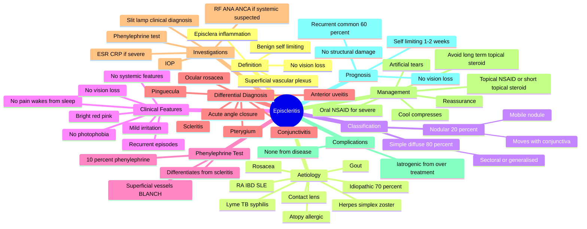

# Episcleritis

Related: [[Scleritis]], [[The Red Eye (Approach)]], [[Conjunctivitis]]

> [!info] **FCPS/MRCP Priority: HIGH — Common, benign, but must be distinguished from scleritis**
> Episcleritis is a self-limiting, recurring inflammation of the **superficial episcleral vascular plexus** between the conjunctiva and sclera. **Never threatens vision**; usually idiopathic but up to 1/3 have systemic association. The discriminator from scleritis is clinical (pain pattern, blanching, scleral oedema).

## Learning Objectives

- [ ] Define episcleritis and identify the anatomical layer affected (superficial episcleral plexus).
- [ ] Differentiate episcleritis from scleritis and from conjunctivitis on history and slit-lamp examination.
- [ ] Classify episcleritis as simple (diffuse) or nodular.
- [ ] List the systemic associations: atopy, rosacea, rheumatoid arthritis, IBD, SLE, gout, herpes, Lyme (less strongly linked than scleritis).
- [ ] Demonstrate the **phenylephrine 10% test** — blanching of superficial vessels = episcleritis.
- [ ] Manage conservatively: artificial tears, cool compresses, short course of topical steroid or oral NSAID if symptomatic.
- [ ] Recognise that episcleritis is **never vision-threatening**; if vision loss or severe pain → reassess diagnosis.

---

## 1. Definition

Inflammation of the **episclera** — the thin, loose, highly vascular connective tissue layer that lies between the conjunctiva (superficially) and the sclera proper (deep). Episcleritis is a **benign, self-limiting, recurring** condition that does **not** threaten vision. The key clinical skill is to distinguish it from its much more serious counterpart, **scleritis**.

## 2. Aetiology & Pathophysiology

- **Idiopathic in ~70%** of cases
- Systemic associations (up to **30-36%** — much less than scleritis):
  - **Atopy / allergic disease** (most common in young patients with recurrent episodes)
  - **Rosacea** (ocular rosacea)
  - Rheumatoid arthritis (usually mild, non-necrotising)
  - Inflammatory bowel disease (Crohn's, UC)
  - SLE, sarcoidosis
  - Gout
  - **Infections:** herpes simplex, herpes zoster, Lyme disease, TB, syphilis
  - Contact lens-related irritation
- **Pathogenesis:** non-granulomatous inflammation of the superficial episcleral vascular plexus; little scleral involvement
- **Demographics:** young to middle-aged adults (20-50); slight female predominance

## 3. Clinical Features

### Symptoms
- **Mild ocular irritation, redness, watering** (NOT severe pain)
- **No vision loss** (critical discriminator)
- No photophobia (usually)
- No systemic features (usually)
- Recurrent episodes lasting 1-2 weeks each, separated by months

### Signs

| Sign | Simple (Diffuse) Episcleritis | Nodular Episcleritis |
|---|---|---|
| Redness pattern | Sectoral or diffuse red eye (bright red, salmon-pink) | Localised, well-circumscribed raised nodule |
| Colour | Bright red / pink | Pink-red, raised |
| Distribution | Usually interpalpebral, can be sectoral | Single, mobile nodule within area of injection |
| Pain | Mild irritation, foreign body sensation | Mild tenderness |
| Movement of nodule | N/A | **Mobile with conjunctiva** (unlike scleritis nodule which is fixed) |
| Phenylephrine 10% test | Superficial vessels BLANCH | Superficial vessels BLANCH |
| Scleral oedema | Absent | Absent |
| Scleral thinning | Absent | Absent |
| Vision | Normal | Normal |

## 4. The Phenylephrine Test (Key Diagnostic Maneuver)

Instil **10% phenylephrine** drops into the affected eye and re-examine after 5-10 minutes:

| Response | Diagnosis |
|---|---|
| **Superficial vessels blanch** (redness fades) | Episcleritis |
| **Deep vessels do NOT blanch** (redness persists) | Scleritis |

This is a classic FCPS/MRCP exam point. Note: phenylephrine is not commonly used in modern clinics (replaced by slit-lamp judgement + clinical features), but the principle remains in textbooks.

## 5. Classification

**Two clinical forms:**

1. **Simple (diffuse) episcleritis** — ~80% of cases
   - Sectoral or generalised redness
   - No localised nodule
   - Most benign

2. **Nodular episcleritis** — ~20%
   - Well-defined, mobile, raised, pink-red nodule
   - Within an area of injection
   - Nodule moves freely with conjunctiva (unlike fixed scleritis nodule)
   - Slightly more often associated with systemic disease

## 6. Differential Diagnosis

| Condition | Key Distinguishing Features |
|---|---|
| **Conjunctivitis** | Discharge, conjunctival papillae/follicles, gritty feeling, often bilateral, no blanching with phenylephrine (but different pattern) |
| **Scleritis** | Severe boring pain, wakes from sleep, deep vessels, scleral oedema, vision loss, possible perforation |
| **Pterygium** | Wing-shaped fibrovascular growth onto cornea, not just redness |
| **Pinguecula** | Yellowish conjunctival deposit at limbus, no inflammation unless pingueculitis |
| **Anterior uveitis** | Photophobia, AC cells/flare, miosis, decreased vision, KP |
| **Acute angle-closure glaucoma** | Severe pain, haloes, fixed mid-dilated pupil, hard eye, very high IOP |
| **Ocular rosacea** | Blepharitis, meibomian dysfunction, telangiectasia, facial rosacea |

## 7. Investigations

Episcleritis is usually a **clinical diagnosis**. Investigations are reserved for:
- Recurrent severe episodes
- Suspected underlying systemic disease
- Atypical features (consider scleritis workup)

| Investigation | Indication |
|---|---|
| Slit-lamp examination | Confirm diagnosis, exclude other red eye causes |
| **Phenylephrine 10% test** | Differentiate from scleritis |
| IOP | Exclude secondary glaucoma |
| ESR/CRP | If recurrent or features suggest systemic disease |
| RF, ANA, ANCA, ACE, urate | If scleritis suspected or systemic features |

## 8. Management

### Stepwise Approach

**Step 1 — Reassurance and supportive (most cases)**
- **Reassure** that condition is benign and self-limiting
- **Artificial tears** (preservative-free, 4-6×/day) for symptomatic relief
- **Cool compresses** 2-3×/day
- Avoid contact lenses during episodes

**Step 2 — Mild-to-moderate symptoms**
- **Topical NSAID** (e.g. ketorolac 0.5% QID) for 1-2 weeks
- OR **topical steroid** (e.g. fluorometholone 0.1% or prednisolone acetate 0.5% QID) short course (1-2 weeks), then taper

**Step 3 — Recurrent or persistent episodes**
- **Oral NSAID** (ibuprofen 200-400 mg TDS or naproxen 250-500 mg BD) for 1-2 weeks
- Consider **oral NSAID prophylaxis** if predictable trigger (e.g. atopy season)

**Step 4 — Refractory / severe**
- Short course **oral prednisolone** (0.5 mg/kg for 1 week, taper)
- Topical cyclosporine 0.5% in selected cases
- Investigate for underlying systemic disease

**Avoid:** Long-term topical steroid (risk of cataract, glaucoma, infection)

## 9. Complications

- **None** in true episcleritis (the key feature distinguishing it from scleritis)
- Recurrent episodes common (~60%)
- Iatrogenic complications from overtreatment with topical steroids (cataract, glaucoma, infection)

## 10. Prognosis

- **Self-limiting** — each episode resolves in 1-2 weeks
- **Recurrent** — most patients have multiple episodes over years
- **No vision loss**
- **No structural damage** to the eye
- Quality of life may be affected by frequency of episodes

## 11. FCPS/MRCP High-Yield Summary

| Topic | Key Point |
|---|---|
| Episcleritis vs scleritis | Episcleritis = mild, no vision loss, superficial; Scleritis = severe, vision-threatening, deep |
| Phenylephrine test | Episcleritis vessels BLANCH; scleritis vessels do NOT |
| Nodule mobility | Episcleritis nodule MOVES with conjunctiva; scleritis nodule FIXED |
| Most cases idiopathic | ~70% |
| Systemic association | <36% (vs 50% for scleritis) |
| First-line treatment | Artificial tears + cool compresses; topical NSAID or short-course topical steroid |
| Vision loss | NEVER in true episcleritis |
| Recurrence | Common (~60%) |
| Complication | None from disease itself; iatrogenic from over-treatment |
| Refer if | Severe pain, vision loss, features suggesting scleritis, recurrent severe episodes |

## 12. Viva Questions

| Question | Expected Answer |
|---|---|
| Differentiate episcleritis from scleritis. | Episcleritis: mild irritation, no vision loss, superficial vessels blanch with phenylephrine, no scleral oedema. Scleritis: severe boring pain that wakes from sleep, vision loss, deep vessels do not blanch, scleral oedema/thinning. |
| What is the phenylephrine test? | Instil 10% phenylephrine; superficial vessels of episcleritis blanch within 5-10 min; deep vessels of scleritis do not. |
| What is the most common systemic association of episcleritis? | Atopy/allergic disease in young patients; otherwise often idiopathic. |
| Can episcleritis cause vision loss? | No. True episcleritis is never vision-threatening. If vision loss, suspect scleritis or alternative diagnosis. |
| What is the management of simple episcleritis? | Reassurance, artificial tears, cool compresses. Topical NSAID or short-course topical steroid if symptomatic. |
| Differentiate episcleritis from conjunctivitis. | Conjunctivitis: discharge, papillae/follicles, gritty feeling, often bilateral, no blanching with phenylephrine. Episcleritis: no discharge, blanching with phenylephrine, sectoral/diffuse redness. |
| Can episcleritis be nodular? | Yes — nodular episcleritis is a localised mobile nodule that moves with conjunctiva (unlike fixed scleritis nodule). |

## 13. Common Confusions / Exam Traps

| Confusion | Clarification |
|---|---|
| "Episcleritis and scleritis are the same severity" | No — scleritis is vision-threatening; episcleritis is benign. |
| "Episcleritis needs long-term topical steroid" | Avoid — risk cataract, glaucoma, infection. Use short course only. |
| "Episcleritis is always associated with systemic disease" | Only ~30%; most are idiopathic. |
| "Episcleritis and conjunctivitis are indistinguishable" | Discharge and conjunctival papillae/follicles are features of conjunctivitis, not episcleritis. |
| "Episcleritis nodule is fixed" | Wrong — nodule is mobile with conjunctiva; fixed nodule = scleritis. |
| "Episcleritis can cause scleromalacia" | No — only scleritis (necrotising) can thin the sclera. |

## 14. Mnemonics

1. **"Episcleritis = Episodic, Easy"** — benign, self-limiting, recurrent, easy to treat.
2. **"Episcleritis vessels EXIT with phenylephrine"** — they blanch (superficial).
3. **"Episcleritis nodule EXITS with conjunctiva"** — it moves (unlike fixed scleritis nodule).
4. **"Scleritis = Serious; Episcleritis = Simple"** — remember the discriminator.
5. **"Episcleritis = Eye-friendly"** — no vision loss, no structural damage.

## 15. Mind Map

## 16. One-Page Revision Card

| Domain | Key Points |
|---|---|
| Definition | Inflammation of superficial episcleral vascular plexus; benign, self-limiting |
| Layer | Episclera (between conjunctiva and sclera) |
| Most cases | Idiopathic (~70%) |
| Pain | Mild irritation; NEVER wakes from sleep (vs scleritis) |
| Vision | NEVER lost (vs scleritis) |
| Phenylephrine test | Superficial vessels BLANCH (vs scleritis where they don't) |
| Nodule | Mobile with conjunctiva (vs fixed in scleritis) |
| Systemic association | <36% (vs 50% for scleritis) |
| First-line | Reassurance + artificial tears + cool compresses |
| Topical steroid | Short course only (1-2 weeks), avoid long-term |
| Recurrence | Common (~60%) |
| Complication | None from disease; iatrogenic from over-treatment |

## 17. Spaced Repetition Trackers

| Review Interval | Date | Score (0-5) | Notes |
|---|---|---|---|
| Day 1 | | | |
| Day 3 | | | |
| Day 7 | | | |
| Day 14 | | | |
| Day 30 | | | |
| Day 90 | | | |

## 18. Self-Test Scorecard

| Section | Score /5 | Last Attempt |
|---|---|---|
| Definition / Layer | | |
| Phenylephrine test | | |
| Clinical features (vs scleritis) | | |
| Differential diagnosis | | |
| Management | | |
| Mnemonics | | |
| MCQ Performance | | |
| SBA Performance | | |
| Viva Confidence | | |
| **Total** | **/50** | |

> **Interpretation:** <35 = weak, 35-44 = acceptable, 45+ = strong.

## 19. Exam Answer Modes

### Long Answer Skeleton
1. Definition + anatomical layer (superficial episcleral plexus)
2. Aetiology (idiopathic 70%, atopy, rosacea, RA, IBD, herpes, Lyme, gout)
3. Differentiate from scleritis (pain pattern, phenylephrine, vision, mobility of nodule)
4. Differentiate from conjunctivitis (no discharge, no follicles/papillae)
5. Classification (simple diffuse 80%, nodular 20%)
6. Investigations (clinical, phenylephrine, slit-lamp, exclude scleritis)
7. Management (reassurance, tears, cool compress, topical NSAID/short steroid, oral NSAID)
8. Complications (none, but iatrogenic)
9. Prognosis (self-limiting, recurrent, no vision loss)

### Short Note Skeleton
- Definition, layer, common causes, differentiate from scleritis (key table), management, prognosis.

### Viva One-Liners
- "What is the phenylephrine test?"
- "Differentiate episcleritis from scleritis."
- "What is the management of simple episcleritis?"
- "Can episcleritis cause vision loss?"
- "Differentiate the nodules of episcleritis vs scleritis."

### Ward-Case Discussion Points
- Always do phenylephrine test to exclude scleritis
- Ask about systemic symptoms (joint pain, rash, sinus, GI, recent infection)
- Reassure: benign, self-limiting
- Avoid long-term topical steroid
- Refer if severe, recurrent, vision loss, or scleritis features

### Last-Night-Before-Exam Sheet
- **Top 5 facts:** Episcleritis = benign, superficial, no vision loss, vessels blanch with phenylephrine, recurrent
- **3 drug doses:** Artificial tears QID; Ketorolac 0.5% QID topical; Ibuprofen 200-400 mg TDS PO
- **2 algorithms:** Red eye assessment (exclude scleritis); Episcleritis treatment (tears → topical NSAID → oral NSAID)
- **1 mnemonic:** "Episcleritis vessels EXIT with phenylephrine" + "Episcleritis nodule EXITS with conjunctiva"

## 20. Summary

Episcleritis is a benign, self-limiting, recurrent inflammation of the superficial episcleral vascular plexus. Most cases are idiopathic; up to 30% have systemic associations (atopy, rosacea, RA, IBD, gout, herpes). The key clinical skill is **distinguishing it from scleritis**: episcleritis causes mild irritation that does NOT wake from sleep, NEVER causes vision loss, and superficial vessels BLANCH with 10% phenylephrine (vs scleritis where deep vessels do not blanch). Nodular episcleritis has a mobile nodule that moves with the conjunctiva (vs the fixed tender nodule of scleritis). Management is supportive: reassurance, artificial tears, cool compresses, with topical NSAID or short-course topical steroid if symptomatic. Oral NSAID for persistent cases. The condition is self-limiting (1-2 weeks per episode), recurrent in ~60%, and never vision-threatening.

## 21. MCQs (10)

**1. Which of the following is the most distinguishing feature of episcleritis versus scleritis?**
A. Sectoral redness
B. Mild ocular irritation without vision loss
C. Young age of onset
D. Female predominance
**Answer: B**

**2. The phenylephrine 10% test in episcleritis characteristically shows:**
A. Deep scleral vessels do not blanch
B. Superficial vessels blanch
C. Conjunctival vessels blanch but not episcleral
D. No vascular response at all
**Answer: B**

**3. Which of the following systemic diseases is LEAST associated with episcleritis?**
A. Rosacea
B. Rheumatoid arthritis
C. Granulomatosis with polyangiitis
D. Atopy
**Answer: C**

**4. Nodular episcleritis is best differentiated from nodular scleritis by which feature?**
A. Nodule colour
B. Nodule size
C. Mobility of nodule with conjunctiva
D. Number of nodules
**Answer: C**

**5. The first-line treatment for symptomatic simple episcleritis is:**
A. Long-term oral prednisolone
B. IV cyclophosphamide
C. Artificial tears and cool compresses
D. Topical antibiotic
**Answer: C**

**6. Episcleritis accounts for what percentage of all "red eye" presentations?**
A. <1%
B. ~5%
C. ~15%
D. ~50%
**Answer: B** (varies by source, ~5-15% of acute red eye)

**7. Which of the following is a recognised cause of episcleritis?**
A. Rosacea
B. Hypertension
C. Diabetes mellitus
D. Hyperlipidaemia
**Answer: A**

**8. Episcleritis typically resolves within:**
A. A few hours
B. 1-2 weeks
C. 6-8 weeks
D. Several months
**Answer: B**

**9. Long-term use of topical steroid for episcleritis is contraindicated because of risk of:**
A. Retinal detachment
B. Cataract and glaucoma
C. Scleromalacia perforans
D. Retinitis pigmentosa
**Answer: B**

**10. A 30-year-old atopic presents with recurrent episodes of mild red eye lasting 1-2 weeks, no vision loss, vessels blanching with phenylephrine. The most likely diagnosis is:**
A. Acute conjunctivitis
B. Episcleritis
C. Scleritis
D. Acute angle-closure glaucoma
**Answer: B**

## 22. SBA Questions (10)

**1. A 35-year-old woman presents with mild redness of the right eye, no pain, no vision loss. On phenylephrine 10% instillation, the redness significantly fades. The most likely diagnosis is:**
A. Scleritis
B. Episcleritis
C. Acute angle-closure glaucoma
D. Anterior uveitis
**Answer: B — Superficial vessels blanch = episcleritis**

**2. A patient with nodular episcleritis has a single pink-red nodule. Which feature confirms episcleritis rather than scleritis?**
A. Nodule tenderness
B. Nodule moves with conjunctiva
C. Scleral thinning
D. Pain
**Answer: B — Mobility = episcleritis; fixed = scleritis**

**3. The most appropriate INITIAL management of a first episode of simple episcleritis in an adult is:**
A. Oral prednisolone for 4 weeks
B. IV cyclophosphamide
C. Reassurance, artificial tears, cool compresses
D. Topical antibiotic for 2 weeks
**Answer: C — Supportive management; pharmacotherapy only if symptomatic**

**4. Episcleritis is most commonly associated with which of the following conditions in young patients?**
A. Diabetes
B. Hypertension
C. Atopy
D. Hyperlipidaemia
**Answer: C — Atopy is the most common association in young patients**

**5. Which feature would prompt urgent re-evaluation of a presumed episcleritis diagnosis?**
A. Mild irritation
B. Sectoral redness
C. Decreased vision
D. Recurrent episodes
**Answer: C — Decreased vision should NEVER occur in true episcleritis; suggests scleritis or alternative diagnosis**

**6. A 28-year-old with atopy has had 4 episodes of unilateral red eye over 2 years, each lasting ~10 days, with no vision loss. The most appropriate long-term strategy is:**
A. Chronic oral steroid
B. Avoidance of triggers; symptomatic treatment during episodes
C. Bilateral enucleation
D. Long-term topical steroid
**Answer: B — Episcleritis is benign; chronic steroid is contraindicated**

**7. The anatomical layer inflamed in episcleritis is:**
A. Sclera proper
B. Episclera (between conjunctiva and sclera)
C. Retina
D. Choroid
**Answer: B — Episclera is the superficial vascular layer**

**8. A patient with rosacea develops mild bilateral red eyes, gritty feeling, with normal vision. After excluding other causes, the most likely diagnosis is:**
A. Scleritis
B. Episcleritis (associated with ocular rosacea)
C. Acute angle-closure glaucoma
D. Central retinal artery occlusion
**Answer: B — Rosacea is a recognised association**

**9. Which is NOT a feature of episcleritis?**
A. Mild irritation
B. Sectoral redness
C. Severe boring pain
D. Self-limiting course
**Answer: C — Severe boring pain is scleritis, NOT episcleritis**

**10. The most common long-term complication of frequent topical steroid use in recurrent episcleritis is:**
A. Scleral perforation
B. Cataract and glaucoma
C. Retinal detachment
D. Optic neuritis
**Answer: B — Cataract and glaucoma are the major iatrogenic complications**

## 23. Flashcards

- **Q:** What is episcleritis?
  **A:** Inflammation of the superficial episcleral vascular plexus; benign, self-limiting, recurrent
- **Q:** Differentiate from scleritis in 1 line.
  **A:** Episcleritis = mild, no vision loss, superficial vessels blanch with phenylephrine
- **Q:** What is the phenylephrine test?
  **A:** 10% phenylephrine: superficial vessels of episcleritis blanch; deep vessels of scleritis do not
- **Q:** Is the episcleritis nodule mobile or fixed?
  **A:** Mobile (moves with conjunctiva) — fixed = scleritis
- **Q:** Most common systemic association in young patients?
  **A:** Atopy
- **Q:** First-line management of simple episcleritis?
  **A:** Reassurance + artificial tears + cool compresses
- **Q:** Can episcleritis cause vision loss?
  **A:** NEVER — if vision loss, suspect scleritis or alternative diagnosis
- **Q:** Most common complication of long-term topical steroid?
  **A:** Cataract and glaucoma
- **Q:** What percentage is idiopathic?
  **A:** ~70%
- **Q:** How long does each episode last?
  **A:** 1-2 weeks; recurrent in ~60%

## 24. Answer Key with Explanations

### MCQs
1. **B** — Mild irritation without vision loss is the cardinal feature of episcleritis that distinguishes it from scleritis.
2. **B** — The phenylephrine 10% test: superficial vessels of episcleritis blanch within 5-10 min. In scleritis, the deep vessels do not blanch.
3. **C** — GPA is strongly associated with scleritis (especially necrotising) but is rarely associated with episcleritis. Atopy, rosacea, and RA are recognised associations of episcleritis.
4. **C** — Mobility of the nodule with conjunctiva is the key discriminator. Episcleritis nodule = mobile; scleritis nodule = fixed and tender.
5. **C** — Reassurance, artificial tears, and cool compresses are first-line. Pharmacotherapy is reserved for symptomatic relief.
6. **B** — Episcleritis accounts for ~5-15% of acute red eye presentations.
7. **A** — Rosacea (ocular rosacea) is a recognised cause of episcleritis. HTN, DM, and hyperlipidaemia are not.
8. **B** — Each episode typically resolves in 1-2 weeks.
9. **B** — Cataract and glaucoma are the major iatrogenic complications of long-term topical steroid use.
10. **B** — Atopic + recurrent self-limiting episodes with blanching = classic episcleritis.

### SBAs
1. **B** — Vessels blanching with phenylephrine = episcleritis.
2. **B** — Mobility of the nodule confirms episcleritis; scleritis nodule is fixed and tender.
3. **C** — Supportive care is the first-line for simple episcleritis.
4. **C** — Atopy is the most common systemic association in young patients with recurrent episcleritis.
5. **C** — Decreased vision should NEVER occur in true episcleritis; prompt re-evaluation is needed.
6. **B** — Trigger avoidance and symptomatic treatment is the appropriate long-term strategy; chronic steroids are contraindicated.
7. **B** — The episclera is the layer between conjunctiva and sclera.
8. **B** — Ocular rosacea commonly causes episcleritis.
9. **C** — Severe boring pain is characteristic of scleritis, NOT episcleritis.
10. **B** — Cataract and glaucoma are the most common iatrogenic complications of long-term topical steroid.

## 25. Local Navigation

- **Parent Hub:** [[Uveitis Hub|Uveal Tract & Sclera Hub]]
- **Related (Sclera):** [[Scleritis]]
- **Related (Conjunctiva):** [[Bacterial Conjunctivitis]] · [[Viral Conjunctivitis]] · [[Allergic Conjunctivitis]]
- **Related (Approach):** [[The Red Eye (Approach)]] · [[Dry Eye Disease]]
- **Chapter MOC:** [[Medical Ophthalmology MOC]]
- **Chapter Hierarchy:** [[Davidson Chapter 27 - Medical Ophthalmology Hierarchy]]
- **Cross-chapter:** [[../Dermatology/Rosacea]]

## 26. Tags

#medicine #davidson #ophthalmology #episcleritis #scleritis #red-eye #fcps #mrcp
