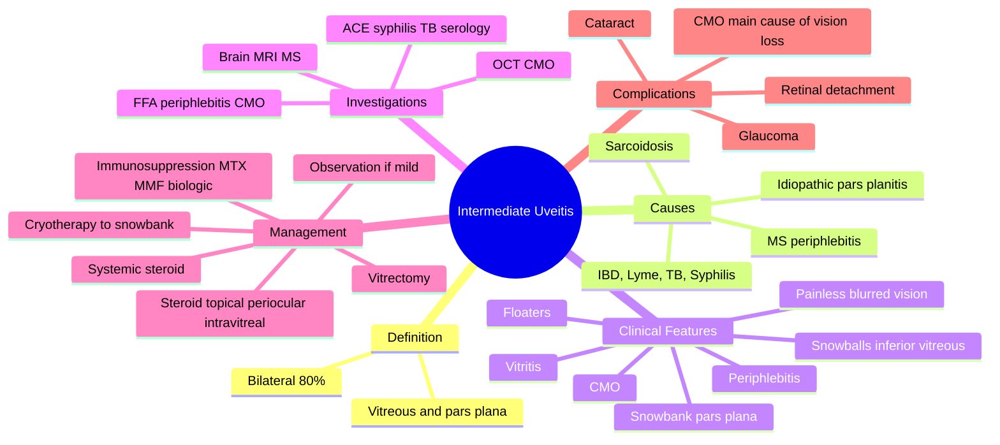

# Intermediate Uveitis

Related: [[Anterior Uveitis (Iritis)]], [[Pars Planitis]]

> [!tip] **FCPS/MRCP Priority: MEDIUM**
> Vitritis, snowball opacities, pars plana snowbank. Often idiopathic (pars planitis). Associate with MS, sarcoidosis.

---

## Learning Objectives
- [ ] Define intermediate uveitis and its primary site (vitreous, pars plana)
- [ ] Distinguish pars planitis (idiopathic) from MS- or sarcoid-associated intermediate uveitis
- [ ] Recognise snowballs, snowbank, and periphlebitis as classic signs
- [ ] Identify when to request brain MRI (suspected MS)
- [ ] Apply the stepwise treatment (observation → steroid → immunosuppression → surgery)
- [ ] Recognise complications, especially cystoid macular oedema (CMO)

---

## 1. Definition

- **Intermediate uveitis (IU):** Inflammation primarily in vitreous and peripheral retina/pars plana
- Bilateral in 80%
- Most common form: pars planitis

## 2. Causes

- **Idiopathic (pars planitis)** — most common
- **Multiple sclerosis** (periphlebitis)
- **Sarcoidosis**
- **Lyme disease**
- **IBD**
- **Infectious:** TB, syphilis, HTLV-1

## 3. Clinical Features

- **Floaters, blurred vision** (mild)
- Often bilateral, insidious
- Painless
- Cells in vitreous (especially inferior — "snowballs")
- **Snowbank** (white exudate over inferior pars plana)
- **Periphlebitis** (MS, sarcoid)
- Mild AC reaction
- CMO (chronic)
- Disc oedema

## 4. Investigations

- FFA (periphlebitis, CMO)
- OCT (CMO)
- Brain MRI (MS) — especially if bilateral, female, periphlebitis
- ACE, syphilis, TB, Lyme (as appropriate)

## 5. Management

- **Observation** (mild, asymptomatic)
- **Topical / sub-Tenon's / intravitreal steroid**
- **Systemic steroid** for severe
- **Immunosuppression** (MTX, MMF, biologics — adalimumab for refractory)
- **Cryotherapy / indirect laser** to pars plana (snowbank)
- **Vitrectomy** (diagnostic, therapeutic)

## 6. FCPS/MRCP Summary

| Topic | Key Points |
|-------|------------|
| Site | Vitreous, pars plana |
| Bilateral | Common |
| Snowballs | Vitreous aggregates |
| Snowbank | Inferior pars plana exudate |
| Association | MS, sarcoid |
| Idiopathic | Pars planitis |

## 7. Red Flags / Emergencies
- Bilateral periphlebitis in a young woman → MRI brain to look for MS
- Vitritis + subretinal infiltrates in an elderly patient → consider vitreoretinal lymphoma
- CMO threatening vision → escalate to intravitreal/systemic therapy
- Sudden vision loss from retinal detachment (exudative or tractional)
- Snowbank extending and occluding the ora serrata → increased risk of retinal break/detachment

## 8. Viva Questions

1. **Q:** What is pars planitis?
   **A:** Idiopathic intermediate uveitis, often with snowbank at inferior pars plana.

2. **Q:** With which systemic disease is intermediate uveitis strongly associated?
   **A:** Multiple sclerosis (periphlebitis), sarcoidosis.

3. **Q:** What is a snowbank?
   **A:** White fibrotic exudate over the inferior pars plana — characteristic of pars planitis.

4. **Q:** How would you investigate a young woman with bilateral intermediate uveitis and periphlebitis?
   **A:** Brain MRI for demyelination (MS), FFA to confirm periphlebitis, OCT for CMO, ACE/syphilis/TB serology as appropriate.

5. **Q:** What is the most common vision-threatening complication of intermediate uveitis?
   **A:** Cystoid macular oedema (CMO).

## 9. Common Confusions / Exam Traps

| Confusion | Clarification |
|-----------|---------------|
| "Intermediate uveitis = anterior chamber inflammation" | Primary site is the vitreous and pars plana; only a mild AC reaction may be present |
| "Snowballs are on the pars plana" | Snowballs = vitreous aggregates (inferior); snowbank = pars plana exudate |
| "MS-related uveitis is posterior" | MS classically causes intermediate uveitis (periphlebitis) — but can be panuveitis |
| "Treat all intermediate uveitis with steroids" | Mild, asymptomatic cases are observed; reserve treatment for vision-threatening (e.g., CMO) |
| "Snowbank has nothing to do with retinal detachment" | Snowbank can lead to peripheral traction and retinal break/RD — needs monitoring |
| "Periphlebitis is specific to MS" | Periphlebitis also occurs in sarcoidosis, TB, VKH |

## 10. Mnemonics

1. **"Snowballs Float, Snowbank Sticks"** — **Snowballs** = free-floating vitreous aggregates; **Snowbank** = fibrotic exudate stuck to inferior pars plana.
2. **"MS Makes Vitritis"** — Multiple sclerosis → periphlebitis → intermediate uveitis.
3. **"Pars Planitis = Primary + Pars Plana"** — idiopathic, primary inflammation of the pars plana.

## 11. Mind Map

## 12. One-Page Revision Card

| **Topic** | **Intermediate Uveitis** |
|-----------|--------------------------|
| **Definition** | Vitreous + pars plana inflammation |
| **Most Common Form** | Pars planitis (idiopathic) |
| **Symptoms** | Floaters, mild ↓VA, painless |
| **Snowballs** | Inferior vitreous aggregates |
| **Snowbank** | Fibrotic exudate on inferior pars plana |
| **Key Associations** | MS, sarcoidosis |
| **Investigations** | FFA, OCT, brain MRI |
| **Treatment** | Observe → steroid → immunosuppression |
| **Main Complication** | CMO |
| **Viva Pearl** | "Snowballs Float, Snowbank Sticks" |

## 13. Summary

Intermediate uveitis is vitreal inflammation, often with snowballs and snowbank. Most idiopathic (pars planitis). Associated with MS, sarcoid. Treatment is observation → steroid → immunosuppression.

## Spaced Repetition Trackers

### 24-Hour Recall Prompts
- [ ] Define intermediate uveitis and its primary site
- [ ] Differentiate snowballs from snowbank
- [ ] Name the two main systemic associations
- [ ] Identify the most common vision-threatening complication
- [ ] Outline the stepwise treatment approach

### Revision Schedule
- [ ] **Day 1** completed (creation + 24h recall)
- [ ] **Day 3** revision completed
- [ ] **Day 7** revision completed
- [ ] **Day 15** revision completed
- [ ] **Day 30** revision completed
- [ ] **Day 90** revision completed

## Must Know / Should Know / Nice to Know

### Must Know (Core for passing)
- [x] Definition (vitreous + pars plana)
- [x] Pars planitis = idiopathic
- [x] Snowballs and snowbank definition
- [x] MS and sarcoidosis as key associations
- [x] CMO is the most common vision-threatening complication

### Should Know (High probability)
- [x] Bilateral in 80% of cases
- [x] Periphlebitis and its link to MS
- [x] Investigations: FFA, OCT, MRI brain
- [x] Treatment ladder: observation → steroid → immunosuppression
- [x] Cryotherapy/laser to snowbank

### Nice to Know (Differentiator)
- [ ] Vitrectomy for diagnostic and therapeutic indications
- [ ] HTLV-1 association (Japan/Caribbean)
- [ ] Adalimumab for refractory disease
- [ ] Lyme disease as a cause
- [ ] Tractional retinal detachment from snowbank

## My Weak Points
- [ ] Add personal weak areas here

## Self-Test Scorecard

| Section | Score /5 |
|---------|----------|
| Understanding: | /10 |
| Recall: | /10 |
| MCQ Performance: | /10 |
| SBA Performance: | /10 |
| Viva Confidence: | /10 |
| Total: | /50 |

> [!tip] **Interpretation:** <35 = weak topic, 35-44 = acceptable but insecure, 45+ = strong exam-ready topic.

## Exam Answer Modes

### Long Answer Skeleton
1. **Definition** — Inflammation of vitreous and pars plana
2. **Aetiology** — Idiopathic (pars planitis — most common), MS, sarcoidosis, IBD, Lyme, TB, syphilis, HTLV-1
3. **Clinical features** — Painless floaters, mild ↓VA; bilateral; vitritis (snowballs), snowbank on inferior pars plana, periphlebitis, mild AC reaction, CMO, disc oedema
4. **Investigations** — FFA (periphlebitis, CMO), OCT (CMO), brain MRI (MS), ACE/syphilis/TB/Lyme serology
5. **Management** — Observation (mild) → topical/periocular/intravitreal steroid → systemic steroid → immunosuppression (MTX, MMF, biologics); cryotherapy/laser to snowbank; vitrectomy
6. **Complications** — CMO (most common), cataract, glaucoma, retinal detachment (tractional from snowbank)

### Short Note Skeleton
- Definition (vitreous + pars plana) + 80% bilateral
- Pars planitis = idiopathic form
- Snowballs (vitreous) vs snowbank (pars plana)
- MS and sarcoid association
- Treatment: observation → steroid → immunosuppression
- Main complication: CMO

### Viva One-Liners
- **Q:** What is pars planitis? → **A:** Idiopathic intermediate uveitis with snowbank at inferior pars plana.
- **Q:** Snowballs vs snowbank? → **A:** Snowballs = free vitreous aggregates; snowbank = fibrotic pars plana exudate.
- **Q:** MS association? → **A:** Periphlebitis is a classic sign of MS-related intermediate uveitis — do MRI brain.
- **Q:** Main vision-threatening complication? → **A:** Cystoid macular oedema (CMO).
- **Q:** First-line treatment of mild disease? → **A:** Observation (if asymptomatic, mild vitritis, VA preserved).

### Ward-Case Discussion Points
- Identify pars plana snowbank on indirect ophthalmoscopy with scleral depression
- Differentiate intermediate uveitis from posterior uveitis (vitreous is the primary site)
- Arrange OCT and FFA to look for CMO
- Consider MRI brain in bilateral periphlebitis (MS)
- Counsel on observation vs treatment (mild disease may not need therapy)
- Plan escalation: topical → periocular → intravitreal → systemic → immunosuppression

### Last-Night-Before-Exam Sheet
- **Top 5 facts:** Vitreous/pars plana inflammation, 80% bilateral, pars planitis = idiopathic, MS/sarcoid association, CMO is the main complication
- **Mnemonic:** "Snowballs Float, Snowbank Sticks"
- **Mnemonic:** "MS Makes Vitritis"
- **Treatment ladder:** Observe → Steroid → Immunosuppression → Surgery
- **Don't forget:** MRI brain in bilateral periphlebitis (suspect MS)

## MCQs (10)

1. **Q:** Intermediate uveitis involves primarily:
   **Options:** A. Anterior chamber B. Vitreous and pars plana C. Choroid D. Optic nerve E. Retina only
   **Answer:** B
   **Explanation:** Vitreous + pars plana = intermediate.

2. **Q:** Snowbank in uveitis is:
   **Options:** A. Anterior chamber cells B. Inferior pars plana exudate C. Corneal deposit D. Lens opacity E. Retinal lesion
   **Answer:** B
   **Explanation:** White fibrotic exudate on inferior pars plana.

3. **Q:** Pars planitis is best described as:
   **Options:** A. Infectious intermediate uveitis B. Idiopathic intermediate uveitis C. A type of posterior uveitis D. A form of keratitis E. An anterior chamber reaction
   **Answer:** B
   **Explanation:** Pars planitis = idiopathic intermediate uveitis.

4. **Q:** Intermediate uveitis is bilateral in approximately:
   **Options:** A. 10% B. 25% C. 50% D. 80% E. 100%
   **Answer:** D
   **Explanation:** Bilateral in 80% of cases.

5. **Q:** The most common vision-threatening complication of intermediate uveitis is:
   **Options:** A. Cataract B. Glaucoma C. Cystoid macular oedema D. Retinal detachment E. Phthisis
   **Answer:** C
   **Explanation:** CMO is the leading cause of vision loss in IU.

6. **Q:** Periphlebitis in intermediate uveitis is classically associated with:
   **Options:** A. Sarcoidosis only B. Multiple sclerosis C. Behçet's disease D. TB only E. Toxoplasmosis
   **Answer:** B
   **Explanation:** Periphlebitis is a classic sign of MS-related intermediate uveitis (also seen in sarcoid).

7. **Q:** Snowballs in intermediate uveitis are:
   **Options:** A. Fibrotic exudates on the pars plana B. Aggregates of inflammatory cells in the inferior vitreous C. Corneal deposits D. Iris nodules E. Lens opacities
   **Answer:** B
   **Explanation:** Free-floating aggregates of inflammatory cells in the inferior vitreous.

8. **Q:** A young woman with bilateral intermediate uveitis and periphlebitis should be investigated for:
   **Options:** A. Diabetes B. Hypertension C. Multiple sclerosis (MRI brain) D. Migraine E. None
   **Answer:** C
   **Explanation:** Periphlebitis + bilateral IU is a strong MS clue — request MRI brain.

9. **Q:** First-line treatment of asymptomatic mild intermediate uveitis with preserved vision is:
   **Options:** A. Systemic steroid B. Intravitreal steroid C. Observation D. Vitrectomy E. Immunosuppression
   **Answer:** C
   **Explanation:** Mild, asymptomatic cases are observed; treatment is reserved for vision-threatening disease (e.g., CMO).

10. **Q:** Cryotherapy or indirect laser to the pars plana in intermediate uveitis is used to:
    **Options:** A. Treat cataract B. Reduce snowbank and prevent complications C. Reverse CMO D. Treat retinal detachment E. Improve glaucoma
    **Answer:** B
    **Explanation:** Cryotherapy/laser to snowbank reduces inflammation and the risk of tractional retinal detachment.

## SBA Questions (10)

1. **Scenario:** A 28-year-old woman presents with bilateral painless floaters and mild ↓VA. Slit-lamp shows mild AC reaction; vitreous has cells with inferior "snowballs"; pars plana has a white fibrotic "snowbank" inferiorly.
   **Question:** Most likely diagnosis?
   **Options:** A. Anterior uveitis B. Intermediate uveitis (pars planitis) C. Posterior uveitis D. Panuveitis E. Endophthalmitis
   **Answer:** B
   **Explanation:** Vitritis + snowballs + snowbank + painless + bilateral = pars planitis.

2. **Scenario:** A 30-year-old woman with bilateral intermediate uveitis and periphlebitis on FFA. She has a past history of optic neuritis.
   **Question:** Most appropriate next investigation?
   **Options:** A. CT chest B. MRI brain with gadolinium C. CT abdomen D. Carotid Doppler E. Lumbar puncture
   **Answer:** B
   **Explanation:** MRI brain to look for demyelination — MS association.

3. **Scenario:** A patient with intermediate uveitis has vision of 6/24 due to CMO confirmed on OCT. Initial observation failed.
   **Question:** Most appropriate next step in management?
   **Options:** A. Continue observation B. Intravitreal / periocular steroid C. Vitrectomy only D. Topical antibiotic E. Cycloplegic only
   **Answer:** B
   **Explanation:** CMO with vision loss is the trigger to start steroid (periocular or intravitreal).

4. **Scenario:** A 25-year-old has bilateral intermediate uveitis. OCT shows CMO. Vision is 6/12. Topical and periocular steroids have not controlled the disease.
   **Question:** Most appropriate escalation?
   **Options:** A. Vitrectomy only B. Stop all therapy C. Systemic steroid ± immunosuppression (MTX/biologic) D. Topical antibiotic E. Cycloplegic
   **Answer:** C
   **Explanation:** Refractory CMO → systemic therapy (steroid + steroid-sparing immunosuppression).

5. **Scenario:** A patient with pars planitis develops a tractional retinal detachment from the snowbank.
   **Question:** Most appropriate management?
   **Options:** A. Topical steroid B. Observation only C. Vitrectomy with relief of traction D. Laser to macula E. Antibiotics
   **Answer:** C
   **Explanation:** Vitrectomy to relieve vitreous traction and repair detachment.

6. **Scenario:** A 40-year-old with intermediate uveitis is found to have bilateral hilar lymphadenopathy on CXR.
   **Options:** A. Start ATT (TB treatment) B. Investigate for sarcoidosis (ACE, CT chest, biopsy) C. Treat CMV D. Stop all therapy E. Start anticoagulation
   **Question:** Most likely associated systemic condition?
   **Answer:** B
   **Explanation:** Bilateral hilar nodes + uveitis = sarcoidosis workup.

7. **Scenario:** A patient with bilateral intermediate uveitis has been on systemic steroids for 6 months. There is steroid-induced Cushingoid appearance and worsening CMO.
   **Question:** Best next step?
   **Options:** A. Increase steroid dose B. Add a steroid-sparing immunosuppressant (MTX, MMF, adalimumab) C. Stop treatment D. Observe E. Topical antibiotic
   **Answer:** B
   **Explanation:** Add steroid-sparing agent to taper steroids and control disease (adalimumab licensed for refractory IU).

8. **Scenario:** A 35-year-old patient with intermediate uveitis presents with snowballs and snowbank. VA is 6/6 and there is no CMO.
   **Question:** Most appropriate management?
   **Options:** A. Urgent vitrectomy B. Systemic high-dose steroid C. Observation D. Cyclophosphamide E. Intravitreal methotrexate
   **Answer:** C
   **Explanation:** Asymptomatic, good vision, no CMO → observation.

9. **Scenario:** A patient with longstanding pars planitis has new onset of bilateral optic disc oedema and ↓VA to 6/60 in both eyes. Brain MRI shows periventricular white matter lesions.
   **Question:** Most likely additional diagnosis?
   **Options:** A. Migraine B. Multiple sclerosis C. Sarcoidosis D. TB E. Behçet's
   **Answer:** B
   **Explanation:** Periventricular lesions + bilateral IU + periphlebitis + optic neuritis = MS.

10. **Scenario:** A 50-year-old with chronic vitritis and subretinal infiltrates does not respond to systemic steroids. The patient is elderly.
    **Question:** Most concerning diagnosis to exclude?
    **Options:** A. Sarcoidosis B. Vitreoretinal (intraocular) lymphoma C. TB D. MS E. Lyme
    **Answer:** B
    **Explanation:** Steroid-unresponsive vitritis in elderly → suspect vitreoretinal lymphoma; needs vitreous tap for cytology.

## Flashcards

- **Q:** What is intermediate uveitis?
  **A:** Inflammation primarily of the vitreous and pars plana.
- **Q:** What is pars planitis?
  **A:** Idiopathic intermediate uveitis — the most common form.
- **Q:** Snowballs vs snowbank?
  **A:** Snowballs = vitreous inflammatory aggregates (inferior); snowbank = fibrotic exudate on inferior pars plana.
- **Q:** Two classic systemic associations?
  **A:** Multiple sclerosis (periphlebitis) and sarcoidosis.
- **Q:** Main vision-threatening complication?
  **A:** Cystoid macular oedema (CMO).

## Answer Key with Explanations

### MCQs
1. B — Intermediate = vitreous + pars plana
2. B — Snowbank is on the inferior pars plana
3. B — Pars planitis = idiopathic
4. D — 80% bilateral
5. C — CMO is the leading cause of vision loss
6. B — MS is classically associated
7. B — Vitreous aggregates
8. C — MRI brain to look for MS
9. C — Observation for mild/asymptomatic
10. B — Cryotherapy/laser reduces snowbank

### SBAs
1. B — Vitritis + snowballs + snowbank = pars planitis
2. B — MRI brain for MS
3. B — CMO with vision loss → periocular/intravitreal steroid
4. C — Refractory disease → systemic steroid + immunosuppression
5. C — Tractional RD from snowbank → vitrectomy
6. B — Bilateral hilar nodes + uveitis = sarcoidosis
7. B — Add steroid-sparing immunosuppressant
8. C — Asymptomatic, no CMO → observation
9. B — MS: periventricular lesions + bilateral IU + periphlebitis
10. B — Steroid-unresponsive vitritis in elderly = vitreoretinal lymphoma

## Tags
#medicine #davidson #ophthalmology #intermediate #uveitis #fcps #mrcp
