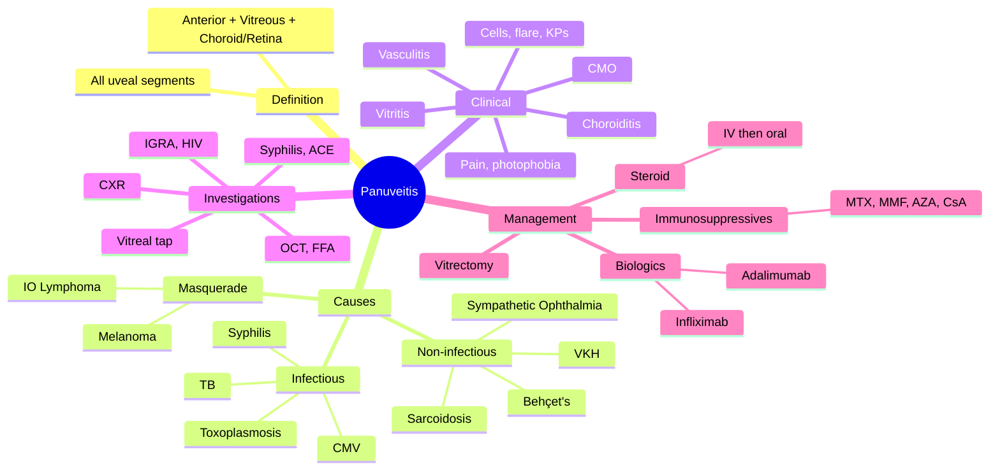

# Panuveitis

Related: [[VKH Syndrome]], [[Behcet's Disease (Ocular)]], [[Sympathetic Ophthalmia]]

> [!tip] **FCPS/MRCP Priority: HIGH**
> Inflammation of anterior + intermediate + posterior segments. VKH, Behçet's, sympathetic ophthalmia, sarcoid, TB, syphilis. Often requires systemic immunosuppression.

---

## Learning Objectives
- [ ] Define panuveitis and distinguish from anterior, intermediate, and posterior uveitis
- [ ] List the common infectious and non-infectious causes
- [ ] Recognise clinical features across all ocular segments
- [ ] Describe the step-up approach to immunosuppressive therapy
- [ ] Identify when biologics and vitrectomy are indicated

---

## 1. Definition / Epidemiology / Classification

### Definition
- **Panuveitis:** Inflammation involving the anterior chamber, vitreous, and retina/choroid simultaneously
- All three segments of the uveal tract affected
- A descriptive term, not a single diagnosis — search for underlying cause

### Epidemiology
- Accounts for ~5–10% of all uveitis referrals in tertiary centres
- Bilateral in 60–80% of non-infectious cases
- Wide age range; cause-specific (e.g. VKH 20–50 y, sarcoidosis 20–40 y)

### Classification
- **Non-infectious (immune-mediated):** VKH, sympathetic ophthalmia, Behçet's, sarcoidosis, birdshot
- **Infectious:** TB, syphilis, toxoplasmosis (severe), CMV, endogenous fungal/bacterial endophthalmitis
- **Masquerade:** Primary intraocular lymphoma (CNS DLBCL), metastatic carcinoma, retinoblastoma (children), uveal melanoma

---

## 2. Aetiology / Pathophysiology

### Non-Infectious (Autoimmune)
- **VKH syndrome** — T-cell mediated against melanocytes
- **Sympathetic ophthalmia** — post-traumatic / post-surgical
- **Behçet's disease** — neutrophilic / T-cell
- **Sarcoidosis** — non-caseating granulomas
- **Birdshot chorioretinopathy** — HLA-A29

### Infectious
- **Tuberculosis** (Mycobacterium tuberculosis) — choroiditis, vasculitis
- **Syphilis** (Treponema pallidum) — great imitator
- **Toxoplasmosis** (severe, multifocal)
- **CMV retinitis** (immunosuppressed, HIV)
- **Endophthalmitis** (endogenous, fungal — Candida; bacterial)

### Masquerade
- Primary intraocular lymphoma
- Uveal melanoma (diffuse)
- Metastatic carcinoma

### Pathophysiology
- Breakdown of blood-ocular barrier
- Cytokine release (TNF-α, IL-6, IFN-γ)
- T-cell and B-cell infiltration
- Retinal/choroidal damage from ischaemia, inflammation, scarring

---

## 3. Clinical Features

### History
- Pain, photophobia (anterior segment)
- ↓ Visual acuity
- Floaters (intermediate, posterior)
- Scotomata, metamorphopsia (posterior)
- Systemic features: meningismus, oral/genital ulcers, skin lesions, cough, weight loss
- Travel, exposure (TB), sexual history (syphilis), HIV risk

### Examination
- **Anterior segment:** Cells, flare, KPs (granulomatous = mutton-fat, non-granulomatous = small)
- **Intermediate/vitreous:** Vitritis (cells, haze), snowballs, snowbanking
- **Posterior segment:**
  - Choroiditis (focal, multifocal, placoid)
  - Vasculitis (periphlebitis — sarcoid "candle-wax drippings")
  - Retinitis, CMO
  - Dalen-Fuchs nodules
  - Disc oedema
  - Exudative / tractional RD

### Granulomatous vs Non-Granulomatous
| Feature | Granulomatous | Non-Granulomatous |
|---------|---------------|---------------------|
| KPs | Mutton-fat, large | Small, fine |
| Iris nodules | Koeppe, Busacca | None |
| Course | Insidious | Acute |
| Examples | VKH, sarcoid, SO, TB, syphilis | HLA-B27, Behçet's |

---

## 4. Investigations

### First-Line
- **Full history** (systemic symptoms, travel, exposures)
- **Slit-lamp** ± tonometry
- **Dilated fundus** (indirect)
- **OCT** (macular oedema)
- **FFA** (leakage, vasculitis, ischaemia, CNV)
- **Wide-field imaging**

### To Find Cause
- **Bloods:** FBC, ESR, CRP, ACE, syphilis serology (VDRL/RPR + TPHA/FTA), QuantiFERON-TB Gold / T-SPOT, HIV, HLA-B27, HLA-B51 (Behçet's), ANCA, ANA
- **CXR** (sarcoid, TB)
- **Mantoux / IGRA** (TB)
- **CSF** (VKH, lymphoma, syphilis)
- **Vitreal tap** for PCR / cytology (suspected infection / lymphoma)
- **Brain MRI** (lymphoma, MS)

---

## 5. Differential Diagnosis

| Condition | Distinguishing Feature |
|-----------|------------------------|
| **Anterior uveitis only** | Cells/flare only, no vitritis/choroiditis |
| **Posterior uveitis** | No anterior chamber involvement |
| **Endophthalmitis** | Acute, hypopyon, pain, often post-op |
| **Masquerade — IO lymphoma** | Vitritis resistant to steroid, elderly, CNS signs |
| **Masquerade — uveal melanoma** | Pigmented mass, diffuse variant |

---

## 6. Management

### General Principle — Step-Up Therapy
1. Treat underlying cause (anti-TB, penicillin for syphilis, HAART for HIV)
2. Corticosteroids
3. Steroid-sparing immunosuppression
4. Biologics for refractory disease

### Specific
- **Systemic corticosteroid:**
  - IV methylprednisolone 1 g × 3 days → oral prednisolone 1 mg/kg, slow taper (3–6 months, sometimes longer)
- **Immunosuppressives (second-line / steroid-sparing):**
  - Methotrexate, azathioprine, mycophenolate mofetil (MMF), cyclosporine, tacrolimus
- **Biologics (refractory):**
  - Adalimumab (anti-TNF-α) — Behçet's, refractory uveitis (SYCAMORE, VISUAL trials)
  - Infliximab
  - Tocilizumab (IL-6R), rituximab (anti-CD20)
- **Local therapy:**
  - Intravitreal steroid (dexamethasone implant Ozurdex, fluocinolone implant Iluvien, triamcinolone)
  - Periocular steroid
- **Surgical:**
  - Pars plana vitrectomy — diagnostic (lymphoma, infection) and therapeutic (non-clearing vitreous opacities, tractional RD)
  - Enucleation (sympathetic ophthalmia — blind, painful exciting eye)
- **Adjunct:** Cycloplegia (posterior synechiae prevention), IOP control

---

## 7. Complications

- **Cataract** (steroid, chronic inflammation)
- **Glaucoma** (steroid response, angle closure from PAS, pupillary block)
- **CMO** (chronic vision loss)
- **Vitreous opacification, fibrosis**
- **Tractional / rhegmatogenous retinal detachment**
- **Optic atrophy**
- **Phthisis bulbi** (end-stage)
- **Neovascular glaucoma** (ischaemic disease)

---

## 8. Red Flags / Emergencies

- Acute painful red eye with hypopyon (endophthalmitis, Behçet's)
- Sudden vision loss (RD, optic neuropathy, vascular occlusion)
- IOP spike
- Sympathetic ophthalmia after penetrating injury
- Suspected masquerade (intravitreal methotrexate, oncologist)

---

## 9. FCPS/MRCP High-Yield Summary

| Category | Key Points |
|----------|------------|
| Definition | Inflammation of all uveal segments |
| Common causes | VKH, SO, Behçet's, sarcoid, TB, syphilis, toxoplasmosis |
| Masquerade | IO lymphoma — always consider |
| Workup | FFA, OCT, syphilis, ACE, IGRA, CXR, ± vitreal tap |
| Treatment | Steroid → immunosuppression → biologics |
| Biologic | Adalimumab (Behçet's, refractory) |
| Surgical | Vitrectomy (diagnostic, therapeutic) |

---

## 10. Viva Questions

1. **Q:** What is panuveitis?
   **A:** Inflammation involving anterior chamber + vitreous + retina/choroid. All three segments.
2. **Q:** List 5 causes of panuveitis.
   **A:** VKH, sympathetic ophthalmia, Behçet's, sarcoidosis, TB, syphilis, toxoplasmosis, endophthalmitis, IO lymphoma.
3. **Q:** What is the difference between granulomatous and non-granulomatous uveitis?
   **A:** Granulomatous = mutton-fat KPs, iris nodules, insidious course (VKH, sarcoid, TB, syphilis, SO). Non-granulomatous = small KPs, acute (HLA-B27, Behçet's).
4. **Q:** What is the role of adalimumab in uveitis?
   **A:** Anti-TNF-α used for refractory non-infectious uveitis, especially Behçet's (SYCAMORE, VISUAL trials).
5. **Q:** When is vitrectomy indicated in panuveitis?
   **A:** Diagnostic (suspected lymphoma, infection) and therapeutic (non-clearing vitreous opacity, tractional RD).

---

## 11. Common Confusions / Exam Traps

| Confusion | Clarification |
|-----------|---------------|
| "Panuveitis is a diagnosis" | It is a *pattern* — always search for underlying cause |
| "Steroids cure all uveitis" | Steroids suppress but cause cataract, glaucoma, CMO; need steroid-sparing agents |
| "Vitritis in elderly = uveitis" | Consider primary intraocular lymphoma (DLBCL) — diagnosis by vitreal tap |
| "All granulomatous uveitis is infectious" | Sarcoid, VKH, SO are non-infectious granulomatous |
| "Anti-TNF is first line for all uveitis" | First line is corticosteroids + cause-specific therapy; anti-TNF is for refractory |

---

## 12. Mnemonics

1. **"PAN-uveitis = ALL segments"** — P (Posterior) + A (Anterior) + N (iNtermediate — vitreous)
2. **"BLAST" for infectious panuveitis causes** — **B**artonella, **L**yme, **A**IDS-related (CMV, syphilis), **S**yphilis, **T**B/Toxoplasmosis
3. **"VITAMINS" for uveitis causes (general)** — **V**iral, **I**diopathic, **T**oxoplasmosis, **A**utoimmune, **M**asquerade, **I**nflammatory (sarcoid, VKH), **N**eoplasia, **S**yphilis

---

## 13. Mind Map

---

## 14. One-Page Revision Card

| **Topic** | **Panuveitis** |
|-----------|----------------|
| **Definition** | Inflammation of all uveal segments |
| **Causes** | VKH, SO, Behçet's, sarcoid, TB, syphilis, IO lymphoma |
| **Examination** | AC cells/flare, KPs, vitritis, choroiditis, vasculitis |
| **Workup** | FFA, OCT, syphilis, ACE, IGRA, CXR, ± vitreal tap |
| **Treatment** | Steroid → immunosuppression → biologics |
| **Biologic** | Adalimumab (refractory, Behçet's) |
| **Masquerade** | IO lymphoma — vitreal tap, IL-10/IL-6 ratio |
| **Viva Pearl** | "All segments = all causes" — search, don't just treat |

---

## Spaced Repetition Trackers

### 24-Hour Recall Prompts
- [ ] Define panuveitis
- [ ] List 5 causes (3 non-infectious, 2 infectious, 1 masquerade)
- [ ] Step-up management: steroid → immunosuppression → biologic
- [ ] Role of adalimumab
- [ ] When to suspect IO lymphoma

### Revision Schedule
- [ ] **Day 1** completed (creation + 24h recall)
- [ ] **Day 3** revision completed
- [ ] **Day 7** revision completed
- [ ] **Day 15** revision completed
- [ ] **Day 30** revision completed
- [ ] **Day 90** revision completed

---

## Must Know / Should Know / Nice to Know

### Must Know (Core for passing)
- [x] Definition (all 3 segments)
- [x] Major non-infectious causes (VKH, SO, Behçet's, sarcoid)
- [x] Major infectious causes (TB, syphilis, toxoplasmosis)
- [x] Initial workup (FFA, OCT, syphilis, ACE, IGRA, HIV, CXR)
- [x] Step-up therapy (steroid → steroid-sparing → biologic)

### Should Know (High probability)
- [x] Granulomatous vs non-granulomatous features
- [x] Masquerade — IO lymphoma
- [x] Adalimumab indications
- [x] Indications for vitrectomy
- [x] Complications (cataract, glaucoma, CMO, RD)

### Nice to Know (Differentiator)
- [ ] Biologic agents (infliximab, tocilizumab, rituximab)
- [ ] Pathogenesis of blood-ocular barrier breakdown
- [ ] IL-10/IL-6 ratio in IO lymphoma
- [ ] HLA associations (B27, B51, A29, DR4)

---

## My Weak Points
- [ ] Add personal weak areas here

---

## Self-Test Scorecard

| Section | Score /5 |
|---------|----------|
| Understanding: | /10 |
| Recall: | /10 |
| MCQ Performance: | /10 |
| SBA Performance: | /10 |
| Viva Confidence: | /10 |
| Total: | /50 |

> [!tip] **Interpretation:** <35 = weak topic, 35-44 = acceptable but insecure, 45+ = strong exam-ready topic.

---

## Exam Answer Modes

### Long Answer Skeleton
1. Definition — panuveitis = inflammation of anterior + vitreous + retina/choroid
2. Classification (non-infectious, infectious, masquerade)
3. Causes (5–7 with one-liner each)
4. Clinical features (anterior + vitreous + posterior + systemic)
5. Investigations (basic workup + disease-specific)
6. Management (step-up: steroid → immunosuppression → biologic; treat cause)
7. Complications and prognosis

### Short Note Skeleton
- Definition + main causes
- Granulomatous vs non-granulomatous
- Workup outline
- Step-up therapy

### Viva One-Liners
- **Q:** What is panuveitis? → **A:** Inflammation of all uveal segments
- **Q:** 5 causes? → **A:** VKH, SO, Behçet's, sarcoid, TB (and syphilis, toxoplasmosis, IO lymphoma)
- **Q:** Step-up therapy? → **A:** Steroid → immunosuppression → biologic
- **Q:** Best biologic? → **A:** Adalimumab (anti-TNF-α)
- **Q:** When to suspect IO lymphoma? → **A:** Elderly + bilateral vitritis + steroid-resistant

### Ward-Case Discussion Points
- Always look for underlying cause — panuveitis is a pattern, not a diagnosis
- Granulomatous KPs (mutton-fat) suggest VKH, sarcoid, TB, syphilis, SO
- Sympathetic ophthalmia in any patient with prior penetrating injury + bilateral panuveitis
- Consider IO lymphoma in elderly with chronic vitritis
- Step-up therapy — avoid long-term high-dose steroid monotherapy

### Last-Night-Before-Exam Sheet
- Top 3 facts: definition, top 5 causes, step-up therapy
- 1 mnemonic: "PAN-uveitis = ALL segments" or "VITAMINS"
- Must-know differential: anterior / intermediate / posterior uveitis (sectoral)
- High-yield: adalimumab for refractory, IO lymphoma as masquerade

---

## Summary

Panuveitis is inflammation involving all uveal segments (anterior, intermediate, posterior). It is a descriptive pattern, not a single diagnosis — aetiology includes non-infectious (VKH, sympathetic ophthalmia, Behçet's, sarcoidosis), infectious (TB, syphilis, toxoplasmosis, CMV), and masquerade (intraocular lymphoma). Workup must identify the underlying cause (FFA, OCT, serology, CXR, vitreal tap). Treatment is step-up: cause-specific therapy → corticosteroids → steroid-sparing immunosuppression → biologics (adalimumab for refractory disease). Vitrectomy has diagnostic and therapeutic roles. Complications include cataract, glaucoma, CMO, and RD.

---

## MCQs (10)

1. **Question:** Panuveitis involves which ocular structures?
   **Options:** A. Anterior chamber only B. Posterior segment only C. Vitreous only D. Anterior chamber + vitreous + retina/choroid E. Optic nerve only
   **Answer:** D
   **Explanation:** Panuveitis = all three segments of the uvea (anterior, intermediate, posterior).

2. **Question:** Which of the following is the most likely non-infectious cause of bilateral granulomatous panuveitis in a 30-year-old Asian woman with vitiligo and meningismus?
   **Options:** A. Behçet's disease B. VKH syndrome C. Sarcoidosis D. Sympathetic ophthalmia E. HLA-B27 uveitis
   **Answer:** B
   **Explanation:** Bilateral granulomatous panuveitis + vitiligo + meningismus = VKH.

3. **Question:** A patient with panuveitis fails to respond to high-dose corticosteroids. Which biologic agent is most commonly used as next-line therapy?
   **Options:** A. Rituximab B. Adalimumab C. Etanercept D. Bevacizumab E. Ranibizumab
   **Answer:** B
   **Explanation:** Adalimumab (anti-TNF-α) is the standard biologic for refractory non-infectious uveitis (SYCAMORE, VISUAL I/II/III).

4. **Question:** Which of the following is a MASQUERADE cause of panuveitis?
   **Options:** A. TB B. Sarcoidosis C. Primary intraocular lymphoma D. VKH E. Behçet's
   **Answer:** C
   **Explanation:** Primary intraocular lymphoma (CNS DLBCL) presents with chronic vitritis mimicking uveitis — always consider in elderly steroid-resistant cases.

5. **Question:** Mutton-fat KPs and Busacca nodules are characteristic of:
   **Options:** A. Non-granulomatous uveitis B. Granulomatous uveitis C. Bacterial conjunctivitis D. Acute angle-closure glaucoma E. Keratitis
   **Answer:** B
   **Explanation:** Large "mutton-fat" KPs and iris nodules (Koeppe, Busacca) are hallmarks of granulomatous uveitis.

6. **Question:** Which of the following is a first-line investigation in suspected panuveitis?
   **Options:** A. Brain MRI B. Vitreal tap C. FFA and OCT D. Renal biopsy E. Bone marrow biopsy
   **Answer:** C
   **Explanation:** FFA and OCT identify inflammation, vasculitis, leakage, CNV, and CMO. Vitreal tap is later, when cause is uncertain.

7. **Question:** The most important screening blood test for infectious causes of panuveitis is:
   **Options:** A. Serum ACE B. Syphilis serology (VDRL/TPHA) C. ANA D. ANCA E. Cryoglobulins
   **Answer:** B
   **Explanation:** Syphilis is the "great imitator" and reversible cause of uveitis — must be tested in all uveitis workups.

8. **Question:** Indication for pars plana vitrectomy in panuveitis includes:
   **Options:** A. Visual rehabilitation in early disease B. Diagnostic vitreal tap and therapeutic removal of non-clearing opacity C. First-line for Behçet's D. Treatment of acute anterior uveitis E. Reducing IOP
   **Answer:** B
   **Explanation:** Vitrectomy is diagnostic (suspected lymphoma, infection) and therapeutic (non-clearing vitreous opacity, tractional RD).

9. **Question:** Sympathetic ophthalmia typically develops how long after penetrating ocular injury?
   **Options:** A. 24 hours B. 1 week C. 2 weeks to decades (most within 3 months) D. 24 hours to 1 week E. 10+ years only
   **Answer:** C
   **Explanation:** Latency ranges from 2 weeks to decades; 90% within 3 months to 1 year.

10. **Question:** Which systemic disease classically presents with bilateral panuveitis, oral/genital ulcers, and a positive pathergy test?
    **Options:** A. VKH B. Behçet's disease C. Sarcoidosis D. Sympathetic ophthalmia E. Toxoplasmosis
    **Answer:** B
    **Explanation:** Behçet's classic triad (oral ulcers, genital ulcers, uveitis) with pathergy; panuveitis with hypopyon is characteristic.

---

## SBA Questions (10)

1. **Scenario:** A 30-year-old Asian woman presents with bilateral panuveitis, headache, neck stiffness, vitiligo on the face, and tinnitus.
   **Question:** What is the most likely diagnosis?
   **Options:** A. Behçet's disease B. VKH syndrome C. Sarcoidosis D. Sympathetic ophthalmia E. Tuberculous uveitis
   **Answer:** B
   **Explanation:** Bilateral + skin (vitiligo) + CNS (meningismus) + auditory (tinnitus) = VKH.

2. **Scenario:** A 60-year-old man had penetrating eye injury 6 months ago. He now has bilateral panuveitis with mutton-fat KPs and Dalen-Fuchs nodules.
   **Question:** What is the diagnosis?
   **Options:** A. VKH B. Sympathetic ophthalmia C. Sarcoidosis D. TB E. Behçet's
   **Answer:** B
   **Explanation:** History of penetrating injury + bilateral granulomatous panuveitis + Dalen-Fuchs nodules = sympathetic ophthalmia.

3. **Scenario:** A 70-year-old woman has bilateral chronic vitritis resistant to steroids. She develops progressive cognitive decline.
   **Question:** What is the most concerning diagnosis?
   **Options:** A. Chronic VKH B. Primary intraocular lymphoma C. Sympathetic ophthalmia D. Ocular TB E. Sarcoidosis
   **Answer:** B
   **Explanation:** Elderly + bilateral vitritis + steroid-resistant + CNS symptoms = primary intraocular lymphoma (DLBCL). Vitreal tap + IL-10/IL-6 ratio.

4. **Scenario:** A 25-year-old man has recurrent oral ulcers, genital ulcers, and bilateral panuveitis with hypopyon.
   **Question:** What is the most likely diagnosis?
   **Options:** A. VKH B. Behçet's disease C. Sarcoidosis D. Reiter's syndrome E. Stevens-Johnson syndrome
   **Answer:** B
   **Explanation:** Triad of oral + genital ulcers + uveitis = Behçet's. Hypopyon uveitis is classic.

5. **Scenario:** A 35-year-old with bilateral panuveitis is started on high-dose steroids. He develops a relapse when steroids are tapered.
   **Question:** What is the next step in management?
   **Options:** A. Continue high-dose steroids for 6 months B. Add steroid-sparing immunosuppressant (e.g., methotrexate, MMF) C. Enucleate both eyes D. Stop all treatment E. Refer for psychotherapy
   **Answer:** B
   **Explanation:** Steroid-sparing immunosuppression (MTX, MMF, azathioprine, cyclosporine) is added to allow steroid taper and prevent relapse.

6. **Scenario:** A patient with refractory non-infectious uveitis on methotrexate and steroids still has active inflammation. Biologics are considered.
   **Question:** Which biologic is most evidence-based for refractory uveitis?
   **Options:** A. Bevacizumab B. Ranibizumab C. Adalimumab D. Rituximab E. Trastuzumab
   **Answer:** C
   **Explanation:** Adalimumab (anti-TNF-α) is the only biologic with RCT evidence (VISUAL I-III) for refractory non-infectious uveitis.

7. **Scenario:** A 45-year-old patient with bilateral panuveitis has a positive QuantiFERON-TB Gold test.
   **Question:** What is the next step?
   **Options:** A. Start anti-TB therapy (HRZE) with steroid cover B. Start anti-VEGF C. Enucleate D. Vitrectomy alone E. Topical steroid only
   **Answer:** A
   **Explanation:** Latent/active TB-associated uveitis requires anti-TB therapy + systemic steroid cover.

8. **Scenario:** A patient with panuveitis has positive VDRL and TPHA. HIV is negative.
   **Question:** What is the next step?
   **Options:** A. IV methylprednisolone only B. Penicillin (benzathine or IV) C. Topical steroid D. Vitrectomy E. Observation
   **Answer:** B
   **Explanation:** Syphilis is treated with penicillin (benzathine 2.4 MU IM for early, IV crystalline for late/neurosyphilis) + steroid cover to prevent Jarisch-Herxheimer reaction.

9. **Scenario:** A patient with panuveitis has chronic macular oedema unresponsive to anti-VEGF and laser.
   **Question:** Which local therapy is most appropriate?
   **Options:** A. Systemic cyclophosphamide B. Intravitreal dexamethasone implant (Ozurdex) C. Topical NSAIDs D. Acetazolamide E. Watchful waiting
   **Answer:** B
   **Explanation:** Intravitreal steroid implants (dexamethasone, fluocinolone) are effective for refractory CMO in uveitis, especially pseudophakic patients.

10. **Scenario:** A patient with penetrating eye injury has a blind, painful injured eye. The fellow eye is normal. The patient is at risk of sympathetic ophthalmia.
    **Question:** What is the recommended prevention?
    **Options:** A. Immediate high-dose oral steroids in the fellow eye B. Enucleation or evisceration of the blind injured eye within 2 weeks C. Topical antibiotics only D. Observation E. No intervention needed
    **Answer:** B
    **Explanation:** Primary prevention: prompt wound repair + enucleation/evisceration of blind, painful eye within 2 weeks of injury (controversial; if any visual potential, save the eye).

---

## Flashcards

- **Q:** What is panuveitis?
  **A:** Inflammation of all three uveal segments (anterior, vitreous, retina/choroid).
- **Q:** Name 4 non-infectious causes of panuveitis.
  **A:** VKH, sympathetic ophthalmia, Behçet's disease, sarcoidosis.
- **Q:** Name 3 infectious causes of panuveitis.
  **A:** TB, syphilis, toxoplasmosis.
- **Q:** What is the most important masquerade cause of panuveitis?
  **A:** Primary intraocular lymphoma (CNS DLBCL).
- **Q:** What is the first-line biologic for refractory non-infectious uveitis?
  **A:** Adalimumab (anti-TNF-α).

---

## Answer Key with Explanations

### MCQs
1. D — All three uveal segments
2. B — VKH = bilateral granulomatous + vitiligo + meningismus
3. B — Adalimumab is the standard biologic for refractory uveitis
4. C — IO lymphoma is the classic masquerade
5. B — Mutton-fat KPs and Busacca nodules = granulomatous
6. C — FFA and OCT are first-line imaging
7. B — Syphilis is the great imitator — must test
8. B — Vitrectomy is diagnostic and therapeutic
9. C — Latency 2 weeks to decades; 90% within 3 months
10. B — Behçet's = oral + genital ulcers + uveitis

### SBAs
1. B — Bilateral + skin + CNS + auditory = VKH
2. B — Penetrating injury + bilateral panuveitis = sympathetic ophthalmia
3. B — Elderly + chronic vitritis + CNS = IO lymphoma
4. B — Triad of ulcers + uveitis = Behçet's
5. B — Add steroid-sparing agent to allow taper
6. C — Adalimumab is the only biologic with RCT evidence
7. A — TB uveitis requires anti-TB therapy + steroids
8. B — Penicillin is the treatment for ocular syphilis
9. B — Intravitreal dexamethasone implant for refractory CMO
10. B — Enucleation within 2 weeks prevents sympathetic ophthalmia

---

## Tags
#medicine #davidson #ophthalmology #panuveitis #uveitis #fcps #mrcp

## PasTest Scenario SBAs (Clinical Vignettes)

> **Auto-generated PasTest/Mediscope-style scenario SBAs** grounded in the authored source content. Each scenario is a clinical vignette with 4 options. **Source: Ch 28: Medical Ophthalmology / Panuveitis**

**Q1.** A patient is being evaluated for Panuveitis. Based on standard diagnostic approach, what is the most appropriate first-line investigation?

  - **A.** Approach described in standard diagnostic workup
  - **B.** An advanced/invasive test as first-line
  - **C.** Empirical treatment without investigation
  - **D.** Watchful waiting without further testing

  > **Answer: A** — Approach described in standard diagnostic workup

**Q2.** A patient is diagnosed with Panuveitis. What is the most appropriate first-line management approach?

  - **A.** Standard guideline-directed first-line therapy
  - **B.** Most aggressive advanced therapy as first-line
  - **C.** No treatment needed in most cases
  - **D.** Investigational/compassionate-use therapy only

  > **Answer: A** — Standard guideline-directed first-line therapy

**Q3.** Which of the following best describes the underlying pathophysiology / definition of Panuveitis?

  - **A.** **Panuveitis:** Inflammation involving the anterior chamber, vitreous, and retina/choroid simultaneously
  - **B.** A common misattribution to a similar but distinct condition
  - **C.** An outdated or disproven mechanism
  - **D.** A complication rather than the underlying disease process

  > **Answer: A** — **Panuveitis:** Inflammation involving the anterior chamber, vitreous, and retina/choroid simultaneously

