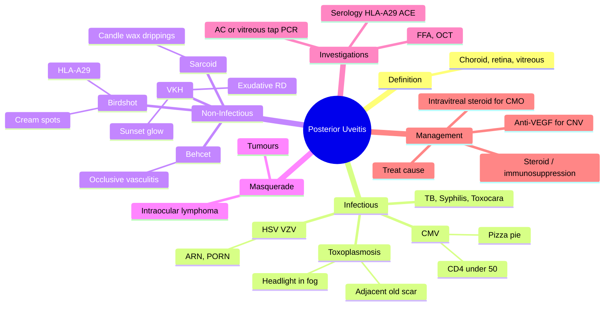

# Posterior Uveitis (Choroiditis / Chorioretinitis)

Related: [[Anterior Uveitis (Iritis)]], [[Toxoplasmosis]], [[CMV Retinitis]]

> [!tip] **FCPS/MRCP Priority: HIGH**
> Inflammation of choroid, retina, vitreous. Floaters, ↓VA, scotoma. Look for retinitis (Toxoplasma, CMV, HSV/VZV), choroiditis (VKH, sarcoid, TB, birdshot).

---

## Learning Objectives
- [ ] Define posterior uveitis and its subtypes (choroiditis, retinitis, chorioretinitis, vasculitis)
- [ ] Identify Toxoplasma as the most common infectious cause and describe "headlight in the fog"
- [ ] Recognise CMV retinitis in AIDS (CD4 <50, "pizza pie" fundus)
- [ ] Describe the fundal findings in VKH (sunset glow) and birdshot (cream spots, HLA-A29)
- [ ] Approach painless ↓VA + floaters with appropriate workup (FFA, OCT, AC/vitreous tap, serology)
- [ ] Apply specific antimicrobial therapy (Toxoplasma, CMV, HSV/VZV, TB, syphilis)
- [ ] Recognise masquerade syndromes in elderly patients

---

## 1. Definition

- **Posterior uveitis:** Inflammation of the choroid, retina, or both
- Includes: choroiditis, chorioretinitis, retinitis, retinal vasculitis
- Vitritis (anterior vitreous cells) often present

## 2. Causes

### Infectious
- **Toxoplasmosis** (most common infectious retinochoroiditis)
- **CMV** (immunocompromised, CD4 <50)
- **HSV, VZV** (acute retinal necrosis, PORN)
- **Toxocara**
- **TB**
- **Syphilis**
- **Candidiasis** (IVDU, immunocompromised)

### Non-infectious
- **Sarcoidosis** (granulomatous choroiditis, candle-wax drippings)
- **VKH syndrome** (exudative RD, "sunset glow" fundus)
- **Behçet's disease** (panuveitis, occlusive vasculitis)
- **Birdshot chorioretinopathy** (HLA-A29, multiple cream spots)
- **Sympathetic ophthalmia** (post-traumatic, bilateral)
- **Multiple evanescent white dot syndrome (MEWDS)** — young women, self-limiting
- **Punctate inner choroiditis (PIC)**
- **Serpiginous choroiditis**
- **Idiopathic multifocal choroiditis**

### Masquerade
- **Intraocular lymphoma** (elderly, vitritis, subretinal infiltrates)
- **Intraocular tumour** (retinoblastoma, melanoma)
- **Uveal effusion syndrome**

## 3. Clinical Features

### Symptoms
- **Floaters, blurred vision, scotoma**
- Often **painless** (vs anterior)
- Photopsia
- May have systemic features (sarcoid, TB, syphilis)

### Signs
- **Vitritis** (anterior vitreous cells)
- **Chorioretinal lesions:**
  - Yellow-white infiltrates
  - Active borders (oedema, haemorrhage) vs old scars (pigmented)
  - **Toxoplasma:** Adjacent to old pigmented scar, "headlight in fog" (focal retinitis over vitreous haze)
  - **CMV:** Perivascular haemorrhage + necrosis ("pizza pie" or "cottage cheese" + ketchup)
  - **Birdshot:** Multiple cream-coloured spots along mid-periphery
  - **VKH:** Exudative RD, "sunset glow" fundus
- **Vasculitis:** Perivascular sheathing, occlusion, haemorrhage
- **CMO** (chronic)
- **Disc oedema**

## 4. Investigations

- **Fundoscopy** (dilated, indirect preferred)
- **FFA, OCT** (CMO, CNV)
- **AC or vitreous tap:** PCR (Toxoplasma, HSV, VZV, CMV, TB)
- **Blood:** Syphilis, HIV, TB (IGRA, QuantiFERON), ACE, lysozyme, HLA-A29 (birdshot)
- **CXR** (sarcoid, TB)
- **Systemic workup** as indicated

## 5. Management

### Specific
- **Toxoplasmosis:** Pyrimethamine + sulfadiazine + folinic acid, or trimethoprim-sulfamethoxazole, or clindamycin; ± systemic steroid
- **CMV:** Ganciclovir, valganciclovir, foscarnet
- **HSV/VZV (ARN):** IV aciclovir, then oral; ± intravitreal
- **TB:** Antitubercular therapy + steroid
- **Syphilis:** Penicillin
- **Toxocara:** Albendazole, ± steroid
- **Sarcoidosis:** Steroid, immunosuppression
- **VKH, Behçet's, Birdshot:** Systemic steroid + immunosuppression (azathioprine, MTX, MMF, cyclosporine, biologics)
- **Idiopathic:** Steroid + immunosuppression

### Adjunct
- **Intravitreal steroid** (TA, dexamethasone implant, fluocinolone implant) for CMO
- **Anti-VEGF** for CNV (e.g., PIC)
- **Vitrectomy** (diagnostic, therapeutic — dense vitritis, lymphoma)

## 6. FCPS/MRCP High-Yield Summary

| Cause | Lesion | Notes |
|-------|--------|-------|
| Toxoplasmosis | Adjacent to old scar | Most common |
| CMV | Perivascular haemorrhage + necrosis | CD4 <50, AIDS |
| VKH | Exudative RD, sunset glow | Bilateral panuveitis |
| Birdshot | Cream-coloured spots | HLA-A29 |
| Behçet's | Occlusive vasculitis | Panuveitis |
| Sarcoid | Candle-wax drippings | Granulomatous |

## 7. Red Flags / Emergencies
- CD4 <50 patient with floaters → suspect CMV retinitis — urgent
- Acute retinal necrosis (peripheral necrotising retinitis) — needs IV aciclovir to prevent fellow eye
- Vitritis in elderly with subretinal infiltrates — think intraocular lymphoma
- Bilateral granulomatous panuveitis with exudative RD — VKH
- Progressive outer retinal necrosis (PORN) in severely immunocompromised — ophthalmic emergency

## 8. Viva Questions

1. **Q:** What is the most common cause of posterior uveitis?
   **A:** Toxoplasmosis (most common infectious cause).

2. **Q:** What is "headlight in the fog" appearance?
   **A:** Toxoplasma retinochoroiditis — bright retinal lesion shining through hazy vitreous.

3. **Q:** When do you suspect CMV retinitis?
   **A:** AIDS patient with CD4 <50, "pizza pie" or "cottage cheese + ketchup" fundus (yellow-white necrosis + haemorrhage).

4. **Q:** What is acute retinal necrosis (ARN)?
   **A:** HSV or VZV infection causing rapidly progressive peripheral necrotising retinitis — needs urgent IV aciclovir.

5. **Q:** What features suggest intraocular lymphoma in a patient with vitritis?
   **A:** Elderly patient, vitritis unresponsive to steroid, subretinal infiltrates, CNS symptoms — needs vitreous tap for cytology (IL-10:IL-2 ratio).

## 9. Common Confusions / Exam Traps

| Confusion | Clarification |
|-----------|---------------|
| "Toxoplasma always primary infection" | Most ocular toxoplasmosis is reactivation adjacent to an old pigmented scar |
| "CMV retinitis needs steroids" | NO — steroids alone worsen CMV; need antiviral (ganciclovir/valganciclovir) |
| "Birdshot is one eye" | Birdshot is almost always bilateral and symmetric |
| "VKH only affects the eye" | VKH is a systemic disease: meningismus, tinnitus, vitiligo, poliosis, alopecia |
| "Steroid-responsive = autoimmune" | TB and syphilis choroiditis can transiently improve with steroids — never use without anti-microbial cover |
| "PORN = ARN" | PORN is in severely immunocompromised, no vitritis, worse prognosis, VZV/HSV/CMV |
| "Vitritis = posterior uveitis" | Vitritis can be intermediate (pars planitis) — define by primary site of inflammation |

## 10. Mnemonics

1. **"CMV is Cottage Cheese + Ketchup"** — yellow-white necrosis (cottage cheese) + haemorrhage (ketchup) in AIDS (CD4 <50).
2. **"Toxoplasma Treats Old Scars Badly"** — reactivation of cysts at pigmented old scars.
3. **"Birdshot = Bilateral + HLA-A29"** — cream spots radiating from disc like birdshot pellets.
4. **"VKH: Very Kind Head"** — meningeal + auditory + integumentary + ocular features (vestibular, headache, alopecia, poliosis, vitiligo).

## 11. Mind Map

## 12. One-Page Revision Card

| **Topic** | **Posterior Uveitis (Choroiditis)** |
|-----------|------------------------------------|
| **Definition** | Inflammation of choroid ± retina |
| **Symptoms** | Floaters, ↓VA, scotoma, painless |
| **Most Common Infectious Cause** | Toxoplasmosis |
| **AIDS Clue** | CMV retinitis (CD4 <50, pizza pie) |
| **Bilateral Panuveitis Clue** | VKH (sunset glow, exudative RD) |
| **HLA-A29** | Birdshot chorioretinopathy |
| **Key Sign** | Vitritis, chorioretinal lesions, vasculitis |
| **Investigations** | FFA, OCT, PCR of AC/vitreous tap, serology |
| **Treatment** | Treat cause + ± steroid/immunosuppression |
| **Viva Pearl** | "Headlight in fog" = Toxoplasma |

## 13. Summary

Posterior uveitis includes choroiditis, retinitis, vasculitis. Painless floaters, ↓VA, scotoma. Toxoplasmosis is the most common infectious cause. CMV in immunocompromised. Treat underlying cause. Vitritis + retinitis in elderly = consider lymphoma (masquerade).

## Spaced Repetition Trackers

### 24-Hour Recall Prompts
- [ ] Define posterior uveitis and list its subtypes
- [ ] Name the most common infectious cause and its classic fundal sign
- [ ] Identify the fundal appearance and CD4 threshold for CMV retinitis
- [ ] Recall "sunset glow" fundus and its associated disease
- [ ] State HLA association for birdshot chorioretinopathy
- [ ] List the first-line treatment for Toxoplasma retinochoroiditis

### Revision Schedule
- [ ] **Day 1** completed (creation + 24h recall)
- [ ] **Day 3** revision completed
- [ ] **Day 7** revision completed
- [ ] **Day 15** revision completed
- [ ] **Day 30** revision completed
- [ ] **Day 90** revision completed

## Must Know / Should Know / Nice to Know

### Must Know (Core for passing)
- [x] Definition (choroid, retina, vitreous)
- [x] Toxoplasmosis as most common infectious cause + "headlight in fog"
- [x] CMV retinitis in AIDS (CD4 <50, pizza pie)
- [x] Toxoplasma treatment: pyrimethamine + sulfadiazine + folinic acid
- [x] Painless floaters + ↓VA + scotoma = posterior uveitis symptom triad

### Should Know (High probability)
- [x] VKH features (sunset glow, exudative RD, bilateral)
- [x] Birdshot: HLA-A29, cream spots
- [x] Behçet's: occlusive vasculitis
- [x] Investigations: FFA, OCT, PCR of tap
- [x] Masquerade syndromes in elderly (lymphoma)

### Nice to Know (Differentiator)
- [ ] ARN vs PORN (immunocompetent vs severely immunocompromised)
- [ ] Intravitreal steroid implant for CMO
- [ ] Vitreous tap for intraocular lymphoma (IL-10:IL-2 ratio)
- [ ] MEWDS, PIC, serpiginous choroiditis
- [ ] Anti-VEGF for CNV secondary to PIC

## My Weak Points
- [ ] Add personal weak areas here

## Self-Test Scorecard

| Section | Score /5 |
|---------|----------|
| Understanding: | /10 |
| Recall: | /10 |
| MCQ Performance: | /10 |
| SBA Performance: | /10 |
| Viva Confidence: | /10 |
| Total: | /50 |

> [!tip] **Interpretation:** <35 = weak topic, 35-44 = acceptable but insecure, 45+ = strong exam-ready topic.

## Exam Answer Modes

### Long Answer Skeleton
1. **Definition** — Inflammation of choroid, retina, or both
2. **Causes** — Infectious (Toxoplasma, CMV, HSV/VZV, TB, syphilis, Toxocara, Candida); non-infectious (VKH, Behçet's, birdshot, sarcoid, MEWDS, PIC, serpiginous); masquerade (lymphoma, tumours)
3. **Clinical features** — Painless floaters, ↓VA, scotoma; vitritis, chorioretinal lesions, vasculitis, CMO, disc oedema
4. **Specific patterns** — Toxoplasma (headlight in fog, old scar); CMV (pizza pie, CD4 <50); VKH (sunset glow, exudative RD); birdshot (cream spots, HLA-A29)
5. **Investigations** — Dilated fundus, FFA, OCT, AC/vitreous tap for PCR, serology (syphilis, HIV, TB, ACE, HLA-A29)
6. **Management** — Treat specific cause; ± systemic steroid; immunosuppression for non-infectious; intravitreal steroid for CMO; vitrectomy for diagnostic/therapeutic
7. **Complications** — CMO, CNV, retinal detachment, permanent vision loss

### Short Note Skeleton
- Definition + symptom triad (floaters, ↓VA, painless)
- Toxoplasmosis — headlight in fog, old scar, treat with pyrimethamine/sulfadiazine/folinic acid
- CMV retinitis — CD4 <50, pizza pie, treat with ganciclovir
- VKH — sunset glow, exudative RD
- Investigations: FFA, OCT, PCR of tap, serology

### Viva One-Liners
- **Q:** Most common infectious cause of posterior uveitis? → **A:** Toxoplasmosis.
- **Q:** "Headlight in the fog"? → **A:** Toxoplasma retinochoroiditis — focal retinitis shining through vitreous haze.
- **Q:** When to suspect CMV retinitis? → **A:** AIDS with CD4 <50, "pizza pie" fundus (necrosis + haemorrhage).
- **Q:** "Sunset glow" fundus? → **A:** VKH — orange-red appearance from choroidal depigmentation.
- **Q:** HLA-A29 association? → **A:** Birdshot chorioretinopathy.
- **Q:** What is the treatment of Toxoplasma chorioretinitis? → **A:** Pyrimethamine + sulfadiazine + folinic acid, or TMP-SMX or clindamycin; ± systemic steroid.

### Ward-Case Discussion Points
- Differentiate posterior uveitis from retinal detachment, optic neuritis
- Identify Toxoplasma vs CMV fundal patterns
- Suspect masquerade in elderly with steroid-unresponsive vitritis
- Plan AC or vitreous tap for PCR
- Counsel on HIV testing in CMV retinitis
- Discuss when to start systemic vs intravitreal therapy

### Last-Night-Before-Exam Sheet
- **Top 5 facts:** Painless floaters + ↓VA, vitritis, headlight in fog (Toxoplasma), pizza pie (CMV), sunset glow (VKH)
- **Mnemonic:** "CMV is Cottage Cheese + Ketchup"
- **Mnemonic:** "Birdshot = Bilateral + HLA-A29"
- **Treatment essentials:** Treat cause + ± steroid/immunosuppression; intravitreal steroid for CMO
- **Don't forget:** HIV test in any patient with CMV-pattern retinitis

## MCQs (10)

1. **Q:** Most common infectious cause of posterior uveitis:
   **Options:** A. CMV B. Toxoplasmosis C. HSV D. TB E. Candida
   **Answer:** B
   **Explanation:** Toxoplasma is most common infectious retinochoroiditis.

2. **Q:** "Sunset glow" fundus is characteristic of:
   **Options:** A. Behçet's B. VKH C. Sarcoid D. Birdshot E. Toxoplasmosis
   **Answer:** B
   **Explanation:** VKH — orange-red fundus from depigmentation.

3. **Q:** CMV retinitis typically occurs in patients with CD4:
   **Options:** A. <200 B. <100 C. <50 D. <20 E. <10
   **Answer:** C
   **Explanation:** CD4 <50 in AIDS.

4. **Q:** "Headlight in the fog" describes:
   **Options:** A. CMV retinitis B. Toxoplasma retinochoroiditis C. VKH D. Birdshot E. Candida endophthalmitis
   **Answer:** B
   **Explanation:** Bright Toxoplasma lesion shining through hazy vitreous.

5. **Q:** Birdshot chorioretinopathy is associated with:
   **Options:** A. HLA-B27 B. HLA-A29 C. HLA-DR4 D. HLA-B51 E. HLA-DQ2
   **Answer:** B
   **Explanation:** HLA-A29 — multiple cream-coloured spots radiating from the disc.

6. **Q:** First-line systemic treatment for ocular toxoplasmosis is:
   **Options:** A. Acyclovir B. Pyrimethamine + sulfadiazine + folinic acid C. Ganciclovir D. Penicillin E. Albendazole
   **Answer:** B
   **Explanation:** Classic triple therapy ± systemic steroid.

7. **Q:** Acute retinal necrosis (ARN) is most commonly caused by:
   **Options:** A. CMV B. Toxoplasma C. HSV/VZV D. Candida E. TB
   **Answer:** C
   **Explanation:** HSV-1/2 and VZV are the most common causes; needs urgent IV aciclovir.

8. **Q:** The "pizza pie" or "cottage cheese + ketchup" fundus appearance is most characteristic of:
   **Options:** A. Toxoplasmosis B. CMV retinitis C. VKH D. Birdshot E. Sarcoidosis
   **Answer:** B
   **Explanation:** CMV — yellow-white necrosis (cottage cheese) + haemorrhage (ketchup).

9. **Q:** An elderly patient with persistent vitritis and subretinal infiltrates unresponsive to steroids — most concerning diagnosis:
   **Options:** A. VKH B. Toxoplasmosis C. Intraocular lymphoma D. Sarcoidosis E. Sympathetic ophthalmia
   **Answer:** C
   **Explanation:** Vitreoretinal lymphoma masquerading as uveitis; needs vitreous tap for cytology.

10. **Q:** VKH syndrome is associated with all EXCEPT:
    **Options:** A. Exudative retinal detachment B. Meningismus C. Poliosis D. Hyperpigmented skin lesions E. Tinnitus
    **Answer:** D
    **Explanation:** VKH features depigmentation (vitiligo, poliosis, alopecia) — NOT hyperpigmentation.

## SBA Questions (10)

1. **Scenario:** A 35-year-old with AIDS (CD4 30) has floaters, ↓VA, fundus shows yellow-white perivascular retinal necrosis with haemorrhage.
   **Question:** Diagnosis?
   **Options:** A. Toxoplasmosis B. CMV retinitis C. Toxocara D. HSV E. Syphilis
   **Answer:** B
   **Explanation:** CD4 <50 + pizza-pie = CMV.

2. **Scenario:** A 25-year-old with floaters and a focal retinochoroiditis adjacent to an old pigmented scar. Vitreous haze gives a "headlight in the fog" appearance.
   **Question:** Most likely diagnosis?
   **Options:** A. CMV B. Toxoplasmosis C. VKH D. Birdshot E. Toxocara
   **Answer:** B
   **Explanation:** Headlight in fog + old scar = Toxoplasma.

3. **Scenario:** A 30-year-old woman with bilateral panuveitis, headache, tinnitus, exudative retinal detachment, and vitiligo.
   **Question:** Most likely diagnosis?
   **Options:** A. Behçet's B. Sarcoidosis C. VKH D. Birdshot E. Sympathetic ophthalmia
   **Answer:** C
   **Explanation:** VKH — bilateral granulomatous panuveitis + neuro/auditory + integumentary signs.

4. **Scenario:** A 50-year-old white woman presents with bilateral floaters and ↓VA. Fundus shows multiple cream-coloured choroidal spots radiating from the disc. HLA-A29 is positive.
   **Question:** Diagnosis?
   **Options:** A. Birdshot chorioretinopathy B. VKH C. Toxoplasmosis D. Sarcoidosis E. MEWDS
   **Answer:** A
   **Explanation:** Birdshot = bilateral, cream spots, HLA-A29.

5. **Scenario:** A 30-year-old immunocompetent patient presents with rapidly progressive peripheral necrotising retinitis with prominent vitritis.
   **Question:** Most appropriate initial therapy?
   **Options:** A. Oral steroids alone B. IV aciclovir C. Pyrimethamine + sulfadiazine D. Ganciclovir E. Anti-VEGF
   **Answer:** B
   **Explanation:** Acute retinal necrosis (HSV/VZV) — IV aciclovir to save fellow eye.

6. **Scenario:** A patient with ocular toxoplasmosis is being treated with pyrimethamine + sulfadiazine. They develop thrombocytopenia.
   **Question:** Most appropriate management?
   **Options:** A. Stop all therapy B. Add folinic acid (leucovorin) — check FBC C. Switch to aciclovir D. Add ganciclovir E. Reduce steroid
   **Answer:** B
   **Explanation:** Folinic acid rescues bone marrow from pyrimethamine; monitor FBC.

7. **Scenario:** A 60-year-old with chronic vitritis, subretinal infiltrates, and a history of CNS lymphoma develops ↓VA in both eyes.
   **Question:** Most likely diagnosis?
   **Options:** A. Sarcoidosis B. Vitreoretinal (intraocular) lymphoma C. TB choroiditis D. VKH E. CMV retinitis
   **Answer:** B
   **Explanation:** Vitreoretinal lymphoma is a CNS lymphoma manifestation; suspect in steroid-unresponsive vitritis.

8. **Scenario:** A patient with posterior uveitis develops CMO confirmed on OCT. Vision is 6/24.
   **Question:** Most appropriate adjunctive therapy?
   **Options:** A. Topical steroid B. Intravitreal steroid implant C. Topical NSAID D. Cycloplegic E. Lubricants
   **Answer:** B
   **Explanation:** Intravitreal steroid (dexamethasone/fluocinolone implant) is highly effective for uveitic CMO.

9. **Scenario:** A patient with healed Toxoplasma chorioretinitis presents with a new lesion at the border of the old pigmented scar.
   **Question:** What does this represent?
   **Options:** A. New infection B. Reactivation of dormant cysts C. CMV co-infection D. CNV E. VKH
   **Answer:** B
   **Explanation:** Ocular toxoplasmosis is usually reactivation of cysts at an old scar — most cases are not primary infection.

10. **Scenario:** A patient with progressive outer retinal necrosis (PORN) is severely immunocompromised. There is no vitritis, but multifocal deep retinal necrosis is present.
    **Question:** What is the typical causative organism?
    **Options:** A. HSV/VZV/CMV B. Toxoplasma C. Candida D. TB E. Toxocara
    **Answer:** A
    **Explanation:** PORN — VZV, HSV, CMV; poor prognosis, no vitritis (unlike ARN).

## Flashcards

- **Q:** What is posterior uveitis?
  **A:** Inflammation of the choroid ± retina (choroiditis, retinitis, chorioretinitis, vasculitis).
- **Q:** Most common infectious cause?
  **A:** Toxoplasmosis — "headlight in the fog" adjacent to old pigmented scar.
- **Q:** CMV retinitis — clinical context?
  **A:** AIDS with CD4 <50, "pizza pie" / "cottage cheese + ketchup" fundus; treat with ganciclovir/valganciclovir.
- **Q:** "Sunset glow" fundus?
  **A:** VKH syndrome — orange-red choroid from depigmentation, with exudative RD and systemic features.
- **Q:** Birdshot chorioretinopathy associations?
  **A:** HLA-A29, bilateral, cream-coloured spots radiating from the disc.
- **Q:** When to suspect intraocular lymphoma?
  **A:** Elderly with steroid-unresponsive vitritis, subretinal infiltrates, history of CNS lymphoma.
- **Q:** What is acute retinal necrosis (ARN)?
  **A:** Rapidly progressive peripheral necrotising retinitis from HSV/VZV — treat with IV aciclovir urgently.

## Answer Key with Explanations

### MCQs
1. B — Toxoplasma is the most common infectious retinochoroiditis
2. B — VKH sunset glow = choroidal depigmentation
3. C — CD4 <50 in AIDS
4. B — Toxoplasma = headlight in fog
5. B — Birdshot = HLA-A29
6. B — Pyrimethamine + sulfadiazine + folinic acid
7. C — ARN = HSV/VZV
8. B — Pizza pie = CMV
9. C — Vitreoretinal lymphoma masquerades as uveitis
10. D — VKH has depigmentation, NOT hyperpigmentation

### SBAs
1. B — AIDS + CD4 <50 + pizza pie = CMV
2. B — Headlight in fog + old scar = Toxoplasma
3. C — Bilateral panuveitis + neuro/auditory + integumentary = VKH
4. A — Birdshot: bilateral, cream spots, HLA-A29
5. B — ARN → IV aciclovir
6. B — Folinic acid rescue for pyrimethamine
7. B — Steroid-unresponsive vitritis + CNS history = vitreoretinal lymphoma
8. B — Intravitreal steroid for uveitic CMO
9. B — Toxoplasma reactivation at old scar
10. A — PORN = VZV/HSV/CMV (no vitritis)

## Tags
#medicine #davidson #ophthalmology #uveitis #posterior #fcps #mrcp
