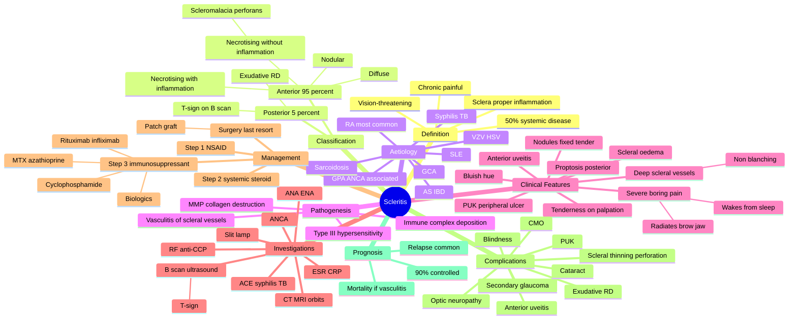

# Scleritis

Related: [[Episcleritis]], [[Rheumatoid Arthritis (Ocular)]], [[Anterior Uveitis (Iritis)]], [[The Red Eye (Approach)]]

> [!danger] **FCPS/MRCP Priority: CRITICAL — VISION-THREATENING EMERGENCY**
> Scleritis is a **chronic, painful, destructive** inflammation of the sclera proper. Strongly associated with systemic autoimmune disease in **~50%** of cases (RA most common; also SLE, GPA, IBD, sarcoid, polychondritis, GCA, infection). Necrotising scleritis can perforate the globe. Always rule out posterior scleritis and systemic vasculitis.

## Learning Objectives

- [ ] Differentiate scleritis from episcleritis on history (severe boring pain, wakes from sleep, radiation to brow/jaw) and slit-lamp (deep scleral injection, scleral oedema, tenderness on palpation, blue-grey hue).
- [ ] Classify scleritis anatomically (anterior 95% / posterior 5%) and morphologically (diffuse, nodular, necrotising with / without inflammation).
- [ ] List the systemic associations of scleritis: RA, SLE, GPA, polyarteritis nodosa, IBD, sarcoidosis, syphilis, TB, Lyme, VZV, relapsing polychondritis.
- [ ] Recognise scleromalacia perforans (RA, painless necrotising scleritis with progressive scleral thinning) — the "quiet killer".
- [ ] Identify the ocular complications: peripheral ulcerative keratitis (PUK), anterior uveitis, secondary glaucoma, cataract, scleral thinning/perforation, posterior scleritis.
- [ ] Initiate systemic NSAID / steroid / immunosuppressive therapy and refer urgently to rheumatology for systemic workup.
- [ ] Recognise posterior scleritis (pain, decreased vision, choroidal folds, exudative RD, proptosis) and the role of B-scan ultrasound (T-sign) and CT.

---

## 1. Definition

Inflammation of the **sclera proper** (the dense avascular collagen coat of the eye). It is a **chronic, painful, potentially blinding** condition that almost always indicates an underlying systemic disease — particularly autoimmune connective tissue disease.

**Scleritis vs Episcleritis** (the common exam discriminator):

| Feature | Scleritis | Episcleritis |
|---|---|---|
| Pain | Severe, boring, radiating, wakes from sleep | Mild irritation, not waking |
| Onset | Gradual, progressive | Acute, recurrent |
| Tenderness on palpation | Yes (through eyelid) | No |
| Scleral oedema / thinning | Yes | No |
| Bluish hue (sclera visible through conjunctiva) | Yes (deep) | No |
| Scleromalacia / perforation risk | Yes (necrotising) | No |
| Vision loss | Common (complications) | Never |
| Systemic association | ~50% (often severe) | <36% (usually mild) |
| Photophobia / tearing | Common | Less common |
| Recurrence | Yes (chronic) | Yes (recurrent, self-limiting) |
| Treatment | Systemic (NSAID → steroid → IS) | Usually topical / observation |

## 2. Aetiology & Pathophysiology

### Classification (Watson, 1976 — most cited)

**A. Anterior scleritis (95%)**
1. **Diffuse anterior** (most common) — widespread scleral oedema
2. **Nodular anterior** — immovable, tender nodule(s)
3. **Necrotising anterior**
   - **With inflammation** (fiery red, painful — surgical emergency)
   - **Without inflammation** = **scleromalacia perforans** (RA, painless thinning — "quiet killer")

**B. Posterior scleritis (5%)**
- Involves sclera behind the equator
- Often missed; presents with pain, decreased vision, choroidal folds, exudative RD, proptosis, restricted EOM

### Systemic Associations (50%)

| Category | Conditions |
|---|---|
| **Connective tissue disease** | Rheumatoid arthritis (most common; especially in necrotising + scleromalacia), SLE, relapsing polychondritis, mixed connective tissue disease, ankylosing spondylitis |
| **Vasculitis (ANCA+)** | Granulomatosis with polyangiitis (GPA / Wegener's), polyarteritis nodosa, Behçet's |
| **Granulomatous** | Sarcoidosis, TB, syphilis, leprosy |
| **Inflammatory bowel** | Crohn's, ulcerative colitis |
| **Infection** | Herpes zoster, herpes simplex, Lyme, post-surgical |
| **Other** | GCA, polychondritis, atopy (rare) |

### Pathogenesis

- **Immune-complex deposition** in scleral vasculature → complement activation → neutrophil & macrophage recruitment → scleral collagen destruction
- In RA: rheumatoid factor and anti-CCP immune complexes; **type III hypersensitivity**
- In granulomatosis with polyangiitis: small-vessel necrotising vasculitis extends to scleral vessels
- Matrix metalloproteinases (MMP-1, MMP-3, MMP-9) degrade scleral collagen → thinning → perforation in necrotising forms

## 3. Clinical Features

### Symptoms
- **Severe, deep, boring pain** — radiates to brow, temple, jaw, or sinuses; **wakes patient from sleep** (classic)
- Photophobia, lacrimation
- **Decreased vision** (complications)
- Redness — bluish-violet hue, "washerwoman's skin" in necrotising
- Systemic features of underlying disease (joint pains, rash, sinus symptoms, oral/genital ulcers)

### Signs

**Anterior scleritis:**
- **Deep scleral vessels engorged** (radial, non-blanching with 10% phenylephrine — unlike episcleritis where superficial vessels blanch)
- **Scleral oedema** with loss of normal anatomic landmarks
- **Scleral tenderness** on palpation through closed lid
- **Bluish hue** as oedematous sclera becomes translucent revealing underlying choroid
- Nodules (fixed, tender, immovable — unlike episcleritis nodules which are mobile)
- Scleral thinning / "blue patches" / areas of avascularity (necrotising)
- **Peripheral ulcerative keratitis (PUK)** — adjacent cornea involved
- **Anterior uveitis** (50%)
- Elevated IOP (trabecular involvement)

**Posterior scleritis:**
- Proptosis, restricted EOM
- Choroidal folds
- Exudative retinal detachment
- Disc oedema
- Shallow anterior chamber (ciliary body oedema)
- **B-scan: thickened sclera + oedema in Tenon's space = "T-sign"** (pathognomonic)
- CT / MRI: thickened posterior sclera

## 4. Investigations

| Investigation | Purpose |
|---|---|
| **Full ocular exam** including slit-lamp, IOP, fundus | Classify, assess complications |
| **B-scan ocular ultrasound** | Posterior scleritis — T-sign, scleral thickening |
| **CT / MRI orbits** | Posterior scleritis, exclude orbital mass / infection |
| **ESR / CRP** | Inflammation, monitor therapy |
| **CBC, U&E, LFT, glucose** | Baseline before systemic therapy |
| **ANA, ENA, anti-dsDNA** | SLE / MCTD |
| **Rheumatoid factor, anti-CCP** | RA |
| **ANCA (c-ANCA, p-ANCA)** | GPA, MPA |
| **ACE, lysozyme** | Sarcoidosis |
| **VDRL / TPHA, Quantiferon-TB** | Syphilis, TB |
| **HLA-B27** | AS, IBD |
| **Uric acid** | Gout (rare cause) |
| **Chest X-ray** | TB, sarcoid, GPA |
| **Urinalysis** | Vasculitis with renal involvement |

## 5. Management

### Stepwise Approach

**Step 1 — Diffuse / nodular anterior scleritis (non-necrotising, no vision threat):**
- **Systemic NSAID** — ibuprofen 400-800 mg TDS or naproxen 500 mg BD (4-week trial)
- Topical steroid (prednisolone acetate 1%) for anterior chamber inflammation
- Cycloplegic (atropine 1% or cyclopentolate 1%) for uveitis

**Step 2 — No response to NSAID OR necrotising / vision-threatening:**
- **Systemic corticosteroid** — prednisolone 0.5-1 mg/kg/day PO, taper over 4-6 weeks
- **Periocular / sub-Tenon's triamcinolone** for unilateral disease
- If steroid-sparing needed: **methotrexate** (RA, sarcoid), **azathioprine**, **mycophenolate mofetil**

**Step 3 — Necrotising / associated with PUK / vision-threatening / refractory:**
- **IV methylprednisolone 500-1000 mg daily × 3 days** → oral prednisolone
- **Cyclophosphamide** (severe, especially GPA-associated)
- **Biologics:** infliximab, adalimumab, rituximab, tocilizumab
- **Cyclosporin, tacrolimus** as steroid-sparing agents

**Step 4 — Infectious scleritis (rare but important to exclude):**
- Topical + systemic antimicrobials (anti-viral for HZO, anti-TB, anti-syphilis)
- Avoid steroids until infection controlled

**Step 5 — Surgery (last resort):**
- Scleral patch graft for perforation
- Tectonic keratoplasty for severe PUK
- Glaucoma surgery if needed for secondary IOP rise

### Monitoring
- ESR/CRP every 2-4 weeks
- IOP, AC activity, fundus each visit
- Coordinate with rheumatology for systemic disease activity

## 6. Complications

| Complication | Mechanism |
|---|---|
| **Scleral thinning / perforation** | Necrotising disease |
| **Peripheral ulcerative keratitis (PUK)** | Adjacent cornea immune complex deposition |
| **Anterior uveitis** | 50%, contiguous spread |
| **Secondary glaucoma** | Trabecular meshwork involvement / steroid |
| **Cataract** | Steroid, inflammation |
| **Cystoid macular oedema** | Posterior segment spillover |
| **Exudative retinal detachment** | Posterior scleritis |
| **Optic neuropathy** | Posterior scleritis, GCA overlap |
| **Permanent vision loss** | PUK, macular involvement, optic nerve |

## 7. Prognosis

- Most patients respond to systemic therapy; **>90% achieve disease control** with appropriate immunosuppression
- Relapse common if immunosuppression tapered too quickly
- **Mortality increased** if associated with systemic vasculitis (especially untreated GPA)
- Untreated necrotising scleritis → scleral perforation → endophthalmitis → blindness

## 8. FCPS/MRCP High-Yield Summary

| Topic | Key Point |
|---|---|
| Scleritis = sclera proper; episcleritis = superficial | Deep pain, wakes from sleep = scleritis |
| 50% associated with systemic disease | RA most common, then GPA, SLE, AS |
| Necrotising = most severe | Perforation risk, surgical emergency |
| Scleromalacia perforans = RA, painless | Quiet killer, avascular scleral thinning |
| Posterior scleritis = T-sign on B-scan | Choroidal folds, exudative RD, proptosis |
| PUK = crescent-shaped peripheral corneal ulcer | Strongly suggests systemic vasculitis |
| First-line non-necrotising = systemic NSAID | Steroid if no response |
| Necrotising = systemic steroid + immunosuppressant | MTX, cyclophosphamide, biologics |
| Always rule out infection before steroid | VZV, syphilis, TB, Lyme |
| Refer to rheumatology for systemic workup | ANCA, ANA, RF, anti-CCP |

## 9. Viva Questions

| Question | Expected Answer |
|---|---|
| Differentiate scleritis from episcleritis. | Scleritis: severe boring pain, wakes from sleep, scleral oedema/thinning, vision-threatening, deep vessels don't blanch with phenylephrine. Episcleritis: mild irritation, self-limiting, superficial vessels blanch, no vision loss. |
| What is scleromalacia perforans? | Necrotising scleritis WITHOUT inflammation, seen in long-standing RA, painless progressive scleral thinning → perforation. |
| What is the T-sign? | B-scan finding in posterior scleritis: thickened sclera (T-vertical) + fluid in Tenon's space (T-horizontal) forming a T. |
| Most common systemic association of scleritis? | Rheumatoid arthritis (especially necrotising + scleromalacia). |
| PUK is most associated with which systemic disease? | Rheumatoid arthritis, then GPA, polyarteritis nodosa. |
| First-line systemic therapy for non-necrotising scleritis? | NSAID (ibuprofen or naproxen) for 4 weeks; if no response → systemic corticosteroid. |
| When do you use cyclophosphamide in scleritis? | Necrotising scleritis, GPA-associated, refractory disease, vision-threatening. |
| Why rule out infection before starting systemic steroid in scleritis? | Herpes zoster ophthalmicus, syphilis, TB, Lyme can mimic scleritis; steroids worsen infection. |

## 10. Common Confusions / Exam Traps

| Confusion | Clarification |
|---|---|
| "Scleritis = anterior segment redness" | Not all red eyes are scleritis — most are conjunctivitis, episcleritis, keratitis. Scleritis is much less common. |
| "Scleritis is usually primary eye disease" | Wrong — 50% have systemic disease; always workup. |
| "Episcleritis and scleritis treated the same" | No — episcleritis often needs only topical / observation; scleritis requires systemic therapy. |
| "Topical steroid is enough for scleritis" | Almost never — scleritis is deep, requires systemic therapy. Topical only for anterior chamber component. |
| "Scleritis always visible anteriorly" | Posterior scleritis is occult — need B-scan / imaging for diagnosis. |
| "Scleromalacia perforans is the painful necrotising form" | Wrong — scleromalacia perforans is **painless**; the painful necrotising form is "necrotising scleritis with inflammation". |
| "PUK is the same as Mooren's ulcer" | No — Mooren's is idiopathic unilateral peripheral ulcer; PUK is associated with systemic vasculitis, bilateral, crescentic. |

## 11. Mnemonics

1. **"Scleritis = Serious, Systemic, Steroid"** — vision-threatening, 50% systemic disease, requires systemic therapy.
2. **"Scleritis wakes you, Episcleritis doesn't"** — pain wakes from sleep = scleritis.
3. **"Scleritis = Slow KILLer"** — gradual onset, progressive damage, serious outcome.
4. **"Necrotising = Nasty"** — perforation risk, requires IV cyclophosphamide + biologic.
5. **"T-sign = Tenon"** — B-scan: thickened sclera + fluid in Tenon's space = T.

## 12. Mind Map

## 13. One-Page Revision Card

| Domain | Key Points |
|---|---|
| Definition | Inflammation of sclera proper; chronic, painful, vision-threatening |
| Epidemiology | ~50% systemic disease; RA most common |
| Classification | Anterior (95%): diffuse, nodular, necrotising ± inflammation; Posterior (5%) |
| Pain | Severe boring; radiates to brow/jaw; wakes from sleep |
| Scleromalacia perforans | Necrotising WITHOUT inflammation; RA; painless; "quiet killer" |
| PUK | Crescentic peripheral corneal ulcer; RA, GPA, PAN |
| T-sign | B-scan: thickened sclera + Tenon fluid; posterior scleritis |
| Workup | ESR/CRP, ANA, RF, anti-CCP, ANCA, ACE, syphilis serology, CXR |
| First-line (non-necrotising) | Systemic NSAID → systemic steroid if no response |
| Necrotising / vision-threatening | IV methylprednisolone + cyclophosphamide or biologic |
| Refer | Urgently to rheumatology for systemic workup |

## 14. Spaced Repetition Trackers

| Review Interval | Date | Score (0-5) | Notes |
|---|---|---|---|
| Day 1 | | | |
| Day 3 | | | |
| Day 7 | | | |
| Day 14 | | | |
| Day 30 | | | |
| Day 90 | | | |

## 15. Self-Test Scorecard

| Section | Score /5 | Last Attempt |
|---|---|---|
| Definition / Classification | | |
| Aetiology / Systemic Associations | | |
| Clinical Features (anterior vs posterior) | | |
| Investigations (incl. T-sign) | | |
| Management (stepwise) | | |
| Complications (PUK, perforation) | | |
| Mnemonics | | |
| MCQ Performance | | |
| SBA Performance | | |
| Viva Confidence | | |
| **Total** | **/50** | |

> **Interpretation:** <35 = weak, 35-44 = acceptable, 45+ = strong.

## 16. Exam Answer Modes

### Long Answer Skeleton
1. Definition + classification (anterior diffuse/nodular/necrotising; posterior)
2. Aetiology + systemic associations (50%; RA most common; list 4-5)
3. Pathogenesis (immune complex, MMP)
4. Clinical features (anterior vs posterior; pain, scleral vessels, oedema, PUK, scleromalacia)
5. Investigations (B-scan T-sign, ANCA, RF, anti-CCP, ANA, ESR, ACE, syphilis, CXR)
6. Management (NSAID → systemic steroid → immunosuppressant; biologics)
7. Complications (perforation, PUK, uveitis, glaucoma, RD)
8. Prognosis + referral

### Short Note Skeleton
- Definition, classification, pain pattern, common systemic associations, stepwise management, key complications.

### Viva One-Liners
- "Differentiate scleritis from episcleritis."
- "What is the T-sign?"
- "What is scleromalacia perforans?"
- "First-line systemic therapy for diffuse anterior scleritis?"
- "Most common systemic disease with necrotising scleritis?"

### Ward-Case Discussion Points
- Examine both eyes with slit-lamp
- Phenylephrine 10% test (deep vs superficial vessels)
- Always ask about RA, joint pain, sinus symptoms, oral/genital ulcers, rash, red eye
- Send ESR/CRP, ANCA, RF/CCP, ANA, ACE, syphilis serology
- Coordinate with rheumatology urgently
- B-scan if posterior scleritis suspected
- Start NSAID; have low threshold for systemic steroid

### Last-Night-Before-Exam Sheet
- **Top 5 facts:** Scleritis = serious, systemic, steroid; wakes from sleep; 50% systemic disease (RA most common); PUK = crescentic; T-sign = posterior
- **3 drug doses:** Ibuprofen 400-800 mg TDS PO; Prednisolone 0.5-1 mg/kg/day; IV Methylprednisolone 500-1000 mg × 3 days
- **2 algorithms:** Stepwise (NSAID → steroid → IS); Posterior scleritis workup (B-scan + systemic)
- **1 mnemonic:** "Scleritis = Serious, Systemic, Steroid" + "Scleritis wakes, Episcleritis doesn't"

## 17. Summary

Scleritis is a chronic, painful, vision-threatening inflammation of the sclera proper. Strongly associated with systemic autoimmune disease in 50% (RA most common, especially for necrotising and scleromalacia perforans). Anterior scleritis is most common; posterior scleritis presents with pain, decreased vision, choroidal folds, and the pathognomonic **T-sign on B-scan**. **Scleromalacia perforans** is the painless necrotising variant seen in long-standing RA — a "quiet killer". Peripheral ulcerative keratitis (PUK) signals systemic vasculitis. Management is **systemic, stepwise**: NSAID → systemic steroid → immunosuppressant (methotrexate, cyclophosphamide) → biologics (rituximab, anti-TNF). Urgent rheumatology referral is mandatory for systemic workup. Always rule out infection (VZV, syphilis, TB) before starting systemic steroids.

## 18. MCQs (10)

**1. Which feature most strongly distinguishes scleritis from episcleritis?**
A. Conjunctival injection
B. Pain that wakes the patient from sleep
C. Photophobia
D. Lacrimation
**Answer: B**

**2. Scleromalacia perforans is most characteristically associated with which systemic disease?**
A. Systemic lupus erythematosus
B. Rheumatoid arthritis
C. Sarcoidosis
D. Behçet's disease
**Answer: B**

**3. The T-sign on B-scan ultrasound is pathognomonic of:**
A. Anterior uveitis
B. Posterior scleritis
C. Optic neuritis
D. Central retinal vein occlusion
**Answer: B**

**4. Which of the following is the FIRST-LINE systemic treatment for diffuse anterior scleritis without necrosis?**
A. Topical steroid alone
B. Oral NSAID
C. IV cyclophosphamide
D. Intravitreal steroid
**Answer: B**

**5. Peripheral ulcerative keratitis (PUK) most strongly suggests underlying:**
A. Diabetes mellitus
B. Hypertension
C. Systemic vasculitis
D. Hyperlipidaemia
**Answer: C**

**6. Posterior scleritis accounts for what percentage of all scleritis cases?**
A. <5%
B. 15%
C. 30%
D. 50%
**Answer: A**

**7. Which investigation is most useful to confirm posterior scleritis?**
A. Fluorescein angiography
B. OCT macula
C. B-scan ultrasound
D. Visual field testing
**Answer: C**

**8. In scleritis associated with ANCA-positive granulomatosis with polyangiitis, the most appropriate initial immunosuppressant is:**
A. Hydroxychloroquine
B. Cyclophosphamide
C. Sulfasalazine
D. Allopurinol
**Answer: B**

**9. Necrotising anterior scleritis with inflammation is best treated with:**
A. Topical steroid and observation
B. Oral NSAID only
C. Systemic corticosteroid plus cyclophosphamide
D. Antivirals alone
**Answer: C**

**10. The most common systemic disease associated with scleritis overall is:**
A. Rheumatoid arthritis
B. Sarcoidosis
C. Behçet's disease
D. Granulomatosis with polyangiitis
**Answer: A**

## 19. SBA Questions (10)

**1. A 48-year-old woman with long-standing rheumatoid arthritis presents with bilateral progressive painless thinning of the sclera with visible underlying blue choroid. The most likely diagnosis is:**
A. Anterior uveitis
B. Episcleritis
C. Scleromalacia perforans
D. Conjunctivitis
**Answer: C — RA + painless scleral thinning = scleromalacia perforans**

**2. A 55-year-old man presents with severe boring pain in the right eye, waking him from sleep, and scleral injection that does not blanch with 10% phenylephrine. The most likely diagnosis is:**
A. Bacterial conjunctivitis
B. Acute angle-closure glaucoma
C. Scleritis
D. Episcleritis
**Answer: C — Scleritis: deep boring pain, non-blanching deep vessels**

**3. A patient with granulomatosis with polyangiitis develops crescent-shaped peripheral corneal ulceration with adjacent scleral inflammation. The corneal lesion is:**
A. Mooren's ulcer
B. Peripheral ulcerative keratitis (PUK)
C. Marginal keratitis
D. Herpetic geographic ulcer
**Answer: B — PUK is associated with systemic vasculitis, especially GPA and RA**

**4. A 40-year-old woman with bilateral painful red eyes, severe boring pain radiating to the brow, scleromalacia, and joint deformities from RA is started on ibuprofen. After 3 weeks, pain persists. The next best step is:**
A. Continue ibuprofen for 3 more weeks
B. Add topical steroid only
C. Start systemic prednisolone
D. Refer for vitrectomy
**Answer: C — NSAID failure → systemic corticosteroid is the standard next step**

**5. Posterior scleritis is best confirmed by which investigation?**
A. Fundus fluorescein angiography
B. B-scan ultrasound showing T-sign
C. Optical coherence tomography of the optic disc
D. Visual evoked potential
**Answer: B — T-sign (thickened sclera + Tenon fluid) is pathognomonic**

**6. A 60-year-old man with scleritis has positive c-ANCA. The most appropriate disease-modifying therapy is:**
A. Methotrexate
B. Cyclophosphamide
C. Hydroxychloroquine
D. Azathioprine
**Answer: B — c-ANCA (GPA) with severe scleritis requires cyclophosphamide**

**7. Which ocular sign in scleritis suggests impending scleral perforation?**
A. Photophobia
B. Localised area of scleral avascularity (necrotising scleritis)
C. Mild conjunctival injection
D. Lacrimation
**Answer: B — Avascular scleral patch = necrosis → perforation risk**

**8. A 35-year-old presents with unilateral painful red eye, scleral nodule that is fixed and tender, deep scleral vessels non-blanching. The most likely diagnosis is:**
A. Pinguecula
B. Episcleritis with nodule
C. Nodular anterior scleritis
D. Conjunctival nevus
**Answer: C — Fixed tender nodule + non-blanching deep vessels = nodular scleritis**

**9. Scleritis in herpes zoster ophthalmicus is treated with:**
A. Systemic steroid alone
B. Systemic antiviral + topical steroid
C. Topical steroid alone
D. NSAIDs only
**Answer: B — Infection must be controlled with antiviral; topical steroid for inflammation**

**10. The most common ocular complication of anterior scleritis is:**
A. Cataract
B. Secondary glaucoma
C. Anterior uveitis
D. Retinal detachment
**Answer: C — Anterior uveitis occurs in ~50% of anterior scleritis cases**

## 20. Flashcards

- **Q:** What is the most common systemic disease associated with scleritis?
  **A:** Rheumatoid arthritis (especially for necrotising and scleromalacia perforans)
- **Q:** Differentiate scleritis from episcleritis in 1 sentence.
  **A:** Scleritis = deep, severe, boring pain that wakes from sleep + vision-threatening; episcleritis = mild, self-limiting, no vision loss
- **Q:** What is scleromalacia perforans?
  **A:** Necrotising scleritis WITHOUT inflammation, seen in long-standing RA, painless progressive scleral thinning
- **Q:** What is the T-sign?
  **A:** B-scan finding in posterior scleritis: thickened posterior sclera + fluid in Tenon's space forming a T
- **Q:** First-line systemic treatment for diffuse anterior scleritis?
  **A:** Oral NSAID (ibuprofen 400-800 mg TDS) for 4 weeks; if no response → systemic corticosteroid
- **Q:** When do you use cyclophosphamide?
  **A:** Necrotising scleritis, GPA-associated, vision-threatening, refractory disease
- **Q:** What does PUK suggest?
  **A:** Systemic vasculitis (RA, GPA, PAN, SLE)
- **Q:** Posterior scleritis accounts for what % of scleritis?
  **A:** ~5%
- **Q:** Why rule out infection before starting systemic steroid?
  **A:** Herpes zoster, syphilis, TB, Lyme can mimic scleritis; steroids worsen infection
- **Q:** Most common ocular complication of anterior scleritis?
  **A:** Anterior uveitis (~50%)

## 21. Answer Key with Explanations

### MCQs
1. **B** — Scleritis pain is severe, deep, and characteristically wakes the patient from sleep. Episcleritis causes mild irritation that does not interrupt sleep. Other features: scleritis has deep vessels that do NOT blanch with 10% phenylephrine, while episcleritis superficial vessels DO blanch.
2. **B** — Scleromalacia perforans is a form of necrotising scleritis WITHOUT inflammation, characteristically seen in long-standing rheumatoid arthritis. It is painless and leads to progressive scleral thinning → perforation.
3. **B** — The T-sign is pathognomonic of posterior scleritis on B-scan: thickened posterior sclera (vertical limb of T) + oedema in Tenon's space (horizontal limb).
4. **B** — Oral NSAID (ibuprofen 400-800 mg TDS or naproxen 500 mg BD) is the first-line systemic treatment for non-necrotising diffuse anterior scleritis. Topical steroid alone is insufficient because scleritis is a deep inflammation.
5. **C** — PUK is a crescentic peripheral corneal ulcer strongly associated with systemic vasculitis — especially rheumatoid arthritis, granulomatosis with polyangiitis, polyarteritis nodosa, and SLE.
6. **A** — Posterior scleritis accounts for ~5% of all scleritis cases. Anterior scleritis accounts for ~95%.
7. **C** — B-scan ultrasound showing the T-sign (thickened sclera + Tenon fluid) is the diagnostic test of choice for posterior scleritis.
8. **B** — Cyclophosphamide is the first-line immunosuppressant for ANCA-positive vasculitis (GPA) with severe scleritis or vision-threatening necrotising disease.
9. **C** — Necrotising anterior scleritis with inflammation requires aggressive systemic immunosuppression: high-dose IV/oral corticosteroid + cyclophosphamide (or rituximab for GPA).
10. **A** — Rheumatoid arthritis is the most common systemic disease associated with scleritis overall, particularly necrotising forms and scleromalacia perforans.

### SBAs
1. **C** — RA + bilateral painless progressive scleral thinning with visible underlying choroid = scleromalacia perforans.
2. **C** — Severe boring pain + non-blanching deep vessels on phenylephrine test = scleritis.
3. **B** — PUK is the crescentic peripheral corneal ulcer of systemic vasculitis.
4. **C** — NSAID failure at 3-4 weeks → escalate to systemic prednisolone.
5. **B** — T-sign on B-scan = posterior scleritis.
6. **B** — c-ANCA positive (GPA) + severe scleritis = cyclophosphamide.
7. **B** — Avascular scleral patch = necrosis = imminent perforation.
8. **C** — Fixed, tender scleral nodule + non-blanching deep vessels = nodular anterior scleritis.
9. **B** — Herpes zoster scleritis requires antiviral + topical steroid; systemic steroids withheld until antiviral coverage.
10. **C** — Anterior uveitis is the most common ocular complication of anterior scleritis (~50%).

## 22. Local Navigation

- **Parent Hub:** [[Uveitis Hub|Uveal Tract & Sclera Hub]]
- **Related (Sclera):** [[Episcleritis]]
- **Related (Uveitis):** [[Anterior Uveitis (Iritis)]] · [[Posterior Uveitis (Choroiditis)]]
- **Related (Systemic):** [[Rheumatoid Arthritis (Ocular)]] · [[HIV AIDS (Ocular)]] · [[Sarcoidosis (Ocular)]] · [[Ankylosing Spondylitis (Ocular)]] · [[Syphilis (Ocular)]]
- **Related (Approach):** [[The Red Eye (Approach)]] · [[Acute Visual Loss (Approach)]]
- **Chapter MOC:** [[Medical Ophthalmology MOC]]
- **Chapter Hierarchy:** [[Davidson Chapter 27 - Medical Ophthalmology Hierarchy]]
- **Cross-chapter:** [[../Rheumatology/Vasculitis/Giant cell arteritis (temporal arteritis)]] · [[../Rheumatology/Autoimmune Rheumatic Diseases]]

## 23. Tags

#medicine #davidson #ophthalmology #scleritis #scleromalacia #PUK #RA #vasculitis #GPA #fcps #mrcp
