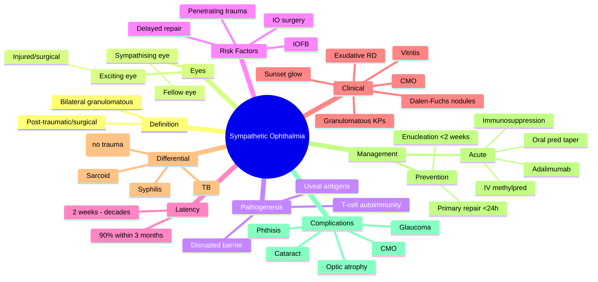

# Sympathetic Ophthalmia

Related: [[Penetrating Ocular Trauma]], [[VKH Syndrome]]

> [!tip] **FCPS/MRCP Priority: MEDIUM**
> Bilateral granulomatous panuveitis after penetrating ocular injury or surgery. Onset 2 weeks to decades later. Treat with high-dose steroid + immunosuppression. Often requires enucleation of injured blind eye.

---

## Learning Objectives
- [ ] Define sympathetic ophthalmia and explain the autoimmune basis
- [ ] List risk factors (trauma, surgery)
- [ ] Recognise clinical features (Dalen-Fuchs nodules, sunset glow)
- [ ] Differentiate from VKH
- [ ] Describe acute management and prevention strategies

---

## 1. Definition / Epidemiology / Classification

### Definition
- **Sympathetic ophthalmia (SO):** Bilateral granulomatous panuveitis that develops after penetrating trauma or surgery to one eye
- **"Exciting eye"** = the originally injured/surgically insulted eye
- **"Sympathising eye"** = the previously healthy fellow eye that develops inflammation

### Epidemiology
- Rare: ~0.1–0.3% of penetrating injuries
- Incidence decreasing with modern microsurgical repair
- Bilateral in 100% by definition (though may be asymmetric)

### Classification
- **Post-traumatic** (most common)
- **Post-surgical** (vitrectomy, retinal detachment repair, cyclodestructive procedures)
- **No clear precipitant** in rare cases

---

## 2. Aetiology / Pathophysiology

### Pathogenesis
- T-cell mediated autoimmune reaction to previously sequestered ocular antigens (uveal/retinal/RPE/melanocyte)
- Disruption of the blood-ocular barrier exposes normally hidden antigens to the immune system
- CD4+ Th1-driven delayed-type hypersensitivity
- Molecular mimicry with viral antigens (CMV) proposed
- Histology: **Dalen-Fuchs nodules** (granulomas between RPE and Bruch's membrane); diffuse granulomatous uveitis with lymphocytes, epithelioid cells, giant cells

### Latency
- **2 weeks to decades** after inciting event
- **90% within 3 months to 1 year**; can occur up to 66 years later

---

## 3. Clinical Features

### History
- Prior penetrating injury or intraocular surgery (typically 2 weeks to 1 year prior)
- Bilateral redness, pain, photophobia, ↓VA
- ± History of retained IOFB, delayed primary repair

### Examination — Both Eyes
- **Anterior segment:** Granulomatous uveitis (cells, flare, **mutton-fat KPs**), iris nodules (Koeppe, Busacca)
- **Intermediate:** Vitritis
- **Posterior:**
  - **Dalen-Fuchs nodules** (yellow-white subretinal deposits in mid-periphery)
  - Disc oedema, optic atrophy (late)
  - Vasculitis, choroiditis
  - **Sunset glow fundus** (chronic, orange-red depigmented choroid — like VKH)
  - Exudative retinal detachment
  - CMO

### Stages
- **Acute:** Painful red eye, photophobia, ↓VA, AC reaction
- **Chronic:** Sunset glow, numular scars, depigmentation, cataract, glaucoma

---

## 4. Risk Factors

| Category | Examples |
|----------|----------|
| **Trauma** | Penetrating injury (most common), ruptured globe, IOFB |
| **Surgery** | Vitrectomy, retinal detachment repair, cyclodestruction (cyclocryotherapy/cycloablation), glaucoma filtering surgery, keratoplasty |
| **Wound factors** | Uveal prolapse, delayed primary repair, large wound |
| **Demographic** | Adults (children rarely develop SO) |

---

## 5. Investigations

- **Clinical diagnosis** — bilateral panuveitis + history of penetrating trauma/surgery
- **FFA** — multiple pinpoint leakage, pooling in subretinal fluid, Dalen-Fuchs staining
- **OCT** — macular oedema, subretinal fluid
- **ICG** — hypofluorescent spots (granulomas)
- **B-scan US** — choroidal thickening, exudative RD
- **± AC tap / vitreal tap** to exclude infection
- **HLA-DR4, HLA-DRw53** association (in some populations)

---

## 6. Differential Diagnosis

| Condition | Distinguishing Feature |
|-----------|------------------------|
| **VKH syndrome** | NO history of trauma; meningismus, vitiligo, dysacusis |
| **Sarcoidosis** | Hilar adenopathy, ACE↑, non-caseating granulomas |
| **TB uveitis** | Positive IGRA/Mantoux, choroiditis |
| **Syphilis** | Positive serology, treatable |
| **Phacoanaphylactic uveitis** | Lens-induced, after cataract surgery with retained cortex |

### Key Differentiator from VKH
- VKH = NO trauma history; SO = ALWAYS history of trauma/surgery
- Both share sunset glow, Dalen-Fuchs, exudative RD
- SO has fewer dermatologic/audiologic features

---

## 7. Management

### Acute
- **High-dose systemic corticosteroid:**
  - IV methylprednisolone 1 g × 3 days → oral prednisolone 1 mg/kg, slow taper (6–12 months)
- **Immunosuppression (steroid-sparing):**
  - Cyclosporine, methotrexate, mycophenolate mofetil, azathioprine
- **Biologics (refractory):**
  - Adalimumab, infliximab
- **Intravitreal steroid:** Dexamethasone implant for CMO
- **Cycloplegia** to prevent synechiae

### Prevention
- **Primary repair of penetrating wounds within 24 hours** (most important)
- **Enucleation of severely injured blind eye** within 2 weeks of injury (controversial — only if NO visual potential)
- **Evisceration** is also preventive
- **If visual potential exists → save the eye** (enucleation should not be done prophylactically if vision can be salvaged)

### Long-Term
- Maintenance immunosuppression for ≥ 1 year, often 2–3 years
- Regular monitoring of IOP, lens, fundus
- Visual rehabilitation

---

## 8. Complications

- **Cataract** (steroid, chronic inflammation)
- **Glaucoma** (steroid response, angle closure)
- **CMO** (chronic vision loss)
- **Optic atrophy**
- **Subretinal fibrosis, CNV**
- **Phthisis bulbi** (end-stage)
- **Permanent visual loss in both eyes** (uncontrolled)

---

## 9. FCPS/MRCP High-Yield Summary

| Category | Key Points |
|----------|------------|
| Trigger | Penetrating trauma, IO surgery |
| Type | Bilateral granulomatous panuveitis |
| Latency | 2 weeks to decades; 90% within 3 months |
| Dalen-Fuchs | Subretinal nodules (pathognomonic finding on FFA/biopsy) |
| Sunset glow | Chronic, like VKH |
| Differentiate from VKH | Trauma history in SO, absent in VKH |
| Treatment | High-dose steroid + immunosuppression |
| Prevention | Primary repair; enucleation of blind eye within 2 weeks |

---

## 10. Viva Questions

1. **Q:** What is sympathetic ophthalmia?
   **A:** Bilateral granulomatous panuveitis after penetrating injury or surgery to one eye (exciting eye affects the fellow sympathising eye).

2. **Q:** How is sympathetic ophthalmia prevented?
   **A:** Prompt primary wound repair within 24 h; enucleation of blind, painful, injured eye within 2 weeks (controversial — usually only if no visual potential).

3. **Q:** What is the latency of SO?
   **A:** 2 weeks to decades; most within 3 months to 1 year.

4. **Q:** Differentiate SO from VKH.
   **A:** SO = history of penetrating trauma/surgery. VKH = NO trauma; systemic features (meningismus, vitiligo, dysacusis).

5. **Q:** What are Dalen-Fuchs nodules?
   **A:** Yellow-white subretinal granulomas between RPE and Bruch's membrane — characteristic of SO (and VKH).

---

## 11. Common Confusions / Exam Traps

| Confusion | Clarification |
|-----------|---------------|
| "SO can occur without trauma" | Rare; if no trauma, consider VKH |
| "Enucleation is mandatory for trauma" | Only if NO visual potential; if useful vision, save the eye |
| "SO is infectious" | No — autoimmune T-cell mediated |
| "Dalen-Fuchs = VKH only" | Also seen in SO, sarcoidosis, TB |
| "Enucleation can be done at any time" | Within 2 weeks of injury to be preventive; later is treatment of last resort |

---

## 12. Mnemonics

1. **"SO = Sympathise after Surgery or trauma to One eye"** — bilateral involvement
2. **"Exciting Eye injures, Sympathising Eye Sighs"** — first eye causes, second eye suffers
3. **"Dalen-Fuchs = Dotted yellow deposits Below RPE"** — subretinal granulomas

---

## 13. Mind Map

---

## 14. One-Page Revision Card

| **Topic** | **Sympathetic Ophthalmia** |
|-----------|---------------------------|
| **Definition** | Bilateral granulomatous panuveitis post-trauma/surgery |
| **Trigger** | Penetrating injury, IO surgery (esp. vitreoretinal) |
| **Latency** | 2 weeks to decades; 90% within 3 months |
| **Pathognomonic** | Dalen-Fuchs nodules (subretinal granulomas) |
| **Chronic sign** | Sunset glow fundus |
| **Differential** | VKH (no trauma) |
| **Treatment** | IV methylpred → oral taper + immunosuppression |
| **Prevention** | Primary repair <24h; enucleation <2 weeks (if blind) |
| **Viva Pearl** | "SO = Sympathise after trauma to One eye" |

---

## Spaced Repetition Trackers

### 24-Hour Recall Prompts
- [ ] Define SO (bilateral, post-trauma/surgery, granulomatous)
- [ ] List 3 risk factors
- [ ] Typical latency and when 90% occur
- [ ] Pathognomonic finding
- [ ] Key management steps
- [ ] Prevention strategy

### Revision Schedule
- [ ] **Day 1** completed (creation + 24h recall)
- [ ] **Day 3** revision completed
- [ ] **Day 7** revision completed
- [ ] **Day 15** revision completed
- [ ] **Day 30** revision completed
- [ ] **Day 90** revision completed

---

## Must Know / Should Know / Nice to Know

### Must Know (Core for passing)
- [x] Definition (bilateral granulomatous panuveitis post-trauma)
- [x] "Exciting eye" vs "sympathising eye"
- [x] Latency (2 weeks to decades; 90% within 3 months)
- [x] Dalen-Fuchs nodules
- [x] Treatment (high-dose steroid + immunosuppression)
- [x] Prevention (primary repair; enucleation of blind eye <2 weeks)

### Should Know (High probability)
- [x] Sunset glow fundus
- [x] Differentiate from VKH (trauma history)
- [x] Biologics (adalimumab, infliximab)
- [x] Complications (cataract, glaucoma, CMO)
- [x] Histology (granulomatous, Dalen-Fuchs)

### Nice to Know (Differentiator)
- [ ] HLA-DR4 / DRw53 association
- [ ] Molecular mimicry with CMV
- [ ] Phacoanaphylactic uveitis (differential)
- [ ] ICG findings (hypofluorescent spots)

---

## My Weak Points
- [ ] Add personal weak areas here

---

## Self-Test Scorecard

| Section | Score /5 |
|---------|----------|
| Understanding: | /10 |
| Recall: | /10 |
| MCQ Performance: | /10 |
| SBA Performance: | /10 |
| Viva Confidence: | /10 |
| Total: | /50 |

> [!tip] **Interpretation:** <35 = weak topic, 35-44 = acceptable but insecure, 45+ = strong exam-ready topic.

---

## Exam Answer Modes

### Long Answer Skeleton
1. Definition — bilateral granulomatous panuveitis after penetrating trauma/surgery
2. Pathogenesis — T-cell autoimmunity to uveal antigens (CD4+ Th1)
3. Risk factors — penetrating trauma, vitrectomy, retinal detachment repair
4. Latency — 2 weeks to decades; 90% within 3 months
5. Clinical features — bilaterally, mutton-fat KPs, vitritis, Dalen-Fuchs nodules, sunset glow, exudative RD
6. Differentiate from VKH (trauma history)
7. Management — IV methylpred → oral taper + immunosuppression ± biologic
8. Prevention — primary repair <24h; enucleation of blind eye <2 weeks
9. Complications and prognosis

### Short Note Skeleton
- Definition + pathogenesis
- Latency
- Dalen-Fuchs nodules
- Treatment
- Prevention (enucleation timing)

### Viva One-Liners
- **Q:** What is SO? → **A:** Bilateral granulomatous panuveitis post-trauma/surgery
- **Q:** What are the eyes called? → **A:** Exciting (injured) and Sympathising (fellow)
- **Q:** When does it occur? → **A:** 2 weeks to decades; 90% within 3 months
- **Q:** Pathognomonic finding? → **A:** Dalen-Fuchs nodules (subretinal granulomas)
- **Q:** Prevention? → **A:** Primary repair <24h; enucleation of blind eye <2 weeks

### Ward-Case Discussion Points
- Always check for history of penetrating injury or surgery in bilateral panuveitis
- Dalen-Fuchs nodules on FFA
- Consider VKH if no trauma history
- Discuss enucleation with patient (timing, visual potential, contralateral risk)
- Step-up therapy: steroid → steroid-sparing → biologic

### Last-Night-Before-Exam Sheet
- Top 3 facts: bilateral + granulomatous + post-trauma
- 1 mnemonic: "Exciting Eye injures, Sympathising Eye Sighs"
- Must-know differential: VKH (no trauma)
- Pathognomonic: Dalen-Fuchs nodules
- Prevention: enucleation within 2 weeks (if blind)

---

## Summary

Sympathetic ophthalmia is bilateral granulomatous panuveitis triggered by penetrating ocular trauma or surgery (exciting eye affecting the sympathising fellow eye). It is a T-cell mediated autoimmune reaction to uveal antigens exposed by disruption of the blood-ocular barrier. Latency ranges from 2 weeks to decades (90% within 3 months). Dalen-Fuchs nodules (subretinal granulomas) and sunset glow fundus are characteristic. Treatment requires high-dose IV/oral corticosteroids with steroid-sparing immunosuppression and biologics (adalimumab) for refractory cases. Prevention includes prompt primary wound repair within 24 hours and enucleation of a blind, painful injured eye within 2 weeks. Differentiation from VKH relies on the history of trauma.

---

## MCQs (10)

1. **Question:** Sympathetic ophthalmia is a:
   **Options:** A. Non-granulomatous unilateral uveitis B. Bilateral granulomatous panuveitis C. Keratitis D. Retinitis E. Conjunctivitis
   **Answer:** B
   **Explanation:** SO is bilateral granulomatous panuveitis by definition.

2. **Question:** What is the typical latency for sympathetic ophthalmia after injury?
   **Options:** A. 24 hours B. 1 week C. 2 weeks to decades (90% within 3 months) D. 10+ years only E. Never
   **Answer:** C
   **Explanation:** 2 weeks to decades; 90% within 3 months to 1 year.

3. **Question:** The "exciting eye" in sympathetic ophthalmia refers to:
   **Options:** A. The healthy fellow eye B. The injured/surgically insulted eye C. The eye with better vision D. Both eyes E. Neither eye
   **Answer:** B
   **Explanation:** The "exciting" or inciting eye is the originally injured or surgically insulted eye.

4. **Question:** Dalen-Fuchs nodules are:
   **Options:** A. Iris nodules at the pupil margin B. Subretinal yellow-white granulomas between RPE and Bruch's membrane C. White anterior chamber aggregates D. Retinal nerve fibre layer hemorrhages E. Conjunctival follicles
   **Answer:** B
   **Explanation:** Dalen-Fuchs nodules are subretinal granulomas between RPE and Bruch's membrane — characteristic of SO and VKH.

5. **Question:** First-line treatment of acute sympathetic ophthalmia is:
   **Options:** A. Topical steroid only B. High-dose IV methylprednisolone followed by oral taper C. NSAIDs only D. Vitrectomy E. Observation
   **Answer:** B
   **Explanation:** IV methylprednisolone 1 g × 3 days → oral prednisolone 1 mg/kg, slow taper.

6. **Question:** Prevention of sympathetic ophthalmia includes:
   **Options:** A. Delayed primary repair of open globe B. Enucleation of a blind injured eye within 2 weeks of injury C. Topical antibiotics only D. Long-term topical steroids E. Photocoagulation
   **Answer:** B
   **Explanation:** Enucleation of a blind, painful injured eye within 2 weeks prevents SO (controversial; only if no visual potential).

7. **Question:** Which of the following is a key differentiating feature between sympathetic ophthalmia and VKH?
   **Options:** A. Laterality B. History of trauma/surgery C. KP type D. Age of onset E. Response to steroids
   **Answer:** B
   **Explanation:** SO has a history of trauma/surgery; VKH does not.

8. **Question:** The pathogenesis of sympathetic ophthalmia involves:
   **Options:** A. Bacterial infection B. T-cell mediated autoimmunity to uveal antigens C. Fungal infection D. Allergic reaction E. Parasitic infection
   **Answer:** B
   **Explanation:** T-cell mediated delayed-type hypersensitivity to previously sequestered uveal antigens.

9. **Question:** A characteristic chronic fundus finding in sympathetic ophthalmia is:
   **Options:** A. Cherry-red spot B. Bone-spicule pigmentation C. Sunset glow fundus D. Copper wire arterioles E. Roth spots
   **Answer:** C
   **Explanation:** Sunset glow (orange-red choroid from depigmentation) is seen in chronic SO (and VKH).

10. **Question:** Which intraocular surgery is NOT commonly associated with sympathetic ophthalmia?
    **Options:** A. Pars plana vitrectomy B. Retinal detachment repair C. Cyclodestruction D. Routine phacoemulsification E. Penetrating keratoplasty
    **Answer:** D
    **Explanation:** Routine phaco (small incision, no uveal manipulation) rarely causes SO. Vitrectomy, RD repair, cyclodestruction more commonly associated.

---

## SBA Questions (10)

1. **Scenario:** A 35-year-old man had penetrating injury to his right eye 4 months ago. He now presents with bilateral red eyes, photophobia, and ↓VA. Slit-lamp shows mutton-fat KPs and vitritis in both eyes.
   **Question:** Most likely diagnosis?
   **Options:** A. Bacterial endophthalmitis B. Sympathetic ophthalmia C. VKH D. Sarcoidosis E. TB
   **Answer:** B
   **Explanation:** Penetrating injury + bilateral granulomatous panuveitis = sympathetic ophthalmia.

2. **Scenario:** A 30-year-old had penetrating eye injury 6 weeks ago. The injured eye is blind. The patient is concerned about the fellow eye. There is no sign of inflammation yet.
   **Question:** What is the recommended prevention?
   **Options:** A. Watch and wait B. Enucleation of the blind injured eye within 2 weeks (now still acceptable) C. Topical steroids in the fellow eye D. Systemic cyclosporine in the fellow eye E. Photocoagulation
   **Answer:** B
   **Explanation:** Enucleation of the blind injured eye within 2 weeks of injury is preventive. After 2 weeks, the benefit is reduced. The patient is at 6 weeks, but this is still considered reasonable; if visual potential in injured eye is zero, the option is still discussed.

3. **Scenario:** A patient with bilateral granulomatous panuveitis has a history of vitreoretinal surgery 2 years ago. FFA shows multiple pinpoint leakage and subretinal pooling. Dalen-Fuchs nodules are seen.
   **Question:** Most likely diagnosis?
   **Options:** A. VKH B. Sympathetic ophthalmia C. Sarcoidosis D. TB uveitis E. Behçet's
   **Answer:** B
   **Explanation:** History of IO surgery + bilateral granulomatous uveitis + Dalen-Fuchs = sympathetic ophthalmia.

4. **Scenario:** A patient with sympathetic ophthalmia is started on high-dose IV methylprednisolone. After 1 year, attempts to taper steroids below 10 mg/day lead to recurrence.
   **Question:** What is the next step?
   **Options:** A. Stop all treatment B. Add steroid-sparing immunosuppressant (e.g., methotrexate, MMF) C. Enucleate both eyes D. Continue escalating steroids indefinitely E. Topical steroid only
   **Answer:** B
   **Explanation:** Steroid-sparing immunosuppression (MTX, MMF, azathioprine, cyclosporine) is needed for long-term control.

5. **Scenario:** A patient with sympathetic ophthalmia fails methotrexate and azathioprine. There is active inflammation in both eyes with progressive visual loss.
   **Question:** Which biologic is most evidence-based?
   **Options:** A. Rituximab B. Tocilizumab C. Adalimumab D. Bevacizumab E. Trastuzumab
   **Answer:** C
   **Explanation:** Adalimumab (anti-TNF-α) is the standard biologic for refractory SO (and uveitis in general).

6. **Scenario:** A patient with sympathetic ophthalmia develops painful red eye 2 months after injury. FFA shows Dalen-Fuchs nodules. The "exciting eye" has no light perception.
   **Question:** What is the recommended management of the exciting eye?
   **Options:** A. Save the eye for vision B. Enucleation or evisceration C. Topical steroid D. Topical cycloplegic only E. Observation
   **Answer:** B
   **Explanation:** NLP, painful, post-traumatic eye with established SO → enucleation/evisceration of the exciting eye to remove antigenic stimulus.

7. **Scenario:** A patient with bilateral panuveitis has no history of trauma. The clinical picture is otherwise identical to SO. He has meningismus, vitiligo, and tinnitus.
   **Question:** Most likely diagnosis?
   **Options:** A. Sympathetic ophthalmia B. Sarcoidosis C. VKH D. Behçet's E. TB
   **Answer:** C
   **Explanation:** No trauma + meningismus + vitiligo + tinnitus = VKH (not SO).

8. **Scenario:** A 25-year-old has penetrating eye injury repaired within 12 hours. He asks about the risk of sympathetic ophthalmia.
   **Question:** What is the approximate risk after modern microsurgical repair?
   **Options:** A. 50% B. 25% C. <1% D. 100% E. 5%
   **Answer:** C
   **Explanation:** With modern prompt microsurgical repair, the risk of SO is <1% (0.1–0.3%).

9. **Scenario:** A patient with chronic sympathetic ophthalmia develops progressive loss of vision with central scotoma. The fundus is orange-red. FFA shows window defects.
   **Question:** What is the most likely cause of vision loss?
   **Options:** A. Acute anterior uveitis B. Sunset glow fundus with secondary chorioretinal atrophy / subretinal fibrosis / CNV C. Acute retinal detachment D. Acute glaucoma E. Cataract
   **Answer:** B
   **Explanation:** Sunset glow with atrophy, subretinal fibrosis, or CNV is a chronic complication causing central vision loss.

10. **Scenario:** A 40-year-old with a history of penetrating eye injury 5 years ago (eye saved) presents with bilateral panuveitis. FFA shows subretinal fluid and Dalen-Fuchs nodules.
    **Question:** Most likely diagnosis?
    **Options:** A. SO B. VKH C. Sarcoidosis D. TB E. Behçet's
    **Answer:** A
    **Explanation:** Penetrating injury history + bilateral panuveitis + Dalen-Fuchs = SO. Latency can extend to decades.

---

## Flashcards

- **Q:** What is sympathetic ophthalmia?
  **A:** Bilateral granulomatous panuveitis after penetrating trauma or surgery to one eye.
- **Q:** What are the two eyes called?
  **A:** Exciting eye (injured) and sympathising eye (fellow).
- **Q:** Pathognomonic histological finding?
  **A:** Dalen-Fuchs nodules (subretinal granulomas between RPE and Bruch's).
- **Q:** Typical latency?
  **A:** 2 weeks to decades; 90% within 3 months.
- **Q:** Key prevention?
  **A:** Primary repair <24 hours; enucleation of blind eye <2 weeks.

---

## Answer Key with Explanations

### MCQs
1. B — Bilateral granulomatous panuveitis
2. C — 2 weeks to decades; 90% within 3 months
3. B — "Exciting" = originally injured/surgical eye
4. B — Subretinal granulomas between RPE and Bruch's
5. B — IV methylpred → oral taper
6. B — Enucleation within 2 weeks of blind injured eye
7. B — Trauma history differentiates SO from VKH
8. B — T-cell mediated autoimmunity
9. C — Sunset glow fundus
10. D — Routine phaco rarely causes SO

### SBAs
1. B — Penetrating injury + bilateral granulomatous uveitis = SO
2. B — Enucleation of blind eye is preventive
3. B — History of IO surgery + bilateral granulomatous = SO
4. B — Add steroid-sparing agent
5. C — Adalimumab is evidence-based
6. B — Enucleate blind painful exciting eye
7. C — No trauma + meningismus + skin = VKH
8. C — Modern repair reduces risk to <1%
9. B — Sunset glow with chronic damage
10. A — Penetrating injury + bilateral + Dalen-Fuchs = SO (latency can be years)

---

## Tags
#medicine #davidson #ophthalmology #sympathetic-ophthalmia #uveitis #fcps #mrcp
