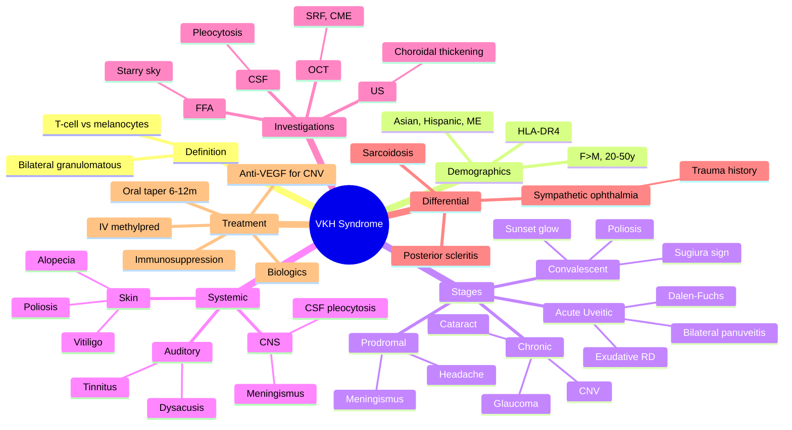

# Vogt-Koyanagi-Harada (VKH) Syndrome

Related: [[Panuveitis]], [[Sympathetic Ophthalmia]], [[T-Cell Autoimmunity]]

> [!tip] **FCPS/MRCP Priority: MEDIUM**
> Bilateral granulomatous panuveitis with meningismus, vitiligo, alopecia, tinnitus, sunset glow fundus. Common in pigmented races (Asian, Hispanic, Middle Eastern). Treat with high-dose steroid.

---

## Learning Objectives
- [ ] Define VKH and explain the autoimmune basis (T-cell vs melanocytes)
- [ ] Recognise the four clinical stages
- [ ] Identify extraocular features (meningeal, auditory, dermatologic)
- [ ] Apply the revised diagnostic criteria
- [ ] Interpret FFA ("starry sky") and OCT findings
- [ ] Describe the high-dose steroid + immunosuppression protocol
- [ ] Differentiate VKH from sympathetic ophthalmia

---

## 1. Definition / Epidemiology / Classification

### Definition
- **VKH syndrome:** Bilateral granulomatous panuveitis with T-cell mediated autoimmunity against melanocytes
- Affects eyes, central nervous system, integumentary system, and auditory system
- "Uveomeningoencephalitic syndrome"

### Epidemiology
- **Common in pigmented races:** Asians, Hispanics, Middle Eastern, Native American
- Female > male (slight)
- Peak age 20–50 years
- HLA-DR4 association (especially in Japanese and Mexican populations)

### Classification (Revised Criteria)
- **Complete VKH:** Bilateral ocular + neurologic + dermatologic involvement
- **Incomplete VKH:** Bilateral ocular + either neurologic or dermatologic
- **Probable VKH:** Bilateral ocular + isolated ocular features (only meningismus or dysacusis)

---

## 2. Aetiology / Pathophysiology

### Pathogenesis
- T-cell mediated autoimmune response against melanocyte antigens
- Targets: uveal, dermal, meningeal, cochlear melanocytes
- Trigger unknown; viral infection proposed (Epstein-Barr, CMV)
- Genetic predisposition: HLA-DR4 (DRB1*0405)
- Histology: diffuse granulomatous panuveitis with Dalen-Fuchs nodules; choroidal melanocyte loss

### Stages (4 phases)
1. **Prodromal** (days): meningeal symptoms
2. **Acute uveitic** (weeks–months): bilateral panuveitis with exudative RD
3. **Convalescent** (months): depigmentation (sunset glow)
4. **Chronic/recurrent** (years): recurrent inflammation, CNV, glaucoma, cataract

---

## 3. Clinical Features (Stages)

### Prodromal (Days)
- Headache (often severe)
- **Meningismus** — neck stiffness, photophobia (mimics meningitis)
- Fever, malaise
- CSF: lymphocytic pleocytosis

### Acute Uveitic (Weeks to Months)
- **Bilateral** granulomatous panuveitis (90% bilateral at presentation, but can be sequential)
- Pain, photophobia, ↓VA
- **Anterior segment:** Cells, flare, **mutton-fat KPs**, iris nodules
- **Vitreous:** Vitritis
- **Posterior segment:**
  - **Exudative (serous) RD** — multifocal, bullous
  - **Disc oedema** (hyperemic, swollen)
  - **Dalen-Fuchs nodules** (subretinal yellow-white deposits)
  - Choroidal thickening
  - Peripapillary atrophy (later)
- **CSF:** lymphocytic pleocytosis (>100 cells)
- **Dysacusis** (70%): tinnitus, hearing loss

### Convalescent (Months After Acute)
- **"Sunset glow" fundus** — orange-red, depigmented choroid (pathognomonic)
- **Sugiura sign** — perilimbal vitiligo
- Numular chorioretinal scars (small punched-out)
- Cutaneous depigmentation (vitiligo)
- Eyelash poliosis (white lashes)
- Alopecia

### Chronic / Recurrent (Years)
- Recurrent anterior or posterior uveitis
- **Cataract** (steroid-related)
- **Glaucoma** (steroid, angle closure from PAS)
- **Subretinal fibrosis, CNV** (choroidal neovascularisation)
- Persistent dysacusis
- Optic atrophy (late)

### Integumentary / Auditory
- **Vitiligo** (especially face, periocular, trunk)
- **Alopecia, poliosis** (white eyelashes, eyebrows)
- **Dysacusis, tinnitus** (sensorineural hearing loss)

---

## 4. Diagnosis (Revised Criteria)

### Complete VKH (All 4 Required)
1. Bilateral ocular involvement (no prior penetrating trauma/surgery)
2. No history of penetrating ocular trauma or surgery (excludes SO)
3. ≥1 neurologic: meningismus, dysacusis, CSF pleocytosis
4. ≥1 dermatologic: alopecia, poliosis, vitiligo

### Incomplete VKH
- Bilateral ocular + neurologic + dermatologic findings, but only 1 of neurologic/dermatologic

### Probable VKH
- Bilateral ocular findings only (no neurologic, no dermatologic)

---

## 5. Investigations

### Imaging
- **FFA (Fundus Fluorescein Angiography):** Multiple **pinpoint hyperfluorescent leakage** — **"starry sky"** appearance; pooling in subretinal fluid in exudative RD
- **OCT:** Subretinal fluid, exudative RD, macular oedema (CME), ellipsoid zone disruption
- **B-scan US:** **Diffuse choroidal thickening** (especially posterior pole)
- **ICG (Indocyanine Green):** Hypofluorescent spots (granulomas)
- **OCT-A:** May show CNV in chronic disease

### Laboratory
- **CSF:** Lymphocytic pleocytosis (early stage)
- **Audiometry:** Sensorineural hearing loss
- **ACE, syphilis serology, IGRA, ANA, ANCA:** To exclude other causes
- **MRI brain:** Rule out other causes of meningismus (meningitis, MS)

### Histology (if biopsied)
- Diffuse granulomatous uveal inflammation
- Dalen-Fuchs nodules
- Melanocyte loss in chronic stage

---

## 6. Differential Diagnosis

| Condition | Distinguishing Feature |
|-----------|------------------------|
| **Sympathetic ophthalmia** | **History of trauma/surgery** (VKH has no trauma) |
| **Sarcoidosis** | Hilar adenopathy, ACE↑, non-caseating granulomas |
| **Posterior scleritis** | Severe pain, scleral thickening, T-sign on US |
| **Bilateral central serous chorioretinopathy** | Serous RD without inflammation; usually unilateral |
| **Posterior uveitis (other)** | Often unilateral, no systemic features |
| **Primary intraocular lymphoma** | Elderly, steroid-resistant, CSF cytology |
| **Birdshot chorioretinopathy** | HLA-A29, numular cream-coloured lesions radiating from disc |

### Key Differentiator from Sympathetic Ophthalmia
- **VKH = NO trauma** + meningeal/auditory/dermatologic features
- **SO = trauma history** + bilateral uveitis, no skin/hearing features

---

## 7. Management

### Acute (Aggressive to Prevent Chronic Damage)
- **High-dose IV methylprednisolone 1 g × 3 days** → **oral prednisolone 1 mg/kg, slow taper over 6–12 months**
- Early introduction of **steroid-sparing immunosuppression** (within 2–4 weeks):
  - Methotrexate, azathioprine, mycophenolate mofetil (MMF), cyclosporine, tacrolimus
- **Biologics (refractory):**
  - Adalimumab (anti-TNF-α) — VISUAL trials
  - Infliximab, tocilizumab
- **Intravitreal steroid:**
  - Dexamethasone implant (Ozurdex) for chronic CMO
  - Triamcinolone acetonide (off-label)
- **Cycloplegia** (posterior synechiae prevention)
- **IOP control** as needed

### Chronic / Refractory
- Maintenance immunosuppression ≥ 1 year (often 2–3 years)
- Anti-VEGF for CNV
- Cataract and glaucoma management
- Low-vision support

### Complications
- **Cataract** (steroid, chronic inflammation)
- **Glaucoma** (steroid, angle closure from PAS)
- **CNV** — subfoveal CNV treated with anti-VEGF
- **Subretinal fibrosis**
- **Optic atrophy**
- **Phthisis bulbi** (end-stage)

---

## 8. Red Flags / Emergencies

- Bilateral exudative RD with meningismus → urgent workup
- Suspected SO (history of trauma) — different management
- Rapid vision loss with CNV
- IOP spike (steroid response)
- Steroid-resistant disease — re-evaluate diagnosis (consider lymphoma)

---

## 9. FCPS/MRCP High-Yield Summary

| Category | Key Points |
|----------|------------|
| Bilateral | Granulomatous panuveitis |
| Skin | Vitiligo, alopecia, poliosis |
| CNS | Meningismus, dysacusis |
| Fundus | Sunset glow, exudative RD |
| FFA | Starry sky (multiple pinpoint leakage) |
| HLA | DR4 (DRB1*0405) |
| Treatment | High-dose steroid + immunosuppression |
| Differentiate from SO | NO trauma in VKH |

---

## 10. Viva Questions

1. **Q:** What are the classic features of VKH?
   **A:** Bilateral granulomatous panuveitis + meningismus + vitiligo + alopecia/poliosis + dysacusis + sunset glow fundus.

2. **Q:** What is the characteristic FFA finding in acute VKH?
   **A:** Multiple pinpoint hyperfluorescent leakage — "starry sky" appearance.

3. **Q:** How is VKH differentiated from sympathetic ophthalmia?
   **A:** VKH = no history of trauma. SO = penetrating injury or surgery.

4. **Q:** What is the typical demographic for VKH?
   **A:** Pigmented races (Asian, Hispanic, Middle Eastern, Native American), F > M, 20–50 years.

5. **Q:** What is the "sunset glow" fundus?
   **A:** Orange-red appearance of the fundus from choroidal depigmentation — seen in convalescent/chronic VKH (and chronic SO).

6. **Q:** What is Sugiura's sign?
   **A:** Perilimbal vitiligo (depigmentation of the perilimbal conjunctiva) — seen in chronic VKH.

7. **Q:** What is the treatment of acute VKH?
   **A:** IV methylprednisolone 1 g × 3 days → oral prednisolone 1 mg/kg with slow taper over 6–12 months + early steroid-sparing immunosuppression.

---

## 11. Common Confusions / Exam Traps

| Confusion | Clarification |
|-----------|---------------|
| "VKH = SO without trauma" | Both share Dalen-Fuchs and sunset glow; VKH has systemic features (skin, meningeal, auditory) |
| "FFA is the same as in CSR" | VKH has pinpoint leakage "starry sky"; CSR has smoke-stack or inkblot leakage |
| "Bilateral uveitis with vitiligo = sarcoid" | VKH = bilateral + skin + meningeal/auditory; sarcoid = hilar adenopathy, ACE↑ |
| "Corticosteroid alone is enough" | Need slow taper over 6–12 months + early steroid-sparing agent to prevent recurrence |
| "VKH doesn't cause CNV" | Yes, CNV is a chronic complication; treat with anti-VEGF |
| "Posterior scleritis = VKH" | Posterior scleritis = severe pain, scleral thickening, T-sign on US, no skin/CNS features |

---

## 12. Mnemonics

1. **"VKH = VItiligo + K-poliosis + Hearing loss"** — the dermatologic + auditory features
2. **"Sunset = Sunset glow"** — convalescent stage classic
3. **"STARRY sky"** — FFA finding in acute VKH (Starry SKY = SunKEN — wait, SKY = Stellate pinpoint leakage)

---

## 13. Mind Map

---

## 14. One-Page Revision Card

| **Topic** | **VKH Syndrome** |
|-----------|------------------|
| **Definition** | Bilateral granulomatous panuveitis with T-cell autoimmunity vs melanocytes |
| **Demographics** | Asian, Hispanic, ME; F>M; 20–50 y; HLA-DR4 |
| **Acute signs** | Bilateral panuveitis, exudative RD, Dalen-Fuchs |
| **Chronic sign** | Sunset glow fundus |
| **Skin** | Vitiligo, alopecia, poliosis |
| **CNS/Auditory** | Meningismus, dysacusis, tinnitus |
| **FFA** | Starry sky (pinpoint leakage) |
| **CSF** | Lymphocytic pleocytosis |
| **Treatment** | IV methylpred → oral taper + immunosuppression |
| **Differentiate from SO** | No trauma history |
| **Viva Pearl** | "Bilateral + skin + meningeal + sunset glow = VKH" |

---

## Spaced Repetition Trackers

### 24-Hour Recall Prompts
- [ ] Define VKH (bilateral granulomatous, T-cell vs melanocytes)
- [ ] List 4 stages of VKH
- [ ] List 3 extraocular features (skin, CNS, auditory)
- [ ] Describe the FFA finding
- [ ] Differentiate from SO
- [ ] Outline treatment

### Revision Schedule
- [ ] **Day 1** completed (creation + 24h recall)
- [ ] **Day 3** revision completed
- [ ] **Day 7** revision completed
- [ ] **Day 15** revision completed
- [ ] **Day 30** revision completed
- [ ] **Day 90** revision completed

---

## Must Know / Should Know / Nice to Know

### Must Know (Core for passing)
- [x] Definition (bilateral granulomatous panuveitis)
- [x] 4 stages (prodromal, acute, convalescent, chronic)
- [x] Extraocular features (meningismus, dysacusis, vitiligo, alopecia, poliosis)
- [x] FFA finding (starry sky)
- [x] Treatment (IV methylpred + oral taper + immunosuppression)
- [x] Differentiate from SO (NO trauma)

### Should Know (High probability)
- [x] HLA-DR4 association
- [x] Sunset glow fundus and Sugiura sign
- [x] Exudative RD
- [x] Dalen-Fuchs nodules
- [x] CSF pleocytosis
- [x] CNV as chronic complication

### Nice to Know (Differentiator)
- [ ] B-scan US showing choroidal thickening
- [ ] ICG hypofluorescent spots
- [ ] DRB1*0405 sub-allele
- [ ] OCT-A for CNV
- [ ] Biologics in refractory disease (adalimumab, tocilizumab)

---

## My Weak Points
- [ ] Add personal weak areas here

---

## Self-Test Scorecard

| Section | Score /5 |
|---------|----------|
| Understanding: | /10 |
| Recall: | /10 |
| MCQ Performance: | /10 |
| SBA Performance: | /10 |
| Viva Confidence: | /10 |
| Total: | /50 |

> [!tip] **Interpretation:** <35 = weak topic, 35-44 = acceptable but insecure, 45+ = strong exam-ready topic.

---

## Exam Answer Modes

### Long Answer Skeleton
1. Definition — bilateral granulomatous panuveitis, T-cell autoimmunity vs melanocytes
2. Demographics (pigmented races, F>M, 20-50y, HLA-DR4)
3. 4 stages (prodromal, acute, convalescent, chronic)
4. Ocular features (anterior uveitis, vitritis, exudative RD, Dalen-Fuchs)
5. Extraocular (meningismus, dysacusis, vitiligo, alopecia, poliosis)
6. Investigations (FFA starry sky, OCT SRF, US choroidal thickening, CSF pleocytosis)
7. Differential (SO, sarcoid, posterior scleritis, IO lymphoma)
8. Management (IV methylpred, oral taper 6-12m, early immunosuppression, biologics)
9. Complications (cataract, glaucoma, CNV, subretinal fibrosis)

### Short Note Skeleton
- Definition + pathogenesis
- 4 stages
- Classic triad: skin + CNS + auditory
- FFA "starry sky"
- Treatment and follow-up

### Viva One-Liners
- **Q:** What is VKH? → **A:** Bilateral granulomatous panuveitis with T-cell autoimmunity vs melanocytes
- **Q:** Common races? → **A:** Asians, Hispanics, Middle Eastern, Native American
- **Q:** FFA finding? → **A:** Starry sky (pinpoint leakage)
- **Q:** Sunset glow? → **A:** Orange-red fundus from choroidal depigmentation
- **Q:** Differentiate from SO? → **A:** NO trauma history in VKH; SO has trauma/surgery history
- **Q:** Treatment? → **A:** IV methylpred → oral taper over 6–12 months + early immunosuppression

### Ward-Case Discussion Points
- Demographics — Asian/Hispanic/Middle Eastern
- Bilateral granulomatous panuveitis + meningismus + skin/auditory → VKH
- FFA starry sky is characteristic
- Exudative RD responds to high-dose steroid
- Always differentiate from SO (no trauma)
- Long-term immunosuppression to prevent chronic complications (CNV, sunset glow)

### Last-Night-Before-Exam Sheet
- Top 3 facts: bilateral, granulomatous, NO trauma (differs from SO)
- 1 mnemonic: "VKH = VItiligo + poliosis + Hearing loss"
- Must-know FFA: starry sky
- Must-know stage: sunset glow (chronic)
- Treatment: IV methylpred → oral taper + early immunosuppression

---

## Summary

VKH syndrome is bilateral granulomatous panuveitis with T-cell mediated autoimmunity against melanocytes. It is common in pigmented races (Asian, Hispanic, Middle Eastern) and presents in 4 stages: prodromal (meningismus), acute uveitic (bilateral panuveitis, exudative RD, Dalen-Fuchs), convalescent (sunset glow, poliosis, vitiligo), and chronic (CNV, cataract, glaucoma). Extraocular features include meningismus, dysacusis, vitiligo, alopecia, and poliosis. FFA shows "starry sky" pinpoint leakage. Treatment is high-dose IV methylprednisolone followed by slow oral taper (6–12 months) with early introduction of steroid-sparing immunosuppression; biologics (adalimumab) for refractory disease. Differentiate from sympathetic ophthalmia (VKH has no trauma history).

---

## MCQs (10)

1. **Question:** Sunset glow fundus is characteristic of:
   **Options:** A. Behçet's disease B. VKH syndrome C. Sarcoidosis D. Toxoplasmosis E. CMV retinitis
   **Answer:** B
   **Explanation:** Orange-red choroid from depigmentation in convalescent VKH.

2. **Question:** VKH typically presents with all EXCEPT:
   **Options:** A. Bilateral panuveitis B. Meningismus C. Vitiligo D. Penetrating trauma history E. Dysacusis
   **Answer:** D
   **Explanation:** NO trauma history differentiates VKH from SO.

3. **Question:** First-line treatment of VKH is:
   **Options:** A. Observation B. Topical antibiotic C. High-dose systemic steroid + early immunosuppression D. Topical steroid only E. NSAIDs
   **Answer:** C
   **Explanation:** IV methylpred → oral taper + early steroid-sparing agent.

4. **Question:** The characteristic FFA finding in acute VKH is:
   **Options:** A. Smoke-stack leakage B. Starry sky appearance C. Lacy peripheral capillary non-perfusion D. Bull's-eye maculopathy E. Flower-petal CME
   **Answer:** B
   **Explanation:** Multiple pinpoint hyperfluorescent leakage = "starry sky."

5. **Question:** The HLA association of VKH is:
   **Options:** A. HLA-B27 B. HLA-B51 C. HLA-DR4 D. HLA-A29 E. HLA-DQ2
   **Answer:** C
   **Explanation:** HLA-DR4 (DRB1*0405) is associated with VKH.

6. **Question:** Which of the following is NOT a feature of chronic VKH?
   **Options:** A. CNV B. Cataract C. Sunset glow fundus D. Acute exudative RD E. Poliosis
   **Answer:** D
   **Explanation:** Acute exudative RD is a feature of the acute stage, not chronic.

7. **Question:** Sugiura's sign refers to:
   **Options:** A. Iris nodules B. Perilimbal vitiligo C. White eyelashes D. Poliosis of the eyebrows E. Peripapillary atrophy
   **Answer:** B
   **Explanation:** Sugiura sign = perilimbal vitiligo, characteristic of chronic VKH.

8. **Question:** CSF findings in acute VKH typically show:
   **Options:** A. Neutrophilic pleocytosis B. Lymphocytic pleocytosis C. Low glucose D. Xanthochromia E. Eosinophilia
   **Answer:** B
   **Explanation:** Lymphocytic pleocytosis reflects meningeal inflammation.

9. **Question:** Which demographic is most commonly affected by VKH?
   **Options:** A. Caucasian elderly B. Pigmented races (Asian, Hispanic, Middle Eastern), 20-50y C. African children D. Northern European females E. Pacific Islanders
   **Answer:** B
   **Explanation:** VKH is most common in pigmented races, F > M, age 20–50.

10. **Question:** A chronic complication of VKH that requires anti-VEGF therapy is:
    **Options:** A. Cataract B. Glaucoma C. Choroidal neovascularisation (CNV) D. Vitritis E. Band keratopathy
    **Answer:** C
    **Explanation:** CNV in chronic VKH is treated with intravitreal anti-VEGF.

---

## SBA Questions (10)

1. **Scenario:** A 35-year-old Asian woman has bilateral panuveitis, headache, neck stiffness, vitiligo on the face, tinnitus, and orange-red fundus.
   **Question:** What is the most likely diagnosis?
   **Options:** A. Behçet's disease B. VKH syndrome C. Sarcoidosis D. Sympathetic ophthalmia E. Toxoplasmosis
   **Answer:** B
   **Explanation:** Bilateral + skin (vitiligo) + CNS (meningismus) + auditory (tinnitus) + sunset glow = VKH.

2. **Scenario:** A 40-year-old Middle Eastern man with bilateral panuveitis has mutton-fat KPs, vitritis, and bilateral exudative RD on OCT. FFA shows multiple pinpoint hyperfluorescent leakage.
   **Question:** Most likely diagnosis?
   **Options:** A. Sympathetic ophthalmia B. VKH syndrome C. Sarcoidosis D. Behçet's E. Posterior scleritis
   **Answer:** B
   **Explanation:** Bilateral + granulomatous + exudative RD + FFA "starry sky" = VKH.

3. **Scenario:** A 30-year-old with bilateral panuveitis and exudative RD. FFA shows pinpoint leakage. There is no history of trauma. Treatment is started with IV methylprednisolone.
   **Question:** What adjunctive therapy should be started early to allow steroid taper?
   **Options:** A. Topical antibiotics B. Steroid-sparing immunosuppression (methotrexate, MMF, azathioprine) C. Anti-VEGF D. Vitrectomy E. Photocoagulation
   **Answer:** B
   **Explanation:** Early steroid-sparing immunosuppression allows steroid taper and prevents relapse.

4. **Scenario:** A patient with VKH has been on oral prednisolone for 6 months. He develops progressive ↓VA. OCT shows subretinal fluid and a grey subfoveal lesion.
   **Question:** What is the likely complication?
   **Options:** A. Cataract B. Glaucoma C. CNV D. Vitritis E. Recurrent anterior uveitis
   **Answer:** C
   **Explanation:** Subfoveal grey lesion with SRF in chronic VKH = CNV; treat with anti-VEGF.

5. **Scenario:** A patient with bilateral panuveitis has a history of penetrating eye injury 2 years ago. The clinical picture resembles VKH (sunset glow, exudative RD).
   **Question:** Most likely diagnosis?
   **Options:** A. VKH B. Sympathetic ophthalmia C. Sarcoidosis D. TB E. Behçet's
   **Answer:** B
   **Explanation:** History of penetrating injury = sympathetic ophthalmia, even if features resemble VKH.

6. **Scenario:** A 45-year-old with chronic VKH has IOP of 38 mmHg. He is on topical dexamethasone 4x/day for 4 months. Gonioscopy shows open angles.
   **Question:** Most likely cause of IOP rise?
   **Options:** A. Acute angle-closure glaucoma B. Steroid-induced ocular hypertension C. Neovascular glaucoma D. Uveitic glaucoma from PAS E. Pigment dispersion
   **Answer:** B
   **Explanation:** Long-term topical steroid use causes steroid-induced ocular hypertension (steroid responder).

7. **Scenario:** A 30-year-old with VKH is on IV methylpred 1 g × 3 days, transitioning to oral prednisolone 1 mg/kg. He is in the acute uveitic stage.
   **Question:** What is the expected duration of oral steroid taper?
   **Options:** A. 1 week B. 1 month C. 3 months D. 6–12 months E. 2 years
   **Answer:** D
   **Explanation:** Slow taper over 6–12 months is required to prevent recurrence.

8. **Scenario:** A patient with VKH has bilateral granulomatous panuveitis, vitiligo, and meningismus. There is NO history of trauma or surgery.
   **Question:** What is the diagnosis?
   **Options:** A. Sympathetic ophthalmia B. Behçet's C. VKH (complete) D. Sarcoidosis E. Posterior scleritis
   **Answer:** C
   **Explanation:** Bilateral + skin + CNS, no trauma = complete VKH.

9. **Scenario:** A 35-year-old with VKH on high-dose steroids has a history of hepatitis B. Steroid-sparing agent is needed.
   **Question:** Which immunosuppressant should be AVOIDED?
   **Options:** A. Methotrexate B. Azathioprine C. Mycophenolate mofetil D. Cyclosporine E. Tacrolimus
   **Answer:** B
   **Explanation:** Azathioprine is hepatotoxic and relatively contraindicated in active hepatitis. MTX, MMF, CsA, tacrolimus are alternatives.

10. **Scenario:** A patient with chronic VKH has been on long-term immunosuppression. He develops ↓VA. OCT-A shows a subfoveal neovascular network.
    **Question:** Best treatment?
    **Options:** A. Topical steroid B. Photodynamic therapy C. Intravitreal anti-VEGF D. Systemic cyclophosphamide E. Observation
    **Answer:** C
    **Explanation:** Subfoveal CNV is treated with intravitreal anti-VEGF (ranibizumab, aflibercept, bevacizumab).

---

## Flashcards

- **Q:** What is VKH?
  **A:** Bilateral granulomatous panuveitis with T-cell autoimmunity against melanocytes.
- **Q:** What is the FFA finding in acute VKH?
  **A:** Multiple pinpoint hyperfluorescent leakage — "starry sky."
- **Q:** What is sunset glow fundus?
  **A:** Orange-red fundus from choroidal depigmentation in chronic VKH.
- **Q:** How is VKH differentiated from SO?
  **A:** VKH has NO trauma history; SO has trauma or surgery history.
- **Q:** First-line treatment for VKH?
  **A:** IV methylprednisolone 1 g × 3 days → oral prednisolone 1 mg/kg with slow taper over 6–12 months + early immunosuppression.

---

## Answer Key with Explanations

### MCQs
1. B — Sunset glow is characteristic of VKH
2. D — NO trauma history in VKH
3. C — High-dose steroid + early immunosuppression
4. B — Starry sky = pinpoint leakage
5. C — HLA-DR4 is associated
6. D — Acute exudative RD is in acute stage
7. B — Sugiura sign = perilimbal vitiligo
8. B — Lymphocytic pleocytosis
9. B — Pigmented races, 20–50 y
10. C — CNV in chronic VKH

### SBAs
1. B — Bilateral + skin + CNS + auditory + sunset glow = VKH
2. B — Bilateral + granulomatous + FFA starry sky = VKH
3. B — Early steroid-sparing agent needed
4. C — Subfoveal grey lesion with SRF = CNV
5. B — Trauma history = SO
6. B — Long-term topical steroid = steroid-induced OHT
7. D — 6–12 month taper
8. C — Complete VKH
9. B — Azathioprine is hepatotoxic
10. C — Anti-VEGF for CNV

---

## Tags
#medicine #davidson #ophthalmology #VKH #panuveitis #uveitis #fcps #mrcp
