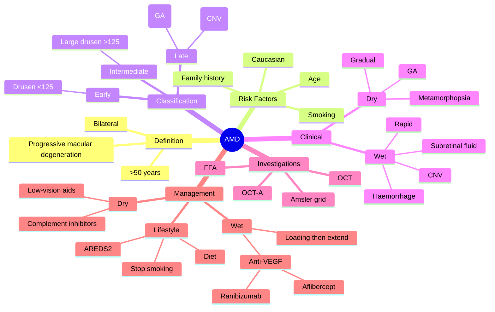

# Age-related Macular Degeneration (AMD)

Related: [[Diabetic Retinopathy]], [[Anti-VEGF Therapy]], [[Central Serous Retinopathy]]

> [!tip] **FCPS/MRCP Priority: CRITICAL**
> Leading cause of irreversible central vision loss in elderly. Drusen = early; GA = dry; CNV = wet. Treat wet AMD with anti-VEGF; AREDS2 supplements for intermediate dry.

---

## Learning Objectives
- [ ] Define AMD and explain why it matters (leading cause of blindness in elderly)
- [ ] Differentiate dry (GA) from wet (CNV) AMD
- [ ] List risk factors and identify the most important modifiable one
- [ ] Describe the role of drusen, RPE, and Bruch's membrane
- [ ] Apply Amsler grid testing and interpret OCT/FFA findings
- [ ] Outline management: AREDS2, anti-VEGF, lifestyle
- [ ] Counsel patients on prognosis and monitoring

---

## 1. Definition / Epidemiology / Classification

### Definition
- **Age-related macular degeneration (AMD):** Progressive degeneration of the macula (central retina), the leading cause of irreversible central vision loss in people >50 years
- Bilateral but often asymmetric

### Epidemiology
- Most common cause of irreversible blindness in elderly in developed world
- Prevalence ↑ with age: ~10% >65 y, ~25% >75 y
- Earlier and more severe in Caucasians

### Classification (Beckman Initiative)
- **No AMD** — no drusen or small (<63 μm) only, no pigmentary changes
- **Early AMD** — medium drusen (63–125 μm), no pigmentary changes
- **Intermediate AMD** — large drusen (>125 μm) and/or pigmentary changes
- **Late AMD** — geographic atrophy (dry) and/or neovascular (wet)

---

## 2. Aetiology / Pathophysiology

### Aetiology
- **Age** (most important)
- **Smoking** (biggest modifiable — 2–4× ↑ risk)
- Family history (genetic: CFH, ARMS2, HTRA1)
- Caucasian race
- Diet low in antioxidants, high in fat
- Cardiovascular risk (HTN, hyperlipidaemia)
- Light/UV exposure

### Pathophysiology
- **Drusen:** Yellow-white sub-RPE deposits of lipid, protein, cellular debris between RPE and Bruch's membrane
- **RPE dysfunction** → photoreceptor loss
- **Geographic atrophy:** Sharply demarcated RPE + photoreceptor loss with visible choroidal vessels
- **Choroidal neovascularisation (CNV):** New vessels from choroid through breaks in Bruch's membrane → exudation, haemorrhage

---

## 3. Risk Factors

| Non-modifiable | Modifiable |
|----------------|------------|
| Age | Smoking (BIGGEST) |
| Family history | Diet |
| Caucasian race | BP control |
| Female sex | Lipid control |
| Genetic polymorphisms (CFH, ARMS2) | UV protection |

---

## 4. Clinical Features

### Dry (Geographic Atrophy)
- **Gradual** central blur, scotoma
- **Metamorphopsia** (wavy lines on Amsler grid)
- Difficulty reading, recognising faces
- Central/paracentral scotoma (slow onset)
- Bilateral, often asymmetric

### Wet (Neovascular / Exudative)
- **Rapid, severe** ↓VA (days–weeks)
- Metamorphopsia
- Central scotoma
- **Micropsia** (objects look smaller)
- Photopsia (flashes)
- May have central blind spot acutely

---

## 5. Examination / Investigations

### Bedside
- **Visual acuity** (↓, especially near)
- **Amsler grid** — central distortion, scotoma (wavy lines, missing squares)
- **Near vision** testing

### Slit-Lamp
- Anterior segment usually normal
- ± lens opacities (coexistent cataract)

### Fundus (Dilated)
- **Drusen** — yellow deposits at macula
- **RPE changes** — hyper/hypopigmentation
- **Geographic atrophy** — sharply demarcated depigmented area, choroidal vessels visible
- **CNV** — grey-green subretinal lesion, subretinal fluid, haemorrhage, exudate
- Disc usually normal (glaucomatous disc damage absent)

### Imaging
- **OCT (optical coherence tomography):** Drusen, GA, intraretinal/subretinal fluid, CNV, pigment epithelial detachment (PED)
- **FFA (fundus fluorescein angiography):** Defines CNV — classic (well-defined) vs occult; leakage in wet AMD
- **OCT-A:** Non-invasive CNV visualisation (no dye)
- **ICG:** Useful for polypoidal choroidal vasculopathy

---

## 6. Differential Diagnosis

| Condition | Distinguishing feature |
|-----------|------------------------|
| **Diabetic macular oedema** | Diabetes, exudates, microaneurysms |
| **Central serous retinopathy (CSR)** | Younger, male, stress, serous detachment, self-limiting |
| **Macular hole** | Sudden central scotoma, OCT shows full-thickness hole |
| **Epiretinal membrane** | Wrinkled cellophane macula, distorted vessels |
| **Myopic CNV** | High myopia, lacquer cracks, Fuchs spot |
| **Hypertensive/choroidal neovascularisation** | Subretinal fluid without drusen |

---

## 7. Management

### Lifestyle / Prevention
- **Smoking cessation** (most important modifiable)
- Diet: leafy greens, fish (omega-3), antioxidants
- **AREDS2 supplements** for **intermediate AMD or advanced AMD in one eye:**
  - Lutein 10 mg + Zeaxanthin 2 mg + Vitamin C 500 mg + Vitamin E 400 IU + Zinc 80 mg + Copper 2 mg
  - **Replaced β-carotene** (↑ lung cancer risk in smokers)
- UV protection (sunglasses)

### Dry AMD (Geographic Atrophy)
- **No proven treatment to halt** (older therapy)
- **Complement inhibitors** (newer):
  - **Pegcetacoplan** (C3 inhibitor, intravitreal, Syfovre) — slows GA progression
  - **Avacincaptad pegol** (C5 inhibitor, Izervay) — slows GA progression
- Low-vision aids, rehabilitation, eccentric viewing training
- Monitor with regular OCT and Amsler grid

### Wet AMD (CNV)
- **Intravitreal anti-VEGF** — mainstay of treatment
  - **Ranibizumab** (Lucentis) — monoclonal antibody fragment
  - **Aflibercept** (Eylea) — recombinant fusion protein (decoy receptor)
  - **Bevacizumab** (Avastin) — off-label, cheaper
  - **Brolucizumab** (Beovu) — single-chain antibody fragment
  - **Faricimab** (Vabysmo) — bispecific (VEGF-A + Ang-2)
- **Regimens:** 3 monthly loading doses → treat-and-extend or PRN
- Monitor with OCT at each visit
- **PDT (photodynamic therapy):** Largely historical; only for specific cases (e.g., polypoidal)
- **Submacular surgery, RPE transplantation** — experimental

### Low Vision Rehabilitation
- Magnifiers (handheld, stand)
- Large-print books, e-readers
- Eccentric viewing training
- Adaptive devices, talking watches
- Registration as visually impaired / blind

---

## 8. Complications

- Bilateral blindness (advanced)
- Depression, social isolation
- Disciform scar (end-stage wet AMD)
- RPE tears (with anti-VEGF or PED)
- Endophthalmitis (rare post-injection, ~0.02%)

---

## 9. Red Flags / Emergencies

- Sudden ↓VA in one eye of a patient with known dry AMD → suspect conversion to wet
- New metamorphopsia on Amsler grid → urgent OCT
- Pain, redness, hypopyon after injection → endophthalmitis emergency

---

## 10. FCPS/MRCP High-Yield Summary

| Topic | Key Points |
|-------|------------|
| Risk | Age, smoking (modifiable) |
| Drusen | Early sign, sub-RPE deposits |
| Dry (GA) | Slow, no proven treatment (complement inhibitors slow progression) |
| Wet (CNV) | Fast, anti-VEGF (loading → extend/PRN) |
| AREDS2 | Intermediate AMD, advanced in one eye |
| Mnemonic | "Zinc keeps zinc" — L, Z, C, E, Zn, Cu |
| Bilateral | Always assess fellow eye |

---

## 11. Viva Questions

1. **Q:** What is the most important modifiable risk factor for AMD?
   **A:** Smoking.

2. **Q:** What are drusen?
   **A:** Yellow-white subretinal deposits between RPE and Bruch's membrane — lipid, protein, debris.

3. **Q:** Differentiate dry from wet AMD.
   **A:** Dry = drusen, GA, slow. Wet = CNV, fluid, haemorrhage, fast. Treat wet with anti-VEGF.

4. **Q:** What is the AREDS2 formula?
   **A:** Lutein 10 mg, zeaxanthin 2 mg, vit C 500 mg, vit E 400 IU, zinc 80 mg, copper 2 mg — for intermediate AMD or advanced in one eye.

5. **Q:** Why was β-carotene removed from AREDS2?
   **A:** Increased risk of lung cancer in smokers; replaced with lutein/zeaxanthin.

6. **Q:** A 75-year-old on anti-VEGF develops sudden ↓VA 3 days post-injection with pain and hypopyon. Diagnosis?
   **A:** Infectious endophthalmitis — emergency vitreous tap + intravitreal antibiotics.

---

## 12. Common Confusions / Exam Traps

| Confusion | Clarification |
|-----------|---------------|
| "AREDS2 prevents AMD" | It slows progression in intermediate/advanced — does not prevent onset |
| "Anti-VEGF cures wet AMD" | Controls but does not cure; requires ongoing injections |
| "Wet AMD is more common" | No — dry AMD is more common (~85%); wet is more visually devastating |
| "β-carotene is in AREDS2" | Removed (smoker lung cancer risk) — replaced by lutein/zeaxanthin |
| "Drusen are diagnostic" | Small drusen are part of normal ageing; large drusen = AMD |
| "Bevacizumab = ranibizumab" | Both anti-VEGF, but bevacizumab is off-label and cheaper |
| "Amsler grid is diagnostic" | Screening tool — confirms need for OCT |
| "Wet AMD is bilateral" | Often unilateral at presentation, but fellow-eye risk ~10%/year |
| "PDT is first-line for wet AMD" | Now largely replaced by anti-VEGF |
| "Anti-VEGF is given IV" | Intravitreal injection (not IV) |

---

## 13. Mnemonics

1. **"AREDS2 = LZCE-Zn-Cu"** — Lutein, Zeaxanthin, Vitamin C, Vitamin E, Zinc, Copper
2. **"Wet = Wrecking ball"** — rapid vision loss; **"Dry = Drifting"** — slow central blur
3. **"Smoking Stains Macula"** — biggest modifiable risk factor

---

## 14. Mind Map

---

## 15. One-Page Revision Card

| **Topic** | **AMD** |
|-----------|---------|
| **Definition** | Progressive macular degeneration, leading cause of irreversible central vision loss >50 y |
| **Risk Factors** | Age, smoking (modifiable), family history, Caucasian |
| **Drusen** | Sub-RPE yellow deposits — early sign |
| **Dry (GA)** | Sharply demarcated RPE loss; slow; complement inhibitors slow progression |
| **Wet (CNV)** | Choroidal neovascularisation; rapid; treat with anti-VEGF |
| **AREDS2** | L, Z, C, E, Zn, Cu — for intermediate AMD or advanced in one eye |
| **Amsler Grid** | Screening test for metamorphopsia / central scotoma |
| **OCT** | Diagnostic — drusen, fluid, CNV |
| **Anti-VEGF** | Intravitreal; loading × 3 monthly → extend/PRN |
| **Viva Pearl** | Smoking cessation = single most important intervention |

---

## 16. Spaced Repetition Trackers

### 24-Hour Recall Prompts
- [ ] Define AMD and list 3 risk factors
- [ ] Differentiate dry (GA) from wet (CNV) AMD on fundus
- [ ] State the AREDS2 formula and indication
- [ ] List 3 anti-VEGF agents used in wet AMD

### Revision Schedule
- [ ] **Day 1** completed (creation + 24h recall)
- [ ] **Day 3** revision completed
- [ ] **Day 7** revision completed
- [ ] **Day 15** revision completed
- [ ] **Day 30** revision completed
- [ ] **Day 90** revision completed

---

## 17. Must Know / Should Know / Nice to Know

### Must Know (Core for passing)
- [x] Definition and clinical significance
- [x] Risk factors (esp. smoking)
- [x] Dry vs wet AMD distinction
- [x] Drusen: location and significance
- [x] AREDS2 formula and indication
- [x] Anti-VEGF is treatment for wet AMD
- [x] Amsler grid for screening/monitoring

### Should Know (High probability)
- [x] Geographic atrophy and complement inhibitors (pegcetacoplan)
- [x] Anti-VEGF loading and extension protocols
- [x] FFA classic vs occult CNV
- [x] Differential diagnosis (CSR, DMO, macular hole)
- [x] Red flag: endophthalmitis post-injection

### Nice to Know (Differentiator)
- [ ] Genetic associations (CFH, ARMS2)
- [ ] Polypoidal choroidal vasculopathy
- [ ] PDT role in selected cases
- [ ] Submacular surgery, RPE transplantation
- [ ] OCT-angiography interpretation

---

## 18. My Weak Points
- [ ] Add personal weak areas here

---

## 19. Self-Test Scorecard

| Section | Score /5 |
|---------|----------|
| Understanding: | /10 |
| Recall: | /10 |
| MCQ Performance: | /10 |
| SBA Performance: | /10 |
| Viva Confidence: | /10 |
| Total: | /50 |

> [!tip] **Interpretation:** <35 = weak topic, 35-44 = acceptable but insecure, 45+ = strong exam-ready topic.

---

## 20. Exam Answer Modes

### Long Answer Skeleton
1. Definition (progressive degeneration of macula >50 y, leading cause of central vision loss)
2. Classification (early / intermediate / late; dry vs wet)
3. Risk factors (age, smoking [modifiable], family history, Caucasian, diet, CV risk)
4. Pathophysiology (drusen, RPE dysfunction, GA, CNV)
5. Clinical features (dry: gradual, scotoma; wet: rapid, metamorphopsia, micropsia)
6. Investigations (Amsler grid, OCT, FFA, OCT-A)
7. Management
   - Lifestyle: stop smoking, diet
   - AREDS2 (intermediate/advanced one eye)
   - Dry: complement inhibitors, low-vision aids
   - Wet: anti-VEGF (loading → extend/PRN)
8. Complications and rehabilitation

### Short Note Skeleton
- Definition + classification
- Risk factors
- Dry vs wet comparison
- AREDS2 + anti-VEGF (one line each)

### Viva One-Liners
- **Q:** What is AMD? → **A:** Progressive macular degeneration — leading cause of irreversible central vision loss >50 y
- **Q:** Most important modifiable risk? → **A:** Smoking
- **Q:** What is drusen? → **A:** Sub-RPE yellow deposits of lipid and protein
- **Q:** Dry vs wet? → **A:** Dry = drusen, GA, slow; Wet = CNV, fast, treat with anti-VEGF
- **Q:** AREDS2 formula? → **A:** Lutein, Zeaxanthin, Vit C, Vit E, Zinc, Copper

### Ward-Case Discussion Points
- Counsel patient on smoking cessation
- Teach Amsler grid self-monitoring
- Identify wet conversion (sudden distortion)
- Discuss anti-VEGF treatment burden
- Recognise endophthalmitis post-injection

### Last-Night-Before-Exam Sheet
- **Top 3 facts:** Age + smoking risk; drusen at RPE/Bruch's; anti-VEGF for wet, AREDS2 for intermediate
- **1 mnemonic:** "AREDS2 = LZCE-Zn-Cu"
- **Must-know differential:** CSR (younger, serous detachment, self-limiting)

---

## Summary
AMD is the leading cause of irreversible central vision loss in the elderly. Drusen are early sub-RPE deposits. Dry (geographic atrophy) progresses slowly; wet (CNV) progresses rapidly and is treated with intravitreal anti-VEGF (loading 3 monthly then extend/PRN). Smoking cessation is the most important modifiable intervention. AREDS2 supplements slow progression in intermediate AMD or advanced AMD in one eye. Newer complement inhibitors (pegcetacoplan, avacincaptad pegol) slow GA. Counsel on Amsler grid self-monitoring and urgent review if new distortion.

---

## MCQs (10)

1. **Question:** The most important modifiable risk factor for AMD is:
   **Options:** A. Diet B. Smoking C. Sun exposure D. Hypertension E. Alcohol
   **Answer:** B
   **Explanation:** Smoking is the single biggest modifiable risk factor (2–4× ↑ risk).

2. **Question:** Drusen are deposits located between:
   **Options:** A. RPE and Bruch's membrane B. RPE and photoreceptors C. Choroid and sclera D. Retina and vitreous E. Photoreceptors and choroid
   **Answer:** A
   **Explanation:** Drusen sit beneath the RPE, above Bruch's membrane.

3. **Question:** First-line treatment for wet AMD is:
   **Options:** A. Panretinal photocoagulation B. Intravitreal anti-VEGF C. Topical steroid D. Photodynamic therapy E. Vitrectomy
   **Answer:** B
   **Explanation:** Anti-VEGF (ranibizumab, aflibercept, bevacizumab) is the mainstay of wet AMD treatment.

4. **Question:** AREDS2 includes all EXCEPT:
   **Options:** A. Lutein B. Vitamin C C. Vitamin E D. Beta-carotene E. Zinc
   **Answer:** D
   **Explanation:** AREDS2 replaced β-carotene with lutein/zeaxanthin because β-carotene increased lung cancer in smokers.

5. **Question:** Geographic atrophy in dry AMD is best described as:
   **Options:** A. Subretinal neovascular membrane B. Sharply demarcated RPE and photoreceptor loss C. Disc oedema D. Subretinal fluid E. Retinal detachment
   **Answer:** B
   **Explanation:** GA = sharply demarcated depigmented area of RPE + photoreceptor loss with visible choroidal vessels.

6. **Question:** Which drug is a C3 complement inhibitor approved for geographic atrophy?
   **Options:** A. Ranibizumab B. Bevacizumab C. Pegcetacoplan D. Aflibercept E. Brolucizumab
   **Answer:** C
   **Explanation:** Pegcetacoplan (Syfovre) is an intravitreal C3 inhibitor that slows GA progression.

7. **Question:** Amsler grid testing is used to detect:
   **Options:** A. Colour vision defects B. Glaucomatous field loss C. Central metamorphopsia and scotoma D. Ocular motor palsy E. Cataract progression
   **Answer:** C
   **Explanation:** Amsler grid reveals central distortion and scotoma typical of macular disease.

8. **Question:** A 75-year-old on anti-VEGF for wet AMD presents 4 days post-injection with sudden pain, ↓VA and hypopyon. Most likely diagnosis:
   **Options:** A. Uveitis B. Endophthalmitis C. Retinal detachment D. Vitreous haemorrhage E. IOFB
   **Answer:** B
   **Explanation:** Acute painful ↓VA with hypopyon post-injection = infectious endophthalmitis — emergency.

9. **Question:** CNV in wet AMD originates from:
   **Options:** A. Retina B. Choroid C. Optic nerve D. Vitreous E. Iris
   **Answer:** B
   **Explanation:** Choroidal neovascularisation — new vessels grow from choroid through Bruch's membrane.

10. **Question:** Which is NOT a feature of dry AMD?
    **Options:** A. Drusen B. RPE pigmentary changes C. Rapid loss of vision over days D. Geographic atrophy E. Amsler grid distortion
    **Answer:** C
    **Explanation:** Rapid loss of vision suggests wet AMD (CNV), not dry. Dry is gradual.

---

## SBA Questions (10)

1. **Scenario:** A 75-year-old presents with rapid loss of central vision over 2 weeks. Amsler grid shows central distortion; OCT shows subretinal fluid with a pigment epithelial detachment.
   **Question:** Most likely diagnosis?
   **Options:** A. Dry AMD B. Wet AMD (CNV) C. Central serous retinopathy D. Diabetic macular oedema E. Macular hole
   **Answer:** B
   **Explanation:** Rapid distortion + subretinal fluid + PED in an elderly patient = wet AMD/CNV.

2. **Scenario:** A 70-year-old smoker with newly diagnosed intermediate AMD (large drusen in both eyes) asks what can be done to slow progression.
   **Question:** Most appropriate intervention?
   **Options:** A. Panretinal photocoagulation B. AREDS2 supplements + smoking cessation C. Intravitreal anti-VEGF D. Photodynamic therapy E. Observation only
   **Answer:** B
   **Explanation:** Intermediate AMD → AREDS2 formula + smoking cessation (the biggest modifiable risk).

3. **Scenario:** A 78-year-old on ranibizumab for wet AMD has a sudden ↓VA 3 days after injection. Pain, hypopyon, vitritis noted.
   **Question:** Most appropriate next step?
   **Options:** A. Increase ranibizumab frequency B. Topical steroid C. Vitreous tap + intravitreal antibiotics (vancomycin + ceftazidime) D. Oral acetazolamide E. PRP
   **Answer:** C
   **Explanation:** Endophthalmitis = ophthalmic emergency; vitreous tap + intravitreal antibiotics.

4. **Scenario:** A 72-year-old with dry AMD has a sharply demarcated depigmented area at the macula with visible choroidal vessels. Vision is 6/24.
   **Question:** Most likely diagnosis?
   **Options:** A. Choroidal nevus B. Geographic atrophy C. Disciform scar D. Central serous retinopathy E. Lamellar hole
   **Answer:** B
   **Explanation:** Sharply demarcated depigmentation + visible choroidal vessels = geographic atrophy.

5. **Scenario:** A 65-year-old has 6/6 vision bilaterally but fundus shows multiple yellow deposits at the macula, RPE pigmentary changes, and one large drusen in each eye.
   **Question:** Best management?
   **Options:** A. Anti-VEGF B. AREDS2 supplements C. PDT D. Vitrectomy E. No intervention
   **Answer:** B
   **Explanation:** Intermediate AMD (large drusen, pigmentary changes) → AREDS2 supplements indicated.

6. **Scenario:** A 70-year-old presents with new distortion in one eye over 2 weeks. Fundus shows a grey-green subretinal lesion with subretinal haemorrhage at the macula. OCT confirms CNV.
   **Question:** First-line treatment?
   **Options:** A. Topical steroid B. Intravitreal anti-VEGF C. Photodynamic therapy D. Submacular surgery E. Observation
   **Answer:** B
   **Explanation:** Wet AMD with CNV → intravitreal anti-VEGF (ranibizumab / aflibercept / bevacizumab).

7. **Scenario:** A 74-year-old on aflibercept for 2 years is on a treat-and-extend regimen. OCT shows no fluid and vision is stable at 6/9.
   **Question:** Next step?
   **Options:** A. Stop treatment permanently B. Continue treatment, gradually extending interval if stable C. Switch to PDT D. Add topical steroid E. Enucleate
   **Answer:** B
   **Explanation:** Treat-and-extend — if stable, intervals can be gradually extended; treatment continued long-term.

8. **Scenario:** A 67-year-old presents with a 4-day history of painless ↓VA and a "bent lines" sensation on the Amsler grid. She has a history of dry AMD.
   **Question:** Most likely cause?
   **Options:** A. Cataract progression B. Conversion to wet AMD C. Uveitis D. Optic neuritis E. Retinal detachment
   **Answer:** B
   **Explanation:** New metamorphopsia in known dry AMD = wet conversion → urgent OCT and anti-VEGF.

9. **Scenario:** An 80-year-old on anti-VEGF injections asks about her chance of going blind.
   **Question:** Best response?
   **Options:** A. "You will definitely go blind" B. "Wet AMD treatment preserves central vision in most patients if treatment is consistent, but peripheral vision remains" C. "Vitrectomy will cure it" D. "No further treatment needed" E. "Beta-carotene will cure you"
   **Answer:** B
   **Explanation:** Realistic counselling — anti-VEGF preserves vision, peripheral vision unaffected, lifelong monitoring needed.

10. **Scenario:** A 76-year-old with geographic atrophy in both eyes asks about new treatments.
    **Question:** Most appropriate response?
    **Options:** A. "Nothing can be done" B. "Intravitreal complement inhibitors (pegcetacoplan/avacincaptad) can slow progression" C. "Cataract surgery will help" D. "We should start anti-VEGF" E. "Laser will cure this"
    **Answer:** B
    **Explanation:** Complement inhibitors (pegcetacoplan C3, avacincaptad C5) slow GA progression.

---

## Flashcards

- **Q:** What is AMD?
  **A:** Progressive degeneration of the macula — leading cause of irreversible central vision loss >50 y.
- **Q:** Most important modifiable risk factor for AMD?
  **A:** Smoking.
- **Q:** Difference between dry and wet AMD?
  **A:** Dry = drusen, GA, slow. Wet = CNV, fluid/haemorrhage, fast. Wet treated with anti-VEGF.
- **Q:** What is the AREDS2 formula and indication?
  **A:** Lutein, Zeaxanthin, Vit C, Vit E, Zinc, Copper — for intermediate AMD or advanced AMD in one eye.
- **Q:** First-line treatment for wet AMD?
  **A:** Intravitreal anti-VEGF (ranibizumab, aflibercept, bevacizumab, faricimab, brolucizumab).

---

## Answer Key with Explanations

### MCQs
1. B — Smoking is the single biggest modifiable risk factor
2. A — Drusen lie between RPE and Bruch's membrane
3. B — Intravitreal anti-VEGF is first-line for wet AMD
4. D — β-carotene removed from AREDS2 due to lung cancer risk in smokers
5. B — GA = sharply demarcated RPE/photoreceptor loss
6. C — Pegcetacoplan is a C3 complement inhibitor for GA
7. C — Amsler grid detects central metamorphopsia and scotoma
8. B — Pain + hypopyon post-injection = endophthalmitis
9. B — CNV arises from choroid
10. C — Rapid loss of vision suggests wet AMD

### SBAs
1. B — Rapid distortion + SRF + PED = wet AMD
2. B — Intermediate AMD → AREDS2 + smoking cessation
3. C — Endophthalmitis → vitreous tap + intravitreal antibiotics
4. B — Sharply demarcated depigmentation + visible choroidal vessels = GA
5. B — Intermediate AMD → AREDS2
6. B — Wet AMD CNV → intravitreal anti-VEGF
7. B — Treat-and-extend: continue, extend if stable
8. B — New metamorphopsia in dry AMD = wet conversion
9. B — Anti-VEGF preserves central vision with long-term monitoring
10. B — Complement inhibitors slow GA progression

## Tags
#medicine #davidson #ophthalmology #AMD #macular-degeneration #fcps #mrcp

## PasTest Scenario SBAs (Clinical Vignettes)

> **Auto-generated PasTest/Mediscope-style scenario SBAs** grounded in the authored source content. Each scenario is a clinical vignette with 4 options. **Source: Ch 28: Medical Ophthalmology / AMD**

**Q1.** A patient is diagnosed with AMD. What is the most appropriate first-line management approach?

  - **A.** Standard guideline-directed first-line therapy
  - **B.** Most aggressive advanced therapy as first-line
  - **C.** No treatment needed in most cases
  - **D.** Investigational/compassionate-use therapy only

  > **Answer: A** — Standard guideline-directed first-line therapy

**Q2.** Which of the following best describes the underlying pathophysiology / definition of AMD?

  - **A.** **Age-related macular degeneration (AMD):** Progressive degeneration of the macula (central retina), the leading cause of irreversible central vision loss in people >50 years
  - **B.** A common misattribution to a similar but distinct condition
  - **C.** An outdated or disproven mechanism
  - **D.** A complication rather than the underlying disease process

  > **Answer: A** — **Age-related macular degeneration (AMD):** Progressive degeneration of the macula (central retina), the leading cause of irreversible central vision 

