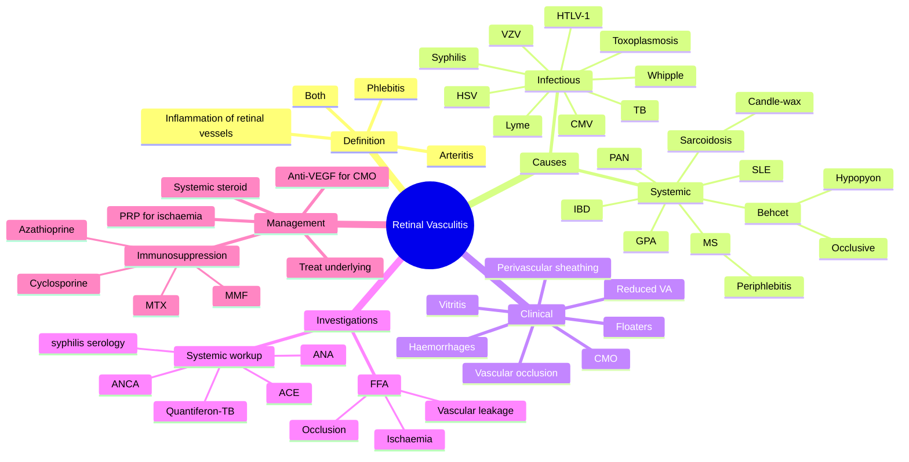

# Retinal Vasculitis

Related: [[Behcet's Disease (Ocular)]], [[Sarcoidosis (Ocular)]], [[Multiple Sclerosis]]

> [!tip] **FCPS/MRCP Priority: MEDIUM**
> Perivascular sheathing, occlusive vasculitis. Causes: Behçet's, sarcoid, SLE, MS, IBD, infections. Treat underlying.

---

## Learning Objectives
- [ ] Define retinal vasculitis (arteritis, phlebitis, or both)
- [ ] List the major systemic and infectious causes
- [ ] Recognise clinical features (perivascular sheathing, occlusive vasculitis)
- [ ] Order appropriate investigations (FFA, systemic workup)
- [ ] Apply treatment principles (steroid + immunosuppression)
- [ ] Identify Behçet's and sarcoid-specific features

---

## 1. Definition

- **Retinal vasculitis:** Inflammation of retinal vessels (arteritis, phlebitis, or both)

---

## 2. Causes

### Systemic
- **Behçet's disease** (occlusive, hypopyon)
- **Sarcoidosis** (candle-wax drippings)
- **SLE**
- **Multiple sclerosis** (periphlebitis, intermediate uveitis)
- **IBD**
- **Wegener's granulomatosis (GPA)**
- **Polyarteritis nodosa**

### Infectious
- TB, syphilis, Lyme, toxoplasmosis, CMV, HSV, VZV, **HTLV-1**, **Whipple's disease**

---

## 3. Clinical Features

- Floaters, ↓VA
- Perivascular sheathing (white cuffs around vessels)
- Vascular occlusion (arterial or venous)
- Haemorrhages, exudates
- Vitritis
- CMO

---

## 4. Management

- Treat underlying cause
- **Systemic steroid** (severe)
- **Immunosuppression:** MTX, azathioprine, MMF, cyclosporine
- **Anti-VEGF** for CMO, neovascularisation
- **Laser / PRP** for ischaemia, neovascularisation
- **Intravitreal steroid** for CMO

---

## 5. FCPS/MRCP Summary

| Topic | Key Points |
|-------|------------|
| Causes | Behçet's, sarcoid, SLE, MS, IBD, infections |
| Sign | Perivascular sheathing, occlusive vasculitis |
| Treatment | Treat cause + steroid + immunosuppression |

---

## 6. Viva Questions

1. **Q:** What systemic disease classically causes occlusive retinal vasculitis with hypopyon?
   **A:** Behçet's disease.

2. **Q:** What ocular sign is associated with sarcoidosis?
   **A:** Candle-wax drippings (vasculitis with perivascular exudates).

3. **Q:** What does periphlebitis in a young woman with neurological symptoms suggest?
   **A:** Multiple sclerosis.

---

## 7. Common Confusions / Exam Traps

| Confusion | Clarification |
|-----------|---------------|
| "Vasculitis always affects arteries" | Vasculitis can affect arteries (arteritis), veins (phlebitis), or both — site helps identify cause |
| "Behçet's vasculitis is non-occlusive" | Behçet's is classically an **occlusive** vasculitis with hypopyon — a key exam clue |
| "Sarcoidosis never causes vasculitis" | Sarcoidosis can cause retinal vasculitis with characteristic candle-wax drippings |
| "Periphlebitis = MS only" | Periphlebitis is most associated with MS but can be seen in sarcoidosis, TB, syphilis |
| "Steroid alone is enough" | Severe cases need steroid-sparing immunosuppression (MTX, AZA, MMF, ciclosporin) |

---

## 8. Mnemonics

1. **"Behçet's = Bloody Blindness"** — occlusive vasculitis + hypopyon
2. **"Sarcoid = Candle-wax"** — perivascular exudates ("candle-wax drippings")
3. **"MS = Periphlebitis in a young woman"** — neurological symptoms + retinal periphlebitis

---

## 9. Mind Map

---

## 10. One-Page Revision Card

| **Topic** | **Retinal Vasculitis** |
|-----------|------------------------|
| **Definition** | Inflammation of retinal vessels (arteritis, phlebitis, or both) |
| **Systemic causes** | Behçet's, sarcoidosis, SLE, MS, IBD, GPA, PAN |
| **Infectious causes** | TB, syphilis, Lyme, toxoplasmosis, CMV, HSV, VZV, HTLV-1, Whipple's |
| **Key signs** | Perivascular sheathing, vascular occlusion, vitritis, CMO |
| **Behçet's clue** | Occlusive vasculitis + hypopyon |
| **Sarcoid clue** | Candle-wax drippings |
| **MS clue** | Periphlebitis in young woman with neurological symptoms |
| **Investigation** | FFA + systemic workup (ACE, ANA, ANCA, syphilis, TB) |
| **Treatment** | Treat cause + systemic steroid + immunosuppression (MTX/AZA/MMF) |
| **Viva Pearl** | "Behçet's = Bloody Blindness" |

---

## Spaced Repetition Trackers

### 24-Hour Recall Prompts
- [ ] Define retinal vasculitis
- [ ] List 3 systemic causes
- [ ] Identify Behçet's classic features
- [ ] State investigation of choice
- [ ] List 3 immunosuppressants used

### Revision Schedule
- [ ] **Day 1** completed (creation + 24h recall)
- [ ] **Day 3** revision completed
- [ ] **Day 7** revision completed
- [ ] **Day 15** revision completed
- [ ] **Day 30** revision completed
- [ ] **Day 90** revision completed

---

## Must Know / Should Know / Nice to Know

### Must Know (Core for passing)
- [x] Definition (arteritis/phlebitis)
- [x] Major systemic causes (Behçet's, sarcoid, SLE, MS, IBD)
- [x] Major infectious causes (TB, syphilis, CMV, HSV)
- [x] Perivascular sheathing as key sign
- [x] Steroid + immunosuppression
- [x] Treat underlying cause

### Should Know (High probability)
- [x] Behçet's = occlusive + hypopyon
- [x] Sarcoidosis = candle-wax drippings
- [x] MS = periphlebitis in young woman
- [x] FFA findings (leakage, occlusion, ischaemia)
- [x] CMO management (anti-VEGF, intravitreal steroid)
- [x] PRP for ischaemia

### Nice to Know (Differentiator)
- [ ] HTLV-1 association
- [ ] Whipple's disease
- [ ] Interferon-α for Behçet's
- [ ] Frosted branch angiitis
- [ ] IRVAN syndrome

---

## My Weak Points
- [ ] Add personal weak areas here

---

## Self-Test Scorecard

| Section | Score /5 |
|---------|----------|
| Understanding: | /10 |
| Recall: | /10 |
| MCQ Performance: | /10 |
| SBA Performance: | /10 |
| Viva Confidence: | /10 |
| **Total:** | /50 |

> [!tip] **Interpretation:** <35 = weak topic, 35-44 = acceptable but insecure, 45+ = strong exam-ready topic.

---

## Exam Answer Modes

### Long Answer Skeleton
1. Definition (inflammation of retinal vessels — arteritis, phlebitis, or both)
2. Systemic causes (Behçet's, sarcoid, SLE, MS, IBD, GPA, PAN)
3. Infectious causes (TB, syphilis, Lyme, toxoplasmosis, CMV, HSV, VZV, HTLV-1)
4. Clinical features (perivascular sheathing, vascular occlusion, vitritis, CMO, ↓VA)
5. Investigations (FFA, ACE, ANA, ANCA, syphilis serology, Quantiferon-TB)
6. Management (treat underlying cause + systemic steroid + immunosuppression + anti-VEGF for CMO + PRP for ischaemia)

### Short Note Skeleton
- Definition + perivascular sheathing as key sign
- 3 systemic causes (Behçet's, sarcoid, MS)
- 3 infectious causes (TB, syphilis, CMV)
- Treatment (steroid + immunosuppression)

### Viva One-Liners
- **Q:** Cause of occlusive vasculitis with hypopyon? → **A:** Behçet's disease
- **Q:** Candle-wax drippings? → **A:** Sarcoidosis
- **Q:** Periphlebitis in young woman with neurological symptoms? → **A:** Multiple sclerosis
- **Q:** Treatment? → **A:** Steroid + immunosuppression (MTX/AZA/MMF) + treat underlying cause

### Ward-Case Discussion Points
- Differentiate occlusive vs non-occlusive vasculitis
- Always do systemic workup (don't miss syphilis, TB)
- Discuss steroid-sparing agents
- Monitor for CMO and neovascularisation
- Multi-disciplinary approach (rheumatology, infectious diseases)

### Last-Night-Before-Exam Sheet
- Top 3 facts: perivascular sheathing, Behçet's = occlusive + hypopyon, treat cause + immunosuppress
- 1 mnemonic: "Behçet's = Bloody Blindness"
- Must-know differential: Behçet's, sarcoid, MS, SLE, IBD
- Infectious screen: TB, syphilis, CMV

---

## Summary

Retinal vasculitis is inflammation of retinal vessels, often with perivascular sheathing. Many causes (Behçet's, sarcoid, MS, infections). Treat underlying cause and consider immunosuppression.

---

## MCQs (10)

1. **Question:** The classic cause of occlusive retinal vasculitis with hypopyon is:
   **Options:** A. Systemic lupus erythematosus B. Behçet's disease C. Multiple sclerosis D. Inflammatory bowel disease E. Tuberculosis
   **Answer:** B
   **Explanation:** Behçet's disease is the classic cause of occlusive retinal vasculitis associated with hypopyon uveitis.

2. **Question:** "Candle-wax drippings" on retinal examination are characteristic of:
   **Options:** A. Behçet's disease B. Sarcoidosis C. Multiple sclerosis D. Tuberculosis E. CMV retinitis
   **Answer:** B
   **Explanation:** Sarcoidosis is associated with candle-wax drippings — perivascular exudates along retinal venules.

3. **Question:** Periphlebitis in a young woman with neurological symptoms most strongly suggests:
   **Options:** A. Behçet's disease B. Sarcoidosis C. Multiple sclerosis D. Toxoplasmosis E. None of the above
   **Answer:** C
   **Explanation:** MS is classically associated with periphlebitis (perivenous inflammation) and may be the presenting feature in young women.

4. **Question:** Which of the following is NOT a recognised cause of retinal vasculitis?
   **Options:** A. Behçet's disease B. Sarcoidosis C. SLE D. Toxoplasmosis E. Presbyopia
   **Answer:** E
   **Explanation:** Presbyopia is an age-related refractive change, not a cause of retinal vasculitis. All other options can cause vasculitis.

5. **Question:** Frosted branch angiitis is most associated with:
   **Options:** A. CMV infection (especially in immunocompromised) B. Diabetes mellitus C. Hypertension D. Myopia E. Astigmatism
   **Answer:** A
   **Explanation:** Frosted branch angiitis — diffuse perivascular sheathing resembling frosted tree branches — is classically described in CMV infection (and other viral causes) in immunocompromised patients.

6. **Question:** First-line systemic immunosuppression for severe non-infectious retinal vasculitis includes:
   **Options:** A. Topical antibiotic B. Systemic corticosteroid ± steroid-sparing agent (MTX, azathioprine, MMF, ciclosporin) C. Topical atropine D. Oral aciclovir E. Topical antifungal
   **Answer:** B
   **Explanation:** Severe non-infectious retinal vasculitis is treated with high-dose systemic corticosteroid plus a steroid-sparing immunosuppressant such as methotrexate, azathioprine, mycophenolate mofetil, or ciclosporin.

7. **Question:** Which of the following is an infectious cause of retinal vasculitis?
   **Options:** A. Behçet's disease B. Sarcoidosis C. Tuberculosis D. Multiple sclerosis E. Inflammatory bowel disease
   **Answer:** C
   **Explanation:** Tuberculosis is a recognised infectious cause of retinal vasculitis. Others (Behçet's, sarcoid, MS, IBD) are non-infectious/systemic.

8. **Question:** The investigation of choice to demonstrate vascular leakage and ischaemia in retinal vasculitis is:
   **Options:** A. B-scan ultrasound B. Fundus fluorescein angiography C. MRI D. Schirmer test E. Tonometry
   **Answer:** B
   **Explanation:** FFA demonstrates vascular wall staining, leakage, capillary non-perfusion, and ischaemia — the characteristic features of retinal vasculitis.

9. **Question:** Cystoid macular oedema complicating retinal vasculitis is best treated with:
   **Options:** A. Topical miotic B. Intravitreal anti-VEGF or corticosteroid (in addition to systemic therapy) C. Oral antihistamine D. Topical atropine only E. Enucleation
   **Answer:** B
   **Explanation:** CMO is treated with intravitreal anti-VEGF (e.g., ranibizumab) or intravitreal corticosteroid (e.g., dexamethasone implant) alongside systemic immunosuppression.

10. **Question:** Whipple's disease is associated with which ocular manifestation?
    **Options:** A. Occlusive retinal vasculitis B. Retinal vasculitis with vitritis and uveitis (rare cause) C. Optic neuritis D. Keratoconus E. Acute angle-closure glaucoma
    **Answer:** B
    **Explanation:** Whipple's disease (Tropheryma whipplei) is a rare cause of retinal vasculitis with vitritis and uveitis, often in the context of systemic features (diarrhoea, arthralgia, weight loss).

---

## SBA Questions (10)

1. **Scenario:** A 28-year-old man with recurrent oral and genital ulcers presents with sudden painful red eye, hypopyon, and reduced vision. Fundoscopy shows perivascular sheathing, occluded venules, and retinal haemorrhages.
   **Question:** What is the most likely underlying diagnosis?
   **Options:** A. Behçet's disease B. Sarcoidosis C. SLE D. Syphilis E. CMV retinitis
   **Answer:** A
   **Explanation:** Recurrent oral/genital ulcers + hypopyon + occlusive retinal vasculitis is classic for Behçet's disease.

2. **Scenario:** A 35-year-old woman with bilateral hilar lymphadenopathy and erythema nodosum presents with floaters and blurred vision. Fundoscopy shows perivenous "candle-wax" exudates.
   **Question:** Most likely diagnosis?
   **Options:** A. Behçet's disease B. Sarcoidosis C. TB D. MS E. Toxoplasmosis
   **Answer:** B
   **Explanation:** Bilateral hilar lymphadenopathy + erythema nodosum + candle-wax retinal periphlebitis = sarcoidosis.

3. **Scenario:** A 25-year-old woman with known multiple sclerosis complains of floaters. Fundoscopy shows mild periphlebitis with no macular oedema.
   **Question:** Most appropriate next step?
   **Options:** A. Enucleation B. Panretinal photocoagulation C. Observation ± systemic therapy (treat MS, consider systemic steroid for ocular inflammation) D. Topical atropine only E. Oral antifungal
   **Answer:** C
   **Explanation:** Periphlebitis in MS is usually mild; observation is appropriate, with systemic steroid/immunosuppression reserved for severe cases. Optimise MS treatment.

4. **Scenario:** A patient with SLE on long-term steroids presents with sudden painless vision loss. Fundoscopy shows multiple cotton-wool spots, flame haemorrhages, and perivascular sheathing. BP is 180/110.
   **Question:** Most appropriate next step?
   **Options:** A. Topical atropine B. Immediate control of hypertension and treat vasculitis (systemic steroid ± cyclophosphamide) C. Topical antibiotic D. Panretinal photocoagulation only E. Enucleation
   **Answer:** B
   **Explanation:** Hypertensive emergency with retinal vasculitis requires urgent BP control; treat severe lupus vasculitis with systemic steroid ± cyclophosphamide.

5. **Scenario:** A 40-year-old man with Crohn's disease presents with floaters and blurred vision. FFA shows bilateral periphlebitis and peripheral capillary non-perfusion.
   **Question:** Most appropriate systemic treatment?
   **Options:** A. Topical steroid only B. Treat underlying IBD; consider systemic immunosuppression (steroid + MTX/AZA) C. Enucleation D. Oral aciclovir E. Topical antifungal
   **Answer:** B
   **Explanation:** IBD-associated retinal vasculitis is treated by intensifying systemic therapy for the IBD, often with steroid + immunosuppressant.

6. **Scenario:** An HIV-positive patient with CD4 count 50 presents with sudden floaters. Fundoscopy shows perivascular sheathing with haemorrhages and a "pizza-pie" appearance.
   **Question:** Most likely diagnosis?
   **Options:** A. CMV retinitis B. Toxoplasmosis C. Behçet's disease D. Sarcoidosis E. None
   **Answer:** A
   **Explanation:** Severe immunocompromise (CD4 <50) + perivascular sheathing + haemorrhages = CMV retinitis; treat with ganciclovir/valganciclovir.

7. **Scenario:** A patient on long-term immunosuppression for retinal vasculitis develops a fever, dry cough, and abnormal LFTs. She is on methotrexate.
   **Question:** Most likely cause?
   **Options:** A. Sarcoidosis flare B. Methotrexate-induced hepatotoxicity or pneumonitis C. Retinal detachment D. Endophthalmitis E. Conjunctivitis
   **Answer:** B
   **Explanation:** Methotrexate can cause hepatotoxicity and pneumonitis; check LFTs, pulmonary function, and consider switching to an alternative agent.

8. **Scenario:** A patient with retinal vasculitis has FFA showing extensive peripheral capillary non-perfusion with neovascularisation elsewhere (NVE).
   **Question:** Most appropriate additional treatment?
   **Options:** A. Topical atropine B. Panretinal photocoagulation to ischaemic retina C. Topical antibiotic D. Enucleation E. Topical antifungal
   **Answer:** B
   **Explanation:** PRP is indicated for extensive retinal ischaemia and neovascularisation to reduce VEGF drive and prevent vitreous haemorrhage.

9. **Scenario:** A patient with severe retinal vasculitis and CMO has failed systemic therapy and oral acetazolamide. Visual acuity is 6/60.
   **Question:** Most appropriate local treatment?
   **Options:** A. Enucleation B. Intravitreal anti-VEGF (ranibizumab) or dexamethasone implant C. Topical atropine D. Panretinal photocoagulation only E. Topical antibiotic
   **Answer:** B
   **Explanation:** Refractory CMO in retinal vasculitis responds to intravitreal anti-VEGF or dexamethasone implant in addition to systemic therapy.

10. **Scenario:** A 30-year-old presents with vitritis, periphlebitis, and bilateral pulmonary infiltrates. He has a history of weight loss, night sweats, and a positive Quantiferon-TB test.
    **Question:** Most likely diagnosis?
    **Options:** A. Sarcoidosis B. TB-associated retinal vasculitis (Eales' disease) C. Behçet's disease D. MS E. None
    **Answer:** B
    **Explanation:** Eales' disease is a TB-associated retinal vasculitis (idiopathic in origin but linked to hypersensitivity to TB) presenting with peripheral periphlebitis, vitritis, and recurrent VH in young men. Treatment is anti-TB therapy and systemic steroid.

---

## Flashcards

- **Q:** What is retinal vasculitis?
  **A:** Inflammation of the retinal vessels (arteritis, phlebitis, or both), often presenting with perivascular sheathing, vascular occlusion, and vitritis.
- **Q:** What is the classic cause of occlusive vasculitis with hypopyon?
  **A:** Behçet's disease.
- **Q:** What is "candle-wax drippings"?
  **A:** Sarcoidosis-associated perivenous exudates.
- **Q:** What does periphlebitis in a young woman with neurological symptoms suggest?
  **A:** Multiple sclerosis.
- **Q:** What is the first-line treatment for severe non-infectious retinal vasculitis?
  **A:** High-dose systemic corticosteroid plus a steroid-sparing agent (MTX, AZA, MMF, or ciclosporin).

---

## Answer Key with Explanations

### MCQs
1. B — Behçet's is the classic cause of occlusive vasculitis with hypopyon
2. B — Candle-wax drippings = sarcoidosis
3. C — Periphlebitis in a young woman with neuro symptoms = MS
4. E — Presbyopia is not a cause of retinal vasculitis
5. A — Frosted branch angiitis is classically associated with CMV in immunocompromised
6. B — Severe vasculitis needs systemic steroid + immunosuppression
7. C — TB is an infectious cause of retinal vasculitis
8. B — FFA is the investigation of choice for vascular leakage/ischaemia
9. B — CMO in vasculitis responds to intravitreal anti-VEGF or steroid
10. B — Whipple's disease is a rare cause of retinal vasculitis with vitritis

### SBAs
1. A — Oral/genital ulcers + hypopyon + occlusive vasculitis = Behçet's
2. B — Hilar lymphadenopathy + candle-wax = sarcoidosis
3. C — MS periphlebitis is usually mild; observe ± treat MS
4. B — Severe lupus vasculitis with HTN emergency = urgent BP control + steroid/cyclophosphamide
5. B — IBD vasculitis: treat underlying IBD + immunosuppression
6. A — CD4 <50 + perivascular sheathing + haemorrhages = CMV retinitis
7. B — MTX can cause hepatotoxicity and pneumonitis
8. B — PRP for ischaemia and neovascularisation
9. B — Refractory CMO: intravitreal anti-VEGF or dexamethasone implant
10. B — TB-associated vasculitis = Eales' disease

---

## Tags
#medicine #davidson #ophthalmology #retinal-vasculitis #fcps #mrcp

## PasTest Scenario SBAs (Clinical Vignettes)

> **Auto-generated PasTest/Mediscope-style scenario SBAs** grounded in the authored source. Each scenario tests a real clinical fact (triad, specific sign, contraindication, trial, first-line Rx) extracted from the topic. *Source: Ch 28: Medical Ophthalmology — Retinal Vasculitis*

**Q1.** Which of the following features is most specific or characteristic of Retinal Vasculitis?

  - **A.** occlusive
  - **B.** A feature common to many acute inflammatory conditions
  - **C.** A non-specific sign that does not localise the diagnosis
  - **D.** An investigation finding rather than a clinical feature

  > **Answer: A** — occlusive
  >
  > *Source:* — site helps identify cause |
| "Behçet's vasculitis is non-occlusive" | Behçet's is classically an **occlusive** vasculitis with hypopyon — a key exam clue |
| "Sarcoidosis never causes vasculitis" |

**Q2.** What is the most appropriate first-line therapy for Retinal Vasculitis?

  - **A.** Systemic steroid + Immunosuppression: + Anti-VEGF
  - **B.** An advanced/surgical therapy reserved for refractory disease
  - **C.** Symptomatic treatment only, no disease-modifying therapy
  - **D.** Empiric broad-spectrum therapy without specific indication

  > **Answer: A** — Systemic steroid + Immunosuppression: + Anti-VEGF
  >
  > *Source:* - Treat underlying cause
- **Systemic steroid** (severe)
- **Immunosuppression:** MTX, azathioprine, MMF, cyclosporine
- **Anti-VEGF** for CMO, neovascularisation
- **Laser / PRP** for ischaemia, neov

