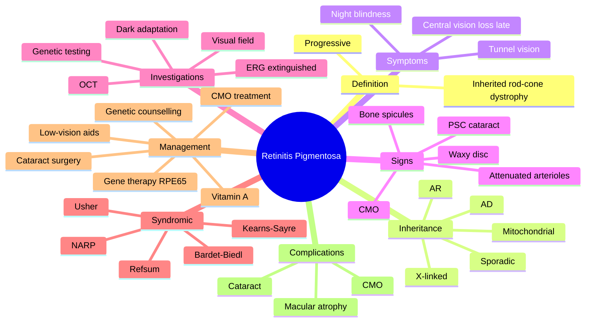

# Retinitis Pigmentosa

Related: [[Usher Syndrome]], [[ERG]]

> [!tip] **FCPS/MRCP Priority: MEDIUM**
> Inherited retinal dystrophy, bone-spicule pigmentation, waxy disc pallor, attenuated arterioles, night blindness, tunnel vision. ERG extinguished. No cure; voretigene neparvovec for RPE65.

---

## Learning Objectives
- [ ] Define retinitis pigmentosa as an inherited rod-cone dystrophy
- [ ] Describe the inheritance patterns and their prognostic implications
- [ ] Recognise the classic triad of symptoms (nyctalopia, tunnel vision, ↓VA late)
- [ ] Identify the pathognomonic fundus signs (bone spicules, waxy disc pallor, attenuated arterioles)
- [ ] Differentiate syndromic RP (Usher, Bardet-Biedl, Refsum, Kearns-Sayre, NARP)
- [ ] Interpret ERG findings
- [ ] Outline current management (gene therapy, supportive, low-vision aids)
- [ ] Provide genetic counselling and family planning advice

---

## 1. Definition / Epidemiology

### Definition
- **Retinitis pigmentosa (RP):** Inherited, progressive retinal degeneration affecting primarily rods (rod-cone dystrophy)
- Leads to progressive visual field loss, night blindness, eventually central vision

### Epidemiology
- Prevalence ~1 in 3,000–4,000
- Most common inherited retinal dystrophy
- Presents in childhood/adolescence (night blindness is earliest symptom)
- Can be isolated (non-syndromic) or part of a syndrome (syndromic)

---

## 2. Inheritance

- **Autosomal dominant (AD)** (25–30%) — best prognosis; e.g., RHO gene mutation
- **Autosomal recessive (AR)** (30–40%) — most common in consanguineous pedigrees; e.g., USH2A
- **X-linked** (5–15%) — worst prognosis, no male-to-male transmission; e.g., RPGR mutation
- **Sporadic / Simplex** (30–50%) — no family history; often AR
- **Digenic, mitochondrial** (rare)

---

## 3. Pathophysiology

- Progressive degeneration of rod photoreceptors (initially), then cone photoreceptors
- Mutations in >80 genes identified (RHO, RPGR, RPE65, USH2A, ABCA4, etc.)
- Primary rod death → loss of scotopic vision (night blindness, peripheral VF)
- Secondary cone death → central vision loss in advanced disease
- RPE dysfunction and intraretinal pigment migration → bone-spicule pigmentation

---

## 4. Clinical Features

### Symptoms
- **Night blindness (nyctalopia)** — earliest symptom, often in childhood
- **Progressive constriction of visual fields** (tunnel vision) — peripheral VF loss
- Central vision loss (late, when cones affected)
- Photophobia (in later cone involvement)
- Difficulty with dark adaptation
- Loss of colour discrimination (late)

### Signs (Fundus)
- **Bone-spicule pigmentation** in mid-periphery (classic)
- **Waxy pallor of optic disc**
- **Attenuated (narrow) retinal arterioles**
- Posterior subcapsular cataract (common, ~50%)
- Cystoid macular oedema (CMO)
- Vitreous cells (vitritis)
- Macular atrophy (advanced)

---

## 5. Investigations

- **ERG (electroretinogram):** Rod response severely reduced/extinguished; cone response reduced later
  - Scotopic (rod) ERG reduced first
  - Photopic (cone) ERG reduced in advanced disease
  - **"Extinguished ERG"** is classic for advanced RP
- **Visual field:** Ring scotoma progressing to tunnel vision
- **Dark adaptation:** Delayed, abnormal (elevated final threshold)
- **FFA, OCT:** CMO, atrophy, RPE changes
- **Genetic testing:** RHO, RPGR, RPE65, USH2A, ABCA4, EYS, and others (>80 genes)
- **Systemic workup:** Audiometry (Usher), renal USS (Bardet-Biedl), lipid profile, phytanic acid (Refsum), ECG (Kearns-Sayre)

---

## 6. Associations (Syndromic RP)

| Syndrome | Key features |
|----------|--------------|
| **Usher syndrome** | RP + sensorineural deafness (most common syndromic RP) |
| **Bardet-Biedl syndrome** | RP + obesity, polydactyly, hypogonadism, renal anomalies, learning difficulties |
| **Refsum disease** | RP + ichthyosis, peripheral neuropathy, cerebellar ataxia (phytanic acid accumulation) |
| **Abetalipoproteinaemia** | RP + ataxia, steatorrhoea, acanthocytosis (vitamin A deficiency) |
| **Kearns-Sayre syndrome** | RP + progressive external ophthalmoplegia (PEO), heart block (mitochondrial) |
| **NARP** | Neuropathy, Ataxia, RP (mitochondrial) |
| **Bassen-Kornzweig** | Abetalipoproteinaemia variant |
| **Laurence-Moon** | RP + obesity, hypogonadism, spastic paraplegia (no polydactyly) |
| **Alström syndrome** | RP + obesity, deafness, DM, cardiomyopathy |
| **Senior-Løken** | RP + nephronophthisis |

---

## 7. Management

### Specific
- **No cure** for most forms
- **Gene therapy:** **Voretigene neparvovec (Luxturna)** for RPE65 mutation (first FDA-approved gene therapy for an inherited disease; subretinal injection)
- **Vitamin A supplementation** (15,000 IU/day) — controversial; may slow progression in some
- **Docosahexaenoic acid (DHA)** — uncertain benefit
- Avoid vitamin E supplementation (may accelerate progression)

### Supportive
- **Cataract surgery** (vision improvement if PSC significant)
- **CMO:** Topical dorzolamide, oral acetazolamide, intravitreal steroid (dexamethasone implant)
- **Low-vision aids, rehabilitation, registration as visually impaired**
- **Genetic counselling** (family planning, recurrence risk)
- **Avoid smoking** (faster progression)
- **Vitamin A monitoring** (teratogenicity, hepatotoxicity)
- Sunglasses (UV protection, photophobia)
- **Argus II retinal prosthesis** (very limited, advanced disease)
- **Clinical trials** (stem cell, optogenetics, CRISPR)

---

## 8. Complications

- Cataract (PSC)
- CMO
- Vitreous abnormalities
- Optic disc drusen
- Refractive errors (myopia common)
- Coats-like exudative retinopathy
- Macular hole
- Psychological impact (depression, anxiety, social isolation)

---

## 9. FCPS/MRCP High-Yield Summary

| Topic | Key Points |
|-------|------------|
| Inheritance | AD, AR, X-linked, sporadic |
| Symptom | Night blindness, tunnel vision |
| Sign | Bone spicules, waxy disc, attenuated arterioles |
| ERG | Rod response extinguished |
| Treatment | None curative; gene therapy for RPE65; supportive |
| Syndromes | Usher, Bardet-Biedl, Refsum, Kearns-Sayre |

---

## 10. Viva Questions

1. **Q:** What is the earliest symptom of RP?
   **A:** Night blindness (nyctalopia).

2. **Q:** What is the inheritance pattern with worst prognosis?
   **A:** X-linked (most severe, earliest onset).

3. **Q:** What is the typical ERG finding in RP?
   **A:** Severely reduced or extinguished rod response; cone reduced later.

4. **Q:** What is the classic triad of fundus signs?
   **A:** Bone-spicule pigmentation, waxy disc pallor, attenuated arterioles.

5. **Q:** What gene therapy is available for RP?
   **A:** Voretigene neparvovec (Luxturna) for RPE65 mutation (Leber congenital amaurosis type 2 and severe early-onset RP).

---

## 11. Common Confusions / Exam Traps

| Confusion | Clarification |
|-----------|---------------|
| "RP affects cones first" | RP is a **rod-cone dystrophy** — rods affected first (night blindness is the earliest symptom) |
| "All RP patients are blind by 30" | Progression varies; AD has best prognosis; X-linked worst |
| "Bone spicules = retinitis" | Bone spicules are pathognomonic of RP but can occur in other retinal degenerations (e.g., syphilis, congenital rubella — "pseudo-RP") |
| "Vitamin A cures RP" | Vitamin A may slow progression in some; **not curative**; high doses can be teratogenic and hepatotoxic |
| "Usher syndrome = deafness only" | Usher = RP + sensorineural deafness; three types (I, II, III) with varying severity |
| "ERG is normal in early RP" | ERG is **abnormal early** (often before symptoms); extinguished in advanced disease |
| "RP and Leber congenital amaurosis (LCA) are the same" | LCA is severe early-onset retinal dystrophy (often congenital); RP is later onset and progressive |
| "Genetic testing is not useful" | Genetic testing is critical — guides prognosis, family planning, and **voretigene neparvovec eligibility (RPE65)** |

---

## 12. Mnemonics

1. **"BWA"** — **B**one spicules, **W**axy disc, **A**ttenuated arterioles (classic RP triad)
2. **"NTV"** — **N**yctalopia, **T**unnel vision, **V**ision loss (late central) — RP symptom progression
3. **"Rods first, cones later"** — rod-cone dystrophy
4. **"X-linked = worst"** — X-linked RP has the worst prognosis
5. **"Usher = U hear"** — Usher syndrome = RP + hearing loss (sensorineural)

---

## 13. Mind Map

---

## One-Page Revision Card

| **Topic** | **Retinitis Pigmentosa** |
|-----------|--------------------------|
| **Definition** | Inherited rod-cone dystrophy |
| **Inheritance** | AD, AR, X-linked, sporadic |
| **Earliest symptom** | Night blindness (nyctalopia) |
| **Classic signs (BWA)** | Bone spicules, Waxy disc, Attenuated arterioles |
| **ERG** | Rod response extinguished |
| **Worst prognosis** | X-linked |
| **Gene therapy** | Voretigene neparvovec (Luxturna) for RPE65 |
| **Most common syndrome** | Usher (RP + sensorineural deafness) |
| **Viva Pearl** | "BWA" fundus + nyctalopia = RP |

---

## Spaced Repetition Trackers

### 24-Hour Recall Prompts
- [ ] State the classic triad of RP signs (BWA)
- [ ] List the 4 inheritance patterns of RP
- [ ] Identify the worst-prognosis inheritance pattern
- [ ] Describe the ERG findings in RP
- [ ] Name 3 syndromes associated with RP
- [ ] State the gene therapy for RPE65 mutation
- [ ] Explain why genetic counselling is important in RP
- [ ] Differentiate RP from cone-rod dystrophy

### Revision Schedule
- [ ] **Day 1** completed (creation + 24h recall)
- [ ] **Day 3** revision completed
- [ ] **Day 7** revision completed
- [ ] **Day 15** revision completed
- [ ] **Day 30** revision completed
- [ ] **Day 90** revision completed

---

## Must Know / Should Know / Nice to Know

### Must Know (Core for passing)
- [x] Definition: inherited rod-cone dystrophy
- [x] Classic triad of signs: bone spicules, waxy disc, attenuated arterioles
- [x] Earliest symptom: night blindness (nyctalopia)
- [x] Inheritance patterns and prognosis
- [x] ERG findings (extinguished)
- [x] Most common syndrome: Usher

### Should Know (High probability)
- [x] X-linked = worst prognosis
- [x] Voretigene neparvovec (Luxturna) for RPE65
- [x] Other syndromes (Bardet-Biedl, Refsum, Kearns-Sayre)
- [x] Complications (CMO, PSC cataract)
- [x] Management (cataract surgery, low-vision aids, genetic counselling)
- [x] Vitamin A supplementation (controversial)

### Nice to Know (Differentiator)
- [ ] Specific gene mutations (RHO, RPGR, USH2A, ABCA4, EYS)
- [ ] Argus II retinal prosthesis
- [ ] Clinical trials (stem cell, optogenetics, CRISPR)
- [ ] Leber congenital amaurosis (LCA) vs RP
- [ ] Pseudo-RP (syphilis, congenital rubella)
- [ ] Autosomal recessive RP and consanguinity

---

## My Weak Points
- [ ] Add personal weak areas here

---

## Self-Test Scorecard

| Section | Score /5 |
|---------|----------|
| Understanding: | /10 |
| Recall: | /10 |
| MCQ Performance: | /10 |
| SBA Performance: | /10 |
| Viva Confidence: | /10 |
| Total: | /50 |

> [!tip] **Interpretation:** <35 = weak topic, 35-44 = acceptable but insecure, 45+ = strong exam-ready topic.

---

## Exam Answer Modes

### Long Answer Skeleton
1. Definition (inherited rod-cone dystrophy; progressive)
2. Epidemiology (~1 in 3,000–4,000; most common inherited retinal dystrophy)
3. Inheritance (AD, AR, X-linked, sporadic; X-linked worst prognosis)
4. Pathophysiology (rods affected first → cones later; >80 genes)
5. Symptoms (nyctalopia, tunnel vision, ↓VA late, photophobia)
6. Signs (BWA: bone spicules, waxy disc, attenuated arterioles; PSC cataract; CMO)
7. Investigations (ERG, VF, dark adaptation, OCT, genetic testing, systemic for syndromes)
8. Syndromic associations (Usher, Bardet-Biedl, Refsum, Kearns-Sayre, NARP)
9. Management (gene therapy for RPE65, vitamin A, cataract surgery, low-vision, genetic counselling)
10. Complications (CMO, PSC, macular atrophy)

### Short Note Skeleton
- Definition + inheritance
- Triad of signs (BWA)
- ERG finding (extinguished)
- Most common syndrome (Usher)
- Treatment (gene therapy for RPE65; supportive)

### Viva One-Liners
- **Q:** Earliest symptom of RP? → **A:** Night blindness
- **Q:** Classic fundus signs? → **A:** Bone spicules, waxy disc, attenuated arterioles (BWA)
- **Q:** Worst-prognosis inheritance? → **A:** X-linked
- **Q:** ERG finding? → **A:** Extinguished rod response
- **Q:** Gene therapy available? → **A:** Voretigene neparvovec (Luxturna) for RPE65 mutation
- **Q:** Most common syndromic RP? → **A:** Usher syndrome (RP + sensorineural deafness)

### Ward-Case Discussion Points
- Triadic history taking: night blindness, VF loss, central vision
- Recognising classic fundus signs
- Inheritance counselling and family planning
- Audiometry referral (Usher screening)
- Cataract surgery indications in RP
- Low-vision aid services and registration
- Smoking cessation advice
- Genetic testing pathways
- Newer therapies (gene therapy, clinical trials)

### Last-Night-Before-Exam Sheet
- **Top 3 facts:** Rod-cone dystrophy; BWA signs; nyctalopia is earliest
- **Mnemonic:** "BWA" (Bone, Waxy disc, Attenuated arterioles); "Rods first, cones later"
- **Worst prognosis:** X-linked
- **Most common syndrome:** Usher
- **Gene therapy:** Voretigene neparvovec (RPE65)
- **ERG:** Extinguished rod response

---

## Summary

RP is an inherited rod-cone dystrophy. Symptoms: nyctalopia, tunnel vision, late central vision loss. Signs: bone spicules, waxy disc pallor, attenuated arterioles. ERG: extinguished rod response. Inheritance: AD (best prognosis), AR, X-linked (worst prognosis), sporadic. No cure; gene therapy (voretigene neparvovec) for RPE65 mutation; supportive care (cataract surgery, CMO treatment, low-vision aids, genetic counselling). Most common syndromic RP: Usher (RP + sensorineural deafness). Other syndromes: Bardet-Biedl, Refsum, Kearns-Sayre, NARP.

## MCQs (10)

1. **Question:** Most common inheritance in RP is:
   **Options:** A. AD B. AR C. X-linked D. Sporadic E. Mitochondrial
   **Answer:** B
   **Explanation:** AR accounts for 30–40% (most common, especially with consanguinity); sporadic ~30–50%.

2. **Question:** Bone-spicule pigmentation in RP is in:
   **Options:** A. Macula B. Mid-periphery C. Far periphery D. Around disc E. None
   **Answer:** B
   **Explanation:** Bone spicules are classically in the mid-periphery.

3. **Question:** The earliest symptom of RP is:
   **Options:** A. Loss of central vision B. Photophobia C. Night blindness (nyctalopia) D. Floaters E. Pain
   **Answer:** C
   **Explanation:** Rods affected first → nyctalopia is the earliest symptom.

4. **Question:** The classic ERG finding in RP is:
   **Options:** A. Normal B. Increased amplitude C. Extinguished rod response D. Reduced cone response only E. Increased latency only
   **Answer:** C
   **Explanation:** Rod response is severely reduced or extinguished.

5. **Question:** The inheritance pattern of RP with the worst prognosis is:
   **Options:** A. AD B. AR C. X-linked D. Sporadic E. Mitochondrial
   **Answer:** C
   **Explanation:** X-linked RP has the worst prognosis (earliest onset, most severe).

6. **Question:** Which syndrome is most commonly associated with RP?
   **Options:** A. Down syndrome B. Usher syndrome C. Turner syndrome D. Marfan syndrome E. Ehlers-Danlos
   **Answer:** B
   **Explanation:** Usher = RP + sensorineural deafness (most common syndromic RP).

7. **Question:** Voretigene neparvovec (Luxturna) is a gene therapy for:
   **Options:** A. RHO mutation B. RPGR mutation C. RPE65 mutation D. USH2A mutation E. ABCA4 mutation
   **Answer:** C
   **Explanation:** Luxturna is approved for RPE65 mutation (LCA2 and severe early-onset RP).

8. **Question:** RP primarily affects which photoreceptor first?
   **Options:** A. Cones B. Rods C. Ganglion cells D. Bipolar cells E. RPE
   **Answer:** B
   **Explanation:** RP is a rod-cone dystrophy — rods affected first, cones later.

9. **Question:** A patient with RP develops CMO. First-line treatment is:
   **Options:** A. PRP B. Topical dorzolamide or oral acetazolamide C. Vitrectomy D. Scleral buckle E. Anti-VEGF
   **Answer:** B
   **Explanation:** Carbonic anhydrase inhibitors (topical dorzolamide or oral acetazolamide) are first-line for RP-related CMO.

10. **Question:** RP is associated with which ocular complication?
    **Options:** A. Acute angle-closure glaucoma B. Posterior subcapsular cataract C. Keratoconus D. Optic neuritis E. Scleritis
    **Answer:** B
    **Explanation:** Posterior subcapsular cataract is common in RP (and may benefit from surgery).

## SBA Questions (10)

1. **Scenario:** A 25-year-old man presents with progressive night blindness and tunnel vision. Fundus shows bone-spicule pigmentation, waxy disc pallor, and attenuated arterioles. ERG is extinguished.
   **Question:** Most likely diagnosis?
   **Options:** A. Cone-rod dystrophy B. Retinitis pigmentosa C. Choroideraemia D. Leber congenital amaurosis E. Stargardt disease
   **Answer:** B
   **Explanation:** Classic triad (BWA) + nyctalopia + extinguished ERG = RP.

2. **Scenario:** A 12-year-old with RP also has sensorineural deafness. Audiometry confirms severe bilateral hearing loss.
   **Question:** Most likely syndrome?
   **Options:** A. Bardet-Biedl B. Usher C. Refsum D. Kearns-Sayre E. Alström
   **Answer:** B
   **Explanation:** RP + sensorineural deafness = Usher syndrome.

3. **Scenario:** A patient with RP has genetic testing that reveals a homozygous RPE65 mutation.
   **Question:** Which therapy is most appropriate?
   **Options:** A. Vitamin A supplementation B. Observation only C. Voretigene neparvovec (Luxturna) subretinal gene therapy D. Argus II retinal prosthesis E. Stem cell transplant
   **Answer:** C
   **Explanation:** Voretigene neparvovec is approved for RPE65 mutation.

4. **Scenario:** A 30-year-old with RP has bilateral PSC cataracts causing significant visual impairment. What is the management?
   **Options:** A. Observe B. Cataract surgery C. Vitrectomy D. Retinal detachment repair E. Steroid injection
   **Answer:** B
   **Explanation:** Cataract surgery improves vision in RP patients with PSC.

5. **Scenario:** A patient with RP develops CMO. What is the first-line treatment?
   **Options:** A. Anti-VEGF B. Topical dorzolamide or oral acetazolamide C. Steroid injection D. Vitrectomy E. PRP
   **Answer:** B
   **Explanation:** Carbonic anhydrase inhibitors (topical or oral) are first-line for RP-related CMO.

6. **Scenario:** A patient with RP and family history has a brother affected. Genetic testing reveals X-linked inheritance (RPGR mutation).
   **Question:** What is the recurrence risk for the patient's daughter?
   **Options:** A. 0% (males don't pass X to sons) B. 50% (carrier daughter) C. 100% (affected) D. 25% E. 75%
   **Answer:** B
   **Explanation:** X-linked RP — daughters are obligate carriers (50%); sons of carrier mothers have 50% risk.

7. **Scenario:** A patient with RP has ichthyosis, peripheral neuropathy, and ataxia. Plasma phytanic acid is markedly elevated.
   **Question:** Most likely syndrome?
   **Options:** A. Usher B. Bardet-Biedl C. Refsum D. Kearns-Sayre E. NARP
   **Answer:** C
   **Explanation:** Refsum disease = RP + ichthyosis + neuropathy + ataxia + ↑phytanic acid.

8. **Scenario:** A 20-year-old with RP has obesity, polydactyly, and renal anomalies.
   **Question:** Most likely syndrome?
   **Options:** A. Usher B. Bardet-Biedl C. Refsum D. Kearns-Sayre E. Alström
   **Answer:** B
   **Explanation:** Bardet-Biedl = RP + obesity + polydactyly + hypogonadism + renal anomalies.

9. **Scenario:** A 25-year-old with RP has progressive external ophthalmoplegia (PEO) and is found to have a heart block on ECG.
   **Question:** Most likely syndrome?
   **Options:** A. Usher B. Bardet-Biedl C. Refsum D. Kearns-Sayre E. NARP
   **Answer:** D
   **Explanation:** Kearns-Sayre = RP + PEO + heart block (mitochondrial).

10. **Scenario:** A 30-year-old with RP wants to know if she should have children. Her family history is consistent with autosomal dominant inheritance.
    **Question:** What is the recurrence risk?
    **Options:** A. 0% B. 25% C. 50% D. 75% E. 100%
    **Answer:** C
    **Explanation:** Autosomal dominant inheritance → 50% risk of passing the gene to offspring.

## Flashcards

- **Q:** What is the classic triad of RP fundus signs?
  **A:** Bone-spicule pigmentation, waxy disc pallor, attenuated arterioles (BWA).
- **Q:** What is the earliest symptom of RP?
  **A:** Night blindness (nyctalopia).
- **Q:** What is the inheritance pattern with the worst prognosis?
  **A:** X-linked.
- **Q:** What gene therapy is available for RP?
  **A:** Voretigene neparvovec (Luxturna) for RPE65 mutation.
- **Q:** What is the most common syndromic RP?
  **A:** Usher syndrome (RP + sensorineural deafness).

## Answer Key with Explanations

### MCQs
1. B — AR is the most common inheritance pattern
2. B — Bone spicules are in the mid-periphery
3. C — Nyctalopia is the earliest symptom
4. C — Extinguished rod response on ERG
5. C — X-linked has the worst prognosis
6. B — Usher = RP + sensorineural deafness
7. C — Voretigene neparvovec is for RPE65
8. B — Rods are affected first
9. B — CA inhibitors (topical or oral) for RP-related CMO
10. B — PSC cataract is a common complication

### SBAs
1. B — BWA + nyctalopia + extinguished ERG = RP
2. B — RP + sensorineural deafness = Usher
3. C — Voretigene neparvovec for RPE65 mutation
4. B — Cataract surgery for visually significant PSC
5. B — CA inhibitors first-line for RP-related CMO
6. B — X-linked: daughters are obligate carriers
7. C — RP + ichthyosis + ↑phytanic acid = Refsum
8. B — RP + obesity + polydactyly = Bardet-Biedl
9. D — RP + PEO + heart block = Kearns-Sayre
10. C — AD inheritance = 50% recurrence risk

## Tags
#medicine #davidson #ophthalmology #RP #retina #fcps #mrcp
