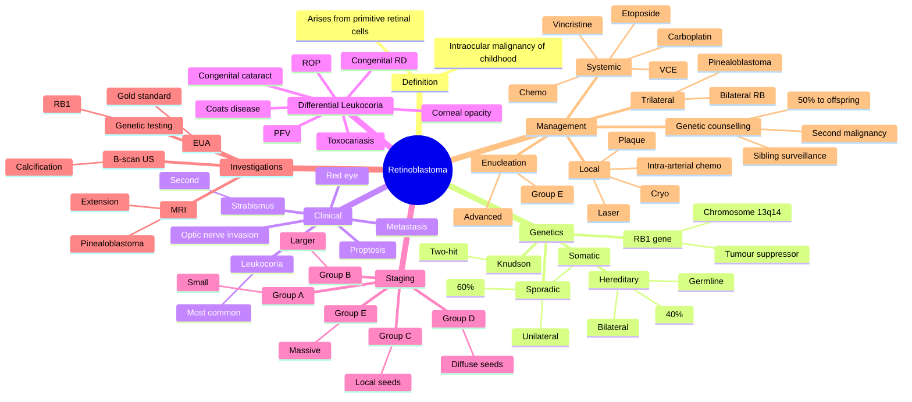

# Retinoblastoma

Related: [[Congenital Cataract]], [[Leukocoria]], [[RB1 Gene]]

> [!tip] **FCPS/MRCP Priority: HIGH**
> Most common primary intraocular malignancy in children. Leukocoria + strabismus. RB1 gene. Chemotherapy, laser, cryo, enucleation. Genetic counselling.

---

## Learning Objectives
- [ ] Define retinoblastoma and recognise its epidemiology
- [ ] Describe Knudson's two-hit hypothesis and RB1 genetics
- [ ] Identify clinical features (leukocoria, strabismus, masquerade signs)
- [ ] List the differential diagnosis of leukocoria
- [ ] Apply the International Classification (Groups A–E)
- [ ] Plan investigations (EUA, B-scan, MRI, genetics)
- [ ] Select appropriate management (local, systemic, enucleation)
- [ ] Discuss genetic counselling and surveillance for second malignancies

---

## 1. Definition

- **Retinoblastoma:** Malignant tumour of the retina, arising from primitive retinal cells
- Most common primary intraocular malignancy of childhood
- ~1:17,000 live births

---

## 2. Genetics

- **RB1 gene** (chromosome 13q14) — tumour suppressor
- **Two-hit hypothesis** (Knudson)
- **Hereditary (40%):** Germline mutation, bilateral, multifocal, earlier onset
- **Sporadic (60%):** Somatic, unilateral, later onset
- Increased risk of second primary malignancy (osteosarcoma) in hereditary

---

## 3. Clinical Features

### Classic
- **Leukocoria** (white pupillary reflex) — most common
- **Strabismus** (second most common)
- Red eye, inflammation (mimics endophthalmitis — masquerade)
- ↓VA
- Orbital inflammation (advanced)

### Late
- Proptosis
- Optic nerve invasion → intracranial extension
- Metastasis (CNS, bone marrow)

### Age
- Most diagnosed <3 years (bilateral earlier)
- Rare after 5 years

---

## 4. Differential of Leukocoria

- Retinoblastoma
- Congenital cataract
- Persistent fetal vasculature (PFV)
- Coats disease
- ROP
- Toxocariasis
- Retinal detachment (congenital)
- PHPV
- Corneal opacity (Peter's anomaly)

---

## 5. Staging (International Classification)

- **Group A:** ≤3 mm, away from fovea, no seeding
- **Group B:** >3 mm, or foveal, or juxta-papillary, with subretinal fluid
- **Group C:** Local subretinal/vitreous seeds
- **Group D:** Diffuse subretinal/vitreous seeds
- **Group E:** Massive (no visual potential, neovascular glaucoma, opaque media)

---

## 6. Investigations

- **Examination under anaesthesia (EUA)** — gold standard
- Dilated fundus
- B-scan US (calcification — highly reflective)
- MRI (extension, optic nerve, pinealoblastoma in trilateral)
- Genetic testing (RB1 mutation)
- LP / bone marrow (metastatic workup if advanced)

---

## 7. Management

### Local (small, peripheral)
- **Laser photocoagulation**
- **Cryotherapy**
- **Plaque brachytherapy** (local radiation)
- **Intravitreal / intra-arterial chemotherapy** (selected)

### Systemic / Advanced
- **Systemic chemotherapy** (vincristine, carboplatin, etoposide) — for bilateral, vitreous seeds
- **Enucleation** (extensive, no visual potential)
- ± Adjuvant chemo, RT (extraocular spread)

### Trilateral Retinoblastoma
- Bilateral RB + pinealoblastoma
- Poor prognosis

### Genetic Counselling
- Hereditary: 50% risk to offspring
- Surveillance for siblings, offspring
- Surveillance for second primary malignancy

---

## 8. FCPS/MRCP High-Yield Summary

| Topic | Key Points |
|-------|------------|
| Most common | Intraocular malignancy of childhood |
| Gene | RB1 (13q14) |
| Knudson | Two-hit |
| Sign | Leukocoria, strabismus |
| Differential | Congenital cataract, Coats, PFV, ROP |
| Treatment | Laser/cryo/chemo (small) → enucleation (large) |
| Second malignancy | Osteosarcoma in hereditary |

---

## 9. Viva Questions

1. **Q:** What is the most common presenting feature of retinoblastoma?
   **A:** Leukocoria (white pupillary reflex).

2. **Q:** What is the gene and Knudson two-hit?
   **A:** RB1 (13q14); two hits required — germline + somatic in hereditary, two somatic in sporadic.

3. **Q:** What is trilateral retinoblastoma?
   **A:** Bilateral retinoblastoma + pinealoblastoma.

4. **Q:** What is the most common second primary malignancy in hereditary retinoblastoma?
   **A:** Osteosarcoma.

5. **Q:** How is retinoblastoma staged/classified?
   **A:** International Classification (Groups A–E), based on size, location, and seeding.

---

## 10. Common Confusions / Exam Traps

| Confusion | Clarification |
|-----------|---------------|
| "Retinoblastoma is always bilateral" | 60% are sporadic and unilateral; 40% hereditary (often bilateral) |
| "RB1 is an oncogene" | RB1 is a **tumour suppressor** gene; loss of function causes RB |
| "Trilateral RB = 3 eyes" | Trilateral = bilateral RB + pinealoblastoma (3 tumours: 2 eyes + 1 pineal) |
| "B-scan is diagnostic" | B-scan shows calcification (highly suggestive) but EUA + clinical + MRI confirm diagnosis |
| "Enucleation is the first-line" | Enucleation is for advanced disease (Group E); small tumours are treated with laser/cryo/chemo |
| "Strabismus is always benign" | New-onset strabismus in a child <3 y must be examined for leukocoria to exclude RB |

---

## 11. Mnemonics

1. **"Leukocoria Leads"** — most common presenting sign of retinoblastoma
2. **"RB1 = 13q14"** — chromosome 13, long arm, band 14; tumour suppressor
3. **"Hereditary = Hit, Sporadic = Two Somatic Hits"** — Knudson's two-hit hypothesis
4. **"Strabismus in a Small child = Serious"** — always rule out leukocoria/RB
5. **"Osteosarcoma Over the Years"** — second primary malignancy in hereditary RB

---

## 12. Mind Map

---

## 13. One-Page Revision Card

| **Topic** | **Retinoblastoma** |
|-----------|---------------------|
| **Definition** | Most common primary intraocular malignancy of childhood |
| **Genetics** | RB1 gene (13q14), tumour suppressor; Knudson two-hit |
| **Hereditary (40%)** | Germline, bilateral, earlier onset, 50% to offspring |
| **Sporadic (60%)** | Somatic, unilateral, later onset |
| **Most common sign** | Leukocoria (white pupillary reflex) |
| **Second sign** | Strabismus |
| **Differential leukocoria** | Congenital cataract, Coats, PFV, ROP, toxocariasis |
| **Investigation** | EUA (gold standard), B-scan (calcification), MRI, RB1 testing |
| **Staging** | International Classification A–E |
| **Treatment** | Local (laser/cryo/plaque) for small; chemo for bilateral/seeds; enucleation for Group E |
| **Trilateral RB** | Bilateral RB + pinealoblastoma |
| **Second malignancy** | Osteosarcoma in hereditary RB |
| **Viva Pearl** | "Leukocoria Leads" — must exclude RB in any child with white reflex |

---

## Spaced Repetition Trackers

### 24-Hour Recall Prompts
- [ ] Define retinoblastoma
- [ ] Identify the gene and chromosome (RB1, 13q14)
- [ ] State the most common presenting sign
- [ ] List 3 differentials for leukocoria
- [ ] Outline management based on group
- [ ] Define trilateral retinoblastoma
- [ ] Identify the most common second primary malignancy

### Revision Schedule
- [ ] **Day 1** completed (creation + 24h recall)
- [ ] **Day 3** revision completed
- [ ] **Day 7** revision completed
- [ ] **Day 15** revision completed
- [ ] **Day 30** revision completed
- [ ] **Day 90** revision completed

---

## Must Know / Should Know / Nice to Know

### Must Know (Core for passing)
- [x] Most common intraocular malignancy of childhood
- [x] RB1 gene (13q14) — tumour suppressor
- [x] Knudson two-hit hypothesis
- [x] Leukocoria as the most common presenting sign
- [x] Differential of leukocoria (cataract, Coats, PFV, ROP, toxocariasis)
- [x] Calcification on B-scan
- [x] Enucleation for advanced disease
- [x] Trilateral retinoblastoma = bilateral RB + pinealoblastoma
- [x] Genetic counselling (50% to offspring in hereditary)
- [x] Second malignancy (osteosarcoma)

### Should Know (High probability)
- [x] International Classification A–E
- [x] Chemotherapy agents (VCE: vincristine, carboplatin, etoposide)
- [x] Local treatments (laser, cryo, plaque, intra-arterial chemo)
- [x] Masquerade presentation (mimics endophthalmitis)
- [x] Hereditary (40%) vs sporadic (60%)
- [x] Age of onset (most <3 years, bilateral earlier)

### Nice to Know (Differentiator)
- [ ] RB1 protein (pRb) and E2F pathway
- [ ] 13q14 deletion syndrome features
- [ ] Intravitreal melphalan for vitreous seeds
- [ ] ICRB vs IRSS staging
- [ ] Long-term follow-up protocol (lifelong)

---

## My Weak Points
- [ ] Add personal weak areas here

---

## Self-Test Scorecard

| Section | Score /5 |
|---------|----------|
| Understanding: | /10 |
| Recall: | /10 |
| MCQ Performance: | /10 |
| SBA Performance: | /10 |
| Viva Confidence: | /10 |
| **Total:** | /50 |

> [!tip] **Interpretation:** <35 = weak topic, 35-44 = acceptable but insecure, 45+ = strong exam-ready topic.

---

## Exam Answer Modes

### Long Answer Skeleton
1. Definition (most common primary intraocular malignancy of childhood, ~1:17,000)
2. Genetics (RB1 gene, 13q14, tumour suppressor, Knudson two-hit)
3. Hereditary vs sporadic (40% germline, bilateral; 60% somatic, unilateral)
4. Clinical features (leukocoria, strabismus, masquerade, proptosis late)
5. Differential of leukocoria (cataract, Coats, PFV, ROP, toxocariasis)
6. Investigations (EUA, B-scan calcification, MRI, RB1 testing)
7. Staging (International Classification A–E)
8. Management (local: laser/cryo/plaque; chemo for bilateral/seeds; enucleation for Group E)
9. Trilateral RB (bilateral + pinealoblastoma)
10. Genetic counselling and second malignancy (osteosarcoma)

### Short Note Skeleton
- Definition + RB1 gene + Knudson two-hit
- Most common sign = leukocoria
- Differential of leukocoria
- B-scan shows calcification
- Management principles

### Viva One-Liners
- **Q:** Most common presenting sign? → **A:** Leukocoria
- **Q:** Gene and chromosome? → **A:** RB1, chromosome 13q14
- **Q:** What is Knudson's two-hit hypothesis? → **A:** Two hits required to inactivate both alleles of a tumour suppressor; germline + somatic in hereditary, two somatic in sporadic
- **Q:** What is trilateral RB? → **A:** Bilateral RB + pinealoblastoma
- **Q:** Most common second malignancy in hereditary RB? → **A:** Osteosarcoma
- **Q:** When is enucleation indicated? → **A:** Group E (massive, no visual potential) or unilateral advanced disease

### Ward-Case Discussion Points
- Red reflex examination in every child
- EUA for diagnosis and staging
- Multi-disciplinary care (paediatric oncology, ophthalmology, genetics)
- Genetic counselling for the family
- Lifelong surveillance for second malignancy in hereditary cases

### Last-Night-Before-Exam Sheet
- Top 3 facts: RB1, leukocoria, calcification on B-scan
- 1 mnemonic: "Leukocoria Leads"
- Must-know differential: cataract, Coats, PFV, ROP, toxocariasis
- Trilateral RB = bilateral + pinealoblastoma
- 50% to offspring in hereditary RB
- Osteosarcoma = second malignancy

---

## Summary

Retinoblastoma is the most common intraocular malignancy of childhood, due to RB1 mutations. Leukocoria and strabismus are the main presenting signs. Management is multidisciplinary, with local treatment (laser, cryo, plaque) for early disease, chemotherapy for bilateral/vitreous seeding, and enucleation for advanced. Genetic counselling is essential.

---

## MCQs (10)

1. **Question:** The most common presenting feature of retinoblastoma is:
   **Options:** A. Red eye B. Leukocoria (white pupillary reflex) C. Pain D. Diplopia E. Proptosis
   **Answer:** B
   **Explanation:** Leukocoria is the most common presenting sign, often noticed on flash photography or red reflex testing.

2. **Question:** The retinoblastoma gene is:
   **Options:** A. TP53 B. RB1 (chromosome 13q14) C. NF1 D. BRCA1 E. APC
   **Answer:** B
   **Explanation:** RB1, located on chromosome 13q14, is a tumour suppressor gene whose loss of function causes retinoblastoma.

3. **Question:** A calcified intraocular mass in a child is most likely:
   **Options:** A. Coats disease B. Persistent fetal vasculature (PHPV) C. Retinoblastoma D. Retinopathy of prematurity E. Toxocara granuloma
   **Answer:** C
   **Explanation:** Calcification is the hallmark of retinoblastoma on B-scan US; Coats disease and PFV typically do not calcify.

4. **Question:** Trilateral retinoblastoma refers to:
   **Options:** A. Three retinoblastomas in one eye B. Bilateral retinoblastoma plus pinealoblastoma C. Bilateral retinoblastoma with optic nerve invasion D. Retinoblastoma with vitreous seeding E. Retinoblastoma with retinal detachment
   **Answer:** B
   **Explanation:** Trilateral RB is bilateral ocular retinoblastoma with a pinealoblastoma (intracranial primitive neuroectodermal tumour).

5. **Question:** The most common second primary malignancy in hereditary retinoblastoma is:
   **Options:** A. Breast cancer B. Lung cancer C. Osteosarcoma D. Melanoma E. Leukaemia
   **Answer:** C
   **Explanation:** Patients with hereditary RB (germline RB1 mutation) have a markedly increased risk of osteosarcoma and other sarcomas.

6. **Question:** According to Knudson's two-hit hypothesis, hereditary retinoblastoma requires:
   **Options:** A. One somatic hit on one allele B. Two somatic hits on the same allele C. A germline hit (inherited) plus a somatic hit (acquired) on the remaining allele D. A dominantly acting oncogene E. Loss of both p53 alleles
   **Answer:** C
   **Explanation:** Hereditary RB patients inherit a germline RB1 mutation (first hit) and acquire a second somatic mutation in the remaining allele (second hit) — explaining earlier onset and bilaterality.

7. **Question:** The International Classification Group E retinoblastoma is described as:
   **Options:** A. Small tumour, away from fovea B. Local subretinal/vitreous seeds C. Diffuse subretinal/vitreous seeds D. Massive tumour with no visual potential (often requiring enucleation) E. Bilateral disease
   **Answer:** D
   **Explanation:** Group E = massive, often with neovascular glaucoma, opaque media, or invasion of the anterior segment — usually enucleation.

8. **Question:** In hereditary retinoblastoma, the risk to offspring of an affected survivor is approximately:
   **Options:** A. 0% B. 5% C. 25% D. 50% E. 100%
   **Answer:** D
   **Explanation:** Hereditary RB is autosomal dominant with 50% transmission; genetic counselling and prenatal testing are recommended.

9. **Question:** Which of the following is a differential diagnosis of leukocoria?
   **Options:** A. Retinoblastoma B. Congenital cataract C. Coats disease D. Persistent fetal vasculature E. All of the above
   **Answer:** E
   **Explanation:** All listed conditions can present with leukocoria. ROP and toxocariasis are other differentials.

10. **Question:** The chemotherapy regimen commonly used for systemic treatment of bilateral retinoblastoma with vitreous seeds is:
    **Options:** A. VCE (vincristine, carboplatin, etoposide) B. CHOP (cyclophosphamide, doxorubicin, vincristine, prednisolone) C. ABVD D. MOPP E. FOLFOX
    **Answer:** A
    **Explanation:** VCE (vincristine, carboplatin, etoposide) is the standard systemic chemotherapy regimen for bilateral RB with vitreous/subretinal seeds, often combined with local therapy.

---

## SBA Questions (10)

1. **Scenario:** A 2-year-old child is brought in by the parents who noticed a "white reflex" in flash photographs. Examination under anaesthesia (EUA) reveals a yellow-white intraocular mass with calcification on B-scan.
   **Question:** Most likely diagnosis?
   **Options:** A. Congenital cataract B. Coats disease C. Retinoblastoma D. ROP E. None
   **Answer:** C
   **Explanation:** Leukocoria + calcified intraocular mass in a young child = retinoblastoma until proven otherwise.

2. **Scenario:** A 4-year-old with unilateral retinoblastoma has an affected parent who also had bilateral disease. Genetic testing reveals a germline RB1 mutation.
   **Question:** What is the risk to the patient's future offspring?
   **Options:** A. 0% B. 5% C. 25% D. 50% E. 100%
   **Answer:** D
   **Explanation:** Germline RB1 mutation is autosomal dominant; offspring have a 50% risk of inheriting the mutation.

3. **Scenario:** A 1-year-old child with bilateral leukocoria is diagnosed with Group D retinoblastoma in both eyes, with extensive vitreous seeding. There is no extraocular spread.
   **Question:** Most appropriate first-line management?
   **Options:** A. Bilateral enucleation B. Systemic chemotherapy (VCE) with focal consolidation (laser/cryo) C. Topical steroid only D. Panretinal photocoagulation E. Observation
   **Answer:** B
   **Explanation:** Bilateral Group D RB is treated with systemic chemotherapy (VCE) plus focal consolidation (laser/cryo ± intra-arterial/intravitreal chemo). Enucleation reserved for eyes with no visual potential.

4. **Scenario:** A child with retinoblastoma has MRI showing bilateral ocular masses plus a mass in the pineal region.
   **Question:** What is the diagnosis?
   **Options:** A. Metastasis B. Trilateral retinoblastoma C. Pineal cyst D. Pineal germinoma E. None
   **Answer:** B
   **Explanation:** Bilateral RB + pinealoblastoma = trilateral retinoblastoma, which carries a poor prognosis.

5. **Scenario:** A 3-year-old with unilateral Group E retinoblastoma has a painful red eye with neovascular glaucoma and no light perception.
   **Question:** Most appropriate management?
   **Options:** A. Laser photocoagulation B. Enucleation with long optic nerve stump C. Topical steroid D. Topical antibiotic E. Observation
   **Answer:** B
   **Explanation:** Group E with no visual potential = primary enucleation with a long optic nerve stump for histopathology to assess invasion.

6. **Scenario:** A child previously treated for hereditary retinoblastoma presents 8 years later with leg pain. X-ray shows a sclerotic lesion of the distal femur.
   **Question:** Most likely diagnosis?
   **Options:** A. Osteosarcoma (second primary malignancy) B. Osteomyelitis C. Stress fracture D. Bone cyst E. Metastasis from RB
   **Answer:** A
   **Explanation:** Hereditary RB survivors have a high risk of osteosarcoma, often in the second decade.

7. **Scenario:** A child presents with strabismus and leukocoria. EUA shows a 4-mm tumour anterior to the equator, no seeding. The fellow eye is normal.
   **Options:** A. Observation only B. Laser photocoagulation or cryotherapy to the tumour C. Panretinal photocoagulation D. Topical steroid E. Enucleation
   **Answer:** B
   **Explanation:** Small, peripheral Group A tumour = focal treatment (laser or cryotherapy) to preserve the eye and vision.

8. **Scenario:** A child is brought in with red eye, inflammation, and leukocoria. There is no history of trauma or infection. The parents are concerned about "endophthalmitis".
   **Question:** What is the most likely diagnosis?
   **Options:** A. Endophthalmitis B. Retinoblastoma masquerade C. Uveitis D. Conjunctivitis E. Scleritis
   **Answer:** B
   **Explanation:** Retinoblastoma can present with inflammation mimicking endophthalmitis (masquerade syndrome). Always perform EUA + B-scan.

9. **Scenario:** A newborn sibling of a child with hereditary retinoblastoma is screened. Genetic testing confirms an RB1 germline mutation but no tumour is seen on EUA.
   **Question:** Most appropriate next step?
   **Options:** A. Discharge — no further follow-up B. Lifeful EUA screening every 1–3 months until age 5 C. Topical steroid D. Immediate chemotherapy E. Enucleation
   **Answer:** B
   **Explanation:** Siblings of hereditary RB cases should undergo regular EUA screening (typically every 1–3 months until age 5) to detect tumours early.

10. **Scenario:** A child with Group C retinoblastoma is treated with systemic chemotherapy (VCE) but vitreous seeds persist. The tumour is unilateral and the eye has visual potential.
    **Question:** What additional treatment should be considered?
    **Options:** A. Topical atropine B. Intravitreal chemotherapy (e.g., melphalan) C. Enucleation D. Laser iridotomy E. Topical antifungal
    **Answer:** B
    **Explanation:** Intravitreal melphalan is increasingly used for persistent vitreous seeds in selected centres, with care to avoid extraocular spread.

---

## Flashcards

- **Q:** What is retinoblastoma?
  **A:** The most common primary intraocular malignancy of childhood, arising from primitive retinal cells; ~1:17,000 live births.
- **Q:** What is the gene and Knudson two-hit?
  **A:** RB1 (chromosome 13q14); tumour suppressor; two hits required (germline + somatic in hereditary, two somatic in sporadic).
- **Q:** Most common presenting sign?
  **A:** Leukocoria (white pupillary reflex).
- **Q:** Differential diagnosis of leukocoria?
  **A:** Congenital cataract, Coats disease, PFV, ROP, toxocariasis, corneal opacity.
- **Q:** Trilateral retinoblastoma?
  **A:** Bilateral ocular retinoblastoma + pinealoblastoma.
- **Q:** Most common second primary malignancy in hereditary RB?
  **A:** Osteosarcoma.
- **Q:** Key chemotherapy regimen?
  **A:** VCE — vincristine, carboplatin, etoposide.

---

## Answer Key with Explanations

### MCQs
1. B — Leukocoria is the most common presenting sign
2. B — RB1 gene is on chromosome 13q14
3. C — Calcification on B-scan is the hallmark of retinoblastoma
4. B — Trilateral RB = bilateral RB + pinealoblastoma
5. C — Osteosarcoma is the most common second malignancy
6. C — Hereditary RB: germline hit + somatic hit
7. D — Group E = massive, no visual potential, often enucleation
8. D — Autosomal dominant; 50% to offspring
9. E — All listed are differentials of leukocoria
10. A — VCE is the standard systemic chemo regimen

### SBAs
1. C — Leukocoria + calcified intraocular mass = retinoblastoma
2. D — Germline RB1 = 50% transmission
3. B — Bilateral Group D = systemic chemo + focal consolidation
4. B — Bilateral RB + pineal mass = trilateral RB
5. B — Group E with no visual potential = enucleation
6. A — Distal femoral lesion in hereditary RB = osteosarcoma
7. B — Small peripheral tumour = laser or cryotherapy
8. B — Inflammatory presentation in a child = RB masquerade
9. B — Sibling of hereditary RB = regular EUA screening
10. B — Persistent vitreous seeds = intravitreal melphalan

---

## Tags
#medicine #davidson #ophthalmology #retinoblastoma #RB1 #fcps #mrcp
