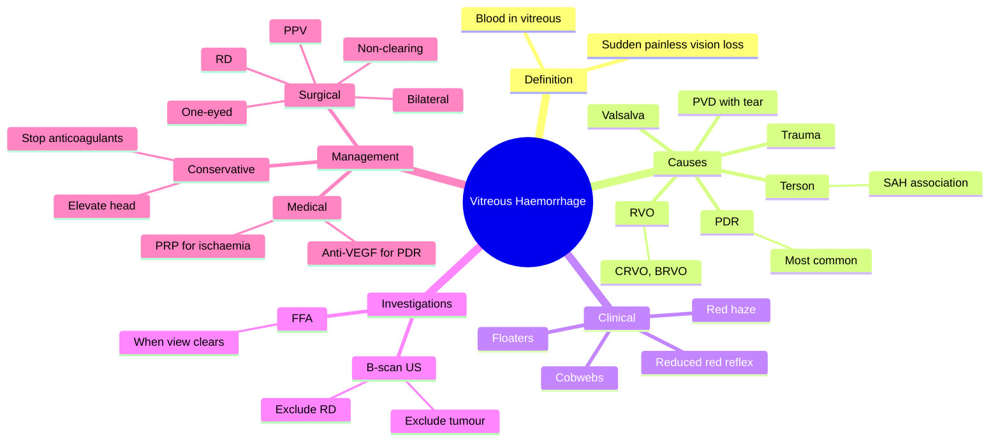

# Vitreous Haemorrhage

Related: [[Diabetic Retinopathy]], [[Retinal Detachment]], [[Posterior Vitreous Detachment]]

> [!tip] **FCPS/MRCP Priority: HIGH**
> Sudden floaters, cobwebs, red haze. Common causes: PDR, retinal tear, PVD. B-scan US to find cause. Treat underlying; vitrectomy if non-clearing.

---

## Learning Objectives
- [ ] Define vitreous haemorrhage and recognise its acute presentation
- [ ] List the major causes (PDR, PVD with tear, trauma, RVO)
- [ ] Perform appropriate initial assessment including B-scan US
- [ ] Apply principles of conservative and surgical management
- [ ] Identify indications for pars plana vitrectomy
- [ ] Recognise associations (Terson syndrome, Valsalva retinopathy)

---

## 1. Definition

- **Vitreous haemorrhage (VH):** Blood in the vitreous cavity
- Acute loss of vision, sudden floaters

---

## 2. Causes

- **Proliferative diabetic retinopathy (most common)**
- **Posterior vitreous detachment (PVD) with retinal tear**
- Retinal detachment (with tear)
- Retinal vein occlusion (CRVO, BRVO — neovascularisation)
- Trauma
- Retinal arterial macroaneurysm
- Vasculitis
- Sickle cell retinopathy
- Valsalva retinopathy
- Terson syndrome (subarachnoid haemorrhage)
- Intraocular tumour

---

## 3. Clinical Features

- **Sudden, painless ↓VA**
- Floaters ("cobwebs", "spider webs", "red haze")
- May be mild or profound (CF, HM)
- May resolve over weeks as blood settles

---

## 4. Examination

- Visual acuity (variable)
- Red reflex reduced
- Fundus: blood in vitreous, may obscure view
- **B-scan ultrasound** (essential) — look for retinal detachment, tumour

---

## 5. Management

### Conservative (small VH, clear cause)
- Elevate head (allow blood to settle)
- Avoid anticoagulants if possible
- Treat underlying cause
- Review in weeks

### Surgical
- **Pars plana vitrectomy (PPV)** indications:
  - Non-clearing VH (>3 months, or sooner if bilateral)
  - RD with VH
  - Persistent VH in one-eyed patient
  - VH with rubeosis / neovascular glaucoma risk

### Specific
- **PDR:** Anti-VEGF + PRP; vitrectomy for non-clearing
- **Retinal tear:** Laser/cryo ± PPV
- **Trauma:** Repair, vitrectomy as needed

---

## 6. FCPS/MRCP High-Yield Summary

| Topic | Key Points |
|-------|------------|
| Most common | PDR |
| Other | PVD with tear, trauma, RVO |
| Investigation | B-scan US |
| Treatment | Conservative (small) → vitrectomy (non-clearing) |

---

## 7. Viva Questions

1. **Q:** What is the most common cause of vitreous haemorrhage?
   **A:** Proliferative diabetic retinopathy.

2. **Q:** What investigation is essential when fundus view is obscured by VH?
   **A:** B-scan ultrasound — to exclude retinal detachment or tumour.

---

## 8. Common Confusions / Exam Traps

| Confusion | Clarification |
|-----------|---------------|
| "VH always needs vitrectomy" | Most small VH clear spontaneously; surgery reserved for non-clearing (>3 months), bilateral, RD, or one-eyed |
| "B-scan is optional" | B-scan is essential whenever fundus is obscured — to exclude RD and tumour |
| "Terson syndrome = subconjunctival haemorrhage" | Terson syndrome = VH associated with intracranial (subarachnoid) haemorrhage |
| "PDR VH requires immediate surgery" | Treat underlying PDR with anti-VEGF + PRP first; PPV only if non-clearing |
| "Trauma VH always needs PPV" | Small post-traumatic VH can clear; surgery for non-clearing, RD, or IOFB |

---

## 9. Mnemonics

1. **"VH = Vision Hazy"** — sudden painless ↓VA with floaters
2. **"PDR is Public Enemy No. 1"** — most common cause; always check for diabetic retinopathy
3. **"B-scan Before Surgery"** — always ultrasound to exclude RD/tumour before PPV

---

## 10. Mind Map

---

## 11. One-Page Revision Card

| **Topic** | **Vitreous Haemorrhage** |
|-----------|--------------------------|
| **Definition** | Blood in vitreous cavity |
| **Most common cause** | Proliferative diabetic retinopathy |
| **Other causes** | PVD with tear, trauma, RVO, Valsalva, Terson |
| **Key presentation** | Sudden, painless ↓VA + floaters (cobwebs/red haze) |
| **Essential investigation** | B-scan ultrasound (when fundus obscured) |
| **Conservative Rx** | Head elevation, stop anticoagulants, treat cause |
| **Surgical Rx** | Pars plana vitrectomy (non-clearing >3 months, RD, one-eyed) |
| **Viva Pearl** | "B-scan before surgery" — exclude RD/tumour |

---

## Spaced Repetition Trackers

### 24-Hour Recall Prompts
- [ ] Define vitreous haemorrhage
- [ ] List the 3 most common causes
- [ ] State the essential investigation when fundus is obscured
- [ ] List 3 indications for pars plana vitrectomy
- [ ] What is Terson syndrome?

### Revision Schedule
- [ ] **Day 1** completed (creation + 24h recall)
- [ ] **Day 3** revision completed
- [ ] **Day 7** revision completed
- [ ] **Day 15** revision completed
- [ ] **Day 30** revision completed
- [ ] **Day 90** revision completed

---

## Must Know / Should Know / Nice to Know

### Must Know (Core for passing)
- [x] Definition
- [x] Most common cause (PDR)
- [x] Other major causes (PVD with tear, trauma, RVO)
- [x] B-scan ultrasound as essential investigation
- [x] Conservative management (head elevation)
- [x] Indications for PPV (non-clearing, RD, one-eyed)

### Should Know (High probability)
- [x] Terson syndrome association
- [x] Valsalva retinopathy
- [x] PDR management (anti-VEGF + PRP)
- [x] Retinal tear treatment (laser/cryo)
- [x] Red flag — bilateral VH (need urgent workup)

### Nice to Know (Differentiator)
- [ ] Sickle cell retinopathy
- [ ] Retinal arterial macroaneurysm
- [ ] Intraocular tumour (rare cause)
- [ ] ILM peeling technique in PPV
- [ ] Timing of PPV (early vs late)

---

## My Weak Points
- [ ] Add personal weak areas here

---

## Self-Test Scorecard

| Section | Score /5 |
|---------|----------|
| Understanding: | /10 |
| Recall: | /10 |
| MCQ Performance: | /10 |
| SBA Performance: | /10 |
| Viva Confidence: | /10 |
| **Total:** | /50 |

> [!tip] **Interpretation:** <35 = weak topic, 35-44 = acceptable but insecure, 45+ = strong exam-ready topic.

---

## Exam Answer Modes

### Long Answer Skeleton
1. Definition (blood in vitreous cavity, sudden painless ↓VA)
2. Causes (PDR most common, PVD with tear, trauma, RVO, Valsalva, Terson)
3. Clinical features (floaters, cobwebs, red haze, reduced red reflex)
4. Investigations (B-scan US essential; FFA when view clears)
5. Management (conservative for small; PPV for non-clearing >3 months, RD, one-eyed, bilateral)

### Short Note Skeleton
- Definition + classic presentation (sudden painless ↓VA + floaters)
- Most common cause = PDR
- Essential investigation = B-scan US
- PPV indications (4)

### Viva One-Liners
- **Q:** Most common cause of VH? → **A:** Proliferative diabetic retinopathy
- **Q:** Essential investigation when fundus obscured? → **A:** B-scan ultrasound (exclude RD/tumour)
- **Q:** PPV indications? → **A:** Non-clearing >3 months, RD, one-eyed, bilateral, rubeosis
- **Q:** Terson syndrome? → **A:** VH associated with subarachnoid haemorrhage

### Ward-Case Discussion Points
- Always check for diabetes in any VH patient
- Examine fellow eye (PDR, retinal tear)
- B-scan before vitrectomy
- Stop anticoagulants if safe
- Monitor IOP (ghost cell glaucoma risk)

### Last-Night-Before-Exam Sheet
- Top 3 facts: PDR is #1, B-scan essential, PPV for non-clearing
- 1 mnemonic: "B-scan Before Surgery"
- Must-know differential: retinal detachment, PVD, RVO, trauma
- Red flag: bilateral VH = urgent workup for PDR

---

## Summary

VH is sudden painless loss of vision with floaters. Most common cause is PDR. B-scan US if fundus obscured. Treat underlying; vitrectomy for non-clearing.

---

## MCQs (10)

1. **Question:** The most common cause of vitreous haemorrhage is:
   **Options:** A. Trauma B. Proliferative diabetic retinopathy C. Retinal vein occlusion D. Posterior vitreous detachment alone E. Retinal artery macroaneurysm
   **Answer:** B
   **Explanation:** Proliferative diabetic retinopathy is the leading cause of VH due to neovascularisation bleeding into the vitreous.

2. **Question:** The investigation of choice when the fundus view is obscured by vitreous haemorrhage is:
   **Options:** A. MRI B. CT scan C. B-scan ultrasound D. Fundus fluorescein angiography E. Optical coherence tomography
   **Answer:** C
   **Explanation:** B-scan ultrasound is the essential investigation to detect retinal detachment, tears, or an intraocular tumour when the fundus cannot be visualised.

3. **Question:** Posterior vitreous detachment (PVD) most commonly causes vitreous haemorrhage by:
   **Options:** A. Rupturing a retinal artery B. Tearing a retinal vessel at a vitreoretinal adhesion C. Causing retinal artery macroaneurysm D. Inducing neovascularisation E. Damaging the choroid
   **Answer:** B
   **Explanation:** PVD exerts traction at sites of firm vitreoretinal adhesion, which may tear a retinal vessel or the retina itself, producing a VH.

4. **Question:** Terson syndrome refers to:
   **Options:** A. VH in severe anaemia B. VH associated with subarachnoid haemorrhage C. VH due to Valsalva manoeuvre D. VH in T-cell lymphoma E. VH post-trauma
   **Answer:** B
   **Explanation:** Terson syndrome is vitreous (or subhyaloid) haemorrhage occurring in association with intracranial (commonly subarachnoid) haemorrhage, due to raised venous pressure.

5. **Question:** Which of the following is NOT an indication for pars plana vitrectomy in vitreous haemorrhage?
   **Options:** A. Non-clearing VH for >3 months B. Retinal detachment with VH C. Bilateral VH D. Mild VH that is improving E. One-eyed patient with persistent VH
   **Answer:** D
   **Explanation:** A mild VH that is spontaneously improving can be observed; surgery is reserved for non-clearing (>3 months), RD, one-eyed, bilateral, or neovascular complications.

6. **Question:** Valsalva retinopathy typically occurs after:
   **Options:** A. Penetrating eye injury B. Sudden increase in intrathoracic pressure (coughing, vomiting, weight-lifting) C. Diabetic ketoacidosis D. Carotid artery dissection E. Migraine
   **Answer:** B
   **Explanation:** A sudden Valsalva manoeuvre (cough, vomit, straining, heavy lifting) ruptures superficial retinal capillaries, producing a pre-retinal/subhyaloid haemorrhage.

7. **Question:** In a patient with VH secondary to proliferative diabetic retinopathy, the initial treatment includes:
   **Options:** A. Topical antibiotic B. Topical steroid C. Anti-VEGF injection and panretinal photocoagulation D. Oral acetazolamide E. Corneal graft
   **Answer:** C
   **Explanation:** Anti-VEGF induces regression of neovascularisation; PRP ablates ischaemic peripheral retina to reduce VEGF drive. PPV reserved for non-clearing VH.

8. **Question:** Bilateral vitreous haemorrhage in a young patient should make you suspect:
   **Options:** A. Bilateral trauma B. Sickle cell retinopathy or other systemic vasculopathy C. Migraine D. Astigmatism E. Presbyopia
   **Answer:** B
   **Explanation:** Bilateral VH in the young prompts evaluation for sickle cell disease, other haemoglobinopathies, and systemic vasculitides.

9. **Question:** Ghost cell glaucoma can occur as a complication of:
   **Options:** A. Chronic vitreous haemorrhage B. Acute conjunctivitis C. Central retinal artery occlusion D. Optic neuritis E. Keratitis
   **Answer:** A
   **Explanation:** Degenerated red blood cells (ghost cells) from a long-standing VH can obstruct the trabecular meshwork, causing a secondary open-angle glaucoma.

10. **Question:** In PVD-associated retinal tear with localised vitreous haemorrhage, definitive treatment is:
    **Options:** A. Observation only B. Topical steroid C. Laser retinopexy or cryotherapy to the tear D. Enucleation E. Corneal transplant
    **Answer:** C
    **Explanation:** A retinal tear is sealed with laser retinopexy or cryotherapy to prevent progression to retinal detachment. PPV is added if VH prevents adequate laser.

---

## SBA Questions (10)

1. **Scenario:** A 58-year-old man with a 20-year history of type 2 diabetes mellitus presents with sudden painless loss of vision in the right eye, describing "red haze" and floaters. Visual acuity is hand movements. The right fundus cannot be visualised due to vitreous blood.
   **Question:** What is the most likely cause of this presentation?
   **Options:** A. Retinal detachment B. Proliferative diabetic retinopathy C. Central retinal artery occlusion D. Vitreous detachment alone E. Acute glaucoma
   **Answer:** B
   **Explanation:** Long-standing diabetic patient with painless VH = PDR until proven otherwise; the other eye will usually show neovascularisation.

2. **Scenario:** A 65-year-old woman presents with sudden onset of floaters and a "curtain" coming across the inferior visual field of her left eye. Visual acuity is 6/36. B-scan ultrasound shows a linear membrane attached to the optic disc with a flap.
   **Question:** What is the most likely diagnosis?
   **Options:** A. Retinal detachment with PVD/tear B. Vitreous haemorrhage from PDR C. Central retinal vein occlusion D. Macular hole E. Endophthalmitis
   **Answer:** A
   **Explanation:** A linear membrane attached at the disc with a flap on B-scan is the classic appearance of a retinal detachment with a tear.

3. **Scenario:** A 35-year-old man develops a dense vitreous haemorrhage 48 hours after a subarachnoid haemorrhage from a ruptured anterior communicating artery aneurysm.
   **Question:** What is the diagnosis?
   **Options:** A. Hypertensive retinopathy B. Terson syndrome C. Purtscher retinopathy D. Valsalva retinopathy E. Coats disease
   **Answer:** B
   **Explanation:** VH in the setting of acute SAH is termed Terson syndrome, presumed due to a sudden rise in intracranial and venous pressure.

4. **Scenario:** A 50-year-old diabetic patient has a small vitreous haemorrhage with a clear view of the fundus, which shows neovascularisation at the disc and elsewhere, but no retinal detachment.
   **Question:** What is the most appropriate management?
   **Options:** A. Immediate pars plana vitrectomy B. Enucleation C. Anti-VEGF injection followed by panretinal photocoagulation D. Topical antibiotic and review E. Oral steroids
   **Answer:** C
   **Explanation:** Treat underlying PDR medically with anti-VEGF and PRP; vitrectomy reserved for non-clearing VH or tractional RD.

5. **Scenario:** A 70-year-old phakic patient with VH secondary to PDR has had persistent vitreous blood for 6 months with vision of counting fingers. IOP is normal and there is no retinal detachment.
   **Question:** What is the most appropriate next step?
   **Options:** A. Continued observation for 6 more months B. Pars plana vitrectomy C. Topical atropine D. Corneal graft E. Enucleation
   **Answer:** B
   **Explanation:** Non-clearing VH for >3 months is a clear indication for pars plana vitrectomy to restore vision and allow retinal examination/laser.

6. **Scenario:** A young woman develops sudden floaters and reduced vision after an episode of forceful vomiting. Fundoscopy shows a well-circumscribed pre-retinal haemorrhage with a fluid level.
   **Question:** Most likely diagnosis?
   **Options:** A. Terson syndrome B. Valsalva retinopathy C. Proliferative diabetic retinopathy D. Retinal vein occlusion E. Sickle cell retinopathy
   **Answer:** B
   **Explanation:** A pre-retinal/subhyaloid haemorrhage following a sudden Valsalva manoeuvre (vomiting, coughing, weight-lifting) is classic for Valsalva retinopathy.

7. **Scenario:** A patient with chronic vitreous haemorrhage develops a painful red eye with raised intraocular pressure (35 mmHg), corneal oedema, and circulating tan-coloured cells in the anterior chamber.
   **Question:** What is the most likely diagnosis?
   **Options:** A. Acute angle-closure glaucoma B. Ghost cell glaucoma C. Neovascular glaucoma D. Uveitis E. Endophthalmitis
   **Answer:** B
   **Explanation:** Degenerated red cells (ghost cells) from chronic VH obstruct the trabecular meshwork, producing a secondary open-angle glaucoma (ghost cell glaucoma).

8. **Scenario:** A patient with sickle cell disease presents with sudden floaters. There is no history of trauma or diabetes. Fundus shows peripheral neovascularisation ("sea fan") and vitreous haemorrhage.
   **Question:** Most appropriate management?
   **Options:** A. Topical atropine B. Panretinal photocoagulation to ischaemic peripheral retina C. Oral aciclovir D. Enucleation E. Topical antifungal
   **Answer:** B
   **Explanation:** Sickle cell retinopathy is treated with PRP to ischaemic retina; anti-VEGF and PPV are added for non-clearing VH or RD.

9. **Scenario:** A patient with PDR-related vitreous haemorrhage has a tractional retinal detachment threatening the macula. There is active neovascularisation.
   **Question:** What is the most appropriate management?
   **Options:** A. Topical antibiotic only B. Pars plana vitrectomy with endolaser and anti-VEGF C. Enucleation D. Cataract surgery alone E. Corneal transplant
   **Answer:** B
   **Explanation:** Tractional RD threatening the macula in PDR is an indication for PPV with endolaser and adjunctive anti-VEGF.

10. **Scenario:** A 45-year-old man with sudden floaters is found to have a small vitreous haemorrhage and a horseshoe retinal tear superotemporally. IOP is normal and the macula is attached.
    **Question:** Most appropriate treatment?
    **Options:** A. Enucleation B. Laser retinopexy or cryotherapy to seal the tear C. Topical antibiotic D. Observation only with no intervention E. Vitrectomy alone without laser
    **Answer:** B
    **Explanation:** A symptomatic retinal tear in a phakic patient is sealed promptly with laser or cryotherapy to prevent progression to rhegmatogenous RD. PPV is added if VH obscures the break.

---

## Flashcards

- **Q:** What is vitreous haemorrhage?
  **A:** Bleeding into the vitreous cavity, presenting as sudden painless loss of vision with floaters/cobwebs/red haze.
- **Q:** Most common cause of vitreous haemorrhage?
  **A:** Proliferative diabetic retinopathy (PDR).
- **Q:** Essential investigation when fundus is obscured by VH?
  **A:** B-scan ultrasound — to exclude retinal detachment or intraocular tumour.
- **Q:** Indications for pars plana vitrectomy in VH?
  **A:** Non-clearing VH >3 months, RD with VH, bilateral VH, one-eyed patient, rubeosis/neovascular glaucoma.
- **Q:** What is Terson syndrome?
  **A:** Vitreous (or subhyaloid) haemorrhage associated with subarachnoid haemorrhage.

---

## Answer Key with Explanations

### MCQs
1. B — PDR is the most common cause of VH
2. C — B-scan US is essential when fundus is obscured
3. B — PVD causes VH by tearing a retinal vessel at a vitreoretinal adhesion
4. B — Terson syndrome = VH with subarachnoid haemorrhage
5. D — Improving mild VH can be observed; PPV is not required
6. B — Valsalva manoeuvre (cough, vomit, lifting) causes pre-retinal haemorrhage
7. C — Anti-VEGF + PRP is first-line for PDR
8. B — Bilateral VH in young patients suggests sickle cell or other systemic vasculopathy
9. A — Ghost cell glaucoma follows chronic VH (degenerated RBCs blocking trabecular meshwork)
10. C — Retinal tear is sealed with laser or cryotherapy to prevent RD

### SBAs
1. B — Long-standing DM with painless VH = PDR
2. A — Linear membrane on B-scan with flap = retinal detachment with tear
3. B — VH in the setting of SAH = Terson syndrome
4. C — Treat underlying PDR with anti-VEGF + PRP; vitrectomy only if non-clearing
5. B — Non-clearing VH >3 months is an indication for PPV
6. B — Pre-retinal haemorrhage after Valsalva = Valsalva retinopathy
7. B — Tan cells in AC + chronic VH + raised IOP = ghost cell glaucoma
8. B — Sickle cell retinopathy is treated with PRP
9. B — TRD threatening macula = PPV + endolaser + anti-VEGF
10. B — Symptomatic retinal tear = laser retinopexy or cryotherapy

---

## Tags
#medicine #davidson #ophthalmology #vitreous-haemorrhage #fcps #mrcp
