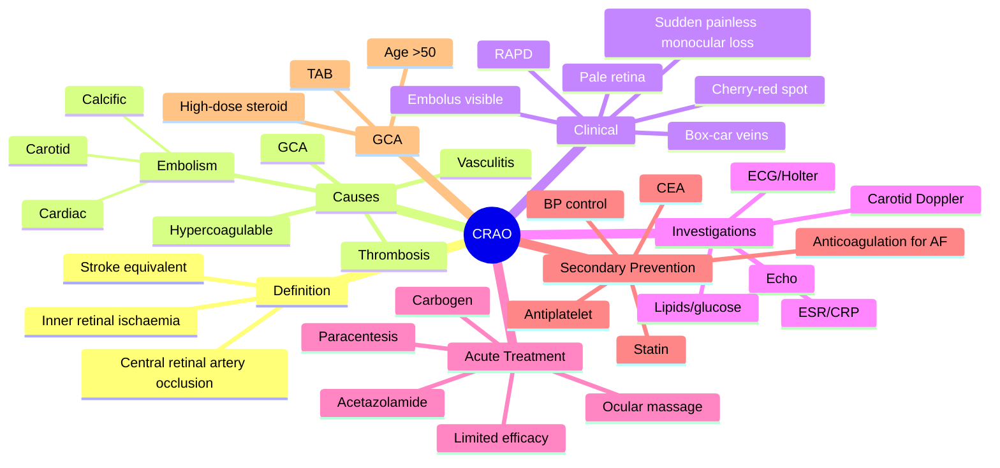

# Central Retinal Artery Occlusion (CRAO)

Related: [[Anterior Ischaemic Optic Neuropathy (AION)]], [[Central Retinal Vein Occlusion (CRVO)]], [[Amaurosis Fugax]]

> [!tip] **FCPS/MRCP Priority: CRITICAL**
> Sudden painless monocular vision loss. Cherry-red spot. Emergent workup for GCA in >50y. Limited treatment options. Stroke risk — urgent vascular assessment.

---

## Learning Objectives
- [ ] Define CRAO and recognise it as a stroke equivalent
- [ ] Describe the pathognomonic cherry-red spot and its pathophysiology
- [ ] Identify the major causes (embolism, GCA, thrombosis)
- [ ] Perform urgent workup for giant cell arteritis in patients >50 years
- [ ] Recognise the role of cardiovascular and carotid imaging
- [ ] Differentiate CRAO from CRVO, optic neuritis, and retinal detachment
- [ ] Outline acute management options and their limitations
- [ ] Apply secondary prevention strategies (antiplatelet, statin, BP control)

---

## 1. Definition / Epidemiology

### Definition
- **CRAO:** Acute occlusion of the central retinal artery → ischaemia of the inner retina
- "Stroke of the eye"
- Vision loss usually severe (often CF or worse)

### Epidemiology
- Incidence ~1–2 per 100,000 per year
- Mean age ~60–70 years
- Rare in <30 years (consider vasculitis, hypercoagulable states)
- **Stroke risk:** ~10% in 90 days (CRAO is a stroke equivalent)

---

## 2. Pathophysiology

- **Inner retina** ischaemia (CRA supplies inner 2/3; supplied by central retinal artery, a branch of ophthalmic artery)
- **Outer retina** (photoreceptors) supplied by choroidal circulation (from posterior ciliary arteries) — preserved
- **Cherry-red spot:** Foveal centre appears red against surrounding pale, oedematous retina
  - Fovea is thinnest — intact choroidal circulation shows through
  - Surrounding retina is oedematous and pale (opaque)
- Inner retina tolerates only ~90–100 minutes of ischaemia before irreversible damage
- After weeks: pale optic disc (optic atrophy), attenuated arterioles

---

## 3. Causes

- **Embolism (most common):**
  - Carotid atheroma (Hollenhorst plaque = yellow cholesterol embolus)
  - Cardiac (AF, valve disease, myxoma, endocarditis)
  - Calcific embolus (white, from aortic valve)
  - Platelet-fibrin emboli
- **Giant cell arteritis (GCA / temporal arteritis):** Critical in >50y — emergency
- **In-situ thrombosis** (atherosclerosis of CRA itself)
- **Vasculitis** (SLE, polyarteritis nodosa, Behçet)
- **Hypercoagulable states** (rare — protein C/S, antiphospholipid, factor V Leiden)
- **Trauma, retrobulbar haemorrhage** (compartment syndrome)
- **Migraine, vasospasm** (rare, young patients)
- **Susac syndrome** (retinal artery branch occlusions + hearing loss + encephalopathy)
- **Sickle cell disease**

---

## 4. Clinical Features

### Symptoms
- **Sudden, painless, severe monocular vision loss** (often CF, HM, or worse)
- RAPD (afferent pupillary defect)
- May have preceding **amaurosis fugax** (transient)
- May notice the loss on waking (sleep-related hypotension)

### Signs (Fundoscopy)
- **Pale, oedematous retina** (cloudy swelling)
- **Cherry-red spot** at the macula (fovea)
- **Box-car segmentation** of retinal veins (sludging of flow, broken columns of blood)
- ± Visible embolus (Hollenhorst plaque — yellow cholesterol at bifurcation; calcific — white)
- After weeks: **pale optic disc** (optic atrophy), attenuated arterioles

### Investigations for Cause
- ESR, CRP, platelets (GCA)
- Carotid Doppler
- Echocardiogram
- ECG, Holter
- FBC, lipids, glucose, HbA1c

---

## 5. Branch Retinal Artery Occlusion (BRAO)

- Partial visual field loss corresponding to affected branch distribution
- Less severe than CRAO
- Often with visible embolus at bifurcation
- Same workup (stroke equivalent)
- May need urgent GCA workup if >50y

---

## 6. Investigations

- **Urgent ESR, CRP, platelets** (GCA in >50y)
- **Temporal artery biopsy** (if GCA suspected — does not delay treatment)
- FBC, lipids, glucose, HbA1c
- **Carotid Doppler US**
- **Echocardiogram** (cardioembolic source — PFO, myxoma, vegetation)
- **ECG, Holter** (AF — paroxysmal may need prolonged monitoring)
- Consider thrombophilia screen (young, no cause, bilateral)
- Consider CT/MRI brain if neurological symptoms

---

## 7. Management

### Acute (Time-Critical but Limited Efficacy)
- **Retina tolerates only ~90–100 min of ischaemia** — most patients present too late for effective treatment
- **Ocular massage** (to dislodge embolus, repeated 5–10 seconds)
- **Anterior chamber paracentesis** (rapidly ↓ IOP, dislodge embolus)
- **IV acetazolamide 500 mg** (↓ IOP, improve perfusion)
- **Topical β-blocker / apraclonidine** (↓ IOP)
- **Hyperbaric oxygen** (limited availability, evidence)
- **Inhalation of 95% O2 + 5% CO2** (carbogen) — vasodilation
- **Intra-arterial thrombolysis** (controversial, not standard; only in specialist centres within ~6–8 h)

### Workup
- **Stroke workup** (CRAO = stroke equivalent — needs urgent vascular assessment)
- **GCA workup** (if >50y) — start high-dose IV methylprednisolone if suspected (don't delay for biopsy)
- **Cardiac workup**
- Admit under stroke team or rapid-access TIA clinic

### Secondary Prevention
- **Antiplatelet** (aspirin 75–300 mg or clopidogrel)
- **Statin** (high-intensity)
- **BP control**
- **Carotid endarterectomy** (if significant symptomatic stenosis ≥70%)
- Manage AF (anticoagulation), cardiac source
- Lifestyle: smoking cessation, exercise, diet

---

## 8. Complications

- Permanent severe visual loss (most cases)
- Optic atrophy (late)
- Neovascularisation (rare)
- Recurrent embolic events (stroke risk)
- Ocular ischaemic syndrome (if ophthalmic artery occlusion)

---

## 9. Red Flags / Emergencies

- Sudden painless monocular vision loss = stroke until proven otherwise
- GCA in >50y (headache, jaw claudication, scalp tenderness, PMR) — start steroids immediately
- Bilateral simultaneous CRAO → vasculitis, hypercoagulable
- RAPD + cherry-red spot = CRAO

---

## 10. FCPS/MRCP High-Yield Summary

| Topic | Key Points |
|-------|------------|
| Presentation | Sudden painless monocular loss |
| Fundus | Pale retina, cherry-red spot, box-cars |
| Cause | Embolism (carotid, cardiac), GCA |
| GCA | >50y, urgent ESR/CRP, start steroid |
| Stroke risk | CRAO is stroke equivalent — needs full workup |
| Treatment | Limited; massage, paracentesis, ↓IOP |

---

## 11. Viva Questions

1. **Q:** What is the cherry-red spot?
   **A:** Red fovea seen against surrounding pale, ischaemic, oedematous retina — the fovea is thinnest, so intact choroidal circulation shows through.

2. **Q:** What urgent workup is required in a patient >50y with CRAO?
   **A:** ESR, CRP urgently for GCA. If elevated, start high-dose IV methylpred before biopsy.

3. **Q:** What is the long-term risk after CRAO?
   **A:** Stroke (CRAO is a stroke equivalent — ~10% risk in 90 days). Needs urgent vascular workup and secondary prevention.

4. **Q:** What is the role of anterior chamber paracentesis?
   **A:** To acutely lower IOP and potentially dislodge an embolus to allow it to move more peripherally.

5. **Q:** Why is retinal ischaemia time-critical?
   **A:** Inner retina tolerates only 90–100 minutes of ischaemia before irreversible damage — most patients present too late for treatment.

---

## 12. Common Confusions / Exam Traps

| Confusion | Clarification |
|-----------|---------------|
| "CRAO is painful" | It is **painless** (vs optic neuritis — painful eye movements; uveitis — painful) |
| "Cherry-red spot is pathognomonic of CRAO" | Also seen in **Tay-Sachs, Niemann-Pick, commotio retinae, macular hole** (depending on context) |
| "RAPD is absent in CRAO" | RAPD is **present** (severe afferent defect) |
| "All CRAO patients need thrombolysis" | Intra-arterial thrombolysis is controversial; not standard of care |
| "GCA is a retinal disease" | GCA is a **systemic vasculitis** of medium/large arteries; can cause irreversible blindness if untreated |
| "CRAO doesn't need stroke workup" | CRAO is a **stroke equivalent** — needs full vascular workup |
| "Hollenhorst plaque is the embolus blocking the artery" | It is a **cholesterol embolus** marking the site; the actual occlusion may be from superimposed thrombus |

---

## 13. Mnemonics

1. **"Cherry-red = Choroid shows through"** — intact choroidal circulation visible at thin fovea
2. **"CRAO is a stroke"** — same risk factors, same workup, same prevention
3. **"GCA = 50, ESR, Steroid"** — age >50, urgent ESR, immediate high-dose steroid
4. **"Box-cars = BRAKE on flow"** — segmented venous columns indicate arterial occlusion
5. **"Pale retina, red fovea, blind eye"** — the CRAO triad

---

## 14. Mind Map

---

## One-Page Revision Card

| **Topic** | **Central Retinal Artery Occlusion** |
|-----------|--------------------------------------|
| **Definition** | Occlusion of CRA → inner retinal ischaemia |
| **Presentation** | Sudden painless monocular vision loss |
| **Key sign** | Cherry-red spot at macula, pale retina, RAPD |
| **Causes** | Embolism (carotid, cardiac), GCA, thrombosis |
| **Critical in >50y** | GCA workup (ESR, CRP, TAB); start steroid |
| **Treatment** | Limited acute options; massage, paracentesis, ↓IOP |
| **Workup** | Stroke equivalent — carotid Doppler, echo, ECG |
| **Prevention** | Antiplatelet, statin, BP control, CEA if stenosis |
| **Viva Pearl** | Cherry-red = choroid shows through thin fovea |

---

## Spaced Repetition Trackers

### 24-Hour Recall Prompts
- [ ] Define the cherry-red spot and explain its pathophysiology
- [ ] List 3 causes of CRAO
- [ ] Outline the GCA workup in a patient >50y with CRAO
- [ ] State the key acute management options and their limitations
- [ ] List the secondary prevention measures
- [ ] Explain why CRAO is a stroke equivalent
- [ ] Differentiate CRAO from CRVO and optic neuritis

### Revision Schedule
- [ ] **Day 1** completed (creation + 24h recall)
- [ ] **Day 3** revision completed
- [ ] **Day 7** revision completed
- [ ] **Day 15** revision completed
- [ ] **Day 30** revision completed
- [ ] **Day 90** revision completed

---

## Must Know / Should Know / Nice to Know

### Must Know (Core for passing)
- [x] Definition and presentation of CRAO
- [x] Cherry-red spot pathophysiology
- [x] Major causes (embolism, GCA, thrombosis)
- [x] GCA workup and treatment in >50y
- [x] CRAO as a stroke equivalent
- [x] Secondary prevention (antiplatelet, statin, BP, CEA)

### Should Know (High probability)
- [x] Acute management options and their limitations
- [x] Box-car segmentation of veins
- [x] Hollenhorst plaque (cholesterol embolus)
- [x] BRAO and its differences
- [x] Indications for temporal artery biopsy
- [x] Carbogen inhalation

### Nice to Know (Differentiator)
- [ ] Intra-arterial thrombolysis (controversial)
- [ ] Hyperbaric oxygen therapy
- [ ] Susac syndrome (BRAO + hearing loss + encephalopathy)
- [ ] Ocular ischaemic syndrome (ophthalmic artery occlusion)
- [ ] Sickle cell and CRAO

---

## My Weak Points
- [ ] Add personal weak areas here

---

## Self-Test Scorecard

| Section | Score /5 |
|---------|----------|
| Understanding: | /10 |
| Recall: | /10 |
| MCQ Performance: | /10 |
| SBA Performance: | /10 |
| Viva Confidence: | /10 |
| Total: | /50 |

> [!tip] **Interpretation:** <35 = weak topic, 35-44 = acceptable but insecure, 45+ = strong exam-ready topic.

---

## Exam Answer Modes

### Long Answer Skeleton
1. Definition (occlusion of CRA → inner retinal ischaemia, "stroke of the eye")
2. Pathophysiology (inner 2/3 ischaemia; outer 1/3 preserved by choroid)
3. Causes (embolism, GCA, thrombosis, vasculitis, hypercoagulable)
4. Clinical features (sudden painless monocular loss, RAPD, pale retina, cherry-red spot, box-cars)
5. Investigations (ESR/CRP for GCA, carotid Doppler, echo, ECG, lipids/glucose)
6. Acute management (massage, paracentesis, ↓IOP, carbogen; limited efficacy)
7. GCA emergency pathway (age >50, start IV methylpred, TAB later)
8. Secondary prevention (antiplatelet, statin, BP, CEA, manage AF)

### Short Note Skeleton
- Definition + cherry-red spot pathophysiology
- Causes (one line each)
- Workup (GCA, carotid, cardiac)
- Treatment (acute + secondary prevention)

### Viva One-Liners
- **Q:** Cherry-red spot? → **A:** Red fovea against pale, oedematous retina — choroid shows through thin fovea
- **Q:** CRAO in >50y? → **A:** GCA workup; start steroid if suspected
- **Q:** Is CRAO a stroke? → **A:** Yes, stroke equivalent — 10% stroke risk in 90 days
- **Q:** Treatment options? → **A:** Ocular massage, paracentesis, acetazolamide; limited efficacy if late
- **Q:** What is Hollenhorst plaque? → **A:** Yellow cholesterol embolus at retinal artery bifurcation

### Ward-Case Discussion Points
- Differentiating CRAO from CRVO, optic neuritis, retinal detachment
- Recognising GCA symptoms (headache, jaw claudication, scalp tenderness, PMR)
- Importance of ESR/CRP urgency
- Why thrombolysis is not standard
- Stroke prevention counselling

### Last-Night-Before-Exam Sheet
- **Top 3 facts:** Cherry-red spot; stroke equivalent; GCA in >50y
- **Mnemonic:** "Cherry-red = Choroid shows through"; "GCA = 50, ESR, Steroid"
- **Must-know cause list:** Embolism (carotid, cardiac), GCA, thrombosis
- **Acute treatment:** Massage, paracentesis, acetazolamide (limited)
- **Secondary prevention:** Antiplatelet, statin, BP, CEA

---

## Summary

CRAO is sudden painless monocular vision loss with cherry-red spot on fundus. Treat as a stroke equivalent — urgent vascular workup, antiplatelet, statin, BP control. GCA in >50y requires urgent ESR/CRP and high-dose steroid. Limited acute treatment options; prognosis is generally poor because of the short retinal ischaemic tolerance. Differentiate from CRVO (retinal haemorrhages, no cherry-red), optic neuritis (painful eye movements, normal fundus initially), and retinal detachment (curtain, flashes).

## MCQs (10)

1. **Question:** Cherry-red spot is characteristic of:
   **Options:** A. CRVO B. CRAO C. AMD D. DR E. Retinal detachment
   **Answer:** B
   **Explanation:** Cherry-red spot is the classic CRAO sign — choroid shows through thin fovea.

2. **Question:** A patient >50y with CRAO should have:
   **Options:** A. Topical antibiotic B. Urgent ESR/CRP for GCA C. Vitrectomy D. Scleral buckle E. None
   **Answer:** B
   **Explanation:** GCA must be excluded urgently; start steroid if suspected.

3. **Question:** CRAO is considered a:
   **Options:** A. Localised eye disease B. Stroke equivalent C. Heart attack D. Migraine variant E. None
   **Answer:** B
   **Explanation:** ~10% stroke risk within 90 days.

4. **Question:** Box-car segmentation of retinal veins indicates:
   **Options:** A. Normal finding B. Sludged flow in CRAO C. Vein occlusion D. Inflammation E. Glaucoma
   **Answer:** B
   **Explanation:** Slow flow / sludging in arterial occlusion breaks the blood column.

5. **Question:** The inner retina tolerates ischaemia for approximately:
   **Options:** A. 5 minutes B. 15 minutes C. 90–100 minutes D. 12 hours E. 24 hours
   **Answer:** C
   **Explanation:** Retina tolerates only ~90–100 min of ischaemia — most CRAO is irreversible.

6. **Question:** A Hollenhorst plaque is:
   **Options:** A. Calcium embolus B. Cholesterol embolus C. Platelet-fibrin embolus D. Septic embolus E. Air embolus
   **Answer:** B
   **Explanation:** Yellow refractile cholesterol embolus at a retinal artery bifurcation, usually from carotid atheroma.

7. **Question:** In CRAO, the afferent pupillary defect (RAPD) is:
   **Options:** A. Absent B. Present (severe) C. Present only in BRAO D. Variable E. Only in chronic stage
   **Answer:** B
   **Explanation:** Severe afferent defect is present due to inner retinal ischaemia.

8. **Question:** Which investigation is LEAST useful in the workup of CRAO?
   **Options:** A. ESR B. Carotid Doppler C. Echocardiogram D. Temporal artery biopsy E. Visual evoked potentials
   **Answer:** E
   **Explanation:** VEPs are not useful in CRAO; clinical fundus diagnosis is typical.

9. **Question:** The most appropriate acute treatment for CRAO presenting within 1 hour is:
   **Options:** A. Vitrectomy B. Ocular massage + paracentesis + acetazolamide C. Oral aspirin D. Intravitreal anti-VEGF E. Laser photocoagulation
   **Answer:** B
   **Explanation:** Acute measures attempt to dislodge embolus and lower IOP; efficacy is limited even early.

10. **Question:** CRAO most commonly results from:
    **Options:** A. GCA B. Embolism C. Vasculitis D. Hypercoagulability E. Trauma
    **Answer:** B
    **Explanation:** Embolism (carotid, cardiac) is the most common cause overall.

## SBA Questions (10)

1. **Scenario:** A 70-year-old has sudden painless monocular vision loss, pale retina with cherry-red spot, and a relative afferent pupillary defect.
   **Question:** Most likely diagnosis?
   **Options:** A. CRVO B. CRAO C. Optic neuritis D. Retinal detachment E. Vitreous haemorrhage
   **Answer:** B
   **Explanation:** Painless + cherry-red spot + RAPD = CRAO.

2. **Scenario:** A 75-year-old with sudden painless vision loss, headache, jaw claudication, and scalp tenderness. ESR is 90 mm/h.
   **Question:** Most appropriate immediate management?
   **Options:** A. Topical antibiotic B. Start IV methylprednisolone C. Ocular massage D. Vitrectomy E. Topical steroid
   **Answer:** B
   **Explanation:** GCA suspected — high-dose IV steroid immediately to prevent fellow eye involvement; TAB within 1–2 weeks.

3. **Scenario:** A 65-year-old with CRAO is found to have 80% ipsilateral carotid stenosis on Doppler.
   **Question:** Most appropriate definitive management?
   **Options:** A. Aspirin only B. Carotid endarterectomy C. Statin only D. Warfarin E. Observation
   **Answer:** B
   **Explanation:** Symptomatic high-grade carotid stenosis is best managed with CEA in addition to medical therapy.

4. **Scenario:** A 50-year-old presents with sudden painless vision loss in one eye. Fundus shows a single yellow refractile embolus at a retinal artery bifurcation with surrounding retinal pallor.
   **Question:** Most likely source?
   **Options:** A. Cardiac myxoma B. Carotid atheroma C. Calcific aortic valve D. Sepsis E. Fat embolism
   **Answer:** B
   **Explanation:** Yellow cholesterol embolus = Hollenhorst plaque, usually from carotid atheroma.

5. **Scenario:** A 60-year-old with CRAO is in AF. CT head is normal. What is the most appropriate long-term antithrombotic?
   **Options:** A. Aspirin only B. Clopidogrel C. Warfarin or DOAC D. Heparin infusion E. Dipyridamole
   **Answer:** C
   **Explanation:** AF is a cardioembolic source; anticoagulation (warfarin or DOAC) is indicated.

6. **Scenario:** A 35-year-old with no risk factors has bilateral sequential CRAO over 6 months.
   **Question:** Most appropriate next investigation?
   **Options:** A. Carotid Doppler B. Echocardiogram C. Thrombophilia screen + vasculitic screen D. ESR/CRP E. CT brain
   **Answer:** C
   **Explanation:** Young patient with bilateral CRAO and no risk factors — screen for hypercoagulable state and vasculitis.

7. **Scenario:** A patient with CRAO has IOP 50 mmHg due to neovascularisation of the iris and angle.
   **Question:** Diagnosis?
   **Options:** A. Acute angle-closure glaucoma B. Neovascular glaucoma C. Steroid response D. Ghost cell glaucoma E. Pigment dispersion
   **Answer:** B
   **Explanation:** Rubeosis iridis from severe retinal ischaemia (CRAO) can cause neovascular glaucoma.

8. **Scenario:** A patient presents 6 hours after onset of CRAO. Is there benefit in ocular massage or paracentesis?
   **Options:** A. Yes, always B. No, retina is already infarcted C. Only if visible embolus D. Only with GCA E. Only if bilateral
   **Answer:** B
   **Explanation:** After ~100 minutes of ischaemia, retina is irreversibly damaged; acute interventions are of limited benefit.

9. **Scenario:** A 70-year-old with CRAO has new dysarthria and right arm weakness 3 days later.
   **Question:** Most appropriate next step?
   **Options:** A. Urgent CT head + stroke team referral B. Aspirin C. Bed rest D. Lumbar puncture E. Echocardiogram
   **Answer:** A
   **Explanation:** New neurological deficit = stroke; CRAO is a stroke equivalent; urgent imaging and stroke team.

10. **Scenario:** A 68-year-old with GCA-related CRAO is started on IV methylprednisolone. When is the temporal artery biopsy best performed?
    **Options:** A. Within 24 hours B. Within 1–2 weeks (does not lose diagnostic yield for several weeks) C. After 6 months D. Only if ESR normalises E. Never
    **Answer:** B
    **Explanation:** TAB remains positive for 2–6 weeks after starting steroids — biopsy should not be delayed excessively, but can be done within 1–2 weeks.

## Flashcards

- **Q:** What is the cherry-red spot?
  **A:** Red fovea against surrounding pale, oedematous retina; the fovea is thinnest, so intact choroidal circulation shows through.
- **Q:** What is the most important diagnosis to exclude in CRAO in a patient >50y?
  **A:** Giant cell arteritis (GCA) — needs urgent ESR/CRP and high-dose steroid.
- **Q:** Why is CRAO a "stroke of the eye"?
  **A:** Same embolic mechanisms, ~10% stroke risk within 90 days; needs urgent vascular workup and secondary prevention.
- **Q:** What is a Hollenhorst plaque?
  **A:** Yellow refractile cholesterol embolus at a retinal artery bifurcation, usually from carotid atheroma.
- **Q:** What is the most common cause of CRAO?
  **A:** Embolism (carotid atheroma or cardiac source).

## Answer Key with Explanations

### MCQs
1. B — Cherry-red spot is the classic CRAO sign
2. B — GCA must be excluded urgently in >50y
3. B — CRAO is a stroke equivalent (10% risk in 90 days)
4. B — Box-cars = sludged venous flow in arterial occlusion
5. C — Retina tolerates only ~90–100 min of ischaemia
6. B — Hollenhorst plaque = yellow cholesterol embolus
7. B — RAPD is present (severe afferent defect)
8. E — VEPs are not useful in CRAO
9. B — Acute measures to dislodge embolus and lower IOP
10. B — Embolism (carotid, cardiac) is the most common cause

### SBAs
1. B — Painless + cherry-red + RAPD = CRAO
2. B — GCA → start IV methylpred immediately
3. B — High-grade symptomatic carotid stenosis → CEA
4. B — Yellow cholesterol embolus = carotid atheroma
5. C — AF requires anticoagulation (warfarin or DOAC)
6. C — Young + bilateral + no risk factors → thrombophilia + vasculitis screen
7. B — Rubeosis from ischaemic retina → NVG
8. B — After 6 hours, retina is irreversibly damaged
9. A — New neurological deficit = stroke; urgent imaging
10. B — TAB can be done within 1–2 weeks after starting steroids

## Tags
#medicine #davidson #ophthalmology #CRAO #stroke-equivalent #fcps #mrcp

## PasTest Scenario SBAs (Clinical Vignettes)

> **Auto-generated PasTest/Mediscope-style scenario SBAs** grounded in the authored source content. Each scenario is a clinical vignette with 4 options. **Source: Ch 28: Medical Ophthalmology / CRAO**

**Q1.** A patient presents with features consistent with CRAO. The clinical picture is most consistent with: **Sudden, painless, severe monocular vision loss** (often CF, HM, or worse) What is the most likely diagnosis?

  - **A.** CRAO
  - **B.** A closely related condition in the same clinical area
  - **C.** A complication of CRAO
  - **D.** An unrelated mimic with overlapping features

  > **Answer: A** — CRAO

**Q2.** A patient is being evaluated for CRAO. Based on standard diagnostic approach, what is the most appropriate first-line investigation?

  - **A.** Approach described in standard diagnostic workup
  - **B.** An advanced/invasive test as first-line
  - **C.** Empirical treatment without investigation
  - **D.** Watchful waiting without further testing

  > **Answer: A** — Approach described in standard diagnostic workup

**Q3.** A patient is diagnosed with CRAO. What is the most appropriate first-line management approach?

  - **A.** Standard guideline-directed first-line therapy
  - **B.** Most aggressive advanced therapy as first-line
  - **C.** No treatment needed in most cases
  - **D.** Investigational/compassionate-use therapy only

  > **Answer: A** — Standard guideline-directed first-line therapy

**Q4.** Which of the following best describes the underlying pathophysiology / definition of CRAO?

  - **A.** **CRAO:** Acute occlusion of the central retinal artery → ischaemia of the inner retina
  - **B.** A common misattribution to a similar but distinct condition
  - **C.** An outdated or disproven mechanism
  - **D.** A complication rather than the underlying disease process

  > **Answer: A** — **CRAO:** Acute occlusion of the central retinal artery → ischaemia of the inner retina

