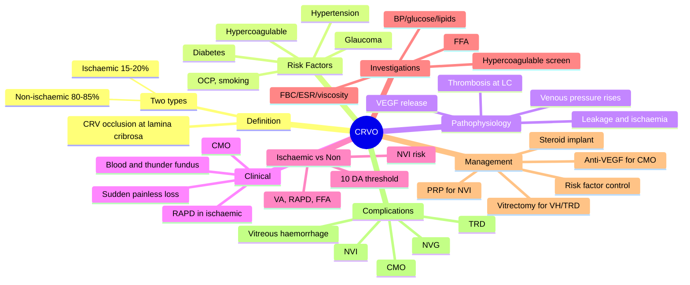

# Central Retinal Vein Occlusion (CRVO)

Related: [[Central Retinal Artery Occlusion (CRAO)]], [[Anti-VEGF Therapy]], [[Retinal Vasculitis]]

> [!tip] **FCPS/MRCP Priority: CRITICAL**
> "Blood and thunder" fundus. Ischaemic vs non-ischaemic (RAPD, VA, extent of haemorrhages). Treat CMO with anti-VEGF; PRP for neovascularisation in ischaemic CRVO.

---

## Learning Objectives
- [ ] Define CRVO and describe its pathophysiology
- [ ] Identify the major risk factors (HTN, DM, glaucoma, hypercoagulable)
- [ ] Recognise the classic "blood and thunder" fundus
- [ ] Differentiate ischaemic from non-ischaemic CRVO clinically and on FFA
- [ ] List the complications of CRVO (CMO, NVI, NVG, vitreous haemorrhage, TRD)
- [ ] Outline management of non-ischaemic and ischaemic CRVO
- [ ] Apply the role of anti-VEGF, PRP, and intravitreal steroid
- [ ] Identify when to screen for hypercoagulable states

---

## 1. Definition / Epidemiology

### Definition
- **CRVO:** Occlusion of the central retinal vein at the lamina cribrosa
- Causes retinal haemorrhages, oedema, and ischaemia
- **Two main types:** Ischaemic (~15–20%) vs Non-ischaemic (~80–85%)

### Epidemiology
- Incidence ~2–4 per 1,000 adults >40 years
- More common with increasing age
- Bilateral in 5–10%
- Fellow eye involvement: 5–10% within 2 years
- Slight male predominance

---

## 2. Risk Factors

- Age >50
- **Hypertension** (most common systemic risk factor)
- Hyperlipidaemia
- **Diabetes mellitus**
- Open-angle glaucoma
- Hypercoagulable states (antiphospholipid syndrome, factor V Leiden, protein C/S deficiency, hyperviscosity — myeloma, Waldenström, polycythaemia)
- Oral contraceptive pill
- Smoking
- Optic disc drusen, crowded disc
- Vasculitis (Behçet, sarcoidosis, SLE)

---

## 3. Pathophysiology

- Thrombosis of CRV at the lamina cribrosa (compression by adjacent sclerotic CRA in shared adventitial sheath)
- ↑ Venous pressure → leakage (oedema, haemorrhage in all 4 quadrants)
- Capillary non-perfusion (ischaemia) → release of VEGF → neovascularisation
- **Ischaemic CRVO:** ≥10 disc areas of capillary non-perfusion on FFA → high risk of neovascularisation
- **Non-ischaemic CRVO:** Perfusion mostly preserved → better prognosis

---

## 4. Clinical Features

### Symptoms
- **Sudden, painless, monocular ↓VA** (variable severity)
- May be mild (non-ischaemic) or severe (ischaemic)
- Often noted on waking
- May have history of transient visual blurring (premonitory)

### Signs
- **RAPD** (ischaemic, severe)
- **"Blood and thunder" fundus:**
  - Diffuse flame and dot-blot haemorrhages in all 4 quadrants
  - Dilated, tortuous veins
  - Cotton wool spots (nerve fibre layer infarcts)
  - Disc oedema, hyperaemia
  - Macular oedema (CMO)
- ± Vitreous haemorrhage (later, if neovascularisation)

### Ischaemic vs Non-ischaemic

| Feature | Non-ischaemic | Ischaemic |
|---------|---------------|-----------|
| VA | 6/12 or better | 6/60 or worse |
| RAPD | Absent/mild | Present (severe) |
| Haemorrhages | Mild, scattered | Extensive, all 4 quadrants |
| Cotton wool spots | Few | Many |
| IRMA / NVD | Absent | Present |
| Visual field | Mild defect | Severe |
| Risk of NVI/NVG | Low (<5%) | High (up to 60%) |
| ERG | Normal | Reduced b-wave |
| FFA | <10 DA non-perfusion | ≥10 DA non-perfusion |
| Prognosis | Better (50% resolve) | Worse, complications |

---

## 5. Investigations

- **FFA (Fundus Fluorescein Angiography):** Differentiate ischaemic (>10 disc areas of non-perfusion) vs non-ischaemic
- **OCT (Optical Coherence Tomography):** CMO, foveal thickness, monitoring response
- **BP, glucose, HbA1c, lipids** (modifiable risk factors)
- **FBC, ESR** (viscosity — look for ↑Hct, ↑ESR = myeloma/Waldenström)
- **Glaucoma workup** (IOP, gonioscopy, optic disc, visual fields)
- **Hypercoagulable screen** if young, bilateral, recurrent, or no risk factors
- **Carotid US** (rule out carotid disease)
- **Chest X-ray, ACE** (sarcoidosis if suspected)

---

## 6. Management

### Non-ischaemic
- **Observe** (50% resolve spontaneously)
- Treat risk factors (BP, glucose, lipids, smoking cessation)
- **Anti-VEGF** (ranibizumab, aflibercept, bevacizumab, faricimab) for CMO — first-line
- **Intravitreal steroid** (dexamethasone implant, Ozurdex) for refractory CMO or pseudophakic patients
- **Focal/grid laser** for non-central CMO (less used now with anti-VEGF)

### Ischaemic
- **Anti-VEGF** for CMO
- **PRP (panretinal photocoagulation)** for NVI / neovascularisation (prophylactic PRP controversial; treat when NVI develops)
- Treat risk factors
- Intravitreal steroid (selected cases)
- Monthly follow-up initially (first 6 months — peak NVI risk)

### Complications Management
- **Neovascular glaucoma (NVG):** NVI, rubeosis — treat with PRP, anti-VEGF, IOP-lowering agents, cyclodestruction
- **Vitreous haemorrhage:** Vitrectomy if non-clearing
- **Tractional RD:** Vitrectomy with membrane peel
- **Macular oedema:** Most common cause of vision loss — treat with anti-VEGF
- **Recurrence in fellow eye:** 5–10%

---

## 7. Complications of CRVO

- **Macular oedema** (most common cause of vision loss)
- **Neovascularisation:** NVD, NVE, NVI (rubeosis iridis)
- **Neovascular glaucoma** (in ischaemic CRVO; medical emergency)
- **Vitreous haemorrhage** (from NVE)
- **Tractional retinal detachment**
- **Optic atrophy** (late)
- **Recurrence in fellow eye**

---

## 8. Red Flags / Emergencies

- Ischaemic CRVO = high risk of NVG (60%) — needs close follow-up
- Painful red eye with high IOP + NVI = NVG
- Bilateral CRVO → hypercoagulable state, hyperviscosity
- CRVO in young patient (<40) → thrombophilia screen
- Vitreous haemorrhage in CRVO → NVE bleed

---

## 9. FCPS/MRCP High-Yield Summary

| Topic | Key Points |
|-------|------------|
| Risk | HTN, DM, glaucoma, hypercoagulable |
| Fundus | "Blood and thunder" — haemorrhages all 4 quadrants |
| Ischaemic | RAPD, ↓VA, ≥10 DA non-perfusion on FFA, NVI risk |
| Non-ischaemic | Milder, may resolve |
| CMO | Treat with anti-VEGF |
| NVI | PRP |
| Most common cause of vision loss | Macular oedema |

---

## 10. Viva Questions

1. **Q:** Differentiate ischaemic from non-ischaemic CRVO.
   **A:** Ischaemic = RAPD, VA <6/60, extensive haemorrhages, cotton wool, ≥10 disc areas of non-perfusion on FFA, high NVI risk. Non-ischaemic = milder, better VA, may resolve.

2. **Q:** What is the most common cause of vision loss in CRVO?
   **A:** Macular oedema.

3. **Q:** What is the main systemic risk factor?
   **A:** Hypertension (also DM, hyperlipidaemia, glaucoma).

4. **Q:** What is the threshold for ischaemic CRVO on FFA?
   **A:** ≥10 disc areas of capillary non-perfusion.

5. **Q:** What is the most feared complication of ischaemic CRVO?
   **A:** Neovascular glaucoma (from rubeosis iridis).

---

## 11. Common Confusions / Exam Traps

| Confusion | Clarification |
|-----------|---------------|
| "CRVO is painful" | CRVO is **painless** (vs uveitis, endophthalmitis) |
| "Blood and thunder = ischaemic" | Both types can show haemorrhages; extent + RAPD + VA + FFA determine ischaemia |
| "All CRVO needs PRP" | Only ischaemic CRVO with NVI (or high risk) needs PRP |
| "Anti-VEGF is curative" | Anti-VEGF controls CMO but doesn't cure CRVO; recurrence common |
| "RAPD is absent in CRVO" | RAPD is present in **ischaemic** CRVO; absent in non-ischaemic |
| "BRVO and CRVO are the same" | BRVO is quadrant-specific; CRVO affects whole retina; prognosis differs |
| "Hypertension is the only risk factor" | DM, glaucoma, hypercoagulable states, OCP, smoking also matter |
| "CRVO in the young is always benign" | Young CRVO needs thrombophilia and vasculitis screen |

---

## 12. Mnemonics

1. **"Blood and Thunder"** — diffuse haemorrhages in all 4 quadrants = CRVO
2. **"Ischaemic = Inferno"** — ischaemic CRVO → NVI → NVG (visual inferno)
3. **"FFA: 10 disc areas = ischaemia"** — threshold for ischaemic CRVO
4. **"CRVO = Crowded disc, RVO = retinal vein occlusion"** — Crowded disc and CRV share a sheath
5. **"CMO is the vision killer in CRVO"** — treat CMO with anti-VEGF

---

## 13. Mind Map

---

## One-Page Revision Card

| **Topic** | **Central Retinal Vein Occlusion** |
|-----------|------------------------------------|
| **Definition** | Occlusion of CRV at lamina cribrosa |
| **Fundus** | "Blood and thunder" — haemorrhages in all 4 quadrants |
| **Risk factors** | HTN, DM, glaucoma, hypercoagulable |
| **Ischaemic clues** | RAPD, VA <6/60, ≥10 DA non-perfusion on FFA |
| **NVI risk** | Up to 60% in ischaemic |
| **First-line for CMO** | Anti-VEGF |
| **NVI treatment** | PRP |
| **Vision killer** | Macular oedema |
| **Viva Pearl** | "Blood and thunder" + RAPD = ischaemic CRVO |

---

## Spaced Repetition Trackers

### 24-Hour Recall Prompts
- [ ] Define CRVO and explain the "blood and thunder" fundus
- [ ] List 4 risk factors for CRVO
- [ ] State the threshold for ischaemic CRVO on FFA
- [ ] Differentiate ischaemic from non-ischaemic CRVO in 4 features
- [ ] Outline the management of CRVO-related CMO
- [ ] Explain when PRP is indicated in CRVO
- [ ] List 3 complications of CRVO
- [ ] State the most common cause of vision loss in CRVO

### Revision Schedule
- [ ] **Day 1** completed (creation + 24h recall)
- [ ] **Day 3** revision completed
- [ ] **Day 7** revision completed
- [ ] **Day 15** revision completed
- [ ] **Day 30** revision completed
- [ ] **Day 90** revision completed

---

## Must Know / Should Know / Nice to Know

### Must Know (Core for passing)
- [x] Definition and "blood and thunder" fundus
- [x] Risk factors (HTN, DM, glaucoma)
- [x] Ischaemic vs non-ischaemic differentiation
- [x] First-line treatment of CMO (anti-VEGF)
- [x] NVI risk and PRP indication
- [x] Most common cause of vision loss (CMO)

### Should Know (High probability)
- [x] 10 disc area threshold on FFA
- [x] Bilateral CRVO → hypercoagulable/hyperviscosity screen
- [x] Neovascular glaucoma mechanism
- [x] Intravitreal steroid (dexamethasone implant)
- [x] BRVO vs CRVO differences
- [x] Fellow eye recurrence risk (5–10%)

### Nice to Know (Differentiator)
- [ ] Pathophysiology details (shared sheath, lamina cribrosa)
- [ ] ERG findings (reduced b-wave in ischaemic)
- [ ] Vitrectomy for non-clearing vitreous haemorrhage
- [ ] Role of focal/grid laser (less used)
- [ ] Prophylactic PRP controversy

---

## My Weak Points
- [ ] Add personal weak areas here

---

## Self-Test Scorecard

| Section | Score /5 |
|---------|----------|
| Understanding: | /10 |
| Recall: | /10 |
| MCQ Performance: | /10 |
| SBA Performance: | /10 |
| Viva Confidence: | /10 |
| Total: | /50 |

> [!tip] **Interpretation:** <35 = weak topic, 35-44 = acceptable but insecure, 45+ = strong exam-ready topic.

---

## Exam Answer Modes

### Long Answer Skeleton
1. Definition (occlusion of CRV at lamina cribrosa)
2. Epidemiology (older adults, risk factors)
3. Risk factors (HTN, DM, glaucoma, hypercoagulable, OCP)
4. Pathophysiology (thrombosis → ↑venous pressure → leakage/ischaemia → VEGF → NV)
5. Clinical features (sudden painless monocular loss, "blood and thunder" fundus, RAPD in ischaemic)
6. Ischaemic vs non-ischaemic (VA, RAPD, FFA threshold of 10 disc areas)
7. Investigations (FFA, OCT, BP/glucose/lipids, viscosity, hypercoagulable)
8. Management (anti-VEGF for CMO, PRP for NVI, risk factor control, treat complications)
9. Complications (CMO, NVI/NVG, vitreous haemorrhage, TRD)

### Short Note Skeleton
- Definition + risk factors
- "Blood and thunder" fundus
- Ischaemic vs non-ischaemic (one-liner)
- Anti-VEGF for CMO; PRP for NVI

### Viva One-Liners
- **Q:** What is the "blood and thunder" fundus? → **A:** Diffuse haemorrhages in all 4 quadrants of CRVO
- **Q:** Most common cause of vision loss in CRVO? → **A:** Macular oedema
- **Q:** When is PRP indicated in CRVO? → **A:** Ischaemic CRVO with NVI (or high risk)
- **Q:** FFA threshold for ischaemic CRVO? → **A:** ≥10 disc areas of capillary non-perfusion
- **Q:** Most common systemic risk factor? → **A:** Hypertension

### Ward-Case Discussion Points
- Differentiating CRVO from CRAO (cherry-red vs blood and thunder; RAPD severity)
- Recognising ischaemic CRVO features
- When to suspect hyperviscosity (older, high ESR, raised Hb)
- Anti-VEGF injection counselling
- Follow-up schedule (monthly for first 6 months in ischaemic)
- NVG recognition (painful red eye, high IOP, rubeosis)

### Last-Night-Before-Exam Sheet
- **Top 3 facts:** "Blood and thunder"; ischaemic = RAPD + ≥10 DA; CMO = anti-VEGF
- **Mnemonic:** "Blood and Thunder" for fundus; "10 DA = ischaemia" for FFA
- **Must-know management:** Anti-VEGF for CMO; PRP for NVI
- **Most-feared complication:** NVG in ischaemic CRVO
- **Most common cause of vision loss:** CMO

---

## Summary

CRVO is sudden painless monocular vision loss with "blood and thunder" fundus (diffuse haemorrhages in all 4 quadrants). Ischaemic vs non-ischaemic classification based on RAPD, VA, and FFA (≥10 disc areas of non-perfusion). Treat CMO with anti-VEGF (first-line); PRP for ischaemic CRVO with NVI. Address systemic risk factors (HTN, DM, hyperlipidaemia, glaucoma). Most common cause of vision loss is CMO. Most feared complication is neovascular glaucoma. ~5–10% fellow eye recurrence.

## MCQs (10)

1. **Question:** "Blood and thunder" fundus is characteristic of:
   **Options:** A. CRAO B. CRVO C. AMD D. DR E. Retinal detachment
   **Answer:** B
   **Explanation:** CRVO shows extensive haemorrhages in all 4 quadrants — "blood and thunder."

2. **Question:** Most common systemic risk factor for CRVO:
   **Options:** A. Diabetes B. Hypertension C. Smoking D. Hyperlipidaemia E. Glaucoma
   **Answer:** B
   **Explanation:** Hypertension is the most common systemic risk factor.

3. **Question:** First-line treatment for CRVO-related CMO:
   **Options:** A. PRP B. Anti-VEGF C. Vitrectomy D. Oral aspirin E. Systemic steroid
   **Answer:** B
   **Explanation:** Anti-VEGF is first-line for CMO secondary to CRVO.

4. **Question:** Ischaemic CRVO is at risk of:
   **Options:** A. Macular oedema B. Neovascular glaucoma C. Cataract D. Uveitis E. Retinal tear
   **Answer:** B
   **Explanation:** Rubeosis iridis → neovascular glaucoma is the feared complication of ischaemic CRVO.

5. **Question:** The threshold for ischaemic CRVO on FFA is:
   **Options:** A. >5 disc areas of non-perfusion B. ≥10 disc areas of non-perfusion C. >20 disc areas D. <1 disc area E. No FFA needed
   **Answer:** B
   **Explanation:** ≥10 disc areas of capillary non-perfusion = ischaemic CRVO.

6. **Question:** A relative afferent pupillary defect (RAPD) in CRVO suggests:
   **Options:** A. Non-ischaemic type B. Ischaemic type C. Vitreous haemorrhage D. Anterior uveitis E. Retinal detachment
   **Answer:** B
   **Explanation:** RAPD is characteristic of ischaemic CRVO (severe loss).

7. **Question:** Which drug is used in CRVO-related CMO?
   **Options:** A. Timolol B. Ranibizumab C. Atropine D. Pilocarpine E. Dorzolamide
   **Answer:** B
   **Explanation:** Ranibizumab is an anti-VEGF agent used for CRVO-related CMO.

8. **Question:** A bilateral CRVO in a 55-year-old should prompt screening for:
   **Options:** A. Hypertension B. Diabetes C. Hyperviscosity (myeloma, Waldenström) D. Smoking E. Allergic conjunctivitis
   **Answer:** C
   **Explanation:** Bilateral CRVO may indicate hyperviscosity syndromes (myeloma, Waldenström, polycythaemia).

9. **Question:** What percentage of CRVOs are ischaemic?
   **Options:** A. <5% B. 15–20% C. 50% D. 80–85% E. >95%
   **Answer:** B
   **Explanation:** ~15–20% of CRVOs are ischaemic (the more severe type).

10. **Question:** The most common cause of vision loss in CRVO is:
    **Options:** A. Neovascular glaucoma B. Vitreous haemorrhage C. Macular oedema D. TRD E. Cataract
    **Answer:** C
    **Explanation:** Macular oedema is the most common cause of vision loss in CRVO.

## SBA Questions (10)

1. **Scenario:** A 65-year-old hypertensive has sudden painless monocular vision loss, "blood and thunder" fundus, RAPD, VA 1/60.
   **Question:** Most likely diagnosis?
   **Options:** A. CRAO B. CRVO ischaemic C. AMD D. DR E. None
   **Answer:** B
   **Explanation:** HTN + blood and thunder + RAPD + severe loss = ischaemic CRVO.

2. **Scenario:** A 60-year-old diabetic with CRVO has ↓VA to 6/60, OCT shows central retinal thickness of 500 μm with intraretinal fluid at the fovea.
   **Question:** Most appropriate first-line treatment?
   **Options:** A. Oral acetazolamide B. Intravitreal anti-VEGF C. PRP D. Vitrectomy E. Oral steroids
   **Answer:** B
   **Explanation:** CMO on OCT = first-line anti-VEGF therapy.

3. **Scenario:** A patient with ischaemic CRVO develops a painful red eye, IOP 50 mmHg, and rubeosis iridis at 4 months.
   **Question:** Most likely diagnosis?
   **Options:** A. Acute angle-closure glaucoma B. Neovascular glaucoma C. Anterior uveitis D. Endophthalmitis E. Scleritis
   **Answer:** B
   **Explanation:** Rubeosis + high IOP + ischaemic CRVO = neovascular glaucoma.

4. **Scenario:** A patient with ischaemic CRVO and rubeosis is reviewed. What is the definitive treatment to reduce neovascularisation?
   **Options:** A. Topical steroid B. PRP C. Vitrectomy D. Cataract surgery E. Intravitreal antibiotic
   **Answer:** B
   **Explanation:** PRP reduces retinal ischaemia-driven VEGF and treats/regresses rubeosis.

5. **Scenario:** A 70-year-old with non-ischaemic CRVO (VA 6/9, no RAPD) is reviewed 1 month later. What is the most appropriate management?
   **Options:** A. Urgent PRP B. Anti-VEGF for CMO C. Observation, risk factor control D. Vitrectomy E. Scleral buckle
   **Answer:** C
   **Explanation:** Non-ischaemic CRVO with good VA and no CMO = observation, risk factor control; 50% resolve.

6. **Scenario:** A 35-year-old with no cardiovascular risk factors presents with CRVO. What additional workup is appropriate?
   **Options:** A. Carotid Doppler only B. Hypercoagulable screen + vasculitic screen + hyperviscosity C. Visual evoked potentials D. Brain MRI E. Chest X-ray only
   **Answer:** B
   **Explanation:** Young CRVO with no risk factors → screen for thrombophilia, vasculitis, hyperviscosity.

7. **Scenario:** A patient with CRVO has vitreous haemorrhage from neovascularisation that does not clear after 6 months.
   **Question:** Most appropriate management?
   **Options:** A. Observation B. PRP only C. Pars plana vitrectomy D. Anti-VEGF only E. Scleral buckle
   **Answer:** C
   **Explanation:** Non-clearing vitreous haemorrhage is an indication for pars plana vitrectomy.

8. **Scenario:** A 60-year-old with CRVO has 6/60 vision, RAPD, FFA showing >15 disc areas of non-perfusion, and rubeosis iridis.
   **Question:** Which intervention is most appropriate to prevent neovascular glaucoma progression?
   **Options:** A. Topical beta-blocker B. PRP + anti-VEGF + IOP-lowering C. Oral aspirin D. Cataract surgery E. Vitrectomy
   **Answer:** B
   **Explanation:** Combined PRP (definitive), anti-VEGF (rapid regression), and IOP control is the standard approach.

9. **Scenario:** A patient with pseudophakic CRVO has CMO refractory to multiple anti-VEGF injections.
   **Question:** Most appropriate next-line therapy?
   **Options:** A. More anti-VEGF B. Intravitreal dexamethasone implant C. Vitrectomy D. Scleral buckle E. PRP
   **Answer:** B
   **Explanation:** Pseudophakic patients with refractory CMO are good candidates for intravitreal dexamethasone implant.

10. **Scenario:** A 50-year-old with bilateral CRVO and ESR 110 mm/h, Hb 18 g/dL.
    **Question:** Most likely underlying diagnosis?
    **Options:** A. Hypertension B. Diabetes C. Multiple myeloma or Waldenström macroglobulinaemia D. Migraine E. Glaucoma
    **Answer:** C
    **Explanation:** Bilateral CRVO + high ESR + polycythaemia (anaemia in myeloma, raised Hb in PV) suggests hyperviscosity syndrome — needs serum protein electrophoresis and haematology referral.

## Flashcards

- **Q:** What is the "blood and thunder" fundus?
  **A:** Diffuse retinal haemorrhages in all 4 quadrants — characteristic of CRVO.
- **Q:** What is the FFA threshold for ischaemic CRVO?
  **A:** ≥10 disc areas of capillary non-perfusion.
- **Q:** What is the most common cause of vision loss in CRVO?
  **A:** Macular oedema.
- **Q:** What is the first-line treatment for CRVO-related CMO?
  **A:** Intravitreal anti-VEGF (e.g., ranibizumab, aflibercept).
- **Q:** What is the most feared complication of ischaemic CRVO?
  **A:** Neovascular glaucoma (from rubeosis iridis).

## Answer Key with Explanations

### MCQs
1. B — "Blood and thunder" = CRVO (extensive haemorrhages in all 4 quadrants)
2. B — Hypertension is the most common systemic risk factor
3. B — Anti-VEGF is first-line for CMO
4. B — Neovascular glaucoma is the feared complication
5. B — ≥10 disc areas = ischaemic CRVO
6. B — RAPD suggests ischaemic CRVO
7. B — Ranibizumab is an anti-VEGF agent
8. C — Bilateral CRVO → hyperviscosity screen
9. B — 15–20% of CRVOs are ischaemic
10. C — Macular oedema is the most common cause of vision loss

### SBAs
1. B — HTN + blood and thunder + RAPD + severe loss = ischaemic CRVO
2. B — CMO → anti-VEGF first-line
3. B — Rubeosis + high IOP + ischaemic CRVO = NVG
4. B — PRP treats/regresses rubeosis
5. C — Non-ischaemic CRVO with good VA = observation
6. B — Young CRVO without risk factors → hypercoagulable + vasculitic screen
7. C — Non-clearing VH → vitrectomy
8. B — Combined PRP + anti-VEGF + IOP control
9. B — Refractory CMO in pseudophakic = dexamethasone implant
10. C — Bilateral CRVO + high ESR + abnormal Hb = hyperviscosity (myeloma/Waldenström)

## Tags
#medicine #davidson #ophthalmology #CRVO #retina #fcps #mrcp

## PasTest Scenario SBAs (Clinical Vignettes)

> **Auto-generated PasTest/Mediscope-style scenario SBAs** grounded in the authored source content. Each scenario is a clinical vignette with 4 options. **Source: Ch 28: Medical Ophthalmology / CRVO**

**Q1.** A patient presents with features consistent with CRVO. The clinical picture is most consistent with: **Sudden, painless, monocular ↓VA** (variable severity) What is the most likely diagnosis?

  - **A.** CRVO
  - **B.** A closely related condition in the same clinical area
  - **C.** A complication of CRVO
  - **D.** An unrelated mimic with overlapping features

  > **Answer: A** — CRVO

**Q2.** A patient is being evaluated for CRVO. Based on standard diagnostic approach, what is the most appropriate first-line investigation?

  - **A.** Approach described in standard diagnostic workup
  - **B.** An advanced/invasive test as first-line
  - **C.** Empirical treatment without investigation
  - **D.** Watchful waiting without further testing

  > **Answer: A** — Approach described in standard diagnostic workup

**Q3.** Which of the following best describes the underlying pathophysiology / definition of CRVO?

  - **A.** **CRVO:** Occlusion of the central retinal vein at the lamina cribrosa
  - **B.** A common misattribution to a similar but distinct condition
  - **C.** An outdated or disproven mechanism
  - **D.** A complication rather than the underlying disease process

  > **Answer: A** — **CRVO:** Occlusion of the central retinal vein at the lamina cribrosa

