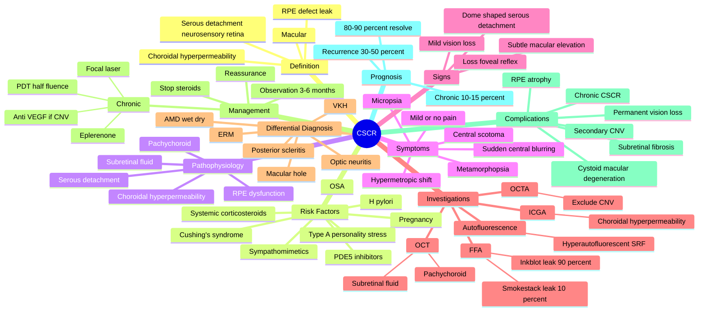

# Central Serous Chorioretinopathy (CSCR)

Related: [[AMD]], [[Diabetic Retinopathy]], [[Hypertensive Retinopathy]], [[Chronic Visual Loss]]

> [!info] **FCPS/MRCP Priority: HIGH — Common cause of central visual distortion in young to middle-aged adults**
> CSCR is a **serous detachment of the neurosensory retina** at the macula due to leakage through a defect in the retinal pigment epithelium (RPE), associated with choroidal hyperpermeability. Strongly linked to **corticosteroid use, type A personality, stress, pregnancy, and Cushing's**. Usually self-limiting; chronic and recurrent forms can cause permanent vision loss.

## Learning Objectives

- [ ] Define CSCR and identify the typical patient (30-50 years, male, type A personality, stress, recent steroid use).
- [ ] Describe the pathophysiology: choroidal hyperpermeability → RPE defect → subretinal fluid accumulation → serous neurosensory retinal detachment at the macula.
- [ ] List the risk factors: systemic corticosteroid use, Cushing's syndrome, pregnancy, type A personality, H. pylori, sympathomimetics, sildenafil, tadalafil, obstructive sleep apnoea.
- [ ] Recognise the clinical features: sudden central vision blurring, micropsia, metamorphopsia, central scotoma; mild or no pain; normal or near-normal fundus early.
- [ ] Identify diagnostic features on OCT (subretinal fluid, thickened choroid), fluorescein angiography (smokestack or inkblot leak), and indocyanine green angiography (choroidal hyperpermeability).
- [ ] Differentiate from AMD (older, drusen, CNV), optic neuritis (RAPD, pain on EOM, MRI), and macular hole (central dark spot, stage 1-4).
- [ ] Manage acute CSCR: observation, risk factor modification (stop steroids if possible), reassurance. Chronic/recurrent: photodynamic therapy (PDT), focal laser, eplerenone, anti-VEGF off-label.
- [ ] Recognise complications: chronic CSCR, RPE atrophy, subretinal neovascularisation, secondary CNV.

---

## 1. Definition

Central serous chorioretinopathy (CSCR; also called central serous retinopathy, CSR) is an **acquired serous detachment of the neurosensory retina** at the macula, caused by leakage of fluid from the choroid through a defect in the retinal pigment epithelium (RPE). The condition typically affects young to middle-aged adults, with a strong male predominance, and is associated with corticosteroid use, stress, and type A personality.

## 2. Pathophysiology

The exact mechanism is unclear, but the accepted model involves:

1. **Choroidal hyperpermeability** — increased blood flow and leakage from the choriocapillaris
2. **RPE dysfunction** — focal RPE defect ("blow-out" or "leak") allows fluid to pass from choroid into the subretinal space
3. **Subretinal fluid accumulation** — serous detachment of the neurosensory retina at the macula
4. **Visual distortion** — the elevation of the macula causes micropsia, metamorphopsia, hypermetropisation

Choroidal thickness is increased (pachychoroid) on enhanced-depth imaging OCT. The RPE "leak" on FFA is the hallmark.

## 3. Risk Factors

| Category | Specific Factors |
|---|---|
| **Drugs** | **Systemic corticosteroid use** (most important, dose-dependent); nasal/inhaled steroids; anabolic steroids |
| **Endocrine** | Cushing's syndrome, pregnancy (3rd trimester, resolves post-partum) |
| **Behavioural** | Type A personality, stress, sleep disturbance |
| **Drugs** | Sympathomimetics (pseudoephedrine); PDE-5 inhibitors (sildenafil, tadalafil) — controversial |
| **Infections** | Helicobacter pylori (association; treatment may improve CSCR) |
| **Comorbidities** | Obstructive sleep apnoea, hypertension, autoimmune disease |
| **Refractive** | Hypermetropia, axial hyperopia |

## 4. Clinical Features

### Symptoms
- **Sudden onset** (over hours to days) **unilateral central blurring or distortion**
- **Micropsia** (objects appear smaller) — classic
- **Metamorphopsia** (wavy lines; Amsler grid shows distortion)
- **Central scotoma** (positive or negative)
- **Hypermetropic shift** (need for "plus" lens correction)
- **Mild or no pain**
- **Mild colour desaturation**
- Recurrent episodes common (~30-50%)

### Signs

| Sign | Comment |
|---|---|
| Visual acuity | Often 6/9 to 6/24; may be near-normal in early/mild cases |
| Amsler grid | Metamorphopsia (wavy lines), central relative scotoma |
| Fundus (early) | **Subtle macular elevation, loss of foveal reflex; may appear normal** |
| Fundus (later) | Well-circumscribed, dome-shaped serous detachment of neurosensory retina at macula |
| OCT | **Subretinal fluid (SRF), thickened choroid (pachychoroid), RPE irregularity** |
| FFA | **"Smokestack" leak** (10%) or **"inkblot" leak** (70-90%) at RPE defect |
| ICGA | **Choroidal hyperpermeability** in mid-late phase |
| Autofluorescence | Hyperautofluorescent area of subretinal fluid |

## 5. Investigations

| Investigation | Finding |
|---|---|
| **OCT (essential)** | Subretinal fluid; dome-shaped serous detachment; thickened choroid (pachychoroid); RPE irregularity; sometimes small pigment epithelial detachment (PED) |
| **Fundus fluorescein angiography (FFA)** | Early hyperfluorescent spot; expands as "**inkblot**" (70-90%) or vertical "**smokestack**" (10%) leak in late phase |
| **Indocyanine green angiography (ICGA)** | Choroidal hyperpermeability (mid-late phase); pachychoroid |
| **Autofluorescence** | Hyperautofluorescent area of subretinal fluid |
| **OCT-angiography (OCTA)** | Excludes CNV; may show choroidal neovascular network in chronic cases |
| Visual fields | Central relative scotoma |
| Amsler grid | Metamorphopsia |

## 6. Differential Diagnosis

| Condition | Distinguishing Features |
|---|---|
| **AMD (wet)** | Older, drusen, CNV on FFA, subretinal haemorrhage |
| **AMD (dry)** | Drusen, RPE atrophy, no SRF (geographic atrophy) |
| **Optic neuritis** | RAPD, pain on EOM, ↓colour vision, MRI demyelination |
| **Macular hole** | Central dark spot, stage 1-4, OCT full-thickness defect |
| **Epiretinal membrane** | Cellophane maculopathy, vessel distortion |
| **Vogt-Koyanagi-Harada (VKH)** | Bilateral, exudative RD, panuveitis, meningeal symptoms |
| **Posterior scleritis** | Pain, choroidal folds, T-sign |
| **Choroidal tumour** | Mass lesion on B-scan |

## 7. Management

### Acute CSCR (first episode, no chronic changes)

**Step 1 — Reassurance + risk factor modification**
- Reassure: most cases resolve spontaneously in **3-6 months**
- **Stop or reduce systemic corticosteroids** if possible (most important intervention)
- Reduce stress, address type A behaviour
- Avoid sympathomimetics, PDE-5 inhibitors
- Treat H. pylori if positive (controversial)
- Treat obstructive sleep apnoea
- Smoking cessation

**Step 2 — Observation (3-6 months)**
- Monitor VA, OCT every 4-6 weeks
- Spontaneous resolution in **80-90%** of acute cases
- 30-50% have recurrence

**Step 3 — Treatment if persistent >3-6 months OR chronic/recurrent**
- **Focal laser photocoagulation** (classic) — to the RPE leak point; accelerates resolution but does not improve final VA
- **Photodynamic therapy (PDT)** with verteporfin (half-fluence) — preferred for chronic CSCR with persistent SRF; reduces choroidal hyperpermeability
- **Eplerenone** (mineralocorticoid receptor antagonist) — off-label; promising in chronic CSCR
- **Spironolactone** — alternative to eplerenone
- **Anti-VEGF** (ranibizumab, bevacizumab) — off-label; useful if secondary CNV
- **Subthreshold micropulse laser** — newer option

### Chronic CSCR (>6 months SRF, RPE changes, secondary CNV)
- PDT (half-fluence) is first-line
- Anti-VEGF if secondary CNV
- Consider mineralocorticoid antagonist (eplerenone)

## 8. Complications

| Complication | Mechanism |
|---|---|
| **Chronic CSCR** | Persistent SRF >6 months |
| **RPE atrophy** | Chronic detachment |
| **Cystoid macular degeneration** | Chronic outer retinal ischaemia |
| **Secondary CNV** (choroidal neovascularisation) | ~5-10% in chronic cases |
| **Subretinal fibrosis** | Organisation of chronic fluid |
| **Permanent vision loss** | Macular damage from chronic disease |
| **Recurrence** | 30-50% |

## 9. Prognosis

- **Acute CSCR:** excellent; ~80-90% recover VA to 6/9 or better within 3-6 months
- **Recurrence:** 30-50% over lifetime
- **Chronic CSCR:** 10-15% progress to chronic disease; visual loss may be permanent
- **Secondary CNV:** can lead to severe visual loss

## 10. FCPS/MRCP High-Yield Summary

| Topic | Key Point |
|---|---|
| Definition | Serous detachment of neurosensory retina at macula due to RPE leak |
| Typical patient | Male 30-50 years, type A personality, recent stress/steroid use |
| Most important risk factor | **Systemic corticosteroid use** |
| Other associations | Pregnancy, Cushing's, H. pylori, OSA, sympathomimetics |
| Symptoms | Micropsia, metamorphopsia, central scotoma, hypermetropic shift |
| OCT | Subretinal fluid, dome-shaped serous detachment, pachychoroid |
| FFA | "Smokestack" (10%) or "inkblot" (70-90%) leak at RPE |
| ICGA | Choroidal hyperpermeability |
| Most important intervention | **Stop steroids** if possible |
| Spontaneous resolution | 80-90% of acute cases in 3-6 months |
| Chronic / refractory | PDT (half-fluence), eplerenone, focal laser |
| Secondary CNV | ~5-10% in chronic; treat with anti-VEGF |
| Differentiate from AMD | CSCR = younger, no drusen; AMD = older, drusen, CNV |
| Differentiate from optic neuritis | CSCR = no RAPD, no pain on EOM, no MRI changes |

## 11. Viva Questions

| Question | Expected Answer |
|---|---|
| What is the most important risk factor for CSCR? | Systemic corticosteroid use. |
| How does CSCR present? | Sudden unilateral central blurring, micropsia, metamorphopsia, central scotoma, hypermetropic shift. |
| What does the fundus show? | Subtle macular elevation, dome-shaped serous detachment at macula; may appear normal early. |
| How is CSCR diagnosed? | OCT (subretinal fluid), FFA (inkblot/smokestack leak), ICGA (choroidal hyperpermeability). |
| What is the first-line management of acute CSCR? | Stop steroids, reassure, observe for 3-6 months. Spontaneous resolution in 80-90%. |
| When is photodynamic therapy used? | Chronic CSCR (>6 months SRF) or recurrent disease. Half-fluence PDT with verteporfin. |
| What is the role of eplerenone? | Mineralocorticoid receptor antagonist; off-label; reduces choroidal thickness and subretinal fluid. |
| How do you differentiate CSCR from AMD? | CSCR = younger, no drusen, no CNV, RPE leak on FFA. AMD = older, drusen, ± CNV, ± haemorrhage. |
| What is the "smokestack" sign? | A pattern of RPE leak on FFA: hyperfluorescent point expands vertically upward in a column ("smoke from a stack"). Seen in ~10% of CSCR. |
| What percentage of CSCR recurs? | 30-50%. |

## 12. Common Confusions / Exam Traps

| Confusion | Clarification |
|---|---|
| "CSCR is a retinal vascular disease" | No — it's a RPE + choroidal disorder with secondary retinal detachment. |
| "CSCR needs urgent laser" | No — most acute cases self-resolve. Reserve laser for chronic/refractory. |
| "CSCR and AMD are the same" | No — CSCR is younger, no drusen, RPE leak; AMD is older, drusen, CNV. |
| "Steroids cure CSCR" | Wrong — steroids CAUSE or worsen CSCR. Stop if possible. |
| "CSCR causes pain" | No — usually painless. Pain suggests alternative diagnosis (scleritis, optic neuritis). |
| "All CSCR needs treatment" | No — 80-90% of acute cases self-resolve with conservative management. |
| "CSCR is bilateral" | Usually unilateral; bilateral suggests pregnancy, Cushing's, or steroid use. |

## 13. Mnemonics

1. **"CSCR = CorticoSteroid Cause Retinopathy"** — corticosteroids are the most important modifiable risk factor.
2. **"CSCR = Central Scotoma, Central Scotoma, Central Scotoma"** (or "Smokestack on FFA, SRF on OCT, RPE leak, Resolve spontaneously") — key features.
3. **"Micropsia, Metamorphopsia, Macula"** — the 3 M's of CSCR symptoms.
4. **"Type A + Tablet"** (corticosteroid) = classic CSCR patient.
5. **"Inkblot (90%) > Smokestack (10%)"** — commonest FFA pattern.

## 14. Mind Map

## 15. One-Page Revision Card

| Domain | Key Points |
|---|---|
| Definition | Serous neurosensory retinal detachment at macula due to RPE leak |
| Patient | Male 30-50, type A personality, recent steroid use |
| Most important risk factor | **Systemic corticosteroid use** |
| Other risk factors | Pregnancy, Cushing's, H. pylori, OSA, sympathomimetics |
| Symptoms | Micropsia, metamorphopsia, central scotoma, hypermetropic shift, painless |
| OCT | Subretinal fluid, dome-shaped detachment, pachychoroid |
| FFA | Inkblot leak (90%) / Smokestack leak (10%) |
| ICGA | Choroidal hyperpermeability |
| First-line | Stop steroids, reassure, observe 3-6 months |
| Spontaneous resolution | 80-90% of acute cases |
| Treatment if chronic | PDT (half-fluence), focal laser, eplerenone, anti-VEGF (CNV) |
| Chronic = | SRF >6 months, RPE changes |
| Complications | Chronic disease, RPE atrophy, secondary CNV (5-10%) |
| Recurrence | 30-50% |

## 16. Spaced Repetition Trackers

| Review Interval | Date | Score (0-5) | Notes |
|---|---|---|---|
| Day 1 | | | |
| Day 3 | | | |
| Day 7 | | | |
| Day 14 | | | |
| Day 30 | | | |
| Day 90 | | | |

## 17. Self-Test Scorecard

| Section | Score /5 | Last Attempt |
|---|---|---|
| Definition / Patient profile | | |
| Risk factors (steroids) | | |
| Pathophysiology | | |
| Clinical features (micropsia etc.) | | |
| Investigations (OCT, FFA) | | |
| Differential diagnosis | | |
| Management (stop steroids, observe) | | |
| Chronic / refractory | | |
| Complications (CNV) | | |
| Mnemonics | | |
| MCQ Performance | | |
| SBA Performance | | |
| Viva Confidence | | |
| **Total** | **/65** | |

> **Interpretation:** <45 = weak, 45-58 = acceptable, 58+ = strong.

## 18. Exam Answer Modes

### Long Answer Skeleton
1. Definition + typical patient
2. Pathophysiology (choroidal hyperpermeability + RPE leak + SRF)
3. Risk factors (corticosteroids most important; list 4-5)
4. Symptoms (micropsia, metamorphopsia, central scotoma, hypermetropic shift)
5. Signs (subtle macular elevation, dome-shaped serous detachment)
6. Investigations (OCT = SRF + pachychoroid; FFA = inkblot/smokestack; ICGA = hyperpermeability)
7. Differential diagnosis (AMD, optic neuritis, macular hole, ERM)
8. Management (stop steroids, observation, PDT/chronic, anti-VEGF for CNV)
9. Complications (chronic, RPE atrophy, CNV)
10. Prognosis (80-90% resolve, 30-50% recur)

### Short Note Skeleton
- Definition, patient profile, key risk factor (steroids), symptoms, OCT/FFA findings, management, complications.

### Viva One-Liners
- "What is the most important risk factor for CSCR?"
- "What is the 'smokestack' sign?"
- "How is CSCR different from AMD?"
- "First-line management of acute CSCR?"
- "When is PDT used?"

### Ward-Case Discussion Points
- Always ask about steroid use (oral, inhaled, nasal, joint injection)
- Ask about pregnancy, Cushing's features, sleep apnoea
- OCT to confirm subretinal fluid
- Reassure; most cases self-resolve
- Stop/reduce steroids if clinically possible
- Monitor every 4-6 weeks
- Refer to retina clinic if chronic or recurrent

### Last-Night-Before-Exam Sheet
- **Top 5 facts:** CSCR = young male + steroids + micropsia + RPE leak on FFA; 80-90% resolve; stop steroids; PDT for chronic; CNV in 5-10%
- **3 drug doses:** PDT verteporfin (half-fluence); Eplerenone 25-50 mg/day PO; Anti-VEGF for secondary CNV
- **2 algorithms:** Acute (stop steroids + observe); Chronic/recurrent (PDT, eplerenone, anti-VEGF)
- **1 mnemonic:** "CSCR = CorticoSteroid Cause Retinopathy" + "Micropsia, Metamorphopsia, Macula"

## 19. Summary

Central serous chorioretinopathy (CSCR) is an acquired serous detachment of the neurosensory retina at the macula, caused by leakage from the choroid through a defect in the retinal pigment epithelium (RPE). It typically affects young to middle-aged men (30-50) with a type A personality, and is strongly associated with **systemic corticosteroid use** (the most important modifiable risk factor). Other associations include pregnancy, Cushing's syndrome, H. pylori, OSA, and sympathomimetics. Clinical features include sudden central blurring, **micropsia** (objects appear smaller), **metamorphopsia** (wavy lines on Amsler grid), central scotoma, and a hypermetropic shift. Fundus may appear normal early; later shows a dome-shaped serous detachment. Diagnosis is confirmed by **OCT** (subretinal fluid, pachychoroid), **FFA** (inkblot leak in 90%, smokestack leak in 10%), and **ICGA** (choroidal hyperpermeability). First-line management is **stopping steroids** if possible, reassurance, and observation — **80-90% of acute cases resolve spontaneously in 3-6 months**. Chronic or recurrent disease is treated with **half-fluence photodynamic therapy (PDT)**, eplerenone, focal laser, or anti-VEGF for secondary CNV. Complications include chronic CSCR, RPE atrophy, and secondary choroidal neovascularisation (~5-10%).

## 20. MCQs (10)

**1. The most important modifiable risk factor for central serous chorioretinopathy is:**
A. Hypertension
B. Diabetes mellitus
C. Systemic corticosteroid use
D. Smoking
**Answer: C**

**2. The typical patient with CSCR is:**
A. Female over 60 with drusen
B. Male 30-50 with type A personality
C. Child with retinal dystrophy
D. Pregnant woman with retinal detachment
**Answer: B**

**3. On fluorescein angiography, the most common pattern of RPE leak in CSCR is:**
A. Smokestack
B. Inkblot
C. Lacy filling
D. Petaloid
**Answer: B**

**4. The OCT hallmark of CSCR is:**
A. Intraretinal cystoid spaces
B. Subretinal fluid (SRF) with thickened choroid (pachychoroid)
C. Full-thickness macular defect
D. Hyperreflective epiretinal membrane
**Answer: B**

**5. The first-line management of a first episode of acute CSCR is:**
A. Immediate pars plana vitrectomy
B. Intravitreal anti-VEGF
C. Stop steroids if possible, reassure, observe for 3-6 months
D. Photodynamic therapy with verteporfin
**Answer: C**

**6. Spontaneous resolution of acute CSCR occurs in approximately what percentage of cases?**
A. 10-20%
B. 30-40%
C. 50-60%
D. 80-90%
**Answer: D**

**7. CSCR is most reliably differentiated from neovascular AMD by:**
A. Age of patient and presence of drusen
B. Colour of fundus
C. Severity of visual loss
D. Tonometry
**Answer: A**

**8. Half-fluence photodynamic therapy with verteporfin is the treatment of choice for:**
A. First episode of acute CSCR
B. Chronic CSCR with persistent SRF
C. Diabetic macular oedema
D. Central retinal vein occlusion
**Answer: B**

**9. Micropsia (objects appearing smaller than actual size) in CSCR is caused by:**
A. Lens opacification
B. Macular elevation separating photoreceptors
C. Optic nerve inflammation
D. Vitreous detachment
**Answer: B**

**10. Secondary choroidal neovascularisation (CNV) complicates approximately what percentage of chronic CSCR cases?**
A. <1%
B. 5-10%
C. 30-40%
D. 50%
**Answer: B**

## 21. SBA Questions (10)

**1. A 38-year-old man on high-dose oral prednisolone for autoimmune disease presents with sudden central blurring and micropsia. Fundus shows subtle macular elevation. The most likely diagnosis is:**
A. AMD
B. CSCR
C. Optic neuritis
D. Retinal detachment
**Answer: B — Steroid use + young male + micropsia = CSCR**

**2. The most important intervention in a patient with acute CSCR who is on systemic steroids is:**
A. Immediate anti-VEGF
B. Vitrectomy
C. Stop or reduce steroids if clinically possible
D. Photodynamic therapy
**Answer: C — Steroid cessation is the most important intervention**

**3. Which investigation is the gold standard for visualising choroidal hyperpermeability in CSCR?**
A. OCT
B. FFA
C. ICGA
D. Visual field
**Answer: C — Indocyanine green angiography shows choroidal hyperpermeability**

**4. A 35-year-old woman develops CSCR in her 3rd trimester of pregnancy. The most appropriate management is:**
A. Immediate PDT
B. Reassurance and observation (most cases resolve post-partum)
C. Intravitreal anti-VEGF
D. High-dose oral steroid
**Answer: B — Pregnancy-related CSCR usually resolves after delivery**

**5. The "inkblot" pattern on FFA refers to:**
A. Vertical column of hyperfluorescence expanding upward
B. Round area of hyperfluorescence expanding centrifugally like ink on paper
C. Petaloid hyperfluorescence around the fovea
D. Window defect in the RPE
**Answer: B — Inkblot = expanding round hyperfluorescence (90% of CSCR)**

**6. A patient with CSCR has persistent subretinal fluid for 8 months with RPE changes. The most appropriate treatment is:**
A. Continued observation
B. Half-fluence PDT with verteporfin
C. Topical steroid
D. Oral acetazolamide
**Answer: B — Half-fluence PDT is the first-line for chronic CSCR**

**7. The most appropriate systemic therapy to consider in chronic CSCR (off-label) is:**
A. Methotrexate
B. Eplerenone
C. Cyclophosphamide
D. Rituximab
**Answer: B — Eplerenone is a mineralocorticoid antagonist; off-label in CSCR**

**8. CSCR is most commonly associated with which personality type?**
A. Type A (driven, competitive, time-pressured)
B. Type B (relaxed, easy-going)
C. Type C (suppressed emotions, conflict-avoidant)
D. Type D (distressed, negative affectivity)
**Answer: A — Type A personality is classically associated**

**9. A 40-year-old with CSCR has metamorphopsia on Amsler grid testing. The most appropriate counselling is:**
A. "This will resolve in 1-2 weeks"
B. "Spontaneous resolution in 80-90% of cases within 3-6 months; recurrence possible"
C. "You will need surgery"
D. "You will definitely go blind"
**Answer: B — Reassure about natural history; recurrence is common**

**10. A patient with chronic CSCR develops sudden worsening of vision with subretinal haemorrhage at the macula. The most likely complication is:**
A. Macular hole
B. Secondary choroidal neovascularisation (CNV)
C. Retinal detachment
D. Optic neuritis
**Answer: B — Sudden worsening + subretinal haemorrhage = secondary CNV**

## 22. Flashcards

- **Q:** Most important risk factor for CSCR?
  **A:** Systemic corticosteroid use
- **Q:** Typical patient?
  **A:** Male 30-50, type A personality, recent steroid use
- **Q:** Key symptom triad?
  **A:** Micropsia, metamorphopsia, central scotoma
- **Q:** OCT finding?
  **A:** Subretinal fluid + pachychoroid
- **Q:** FFA findings?
  **A:** Inkblot leak (90%) / Smokestack leak (10%)
- **Q:** First-line management of acute CSCR?
  **A:** Stop steroids, reassure, observe 3-6 months
- **Q:** Spontaneous resolution rate?
  **A:** 80-90% of acute cases
- **Q:** Treatment for chronic CSCR?
  **A:** Half-fluence PDT
- **Q:** Recurrence rate?
  **A:** 30-50%
- **Q:** Complication of chronic CSCR?
  **A:** Secondary CNV (~5-10%)

## 23. Answer Key with Explanations

### MCQs
1. **C** — Systemic corticosteroid use is the most important modifiable risk factor for CSCR, with a dose-dependent relationship.
2. **B** — CSCR classically affects men aged 30-50 with a type A personality.
3. **B** — The inkblot pattern (round, expanding hyperfluorescence) is the most common FFA pattern in CSCR (~90%); smokestack is less common (~10%).
4. **B** — The OCT hallmark is subretinal fluid (SRF) with thickened choroid (pachychoroid).
5. **C** — First-line management of acute CSCR is to stop steroids if possible, reassure, and observe for 3-6 months; 80-90% resolve spontaneously.
6. **D** — 80-90% of acute CSCR cases resolve spontaneously within 3-6 months.
7. **A** — CSCR is differentiated from neovascular AMD primarily by patient age (younger in CSCR) and absence of drusen (in CSCR).
8. **B** — Half-fluence PDT with verteporfin is the treatment of choice for chronic CSCR with persistent subretinal fluid.
9. **B** — Micropsia in CSCR is caused by the elevation of the macula, which separates the photoreceptors, making images appear smaller.
10. **B** — Secondary CNV complicates approximately 5-10% of chronic CSCR cases and can lead to severe visual loss.

### SBAs
1. **B** — Steroid use + young male + micropsia + macular elevation = CSCR.
2. **C** — Stopping or reducing steroids (if clinically possible) is the most important intervention in acute CSCR.
3. **C** — ICGA is the gold standard for visualising choroidal hyperpermeability.
4. **B** — Pregnancy-related CSCR typically resolves after delivery; observation is appropriate.
5. **B** — The inkblot pattern is a round, expanding area of hyperfluorescence.
6. **B** — Half-fluence PDT is first-line for chronic CSCR with persistent SRF.
7. **B** — Eplerenone (mineralocorticoid antagonist) is used off-label in chronic CSCR.
8. **A** — Type A personality is classically associated with CSCR.
9. **B** — Reassure about the natural history: 80-90% resolve, but recurrence is common (30-50%).
10. **B** — Sudden worsening with subretinal haemorrhage in chronic CSCR suggests secondary CNV.

## 24. Local Navigation

- **Parent Hub:** [[Retina and Vitreous Hub]]
- **Related:** [[AMD]] · [[Diabetic Retinopathy]] · [[Hypertensive Retinopathy]] · [[Vitreous Haemorrhage]] · [[Retinal Detachment]]
- **Related (Approach):** [[Chronic Visual Loss]] · [[Acute Visual Loss (Approach)]]
- **Related (Drugs):** [[../Endocrinology/Cushing's Syndrome]] · [[../Dermatology/Topical Steroid Use]]
- **Chapter MOC:** [[Medical Ophthalmology MOC]]
- **Chapter Hierarchy:** [[Davidson Chapter 27 - Medical Ophthalmology Hierarchy]]
- **Cross-chapter:** [[../Endocrinology]] · [[../Respiratory/Obstructive Sleep Apnoea]]

## 25. Tags

#medicine #davidson #ophthalmology #CSCR #macula #RPE #corticosteroid #micropsia #PDT #fcps #mrcp
---

> Auto-generated study sections for "08_Retina_and_Vitreous" — Ch 28: Medical Ophthalmology.

## Flashcards (22 generated)

- Q: What is the definition of 08_Retina_and_Vitreous?
  A: Related: [[AMD]], [[Diabetic Retinopathy]], [[Hypertensive Retinopathy]], [[Chronic Visual Loss]]
- Q: What is Visual acuity of 08_Retina_and_Vitreous?
  A: Often 6/9 to 6/24; may be near-normal in early/mild cases
- Q: What is Amsler grid of 08_Retina_and_Vitreous?
  A: Metamorphopsia (wavy lines), central relative scotoma
- Q: What is Fundus (early) of 08_Retina_and_Vitreous?
  A: Subtle macular elevation, loss of foveal reflex; may appear normal
- Q: What is Fundus (later) of 08_Retina_and_Vitreous?
  A: Well-circumscribed, dome-shaped serous detachment of neurosensory retina at macula
- Q: What is OCT of 08_Retina_and_Vitreous?
  A: Subretinal fluid (SRF), thickened choroid (pachychoroid), RPE irregularity
- Q: What is FFA of 08_Retina_and_Vitreous?
  A: "Smokestack" leak (10%) or "inkblot" leak (70-90%) at RPE defect
- Q: What is ICGA of 08_Retina_and_Vitreous?
  A: Choroidal hyperpermeability in mid-late phase
- Q: What is OCT (essential) of 08_Retina_and_Vitreous?
  A: Subretinal fluid; dome-shaped serous detachment; thickened choroid (pachychoroid); RPE irregularity; sometimes small pigment epithelial detachment (PED)
- Q: What is Fundus fluorescein angiography (FFA) of 08_Retina_and_Vitreous?
  A: Early hyperfluorescent spot; expands as "inkblot" (70-90%) or vertical "smokestack" (10%) leak in late phase
- Q: What is Indocyanine green angiography (ICGA) of 08_Retina_and_Vitreous?
  A: Choroidal hyperpermeability (mid-late phase); pachychoroid
- Q: What is Autofluorescence of 08_Retina_and_Vitreous?
  A: Hyperautofluorescent area of subretinal fluid
- Q: What is OCT-angiography (OCTA) of 08_Retina_and_Vitreous?
  A: Excludes CNV; may show choroidal neovascular network in chronic cases
- Q: What is Visual fields of 08_Retina_and_Vitreous?
  A: Central relative scotoma
- Q: What is Visual acuity of 08_Retina_and_Vitreous?
  A: Often 6/9 to 6/24; may be near-normal in early/mild cases
- Q: What is Amsler grid of 08_Retina_and_Vitreous?
  A: Metamorphopsia (wavy lines), central relative scotoma
- Q: What is Fundus (early) of 08_Retina_and_Vitreous?
  A: Subtle macular elevation, loss of foveal reflex; may appear normal
- Q: What is Fundus (later) of 08_Retina_and_Vitreous?
  A: Well-circumscribed, dome-shaped serous detachment of neurosensory retina at macula
- Q: What is OCT of 08_Retina_and_Vitreous?
  A: Subretinal fluid (SRF), thickened choroid (pachychoroid), RPE irregularity
- Q: What is FFA of 08_Retina_and_Vitreous?
  A: "Smokestack" leak (10%) or "inkblot" leak (70-90%) at RPE defect
- Q: What is ICGA of 08_Retina_and_Vitreous?
  A: Choroidal hyperpermeability in mid-late phase
- Q: What is Autofluorescence of 08_Retina_and_Vitreous?
  A: Hyperautofluorescent area of subretinal fluid

## MCQs (1 generated)

1. **Which of the following best describes 08_Retina_and_Vitreous?**
   A. **Related: [[AMD]], [[Diabetic Retinopathy]], [[Hypertensive Retinopathy]], [[Chronic Visual Loss]]**
   B. An unrelated condition not matching the clinical picture of 08_Retina_and_Vitreous
   C. A complication seen late in the disease course of 08_Retina_and_Vitreous
   D. A condition that mimics 08_Retina_and_Vitreous but has a different underlying cause

## SBA Questions (1 generated)

1. A patient with suspected 08_Retina_and_Vitreous presents with: Related: [[AMD]], [[Diabetic Retinopathy]], [[Hypertensive Retinopathy]], [[Chronic Visual Loss]]. What is the most likely diagnosis?
   A. **08_Retina_and_Vitreous**
   B. A condition that mimics 08_Retina_and_Vitreous but is not the same entity
   C. A complication of 08_Retina_and_Vitreous rather than the primary diagnosis
   D. An unrelated condition in the same clinical category as 08_Retina_and_Vitreous

