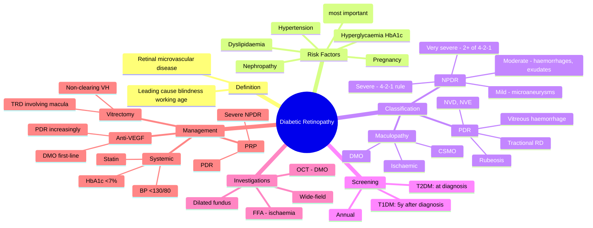

# Diabetic Retinopathy

Related: [[Diabetes Mellitus (Ocular)]], [[Age-related Macular Degeneration (AMD)]], [[Central Retinal Vein Occlusion (CRVO)]]

> [!tip] **FCPS/MRCP Priority: CRITICAL**
> Leading cause of blindness in working-age adults. Annual screening. NPDR (mild/mod/severe) → PDR. Treat severe NPDR, PDR, and CSMO with laser, anti-VEGF, ± vitrectomy.

---

## Learning Objectives
- [ ] Define diabetic retinopathy and state its epidemiology
- [ ] Classify NPDR (mild/moderate/severe) using the 4-2-1 rule
- [ ] Identify PDR features (NVD, NVE, VH, tractional RD, rubeosis)
- [ ] Recognise DMO/CSMO and its clinical significance
- [ ] List modifiable and non-modifiable risk factors
- [ ] Apply screening guidelines
- [ ] Describe management (systemic, anti-VEGF, PRP, vitrectomy)
- [ ] Interpret OCT and FFA findings

---

## 1. Definition / Epidemiology / Classification

### Definition
- **Diabetic retinopathy (DR):** Retinal microvascular complications of diabetes mellitus
- Microaneurysms, haemorrhages, exudates, ischaemia, neovascularisation
- Leading cause of blindness in working-age adults (20–74 y) in developed countries

### Epidemiology
- ~30% of diabetics have some form of DR
- ~10% have vision-threatening DR (VTDR)
- Type 1: 25% at 5 y, 80% at 15 y
- Type 2: 25% at 5 y, 50–80% at 20 y

### Classification
- **Non-proliferative (NPDR)** — mild, moderate, severe, very severe
- **Proliferative (PDR)** — neovascularisation, vitreous haemorrhage, tractional RD
- **Diabetic maculopathy** — DMO (most common cause of vision loss in DR), ischaemic

---

## 2. Aetiology / Pathophysiology

### Pathogenesis
- Chronic hyperglycaemia → polyol pathway activation, AGEs, oxidative stress, PKC activation
- **Microaneurysms** (outpouchings of capillary wall — earliest clinically visible)
- **Pericyte loss** → weakened capillaries → leakage, haemorrhage
- **Capillary closure** → retinal ischaemia
- **Ischaemia** → VEGF release → neovascularisation (PDR)
- **Breakdown of blood-retinal barrier** → exudation → macular oedema

### Stages
1. **Mild NPDR:** Microaneurysms only
2. **Moderate NPDR:** Microaneurysms, dot/blot haemorrhages, hard exudates
3. **Severe NPDR:** 4-2-1 rule (see below)
4. **Very severe NPDR:** ≥2 of 4-2-1 criteria
5. **PDR:** Neovascularisation (NVD, NVE), vitreous/preretinal haemorrhage, tractional RD
6. **Advanced PDR:** Fibrous proliferation, tractional RD, neovascular glaucoma

### Maculopathy
- **DMO/CMO** (most common cause of visual loss)
- **Ischaemic maculopathy** (poor prognosis)
- **CSMO (clinically significant macular oedema)** — per ETDRS criteria

---

## 3. Risk Factors

### Non-Modifiable
- **Duration of diabetes** (most important)
- Type 1 > Type 2 (more aggressive)
- Genetic predisposition
- Pregnancy

### Modifiable
- **Hyperglycaemia** (HbA1c — DCCT, UKPDS)
- **Hypertension** (UKPDS — tight BP control ↓ progression)
- **Dyslipidaemia** (hard exudates, ↑CSMO risk)
- **Nephropathy / microalbuminuria**
- **Anaemia**
- **Smoking**

---

## 4. Screening

### Guidelines
- **Type 1 DM:** Annual screening from 5 years after diagnosis (or from puberty if earlier)
- **Type 2 DM:** Annual screening from time of diagnosis (50% have DR at diagnosis)
- **Pregnancy:** Each trimester (gestational diabetes not at risk)
- **No DR:** Annual review
- **Mild/moderate NPDR:** 6–12 monthly
- **Severe NPDR/PDR/CSMO:** 3–4 monthly or refer to ophthalmologist

### Methods
- Dilated fundus examination (slit-lamp + 90D/78D)
- Stereoscopic fundus photography (7-field, ETDRS standard)
- Wide-field imaging (Optos)
- OCT (macula)
- FFA (suspected ischaemia, neovascularisation, CSMO)

---

## 5. Clinical Features

### History
- Often asymptomatic until advanced
- Floaters (vitreous haemorrhage)
- Blurred central vision (DMO, maculopathy)
- Distortion (CSMO, epiretinal membrane)
- Scotomata (ischaemia, infarction)
- "Cobwebs," "red haze" (vitreous haemorrhage)
- Pain (rare, unless neovascular glaucoma)
- May present with retinal detachment, sudden vision loss

### Examination
- **Visual acuity:** Variable
- **Slit-lamp:** Iris rubeosis (NVI), lens status
- **Tonometry:** IOP (elevated in NVG)
- **Dilated fundus:**
  - **Microaneurysms** (earliest sign)
  - **Dot/blot haemorrhages** (deep retinal)
  - **Flame haemorrhages** (NFL)
  - **Hard exudates** (lipid, yellow, waxy)
  - **Cotton wool spots** (NFL infarcts)
  - **Venous beading** (severe NPDR)
  - **IRMA** (intraretinal microvascular abnormalities)
  - **Neovascularisation:** NVD (disc) / NVE (elsewhere)
  - **Vitreous / preretinal haemorrhage**
  - **Tractional RD** (fibrovascular proliferation)
  - **Macular oedema** (hard exudates near fovea, retinal thickening)
  - **RAPD** (severe, ischaemic)

---

## 6. Investigations

- **Visual acuity**
- **Slit-lamp biomicroscopy** (rubeosis, lens)
- **Tonometry**
- **Dilated fundus examination** (indirect preferred, 90D/78D)
- **OCT (Optical Coherence Tomography):** Gold standard for DMO (central retinal thickness, IRF/SRF)
- **FFA:** Ischaemia, neovascularisation, microaneurysms, leakage, maculopathy
- **Wide-field imaging:** Peripheral ischaemia
- **OCT-A:** Non-invasive capillary detail
- **B-scan US:** Vitreous haemorrhage obscuring view (look for RD)

---

## 7. FCPS/MRCP High-Yield Summary

| Category | Key Points |
|----------|------------|
| Most important risk | Duration of diabetes |
| Glycaemic target | HbA1c < 7% |
| BP target | <130/80 mmHg |
| Lipids | Statin |
| Screening T1DM | From 5 y after diagnosis, then yearly |
| Screening T2DM | At diagnosis, then yearly |
| 4-2-1 rule | Severe NPDR: 20+ IRH in 4Q, OR VB in 2Q, OR IRMA in 1Q |
| PDR | Neovascularisation (NVD/NVE), VH, tractional RD, rubeosis |
| DMO | Most common cause of vision loss |
| Anti-VEGF | First-line for centre-involving DMO and PDR |
| PRP | For PDR (and severe NPDR) |
| Vitrectomy | Non-clearing VH, tractional RD involving macula |

---

## 8. Viva Questions

1. **Q:** What is the 4-2-1 rule?
   **A:** Severe NPDR: >20 intraretinal haemorrhages in 4 quadrants OR venous beading in 2+ quadrants OR IRMA in 1+ quadrant.

2. **Q:** What is the most common cause of visual loss in DR?
   **A:** Diabetic macular oedema (DMO).

3. **Q:** When does PDR develop?
   **A:** Progression from severe NPDR when extensive retinal ischaemia drives VEGF release → neovascularisation.

4. **Q:** What is the first-line treatment for centre-involving DMO?
   **A:** Intravitreal anti-VEGF (ranibizumab, aflibercept, bevacizumab, faricimab).

5. **Q:** When is PRP indicated?
   **A:** PDR (high-risk), severe NPDR (some cases), poor compliance with anti-VEGF.

6. **Q:** What are the modifiable risk factors for DR?
   **A:** Glycaemia (HbA1c <7%), BP (<130/80), lipids (statin), smoking cessation.

7. **Q:** What is CSMO?
   **A:** Clinically significant macular oedema (ETDRS criteria) — any of: (a) retinal thickening within 500 μm of fovea, (b) hard exudates within 500 μm of fovea with adjacent thickening, (c) retinal thickening ≥ 1 disc area within 1 DD of fovea.

8. **Q:** When is vitrectomy indicated in DR?
   **A:** Non-clearing vitreous haemorrhage (typically >3 months), tractional RD involving macula, combined tractional-rhegmatogenous RD, premacular haemorrhage, persistent DMO with vitreomacular traction.

---

## 9. Common Confusions / Exam Traps

| Confusion | Clarification |
|-----------|---------------|
| "PRP is for DMO" | PRP is for PDR (retinal ischaemia). Focal/grid laser or anti-VEGF for DMO |
| "Anti-VEGF and PRP are alternatives for DMO" | Anti-VEGF is first-line for centre-involving DMO; PRP is for PDR |
| "T2DM doesn't need screening for 5 years" | T2DM screening is AT DIAGNOSIS (often undetected for years) |
| "DR affects only the eyes" | It's a marker of microvascular disease — also check kidney, heart, nerves |
| "Vitrectomy is for any vitreous haemorrhage" | Vitrectomy for non-clearing VH (typically >3 months) or tractional RD involving macula |
| "NVD = NVE" | NVD = neovascularisation at disc (within 1 DD); NVE = neovascularisation elsewhere (more peripheral). High-risk PDR = NVD ≥ 1/4–1/3 disc area or VH with NVE |
| "CSMO = any DMO" | CSMO is a specific ETDRS definition; not all DMO is clinically significant |

---

## 10. Mnemonics

1. **"4-2-1 = Severe NPDR"** — **4** quadrants IRH (>20), **2** quadrants venous beading, **1** quadrant IRMA
2. **"Duration Drives DR"** — longer duration = higher risk
3. **"PRP PDR"** — PanRetinal Photocoagulation for Proliferative DR
4. **"DMO = Dumbest cause of MO blindness in DR"** — most common cause of vision loss
5. **"NVD on Disc, NVE Elsewhere"** — NVD = neovascularisation at disc; NVE = elsewhere

---

## 11. Mind Map

---

## 12. One-Page Revision Card

| **Topic** | **Diabetic Retinopathy** |
|-----------|--------------------------|
| **Most important risk** | Duration of diabetes |
| **Screening T1DM** | From 5 y after diagnosis, then yearly |
| **Screening T2DM** | At diagnosis, then yearly |
| **4-2-1 rule** | Severe NPDR: 20+ IRH in 4Q, OR VB in 2Q, OR IRMA in 1Q |
| **PDR** | NVD/NVE, VH, tractional RD, rubeosis |
| **Most common cause of vision loss** | DMO (CSMO) |
| **First-line for centre-involving DMO** | Intravitreal anti-VEGF |
| **PRP** | PDR, severe NPDR |
| **Vitrectomy** | Non-clearing VH (>3 mo), TRD involving macula |
| **Systemic targets** | HbA1c <7%, BP <130/80, statin |
| **Viva Pearl** | "Duration drives DR; DMO is the killer" |

---

## 13. Spaced Repetition Trackers

### 24-Hour Recall Prompts
- [ ] Define DR and state most important risk factor
- [ ] Recall the 4-2-1 rule (severe NPDR)
- [ ] State first-line treatment for centre-involving DMO
- [ ] List indications for PRP
- [ ] List indications for vitrectomy
- [ ] Outline screening intervals for T1DM and T2DM

### Revision Schedule
- [ ] **Day 1** completed (creation + 24h recall)
- [ ] **Day 3** revision completed
- [ ] **Day 7** revision completed
- [ ] **Day 15** revision completed
- [ ] **Day 30** revision completed
- [ ] **Day 90** revision completed

---

## 14. Must Know / Should Know / Nice to Know

### Must Know (Core for passing)
- [x] Definition and epidemiology
- [x] Risk factors (especially duration, glycaemia, BP)
- [x] 4-2-1 rule for severe NPDR
- [x] PDR features (NVD, NVE, VH, TRD, rubeosis)
- [x] DMO and CSMO
- [x] Screening intervals (T1DM vs T2DM)
- [x] First-line treatment for centre-involving DMO (anti-VEGF)
- [x] PRP for PDR
- [x] Vitrectomy indications

### Should Know (High probability)
- [x] Systemic targets (HbA1c, BP, lipids)
- [x] ETDRS classification details
- [x] Intravitreal steroid for DMO (pseudophakic)
- [x] DRCR.net Protocol S (anti-VEGF vs PRP)
- [x] Wide-field imaging
- [x] Pregnancy and DR
- [x] Nephropathy association

### Nice to Know (Differentiator)
- [ ] Histology of microaneurysms
- [ ] OCT-A features
- [ ] Faricimab (bispecific Ang-2/VEGF)
- [ ] Brolucizumab
- [ ] Anti-VEGF and systemic absorption
- [ ] Cataract surgery and DR progression

---

## 15. My Weak Points
- [ ] Add personal weak areas here

---

## 16. Self-Test Scorecard

| Section | Score /5 |
|---------|----------|
| Understanding: | /10 |
| Recall: | /10 |
| MCQ Performance: | /10 |
| SBA Performance: | /10 |
| Viva Confidence: | /10 |
| Total: | /50 |

> [!tip] **Interpretation:** <35 = weak topic, 35-44 = acceptable but insecure, 45+ = strong exam-ready topic.

---

## 17. Exam Answer Modes

### Long Answer Skeleton
1. Definition (microvascular complication of diabetes)
2. Epidemiology (leading cause of blindness in 20–74 y)
3. Risk factors (duration, glycaemia, BP, lipids, nephropathy, pregnancy)
4. Pathogenesis (polyol, AGEs, PKC, oxidative stress, VEGF)
5. Classification — NPDR (mild/moderate/severe/very severe), PDR, maculopathy
6. 4-2-1 rule (severe NPDR)
7. Clinical features
8. Investigations (fundus, OCT, FFA, wide-field)
9. Screening (T1DM 5y, T2DM at diagnosis, annual)
10. Management:
    - Systemic (HbA1c, BP, lipids, smoking)
    - Anti-VEGF (DMO first-line, PDR)
    - PRP (PDR)
    - Vitrectomy (non-clearing VH, TRD)
11. Complications and prognosis

### Short Note Skeleton
- Definition + risk factors
- 4-2-1 rule
- DMO and PDR
- First-line: anti-VEGF for DMO; PRP for PDR

### Viva One-Liners
- **Q:** Most important risk factor? → **A:** Duration of diabetes
- **Q:** 4-2-1 rule? → **A:** Severe NPDR: 20+ IRH in 4Q, OR VB in 2Q, OR IRMA in 1Q
- **Q:** First-line for centre-involving DMO? → **A:** Intravitreal anti-VEGF
- **Q:** When is PRP indicated? → **A:** PDR (high-risk), severe NPDR
- **Q:** When is vitrectomy indicated? → **A:** Non-clearing VH, TRD involving macula
- **Q:** When to start screening in T2DM? → **A:** At diagnosis
- **Q:** When to start screening in T1DM? → **A:** 5 years after diagnosis (or from puberty)

### Ward-Case Discussion Points
- Annual screening essential
- T2DM screen at diagnosis (often long undetected)
- Optimise systemic risk factors (HbA1c, BP, lipids)
- DMO is the most common cause of vision loss — check OCT
- Anti-VEGF for centre-involving DMO and now increasingly for PDR
- PRP for PDR, especially if poor compliance
- Vitrectomy for non-clearing VH or tractional RD involving macula
- Pregnancy can accelerate DR — review each trimester

### Last-Night-Before-Exam Sheet
- Top 3 facts: duration, 4-2-1, anti-VEGF for DMO
- 1 mnemonic: "4-2-1 = Severe NPDR"
- Must-know: T1DM screen 5y post-dx, T2DM screen at diagnosis
- First-line: anti-VEGF for centre-involving DMO
- Indications for PRP (PDR) and vitrectomy (non-clearing VH/TRD)

---

## 18. Summary

Diabetic retinopathy is the leading cause of blindness in working-age adults (20–74 y) in developed countries. Risk factors include duration of diabetes (most important), hyperglycaemia, hypertension, dyslipidaemia, pregnancy, and nephropathy. Classification is by NPDR (mild/moderate/severe using the 4-2-1 rule) → PDR (neovascularisation, vitreous haemorrhage, tractional RD) and maculopathy (DMO, CSMO). Screening is annual: from 5 years after diagnosis in T1DM and at diagnosis in T2DM. First-line treatment for centre-involving DMO is intravitreal anti-VEGF (ranibizumab, aflibercept, bevacizumab, faricimab); PRP is for PDR; vitrectomy for non-clearing vitreous haemorrhage or tractional RD involving the macula. Systemic optimisation (HbA1c <7%, BP <130/80, statin) is essential.

---

## 19. FCPS/MRCP High-Yield Detail Tables

### 19.1 NPDR Classification

| Grade | Features |
|-------|----------|
| **Mild** | Microaneurysms only |
| **Moderate** | Microaneurysms, dot/blot haemorrhages, hard exudates, cotton wool spots |
| **Severe (4-2-1)** | >20 IRH in 4 quadrants, OR venous beading in ≥2 quadrants, OR IRMA in ≥1 quadrant |
| **Very severe** | ≥2 of the 4-2-1 criteria |

### 19.2 PDR Features

| Feature | Description |
|---------|-------------|
| **NVD** | Neovascularisation at the disc (within 1 DD) |
| **NVE** | Neovascularisation elsewhere (periphery) |
| **Vitreous haemorrhage** | "Floaters," "red haze" |
| **Preretinal haemorrhage** | "Boat-shaped" |
| **Tractional RD** | From fibrovascular proliferation |
| **Rubeosis / NVI** | Iris neovascularisation |
| **Neovascular glaucoma** | From NVI + angle |

### 19.3 ETDRS Definition of CSMO

CSMO requires ≥1 of:
- Retinal thickening within 500 μm of the foveal centre
- Hard exudates within 500 μm of the foveal centre with adjacent retinal thickening
- Retinal thickening ≥ 1 disc area in size, any part within 1 disc diameter of the foveal centre

### 19.4 DRCR.net Protocol S Key Findings
- Intravitreal ranibizumab is non-inferior to PRP for PDR visual outcomes
- Anti-VEGF is increasingly first-line for PDR (where feasible)
- Less peripheral visual field loss than PRP
- Limitations: requires compliance with monthly/bimonthly injections

---

## 20. MCQs (10)

1. **Question:** The 4-2-1 rule defines:
   **Options:** A. Mild NPDR B. Moderate NPDR C. Severe NPDR D. PDR E. CSMO
   **Answer:** C
   **Explanation:** 4-2-1 rule = severe NPDR.

2. **Question:** The most common cause of visual loss in DR is:
   **Options:** A. PDR B. Vitreous haemorrhage C. Macular oedema (DMO) D. Tractional RD E. Neovascular glaucoma
   **Answer:** C
   **Explanation:** DMO is the most common cause of visual loss in DR.

3. **Question:** First-line treatment for centre-involving DMO is:
   **Options:** A. PRP B. Anti-VEGF (intravitreal) C. Vitrectomy D. Focal laser only E. Systemic steroid
   **Answer:** B
   **Explanation:** Intravitreal anti-VEGF (ranibizumab, aflibercept, bevacizumab, faricimab) is first-line.

4. **Question:** Annual screening for DR in T2DM starts:
   **Options:** A. At diagnosis B. 5 years after diagnosis C. 10 years after diagnosis D. After first complication E. Never
   **Answer:** A
   **Explanation:** T2DM screening starts at diagnosis (often long undetected).

5. **Question:** PDR is characterised by:
   **Options:** A. Hard exudates only B. Cotton wool spots only C. Neovascularisation (NVD, NVE) D. Microaneurysms only E. Macular oedema
   **Answer:** C
   **Explanation:** Neovascularisation (NVD/NVE) defines PDR.

6. **Question:** The most important modifiable risk factor for DR progression is:
   **Options:** A. BP B. Glycaemia (HbA1c) C. Lipids D. Smoking E. Aspirin use
   **Answer:** B
   **Explanation:** Glycaemic control (DCCT, UKPDS) is the most important modifiable risk factor.

7. **Question:** PRP is the first-line treatment for:
   **Options:** A. DMO B. PDR C. Mild NPDR D. Moderate NPDR E. Cataract
   **Answer:** B
   **Explanation:** Panretinal photocoagulation treats ischaemic retina in PDR.

8. **Question:** Indications for vitrectomy in DR include all EXCEPT:
   **Options:** A. Non-clearing vitreous haemorrhage (>3 months) B. Tractional RD involving the macula C. Mild NPDR with good vision D. Premacular subhyaloid haemorrhage E. Combined tractional-rhegmatogenous RD
   **Answer:** C
   **Explanation:** Mild NPDR with good vision does not require vitrectomy.

9. **Question:** Annual screening for DR in T1DM should begin:
   **Options:** A. At diagnosis B. 1 year after diagnosis C. 5 years after diagnosis (or from puberty) D. 10 years after diagnosis E. Only if symptomatic
   **Answer:** C
   **Explanation:** T1DM screening: 5 years after diagnosis or from puberty.

10. **Question:** NVD refers to:
    **Options:** A. Neovascularisation at the disc (within 1 DD) B. Neovascularisation elsewhere C. Normal vessel diameter D. Nasal vessel disease E. None
    **Answer:** A
    **Explanation:** NVD = neovascularisation at the optic disc (within 1 DD).

---

## 21. SBA Questions (10)

1. **Scenario:** A 55-year-old diabetic (T2DM, 12 years, HbA1c 9%) has 25 IRH in all 4 quadrants, venous beading, IRMA in 2 quadrants. No neovascularisation.
   **Question:** What is the DR grade?
   **Options:** A. Mild NPDR B. Moderate NPDR C. Severe NPDR D. PDR E. CSMO
   **Answer:** C
   **Explanation:** Fulfils all 4-2-1 criteria = severe NPDR (and if ≥2, very severe NPDR).

2. **Scenario:** A 60-year-old diabetic presents with sudden painless vision loss. Fundus shows a grey-white elevated retina with fibrovascular proliferation pulling on the macula.
   **Question:** What is the most likely diagnosis?
   **Options:** A. Central retinal artery occlusion B. Vitreous haemorrhage C. Tractional retinal detachment D. Rhegmatogenous RD E. Diabetic macular oedema
   **Answer:** C
   **Explanation:** Fibrovascular proliferation + elevated retina = tractional RD from PDR.

3. **Scenario:** A 58-year-old diabetic has gradual decrease in central vision over 6 months. OCT shows central retinal thickness 480 μm with intraretinal fluid at the fovea.
   **Question:** What is the first-line treatment?
   **Options:** A. PRP B. Intravitreal anti-VEGF C. Vitrectomy D. Topical steroid E. Systemic acetazolamide
   **Answer:** B
   **Explanation:** Centre-involving DMO = first-line anti-VEGF.

4. **Scenario:** A 45-year-old with PDR has had vitreous haemorrhage for 4 months without clearing. Vision is hand movements. Ultrasound shows no retinal detachment.
   **Question:** What is the most appropriate management?
   **Options:** A. Continue observation for another 6 months B. PRP only C. Pars plana vitrectomy D. Intravitreal anti-VEGF only E. Enucleation
   **Answer:** C
   **Explanation:** Non-clearing vitreous haemorrhage >3 months → pars plana vitrectomy (± intraoperative PRP/anti-VEGF).

5. **Scenario:** A 50-year-old diabetic has NVD covering 1/3 disc area with preretinal haemorrhage. Vision is 6/12.
   **Question:** What is the diagnosis and management?
   **Options:** A. Severe NPDR, observation B. High-risk PDR, PRP ± anti-VEGF C. Mild NPDR, observation D. CSMO, anti-VEGF E. Tractional RD, vitrectomy
   **Answer:** B
   **Explanation:** NVD ≥ 1/4–1/3 disc area with VH = high-risk PDR → PRP ± anti-VEGF.

6. **Scenario:** A diabetic patient is found to have new iris rubeosis with IOP 42 mmHg.
   **Question:** What is the diagnosis?
   **Options:** A. Acute angle-closure glaucoma B. Neovascular glaucoma (NVG) C. Steroid-induced glaucoma D. Pigmentary glaucoma E. Normal tension glaucoma
   **Answer:** B
   **Explanation:** Rubeosis + IOP rise = neovascular glaucoma from extensive retinal ischaemia (PDR).

7. **Scenario:** A 35-year-old pregnant woman with T1DM for 15 years has mild NPDR. She asks about screening during pregnancy.
   **Question:** What is the appropriate advice?
   **Options:** A. No screening during pregnancy B. One screen at delivery C. Dilated fundus examination each trimester D. Only if symptomatic E. Annual review as before
   **Answer:** C
   **Explanation:** Pregnancy can accelerate DR — review each trimester.

8. **Scenario:** A 60-year-old diabetic has CSMO. He is pseudophakic. He had inadequate response to 6 monthly anti-VEGF injections.
   **Question:** What is the next-line treatment?
   **Options:** A. Continue anti-VEGF indefinitely B. Intravitreal dexamethasone implant (Ozurdex) C. PRP D. Vitrectomy E. Enucleation
   **Answer:** B
   **Explanation:** Pseudophakic patients with refractory DMO benefit from intravitreal dexamethasone implant.

9. **Scenario:** A diabetic patient on screening has microaneurysms only in both eyes. Vision is 6/6.
   **Question:** What is the management?
   **Options:** A. PRP B. Anti-VEGF C. Vitrectomy D. Annual review with optimisation of systemic risk factors E. Focal laser
   **Answer:** D
   **Explanation:** Mild NPDR = annual review, systemic risk factor optimisation.

10. **Scenario:** A 55-year-old with T2DM, HbA1c 11%, BP 165/95, total cholesterol 7.2 mmol/L, has moderate NPDR.
    **Question:** What is the MOST IMPORTANT systemic intervention to slow DR progression?
    **Options:** A. Start aspirin B. Optimise glycaemia, BP, and lipids C. Start vitamin A D. Smoking cessation only E. Stop metformin
    **Answer:** B
    **Explanation:** Optimisation of glycaemia, BP, and lipids (statin) is the most important systemic intervention.

---

## 22. Flashcards

- **Q:** What is the most important risk factor for DR?
  **A:** Duration of diabetes.
- **Q:** What is the 4-2-1 rule for severe NPDR?
  **A:** >20 intraretinal haemorrhages in 4 quadrants, OR venous beading in 2+ quadrants, OR IRMA in 1+ quadrant.
- **Q:** What is the most common cause of vision loss in DR?
  **A:** Diabetic macular oedema (DMO).
- **Q:** First-line treatment for centre-involving DMO?
  **A:** Intravitreal anti-VEGF (ranibizumab, aflibercept, bevacizumab, faricimab).
- **Q:** When does screening start in T1DM and T2DM?
  **A:** T1DM: 5 years after diagnosis. T2DM: at diagnosis. Then annually.
- **Q:** Indications for vitrectomy in DR?
  **A:** Non-clearing VH >3 months, TRD involving macula, premacular subhyaloid haemorrhage, combined TRD-RRD.

---

## 23. Answer Key with Explanations

### MCQs
1. C — 4-2-1 = severe NPDR
2. C — DMO is the most common cause of vision loss
3. B — Anti-VEGF is first-line for centre-involving DMO
4. A — T2DM screen at diagnosis
5. C — Neovascularisation defines PDR
6. B — Glycaemia is the most important modifiable risk factor
7. B — PRP for PDR
8. C — Mild NPDR with good vision does not require vitrectomy
9. C — T1DM: 5 years after diagnosis
10. A — NVD = neovascularisation at the disc

### SBAs
1. C — All 4-2-1 criteria met = severe NPDR
2. C — Fibrovascular proliferation + elevated retina = tractional RD
3. B — Centre-involving DMO = anti-VEGF
4. C — Non-clearing VH >3 months → vitrectomy
5. B — NVD ≥ 1/3 disc + VH = high-risk PDR
6. B — Rubeosis + IOP rise = neovascular glaucoma
7. C — Pregnancy DR review each trimester
8. B — Pseudophakic + refractory DMO = dexamethasone implant
9. D — Mild NPDR = annual review + systemic optimisation
10. B — Optimise glycaemia, BP, lipids (most important)

---

## Tags
#medicine #davidson #ophthalmology #diabetic-retinopathy #DMO #PDR #fcps #mrcp
