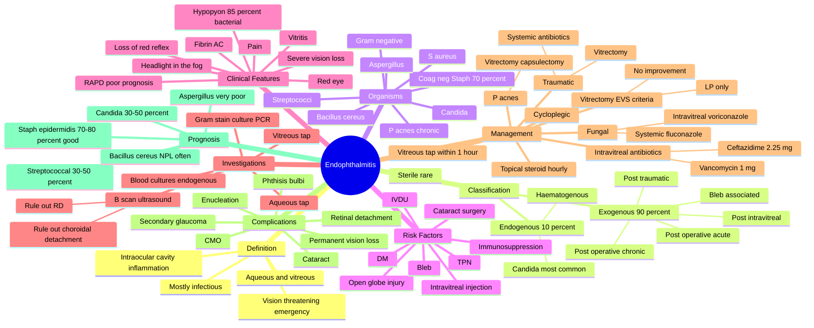

# Endophthalmitis

Related: [[Vitreous Haemorrhage]], [[Panuveitis]], [[Retinal Detachment]], [[Acute Visual Loss (Approach)]]

> [!danger] **FCPS/MRCP Priority: CRITICAL — OPHTHALMIC EMERGENCY**
> Endophthalmitis is **severe, sight-threatening inflammation of the intraocular cavities** (aqueous and vitreous). Most commonly **post-operative** (cataract surgery, intravitreal injection). Requires **immediate vitreous tap + intravitreal antibiotics** (Endophthalmitis Vitrectomy Study protocol). Outcome depends on hours-to-treatment delay.

## Learning Objectives

- [ ] Define endophthalmitis and distinguish exogenous (post-operative/post-traumatic) from endogenous (haematogenous spread) forms.
- [ ] Identify the most common organisms: **coagulase-negative Staphylococci** (post-op), **Staphylococcus aureus**, **Streptococci**, **Gram-negative rods**; fungal (Candida, Aspergillus) in endogenous.
- [ ] Recognise the clinical presentation: pain, ↓VA, red eye, hypopyon, vitritis ("headlight in the fog"), fibrinous AC reaction, lid oedema.
- [ ] Initiate urgent management: vitreous tap → intravitreal antibiotics (vancomycin + ceftazidime) ± pars plana vitrectomy (per EVS criteria).
- [ ] Apply the **Endophthalmitis Vitrectomy Study (EVS) criteria** for vitrectomy: VA light perception only OR will not improve; immediate vitreous tap for all suspected cases.
- [ ] Recognise risk factors: post-cataract surgery, intravitreal injections, trauma, immunosuppression (HIV, transplant, DM), IV drug use (endogenous Candida), prolonged hospital stay.
- [ ] Differentiate from post-op sterile inflammation (responds to intensive topical steroid), chronic pseudophakic endophthalmitis (Propionibacterium acnes — low-grade, recurrent), and panuveitis.
- [ ] Counsel on prognosis: ~50% achieve VA ≥6/12 with prompt treatment; delays reduce visual outcome.

---

## 1. Definition

Endophthalmitis is **inflammation of the intraocular cavities** — the aqueous humour and vitreous gel — of **infectious origin** in the vast majority of cases (rarely sterile). It is the most serious complication of intraocular surgery and a sight-threatening emergency.

## 2. Classification & Aetiology

### A. Exogenous (most common, ~90%)

| Route | Common Setting | Typical Organisms |
|---|---|---|
| **Acute post-operative** (most common) | Cataract surgery (incidence 0.03-0.2%), vitrectomy, glaucoma surgery | Coagulase-negative Staph (S. epidermidis, 70%), S. aureus, Streptococci, Gram-negative |
| **Chronic post-operative** (delayed, low-grade) | Months after surgery, recurrent | **Propionibacterium acnes** (now Cutibacterium acnes), S. epidermidis, fungi |
| **Post-intravitreal injection** | Anti-VEGF, steroid | Coag-negative Staph, Streptococci |
| **Post-traumatic** | Open globe injury | Staph, Strept, Bacillus cereus (rapid, devastating) |
| **Filtering bleb-associated** | Trabeculectomy, tubes | Streptococci, Haemophilus, late-onset (months to years) |

### B. Endogenous (10%, haematogenous)

- **Source:** septicaemia, endocarditis, urinary tract infection, IV drug use, indwelling catheters, immunosuppression
- **Organisms:** **Candida** (most common), **Aspergillus**, S. aureus, Streptococci, Gram-negatives
- **Risk factors:** IV drug use, prolonged IV antibiotics, TPN, immunosuppression (HIV, transplant, chemotherapy), DM, neonates

### C. Sterile (rare)
- Toxic reaction to intraocular medications, surgical material
- Resolves with steroids

## 3. Pathophysiology

- Microbial entry → breach of ocular barriers (surgical wound, trauma, haematogenous)
- Replication in aqueous → spread to vitreous
- Inflammatory cascade: PMN infiltration, cytokine release, fibrin exudation
- Vitreous is **avascular** — immune privilege; once infected, organisms multiply freely
- **Bacterial toxins and host inflammation** cause irreversible retinal damage within **hours**
- Final common pathway: retinal necrosis, detachment, phthisis bulbi

## 4. Clinical Features

### Symptoms
- **Decreased vision** (often severe, sudden)
- **Pain** (deep, ocular)
- Red eye, photophobia, lacrimation
- Discharge (often watery, mucoid)
- Systemic features (fever in endogenous)

### Signs

| Sign | Comment |
|---|---|
| Reduced visual acuity | Often HM or worse |
| Lid oedema | Often present |
| Conjunctival injection + chemosis | Intense |
| **Corneal oedema** | Diffuse |
| **Hypopyon** (layered pus in AC) | Present in ~85% bacterial; absent in fungal |
| Fibrin in anterior chamber | Common |
| Loss of red reflex | Vitreous opacity |
| **Vitritis** — "headlight in the fog" | Classic sign; fundus view obscured |
| No fundus view | B-scan to assess retina (rule out RD) |
| IOP | Variable; may be low (ciliary shutdown) or high |
| Relative afferent pupillary defect | Signifies poor visual prognosis |

### B-scan ultrasound (always do — fundus not visible)
- Vitreous echoes (debris)
- Membranes in vitreous
- Rule out retinal detachment / choroidal detachment

## 5. Investigations

| Test | Purpose |
|---|---|
| **Vitreous tap (immediate)** | Diagnostic: gram stain, culture, PCR |
| **Aqueous tap** (less sensitive) | If vitreous tap not possible |
| **B-scan ultrasound** | Rule out RD, choroidal detachment, retained lens material |
| **Blood cultures** (in endogenous) | Identify source |
| **FBC, ESR, CRP** | Inflammation; endogenous |
| **Vitreous PCR** (16S rRNA, fungal) | Fast organism ID; especially for culture-negative cases |

### Endophthalmitis Vitrectomy Study (EVS) Protocol

**Vitreous tap → intravitreal antibiotics** is the standard of care for ALL suspected bacterial endophthalmitis.

- **Intravitreal antibiotics:**
  - **Vancomycin 1 mg / 0.1 mL** (covers Gram-positive incl. MRSA)
  - **Ceftazidime 2.25 mg / 0.1 mL** (covers Gram-negative)
  - (Alternative: amikacin for Gram-negative, but retinal toxicity)
- **Vitrectomy indications (EVS):**
  - Vision at presentation = **light perception only**, OR
  - Vision worse than 6/36 that does not improve with intravitreal antibiotics
  - Immediate vitrectomy in these groups improves visual outcome
- **Vitrectomy also indicated for:** fungal endophthalmitis, traumatic endophthalmitis, RD on B-scan

## 6. Management

### Acute Bacterial Post-operative Endophthalmitis

**Step 1 (within 1 hour of presentation):**
- **Vitreous tap** (0.2-0.3 mL vitreous via 25G needle through pars plana)
- Inject **intravitreal vancomycin + ceftazidime**
- Subconjunctival antibiotics (optional)
- **Topical:** intensive steroid + antibiotic drops (e.g. prednisolone acetate 1% + moxifloxacin hourly)
- **Cycloplegic:** atropine 1% BD
- **DO NOT** give systemic antibiotics routinely (EVS showed no benefit, except in traumatic endophthalmitis)

**Step 2 (decision: vitrectomy):**
- Per EVS criteria above

**Step 3 (review at 24-48 h):**
- If no improvement, consider repeat intravitreal injection, pars plana vitrectomy, fungal workup

### Endogenous Endophthalmitis (Candida)

- **Vitreous tap + intravitreal antifungals** (voriconazole 100 μg/0.1 mL, or amphotericin B 5 μg/0.1 mL)
- **Systemic antifungals:** IV fluconazole 400-800 mg/day (Candida) or voriconazole (Aspergillus)
- **Identify and treat source** (blood cultures, echo, line removal)
- Often bilateral — examine both eyes

### Traumatic Endophthalmitis (Bacillus cereus)

- **More aggressive**: pars plana vitrectomy + intravitreal vancomycin + ceftazidime + systemic antibiotics
- Globe repair (if open wound)

### Chronic Pseudophakic Endophthalmitis (P. acnes / Cutibacterium acnes)

- **Pars plana vitrectomy + capsulectomy + intravitreal vancomycin** (P. acnes sequestered in capsular bag)
- IOAB (intraocular antibiotic) alone often insufficient
- Consider IOL exchange in refractory cases

## 7. Complications

| Complication | Mechanism |
|---|---|
| **Permanent vision loss** | Retinal necrosis, optic nerve damage |
| **Retinal detachment** | Tractional or exudative; ~10% |
| **Phthisis bulbi** | End-stage shrunken, non-functional eye |
| **Secondary glaucoma** | Peripheral anterior synechiae, trabecular damage |
| **Cataract** | Inflammation, steroid |
| **Cystoid macular oedema** | Chronic inflammation |
| **Enucleation** | Painful blind eye, end-stage |

## 8. Prognosis

| Scenario | Outcome |
|---|---|
| Post-op bacterial (Staph epidermidis), prompt Rx | ~70-80% achieve ≥6/12 |
| Streptococcal / Gram-negative | Worse — ~30-50% achieve 6/60 or better |
| Bacillus cereus (traumatic) | Very poor; often NPL (no perception of light) |
| Endogenous Candida | ~30-50% good outcome with treatment |
| Endogenous Aspergillus | Very poor |
| Delayed treatment (>24 h) | Worse outcomes |

**Key prognostic factors:** presenting VA, organism, time to treatment, integrity of posterior capsule.

## 9. FCPS/MRCP High-Yield Summary

| Topic | Key Point |
|---|---|
| Definition | Inflammation of intraocular cavities (aqueous + vitreous) |
| Most common cause | Post-cataract surgery (coagulase-negative Staph) |
| Endogenous cause | Candida (most common); IV drug use, immunocompromised |
| Classic presentation | Pain, ↓VA, red eye, hypopyon, vitritis |
| "Headlight in the fog" | Fundus view obscured by vitreous opacity |
| First step | Vitreous tap + intravitreal antibiotics (within 1 h) |
| Intravitreal antibiotics | Vancomycin 1 mg + Ceftazidime 2.25 mg |
| Vitrectomy (EVS criteria) | LP only OR VA not improving after IOAB |
| B-scan | Always — rule out RD, choroidal detachment |
| Hypopyon absent in | Fungal endophthalmitis (often) |
| Worst prognosis | Bacillus cereus (traumatic); Aspergillus (endogenous) |
| Systemic antibiotics | NOT routine in post-op (EVS); YES in endogenous/traumatic |
| Chronic low-grade | P. acnes; vitrectomy + capsulectomy |

## 10. Viva Questions

| Question | Expected Answer |
|---|---|
| Most common organism in post-cataract endophthalmitis? | Coagulase-negative Staphylococci (S. epidermidis). |
| First-line intravitreal antibiotics? | Vancomycin 1 mg/0.1 mL (Gram-positive) + Ceftazidime 2.25 mg/0.1 mL (Gram-negative). |
| What is the EVS protocol? | Vitreous tap + intravitreal antibiotics for ALL cases; vitrectomy added if VA is light perception only or no improvement. |
| How do you recognise endophthalmitis? | Pain, severe ↓VA, red eye, hypopyon, vitritis, "headlight in the fog" (fundus view obscured). |
| Most common cause of endogenous endophthalmitis? | Candida (IV drug users, immunocompromised, TPN, indwelling catheters). |
| Why rule out RD with B-scan before vitrectomy? | RD changes surgical approach (combine vitrectomy + retinal detachment repair). |
| What is the role of systemic antibiotics? | EVS showed no benefit in post-op cases. Use in endogenous and traumatic endophthalmitis. |
| Most devastating organism in traumatic endophthalmitis? | Bacillus cereus — fulminant, often NPL. |
| How is P. acnes endophthalmitis different? | Chronic, low-grade, recurrent; needs vitrectomy + capsulectomy (intracapsular). |
| What is the role of topical steroid? | Intensive topical steroid (e.g. prednisolone 1% hourly) after intravitreal antibiotic to control inflammation. |

## 11. Common Confusions / Exam Traps

| Confusion | Clarification |
|---|---|
| "Endophthalmitis = severe conjunctivitis" | No — endophthalmitis involves the intraocular cavities, vision-threatening, requires vitreous tap. |
| "All red eyes after cataract surgery are endophthalmitis" | Post-op sterile inflammation is more common; responds to intensive topical steroid without intravitreal injection. |
| "Systemic antibiotics are first-line" | EVS showed no benefit in post-op; use only in endogenous/traumatic. |
| "Hypopyon is always present" | Hypopyon is in ~85% of bacterial; often ABSENT in fungal. |
| "Endophthalmitis only follows cataract surgery" | Also post-intravitreal injection, trauma, bleb-associated, and endogenous. |
| "P. acnes presents acutely" | No — chronic, low-grade, recurrent; weeks to months after surgery. |
| "Vitrectomy cures all endophthalmitis" | Vitrectomy helps in EVS criteria cases; intravitreal antibiotics are essential for all. |

## 12. Mnemonics

1. **"ENDOPHTHALMITIS = Emergency, Needle, Drain, Operate, Protect, Halting, Averted, Light-Infection, Treat-Injection-Septic"** (long, but exam-friendly acronym).
2. **"Vancomycin + Ceftazidime = VC"** — the standard intravitreal combination.
3. **"EVS: 'Vitreous tap ALWAYS; Vitrectomy if LP'"** — recall: LP = Light Perception → vitrectomy indicated.
4. **"Coag-Neg Staph = Commonest Cause"** — S. epidermidis in post-op.
5. **"Candida in Catheters / IVDU; Aspergillus in Aspiration"** — endogenous associations.

## 13. Mind Map

## 14. One-Page Revision Card

| Domain | Key Points |
|---|---|
| Definition | Inflammation of intraocular cavities (aqueous + vitreous), mostly infectious |
| Most common cause | Post-cataract surgery (coagulase-negative Staph) |
| Most common endogenous | Candida (IVDU, TPN, immunocompromised) |
| Classic presentation | Pain, ↓VA, hypopyon, vitritis, "headlight in the fog" |
| First-line | Vitreous tap + intravitreal vancomycin + ceftazidime (within 1 h) |
| Vitrectomy (EVS) | If VA = light perception only OR not improving |
| B-scan | Always — rule out RD |
| Worst organisms | Bacillus cereus (traumatic), Aspergillus (endogenous) |
| P. acnes | Chronic, low-grade, recurrent; vitrectomy + capsulectomy |
| Systemic antibiotics | Not routine in post-op; YES in endogenous/traumatic |
| Topical steroid | After intravitreal antibiotic, intensive hourly |
| Prognosis | ~70-80% achieve ≥6/12 with prompt treatment of Staph epidermidis |

## 15. Spaced Repetition Trackers

| Review Interval | Date | Score (0-5) | Notes |
|---|---|---|---|
| Day 1 | | | |
| Day 3 | | | |
| Day 7 | | | |
| Day 14 | | | |
| Day 30 | | | |
| Day 90 | | | |

## 16. Self-Test Scorecard

| Section | Score /5 | Last Attempt |
|---|---|---|
| Definition / Classification | | |
| Organisms by route | | |
| Clinical features (hypopyon, vitritis) | | |
| Investigations (vitreous tap, B-scan) | | |
| EVS protocol / Vitrectomy indications | | |
| Specific types (P. acnes, endogenous Candida) | | |
| Mnemonics | | |
| MCQ Performance | | |
| SBA Performance | | |
| Viva Confidence | | |
| **Total** | **/50** | |

> **Interpretation:** <35 = weak, 35-44 = acceptable, 45+ = strong.

## 17. Exam Answer Modes

### Long Answer Skeleton
1. Definition + classification (exogenous vs endogenous)
2. Organisms by route (post-op coag-neg Staph, traumatic Bacillus, endogenous Candida)
3. Risk factors (surgery, intravitreal injection, trauma, IVDU, immunosuppression)
4. Pathogenesis (breach of ocular barrier, avascular vitreous, rapid retinal damage)
5. Clinical features (pain, ↓VA, hypopyon, vitritis, headlight in the fog)
6. Investigations (vitreous tap, B-scan, blood cultures if endogenous)
7. Management (EVS: vitreous tap + intravitreal vancomycin/ceftazidime; vitrectomy per EVS)
8. Specific types (P. acnes chronic, fungal endogenous)
9. Complications (RD, phthisis, glaucoma, vision loss)
10. Prognosis

### Short Note Skeleton
- Definition, classification, common organisms by route, classic clinical features, EVS protocol, prognosis.

### Viva One-Liners
- "Most common organism in post-cataract endophthalmitis?"
- "First-line intravitreal antibiotics?"
- "What is the EVS protocol?"
- "Most common endogenous organism?"
- "Worst organism in traumatic endophthalmitis?"
- "How does P. acnes endophthalmitis present and how is it managed?"

### Ward-Case Discussion Points
- Suspected endophthalmitis is an emergency — admit immediately
- Vitreous tap and intravitreal antibiotics within 1 hour
- B-scan to rule out RD
- Daily review; consider vitrectomy per EVS criteria
- Bilateral endogenous — examine both eyes
- Source identification in endogenous (blood cultures, echo, lines)
- Counsel on visual prognosis

### Last-Night-Before-Exam Sheet
- **Top 5 facts:** Endophthalmitis = emergency; coag-neg Staph = commonest; hypopyon + vitritis = classic; EVS = vitreous tap + IOAB ± vitrectomy; B-scan always
- **3 drug doses:** Vancomycin 1 mg/0.1 mL intravitreal; Ceftazidime 2.25 mg/0.1 mL intravitreal; Voriconazole 100 μg/0.1 mL intravitreal (fungal)
- **2 algorithms:** EVS protocol; Endogenous (workup source + systemic antifungals)
- **1 mnemonic:** "Vancomycin + Ceftazidime = VC" + "EVS: Vitrectomy if LP"

## 18. Summary

Endophthalmitis is severe, sight-threatening inflammation of the intraocular cavities (aqueous and vitreous), most commonly **exogenous** (post-cataract surgery, intravitreal injection, trauma) and less commonly **endogenous** (haematogenous from candidaemia, IVDU, immunocompromise). The most common organism overall is **coagulase-negative Staphylococcus (S. epidermidis)** in post-operative cases. Clinical features include severe pain, rapid visual loss, hypopyon (~85% bacterial), vitritis, fibrin, and the classic "**headlight in the fog**" sign (fundus view obscured by vitreous opacity). Management follows the **EVS protocol**: **vitreous tap + intravitreal vancomycin (1 mg) + ceftazidime (2.25 mg) within 1 hour**; **pars plana vitrectomy** if VA is light perception only or not improving. B-scan ultrasound is mandatory to rule out retinal detachment. Endogenous candida is treated with intravitreal + systemic antifungals. Chronic pseudophakic endophthalmitis (P. acnes) requires vitrectomy with capsulectomy. Prognosis depends on organism and time to treatment: ~70-80% achieve 6/12 or better with prompt treatment of S. epidermidis; Bacillus cereus and Aspergillus have very poor outcomes.

## 19. MCQs (10)

**1. The most common organism in acute post-cataract endophthalmitis is:**
A. Staphylococcus aureus
B. Coagulase-negative Staphylococcus
C. Streptococcus viridans
D. Pseudomonas aeruginosa
**Answer: B**

**2. The standard first-line intravitreal antibiotic combination for bacterial endophthalmitis is:**
A. Vancomycin + Ceftazidime
B. Vancomycin + Amphotericin B
C. Gentamicin + Cefazolin
D. Amikacin + Vancomycin
**Answer: A**

**3. According to the Endophthalmitis Vitrectomy Study (EVS), pars plana vitrectomy is indicated when:**
A. Vision is 6/12 or better
B. Vision is light perception only at presentation
C. Hypopyon is present
D. Patient is diabetic
**Answer: B**

**4. The "headlight in the fog" sign refers to:**
A. Vitreous opacity obscuring fundus view with preserved red reflex
B. Corneal oedema with hypopyon
C. Lens opacity with subluxation
D. Cataract with vitreous haemorrhage
**Answer: A**

**5. Endogenous endophthalmitis is most commonly caused by:**
A. Staphylococcus aureus
B. Aspergillus
C. Candida species
D. Pseudomonas
**Answer: C**

**6. The most fulminant organism in post-traumatic endophthalmitis is:**
A. Staphylococcus epidermidis
B. Streptococcus
C. Bacillus cereus
D. Propionibacterium acnes
**Answer: C**

**7. The first investigation to perform in suspected endophthalmitis (alongside management) is:**
A. Visual field testing
B. B-scan ocular ultrasound
C. CT orbit
D. MRI brain
**Answer: B**

**8. P. acnes (Cutibacterium acnes) endophthalmitis characteristically presents as:**
A. Acute fulminant endophthalmitis 2 days after surgery
B. Chronic low-grade recurrent inflammation months after surgery
C. Bilateral simultaneous presentation
D. With rapid retinal detachment
**Answer: B**

**9. The EVS showed that systemic antibiotics in post-cataract endophthalmitis:**
A. Significantly improve visual outcomes
B. Provide no additional benefit when intravitreal antibiotics are given
C. Are essential and must always be given
D. Are only useful for Gram-negative coverage
**Answer: B**

**10. Hypopyon is characteristically absent in which form of endophthalmitis?**
A. Acute post-cataract
B. Post-traumatic Bacillus
C. Fungal endogenous
D. Bleb-associated
**Answer: C**

## 20. SBA Questions (10)

**1. A 72-year-old man presents 3 days after cataract surgery with severe pain, vision hand movements, hypopyon, and vitreous opacity. The most appropriate immediate management is:**
A. Topical antibiotic only
B. Vitreous tap and intravitreal vancomycin + ceftazidime
C. Oral fluoroquinolone
D. Topical steroid only
**Answer: B — Vitreous tap + IOAB is the EVS standard**

**2. The most common cause of endogenous endophthalmitis in an IV drug user is:**
A. Staphylococcus aureus
B. Candida albicans
C. Pseudomonas aeruginosa
D. Aspergillus fumigatus
**Answer: B — Candida is the most common cause of endogenous endophthalmitis**

**3. A patient has post-cataract endophthalmitis with VA of light perception only. According to the EVS, the most appropriate management is:**
A. Intravitreal antibiotics alone
B. Immediate pars plana vitrectomy + intravitreal antibiotics
C. Topical antibiotics
D. Oral antibiotics
**Answer: B — LP vision is an EVS indication for vitrectomy**

**4. A patient with chronic low-grade inflammation 3 months after cataract surgery, recurrent hypopyon that responds to steroid, has:**
A. Acute bacterial endophthalmitis
B. P. acnes (Cutibacterium acnes) chronic endophthalmitis
C. Sympathetic ophthalmia
D. Viral uveitis
**Answer: B — P. acnes = chronic, low-grade, recurrent**

**5. The single most important role of B-scan ultrasound in suspected endophthalmitis is:**
A. To confirm the diagnosis
B. To rule out retinal detachment before vitrectomy
C. To identify the organism
D. To assess the cornea
**Answer: B — RD changes the surgical approach**

**6. The intravitreal dose of vancomycin used in endophthalmitis is:**
A. 0.1 mg
B. 1 mg
C. 5 mg
D. 10 mg
**Answer: B — Vancomycin 1 mg/0.1 mL**

**7. Bleb-associated endophthalmitis typically occurs:**
A. Within 1 week of surgery
B. Months to years after trabeculectomy
C. Only in the immediate post-op period
D. Only with topical steroid use
**Answer: B — Late-onset (months to years)**

**8. Endogenous Aspergillus endophthalmitis is most often seen in:**
A. Healthy individuals
B. Severely immunocompromised patients (transplant, neutropenia)
C. Patients with allergic rhinitis
D. Neonates
**Answer: B — Severe immunocompromise**

**9. The most appropriate antifungal for intravitreal injection in endogenous Candida endophthalmitis is:**
A. Fluconazole
B. Voriconazole
C. Itraconazole
D. Griseofulvin
**Answer: B — Voriconazole 100 μg/0.1 mL**

**10. The classic fundus appearance in endogenous Candida endophthalmitis is:**
A. Roth spots
B. "String of pearls" vitreous opacities with chorioretinal lesions
C. Cherry-red spot
D. Bone-spicule pigmentation
**Answer: B — Candida = "string of pearls" vitritis with creamy-white chorioretinal lesions**

## 21. Flashcards

- **Q:** Most common organism in post-cataract endophthalmitis?
  **A:** Coagulase-negative Staphylococcus (S. epidermidis)
- **Q:** First-line intravitreal antibiotics?
  **A:** Vancomycin 1 mg + Ceftazidime 2.25 mg
- **Q:** EVS vitrectomy indication?
  **A:** Light perception only at presentation
- **Q:** Most common endogenous organism?
  **A:** Candida
- **Q:** Worst organism in traumatic endophthalmitis?
  **A:** Bacillus cereus
- **Q:** P. acnes endophthalmitis — presentation and treatment?
  **A:** Chronic, low-grade, recurrent; vitrectomy + capsulectomy
- **Q:** "Headlight in the fog"?
  **A:** Vitreous opacity obscuring fundus view with preserved red reflex
- **Q:** Most appropriate antifungal for intravitreal Candida?
  **A:** Voriconazole 100 μg/0.1 mL
- **Q:** Classic fundus finding in endogenous Candida?
  **A:** "String of pearls" vitritis with creamy-white chorioretinal lesions
- **Q:** EVS — role of systemic antibiotics in post-op?
  **A:** No additional benefit when intravitreal antibiotics given

## 22. Answer Key with Explanations

### MCQs
1. **B** — Coagulase-negative Staphylococcus (S. epidermidis) accounts for ~70% of acute post-cataract endophthalmitis.
2. **A** — Vancomycin (Gram-positive) + Ceftazidime (Gram-negative) is the standard intravitreal combination.
3. **B** — The EVS established that vitrectomy is indicated when VA is light perception only at presentation (or worse than 6/36 not improving with IOAB).
4. **A** — "Headlight in the fog" describes the appearance of the retina through dense vitreous opacity, where the examiner can vaguely perceive a dull red reflex (or "headlight") through the fog of inflammation.
5. **C** — Candida is the most common organism in endogenous endophthalmitis, especially in IV drug users, TPN, and immunocompromised patients.
6. **C** — Bacillus cereus causes fulminant endophthalmitis after trauma, often leading to no light perception (NPL) within 24-48 hours.
7. **B** — B-scan ultrasound rules out retinal detachment, which changes the surgical approach (vitrectomy alone vs combined with RD repair).
8. **B** — P. acnes (Cutibacterium acnes) is a slow-growing anaerobe that causes chronic, low-grade, recurrent endophthalmitis months after cataract surgery, often sequestered in the capsular bag.
9. **B** — The EVS showed no benefit of systemic antibiotics in post-cataract endophthalmitis when intravitreal antibiotics were used.
10. **C** — Fungal endophthalmitis (especially Candida) often lacks hypopyon, presenting with vitritis and chorioretinal lesions instead.

### SBAs
1. **B** — Vitreous tap and intravitreal antibiotics (vancomycin + ceftazidime) is the EVS standard for post-cataract endophthalmitis.
2. **B** — Candida is the most common cause of endogenous endophthalmitis in IV drug users.
3. **B** — LP vision at presentation is an EVS indication for immediate pars plana vitrectomy.
4. **B** — P. acnes causes chronic, low-grade, recurrent endophthalmitis after cataract surgery, often with capsular plaque.
5. **B** — B-scan rules out retinal detachment before vitrectomy.
6. **B** — Vancomycin 1 mg in 0.1 mL is the standard intravitreal dose.
7. **B** — Bleb-associated endophthalmitis occurs months to years after trabeculectomy.
8. **B** — Aspergillus endophthalmitis occurs in severely immunocompromised patients.
9. **B** — Voriconazole 100 μg/0.1 mL intravitreal is used for Candida endophthalmitis.
10. **B** — "String of pearls" vitreous opacities with creamy-white chorioretinal lesions is classic for Candida.

## 23. Local Navigation

- **Parent Hub:** [[Retina and Vitreous Hub]]
- **Related:** [[Vitreous Haemorrhage]] · [[Panuveitis]] · [[Retinal Detachment]] · [[Diabetic Retinopathy]] · [[AMD]]
- **Related (Approach):** [[Acute Visual Loss (Approach)]] · [[Chronic Visual Loss]]
- **Related (Trauma):** [[Penetrating Ocular Trauma]] · [[Ocular Foreign Body]] · [[Chemical Injury]]
- **Chapter MOC:** [[Medical Ophthalmology MOC]]
- **Chapter Hierarchy:** [[Davidson Chapter 27 - Medical Ophthalmology Hierarchy]]
- **Cross-chapter:** [[../HIV Infection and AIDS]] · [[../Infectious Disease]]

## 24. Tags

#medicine #davidson #ophthalmology #endophthalmitis #vitreous #cataract-surgery #EVS #fcps #mrcp #emergency
