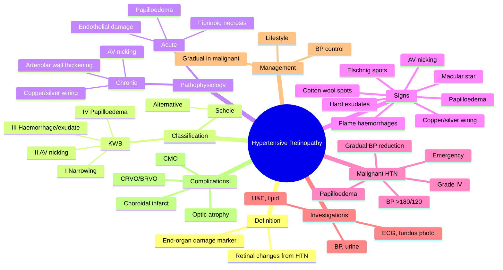

# Hypertensive Retinopathy

Related: [[Diabetes Mellitus (Ocular)]], [[Hypertension]]

> [!tip] **FCPS/MRCP Priority: HIGH**
> Keith-Wagener-Barker classification. AV nicking, copper/silver wiring, cotton wool, flame haemorrhages, exudates, papilloedema (Grade IV = malignant). Treat BP.

---

## Learning Objectives
- [ ] Define hypertensive retinopathy and recognise it as a marker of end-organ damage
- [ ] Apply the Keith-Wagener-Barker (KWB) classification
- [ ] Describe the fundus features of each grade
- [ ] Differentiate hypertensive from diabetic retinopathy
- [ ] Identify hypertensive emergency/urgency and its management
- [ ] Recognise the special features of malignant hypertension (Grade IV)
- [ ] Outline appropriate investigations and management
- [ ] Counsel patients on cardiovascular risk

---

## 1. Definition / Epidemiology

### Definition
- **Hypertensive retinopathy (HTR):** Retinal vascular changes from chronic or acute systemic hypertension
- A marker of end-organ damage and cardiovascular risk
- Can be **chronic** (chronic HTN) or **acute/accelerated/malignant** (severe acute HTN)

### Epidemiology
- Common finding in adults with chronic HTN
- Prevalence increases with age and severity of HTN
- More common in Black populations and those with poor BP control
- Often asymptomatic

---

## 2. Pathophysiology

### Chronic Hypertension
- Sustained ↑BP → arteriolar vasoconstriction (spasm) → arteriolar wall thickening
- Hyaline and hyperplastic arteriolosclerosis
- AV nicking (compression of venule by thickened arteriole at crossing)
- Copper wiring → silver wiring (progressive luminal narrowing)
- Breakdown of blood-retinal barrier → exudates, haemorrhages

### Acute/Malignant Hypertension
- Endothelial damage → fibrinoid necrosis
- Disruption of BRB → flame haemorrhages, cotton wool spots, hard exudates
- Optic disc oedema (papilloedema) in Grade IV
- Choroidal ischaemia (Elschnig spots, Siegrist streaks)

---

## 3. Keith-Wagener-Barker (KWB) Classification

| Grade | Findings | Severity |
|-------|----------|----------|
| **I** | Mild narrowing/sclerosis of arterioles | Mild HTN |
| **II** | More marked arteriolar narrowing, **AV nicking** | Moderate HTN |
| **III** | Flame haemorrhages, cotton wool spots, hard exudates, ±macular star | Severe HTN |
| **IV** | All above + **papilloedema** | **Malignant HTN** |

### Scheie Classification (Alternative)
- Stage 0: No changes
- Stage 1: Barely detectable arteriolar narrowing
- Stage 2: More obvious narrowing, AV nicking
- Stage 3: Stage 2 + haemorrhages/exudates
- Stage 4: Stage 3 + papilloedema

---

## 4. Clinical Features

### Symptoms
- Often **asymptomatic** (chronic grades I–II)
- ↓VA (macular involvement, exudates, haemorrhage, CMO)
- Scotoma
- Photopsia
- Headache (associated with severe HTN)

### Signs
- **AV nicking** (compression of venule by arteriole at crossing — Salus sign)
- **Copper wiring** (arteriolar wall thickening with reflex)
- **Silver wiring** (severe — almost invisible arterioles with white reflex)
- **Flame haemorrhages** (nerve fibre layer — splinter)
- **Cotton wool spots** (NFL infarcts — soft exudates)
- **Hard exudates** (lipid leakage from vessels)
- **Macular star** (hard exudates radiating around fovea — in severe HTN)
- **Papilloedema** (Grade IV — malignant)
- **Choroidal infarction** (Elschnig spots — patches of RPE hyperplasia; Siegrist streaks — linear)
- **CRVO/BRVO** can complicate severe HTN

---

## 5. Investigations

- **BP measurement** (both arms, supine and standing)
- Urine: proteinuria, haematuria (renal end-organ damage)
- Blood: U&Es, creatinine, eGFR, lipid profile, glucose, HbA1c
- ECG: LVH, ischaemia
- **Fundus photography** (serial documentation of retinopathy)
- **OCT:** If CMO suspected
- **FFA:** If choroidal involvement suspected
- Carotid Doppler, echo (if cardiovascular risk stratification)

---

## 6. Management

### Chronic Hypertensive Retinopathy
- **Treat BP** (target <140/90 mmHg, or <130/80 in DM/CKD)
- Lifestyle: weight loss, exercise, low salt, DASH diet
- Treat any complications (CMO, BRVO/CRVO)

### Malignant Hypertension (Grade IV)
- **Hypertensive emergency** — admission, IV antihypertensives (labetalol, nicardipine, GTN)
- **Gradual BP reduction** (over 24–48 h) to avoid watershed ischaemia
- Avoid rapid drops → can cause optic nerve/retinal ischaemia
- Monitor for end-organ damage (renal, cardiac, CNS)
- Treat any complications

---

## 7. Complications

- **CRVO / BRVO** (vein occlusion from venous compression)
- **Macular oedema** (↓VA)
- **Optic atrophy** (chronic ischaemia)
- **Retinal artery occlusion** (rare, severe)
- **Choroidal infarction** (Elschnig spots, Siegrist streaks)
- **Visual loss** (macular star, exudative maculopathy)

---

## 8. Red Flags / Emergencies

- **Papilloedema + high BP** = malignant hypertension (Grade IV) — medical emergency
- BP >180/120 mmHg with end-organ damage = hypertensive emergency
- Sudden ↓VA in hypertensive patient → think CRVO, ischaemic optic neuropathy, or stroke
- Bilateral optic disc oedema in HTN → urgent BP control

---

## 9. FCPS/MRCP High-Yield Summary

| Grade | Findings |
|-------|----------|
| I | Mild arteriolar narrowing |
| II | AV nicking |
| III | Haemorrhages, exudates, CWS, macular star |
| IV | + Papilloedema (malignant) |

| Key concept | Detail |
|-------------|--------|
| Definition | Retinal vascular changes from chronic HTN |
| Sign of end-organ damage | Predicts cardiovascular risk |
| Malignant HTN | Grade IV (papilloedema) — emergency |
| Treatment | BP control (gradual in malignant) |

---

## 10. Viva Questions

1. **Q:** What fundus finding indicates malignant hypertension?
   **A:** Papilloedema (Grade IV) — indicates end-organ damage and hypertensive emergency.

2. **Q:** What is AV nicking and what causes it?
   **A:** Compression of a venule by a thickened arteriole at a crossing point (Salus sign), due to arteriolar wall thickening from chronic HTN.

3. **Q:** Differentiate the KWB grades.
   **A:** I = mild narrowing; II = AV nicking; III = haemorrhages, exudates, CWS; IV = + papilloedema (malignant).

4. **Q:** How is malignant HTN treated?
   **A:** Admit, IV antihypertensives, gradual BP reduction over 24–48 h to avoid watershed ischaemia; avoid precipitous drops.

5. **Q:** What is a macular star?
   **A:** Hard exudates radiating around the fovea in a star pattern, seen in severe (Grade III/IV) hypertensive retinopathy and neuroretinitis.

---

## 11. Common Confusions / Exam Traps

| Confusion | Clarification |
|-----------|---------------|
| "Copper wiring is normal" | It is **abnormal** — sign of arteriolar wall thickening (KWB II) |
| "Hypertensive and diabetic retinopathy look the same" | HTN → flame haemorrhages, AV nicking, CWS, papilloedema; DM → dot-blot, microaneurysms, hard exudates, neovascularisation |
| "Papilloedema = raised ICP" | Papilloedema can be from HTN, raised ICP, optic nerve disease; check BP, neuroimaging, LP |
| "Macular star = diabetic maculopathy" | Macular star = severe HTN (or neuroretinitis); circinate exudates = DM |
| "Malignant HTN needs rapid BP drop" | **Gradual** reduction (10–20% in first hour, then slower) — rapid drop causes watershed ischaemia |
| "Grade III is the worst" | Grade IV (with papilloedema) = malignant HTN, the most severe |
| "AV nicking at the macula is a vein" | At AV crossings, the arteriole is on top (anterior) and the venule dips posteriorly |
| "Elschnig spots are retinal" | They are **choroidal** infarcts seen in malignant HTN |

---

## 12. Mnemonics

1. **"I, II, III, IV = Narrow, AV nick, Haemorrhage, Papilloedema"** — KWB in order
2. **"Malignant = Papilloedema"** — Grade IV is malignant HTN
3. **"AV nicking = Arteriole Venule"** — thickened arteriole compresses venule at crossing
4. **"Copper → Silver"** — progression of arteriolar wall change in chronic HTN
5. **"BP drops = Watershed"** — rapid BP drop in malignant HTN causes watershed ischaemia

---

## 13. Mind Map

---

## One-Page Revision Card

| **Topic** | **Hypertensive Retinopathy** |
|-----------|------------------------------|
| **Definition** | Retinal vascular changes from HTN |
| **Classification** | Keith-Wagener-Barker (I–IV) |
| **Grade I** | Mild arteriolar narrowing |
| **Grade II** | AV nicking |
| **Grade III** | Haemorrhages, exudates, CWS, macular star |
| **Grade IV** | + Papilloedema (malignant HTN) |
| **Malignant HTN** | BP >180/120 + end-organ damage (Grade IV) |
| **Treatment** | BP control (gradual in malignant — over 24–48 h) |
| **Viva Pearl** | Papilloedema = Grade IV = malignant HTN |

---

## Spaced Repetition Trackers

### 24-Hour Recall Prompts
- [ ] State the KWB classification in order
- [ ] List 4 fundus signs of hypertensive retinopathy
- [ ] Define malignant hypertension
- [ ] Explain the principle of "gradual BP reduction" in malignant HTN
- [ ] Differentiate hypertensive from diabetic retinopathy
- [ ] State 2 complications of malignant HTN retinopathy

### Revision Schedule
- [ ] **Day 1** completed (creation + 24h recall)
- [ ] **Day 3** revision completed
- [ ] **Day 7** revision completed
- [ ] **Day 15** revision completed
- [ ] **Day 30** revision completed
- [ ] **Day 90** revision completed

---

## Must Know / Should Know / Nice to Know

### Must Know (Core for passing)
- [x] KWB classification (I–IV)
- [x] Papilloedema = Grade IV = malignant HTN
- [x] AV nicking pathophysiology
- [x] Malignant HTN is a hypertensive emergency
- [x] Gradual BP reduction in malignant HTN
- [x] Differentiate from diabetic retinopathy

### Should Know (High probability)
- [x] Macular star and its significance
- [x] Cotton wool spots, flame haemorrhages
- [x] Copper/silver wiring
- [x] End-organ damage workup
- [x] Elschnig spots (choroidal infarcts)
- [x] Hypertensive choroidopathy vs retinopathy

### Nice to Know (Differentiator)
- [ ] Scheie classification (alternative)
- [ ] Salus sign (AV nicking)
- [ ] Gunn sign (copper/silver wiring)
- [ ] Siegrist streaks (linear choroidal lesions)
- [ ] Watershed ischaemia from rapid BP drop

---

## My Weak Points
- [ ] Add personal weak areas here

---

## Self-Test Scorecard

| Section | Score /5 |
|---------|----------|
| Understanding: | /10 |
| Recall: | /10 |
| MCQ Performance: | /10 |
| SBA Performance: | /10 |
| Viva Confidence: | /10 |
| Total: | /50 |

> [!tip] **Interpretation:** <35 = weak topic, 35-44 = acceptable but insecure, 45+ = strong exam-ready topic.

---

## Exam Answer Modes

### Long Answer Skeleton
1. Definition (retinal vascular changes from chronic/acute HTN; end-organ damage marker)
2. Risk factors / epidemiology
3. Pathophysiology (chronic: vasoconstriction, wall thickening; acute: fibrinoid necrosis, endothelial damage)
4. KWB classification (I–IV with features)
5. Clinical features (often asymptomatic; ↓VA, scotoma)
6. Fundus signs (AV nicking, copper/silver wiring, flame haemorrhages, CWS, hard exudates, macular star, papilloedema)
7. Investigations (BP, U&Es, lipids, ECG, fundus photo)
8. Management (BP control; gradual in malignant HTN)
9. Complications (CRVO, BRVO, CMO, optic atrophy, choroidal infarction)
10. Malignant HTN (Grade IV — hypertensive emergency, gradual BP reduction, IV antihypertensives)

### Short Note Skeleton
- Definition + KWB classification
- 2–3 fundus signs
- Treatment principle (BP control; gradual in malignant)

### Viva One-Liners
- **Q:** Grade IV hypertensive retinopathy = ? → **A:** Malignant HTN
- **Q:** What is AV nicking? → **A:** Compression of venule by thickened arteriole at crossing
- **Q:** Treatment of malignant HTN? → **A:** IV antihypertensives with gradual BP reduction (10–20% in first hour, then over 24–48 h)
- **Q:** Macular star = ? → **A:** Hard exudates radiating around the fovea (Grade III/IV HTN, neuroretinitis)
- **Q:** Why gradual BP reduction in malignant HTN? → **A:** To avoid watershed ischaemia from perfusion drop in chronic hypertensive patients

### Ward-Case Discussion Points
- Recognising the KWB grade on fundus exam
- Distinguishing hypertensive from diabetic retinopathy
- Identifying hypertensive emergency
- Avoiding rapid BP reduction in chronic hypertensives
- Counselling on cardiovascular risk
- Recognising CRVO/BRVO as hypertensive complications
- Elschnig spots and choroidal ischaemia

### Last-Night-Before-Exam Sheet
- **Top 3 facts:** KWB I–IV; Grade IV = malignant HTN; gradual BP reduction
- **Mnemonic:** "I = Narrow, II = AV nick, III = Haemorrhage, IV = Papilloedema"
- **Must-know signs:** AV nicking, copper/silver wiring, flame haemorrhages, CWS, papilloedema
- **Malignant HTN treatment:** IV antihypertensives + gradual reduction over 24–48 h
- **Differentiator:** HTN vs DM retinopathy

---

## Summary

Hypertensive retinopathy is classified by Keith-Wagener-Barker (KWB). Grade I: arteriolar narrowing; Grade II: AV nicking; Grade III: haemorrhages, exudates, CWS, macular star; Grade IV: + papilloedema (malignant hypertension). Malignant HTN is a hypertensive emergency requiring admission, IV antihypertensives, and gradual BP reduction (over 24–48 h) to avoid watershed ischaemia. Hypertensive retinopathy is a marker of end-organ damage and predicts cardiovascular risk. Differentiate from diabetic retinopathy: HTN → flame haemorrhages, AV nicking, CWS, papilloedema; DM → microaneurysms, dot-blot, hard exudates, neovascularisation.

## MCQs (10)

1. **Question:** Papilloedema in hypertensive retinopathy indicates:
   **Options:** A. Grade I B. Grade II C. Grade III D. Grade IV E. None
   **Answer:** D
   **Explanation:** Grade IV (papilloedema) = malignant hypertension.

2. **Question:** AV nicking in fundus is due to:
   **Options:** A. Venule compression by arteriole B. Arteriole compression by venule C. Haemorrhage D. Exudate E. Neovascularisation
   **Answer:** A
   **Explanation:** Thickened arteriolar wall compresses venule at the AV crossing.

3. **Question:** Which grade of hypertensive retinopathy represents malignant hypertension?
   **Options:** A. I B. II C. III D. IV E. All grades
   **Answer:** D
   **Explanation:** Grade IV (with papilloedema) = malignant HTN.

4. **Question:** A macular star on fundus examination is characteristic of:
   **Options:** A. Mild HTN B. Diabetic retinopathy C. Severe (Grade III/IV) HTN or neuroretinitis D. Glaucoma E. CRVO
   **Answer:** C
   **Explanation:** Macular star = hard exudates around the fovea, seen in severe HTN and neuroretinitis.

5. **Question:** The most appropriate treatment approach for malignant hypertension is:
   **Options:** A. Rapid BP reduction to <120/80 within 1 hour B. Gradual BP reduction over 24–48 hours C. Oral antihypertensives only D. Observation only E. Diuretics only
   **Answer:** B
   **Explanation:** Gradual reduction avoids watershed ischaemia; rapid drop is dangerous.

6. **Question:** Which fundus sign is most specific for chronic hypertension?
   **Options:** A. Microaneurysms B. AV nicking C. Dot-blot haemorrhages D. Cotton wool spots E. Neovascularisation
   **Answer:** B
   **Explanation:** AV nicking reflects chronic arteriolar wall thickening — specific for chronic HTN.

7. **Question:** Elschnig spots on the fundus are seen in:
   **Options:** A. Diabetic retinopathy B. Hypertensive choroidopathy C. CRVO D. Retinal detachment E. Glaucoma
   **Answer:** B
   **Explanation:** Elschnig spots = choroidal infarcts in hypertensive choroidopathy (severe/malignant HTN).

8. **Question:** Cotton wool spots on fundoscopy represent:
   **Options:** A. Hard exudates B. Nerve fibre layer infarcts C. Haemorrhages D. Microaneurysms E. Drusen
   **Answer:** B
   **Explanation:** Cotton wool spots = focal NFL infarcts (accumulation of axoplasmic debris).

9. **Question:** Hypertensive retinopathy is most important because it is:
   **Options:** A. A cause of blindness B. A marker of end-organ damage C. Painful D. Always symptomatic E. Treatable surgically
   **Answer:** B
   **Explanation:** It is a marker of end-organ damage and predicts cardiovascular risk.

10. **Question:** Grade III hypertensive retinopathy includes all EXCEPT:
    **Options:** A. Flame haemorrhages B. Cotton wool spots C. Hard exudates D. Macular star E. AV nicking only
    **Answer:** E
    **Explanation:** AV nicking alone is Grade II; Grade III adds haemorrhages, CWS, exudates.

## SBA Questions (10)

1. **Scenario:** A 50-year-old man with BP 220/130 mmHg has papilloedema, flame haemorrhages, and a macular star on fundus exam.
   **Question:** What is the KWB grade?
   **Options:** A. I B. II C. III D. IV E. Cannot determine
   **Answer:** D
   **Explanation:** Papilloedema = Grade IV (malignant HTN).

2. **Scenario:** A 60-year-old with chronic hypertension has AV nicking, copper wiring, and arteriolar narrowing, but no haemorrhages or exudates.
   **Question:** KWB grade?
   **Options:** A. I B. II C. III D. IV E. Normal
   **Answer:** B
   **Explanation:** AV nicking + arteriolar narrowing = Grade II.

3. **Scenario:** A 55-year-old asymptomatic patient is found to have mild arteriolar narrowing only on routine fundus exam. BP is 150/95 mmHg.
   **Question:** KWB grade?
   **Options:** A. I B. II C. III D. IV E. Normal
   **Answer:** A
   **Explanation:** Mild narrowing only = Grade I.

4. **Scenario:** A patient with malignant HTN (Grade IV) is started on IV labetalol. What BP reduction target is appropriate in the first hour?
   **Options:** A. <120/80 mmHg B. Reduce MAP by 25% C. Reduce BP by 10–20% D. <90/60 mmHg E. <140/90 mmHg
   **Answer:** C
   **Explanation:** Reduce BP by 10–20% in the first hour, then gradually over 24–48 h.

5. **Scenario:** A 60-year-old with HTN has a flame haemorrhage and cotton wool spot but no disc oedema.
   **Question:** KWB grade?
   **Options:** A. I B. II C. III D. IV E. Cannot determine
   **Answer:** C
   **Explanation:** Haemorrhages + CWS without papilloedema = Grade III.

6. **Scenario:** A 45-year-old with severe HTN and ↓VA has bilateral optic disc oedema. What is the most likely diagnosis?
   **Options:** A. Bilateral papillitis B. Malignant HTN C. CRVO D. Papilloedema from raised ICP E. Glaucoma
   **Answer:** B
   **Explanation:** Bilateral disc oedema + severe HTN = malignant HTN (Grade IV).

7. **Scenario:** A 50-year-old diabetic with hypertension has dot-blot haemorrhages, microaneurysms, and hard exudates on fundus. Which finding is more specific for HTN?
   **Options:** A. Microaneurysms B. Dot-blot haemorrhages C. Hard exudates D. AV nicking E. Cotton wool spots
   **Answer:** D
   **Explanation:** AV nicking is specific for chronic HTN; the others are typical of DM retinopathy.

8. **Scenario:** A patient with newly diagnosed severe HTN and Grade III retinopathy is being counselled. What is the most important prognostic information to convey?
   **Options:** A. Vision will fully recover B. Risk of cardiovascular events C. The eye changes are due to infection D. Surgery is required E. No follow-up needed
   **Answer:** B
   **Explanation:** Hypertensive retinopathy is a marker of end-organ damage and predicts cardiovascular morbidity/mortality.

9. **Scenario:** A patient with severe HTN is given sublingual nifedipine to rapidly lower BP. They develop watershed cerebral infarction.
   **Question:** What went wrong?
   **Options:** A. Wrong drug choice B. Too-rapid BP reduction in chronic HTN C. Drug allergy D. Drug interaction E. Underdosage
   **Answer:** B
   **Explanation:** Rapid BP drop in chronic HTN causes watershed ischaemia; gradual reduction is essential.

10. **Scenario:** A 70-year-old with HTN has a new BRVO with macular oedema. What is the most likely cause?
    **Options:** A. Diabetes B. Age-related C. Hypertensive retinopathy (arteriolar compression of venule at AV crossing) D. Trauma E. Infection
    **Answer:** C
    **Explanation:** HTN predisposes to BRVO via AV crossing changes and arteriolar wall thickening.

## Flashcards

- **Q:** What is the KWB classification of hypertensive retinopathy?
  **A:** I: mild narrowing; II: AV nicking; III: haemorrhages, exudates, CWS; IV: + papilloedema (malignant HTN).
- **Q:** What does papilloedema in hypertensive retinopathy indicate?
  **A:** Malignant hypertension (Grade IV) — a hypertensive emergency.
- **Q:** Why is BP reduction gradual in malignant HTN?
  **A:** To avoid watershed ischaemia from rapid perfusion drop in chronic hypertensive patients.
- **Q:** What is AV nicking?
  **A:** Compression of a venule by a thickened arteriole at a crossing point — a sign of chronic HTN.
- **Q:** What is a macular star?
  **A:** Hard exudates radiating around the fovea — seen in severe hypertensive retinopathy (Grade III/IV) and neuroretinitis.

## Answer Key with Explanations

### MCQs
1. D — Papilloedema = Grade IV (malignant HTN)
2. A — Arteriolar wall thickening compresses venule
3. D — Grade IV = malignant HTN
4. C — Macular star is in severe HTN/neuroretinitis
5. B — Gradual reduction avoids watershed ischaemia
6. B — AV nicking is specific for chronic HTN
7. B — Elschnig spots = choroidal infarcts in hypertensive choroidopathy
8. B — Cotton wool spots = NFL infarcts
9. B — HTR is a marker of end-organ damage
10. E — AV nicking alone is Grade II; Grade III adds haemorrhages/CWS/exudates

### SBAs
1. D — Papilloedema = Grade IV
2. B — AV nicking + narrowing = Grade II
3. A — Mild narrowing only = Grade I
4. C — Reduce BP by 10–20% in first hour
5. C — Haemorrhages + CWS without papilloedema = Grade III
6. B — Bilateral disc oedema + severe HTN = malignant HTN
7. D — AV nicking is specific for chronic HTN
8. B — HTR predicts cardiovascular events
9. B — Rapid BP drop → watershed ischaemia
10. C — HTN predisposes to BRVO via AV crossing changes

## Tags
#medicine #davidson #ophthalmology #HTN-retinopathy #fcps #mrcp

## PasTest Scenario SBAs (Clinical Vignettes)

> **Auto-generated PasTest/Mediscope-style scenario SBAs** grounded in the authored source. Each scenario tests a real clinical fact (triad, specific sign, contraindication, trial, first-line Rx) extracted from the topic. *Source: Ch 28: Medical Ophthalmology — Hypertensive Retinopathy*

**Q1.** What is the most appropriate first-line therapy for Hypertensive Retinopathy?

  - **A.** Treat BP
  - **B.** An advanced/surgical therapy reserved for refractory disease
  - **C.** Symptomatic treatment only, no disease-modifying therapy
  - **D.** Empiric broad-spectrum therapy without specific indication

  > **Answer: A** — Treat BP
  >
  > *Source:* **Treat BP** (target <140/90 mmHg, or <130/80 in DM/CKD)

