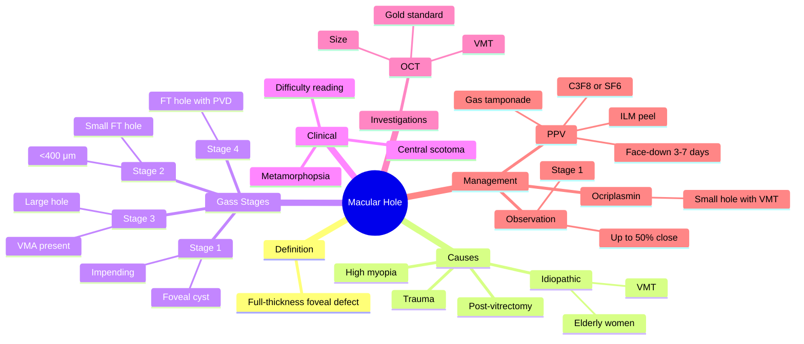

# Macular Hole

Related: [[Epiretinal Membrane]], [[Pars Plana Vitrectomy]]

> [!tip] **FCPS/MRCP Priority: MEDIUM**
> Central scotoma, metamorphopsia. Vitreomacular traction causes. OCT diagnostic. Vitrectomy with ILM peel + gas.

---

## Learning Objectives
- [ ] Define a macular hole and identify the commonest cause
- [ ] Describe the Gass classification
- [ ] Recognise clinical features (central scotoma, metamorphopsia)
- [ ] Order the correct investigation (OCT)
- [ ] Apply principles of management (observation, ocriplasmin, vitrectomy)
- [ ] Counsel the patient on post-operative positioning and outcomes

---

## 1. Definition

- **Macular hole:** Full-thickness defect in the neurosensory retina at the fovea
- Causes central vision loss

---

## 2. Causes

- **Idiopathic** (most common, elderly women, vitreomacular traction)
- **Trauma** (second most common)
- High myopia
- Macular schisis (myopic)
- Post-vitrectomy
- Diabetic maculopathy (cystoid)

---

## 3. Clinical Features

- Central scotoma, blurred central vision
- Metamorphopsia (wavy lines)
- Difficulty reading, recognising faces

---

## 4. Gass Classification

- **Stage 1 (Impending):** Foveal cyst (1A) / foveal detachment (1B)
- **Stage 2:** Small full-thickness hole (<400 μm)
- **Stage 3:** Larger hole (>400 μm) with vitreomacular adhesion
- **Stage 4:** Full-thickness hole with PVD (no VMT)

---

## 5. Investigations

- **OCT** (gold standard) — shows full-thickness defect, size, VMT, ERM

---

## 6. Management

- **Observation:** Small stage 1 may close (50%)
- **Ocriplasmin (Jetrea)** — enzymatic vitreolysis, for small holes with VMT (limited use)
- **Pars plana vitrectomy + ILM peel + gas (C3F8 or SF6)** — definitive
  - Face-down positioning 3–7 days post-op
  - High success (~90% closure)
  - May develop cataract (50% within 2 years)

---

## 7. FCPS/MRCP Summary

| Topic | Key Points |
|-------|------------|
| Cause | VMT, trauma, myopia |
| Sign | Central scotoma, metamorphopsia |
| OCT | Diagnostic |
| Treatment | Vitrectomy + ILM peel + gas |

---

## 8. Viva Questions

1. **Q:** What is the most common cause of macular hole?
   **A:** Idiopathic — vitreomacular traction in elderly women.

2. **Q:** Which investigation is the gold standard for diagnosis?
   **A:** OCT — demonstrates the full-thickness foveal defect, hole size, and vitreomacular traction.

3. **Q:** What is the definitive surgical treatment?
   **A:** Pars plana vitrectomy with ILM peel and gas tamponade (C3F8 or SF6).

4. **Q:** Why is post-operative face-down positioning advised?
   **A:** To allow the gas tamponade to press against the macula and aid hole closure.

---

## 9. Common Confusions / Exam Traps

| Confusion | Clarification |
|-----------|---------------|
| "Macular hole and ERM are the same" | ERM is a fibrocellular membrane on the retinal surface causing distortion; macular hole is a full-thickness foveal defect |
| "Stage 1 hole always needs surgery" | Up to 50% of small stage 1 (impending) holes close spontaneously — observe first |
| "Vitrectomy cures the hole" | Vitrectomy closes the hole in ~90% of cases; visual improvement is variable, and cataract is common |
| "Ocriplasmin works for all holes" | Ocriplasmin is for small holes with VMT only; success rate is modest and side-effects include transient visual loss |
| "Face-down positioning is optional" | Post-operative face-down positioning is essential to allow gas tamponade to close the hole |

---

## 10. Mnemonics

1. **"Macular HOLE = central scotoma"** — patient cannot see the centre
2. **"VMT causes Most Macular Holes"** — vitreomacular traction is the most common mechanism
3. **"OCT Shows the Hole"** — OCT is the diagnostic gold standard
4. **"PPV + ILM + Gas"** — Pars plana vitrectomy + Internal Limiting Membrane peel + Gas tamponade

---

## 11. Mind Map

---

## 12. One-Page Revision Card

| **Topic** | **Macular Hole** |
|-----------|------------------|
| **Definition** | Full-thickness defect in the neurosensory retina at the fovea |
| **Most common cause** | Idiopathic — vitreomacular traction (elderly women) |
| **Other causes** | Trauma, high myopia, post-vitrectomy |
| **Key symptoms** | Central scotoma, metamorphopsia, difficulty reading |
| **Gass stages** | 1 (impending) → 2 (small FT) → 3 (large + VMA) → 4 (FT + PVD) |
| **Investigation of choice** | OCT (gold standard) |
| **Definitive treatment** | PPV + ILM peel + gas (C3F8/SF6), face-down positioning |
| **Cataract risk** | ~50% develop cataract within 2 years |
| **Viva Pearl** | "VMT causes Most Macular Holes" |

---

## Spaced Repetition Trackers

### 24-Hour Recall Prompts
- [ ] Define macular hole
- [ ] List the 4 Gass stages
- [ ] State the most common cause
- [ ] Identify the diagnostic gold-standard investigation
- [ ] Describe the surgical treatment (3 components)

### Revision Schedule
- [ ] **Day 1** completed (creation + 24h recall)
- [ ] **Day 3** revision completed
- [ ] **Day 7** revision completed
- [ ] **Day 15** revision completed
- [ ] **Day 30** revision completed
- [ ] **Day 90** revision completed

---

## Must Know / Should Know / Nice to Know

### Must Know (Core for passing)
- [x] Definition
- [x] Most common cause (idiopathic/VMT)
- [x] Gass classification (stages 1–4)
- [x] Clinical features (central scotoma, metamorphopsia)
- [x] OCT as diagnostic gold standard
- [x] Surgical treatment (PPV + ILM peel + gas)

### Should Know (High probability)
- [x] Stage 1 may close spontaneously (50%)
- [x] Ocriplasmin role and limitations
- [x] Face-down positioning (3–7 days)
- [x] Post-operative cataract risk
- [x] Distinction from ERM and CME

### Nice to Know (Differentiator)
- [ ] ILM peeling rationale and dyes (Brilliant Blue G, ICG)
- [ ] Long-acting vs short-acting gas (C3F8 vs SF6)
- [ ] Internal limiting membrane (ILM) anatomy
- [ ] Macular hole in high myopia (myopic traction maculopathy)
- [ ] Watzke-Allen sign on slit-lamp biomicroscopy

---

## My Weak Points
- [ ] Add personal weak areas here

---

## Self-Test Scorecard

| Section | Score /5 |
|---------|----------|
| Understanding: | /10 |
| Recall: | /10 |
| MCQ Performance: | /10 |
| SBA Performance: | /10 |
| Viva Confidence: | /10 |
| **Total:** | /50 |

> [!tip] **Interpretation:** <35 = weak topic, 35-44 = acceptable but insecure, 45+ = strong exam-ready topic.

---

## Exam Answer Modes

### Long Answer Skeleton
1. Definition (full-thickness foveal defect in the neurosensory retina)
2. Causes (idiopathic/VMT most common, trauma, myopia, post-vitrectomy)
3. Gass classification (1A foveal cyst, 1B foveal detachment, 2 small FT, 3 large + VMA, 4 FT + PVD)
4. Clinical features (central scotoma, metamorphopsia, reading difficulty)
5. Investigations (OCT gold standard)
6. Management (observe stage 1, ocriplasmin for small VMT hole, PPV + ILM peel + gas for definitive)

### Short Note Skeleton
- Definition + most common cause (VMT)
- Clinical features (central scotoma, metamorphopsia)
- OCT as diagnostic
- Treatment (PPV + ILM peel + gas)

### Viva One-Liners
- **Q:** Most common cause of macular hole? → **A:** Idiopathic — vitreomacular traction in elderly women
- **Q:** Gold standard investigation? → **A:** OCT
- **Q:** Definitive treatment? → **A:** Pars plana vitrectomy + ILM peel + gas tamponade
- **Q:** Why face-down positioning? → **A:** Gas tamponade presses against macula to aid hole closure
- **Q:** Common post-op complication? → **A:** Cataract (~50% within 2 years)

### Ward-Case Discussion Points
- Differentiate macular hole from ERM (membrane vs full-thickness defect)
- OCT staging and size assessment
- Counsel on face-down positioning
- Discuss cataract risk in phakic patients
- Consider combined cataract + vitrectomy

### Last-Night-Before-Exam Sheet
- Top 3 facts: VMT is the cause, OCT diagnostic, PPV + ILM + gas is treatment
- 1 mnemonic: "VMT causes Most Macular Holes"
- Must-know differential: ERM, CME, macular pucker
- 4 Gass stages: 1 (impending), 2 (small FT), 3 (large + VMA), 4 (FT + PVD)

---

## Summary

Macular hole is full-thickness foveal defect, causing central scotoma and metamorphopsia. Idiopathic, trauma, myopia. OCT diagnostic. Vitrectomy + ILM peel + gas is definitive.

---

## MCQs (10)

1. **Question:** Macular hole is best diagnosed by:
   **Options:** A. Direct ophthalmoscopy B. Fundus fluorescein angiography C. Optical coherence tomography (OCT) D. Electroretinography E. B-scan ultrasound
   **Answer:** C
   **Explanation:** OCT is the gold standard — it shows the full-thickness foveal defect, hole size, and any associated vitreomacular traction or ERM.

2. **Question:** The most common cause of macular hole is:
   **Options:** A. Trauma B. Diabetic maculopathy C. Vitreomacular traction (idiopathic) D. High myopia E. Post-cataract surgery
   **Answer:** C
   **Explanation:** Idiopathic macular hole due to vitreomacular traction (VMT), most often in elderly women, accounts for the majority of cases.

3. **Question:** In the Gass classification, stage 2 macular hole is:
   **Options:** A. Foveal cyst B. Foveal detachment C. Small full-thickness hole (<400 μm) D. Full-thickness hole with PVD E. Lamellar hole
   **Answer:** C
   **Explanation:** Stage 2 = small full-thickness macular hole, typically <400 μm in diameter, with persisting vitreomacular attachment.

4. **Question:** The definitive surgical treatment for a full-thickness macular hole is:
   **Options:** A. Laser photocoagulation B. Intravitreal anti-VEGF C. Pars plana vitrectomy + ILM peel + gas tamponade D. Topical steroid E. Enucleation
   **Answer:** C
   **Explanation:** PPV with ILM peel and gas (C3F8 or SF6) tamponade is the definitive treatment, with face-down positioning for several days post-operatively.

5. **Question:** Approximately what percentage of stage 1 (impending) macular holes close spontaneously?
   **Options:** A. <5% B. ~10% C. ~50% D. ~90% E. 100%
   **Answer:** C
   **Explanation:** Around 50% of small stage 1 holes (foveal cyst/detachment) close spontaneously if vitreomacular traction releases; the remainder progress.

6. **Question:** Which gas is commonly used for intraocular tamponade during macular hole surgery?
   **Options:** A. Nitrogen B. Oxygen C. C3F8 (perfluoropropane) D. Helium E. Carbon dioxide
   **Answer:** C
   **Explanation:** C3F8 is a long-acting gas used for macular hole tamponade; SF6 (sulfur hexafluoride) is a shorter-acting alternative.

7. **Question:** A common complication of vitrectomy for macular hole in a phakic patient is:
   **Options:** A. Retinal detachment B. Glaucoma C. Cataract D. Endophthalmitis E. Optic neuritis
   **Answer:** C
   **Explanation:** Approximately 50% of phakic patients develop a cataract within 2 years of vitrectomy; combined phaco-vitrectomy is often performed.

8. **Question:** Ocriplasmin (Jetrea) is used in macular hole management to:
   **Options:** A. Reduce intra-ocular pressure B. Cause enzymatic vitreolysis in selected small holes with VMT C. Replace vitrectomy in all stages D. Seal the hole mechanically E. Treat post-op endophthalmitis
   **Answer:** B
   **Explanation:** Ocriplasmin is a recombinant protease that lyses the vitreoretinal interface; it is used for small holes (<400 μm) with VMT, but efficacy is modest and side-effects include transient visual loss.

9. **Question:** A patient complains of distorted central vision and difficulty reading following a recent PVD. The most appropriate investigation is:
   **Options:** A. Visual fields B. OCT C. Gonioscopy D. Tonometry E. Schirmer test
   **Answer:** B
   **Explanation:** OCT will confirm a full-thickness macular hole (vs ERM, vitreomacular traction, or cystoid macular oedema) and guides management.

10. **Question:** Face-down positioning after vitrectomy for macular hole is required to:
    **Options:** A. Reduce post-operative pain B. Allow gas tamponade to press against the macula and aid closure C. Lower intra-ocular pressure D. Prevent cataract formation E. Treat post-op uveitis
    **Answer:** B
    **Explanation:** The gas bubble acts as a tamponade; face-down positioning maximises contact with the macular hole to promote closure.

---

## SBA Questions (10)

1. **Scenario:** A 65-year-old woman presents with painless central blurring in the right eye, describing a "missing patch" in the centre of her vision and distorted straight lines (metamorphopsia). Fundoscopy shows a small red dot at the fovea.
   **Question:** What is the most likely diagnosis?
   **Options:** A. Central serous retinopathy B. Macular hole C. Choroidal melanoma D. Age-related macular degeneration E. Optic neuritis
   **Answer:** B
   **Explanation:** Central scotoma + metamorphopsia + a red foveal spot in an elderly woman is classic for a full-thickness macular hole.

2. **Scenario:** A patient is diagnosed with a stage 1 macular hole in the better-seeing eye, with a small foveal cyst on OCT and visual acuity of 6/9.
   **Question:** What is the most appropriate initial management?
   **Options:** A. Immediate pars plana vitrectomy B. Enucleation C. Observation — review in 1–2 months D. Intravitreal steroid E. Panretinal photocoagulation
   **Answer:** C
   **Explanation:** Up to 50% of small stage 1 holes close spontaneously when VMT releases; surgery is reserved for progression or stage 2+.

3. **Scenario:** A 60-year-old man undergoes pars plana vitrectomy with ILM peel and 14% C3F8 gas for a full-thickness macular hole. On day 1 post-op, the gas fill is ~80%.
   **Question:** What is the most important post-operative instruction?
   **Options:** B. Strict face-down positioning for several days B. Topical atropine twice daily C. Oral acetazolamide D. Use of miotic drops E. Bilateral eye padding for 1 month
   **Answer:** A (Option A — strict face-down positioning for several days)
   **Explanation:** Face-down positioning keeps the gas bubble in contact with the macula, allowing it to act as a tamponade to close the hole.

4. **Scenario:** A 70-year-old phakic patient had successful PPV + ILM peel + gas for a macular hole 18 months ago. The hole is closed but vision is reduced to 6/36 despite a normal fundus.
   **Question:** Most likely cause of reduced vision?
   **Options:** A. Recurrence of macular hole B. Cataract C. Retinal detachment D. Glaucoma E. Optic neuritis
   **Answer:** B
   **Explanation:** Approximately 50% of phakic patients develop cataract within 2 years of vitrectomy; cataract is the most common cause of late visual decline.

5. **Scenario:** A high-myopic patient with stage 3 macular hole also has an epiretinal membrane on OCT. Vision is 6/60.
   **Question:** What is the most appropriate treatment?
   **Options:** A. Laser photocoagulation B. Pars plana vitrectomy + ILM peel + gas tamponade C. Intravitreal anti-VEGF only D. Topical steroid only E. Enucleation
   **Answer:** B
   **Explanation:** Stage 3 hole with ERM and significant vision loss warrants PPV with ILM peel and gas. The ILM peel addresses the VMT and ERM.

6. **Scenario:** A patient with a stage 2 macular hole (<350 μm) and confirmed vitreomacular adhesion on OCT is considered for non-surgical treatment.
   **Question:** Which agent may be used?
   **Options:** A. Bevacizumab B. Ocriplasmin (Jetrea) C. Triamcinolone D. Methotrexate E. Acetazolamide
   **Answer:** B
   **Explanation:** Ocriplasmin is approved for enzymatic vitreolysis in small macular holes with VMT. Success is modest; discuss risks including transient visual disturbance.

7. **Scenario:** A patient with a recent macular hole has a positive Watzke-Allen sign (patient sees a break in a thin slit beam projected onto the fovea).
   **Question:** What does this sign indicate?
   **Options:** A. ERM B. Full-thickness macular hole C. Macular oedema D. Choroidal neovascular membrane E. Retinal detachment
   **Answer:** B
   **Explanation:** The Watzke-Allen test is positive when the patient perceives a break in a narrow vertical slit beam at the fovea — diagnostic of a full-thickness macular hole.

8. **Scenario:** A 55-year-old woman is 6 weeks post-PPV + ILM peel + gas. The gas has resorbed, the hole is closed on OCT, and visual acuity has improved from 6/60 to 6/18.
   **Question:** What is the next step in management?
   **Options:** A. Enucleation B. Repeat vitrectomy C. Discharge with routine follow-up and refraction D. Panretinal photocoagulation E. Topical atropine
   **Answer:** C
   **Explanation:** Successful closure with visual improvement — discharge with routine follow-up, refraction, and treat cataract if visually significant.

9. **Scenario:** A patient with a macular hole is found to have advanced nuclear sclerotic cataract pre-operatively.
   **Question:** What is the most appropriate combined procedure?
   **Options:** A. Phaco + IOL only B. Phaco + IOL + pars plana vitrectomy + ILM peel + gas C. Laser photocoagulation D. Topical steroid only E. Enucleation
   **Answer:** B
   **Explanation:** Combined phacoemulsification with IOL insertion and PPV/ILM peel/gas is the standard approach in patients with significant cataract, avoiding the need for a second procedure.

10. **Scenario:** A 30-year-old man develops a full-thickness macular hole after blunt ocular trauma. OCT confirms the diagnosis. Vision is 6/24.
    **Question:** Most appropriate management?
    **Options:** A. Observation only B. Pars plana vitrectomy + ILM peel + gas tamponade C. Topical atropine D. Laser photocoagulation E. Enucleation
    **Answer:** B
    **Explanation:** Traumatic macular holes often do not close spontaneously; PPV + ILM peel + gas is the standard treatment with high closure rates.

---

## Flashcards

- **Q:** What is a macular hole?
  **A:** A full-thickness defect in the neurosensory retina at the fovea, causing central scotoma and metamorphopsia.
- **Q:** Most common cause?
  **A:** Idiopathic — vitreomacular traction in elderly women.
- **Q:** Diagnostic gold standard?
  **A:** OCT.
- **Q:** Definitive treatment?
  **A:** Pars plana vitrectomy + ILM peel + gas (C3F8 or SF6) with face-down positioning.
- **Q:** Common late post-op complication in phakic patients?
  **A:** Cataract (~50% within 2 years).

---

## Answer Key with Explanations

### MCQs
1. C — OCT is the diagnostic gold standard
2. C — VMT (idiopathic) is the most common cause
3. C — Stage 2 = small full-thickness hole <400 μm
4. C — PPV + ILM peel + gas is definitive
5. C — ~50% of stage 1 holes close spontaneously
6. C — C3F8 is commonly used for tamponade
7. C — Cataract is the most common post-op complication
8. B — Ocriplasmin is used for enzymatic vitreolysis in small holes with VMT
9. B — OCT is the appropriate investigation for distorted central vision post-PVD
10. B — Face-down positioning allows gas tamponade to press against the macula

### SBAs
1. B — Central scotoma + metamorphopsia + red foveal spot = macular hole
2. C — Up to 50% of stage 1 holes close spontaneously — observe first
3. A — Face-down positioning is essential post-PPV with gas
4. B — Cataract is the most common cause of late visual decline after PPV
5. B — Stage 3 hole with ERM = PPV + ILM peel + gas
6. B — Ocriplasmin is used for enzymatic vitreolysis in small holes with VMT
7. B — Watzke-Allen sign is positive in full-thickness macular hole
8. C — Successful closure with visual improvement = routine follow-up
9. B — Combined phaco + IOL + PPV + ILM + gas in patients with significant cataract
10. B — Traumatic macular holes do not close spontaneously; PPV + ILM + gas is standard

---

## Tags
#medicine #davidson #ophthalmology #macular-hole #fcps #mrcp

## PasTest Scenario SBAs (Clinical Vignettes)

> **Auto-generated PasTest/Mediscope-style scenario SBAs** grounded in the authored source. Each scenario tests a real clinical fact (triad, specific sign, contraindication, trial, first-line Rx) extracted from the topic. *Source: Ch 28: Medical Ophthalmology — Macular Hole*

**Q1.** Which of the following features is most specific or characteristic of Macular Hole?

  - **A.** "OCT Shows the Hole"
  - **B.** A feature common to many acute inflammatory conditions
  - **C.** A non-specific sign that does not localise the diagnosis
  - **D.** An investigation finding rather than a clinical feature

  > **Answer: A** — "OCT Shows the Hole"
  >
  > *Source:* **"OCT Shows the Hole"** — OCT is the diagnostic gold standard
4

**Q2.** What is the most appropriate first-line therapy for Macular Hole?

  - **A.** Ocriplasmin
  - **B.** An advanced/surgical therapy reserved for refractory disease
  - **C.** Symptomatic treatment only, no disease-modifying therapy
  - **D.** Empiric broad-spectrum therapy without specific indication

  > **Answer: A** — Ocriplasmin
  >
  > *Source:* **Ocriplasmin (Jetrea)** — enzymatic vitreolysis, for small holes with VMT (limited use)

