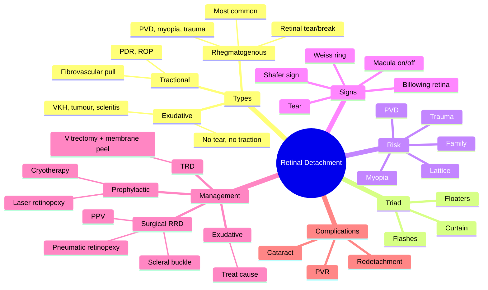

# Retinal Detachment

Related: [[Vitreous Haemorrhage]], [[Traumatic Cataract]], [[High Myopia]]

> [!tip] **FCPS/MRCP Priority: CRITICAL**
> Floaters, flashes, curtain → urgent vitreoretinal referral. Rhegmatogenous (tear) most common. Scleral buckle / vitrectomy / pneumatic retinopexy.

---

## Learning Objectives
- [ ] Define retinal detachment and identify the three types
- [ ] Describe the classic triad of rhegmatogenous RD
- [ ] List the major risk factors (myopia, PVD, trauma, family history)
- [ ] Differentiate rhegmatogenous, tractional, and exudative RD
- [ ] Explain the clinical significance of macula-on vs macula-off
- [ ] Recognise Shafer sign (tobacco dust)
- [ ] Outline surgical options and their indications
- [ ] Apply principles of prophylactic treatment of retinal tears

---

## 1. Definition / Epidemiology

### Definition
- **Retinal detachment (RD):** Separation of the neural retina from the retinal pigment epithelium (RPE)
- Subretinal fluid accumulates in the potential space between neurosensory retina and RPE
- **Vision-threatening emergency**

### Epidemiology
- Incidence ~10–15 per 100,000 per year
- Rhegmatogenous RD is the most common type
- Bilateral risk in 10–15% (especially with myopia, family history, Stickler syndrome)
- Slight male predominance
- Peaks in 6th–7th decade

---

## 2. Classification

### Rhegmatogenous (RRD) — most common (~75%)
- **Retinal tear / break** → vitreous fluid enters subretinal space
- "Rhegma" = rent/tear
- Causes: PVD, trauma, myopia, lattice degeneration

### Tractional (TRD)
- **Fibro-vascular proliferation** pulls retina (without tear)
- Causes: Advanced PDR, ROP, post-trauma, sickle cell retinopathy

### Exudative (Serous / Secondary)
- **Subretinal fluid** without tear or traction
- Causes: Vogt-Koyanagi-Harada, posterior scleritis, choroidal tumour (melanoma, metastasis), CSR, hypertensive choroidopathy, nanophthalmos, Coats disease

---

## 3. Risk Factors

- **Myopia** (especially high, >6D — axial elongation causes peripheral retinal thinning)
- Previous RD in fellow eye (most important predictor)
- Family history
- **Posterior vitreous detachment (PVD)** with tear
- Trauma (blunt or penetrating)
- Lattice degeneration
- Cataract / vitreous surgery (iatrogenic)
- Diabetic retinopathy / PDR
- Connective tissue disease: Stickler syndrome, Marfan, Ehlers-Danlos
- Glaucoma, especially with prior surgery

---

## 4. Clinical Features

### Classic Triad (Rhegmatogenous)
- **Floaters** (sudden, showers) — blood or pigment
- **Photopsia / flashes** (mechanical stimulation of retina)
- **Curtain / shadow** over visual field (peripheral, progressing centrally)

### Other Symptoms
- Central ↓VA if macula detached
- Painless (no inflammation)
- No RAPD (usually — preserved afferent pathway)
- May follow PVD event

### Special Patterns
- **Tractional:** Gradual ↓VA, no flashes, in advanced PDR
- **Exudative:** Variable, often with systemic features (VKH, malignancy)

---

## 5. Examination

- **Visual acuity** (critical — macula on vs off determines urgency)
- **Visual fields** (defect localises detachment — opposite quadrant)
- **Dilated fundus examination** (indirect ophthalmoscopy, scleral depression)
  - Pale, billowing, corrugated retina
  - Tear (horseshoe, dialysis, operculated, giant retinal tear)
  - Pigment in vitreous ("tobacco dust", **Shafer sign**)
  - PVD (Weiss ring — glial tissue detached from optic disc)
- **B-scan US** if media opaque (vitreous haemorrhage, cataract)
- IOP (usually ↓ in RRD due to cyclitic shutdown)

---

## 6. Macula On vs Off

- **Macula on:** Central vision preserved — EMERGENCY surgery to preserve; best visual outcome
- **Macula off:** Macula detached — urgent surgery, but visual prognosis worse; duration of macular detachment is the most important prognostic factor (best if <7 days)

---

## 7. Management

### Prophylactic (Tear without Detachment)
- **Laser retinopexy** or **cryotherapy** to wall off tear (creates chorioretinal adhesion)
- Indicated for: symptomatic tears, horseshoe tears, fellow eye of RD, high-risk lattice

### Surgical (Rhegmatogenous RD)
- **Scleral buckle** (explant) — external approach, indents sclera to close break
- **Pars plana vitrectomy (PPV)** — internal, removes vitreous traction, drainage of SRF, endolaser
- **Pneumatic retinopexy** (gas bubble C3F8 / SF6) — for small, superior breaks (limited indications)
- **Combined** (buckle + vitrectomy) for complex cases
- **Scleral buckling** for phakic, no PVR; **vitrectomy** for complex, pseudophakic, PVR, vitreous haemorrhage
- **Post-op positioning** (face-down or appropriate) for gas/silicone oil tamponade

### Tractional RD
- **Vitrectomy** + membrane peel + endolaser, often with silicone oil tamponade
- Pre-op anti-VEGF to reduce intraoperative bleeding

### Exudative RD
- **Treat underlying cause** (VKH — systemic steroid; tumour — treat primary; scleritis — NSAID)
- Observation if stable
- No surgery for the RD itself

---

## 8. Complications of RD / Surgery

- Proliferative vitreoretinopathy (PVR) — most common cause of surgical failure
- Re-detachment
- Macular pucker / epiretinal membrane
- Cataract (especially post-vitrectomy in phakic patients)
- Glaucoma (from gas expansion, silicone oil)
- Endophthalmitis
- Diplopia (from buckle)
- Vitreous haemorrhage

---

## 9. Red Flags / Emergencies

- Sudden floaters + flashes + curtain = RRD until proven otherwise
- Macula-on RD = emergency surgery (within 24h if possible)
- GCA must be considered in older patients
- Bilateral simultaneous exudative RD → think VKH, malignant hypertension

---

## 10. FCPS/MRCP High-Yield Summary

| Topic | Key Points |
|-------|------------|
| Triad | Floaters, flashes, curtain |
| Most common | Rhegmatogenous (tear) |
| Risk | Myopia, PVD, trauma, family |
| Shafer sign | Tobacco dust (pigment in vitreous) |
| Macula on | Emergency — better visual outcome |
| Treatment | Scleral buckle, vitrectomy, pneumatic retinopexy |
| Prophylactic | Laser/cryo for tear without detachment |

---

## 11. Viva Questions

1. **Q:** Differentiate the three types of retinal detachment.
   **A:** Rhegmatogenous = retinal tear. Tractional = fibrovascular pull (PDR). Exudative = subretinal fluid without tear (tumour, inflammation).

2. **Q:** What is the classic triad of RRD symptoms?
   **A:** Floaters, flashes (photopsia), curtain/shadow.

3. **Q:** What is Shafer sign?
   **A:** Pigment (tobacco dust) in anterior vitreous — sign of retinal break.

4. **Q:** What is the significance of macula on vs off?
   **A:** Macula on (central vision preserved) — emergency surgery, good visual outcome. Macula off — urgent surgery, worse visual prognosis.

5. **Q:** How does pneumatic retinopexy work, and what are its limits?
   **A:** Intravitreal gas bubble (C3F8 or SF6) tamponades the break against RPE; combined with cryo/laser to create adhesion. Only for small, superior, single-break detachments; not suitable for inferior breaks or PVR.

---

## 12. Common Confusions / Exam Traps

| Confusion | Clarification |
|-----------|---------------|
| "RD is painful" | RD is **painless**; pain suggests uveitis, scleritis, or endophthalmitis |
| "PVD = RD" | PVD is a risk factor but does not equal RD; RD requires a retinal break |
| "Vitrectomy is always first-line" | Choice depends on lens status, PVR, location of break, surgeon preference |
| "Pneumatic retinopexy works for any RD" | Only for small, superior, single breaks; inferior breaks fail |
| "Shafer sign is diagnostic of RD" | It is diagnostic of a **retinal break**; the retina may or may not be detached |
| "Macula-off RD can wait" | It is still urgent; visual outcome worsens with delay, especially after 7 days |
| "All retinal tears progress to RD" | Only symptomatic horseshoe/flap tears need prophylaxis; small holes may be observed |

---

## 13. Mnemonics

1. **"Floaters, Flashes, Falling curtain"** — **F³** = classic RRD triad
2. **"Rhegmatogenous = Rent/break → fluid in"** — "Rhegma" = Greek for tear/rent
3. **"Macula ON = hurry ON"** — emergency surgery to preserve central vision
4. **"TRD = Tugging without Tear"** — traction pulls retina, no break
5. **"Exudative = no tear, no traction"** — fluid leaks from choroid/RPE

---

## 14. Mind Map

---

## One-Page Revision Card

| **Topic** | **Retinal Detachment** |
|-----------|------------------------|
| **Definition** | Separation of neural retina from RPE |
| **Most common type** | Rhegmatogenous (retinal break) |
| **Triad** | Floaters, flashes, curtain |
| **Key sign** | Pale billowing retina, Shafer sign, Weiss ring |
| **Critical distinction** | Macula-on (emergency) vs macula-off (urgent) |
| **Risk factors** | Myopia, PVD, trauma, family, lattice |
| **Prophylaxis** | Laser/cryo for symptomatic tear |
| **Surgical options** | Scleral buckle, PPV, pneumatic retinopexy |
| **Viva Pearl** | F³ triad + macula status = urgency |

---

## Spaced Repetition Trackers

### 24-Hour Recall Prompts
- [ ] State the classic triad of rhegmatogenous RD
- [ ] List 4 risk factors for RD
- [ ] Define Shafer sign
- [ ] Differentiate RRD, TRD, and exudative RD
- [ ] Explain the difference between macula-on and macula-off RD in terms of urgency
- [ ] List 3 surgical options for RRD
- [ ] State the most common complication of RD surgery

### Revision Schedule
- [ ] **Day 1** completed (creation + 24h recall)
- [ ] **Day 3** revision completed
- [ ] **Day 7** revision completed
- [ ] **Day 15** revision completed
- [ ] **Day 30** revision completed
- [ ] **Day 90** revision completed

---

## Must Know / Should Know / Nice to Know

### Must Know (Core for passing)
- [x] Definition and three types of RD
- [x] Classic triad of RRD (floaters, flashes, curtain)
- [x] Risk factors (myopia, PVD, trauma, family history)
- [x] Shafer sign and Weiss ring
- [x] Macula-on vs macula-off
- [x] Surgical options (buckle, vitrectomy, pneumatic)

### Should Know (High probability)
- [x] Prophylactic treatment of retinal tears
- [x] PVR as a cause of surgical failure
- [x] Causes of TRD (PDR) and exudative RD (VKH, tumour)
- [x] Bilateral risk and fellow eye screening
- [x] When to use pneumatic retinopexy

### Nice to Know (Differentiator)
- [ ] Specific gas types (C3F8 vs SF6) and their duration
- [ ] Surgical details (drainage retinotomy, heavy liquids)
- [ ] Stickler syndrome features (high myopia, joint hypermobility, deafness, cleft palate)
- [ ] Argus II and other retinal prosthetics

---

## My Weak Points
- [ ] Add personal weak areas here

---

## Self-Test Scorecard

| Section | Score /5 |
|---------|----------|
| Understanding: | /10 |
| Recall: | /10 |
| MCQ Performance: | /10 |
| SBA Performance: | /10 |
| Viva Confidence: | /10 |
| Total: | /50 |

> [!tip] **Interpretation:** <35 = weak topic, 35-44 = acceptable but insecure, 45+ = strong exam-ready topic.

---

## Exam Answer Modes

### Long Answer Skeleton
1. Definition (separation of neural retina from RPE)
2. Three types (RRD, TRD, exudative) with pathophysiology of each
3. Risk factors (myopia, PVD, trauma, family, lattice, PDR)
4. Clinical features (triad: floaters, flashes, curtain)
5. Examination findings (billowing retina, tear, Shafer sign, Weiss ring)
6. Macula-on vs macula-off (urgency implications)
7. Management (prophylactic laser/cryo; surgical: buckle, PPV, pneumatic)
8. Complications (PVR, cataract, redetachment)

### Short Note Skeleton
- Definition + three types
- Triad of symptoms
- One-line on each management approach

### Viva One-Liners
- **Q:** Classic triad of RRD? → **A:** Floaters, flashes, curtain
- **Q:** What is Shafer sign? → **A:** Tobacco-dust pigment in anterior vitreous = sign of retinal break
- **Q:** Macula-on vs off? → **A:** Macula on = emergency, good prognosis; macula off = urgent, worse prognosis
- **Q:** Most common RD type? → **A:** Rhegmatogenous (tear)
- **Q:** First-line prophylaxis for a tear? → **A:** Laser retinopexy or cryotherapy

### Ward-Case Discussion Points
- Triadic history taking in any patient with floaters/flashes
- Importance of dilated fundus exam
- Distinguishing PVD from RD
- Urgency of macula-on RD
- Recognising PVR on follow-up
- Bilateral fellow-eye examination

### Last-Night-Before-Exam Sheet
- **Top 3 facts:** RRD most common; triad = F³; macula-on = emergency
- **Mnemonics:** "Floaters, Flashes, Falling curtain"; "Rhegma = rent/tear"
- **Must-know differential:** PVD (no break/tear); TRD (no break, traction); exudative (no break, no traction)
- **Surgical options:** Buckle / PPV / Pneumatic

---

## Summary

Retinal detachment is a vision-threatening emergency. Triad: floaters, flashes, curtain. Most common is rhegmatogenous (retinal tear). Risk factors: myopia, PVD, trauma, family history, lattice degeneration. Macula-on = emergency, better visual outcome; macula-off = urgent, worse visual prognosis. Surgery: scleral buckle, vitrectomy, pneumatic retinopexy. Prophylactic laser/cryotherapy for retinal tears without detachment. PVR is the most common cause of surgical failure.

## MCQs (10)

1. **Question:** The most common type of retinal detachment is:
   **Options:** A. Tractional B. Exudative C. Rhegmatogenous D. Serous E. All equal
   **Answer:** C
   **Explanation:** Rhegmatogenous (retinal break) accounts for ~75% of RDs.

2. **Question:** Shafer sign refers to:
   **Options:** A. Retinal tear B. Pigment in vitreous C. Disc oedema D. Macular hole E. None
   **Answer:** B
   **Explanation:** Tobacco-dust pigment in anterior vitreous indicates a retinal break.

3. **Question:** A patient has sudden onset of floaters, flashes, and a curtain in the peripheral visual field. Most likely diagnosis:
   **Options:** A. Vitreous haemorrhage B. Retinal detachment C. CRAO D. Optic neuritis E. Acute glaucoma
   **Answer:** B
   **Explanation:** Classic F³ triad = RRD.

4. **Question:** Prophylactic treatment of an asymptomatic retinal tear without detachment is:
   **Options:** A. Vitrectomy B. Laser retinopexy / cryotherapy C. Scleral buckle D. Observation E. Anti-VEGF
   **Answer:** B
   **Explanation:** Laser retinopexy or cryotherapy creates chorioretinal adhesion to wall off the tear.

5. **Question:** Which type of RD is associated with advanced proliferative diabetic retinopathy?
   **Options:** A. Rhegmatogenous B. Tractional C. Exudative D. Serous E. Combined hamartoma
   **Answer:** B
   **Explanation:** TRD is caused by fibrovascular proliferation (e.g., PDR) pulling the retina.

6. **Question:** "Macula-on" retinal detachment means:
   **Options:** A. Macula is detached B. Macula is attached C. Disc is detached D. Whole retina is detached E. None
   **Answer:** B
   **Explanation:** Macula still attached = central vision preserved = emergency surgery for best outcome.

7. **Question:** The most important systemic risk factor for retinal detachment is:
   **Options:** A. Diabetes B. Hypertension C. High myopia D. Hyperlipidaemia E. Smoking
   **Answer:** C
   **Explanation:** High myopia (>6D) causes peripheral retinal thinning and predisposes to tears.

8. **Question:** Pneumatic retinopexy is most suitable for:
   **Options:** A. Inferior retinal break B. Large giant retinal tear C. Small, superior, single break D. Advanced PVR E. TRD from PDR
   **Answer:** C
   **Explanation:** Works only for small, superior breaks; inferior breaks fail because gas rises.

9. **Question:** Which is the most common cause of failure of RD surgery?
   **Options:** A. Endophthalmitis B. Proliferative vitreoretinopathy (PVR) C. Glaucoma D. Cataract E. Uveitis
   **Answer:** B
   **Explanation:** PVR (epiretinal/subretinal membranes) is the most common cause of surgical failure.

10. **Question:** The Weiss ring on fundus examination is a sign of:
    **Options:** A. Retinal detachment B. Posterior vitreous detachment C. Macular hole D. Vitreous haemorrhage E. Asteroid hyalosis
    **Answer:** B
    **Explanation:** Weiss ring = glial tissue detached from optic disc margin = PVD.

## SBA Questions (10)

1. **Scenario:** A 60-year-old myope has sudden floaters, flashes, and a peripheral curtain progressing centrally. Dilated exam shows a billowing retina with a horseshoe tear.
   **Question:** Diagnosis and treatment?
   **Options:** A. PVD only, observe B. RRD, urgent surgery C. TRD, observation D. Exudative RD, steroids E. Vitreous haemorrhage, rest
   **Answer:** B
   **Explanation:** Classic RRD — urgent surgery (buckle/vitrectomy/pneumatic).

2. **Scenario:** A 25-year-old with insulin-dependent diabetes has gradual painless vision loss in one eye. Fundus shows fibrovascular membranes pulling the retina.
   **Question:** Most likely diagnosis?
   **Options:** A. RRD B. TRD C. Exudative RD D. Macular hole E. Vitreous haemorrhage
   **Answer:** B
   **Explanation:** Advanced PDR causes TRD from fibrovascular traction without retinal break.

3. **Scenario:** A 35-year-old presents with bilateral serous retinal detachments, headache, tinnitus, and vitiligo.
   **Question:** Most likely diagnosis?
   **Options:** A. RRD B. TRD C. Vogt-Koyanagi-Harada disease D. Sympathetic ophthalmia E. Coats disease
   **Answer:** C
   **Explanation:** VKH = bilateral exudative RD + neurological (headache, tinnitus) + integumentary (vitiligo, poliosis) features.

4. **Scenario:** A 55-year-old myope has floaters but no flashes or curtain. Dilated exam shows a Weiss ring but no retinal break.
   **Question:** Most appropriate management?
   **Options:** A. Urgent surgery B. Laser retinopexy C. Reassurance and review in 4–6 weeks D. Vitrectomy E. Scleral buckle
   **Answer:** C
   **Explanation:** PVD alone without a retinal break does not need surgery; review to ensure no subsequent tear.

5. **Scenario:** A patient with macula-on superior RRD and a single small horseshoe tear is offered treatment.
   **Question:** Which is the most appropriate single intervention?
   **Options:** A. Vitrectomy + silicone oil B. Pneumatic retinopexy C. Scleral buckle D. Laser retinopexy only E. Observation
   **Answer:** B
   **Explanation:** Small, superior, single break = ideal for pneumatic retinopexy.

6. **Scenario:** A 70-year-old had successful RD surgery 2 months ago and now presents with a red eye, ↓VA, and a high IOP of 50 mmHg. Anterior segment shows corneal oedema and a fixed mid-dilated pupil.
   **Question:** Most likely diagnosis?
   **Options:** A. Acute angle-closure glaucoma B. Neovascular glaucoma C. Endophthalmitis D. Uveitis E. Aphakic glaucoma
   **Answer:** B
   **Explanation:** Post-RD surgery, especially with ischaemic retinal disease, can cause rubeosis iridis → neovascular glaucoma.

7. **Scenario:** A patient with a history of retinal detachment surgery now presents 3 months later with reduced vision. OCT shows an epiretinal membrane with retinal distortion.
   **Question:** Most likely cause of visual loss?
   **Options:** A. Recurrent RD B. Macular pucker (ERM) C. Cataract D. Endophthalmitis E. Vitreous haemorrhage
   **Answer:** B
   **Explanation:** Macular pucker / ERM is a common post-RD surgery complication causing metamorphopsia and ↓VA.

8. **Scenario:** A 45-year-old with sudden floaters and flashes has a dilated exam showing a horseshoe tear in the superotemporal quadrant with localised subretinal fluid but no frank detachment.
   **Question:** Best management?
   **Options:** A. Vitrectomy B. Scleral buckle C. Laser retinopexy to wall off the tear D. Pneumatic retinopexy E. Observation only
   **Answer:** C
   **Explanation:** A symptomatic tear with localised fluid (subclinical RD) is best treated with laser retinopexy or cryotherapy to prevent progression.

9. **Scenario:** A patient with RRD has a giant retinal tear (≥3 clock hours) with inverted retinal flap.
   **Question:** Most appropriate surgical approach?
   **Options:** A. Pneumatic retinopexy B. Scleral buckle C. Pars plana vitrectomy with heavy liquid and silicone oil D. Laser alone E. Observation
   **Answer:** C
   **Explanation:** Giant retinal tears require PPV with heavy liquids/perfluorocarbon to unfold the retina and silicone oil tamponade.

10. **Scenario:** A patient with retinal detachment surgery has gas tamponade (C3F8). What postoperative advice is critical?
    **Options:** A. Avoid air travel B. Stay upright only C. Sleep prone only D. Avoid driving only E. Resume normal activity
    **Answer:** A
    **Explanation:** Gas expands at altitude — air travel, nitrous oxide anaesthesia, and high-altitude locations are contraindicated until gas absorbs.

## Flashcards

- **Q:** What is the classic triad of rhegmatogenous retinal detachment?
  **A:** Floaters, flashes (photopsia), curtain/shadow over visual field.
- **Q:** What is Shafer sign?
  **A:** Tobacco-dust pigment in anterior vitreous — sign of a retinal break.
- **Q:** What is the most common type of RD?
  **A:** Rhegmatogenous (retinal tear).
- **Q:** Macula-on vs macula-off RD?
  **A:** Macula on = emergency surgery, good visual outcome; macula off = urgent, worse visual prognosis.
- **Q:** Name 3 surgical options for RRD.
  **A:** Scleral buckle, pars plana vitrectomy (PPV), pneumatic retinopexy.

## Answer Key with Explanations

### MCQs
1. C — Rhegmatogenous (retinal break) is the most common (~75%)
2. B — Shafer sign = pigment (tobacco dust) in anterior vitreous
3. B — Classic F³ triad indicates RRD
4. B — Laser retinopexy or cryotherapy is the prophylaxis of choice for a tear
5. B — PDR causes fibrovascular traction = TRD
6. B — Macula-on = macula still attached = central vision preserved
7. C — High myopia is the strongest myopic risk factor for RD
8. C — Pneumatic retinopexy works only for small, superior, single breaks
9. B — PVR is the most common cause of RD surgical failure
10. B — Weiss ring is pathognomonic of PVD

### SBAs
1. B — Classic RRD with break → urgent surgery
2. B — Fibrovascular pull in PDR = TRD
3. C — VKH = bilateral exudative RD + neurological + integumentary features
4. C — PVD alone without break needs review, not surgery
5. B — Small superior break = ideal for pneumatic retinopexy
6. B — Post-RD neovascularisation causes NVG
7. B — Macular pucker is a common post-RD surgery complication
8. C — Localised subretinal fluid with tear = laser retinopexy
9. C — Giant retinal tear needs PPV + heavy liquid + silicone oil
10. A — Gas expands at altitude; no air travel

## Tags
#medicine #davidson #ophthalmology #retinal-detachment #fcps #mrcp

## PasTest Scenario SBAs (Clinical Vignettes)

> **Auto-generated PasTest/Mediscope-style scenario SBAs** grounded in the authored source. Each scenario tests a real clinical fact (triad, specific sign, contraindication, trial, first-line Rx) extracted from the topic. *Source: Ch 28: Medical Ophthalmology — Retinal Detachment*

**Q1.** What is the most appropriate first-line therapy for Retinal Detachment?

  - **A.** Treat underlying cause
  - **B.** An advanced/surgical therapy reserved for refractory disease
  - **C.** Symptomatic treatment only, no disease-modifying therapy
  - **D.** Empiric broad-spectrum therapy without specific indication

  > **Answer: A** — Treat underlying cause
  >
  > *Source:* **Treat underlying cause** (VKH — systemic steroid; tumour — treat primary; scleritis — NSAID)

