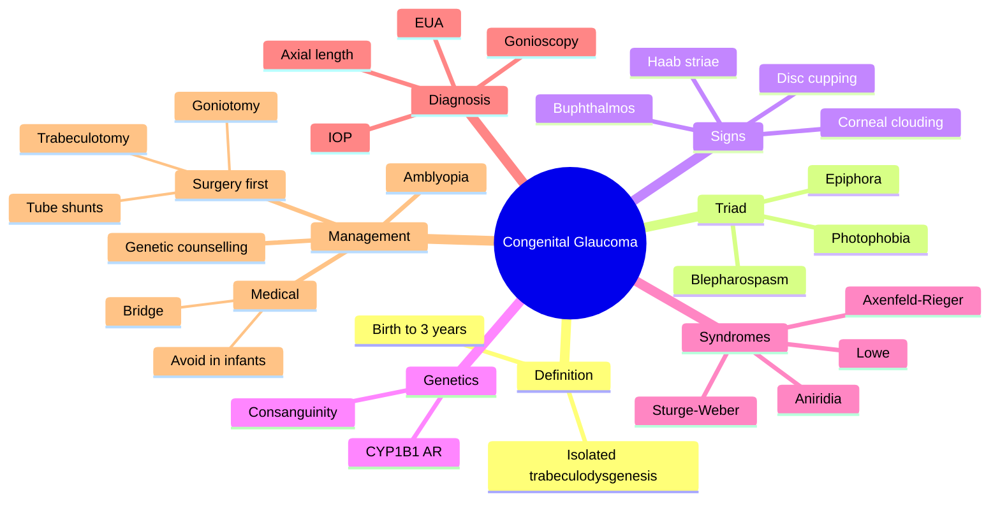

# Congenital / Developmental Glaucoma

Related: [[Primary Open-Angle Glaucoma (POAG)]], [[Sturge-Weber Syndrome]]

> [!tip] **FCPS/MRCP Priority: MEDIUM**
> Buphthalmos, photophobia, tearing, corneal clouding in infant. Goniotomy, trabeculotomy first-line surgery.

---

## Learning Objectives
- [ ] Define primary congenital glaucoma (PCG)
- [ ] Recall epidemiology and genetics (CYP1B1)
- [ ] Recognise the classic triad (photophobia, epiphora, blepharospasm)
- [ ] Examine under anaesthesia (EUA) — IOP, pachymetry, gonioscopy, axial length
- [ ] Outline first-line surgery (goniotomy, trabeculotomy)
- [ ] Identify secondary forms (Sturge-Weber, Axenfeld-Rieger, aniridia, Lowe)
- [ ] Counsel on genetic testing and family screening

---

## 1. Definition / Epidemiology / Classification

### Definition
- **Primary congenital glaucoma (PCG):** Glaucoma from birth (or first 3 years) due to isolated maldevelopment of the trabecular meshwork (no other ocular anomalies)
- **Developmental / secondary glaucomas:** Associated with other ocular anomalies or systemic syndromes (e.g., Sturge-Weber)

### Epidemiology
- 1:10,000–20,000 births
- 65% bilateral
- More common with consanguineous parents
- Slight male predominance (~3:2)

### Genetics
- **CYP1B1** gene most common (autosomal recessive)
- LTBP2, MYOC, FOXC1, PITX2 in some families

### Classification (by age of onset)
- **Newborn (true congenital)** — at birth
- **Infantile** — within first year
- **Late-onset / juvenile** — after age 3 (closer to juvenile open-angle)

---

## 2. Aetiology / Pathophysiology

### Aetiology
- Isolated trabeculodysgenesis (PCG)
- Associated ocular anomalies (anterior segment dysgenesis)
- Systemic syndromes (Sturge-Weber, Axenfeld-Rieger, aniridia, Lowe, neurofibromatosis)

### Pathophysiology
- Maldevelopment of trabecular meshwork and angle structures
- High IOP → globe stretches (buphthalmos, before age 3) → corneal oedema, breaks in Descemet's (Haab striae)
- Optic nerve damage (cupping may reverse with treatment in children)

---

## 3. Risk Factors

- **Consanguineous parents**
- **Family history** (autosomal recessive CYP1B1)
- **Male sex** (slight predominance)
- **Syndromic associations:**
  - Sturge-Weber syndrome (port-wine stain, leptomeningeal angioma)
  - Axenfeld-Rieger syndrome (iridocorneal adhesions, posterior embryotoxon)
  - Aniridia (PAX6, WAGR)
  - Lowe syndrome (oculocerebrorenal)
  - Neurofibromatosis

---

## 4. Clinical Features

### Classic Triad ("the 3 Ps")
- **Photophobia** (sensitivity to light)
- **Epiphora** (tearing / watering)
- **Blepharospasm** (eyelid squeezing)

### Other Features
- **Corneal clouding / oedema** (hazy, "steamy")
- **Haab striae** — horizontal breaks in Descemet's membrane from globe stretching
- **Buphthalmos** (ox-eye) — enlarged globe; ONLY in infants <3 y (sclera stretches under chronic IOP)
- ↑ **Axial length** (myopia)
- ↑ **IOP** (often difficult in clinic — EUA needed)
- **Optic disc cupping** (may be reversible with treatment in young children)

---

## 5. Investigations (EUA — Examination Under Anaesthesia)

- **IOP** (with Perkins tonometer — Goldmann not feasible in infant)
- **Corneal diameter** (≥12 mm in newborn = abnormal)
- **Pachymetry** (corneal thickness — affects IOP reading)
- **Gonioscopy** (Koeppe lens) — trabeculodysgenesis
- **Fundus** — disc cupping (CDR > 0.3 in infant is suspicious)
- **Axial length** (A-scan)
- **Cycloplegic refraction** (myopic shift)
- ± **OCT / RNFL** (limited in infants)
- ± **Visual fields** (older children)

---

## 6. Differential Diagnosis

| Condition | Distinguishing |
|-----------|----------------|
| **Mucopolysaccharidoses** (e.g., Hurler) | Corneal clouding but no IOP rise, systemic features |
| **Birth trauma** (forceps) | Vertical Descemet's breaks, no IOP rise, history |
| **Congenital corneal dystrophy** | Bilateral, no IOP rise, family history |
| **Megalocornea** | Large cornea, no IOP rise, no optic nerve damage |
| **Nasolacrimal duct obstruction** | Epiphora only, no photophobia/blepharospasm/cornea |
| **Congenital hereditary endothelial dystrophy** | Bilateral corneal oedema, normal IOP |
| **Anterior segment dysgenesis** | Other angle/iris anomalies |

---

## 7. Management

### Principles
- **Surgical first-line** — medications less effective in children
- Treat early to prevent irreversible optic nerve damage and amblyopia

### Surgical Options

| Procedure | Indication |
|-----------|------------|
| **Goniotomy** | Clear cornea; ab interno incision through trabeculum |
| **Trabeculotomy** | Opaque cornea; ab externo, Schlemm's canal probed |
| **Combined trabeculotomy–trabeculectomy** | Variable |
| **Trabeculectomy ± antifibrotics (MMC)** | Refractory |
| **Tube shunts** (Ahmed, Baerveldt) | Refractory |
| **Cyclodestruction** (cyclodiode, cryo) | End-stage |

### Medical (Temporising)
- **β-blockers** (timolol) — avoid in <1 year (apnoea risk)
- **Dorzolamide** (carbonic anhydrase inhibitor)
- **Prostaglandin analogues** (latanoprost)
- **Brimonidine** — avoid in <2 y (CNS depression)
- **Acetazolamide** — short-term
- Not curative — bridge to surgery

### Adjunctive
- **Treat amblyopia** — refractive correction, patching
- **Genetic counselling** — autosomal recessive (CYP1B1)
- **Family screening** — siblings

---

## 8. Complications

- **Optic atrophy** (if delayed treatment)
- **Amblyopia** (anisometropic, stimulus deprivation)
- **Corneal scarring** (Haab striae, persistent oedema)
- **Endothelial decompensation** (bullous keratopathy)
- **Glaucoma recurrence** — long-term follow-up
- **Surgical complications** — hyphaema, infection, anaesthesia risks

---

## 9. Red Flags / Emergencies

- Newborn with cloudy cornea + tearing + photophobia = urgent EUA
- Sturge-Weber infant with high IOP = high risk
- Rapidly enlarging eye (buphthalmos) = urgent

---

## 10. FCPS/MRCP High-Yield Summary

| Topic | Key Points |
|-------|------------|
| Triad | Photophobia, epiphora, blepharospasm |
| Buphthalmos | Enlarged globe (infant) |
| Haab striae | Horizontal breaks in Descemet's |
| Gene | CYP1B1 (AR) |
| Diagnosis | EUA |
| Surgery | Goniotomy, trabeculotomy |
| Syndromes | Sturge-Weber, Axenfeld-Rieger, Aniridia, Lowe |
| Avoid in <1 y | Timolol, brimonidine (CNS) |
| Cupping | May reverse with treatment in children |

---

## 11. Viva Questions

1. **Q:** What is the classic triad of congenital glaucoma?
   **A:** Photophobia, epiphora, blepharospasm.

2. **Q:** What is the first-line surgery for congenital glaucoma?
   **A:** Goniotomy (if clear cornea) or trabeculotomy (if opaque cornea).

3. **Q:** What is the most common gene involved in PCG?
   **A:** CYP1B1 (autosomal recessive).

4. **Q:** What are Haab striae?
   **A:** Horizontal breaks in Descemet's membrane from globe stretching under raised IOP in infants.

5. **Q:** Why avoid timolol in <1 year?
   **A:** Risk of bradycardia and apnoea.

---

## 12. Common Confusions / Exam Traps

| Confusion | Clarification |
|-----------|---------------|
| "Buphthalmos in adults" | Only in infants <3 y (sclera stretches); adults get optic atrophy instead |
| "Cupping always irreversible" | In children, cupping may REVERSE with successful treatment |
| "Birth trauma = Haab striae" | Birth trauma gives VERTICAL Descemet's breaks; Haab striae are HORIZONTAL |
| "Megalocornea = buphthalmos" | Megalocornea = large cornea, no IOP rise; buphthalmos = enlarged eye with IOP rise |
| "Glaucoma drops are first-line" | In children, surgery is first-line; drops are temporising |
| "Brimonidine safe in infants" | Avoid <2 y (CNS depression) |
| "Photophobia is from light" | From corneal oedema / epithelial disruption |
| "All PCG is bilateral" | 65% bilateral; can be unilateral |
| "Lowe syndrome is PCG" | It's a secondary glaucoma (oculocerebrorenal) |
| "Aniridia = no iris" | Variable iris hypoplasia, glaucoma is a complication |

---

## 13. Mnemonics

1. **"3 Ps: Photophobia, Photophobia… wait — Photophobia, epiphora, blepharospasm"** — Classic triad
2. **"BUPHTHALMOS = Big Under Pressure, High Tension, AC Lengthened, Mostly in Young"** — only in infants
3. **"Goniotomy for Good cornea; Trabeculotomy for Turbid"** — clear vs opaque cornea

---

## 14. Mind Map

---

## 15. One-Page Revision Card

| **Topic** | **Congenital Glaucoma** |
|-----------|------------------------|
| **Triad** | Photophobia, epiphora, blepharospasm |
| **Buphthalmos** | Enlarged globe (infant <3 y) |
| **Haab striae** | Horizontal Descemet's breaks |
| **Gene** | CYP1B1 (autosomal recessive) |
| **Diagnosis** | EUA |
| **Surgery first** | Goniotomy (clear cornea) / Trabeculotomy (opaque) |
| **Avoid in <1 y** | Timolol (apnoea), brimonidine (CNS) |
| **Cupping** | May reverse with treatment |
| **Syndromes** | Sturge-Weber, Axenfeld-Rieger, aniridia, Lowe |
| **Viva Pearl** | 3 Ps + buphthalmos + cloudy cornea = PCG |

---

## 16. Spaced Repetition Trackers

### 24-Hour Recall Prompts
- [ ] State the classic triad of congenital glaucoma
- [ ] List 3 syndromes associated with congenital glaucoma
- [ ] Outline the surgical management
- [ ] Identify the genetic basis (CYP1B1)

### Revision Schedule
- [ ] **Day 1** completed (creation + 24h recall)
- [ ] **Day 3** revision completed
- [ ] **Day 7** revision completed
- [ ] **Day 15** revision completed
- [ ] **Day 30** revision completed
- [ ] **Day 90** revision completed

---

## 17. Must Know / Should Know / Nice to Know

### Must Know (Core for passing)
- [x] Classic triad (3 Ps)
- [x] Buphthalmos (only in infants)
- [x] Haab striae (horizontal Descemet's breaks)
- [x] Surgery first-line (goniotomy / trabeculotomy)
- [x] CYP1B1 (autosomal recessive)

### Should Know (High probability)
- [x] Syndromic associations (Sturge-Weber, Axenfeld-Rieger, aniridia, Lowe)
- [x] EUA (IOP, pachymetry, gonioscopy, axial length)
- [x] Cupping may reverse in children
- [x] Avoid timolol <1 y, brimonidine <2 y

### Nice to Know (Differentiator)
- [ ] Axenfeld-Rieger features (posterior embryotoxon)
- [ ] Lowe syndrome (oculocerebrorenal)
- [ ] WAGR + aniridia (WT1 deletion)
- [ ] Combined trabeculotomy–trabeculectomy outcomes
- [ ] Cyclodiode in refractory cases

---

## 18. My Weak Points
- [ ] Add personal weak areas here

---

## 19. Self-Test Scorecard

| Section | Score /5 |
|---------|----------|
| Understanding: | /10 |
| Recall: | /10 |
| MCQ Performance: | /10 |
| SBA Performance: | /10 |
| Viva Confidence: | /10 |
| Total: | /50 |

> [!tip] **Interpretation:** <35 = weak topic, 35-44 = acceptable but insecure, 45+ = strong exam-ready topic.

---

## 20. Exam Answer Modes

### Long Answer Skeleton
1. Definition (isolated trabeculodysgenesis, birth to 3 y)
2. Epidemiology + genetics (CYP1B1, AR, consanguinity)
3. Pathophysiology (maldeveloped trabeculum → ↑IOP → buphthalmos)
4. Clinical features (3 Ps triad, buphthalmos, corneal clouding, Haab striae, cupping)
5. Investigations (EUA — IOP, pachymetry, gonioscopy, axial length, disc)
6. Differential (mucopolysaccharidoses, birth trauma, megalocornea)
7. Management
   - Surgery first (goniotomy, trabeculotomy)
   - Medical (temporising, avoid <1 y)
   - Treat amblyopia, genetic counselling
8. Complications (optic atrophy, amblyopia, corneal scarring)

### Short Note Skeleton
- Triad
- Buphthalmos + Haab striae
- Surgery (goniotomy/trabeculotomy)

### Viva One-Liners
- **Q:** Triad? → **A:** Photophobia, epiphora, blepharospasm
- **Q:** First-line surgery? → **A:** Goniotomy (clear cornea) or trabeculotomy (opaque)
- **Q:** Gene? → **A:** CYP1B1 (autosomal recessive)
- **Q:** What are Haab striae? → **A:** Horizontal Descemet's breaks from globe stretching

### Ward-Case Discussion Points
- EUA planning and findings
- Counselling parents on lifelong follow-up
- Recognise syndromic associations
- Amblyopia management
- Genetic counselling and family screening

### Last-Night-Before-Exam Sheet
- **Top 3 facts:** 3 Ps (photophobia, epiphora, blepharospasm); buphthalmos in <3 y; surgery (goniotomy/trabeculotomy)
- **1 mnemonic:** "Goniotomy for Good cornea; Trabeculotomy for Turbid"
- **Must-know differential:** Birth trauma (vertical Descemet's breaks)

---

## Summary
Primary congenital glaucoma is caused by isolated trabeculodysgenesis (CYP1B1, autosomal recessive), presenting in the first 3 years of life with the classic triad of photophobia, epiphora, and blepharospasm. Signs include buphthalmos (only in infants), corneal clouding, Haab striae (horizontal Descemet's breaks), and disc cupping (may reverse). Diagnosis is by EUA. First-line treatment is surgery (goniotomy if clear cornea, trabeculotomy if opaque). Avoid timolol <1 year and brimonidine <2 years. Secondary forms are seen in Sturge-Weber, Axenfeld-Rieger, aniridia, and Lowe syndromes. Long-term follow-up is needed for amblyopia and IOP control.

---

## MCQs (10)

1. **Question:** Classic triad of congenital glaucoma is:
   **Options:** A. Pain, halos, ↓VA B. Photophobia, epiphora, blepharospasm C. Pain, redness, ↑IOP D. Headache, vomiting, ↓VA E. Sectoral disc pallor
   **Answer:** B
   **Explanation:** Photophobia, tearing, spasm = 3 Ps.

2. **Question:** Buphthalmos in congenital glaucoma is due to:
   **Options:** A. Acute IOP rise B. Chronic elevated IOP in growing eye (sclera stretches) C. Trauma D. Cataract E. Genetic mutation alone
   **Answer:** B
   **Explanation:** Buphthalmos = globe stretches under chronic IOP in infant (sclera elastic before age 3).

3. **Question:** First-line surgery for congenital glaucoma (clear cornea) is:
   **Options:** A. Trabeculectomy B. Goniotomy C. LPI D. Cyclodestruction E. Tube shunt
   **Answer:** B
   **Explanation:** Goniotomy — ab interno incision through trabeculum; preferred if cornea clear.

4. **Question:** Haab striae are breaks in:
   **Options:** A. Bowman's membrane (vertical) B. Descemet's membrane (horizontal) C. Lens capsule D. Retinal pigment epithelium E. Sclera
   **Answer:** B
   **Explanation:** Haab striae = horizontal breaks in Descemet's from globe stretching.

5. **Question:** The most common gene involved in primary congenital glaucoma is:
   **Options:** A. MYOC B. CYP1B1 C. PAX6 D. FOXC1 E. PITX2
   **Answer:** B
   **Explanation:** CYP1B1 (autosomal recessive) is the most common gene in PCG.

6. **Question:** Which drug should be AVOIDED in <1 year for congenital glaucoma?
   **Options:** A. Dorzolamide B. Timolol (β-blocker) C. Latanoprost D. Brimonidine E. Pilocarpine
   **Answer:** B
   **Explanation:** Timolol can cause bradycardia and apnoea in <1 year.

7. **Question:** A newborn with cloudy cornea and tearing since birth. Slit-lamp shows horizontal breaks in Descemet's.
   **Question:** Most likely diagnosis?
   **Options:** A. Birth trauma (forceps) B. Congenital glaucoma (Haab striae) C. Megalocornea D. Corneal dystrophy E. Mucopolysaccharidosis
   **Answer:** B
   **Explanation:** Horizontal Descemet's breaks + cloudy cornea + tearing = congenital glaucoma (Haab striae).

8. **Question:** Sturge-Weber syndrome is associated with glaucoma in approximately what % of cases?
   **Options:** A. 1% B. 10% C. 30–50% D. 90% E. 100%
   **Answer:** C
   **Explanation:** Sturge-Weber has 30–50% risk of glaucoma (especially with upper lid port-wine stain).

9. **Question:** Axenfeld-Rieger syndrome features include all EXCEPT:
   **Options:** A. Posterior embryotoxon B. Iridocorneal adhesions C. Iris hypoplasia D. Cataract as main feature E. Glaucoma
   **Answer:** D
   **Explanation:** Cataract is not a primary feature; angle anomalies (posterior embryotoxon) and glaucoma are typical.

10. **Question:** In congenital glaucoma, optic disc cupping:
    **Options:** A. Is always irreversible B. May be reversible with treatment C. Always requires surgery D. Does not occur E. Occurs only in adults
    **Answer:** B
    **Explanation:** In children, cupping may reverse with successful IOP control (elastic optic nerve).

---

## SBA Questions (10)

1. **Scenario:** A 6-month-old presents with photophobia, tearing, and blepharospasm since birth. The mother is consanguineous. The cornea is hazy, eye is enlarged.
   **Question:** Most likely diagnosis?
   **Options:** A. Megalocornea B. Primary congenital glaucoma C. Birth trauma D. Nasolacrimal duct obstruction E. Congenital cataract
   **Answer:** B
   **Explanation:** 3 Ps + buphthalmos + cloudy cornea + consanguinity = PCG.

2. **Scenario:** A 9-month-old with cloudy cornea and buphthalmos needs definitive IOP lowering. Corneal oedema prevents clear view.
   **Question:** Most appropriate surgery?
   **Options:** A. Goniotomy B. Trabeculotomy C. LPI D. Cyclodestruction E. Cataract surgery
   **Answer:** B
   **Explanation:** Opaque cornea → trabeculotomy (ab externo).

3. **Scenario:** A 4-month-old with PCG and IOP 35 mmHg. The parents are worried. Genetic testing is positive for CYP1B1.
   **Question:** What is the inheritance?
   **Options:** A. Autosomal dominant B. Autosomal recessive C. X-linked D. Mitochondrial E. Sporadic
   **Answer:** B
   **Explanation:** CYP1B1 — autosomal recessive; siblings have 25% risk.

4. **Scenario:** A newborn with bilateral corneal clouding, IOP 25, and breaks in Descemet's membrane.
   **Question:** Most appropriate next step?
   **Options:** A. Discharge B. Examination under anaesthesia + urgent surgery C. Topical steroid trial D. Observation for 6 months E. Topical antibiotic
   **Answer:** B
   **Explanation:** PCG requires EUA + urgent surgery (goniotomy or trabeculotomy).

5. **Scenario:** A child with PCG has undergone trabeculotomy. 6 months later IOP is 22 mmHg. Disc cupping has reduced.
   **Question:** Most appropriate interpretation?
   **Options:** A. Surgical failure B. Partial success — IOP lowered, cupping reversed; continue monitoring C. Need cyclodestruction D. Enucleation E. Discharge from follow-up
   **Answer:** B
   **Explanation:** IOP lowered to a moderate level + cupping reversal = partial success; monitor and treat further if needed.

6. **Scenario:** A child with Sturge-Weber syndrome has a port-wine stain involving the V1 distribution. IOP is borderline.
   **Question:** Best management?
   **Options:** A. Discharge B. Regular IOP and disc monitoring (30–50% risk of glaucoma) C. Enucleation D. LPI E. Routine cataract surgery
   **Answer:** B
   **Explanation:** Sturge-Weber: 30–50% risk of glaucoma; regular lifelong monitoring essential.

7. **Scenario:** A 2-year-old with PCG is on timolol but bradycardia develops.
   **Question:** Most appropriate action?
   **Options:** A. Increase dose B. Stop timolol, consider other agents (e.g., dorzolamide) C. Continue — side effect expected D. Enucleation E. Vitrectomy
   **Answer:** B
   **Explanation:** β-blockers can cause bradycardia/apnoea in children — stop and switch.

8. **Scenario:** A child with PCG is treated successfully but develops a corneal scar with poor vision despite normal IOP.
   **Question:** What is the most likely cause of vision loss?
   **Options:** A. Glaucoma progression B. Amblyopia (stimulus deprivation) C. Retinal detachment D. Uveitis E. Retinoblastoma
   **Answer:** B
   **Explanation:** Stimulus deprivation amblyopia from corneal scarring is common — treat with refractive correction and patching.

9. **Scenario:** A newborn with bilateral corneal opacity, nystagmus, hypotonia, and renal tubular dysfunction.
   **Question:** Most likely diagnosis?
   **Options:** A. PCG B. Lowe syndrome (oculocerebrorenal) C. Sturge-Weber D. Axenfeld-Rieger E. Aniridia
   **Answer:** B
   **Explanation:** Lowe syndrome = cataract, glaucoma, hypotonia, renal tubular dysfunction.

10. **Scenario:** A child with aniridia is at risk of:
    **Options:** A. Cataract B. Glaucoma C. Corneal pannus D. All of the above E. None
    **Answer:** D
    **Explanation:** Aniridia (PAX6) — foveal hypoplasia, nystagmus, cataract, corneal pannus, glaucoma, and Wilms tumour (WAGR).

---

## Flashcards

- **Q:** Classic triad of congenital glaucoma?
  **A:** Photophobia, epiphora, blepharospasm (3 Ps).
- **Q:** First-line surgery for congenital glaucoma?
  **A:** Goniotomy (if clear cornea) or trabeculotomy (if opaque).
- **Q:** Most common gene in primary congenital glaucoma?
  **A:** CYP1B1 — autosomal recessive.
- **Q:** What are Haab striae?
  **A:** Horizontal breaks in Descemet's membrane from globe stretching under chronic IOP in infants.
- **Q:** Which drugs should be avoided in young children with glaucoma?
  **A:** Timolol <1 year (apnoea, bradycardia), brimonidine <2 years (CNS depression).

---

## Answer Key with Explanations

### MCQs
1. B — 3 Ps: photophobia, epiphora, blepharospasm
2. B — Buphthalmos from chronic IOP in growing eye
3. B — Goniotomy for clear cornea
4. B — Haab striae = horizontal Descemet's breaks
5. B — CYP1B1 is most common gene (AR)
6. B — Timolol <1 y can cause apnoea/bradycardia
7. B — Horizontal Descemet's breaks = Haab striae (PCG)
8. C — Sturge-Weber: 30–50% glaucoma risk
9. D — Cataract is NOT primary; angle anomalies are
10. B — Cupping may reverse in children

### SBAs
1. B — 3 Ps + buphthalmos + cloudy cornea = PCG
2. B — Opaque cornea → trabeculotomy
3. B — CYP1B1 = autosomal recessive
4. B — PCG: EUA + urgent surgery
5. B — IOP lowered + cupping reversed = partial success
6. B — Sturge-Weber: 30–50% glaucoma risk — monitor
7. B — Stop timolol, switch agent
8. B — Amblyopia is the main vision threat
9. B — Lowe syndrome: cataract, glaucoma, hypotonia, renal dysfunction
10. D — Aniridia has multiple ocular associations

## Tags
#medicine #davidson #ophthalmology #congenital-glaucoma #fcps #mrcp
