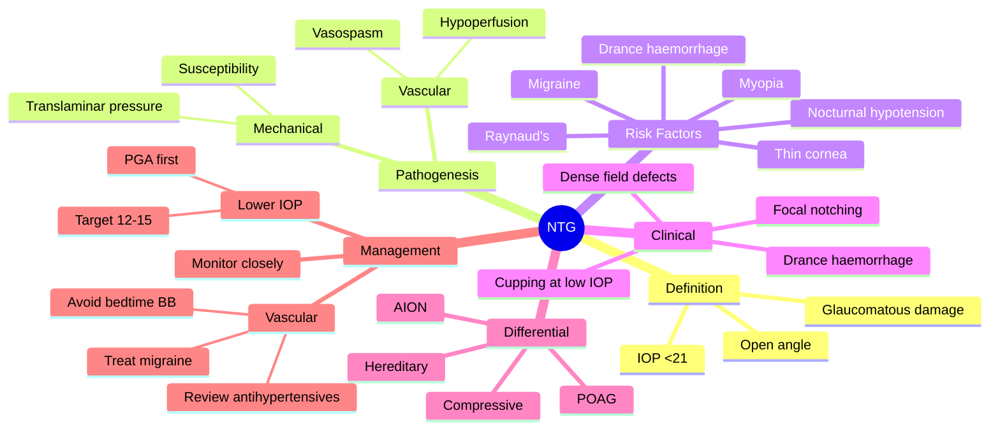

# Normal-Tension Glaucoma (NTG)

Related: [[Primary Open-Angle Glaucoma (POAG)]], [[Anterior Ischaemic Optic Neuropathy (AION)]]

> [!tip] **FCPS/MRCP Priority: MEDIUM**
> Glaucomatous damage with IOP <21. Often associated with vascular dysregulation, migraine, Raynaud's. Treat with low-target IOP.

---

## Learning Objectives
- [ ] Define NTG (glaucomatous damage with IOP ≤21 mmHg)
- [ ] Describe vascular and mechanical pathogenesis
- [ ] List risk factors (migraine, Raynaud's, nocturnal hypotension, myopia)
- [ ] Differentiate NTG from POAG and other optic neuropathies
- [ ] Apply corneal thickness correction when interpreting IOP
- [ ] Set a lower IOP target and address systemic vascular risk
- [ ] Counsel on nocturnal hypotension and medication timing

---

## 1. Definition / Epidemiology / Classification

### Definition
- **NTG (also called low-tension glaucoma):** Glaucomatous optic neuropathy and visual field loss with **IOP ≤ 21 mmHg** (after correction for central corneal thickness)
- Open angle on gonioscopy
- No other identifiable cause of optic neuropathy

### Epidemiology
- 30–40% of all primary open-angle glaucoma
- Female > Male
- More common in elderly
- More common in Japanese / East Asian populations

### Classification
- A subset of primary open-angle glaucoma
- Often considered a "vascular" variant

---

## 2. Aetiology / Pathophysiology

### Vascular Mechanism (Primary)
- **Reduced optic nerve head perfusion**
- Vasospasm (Raynaud's, migraine)
- Nocturnal systemic hypotension
- Atherosclerosis, small-vessel disease
- ↓ Ocular perfusion pressure = MAP − IOP

### Mechanical Mechanism
- **Increased susceptibility of optic nerve at normal IOP**
- ↓ Axoplasmic flow at the lamina cribrosa
- Translaminar pressure gradient abnormalities (↓ CSF pressure implicated)
- Thin cornea may underestimate true IOP

### Other Factors
- Autoimmune (controversial)
- Sleep apnoea (nocturnal hypoxia)

---

## 3. Risk Factors

| Demographic | Systemic | Ocular |
|-------------|----------|--------|
| Female | Migraine | **Disc haemorrhages (Drance)** |
| Elderly | Raynaud's phenomenon | Myopia |
| East Asian (Japanese) | **Nocturnal hypotension** | Thin central cornea |
| Family history | Cardiovascular disease | ↑ Cup:disc ratio |
| | Atherosclerosis | RNFL defects |
| | Sleep apnoea | Parapapillary atrophy |
| | Anaemia | |

---

## 4. Clinical Features

- Similar to POAG but at LOWER IOP
- Often picked up on routine disc exam (cupping) or field
- **Field defects** often closer to fixation, deeper, more localised
- **Disc haemorrhages (Drance)** — splinter at disc margin
- **Focal notching** of neuroretinal rim
- **Parapapillary atrophy** (beta zone)
- May have history of systemic hypotension
- Asymptomatic until late

---

## 5. Investigations

- **IOP** — ≤ 21 mmHg (often 12–18 mmHg); check diurnal curve
- **Pachymetry** — central corneal thickness (CCT); thin cornea underestimates IOP
- **Gonioscopy** — open angle
- **Dilated fundus** — disc cupping, focal notching, Drance haemorrhages, RNFL defects
- **OCT RNFL / optic nerve** — structural loss
- **Visual field** — paracentral / arcuate / nasal step defects, often denser
- **BP monitoring** (24-hour ambulatory) — for nocturnal hypotension
- **Vasospasm workup** — history of migraine, Raynaud's
- ± **MRI brain / orbits** — to rule out compressive lesion (especially if unilateral, atypical)

---

## 6. Differential Diagnosis

| Condition | Distinguishing feature |
|-----------|------------------------|
| **POAG** | IOP >21 mmHg |
| **AION (non-arteritic)** | Altitudinal field loss, pallid disc swelling, acute |
| **Compressive optic neuropathy** (meningioma, glioma) | Progressive, colour loss, MRI lesion |
| **Hereditary optic neuropathy** (Leber) | Young males, acute, maternal inheritance, vascular tortuosity |
| **Toxic / nutritional optic neuropathy** | Bilateral, alcohol/toxins, dyschromatopsia |
| **Traumatic optic neuropathy** | History of trauma |
| **Past IOP-lowering that dropped IOP** | Diagnosed retrospectively |

---

## 7. Management

### Principles
- **Lower IOP further** (target ~12–15 mmHg, or 30% ↓ from baseline)
- **Improve optic nerve perfusion**
- **Address systemic vascular risk factors**

### Medical (First Line)
- **Prostaglandin analogues** (latanoprost, bimatoprost, travoprost) — most effective at lowering IOP, once daily
- ± **β-blocker** (timolol) — second line
- ± **Carbonic anhydrase inhibitors** (dorzolamide, brinzolamide)
- ± **α-agonists** (brimonidine)
- **Avoid β-blockers at bedtime** (worsen nocturnal hypotension)

### Treat Vascular Risk
- **Review antihypertensive medications** — avoid bedtime dosing
- Treat migraine (avoid vasoconstrictors)
- Treat Raynaud's (cold avoidance, calcium channel blockers)
- Treat sleep apnoea
- BP control (avoid overtreatment)
- Statin / aspirin considered (controversial)

### Laser / Surgery
- **SLT (selective laser trabeculoplasty)** — option
- **Trabeculectomy** — for progression despite medical therapy

### Monitoring
- **Closer follow-up** than POAG (more rapid progression in some)
- OCT RNFL and visual fields every 6–12 months
- Diurnal IOP curve

---

## 8. Complications

- **Progressive visual field loss**
- **Bilateral blindness** (advanced)
- **Quality of life impact** (depression, social isolation)

---

## 9. Red Flags / Emergencies

- New altitudinal field loss with disc swelling = AION (arteritic vs non-arteritic) — urgent ESR/CRP if arteritic
- Progressive unilateral vision loss with normal IOP = consider compressive lesion — MRI
- Sudden field loss = rule out non-glaucomatous cause

---

## 10. FCPS/MRCP High-Yield Summary

| Topic | Key Points |
|-------|------------|
| Definition | Glaucomatous damage at IOP <21 |
| Mechanism | Vascular (vasospasm) + mechanical (susceptibility) |
| Risks | Migraine, Raynaud's, nocturnal hypotension, myopia, Drance haemorrhages |
| CCT | Thin cornea may underestimate IOP — correct |
| Treatment | Lower IOP to 12–15; treat systemic vascular risk |
| Avoid | Bedtime β-blockers (nocturnal hypotension) |
| Differentiate | AION, compressive, hereditary optic neuropathy |

---

## 11. Viva Questions

1. **Q:** Differentiate NTG from POAG.
   **A:** NTG = glaucomatous damage at IOP <21 mmHg. POAG = IOP usually >21. NTG more vascular (migraine, Raynaud's, nocturnal hypotension).

2. **Q:** What is a Drance haemorrhage?
   **A:** Splinter haemorrhage at the disc margin — a marker of NTG progression.

3. **Q:** Why is central corneal thickness important in NTG?
   **A:** Thin cornea can underestimate true IOP; thick cornea can overestimate. NTG is often diagnosed when IOP is "normal" but the true IOP is higher relative to the thin cornea.

4. **Q:** What systemic conditions are associated with NTG?
   **A:** Migraine, Raynaud's phenomenon, nocturnal hypotension, sleep apnoea, cardiovascular disease.

5. **Q:** What is the target IOP in NTG?
   **A:** Lower than POAG — typically 12–15 mmHg (≥ 30% reduction).

---

## 12. Common Confusions / Exam Traps

| Confusion | Clarification |
|-----------|---------------|
| "NTG = no IOP rise at all" | Some diurnal variation; some readings may be slightly higher; check diurnal curve |
| "NTG and POAG are the same" | Different IOP range and mechanism (more vascular in NTG) |
| "Thick cornea = glaucoma" | No — thick cornea may mask high IOP, but NTG usually has thin cornea |
| "Drance haemorrhages are diagnostic" | Supportive, not pathognomonic; common in NTG |
| "β-blockers always at bedtime" | Avoid at bedtime in NTG (nocturnal hypotension) |
| "Calcium channel blockers are first-line" | Controversial; main treatment is IOP lowering |
| "NTG is a diagnosis of exclusion" | Yes — must exclude other optic neuropathies, including compressive |
| "MRI not needed" | Indicated if unilateral, atypical, or progressive — to rule out compressive lesion |
| "Visual field defects are same as POAG" | Often denser, more localised, closer to fixation |
| "NTG is rare" | Actually 30–40% of POAG |

---

## 13. Mnemonics

1. **"NTG = Normal Tension Glaucoma = Nervous, Thin, Glaucomatous"** — vascular dysregulation
2. **"DRANCE = Disc Rim And Nerve Cut by Edge"** — disc haemorrhage at disc margin
3. **"Vascular = Vascular spasm: Migraine, Raynaud's, Nocturnal Hypotension"** — risk factors

---

## 14. Mind Map

---

## 15. One-Page Revision Card

| **Topic** | **Normal-Tension Glaucoma** |
|-----------|------------------------------|
| **Definition** | Glaucomatous damage with IOP ≤21 mmHg |
| **Mechanism** | Vascular (vasospasm, hypoperfusion) + mechanical (susceptibility) |
| **Risks** | Migraine, Raynaud's, nocturnal hypotension, myopia, Drance haemorrhage |
| **CCT** | Thin cornea may underestimate IOP |
| **Differential** | POAG, AION, compressive, hereditary optic neuropathy |
| **Target IOP** | 12–15 mmHg (≥ 30% reduction) |
| **First-line drug** | Prostaglandin analogue |
| **Avoid** | Bedtime β-blockers (nocturnal hypotension) |
| **Monitor** | OCT RNFL + visual fields every 6–12 months |
| **Viva Pearl** | Treat systemic vascular risk + lower IOP further |

---

## 16. Spaced Repetition Trackers

### 24-Hour Recall Prompts
- [ ] Define NTG and the typical IOP range
- [ ] List 3 systemic risk factors
- [ ] State the target IOP and first-line drug
- [ ] Explain why bedtime β-blockers are avoided

### Revision Schedule
- [ ] **Day 1** completed (creation + 24h recall)
- [ ] **Day 3** revision completed
- [ ] **Day 7** revision completed
- [ ] **Day 15** revision completed
- [ ] **Day 30** revision completed
- [ ] **Day 90** revision completed

---

## 17. Must Know / Should Know / Nice to Know

### Must Know (Core for passing)
- [x] Definition (IOP <21 + glaucomatous damage)
- [x] Vascular mechanism
- [x] Risk factors (migraine, Raynaud's, nocturnal hypotension, myopia)
- [x] Drance haemorrhage (splinter at disc margin)
- [x] First-line: prostaglandin analogue; target IOP 12–15
- [x] Avoid bedtime β-blockers

### Should Know (High probability)
- [x] Differentiate from POAG, AION, compressive
- [x] CCT correction
- [x] Diurnal IOP curve
- [x] Treat systemic vascular risk
- [x] OCT RNFL / visual field monitoring

### Nice to Know (Differentiator)
- [ ] Translaminar pressure gradient
- [ ] Sleep apnoea and glaucoma
- [ ] Ambulatory BP monitoring
- [ ] Role of calcium channel blockers
- [ ] Genetic associations

---

## 18. My Weak Points
- [ ] Add personal weak areas here

---

## 19. Self-Test Scorecard

| Section | Score /5 |
|---------|----------|
| Understanding: | /10 |
| Recall: | /10 |
| MCQ Performance: | /10 |
| SBA Performance: | /10 |
| Viva Confidence: | /10 |
| Total: | /50 |

> [!tip] **Interpretation:** <35 = weak topic, 35-44 = acceptable but insecure, 45+ = strong exam-ready topic.

---

## 20. Exam Answer Modes

### Long Answer Skeleton
1. Definition (glaucomatous damage + IOP <21)
2. Pathogenesis (vascular + mechanical)
3. Risk factors (migraine, Raynaud's, nocturnal hypotension, myopia, Drance)
4. Clinical features (cupping at low IOP, dense field defects, Drance)
5. Investigations (CCT, diurnal curve, OCT, fields, ± MRI)
6. Differential (POAG, AION, compressive, hereditary)
7. Management
   - Lower IOP further (PGA first; target 12–15)
   - Address systemic vascular risk
   - Avoid bedtime β-blockers
   - Monitor closely

### Short Note Skeleton
- Definition + mechanism
- 3 risk factors
- Target IOP and first-line drug
- Avoid bedtime β-blocker

### Viva One-Liners
- **Q:** What is NTG? → **A:** Glaucomatous damage with IOP ≤21 mmHg
- **Q:** Key risk factors? → **A:** Migraine, Raynaud's, nocturnal hypotension
- **Q:** What is a Drance haemorrhage? → **A:** Splinter haemorrhage at the disc margin
- **Q:** Target IOP? → **A:** 12–15 mmHg (≥ 30% reduction)

### Ward-Case Discussion Points
- 24-hour ambulatory BP for nocturnal hypotension
- Avoid bedtime β-blockers
- Review antihypertensive medication timing
- Treat migraine and Raynaud's
- MRI for atypical unilateral cases

### Last-Night-Before-Exam Sheet
- **Top 3 facts:** IOP <21; vascular mechanism (migraine, Raynaud's, nocturnal hypotension); target IOP 12–15
- **1 mnemonic:** "DRANCE = Disc haemorrhage at Rim"
- **Must-know differential:** AION (altitudinal, disc swelling)

---

## Summary
Normal-tension glaucoma is glaucomatous optic neuropathy with IOP ≤21 mmHg. The mechanism is predominantly vascular (vasospasm, hypoperfusion) and mechanical (susceptibility). Risk factors include migraine, Raynaud's phenomenon, nocturnal hypotension, myopia, and Drance (disc) haemorrhages. CCT must be considered — thin cornea may underestimate true IOP. First-line treatment is a prostaglandin analogue, with a target IOP of 12–15 mmHg. Address systemic vascular risk (review antihypertensive dosing, treat migraine/Raynaud's, screen for sleep apnoea) and avoid bedtime β-blockers. Differentiate from POAG, AION, compressive, and hereditary optic neuropathies. Monitor closely with OCT RNFL and visual fields.

---

## MCQs (10)

1. **Question:** NTG is associated with all EXCEPT:
   **Options:** A. Migraine B. Raynaud's C. Hypertension D. Nocturnal hypotension E. Disc haemorrhages
   **Answer:** C
   **Explanation:** NTG is associated with LOW BP (nocturnal hypotension), not hypertension.

2. **Question:** Target IOP in NTG is typically:
   **Options:** A. <25 mmHg B. 18–21 mmHg C. 12–15 mmHg D. 5–8 mmHg E. The same as POAG
   **Answer:** C
   **Explanation:** NTG target IOP is lower (12–15 mmHg; ≥ 30% reduction).

3. **Question:** First-line drug therapy in NTG is:
   **Options:** A. β-blocker B. Prostaglandin analogue C. Pilocarpine D. Acetazolamide E. Brimonidine only
   **Answer:** B
   **Explanation:** Prostaglandin analogues are first-line for IOP lowering in NTG.

4. **Question:** A Drance haemorrhage is:
   **Options:** A. Retinal vein occlusion B. Splinter haemorrhage at the disc margin C. Subretinal haemorrhage D. Vitreous haemorrhage E. Corneal blood staining
   **Answer:** B
   **Explanation:** Drance haemorrhage = splinter haemorrhage at disc margin — marker of NTG progression.

5. **Question:** Which factor should be AVOIDED at bedtime in NTG?
   **Options:** A. Prostaglandin B. β-blocker C. Carbonic anhydrase inhibitor D. Calcium channel blocker E. All are safe
   **Answer:** B
   **Explanation:** β-blockers at bedtime worsen nocturnal hypotension → optic nerve hypoperfusion.

6. **Question:** NTG is best differentiated from POAG by:
   **Options:** A. Disc appearance B. IOP level C. Visual field D. Sex E. Age
   **Answer:** B
   **Explanation:** IOP <21 = NTG; IOP >21 = POAG. Mechanism differs (more vascular in NTG).

7. **Question:** Central corneal thickness is important in NTG because:
   **Options:** A. Thick cornea always has NTG B. Thin cornea may underestimate true IOP C. CCT has no role D. NTG only occurs in thick cornea E. Surgery depends on CCT
   **Answer:** B
   **Explanation:** Thin cornea may underestimate IOP — patient may have a higher true IOP than measured.

8. **Question:** Which systemic finding is most associated with NTG?
   **Options:** A. Diabetes B. Hypertension C. Raynaud's phenomenon D. Asthma E. Smoking only
   **Answer:** C
   **Explanation:** Raynaud's (vasospasm) is a key NTG association.

9. **Question:** An NTG patient on timolol is found to have progressive field loss. What is the FIRST step?
   **Options:** A. Increase timolol B. Add a prostaglandin and review antihypertensives C. Stop all treatment D. Vitrectomy E. LPI
   **Answer:** B
   **Explanation:** Add a stronger IOP-lowering agent (PGA); review BP control (avoid bedtime β-blocker, avoid over-treated hypertension).

10. **Question:** A 60-year-old has cupping, IOP 16 mmHg, and an altitudinal field defect with disc swelling. NTG is unlikely. Most likely diagnosis:
    **Options:** A. POAG B. Non-arteritic AION C. NTG D. Compressive optic neuropathy E. Retinal detachment
    **Answer:** B
    **Explanation:** Altitudinal field + disc swelling = AION, not NTG (NTG has no acute disc swelling).

---

## SBA Questions (10)

1. **Scenario:** A 60-year-old woman with a history of migraine and Raynaud's has IOP 16 mmHg, cupping, and a field defect. Open angle on gonioscopy. CCT 510 μm (thin).
   **Question:** Most likely diagnosis?
   **Options:** A. POAG B. NTG (corrected for thin cornea may be even lower; but mechanism = vascular) C. PACG D. Uveitic glaucoma E. Steroid
   **Answer:** B
   **Explanation:** IOP <21 + glaucomatous damage + migraine/Raynaud's = NTG.

2. **Scenario:** An NTG patient on latanoprost is found to have progressive field loss. IOP is 14 mmHg.
   **Question:** Most appropriate next step?
   **Options:** A. Discharge — IOP is fine B. Add a second agent (β-blocker or CAI) to lower IOP further toward 12 mmHg; review BP / antihypertensives C. Stop treatment D. Vitrectomy E. Lens extraction
   **Answer:** B
   **Explanation:** Progress despite 14 mmHg → add agent; target 12 mmHg; address systemic vascular factors.

3. **Scenario:** A 55-year-old with NTG takes amlodipine 10 mg at bedtime. Visual fields are progressing.
   **Question:** Most appropriate management?
   **Options:** A. Increase amlodipine B. Switch amlodipine to morning dosing; review other antihypertensives C. Add timolol at bedtime D. Enucleation E. LPI
   **Answer:** B
   **Explanation:** Bedtime antihypertensives → nocturnal hypotension → worsens NTG. Move to morning.

4. **Scenario:** A 65-year-old has IOP 18 mmHg, cupping, and a 24-hour BP monitor shows mean nocturnal BP 90/55 mmHg.
   **Question:** Most likely glaucoma type?
   **Options:** A. POAG B. NTG (vascular, nocturnal hypotension) C. PACG D. Uveitic E. None
   **Answer:** B
   **Explanation:** Low nocturnal BP and "normal" IOP with damage = NTG.

5. **Scenario:** A 50-year-old woman with NTG has Drance haemorrhages at the disc margin.
   **Question:** Significance?
   **Options:** A. No significance B. Markers of NTG progression C. Indicate infection D. Pathognomonic for tumour E. Indicate normal variation
   **Answer:** B
   **Explanation:** Drance haemorrhages = progression marker in NTG.

6. **Scenario:** A 60-year-old has IOP 17, cupping, but progressive field loss and unilateral optic atrophy. The other eye is normal.
   **Question:** Most appropriate next step?
   **Options:** A. Increase drops B. MRI brain and orbits to rule out compressive lesion C. Discharge D. Cataract surgery E. LPI
   **Answer:** B
   **Explanation:** Unilateral, atypical progression → MRI to rule out compressive optic neuropathy.

7. **Scenario:** A 70-year-old with NTG is found to have CCT 590 μm. IOP reads 18 mmHg.
   **Options:** A. True IOP is lower than 18 B. True IOP may be higher (thick cornea overestimates IOP) — so the patient may have POAG not NTG C. IOP is unrelated to CCT D. Surgery needed E. No change in plan
   **Answer:** B
   **Explanation:** Thick cornea overestimates IOP — true IOP may be lower than 18 OR the measured IOP may be artifactually high.

8. **Scenario:** A patient with NTG and migraine is on latanoprost + timolol. Field loss progresses.
   **Question:** Best next step?
   **Options:** A. Add brimonidine B. Trabeculectomy (after maximising medical) C. Cyclodestruction D. Stop all E. LPI
   **Answer:** B
   **Explanation:** Progressive NTG despite max medical → surgery (trabeculectomy) to reach low target.

9. **Scenario:** An NTG patient asks about lifestyle changes.
   **Question:** Which is the most appropriate advice?
   **Options:** A. Smoking B. Avoid beta-blocker at bedtime; manage BP, exercise, healthy diet C. Stop all medications D. Enucleation E. None
   **Answer:** B
   **Explanation:** Lifestyle: avoid nocturnal hypotension, regular exercise, healthy diet, BP control.

10. **Scenario:** A 55-year-old with NTG is on latanoprost. IOP is 13 mmHg. Disc shows progressive cupping on OCT.
    **Question:** Most appropriate next step?
    **Options:** A. Discharge B. Add another agent / consider SLT / trabeculectomy — further IOP reduction needed C. Stop treatment D. Enucleation E. Repeat LPI
    **Answer:** B
    **Explanation:** Progression on OCT despite target IOP → more aggressive IOP lowering.

---

## Flashcards

- **Q:** What is NTG?
  **A:** Glaucomatous optic neuropathy with IOP ≤21 mmHg (after CCT correction).
- **Q:** Key risk factors for NTG?
  **A:** Migraine, Raynaud's phenomenon, nocturnal hypotension, myopia, disc (Drance) haemorrhages.
- **Q:** First-line drug in NTG?
  **A:** Prostaglandin analogue (latanoprost, bimatoprost, travoprost).
- **Q:** Why avoid bedtime β-blockers in NTG?
  **A:** Worsen nocturnal hypotension → optic nerve hypoperfusion → progression.
- **Q:** Target IOP in NTG?
  **A:** 12–15 mmHg (≥ 30% reduction from baseline).

---

## Answer Key with Explanations

### MCQs
1. C — Hypertension is NOT associated (low BP is)
2. C — Target 12–15 mmHg in NTG
3. B — Prostaglandin analogues are first-line
4. B — Drance = splinter haemorrhage at disc margin
5. B — Bedtime β-blocker worsens nocturnal hypotension
6. B — IOP <21 = NTG
7. B — Thin cornea underestimates true IOP
8. C — Raynaud's is a key NTG association
9. B — Add PGA; review antihypertensives
10. B — Altitudinal + disc swelling = AION

### SBAs
1. B — IOP <21 + migraine/Raynaud's = NTG
2. B — Progress despite 14 mmHg → add agent, target 12 mmHg
3. B — Move bedtime antihypertensive to morning
4. B — Low nocturnal BP + "normal" IOP = NTG
5. B — Drance haemorrhage = progression marker
6. B — Unilateral, atypical → MRI to rule out compressive
7. B — Thick cornea may overestimate IOP
8. B — Max medical + progression → trabeculectomy
9. B — Lifestyle: avoid nocturnal hypotension, BP control
10. B — Progression on OCT → more aggressive IOP lowering

## Tags
#medicine #davidson #ophthalmology #NTG #glaucoma #fcps #mrcp
