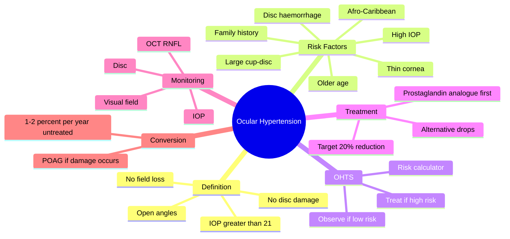

# Ocular Hypertension

Related: [[Primary Open-Angle Glaucoma (POAG)]], [[Primary Angle-Closure Glaucoma (PACG)]]

> [!tip] **FCPS/MRCP Priority: MEDIUM**
> IOP >21 with no damage. Risk of conversion to POAG ~1–2%/year. Treat if high risk; observe if low.

---

## Learning Objectives
- [ ] Define ocular hypertension (OHT) and differentiate from POAG
- [ ] List the risk factors for conversion to POAG
- [ ] Apply OHTS criteria to decide who to treat
- [ ] State the first-line pharmacological agent
- [ ] Describe appropriate monitoring (IOP, disc, OCT RNFL, VF)

---

## 1. Definition

- **Ocular hypertension (OHT):** IOP >21 mmHg in one or both eyes, with **normal optic discs and visual fields**
- Open angles (gonioscopy)
- No identifiable cause (primary)
- A **risk state**, not a disease

### Diagnostic Criteria
- IOP >21 mmHg (≥2 occasions)
- Normal optic disc appearance (no glaucomatous cupping, notching, haemorrhage)
- Normal visual field (no glaucomatous defect on perimetry)
- Open angles on gonioscopy
- No other ocular disease explaining raised IOP

---

## 2. Risk Factors for Conversion to POAG

The **Ocular Hypertension Treatment Study (OHTS)** identified the major risk factors:

- **Higher IOP** (strongest modifiable predictor)
- **Older age**
- **Thin central cornea** (underestimates true IOP with Goldmann)
- **Larger cup:disc ratio** (baseline)
- **Disc haemorrhage** (Drance)
- **Visual field patterns suggestive of early damage** (PSCC, nasal step)
- **Family history** of glaucoma
- **African / Afro-Caribbean descent**
- Diabetes (weaker association)

---

## 3. Management

### Risk Stratification (OHTS / European Glaucoma Society)
- **High risk:** Treat (one or more major risk factors present)
- **Low risk:** Observe with regular monitoring
- Use risk calculators (e.g., OHTS-EGPS calculator)

### Treatment (When Indicated)
- **Prostaglandin analogue** (latanoprost, bimatoprost, travoprost) — first-line
  - Once daily, good IOP reduction (25–30%)
- Alternatives: beta-blocker (timolol), alpha-agonist (brimonidine), CAIs (dorzolamide)

### Target IOP
- **≥20% reduction** from baseline
- Lower in higher-risk patients (e.g., 25–30%)

### Monitoring
- **IOP** (3–6 monthly initially, then 6–12 monthly)
- **Optic disc** clinical exam + photography
- **OCT RNFL** (annual)
- **Visual field** (annual, more frequently if borderline)
- **Gonioscopy** as needed

---

## 4. FCPS/MRCP High-Yield Summary

| Topic | Key Points |
|-------|------------|
| Definition | IOP >21, no damage |
| Conversion rate | 1–2%/year (untreated); ~0.5%/year (treated) |
| Treat if | High risk (OHTS criteria) |
| Drug | Prostaglandin analogue first-line |
| Target | ≥20% IOP reduction |
| Monitor | IOP, disc, OCT RNFL, visual field |
| Key risk | Thin cornea (Goldmann under-reads) |

---

## 5. Viva Questions

1. **Q:** What is ocular hypertension?
   **A:** IOP >21 mmHg in one or both eyes with normal optic discs, normal visual fields, and open angles. It is a risk state, not a disease.

2. **Q:** How do you decide whether to treat OHT?
   **A:** Apply OHTS risk stratification. Treat if high risk (older age, higher IOP, thin cornea, large cup:disc, disc haemorrhage, family history, Afro-Caribbean descent). Observe low-risk patients.

3. **Q:** Why does a thin central cornea matter?
   **A:** Goldmann applanation tonometry underestimates true IOP in thin corneas; a "normal" reading may mask significantly raised pressure. Risk factor for POAG development.

4. **Q:** What is the first-line drug and what reduction is targeted?
   **A:** Prostaglandin analogue (once daily) with target IOP reduction ≥20% from baseline.

---

## 6. Common Confusions / Exam Traps

| Confusion | Clarification |
|-----------|---------------|
| "OHT = glaucoma" | OHT is a risk state; POAG requires disc + VF damage |
| "All OHT needs treatment" | Only high-risk OHT — observe low-risk |
| "Thick cornea = higher risk" | Thick cornea *over-reads* IOP (false high) but is not a risk factor; thin cornea *under-reads* (true pressure higher) and IS a risk factor |
| "Prostaglandins cause miosis" | Prostaglandins increase uveoscleral outflow, may cause mild proptosis in long-term use, increased iris pigmentation, eyelash growth; do not affect pupil size |
| "Stop drops if IOP normal" | No — life-long treatment to maintain target |

---

## 7. Mnemonics

1. **"OHTS = OHT TreatS"** — OHTS study guides when to treat
2. **"THIN cornea = TRUE pressure is high"** — Thin underestimates; thick overestimates
3. **"PGA first"** — Prostaglandin Analogue is first-line for OHT/POAG

---

## 8. Mind Map

---

## 9. One-Page Revision Card

| **Topic** | **Ocular Hypertension** |
|-----------|--------------------------|
| **Definition** | IOP >21, no disc/field damage, open angles |
| **Conversion risk** | ~1–2%/year to POAG |
| **Treat if** | High risk (OHTS criteria) |
| **First-line drug** | Prostaglandin analogue |
| **Target IOP** | ≥20% reduction from baseline |
| **Monitor** | IOP, disc, OCT RNFL, VF |
| **Key risk factor** | Thin central cornea |
| **Viva Pearl** | "Thin cornea underestimates true IOP" |

---

## Spaced Repetition Trackers

### 24-Hour Recall Prompts
- [ ] Define OHT and the three diagnostic criteria
- [ ] List 5 OHTS risk factors for conversion
- [ ] State the first-line treatment and target IOP reduction
- [ ] Explain why thin cornea matters in OHT

### Revision Schedule
- [ ] **Day 1** completed (creation + 24h recall)
- [ ] **Day 3** revision completed
- [ ] **Day 7** revision completed
- [ ] **Day 15** revision completed
- [ ] **Day 30** revision completed
- [ ] **Day 90** revision completed

---

## Must Know / Should Know / Nice to Know

### Must Know (Core for passing)
- [x] Definition of OHT
- [x] First-line treatment (prostaglandin analogue)
- [x] Target IOP reduction (≥20%)
- [x] Why thin cornea matters

### Should Know (High probability)
- [x] OHTS risk factors
- [x] Monitoring schedule (IOP, disc, OCT, VF)
- [x] Conversion rate to POAG (~1–2%/year)

### Nice to Know (Differentiator)
- [ ] OHTS-EGPS risk calculator
- [ ] Mechanism of prostaglandin analogues (uveoscleral outflow)
- [ ] Comparison with normal-tension glaucoma

---

## My Weak Points
- [ ] Add personal weak areas here

---

## Self-Test Scorecard

| Section | Score /5 |
|---------|----------|
| Understanding: | /10 |
| Recall: | /10 |
| MCQ Performance: | /10 |
| SBA Performance: | /10 |
| Viva Confidence: | /10 |
| Total: | /50 |

> [!tip] **Interpretation:** <35 = weak topic, 35-44 = acceptable but insecure, 45+ = strong exam-ready topic.

---

## Exam Answer Modes

### Long Answer Skeleton
1. Definition (IOP >21, no disc/field damage, open angles)
2. OHTS risk factors (higher IOP, age, thin cornea, large C/D, disc haemorrhage, family history, ethnicity)
3. Risk stratification (treat high-risk, observe low-risk)
4. First-line treatment: prostaglandin analogue
5. Target IOP: ≥20% reduction
6. Monitoring: IOP, optic disc, OCT RNFL, visual field

### Short Note Skeleton
- Definition + 3 diagnostic criteria
- OHTS risk factors (top 3: high IOP, thin cornea, large cup:disc)
- First-line drug + target reduction

### Viva One-Liners
- **Q:** What is OHT? → **A:** IOP >21, normal disc, normal fields, open angles
- **Q:** Treat or observe? → **A:** Treat if high-risk (OHTS criteria); observe if low-risk
- **Q:** First-line drop? → **A:** Prostaglandin analogue (once daily)
- **Q:** Target IOP? → **A:** ≥20% reduction from baseline
- **Q:** Why thin cornea matters? → **A:** Underestimates true IOP — patient is at higher risk than measured

### Ward-Case Discussion Points
- Differentiate OHT from POAG (no damage vs damage)
- Apply OHTS criteria to risk-stratify
- Choose prostaglandin analogue first-line
- Set up monitoring schedule (IOP, disc, OCT, VF)
- Counsel patient on chronic, often lifelong treatment
- Counsel on adherence and side-effects of drops

### Last-Night-Before-Exam Sheet
- Top 3 facts: IOP >21 + no damage + treat if high risk
- 1 mnemonic: "PGA first, ≥20% down"
- Must-know risk factor: thin cornea

---

## Summary

OHT is raised IOP (>21 mmHg) with **no** optic disc or visual field damage and open angles. Conversion to POAG occurs at ~1–2%/year untreated. Treatment is guided by OHTS risk factors: treat high-risk patients with a prostaglandin analogue aiming for ≥20% IOP reduction; observe low-risk patients. Monitor with IOP, optic disc exam, OCT RNFL, and visual fields. Thin central cornea is a key risk factor because Goldmann tonometry under-reads true IOP.

## MCQs (10)

1. **Question:** Ocular hypertension is defined as:
   **Options:** A. IOP >21 with glaucomatous disc cupping B. IOP >21 with normal disc and visual field C. IOP >30 with normal disc D. Raised IOP from uveitis E. Any IOP >21
   **Answer:** B
   **Explanation:** OHT = IOP >21 with **normal** optic disc and **normal** visual field.

2. **Question:** First-line medical treatment for OHT is:
   **Options:** A. Timolol B. Pilocarpine C. Prostaglandin analogue D. Acetazolamide E. Brimonidine
   **Answer:** C
   **Explanation:** Prostaglandin analogues (latanoprost etc.) are first-line for OHT and POAG.

3. **Question:** The target IOP reduction when treating OHT is at least:
   **Options:** A. 5% B. 10% C. 20% D. 50% E. 100%
   **Answer:** C
   **Explanation:** ≥20% reduction from baseline is the standard target (more in higher-risk patients).

4. **Question:** The OHTS identified the following as a major risk factor for conversion to POAG:
   **Options:** A. Myopia B. Hyperopia C. Thin central cornea D. Cataract E. Astigmatism
   **Answer:** C
   **Explanation:** Thin central cornea is a major risk factor because it underestimates true IOP.

5. **Question:** What is the approximate annual conversion rate of untreated OHT to POAG?
   **Options:** A. 0.1% B. 1–2% C. 10% D. 25% E. 50%
   **Answer:** B
   **Explanation:** ~1–2% per year without treatment; reduced to ~0.5% with treatment.

6. **Question:** In OHT, gonioscopy is required to:
   **Options:** A. Measure IOP B. Confirm open angles C. Visualise the disc D. Test visual field E. Refract
   **Answer:** B
   **Explanation:** Gonioscopy confirms the angles are open (excludes PACG / secondary causes).

7. **Question:** A patient with OHT and high-risk OHTS features is started on latanoprost. What monitoring is most appropriate?
   **Options:** A. IOP only B. Visual field only C. IOP + disc + OCT RNFL + visual field D. MRI E. Blood tests
   **Answer:** C
   **Explanation:** Comprehensive monitoring: IOP, optic disc, OCT RNFL, and visual field.

8. **Question:** Which statement about OHT is TRUE?
   **Options:** A. All OHT patients are treated B. OHT always progresses to POAG C. OHT is a risk state, not a disease D. OHT is treated with surgery first E. None
   **Answer:** C
   **Explanation:** OHT is a risk state for POAG; not all patients are treated and not all convert.

9. **Question:** In OHT, what effect does a thin central cornea have on Goldmann tonometry?
   **Options:** A. Overestimates true IOP B. Underestimates true IOP C. No effect D. Doubles IOP reading E. None
   **Answer:** B
   **Explanation:** Thin cornea → applanation requires less force → true IOP is underestimated.

10. **Question:** A 55-year-old with IOP 24 mmHg, normal disc, normal visual field, open angles. Most appropriate management?
    **Options:** A. Immediate surgery B. Risk-stratify with OHTS criteria and treat if high risk C. Observation only D. Laser trabeculoplasty E. Steroid drops
    **Answer:** B
    **Explanation:** Apply OHTS criteria — treat only if high risk; otherwise observe.

## SBA Questions (10)

1. **Scenario:** A 50-year-old asymptomatic woman is found to have IOP 26 mmHg in both eyes. Optic discs are normal, visual fields are full, gonioscopy shows open angles.
   **Question:** Most appropriate next step?
   **Options:** A. Trabeculectomy B. Apply OHTS risk stratification to decide on treatment C. Laser iridotomy D. Steroid drops E. Observation only, no further workup
   **Answer:** B
   **Explanation:** OHT — apply OHTS criteria; treat only if high risk.

2. **Scenario:** A 60-year-old with OHT has IOP 28 mmHg, central corneal thickness 480 µm, large cup:disc (0.6), and a family history of glaucoma.
   **Question:** What is the most appropriate management?
   **Options:** A. Observe; no treatment B. Start a prostaglandin analogue C. Pilocarpine D. Surgery E. Stop all meds
   **Answer:** B
   **Explanation:** Multiple OHTS high-risk features → start a prostaglandin analogue.

3. **Scenario:** A patient with OHT is started on latanoprost. What is the target IOP reduction?
   **Options:** A. 5% B. 10% C. ≥20% D. 50% E. 100%
   **Answer:** C
   **Explanation:** ≥20% reduction is the standard target.

4. **Scenario:** A 45-year-old with OHT is reviewed. His cornea is noted to be very thin (CCT 470 µm). His measured IOP is 22 mmHg.
   **Question:** What is the most likely concern?
   **Options:** A. Thin cornea overestimates IOP B. Thin cornea underestimates IOP, true IOP may be higher C. No concern D. Need cataract surgery E. Need laser
   **Answer:** B
   **Explanation:** Thin cornea under-reads with Goldmann; true IOP is higher than measured.

5. **Scenario:** A patient with OHT on latanoprost has IOP reduced from 26 to 19 mmHg after 3 months. Disc and visual field remain normal.
   **Question:** What is the next step?
   **Options:** A. Stop treatment B. Continue with monitoring (IOP, disc, OCT, VF) C. Add more drops D. Surgery E. Laser
   **Answer:** B
   **Explanation:** Good response — continue treatment with structured monitoring.

6. **Scenario:** An OHT patient has IOP 24 mmHg, CCT 580 µm (thick), small cup:disc, no family history.
   **Options:** A. Start a prostaglandin analogue B. Treat with laser C. Observe — low risk on OHTS criteria D. Steroid E. Surgery
   **Question:** Most appropriate management?
   **Answer:** C
   **Explanation:** Thick cornea over-reads IOP, small C/D, no family history → low risk → observe.

7. **Scenario:** A patient with OHT on prostaglandin analogue now has disc haemorrhage and early visual field defect.
   **Question:** What is the most likely diagnosis?
   **Options:** A. OHT stable B. Conversion to POAG C. Cataract D. Optic neuritis E. None
   **Answer:** B
   **Explanation:** Disc + field damage = conversion to POAG; intensify treatment.

8. **Scenario:** A 65-year-old with OHT is being considered for treatment. Which is the most important baseline test?
   **Options:** A. Visual acuity B. Visual field and OCT RNFL C. Blood sugar D. ECG E. Chest X-ray
   **Answer:** B
   **Explanation:** Baseline VF and OCT RNFL are essential to detect future glaucomatous change.

9. **Scenario:** A patient with OHT and CCT 510 µm has IOP 30 mmHg, large cup:disc 0.7, disc haemorrhage, and family history of glaucoma.
   **Question:** Most appropriate management?
   **Options:** A. Observation B. Reassure C. Start treatment (prostaglandin analogue) D. Dilate pupils E. Cataract surgery
   **Answer:** C
   **Explanation:** Very high risk — multiple OHTS risk factors — start treatment.

10. **Scenario:** A patient with OHT is started on latanoprost but IOP only drops from 26 to 24 mmHg (8% reduction).
    **Question:** What is the next step?
    **Options:** A. Stop all treatment B. Add or switch to a second agent (e.g., beta-blocker) C. Vitrectomy D. Scleral buckle E. Observe only
    **Answer:** B
    **Explanation:** Target not met (need ≥20%) — add or switch drops.

## Flashcards

- **Q:** What is ocular hypertension?
  **A:** IOP >21 mmHg in one or both eyes, with normal optic discs, normal visual fields, and open angles.
- **Q:** First-line treatment for OHT requiring treatment?
  **A:** Prostaglandin analogue (latanoprost, bimatoprost, travoprost) — once daily.
- **Q:** Target IOP reduction in OHT?
  **A:** ≥20% reduction from baseline.
- **Q:** What is the conversion rate to POAG in untreated OHT?
  **A:** ~1–2% per year (reduced to ~0.5% with treatment).
- **Q:** Why is a thin central cornea a risk factor?
  **A:** Goldmann tonometry underestimates true IOP in thin corneas — true pressure is higher than measured.

## Answer Key with Explanations

### MCQs
1. B — OHT requires raised IOP with **no** damage
2. C — Prostaglandin analogue is first-line
3. C — ≥20% target reduction
4. C — Thin cornea is a major OHTS risk factor
5. B — ~1–2% per year
6. B — Gonioscopy confirms open angles
7. C — Comprehensive monitoring is required
8. C — OHT is a risk state, not a disease
9. B — Thin cornea underestimates true IOP
10. B — Risk-stratify with OHTS criteria

### SBAs
1. B — Apply OHTS criteria before treating
2. B — Multiple high-risk features → treat
3. C — Target ≥20% reduction
4. B — Thin cornea under-reads
5. B — Continue treatment with monitoring
6. C — Low risk → observe
7. B — Damage = conversion to POAG
8. B — Baseline VF and OCT RNFL essential
9. C — High-risk OHT — start treatment
10. B — Target not met — add or switch agent

## Tags
#medicine #davidson #ophthalmology #OHT #glaucoma #fcps #mrcp

## PasTest Scenario SBAs (Clinical Vignettes)

> **Auto-generated PasTest/Mediscope-style scenario SBAs** grounded in the authored source. Each scenario tests a real clinical fact (triad, specific sign, contraindication, trial, first-line Rx) extracted from the topic. *Source: Ch 28: Medical Ophthalmology — Ocular Hypertension*

**Q1.** What is the most appropriate first-line therapy for Ocular Hypertension?

  - **A.** High risk:
  - **B.** An advanced/surgical therapy reserved for refractory disease
  - **C.** Symptomatic treatment only, no disease-modifying therapy
  - **D.** Empiric broad-spectrum therapy without specific indication

  > **Answer: A** — High risk:
  >
  > *Source:* **High risk:** Treat (one or more major risk factors present)

