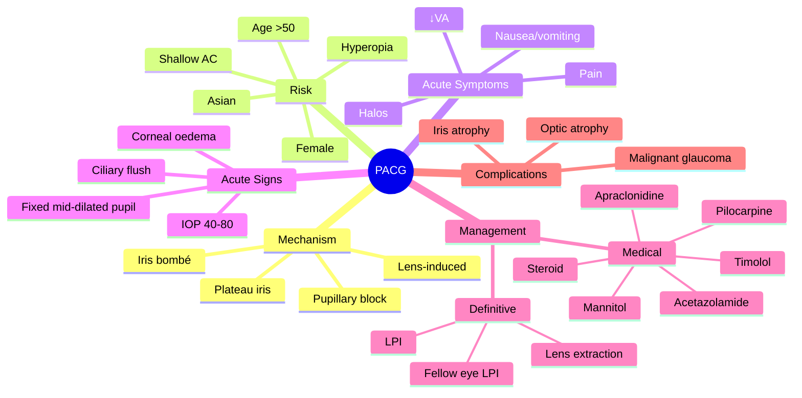

# Primary Angle-Closure Glaucoma (PACG)

Related: [[Primary Open-Angle Glaucoma (POAG)]], [[Laser Peripheral Iridotomy]]

> [!tip] **FCPS/MRCP Priority: CRITICAL**
> Acute painful red eye + ↓VA + halos + fixed mid-dilated pupil + IOP >40 mmHg = EMERGENCY. Treat with topical/systemic IOP-lowering, then laser peripheral iridotomy (LPI).

---

## Learning Objectives
- [ ] Define PACG and describe pupillary block mechanism
- [ ] List risk factors (female, Asian, hyperope, shallow AC)
- [ ] Recognise the clinical features of acute angle closure
- [ ] Perform Van Herick assessment for angle depth
- [ ] Initiate emergency medical management of acute attack
- [ ] Describe definitive treatment (LPI, lens extraction)
- [ ] Counsel on fellow-eye prophylaxis

---

## 1. Definition / Epidemiology / Classification

### Definition
- **PACG:** Glaucoma with closed or occludable angle on gonioscopy, leading to impaired aqueous outflow and raised IOP
- May be acute (sudden, painful) or chronic (intermittent, subacute)

### Epidemiology
- 50% of glaucoma worldwide (more common in East Asia)
- Female > Male (2–3×)
- Age >50 y typical

### Classification
- **Primary angle-closure suspect (PACS):** Occludable angle, no PAS, no IOP rise
- **Primary angle closure (PAC):** Occludable angle + PAS/IOP rise; no disc damage
- **Primary angle-closure glaucoma (PACG):** PAC + glaucomatous optic neuropathy

---

## 2. Aetiology / Pathophysiology

### Mechanism
- **Pupillary block (most common):** Iris apposition to lens at pupil → aqueous trapped behind iris → peripheral iris bows forward (iris bombé) → occludes trabecular meshwork
- **Plateau iris:** Anteriorly positioned ciliary body pushes iris forward; patent iridotomy
- **Lens-induced:** Large/lens pushes iris forward
- **Malignant (post-op):** Aqueous misdirection into vitreous

### Pathophysiology
- Shallow anterior chamber (axial hyperopia, large lens)
- Iridotrabecular contact → trabecular meshwork dysfunction → ↑ IOP → optic nerve damage

---

## 3. Risk Factors

| Demographic | Anatomical | Triggers |
|-------------|-----------|----------|
| Age >50 y | Shallow AC (Van Herick ≤ 1/4) | Mydriatic drugs (anticholinergics, sympathomimetics) |
| Female (2–3×) | Short axial length | Dim light / darkness |
| East Asian / Inuit | Hyperopia | Emotional upset, stress |
| Family history | Small cornea | Prolonged near work (mild pupillary dilation) |
| | Thick lens | General anaesthesia (anticholinergics) |

---

## 4. Clinical Features

### Acute Angle Closure — Ophthalmic Emergency

**Symptoms:**
- **Severe ocular pain** (deep, boring)
- **Blurred vision / ↓VA**
- **Halos around lights** (corneal oedema)
- **Nausea, vomiting, headache** (mimics acute abdomen / migraine!)
- Red eye, photophobia, lacrimation

**Signs:**
- **Ciliary flush** (limbal injection)
- **Corneal oedema** (hazy, "steamy" cornea)
- **Shallow anterior chamber** (Van Herick < 1/4)
- **Fixed, mid-dilated pupil** (vertically oval, often) — due to ischaemic iris sphincter
- **Iris bombé** (peripheral iris bowing forward)
- **IOP very high (40–80 mmHg)**
- Closed angle on gonioscopy
- Disc may be normal or swollen
- Conjunctival injection, lid oedema

### Chronic / Subacute PACG
- Intermittent episodes of pain, halos, mild ↓VA that resolve
- Progressive angle closure, peripheral anterior synechiae (PAS)
- May mimic POAG-like chronic course

---

## 5. Investigations

- **Tonometry** — IOP markedly elevated (40–80 mmHg)
- **Slit-lamp** — corneal oedema, shallow AC, fixed mid-dilated pupil, iris bombé
- **Van Herick test** — slit-beam assessment of peripheral AC depth (≤ 1/4 = shallow)
- **Gonioscopy** (definitive) — closed / occludable angle
- **Dilated fundus exam** (after IOP controlled) — disc, nerve fibre layer
- **OCT optic nerve** — RNFL assessment
- **Visual fields** — once stable, similar to POAG defects

---

## 6. Differential Diagnosis

| Condition | Distinguishing feature |
|-----------|------------------------|
| **Acute anterior uveitis** | Small irregular pupil, KP, low/normal IOP, photophobia |
| **Acute conjunctivitis** | Discharge, no pain in eye, normal pupil, normal VA |
| **Endophthalmitis** | Recent surgery/injection, hypopyon, vitritis |
| **Carotid-cavernous fistula** | Pulsatile proptosis, chemosis, bruit |
| **Migraine / abdominal emergency** | Can be confused due to nausea/vomiting — always check the eye |
| **POAG** | Painless, open angle |

---

## 7. Management

### Acute Attack — EMERGENCY (Goal: lower IOP, then definitive)

**Stepwise:**
1. **Topical β-blocker** (timolol 0.5%) — ↓ aqueous production; avoid in asthma/heart block
2. **Topical α-agonist** (apraclonidine 1% or brimonidine 0.2%)
3. **Topical pilocarpine 1–2%** — constrict pupil, opens angle (only after IOP starts to fall — ischaemic sphincter won't respond at very high IOP)
4. **Topical steroid** (prednisolone 1%) — reduce inflammation
5. **Systemic acetazolamide 500 mg IV or PO** — ↓ aqueous production
6. **Hyperosmotic agents:** Mannitol 20% (1 g/kg IV) or glycerol (oral) — if IOP uncontrolled
7. **Pain control, antiemetic** (avoid metoclopramide in parkinsonism; use ondansetron)
8. **Definitive: Laser peripheral iridotomy (LPI)** — both eyes (fellow eye at high risk)
9. ± **Anterior chamber paracentesis** (emergent decompression)
10. **Lens extraction** (definitive, esp. with significant cataract)

### Chronic PACG
- **LPI** (may be too late if PAS extensive)
- **Medical therapy** (similar to POAG)
- **Lens extraction** (definitive, especially with cataract)
- **Trabeculectomy** (if LPI fails)

### Fellow Eye
- **Prophylactic LPI** — 40–80% risk of acute attack within 5–10 y if untreated

---

## 8. Complications

- **Optic atrophy** (if prolonged attack)
- **Persistent corneal oedema** (endothelial decompensation → bullous keratopathy)
- **Iris atrophy** (ischaemic sectoral)
- **Cataract** (subcapsular)
- **Malignant glaucoma** (post-op aqueous misdirection) — flat AC post-op
- **Permanent visual loss**

---

## 9. Red Flags / Emergencies

- Acute painful red eye with halos + fixed mid-dilated pupil + IOP >40 = **angle closure attack**
- Post-operative flat AC + ↑ IOP = **malignant glaucoma**
- Persistent corneal oedema + IOP uncontrolled = **endothelial decompensation**

---

## 10. FCPS/MRCP High-Yield Summary

| Topic | Key Points |
|-------|------------|
| **Risk** | Female, Asian, hyperope, shallow AC, age >50 |
| **Mechanism** | Pupillary block (most common) |
| **Acute triad** | Pain, halos, ↓VA + fixed mid-dilated pupil |
| **IOP** | 40–80 mmHg |
| **Emergency** | Yes |
| **Treatment** | Topical + systemic IOP-lowering + LPI (definitive) |
| **Fellow eye** | Prophylactic LPI (50% risk) |
| **Definitive** | LPI ± lens extraction |
| **Mnemonic** | "PACG = PUPil Closed, Gonio-blocked" |

---

## 11. Viva Questions

1. **Q:** What is the first-line drug therapy for acute angle closure?
   **A:** Topical β-blocker (timolol), topical α-agonist, topical pilocarpine (after IOP falls), IV acetazolamide, topical steroid. Definitive: LPI.

2. **Q:** Why is the pupil mid-dilated in acute angle closure?
   **A:** Ischaemia of the iris sphincter from very high IOP → mid-dilated, fixed, often vertically oval.

3. **Q:** What is the definitive treatment of PACG?
   **A:** Laser peripheral iridotomy (LPI) — usually both eyes; then medical/surgical if needed. Lens extraction is increasingly definitive.

4. **Q:** Why avoid pilocarpine at very high IOP?
   **A:** Iris sphincter is ischaemic and unresponsive at high IOP; pilocarpine only works once IOP has started to fall.

5. **Q:** Why is the fellow eye treated?
   **A:** 40–80% risk of acute attack in the other eye within 5–10 years → prophylactic LPI.

---

## 12. Common Confusions / Exam Traps

| Confusion | Clarification |
|-----------|---------------|
| "Pilocarpine is first-line" | No — only after IOP starts to fall (sphincter ischaemia) |
| "PACG is painless" | Acute PACG is severely painful; chronic can be painless |
| "LPI cures PACG" | LPI relieves pupillary block; PAS-related damage may persist |
| "Bilateral LPI optional" | Fellow eye MUST have prophylactic LPI |
| "Acute angle closure has small pupil" | No — fixed mid-dilated, vertically oval |
| "POAG and PACG present the same" | POAG = painless, open angle; PACG = painful acute, closed angle |
| "Acetazolamide is curative" | No — medical bridge to LPI |
| "Mannitol for everyone" | Use only if IOP uncontrolled; CI in renal failure, CCF |
| "Angle closure is a diagnosis" | It's a mechanism; PACG = glaucomatous damage + angle closure |
| "Pupillary block is the only mechanism" | No — plateau iris, lens-induced, malignant are others |

---

## 13. Mnemonics

1. **"Pain-Halos-Fixed pupil = PHF"** — Acute PACG triad
2. **"Asian Female Forty + Hyperopia"** — A,F,F,H = PACG risk factors
3. **"LPI in Both"** — Both eyes need LPI (or just the angle? "LPI for BOTH")

---

## 14. Mind Map

---

## 15. One-Page Revision Card

| **Topic** | **PACG** |
|-----------|---------|
| **Definition** | Glaucoma from closed/occludable angle |
| **Mechanism** | Pupillary block (most common) |
| **Risk** | Female, Asian, hyperope, shallow AC, age >50 |
| **Acute triad** | Pain, halos, ↓VA |
| **Pupil** | Fixed, mid-dilated, vertically oval |
| **IOP** | 40–80 mmHg |
| **Treatment** | Medical (timolol, pilocarpine, acetazolamide, mannitol) → LPI |
| **Definitive** | LPI (both eyes) ± lens extraction |
| **Complication** | Malignant glaucoma (post-op) |
| **Viva Pearl** | Fellow eye always gets prophylactic LPI |

---

## 16. Spaced Repetition Trackers

### 24-Hour Recall Prompts
- [ ] List 4 risk factors for PACG
- [ ] Describe the classic signs of acute angle closure
- [ ] Outline the medical management of acute attack
- [ ] State why the fellow eye needs LPI

### Revision Schedule
- [ ] **Day 1** completed (creation + 24h recall)
- [ ] **Day 3** revision completed
- [ ] **Day 7** revision completed
- [ ] **Day 15** revision completed
- [ ] **Day 30** revision completed
- [ ] **Day 90** revision completed

---

## 17. Must Know / Should Know / Nice to Know

### Must Know (Core for passing)
- [x] Risk factors (F, Asian, hyperope, shallow AC)
- [x] Acute presentation (pain, halos, ↓VA, fixed pupil, IOP 40–80)
- [x] Emergency management (medical IOP lowering → LPI)
- [x] Pupillary block mechanism
- [x] Prophylactic LPI for fellow eye

### Should Know (High probability)
- [x] Plateau iris configuration
- [x] Malignant glaucoma (post-op flat AC)
- [x] Lens extraction as definitive treatment
- [x] Why pilocarpine is delayed
- [x] Van Herick grading

### Nice to Know (Differentiator)
- [ ] ICare/IOP dynamics during attack
- [ ] Nd:YAG vs argon LPI
- [ ] Anterior segment OCT for angle assessment
- [ ] Lens position/intumescent cataract mechanism

---

## 18. My Weak Points
- [ ] Add personal weak areas here

---

## 19. Self-Test Scorecard

| Section | Score /5 |
|---------|----------|
| Understanding: | /10 |
| Recall: | /10 |
| MCQ Performance: | /10 |
| SBA Performance: | /10 |
| Viva Confidence: | /10 |
| Total: | /50 |

> [!tip] **Interpretation:** <35 = weak topic, 35-44 = acceptable but insecure, 45+ = strong exam-ready topic.

---

## 20. Exam Answer Modes

### Long Answer Skeleton
1. Definition (glaucoma with closed/occludable angle)
2. Risk factors (F, Asian, hyperopia, shallow AC, age)
3. Mechanism (pupillary block — iris bombé)
4. Acute clinical features (pain, halos, ↓VA, fixed mid-dilated pupil, IOP 40–80, corneal oedema)
5. Investigations (tonometry, gonioscopy, Van Herick, OCT)
6. Differential (uveitis, conjunctivitis, endophthalmitis)
7. Management
   - Medical: timolol, apraclonidine, pilocarpine (after IOP falls), acetazolamide, mannitol, steroid
   - Definitive: LPI both eyes; lens extraction
8. Complications (optic atrophy, iris atrophy, malignant glaucoma)

### Short Note Skeleton
- Risk factors
- Mechanism (pupillary block)
- Acute features
- Medical + LPI

### Viva One-Liners
- **Q:** Acute PACG triad? → **A:** Pain, halos, ↓VA + fixed mid-dilated pupil
- **Q:** Most common mechanism? → **A:** Pupillary block
- **Q:** Treatment of acute attack? → **A:** Medical IOP lowering → LPI both eyes
- **Q:** Why treat the fellow eye? → **A:** 40–80% risk of acute attack

### Ward-Case Discussion Points
- Identify Van Herick ≤1/4 in at-risk patients
- Avoid mydriatics in shallow AC
- Recognise mimics (migraine, abdominal emergency)
- Counsel on bilateral LPI
- Recognise malignant glaucoma post-op

### Last-Night-Before-Exam Sheet
- **Top 3 facts:** Pupillary block → iris bombé; fixed mid-dilated pupil + IOP 40–80; LPI both eyes
- **1 mnemonic:** "Asian Female Forty Hyperopia = A,F,F,H"
- **Must-know differential:** Acute uveitis (small pupil, KP, low IOP)

---

## Summary
PACG is an ophthalmic emergency presenting with severe pain, halos, ↓VA, fixed mid-dilated pupil, and IOP 40–80 mmHg. Risk factors: female, East Asian, hyperopia, shallow AC, age >50. Mechanism: pupillary block → iris bombé → trabecular occlusion. Management: emergency medical IOP lowering (timolol, apraclonidine, pilocarpine after IOP falls, IV acetazolamide, mannitol, topical steroid) followed by definitive LPI bilaterally. Fellow eye requires prophylactic LPI. Lens extraction is increasingly definitive. Complications: optic atrophy, iris atrophy, malignant glaucoma.

---

## MCQs (10)

1. **Question:** Acute angle-closure glaucoma typically presents with:
   **Options:** A. Painless visual loss B. Painful red eye, halos, fixed mid-dilated pupil C. Painless scotoma D. Gradual central scotoma E. Sectoral disc pallor
   **Answer:** B
   **Explanation:** Classic acute PACG = painful red eye, halos, ↓VA, fixed mid-dilated pupil.

2. **Question:** The most important modifiable treatment in acute PACG is:
   **Options:** A. Observation B. Laser peripheral iridotomy (LPI) C. Topical steroid only D. Vitrectomy E. Enucleation
   **Answer:** B
   **Explanation:** LPI cures pupillary block — definitive treatment.

3. **Question:** A 60-year-old hyperopic woman with sudden painful red eye, halos, IOP 60 mmHg, fixed pupil — most likely diagnosis:
   **Options:** A. POAG B. Acute PACG C. Uveitis D. Endophthalmitis E. Keratitis
   **Answer:** B
   **Explanation:** Hyperopic, female, age 60, painful red eye, halos, high IOP, fixed pupil = acute PACG.

4. **Question:** Fellow eye in acute PACG should be:
   **Options:** A. Observed B. Treated prophylactically with LPI C. Enucleated D. Treated with drops only E. Left alone
   **Answer:** B
   **Explanation:** 40–80% risk of acute attack in fellow eye within 5–10 y — prophylactic LPI.

5. **Question:** In acute angle closure, pilocarpine is most effective when:
   **Options:** A. Given at presentation only B. After IOP has started to fall C. After LPI D. Never E. Only in children
   **Answer:** B
   **Explanation:** Ischaemic sphincter at high IOP doesn't respond to pilocarpine; effective only after IOP starts to fall.

6. **Question:** Which of the following is NOT a risk factor for PACG?
   **Options:** A. Hyperopia B. Female sex C. East Asian ethnicity D. Shallow anterior chamber E. High axial length (myopia)
   **Answer:** E
   **Explanation:** PACG is associated with hyperopia (short axial length), shallow AC — NOT myopia/long axial length.

7. **Question:** Malignant glaucoma is best described as:
   **Options:** A. Acute IOP rise with red eye B. Post-operative flat anterior chamber with raised IOP C. Pupillary block in plateau iris D. Painless chronic IOP rise E. None
   **Answer:** B
   **Explanation:** Malignant glaucoma = aqueous misdirection → flat AC + ↑ IOP after ocular surgery; treated with cycloplegics, vitrectomy.

8. **Question:** Van Herick grade 1 corresponds to:
   **Options:** A. AC > 1/2 corneal thickness B. AC = 1/4 corneal thickness C. AC < 1/4 corneal thickness (occludable angle) D. Closed angle E. Not related to angle
   **Answer:** C
   **Explanation:** Van Herick ≤ 1/4 indicates a shallow AC and an occludable angle.

9. **Question:** Iris bombé refers to:
   **Options:** A. Flat iris B. Bowing of peripheral iris forward due to pupillary block C. Posterior synechiae D. Iris atrophy E. Iris melanoma
   **Answer:** B
   **Explanation:** Iris bombé = peripheral iris bows forward, occluding trabecular meshwork.

10. **Question:** Which is the most common mechanism of PACG?
    **Options:** A. Plateau iris B. Lens-induced C. Pupillary block D. Malignant E. ICE syndrome
    **Answer:** C
    **Explanation:** Pupillary block is the most common mechanism of primary angle closure.

---

## SBA Questions (10)

1. **Scenario:** A 60-year-old Asian hyperopic woman has sudden painful red eye, ↓VA, halos, IOP 60 mmHg, mid-dilated fixed pupil, hazy cornea.
   **Question:** Most appropriate immediate treatment?
   **Options:** A. Topical antibiotic B. Topical + systemic IOP-lowering + LPI C. Topical steroid only D. Vitrectomy E. Cataract surgery
   **Answer:** B
   **Explanation:** Acute angle closure emergency — lower IOP medically then LPI.

2. **Scenario:** A patient with acute angle closure has IOP 60 mmHg. Topical timolol, apraclonidine, IV acetazolamide given. IOP drops to 25 mmHg. When should pilocarpine be given?
   **Options:** A. At presentation only B. After IOP has fallen to allow sphincter to respond C. Only after LPI D. Never E. Once daily for a week
   **Answer:** B
   **Explanation:** Pilocarpine works once IOP has dropped and sphincter perfusion restored.

3. **Scenario:** A 65-year-old is brought in 24 hours after onset of acute angle closure. The cornea is oedematous, IOP 65, pupil fixed mid-dilated. There is no view of the disc.
   **Question:** Most appropriate next step?
   **Options:** A. Outpatient LPI in 1 week B. Emergency medical IOP lowering, then LPI once cornea clears C. Vitrectomy D. Enucleation E. Topical lubricant
   **Answer:** B
   **Explanation:** Medical IOP lowering first; LPI may be performed once cornea clears or AC reformed.

4. **Scenario:** A patient with acute PACG has had successful LPI in both eyes. IOP is 18 mmHg. Disc shows early glaucomatous cupping.
   **Question:** Long-term management?
   **Options:** A. Discharge B. Continue monitoring — disc fields, IOP, angle C. Topical steroids lifelong D. Enucleation E. Repeat LPI
   **Answer:** B
   **Explanation:** Once iridotomy patent, monitor for further damage, IOP control, visual field.

5. **Scenario:** A patient with acute PACG has IOP 50 mmHg despite medical therapy. Pupil is fixed mid-dilated.
   **Question:** Next step?
   **Options:** A. Discharge B. Hyperosmotic agent (mannitol IV) ± AC paracentesis, then LPI C. Observation D. Topical lubricants E. Cycloplegic
   **Answer:** B
   **Explanation:** Mannitol/glycerol + AC paracentesis to break attack; then LPI.

6. **Scenario:** A 70-year-old had LPI for angle closure 5 years ago. Now IOP is 26 mmHg with progressive cupping despite LPI patent. Van Herick is 1/2.
   **Options:** A. LPI does not work B. Start IOP-lowering drops (similar to POAG) and consider lens extraction C. Stop treatment D. Topical antibiotic E. Cyclodestruction
   **Answer:** B
   **Explanation:** PAS-induced chronic IOP rise despite patent LPI → medical therapy + lens extraction.

7. **Scenario:** An elderly patient on pilocarpine for PACG develops blurred vision, brow ache, and myopia.
   **Options:** A. Pilocarpine allergy B. Pilocarpine side effects — ciliary spasm (brow ache, myopia) C. Need more drops D. Cataract E. Acute attack
   **Answer:** B
   **Explanation:** Pilocarpine causes ciliary spasm → myopia, brow ache, miosis, dim vision.

8. **Scenario:** A 60-year-old woman with shallow AC is to receive systemic anticholinergics for GI surgery.
   **Options:** A. No concern B. Risk of angle closure — avoid in shallow AC / give pilocarpine pre-op C. Give atropine D. Discontinue all meds E. None
   **Answer:** B
   **Explanation:** Anticholinergics cause mydriasis → angle closure in shallow AC — caution.

9. **Scenario:** A patient presents with vomiting, severe headache, and unilateral eye pain. The eye is red, pupil mid-dilated, IOP 60 mmHg.
   **Options:** A. Migraine — refer neurology B. Acute PACG — emergency IOP lowering and LPI C. Acute abdomen — admit under surgery D. Food poisoning E. Glaucoma is incidental
   **Answer:** B
   **Explanation:** The eye findings (red, mid-dilated pupil, ↑IOP) point to acute PACG — treat urgently.

10. **Scenario:** A patient with chronic PACG and patent LPI is on maximum medical therapy with IOP 32 mmHg and progressive field loss.
    **Options:** A. Add more drops and observe B. Trabeculectomy ± antimetabolite C. Stop treatment D. Repeat LPI E. Cycloplegic only
    **Answer:** B
    **Explanation:** Surgical trabeculectomy with antimetabolite (MMC/5-FU) is indicated for uncontrolled IOP and progression.

---

## Flashcards

- **Q:** What is PACG?
  **A:** Glaucoma with closed/occludable angle on gonioscopy — most common mechanism is pupillary block.
- **Q:** Risk factors for PACG?
  **A:** Female, East Asian, hyperopia, shallow AC, age >50.
- **Q:** Classic acute PACG presentation?
  **A:** Pain, halos, ↓VA, fixed mid-dilated pupil, IOP 40–80 mmHg.
- **Q:** Why is the pupil mid-dilated in acute PACG?
  **A:** Ischaemic iris sphincter at very high IOP.
- **Q:** Definitive treatment of PACG?
  **A:** Laser peripheral iridotomy (LPI) — both eyes, plus medical therapy.

---

## Answer Key with Explanations

### MCQs
1. B — Painful, halos, fixed mid-dilated pupil = acute PACG
2. B — LPI cures pupillary block
3. B — Classic acute PACG
4. B — Fellow eye needs prophylactic LPI
5. B — Pilocarpine effective only after IOP falls
6. E — High axial length (myopia) is NOT a risk factor
7. B — Malignant glaucoma = post-op flat AC + ↑IOP
8. C — Van Herick ≤ 1/4 = occludable
9. B — Iris bombé = peripheral iris bowing forward
10. C — Pupillary block is most common

### SBAs
1. B — Emergency medical IOP lowering → LPI
2. B — Pilocarpine after IOP falls (sphincter perfusion)
3. B — Medical IOP lowering; LPI when cornea clears
4. B — Monitor long-term — disc, fields, IOP
5. B — Mannitol ± AC paracentesis, then LPI
6. B — Patent LPI + chronic IOP rise = medical + lens extraction
7. B — Pilocarpine causes ciliary spasm (myopia, brow ache)
8. B — Anticholinergics precipitate angle closure in shallow AC
9. B — Eye findings (red, mid-dilated pupil, ↑IOP) = acute PACG
10. B — Trabeculectomy with MMC for uncontrolled IOP

## Tags
#medicine #davidson #ophthalmology #glaucoma #PACG #fcps #mrcp

## PasTest Scenario SBAs (Clinical Vignettes)

> **Auto-generated PasTest/Mediscope-style scenario SBAs** grounded in the authored source content. Each scenario is a clinical vignette with 4 options. **Source: Ch 28: Medical Ophthalmology / PACG**

**Q1.** A patient is being evaluated for PACG. Based on standard diagnostic approach, what is the most appropriate first-line investigation?

  - **A.** Approach described in standard diagnostic workup
  - **B.** An advanced/invasive test as first-line
  - **C.** Empirical treatment without investigation
  - **D.** Watchful waiting without further testing

  > **Answer: A** — Approach described in standard diagnostic workup

**Q2.** A patient is diagnosed with PACG. What is the most appropriate first-line management approach?

  - **A.** Standard guideline-directed first-line therapy
  - **B.** Most aggressive advanced therapy as first-line
  - **C.** No treatment needed in most cases
  - **D.** Investigational/compassionate-use therapy only

  > **Answer: A** — Standard guideline-directed first-line therapy

**Q3.** Which of the following best describes the underlying pathophysiology / definition of PACG?

  - **A.** **PACG:** Glaucoma with closed or occludable angle on gonioscopy, leading to impaired aqueous outflow and raised IOP
  - **B.** A common misattribution to a similar but distinct condition
  - **C.** An outdated or disproven mechanism
  - **D.** A complication rather than the underlying disease process

  > **Answer: A** — **PACG:** Glaucoma with closed or occludable angle on gonioscopy, leading to impaired aqueous outflow and raised IOP

