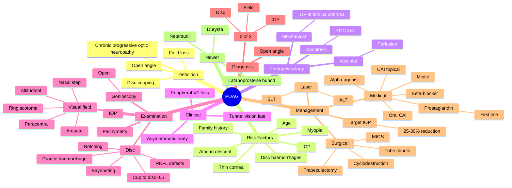

# Primary Open-Angle Glaucoma (POAG)

Related: [[Primary Angle-Closure Glaucoma (PACG)]], [[Optic Nerve Atrophy]], [[Visual Field Testing]]

> [!tip] **FCPS/MRCP Priority: CRITICAL**
> Most common glaucoma. Insidious painless peripheral VF loss. IOP, cupping, field defects. Treat stepwise: drops → laser → surgery. Target IOP reduction 25–30%.

---

## Learning Objectives
- [ ] Define POAG and its diagnostic criteria
- [ ] Identify risk factors (IOP, age, family history, race, myopia)
- [ ] Describe the pathophysiology (mechanical and vascular theories)
- [ ] Recognise clinical features and examination findings (cup:disc, RNFL, VF)
- [ ] Interpret visual field defects (nasal step, paracentral, arcuate, ring)
- [ ] Apply the stepwise management (drops → laser → surgery)
- [ ] Define target IOP and monitoring strategy
- [ ] Differentiate POAG from PACG, NTG, and secondary glaucomas

---

## 1. Definition

- **POAG:** Chronic, progressive optic neuropathy with characteristic optic disc cupping and visual field loss
- Open angle on gonioscopy
- IOP often (not always) elevated
- Bilateral, often asymmetric

---

## 2. Epidemiology

- **Most common** type of glaucoma
- Affects 2–3% of population >40 y
- Leading cause of irreversible blindness worldwide
- ↑ Incidence with age, African descent, family history

---

## 3. Risk Factors

- Age (>40)
- Family history (1st degree)
- African / Afro-Caribbean descent
- **IOP** (only modifiable risk factor proven)
- Myopia
- Central corneal thickness (thin = risk)
- Disc haemorrhages
- Steroid use
- Hypertension, DM
- Vasospasm (migraine, Raynaud's)

---

## 4. Pathophysiology

- **Mechanical theory:** IOP → mechanical damage to optic nerve fibres at lamina cribrosa
- **Vascular theory:** Reduced perfusion → ischaemia
- Apoptosis of retinal ganglion cells
- Loss of axons → optic disc cupping → VF loss

---

## 5. Clinical Features

- **Insidious, painless, progressive**
- Often asymptomatic until late
- Peripheral field loss first (preserved central until advanced)
- "Tunnel vision" (end stage)
- "Cataract-like" symptoms (driving, reading)
- Lost glasses (not really)

---

## 6. Examination

- **Visual acuity** (normal until late)
- **IOP** (often >21, but can be normal in NTG)
- **Pachymetry** (CCT — thin = underestimates IOP, more risk)
- **Gonioscopy** (open angles, Shaffer 3–4)
- **Optic disc:**
  - **Cup:disc >0.5** (suspicious)
  - **Notching** of NRR
  - **Bayoneting** of vessels (over the edge)
  - **Disc haemorrhages** (Drance)
  - **RNFL defects** (slit-like, wedge)
- **Visual field (perimetry):**
  - Earliest: nasal step, paracentral scotoma
  - Bjerrum (arcuate) scotoma
  - Ring scotoma
  - Altitudinal defect
  - Temporal island → total loss

---

## 7. Diagnosis

- At least 2 of 3:
  1. **Characteristic disc cupping**
  2. **Visual field defect** (typical glaucomatous)
  3. **IOP** consistently elevated (or normal in NTG)
- Open angle on gonioscopy

---

## 8. Management

### Goal
- **Lower IOP** (only proven treatment)
- **Target IOP:** ~25–30% reduction from baseline, or below a level that stops progression
- Monitor disc, field, OCT (RNFL) regularly

### Stepwise
#### Medical (First-line)
| Class | Example | Notes |
|-------|---------|-------|
| **Prostaglandin analogues** | Latanoprost, bimatoprost, travoprost | **First-line**, once daily, ↓IOP 25–35% |
| **β-blockers** | Timolol, betaxolol | Twice daily, avoid in asthma/heart block |
| **α2-agonists** | Brimonidine, apraclonidine | Tds, allergic reactions |
| **Carbonic anhydrase inhibitors (topical)** | Dorzolamide, brinzolamide | Tds |
| **Miotics** | Pilocarpine | Older, side effects (miosis, myopia) |
| **Oral CAIs** | Acetazolamide | Acute, short-term |

#### Laser
- **Selective laser trabeculoplasty (SLT)** — increasingly first-line
- **Argon laser trabeculoplasty (ALT)** — older

#### Surgical
- **Trabeculectomy** (gold standard)
- **Tube shunts** (Ahmed, Baerveldt)
- **Minimally invasive glaucoma surgery (MIGS):** iStent, Hydrus, Kahook, OMNI (combined with cataract)
- **Cyclodestruction** (end-stage, blind, painful eye)

### Newer / Special
- **Netarsudil** (Rho-kinase inhibitor)
- **Latanoprostene bunod**
- **Durysta** (biodegradable bimatoprost implant)

---

## 9. FCPS/MRCP High-Yield Summary

| Topic | Key Points |
|-------|------------|
| Definition | Chronic, progressive optic neuropathy, open angle |
| Risk | Age, family, African, IOP, thin cornea |
| Sign | Cupping, field defect |
| Early field | Nasal step, paracentral |
| First-line drop | Prostaglandin analogue (latanoprost) |
| Laser | SLT |
| Surgery | Trabeculectomy |

---

## 10. Viva Questions

1. **Q:** What are the diagnostic criteria for POAG?
   **A:** Open angle + ≥2 of: characteristic disc cupping, glaucomatous field defect, IOP elevation.

2. **Q:** What is the first-line medical treatment for POAG?
   **A:** Prostaglandin analogue (latanoprost) — once daily, most effective.

3. **Q:** What is the typical VF progression in POAG?
   **A:** Nasal step → paracentral → arcuate (Bjerrum) → ring → altitudinal → temporal island → blindness.

4. **Q:** What is the ISNT rule?
   **A:** In a healthy disc, the neuroretinal rim is thickest Inferiorly, then Superiorly, then Nasally, thinnest Temporally (I ≥ S ≥ N ≥ T). Loss of this pattern suggests glaucoma.

5. **Q:** What is the only proven modifiable risk factor for POAG?
   **A:** Intraocular pressure (IOP).

---

## 11. Common Confusions / Exam Traps

| Confusion | Clarification |
|-----------|---------------|
| "POAG always has raised IOP" | Normal-tension glaucoma (NTG) has glaucomatous damage with IOP ≤21 mmHg |
| "Central vision is affected first" | Peripheral vision is affected first; central vision is preserved until late |
| "Pilocarpine is first-line" | Prostaglandin analogues are first-line; pilocarpine is older with more side effects |
| "Timolol is safe in asthma" | Timolol (β-blocker) is contraindicated in asthma/COPD and bradycardia/heart block |
| "Trabeculectomy cures glaucoma" | Trabeculectomy lowers IOP but requires lifelong monitoring for failure, bleb leak, infection |
| "SLT replaces drops" | SLT is increasingly first-line but may be combined with or replace drops; effect may wane over years |
| "Glaucoma always has a high IOP" | Diagnosis is based on disc + field + IOP; high IOP alone is ocular hypertension, not glaucoma |

---

## 12. Mnemonics

1. **"ISNT"** — Inferior ≥ Superior ≥ Nasal ≥ Temporal (rim thickness in healthy disc; reversed/lost in glaucoma)
2. **"PPG is First"** — Prostaglandin analogues are first-line drops
3. **"NPOAG = No Pain, Open Angle, Glaucoma"** — distinguishes from PACG
4. **"IOP is the only modifiable RF"** — other risk factors (age, race, family) are non-modifiable
5. **"Nasal step first, central last"** — VF progression: peripheral → central

---

## 13. Mind Map

---

## 14. One-Page Revision Card

| **Topic** | **Primary Open-Angle Glaucoma (POAG)** |
|-----------|------------------------------------------|
| **Definition** | Chronic, progressive optic neuropathy with open angle |
| **Epidemiology** | Most common glaucoma; 2–3% >40 y; leading cause of irreversible blindness |
| **Risk factors** | Age, family history, African descent, **IOP** (only modifiable), myopia, thin cornea |
| **Pathophysiology** | Mechanical (IOP at lamina cribrosa) + vascular (ischaemia) → RGC apoptosis |
| **Symptoms** | Asymptomatic until late; peripheral VF loss first |
| **Examination** | Cup:disc >0.5, notching, bayoneting, Drance haemorrhage, RNFL defects |
| **Visual field** | Nasal step → paracentral → arcuate (Bjerrum) → ring → altitudinal → temporal island |
| **Diagnosis** | Open angle + ≥2 of: disc cupping, VF defect, ↑IOP |
| **First-line drop** | Prostaglandin analogue (latanoprost) — once daily |
| **Laser** | SLT (selective laser trabeculoplasty) |
| **Surgery** | Trabeculectomy (gold standard); tubes, MIGS, cyclodestruction |
| **Target IOP** | 25–30% reduction from baseline |
| **Viva Pearl** | "ISNT" — Inferior ≥ Superior ≥ Nasal ≥ Temporal (healthy rim order) |

---

## Spaced Repetition Trackers

### 24-Hour Recall Prompts
- [ ] Define POAG and the 3 diagnostic criteria
- [ ] List 5 risk factors for POAG
- [ ] State the first-line medical treatment
- [ ] Describe the typical VF progression sequence
- [ ] Explain the ISNT rule
- [ ] Define the target IOP reduction

### Revision Schedule
- [ ] **Day 1** completed (creation + 24h recall)
- [ ] **Day 3** revision completed
- [ ] **Day 7** revision completed
- [ ] **Day 15** revision completed
- [ ] **Day 30** revision completed
- [ ] **Day 90** revision completed

---

## Must Know / Should Know / Nice to Know

### Must Know (Core for passing)
- [x] Definition (chronic, progressive, open angle)
- [x] Risk factors (IOP, age, family, race, myopia)
- [x] Diagnostic criteria (open angle + ≥2 of disc, field, IOP)
- [x] First-line drop = prostaglandin analogue
- [x] SLT as laser option
- [x] Trabeculectomy as gold-standard surgery
- [x] Visual field progression sequence
- [x] Target IOP reduction 25–30%
- [x] ISNT rule

### Should Know (High probability)
- [x] Cup:disc >0.5, notching, bayoneting, Drance haemorrhage
- [x] Normal-tension glaucoma (NTG)
- [x] β-blocker contraindications (asthma, heart block)
- [x] Topical CAI (dorzolamide, brinzolamide)
- [x] α-agonists (brimonidine)
- [x] Disc haemorrhages as risk factor for progression
- [x] OCT RNFL monitoring

### Nice to Know (Differentiator)
- [ ] Netarsudil (Rho-kinase inhibitor)
- [ ] Latanoprostene bunod
- [ ] Durysta (bimatoprost implant)
- [ ] MIGS devices (iStent, Hydrus, Kahook)
- [ ] Tube shunts (Ahmed, Baerveldt)
- [ ] Cyclodestruction (cyclophotocoagulation)
- [ ] Ocular hypertension vs glaucoma

---

## My Weak Points
- [ ] Add personal weak areas here

---

## Self-Test Scorecard

| Section | Score /5 |
|---------|----------|
| Understanding: | /10 |
| Recall: | /10 |
| MCQ Performance: | /10 |
| SBA Performance: | /10 |
| Viva Confidence: | /10 |
| **Total:** | /50 |

> [!tip] **Interpretation:** <35 = weak topic, 35-44 = acceptable but insecure, 45+ = strong exam-ready topic.

---

## Exam Answer Modes

### Long Answer Skeleton
1. Definition (chronic, progressive optic neuropathy, open angle, disc cupping, VF loss)
2. Epidemiology (most common glaucoma, 2–3% >40 y, leading cause of irreversible blindness)
3. Risk factors (age, family, African, IOP — only modifiable, myopia, thin cornea, disc haemorrhages)
4. Pathophysiology (mechanical IOP + vascular ischaemia → RGC apoptosis)
5. Clinical features (asymptomatic, peripheral VF loss first, central preserved until late)
6. Examination (IOP, pachymetry, gonioscopy open, disc cupping >0.5, notching, bayoneting, Drance haemorrhage, RNFL defects)
7. Visual field progression (nasal step → paracentral → arcuate → ring → altitudinal → temporal island)
8. Diagnosis (open angle + ≥2 of disc, field, IOP)
9. Management (target IOP 25–30% reduction; first-line prostaglandin; SLT laser; trabeculectomy surgery)

### Short Note Skeleton
- Definition + 3 diagnostic criteria
- Risk factors (IOP most important)
- First-line drop (prostaglandin analogue)
- Visual field progression
- Surgery (trabeculectomy)

### Viva One-Liners
- **Q:** Most common glaucoma? → **A:** POAG
- **Q:** First-line drop? → **A:** Prostaglandin analogue (latanoprost) — once daily, ↓IOP 25–35%
- **Q:** ISNT rule? → **A:** Inferior ≥ Superior ≥ Nasal ≥ Temporal (rim thickness in healthy disc)
- **Q:** Only modifiable risk factor? → **A:** IOP
- **Q:** Earliest VF defect? → **A:** Nasal step / paracentral scotoma
- **Q:** Gold-standard surgery? → **A:** Trabeculectomy

### Ward-Case Discussion Points
- Open-angle vs angle-closure differentiation (gonioscopy)
- Discuss target IOP based on severity and rate of progression
- Counsel on adherence with drops
- Discuss SLT as first-line option in mild/moderate POAG
- Lifelong follow-up: disc, field, OCT, IOP

### Last-Night-Before-Exam Sheet
- Top 3 facts: IOP is modifiable, prostaglandin is first-line, peripheral VF loss first
- 1 mnemonic: "ISNT" (I ≥ S ≥ N ≥ T)
- Must-know differential: PACG, NTG, secondary glaucoma, ocular hypertension
- Visual field sequence: nasal step → paracentral → arcuate → ring → altitudinal → blindness
- Target IOP: 25–30% reduction
- Trabeculectomy = gold standard surgery

---

## Summary

POAG is the most common glaucoma. Insidious, painless, progressive. Diagnose with disc cupping, field defect, IOP, open angle. First-line treatment is prostaglandin analogue drop; laser (SLT) and surgery for progressive disease. Target IOP reduction 25–30%.

---

## MCQs (10)

1. **Question:** The first-line medical treatment for primary open-angle glaucoma is:
   **Options:** A. Topical β-blocker (timolol) B. Topical prostaglandin analogue (latanoprost) C. Topical α-agonist (brimonidine) D. Topical carbonic anhydrase inhibitor (dorzolamide) E. Topical miotic (pilocarpine)
   **Answer:** B
   **Explanation:** Prostaglandin analogues (latanoprost, bimatoprost, travoprost) are the most effective topical agents and are first-line; they reduce IOP by 25–35% with once-daily dosing.

2. **Question:** The earliest visual field defect in POAG is typically:
   **Options:** A. Central scotoma B. Altitudinal defect C. Nasal step / paracentral scotoma D. Bitemporal hemianopia E. Homonymous hemianopia
   **Answer:** C
   **Explanation:** The earliest glaucomatous VF defects are a nasal step (Roenne) and paracentral scotoma, often within 10° of fixation. Central vision is preserved until late.

3. **Question:** The ISNT rule applies to the:
   **Options:** A. Retinal vessels B. Neuroretinal rim of the optic disc C. Macular anatomy D. Visual field E. Iris
   **Answer:** B
   **Explanation:** In a healthy optic disc, the neuroretral rim is thickest Inferiorly, then Superiorly, then Nasally, thinnest Temporally (I ≥ S ≥ N ≥ T). Violation of this pattern suggests glaucomatous damage.

4. **Question:** The most important modifiable risk factor in POAG is:
   **Options:** A. Age B. Family history C. Intraocular pressure (IOP) D. Sex E. Race
   **Answer:** C
   **Explanation:** IOP is the only proven modifiable risk factor in POAG; all current treatments aim to lower IOP. Age, family history, and race are non-modifiable.

5. **Question:** A "Drance haemorrhage" on the optic disc is:
   **Options:** A. A sign of optic neuritis B. Splinter-shaped disc haemorrhage associated with glaucomatous progression C. A sign of central retinal vein occlusion D. A retinal tear E. An iris neovascularisation
   **Answer:** B
   **Explanation:** A Drance (splinter) haemorrhage at the disc margin is a recognised risk factor for glaucomatous progression and warrants closer monitoring.

6. **Question:** The gold-standard surgical procedure for POAG is:
   **Options:** A. Laser iridotomy B. Trabeculectomy C. Cyclophotocoagulation D. Cataract surgery E. Corneal graft
   **Answer:** B
   **Explanation:** Trabeculectomy (with or without antifibrotics such as mitomycin C or 5-FU) is the gold-standard filtration surgery for POAG. MIGS and tubes are alternatives.

7. **Question:** Topical β-blockers (e.g., timolol) should be avoided in patients with:
   **Options:** A. Diabetes B. Asthma and bradycardia/heart block C. Hypertension D. Cataract E. Myopia
   **Answer:** B
   **Explanation:** Topical timolol is systemically absorbed and can precipitate bronchospasm in asthma/COPD and bradycardia/heart block. Selective betaxolol has a better (but not absolute) safety profile.

8. **Question:** Normal-tension glaucoma (NTG) is diagnosed when:
   **Options:** A. IOP is always below 10 mmHg B. Glaucomatous optic neuropathy and field loss occur with IOP ≤21 mmHg C. The patient has very low blood pressure D. The optic disc is normal E. VF is normal
   **Answer:** B
   **Explanation:** NTG = glaucomatous disc and field changes with IOP in the statistically normal range (≤21 mmHg). Often associated with vasospasm, migraine, and nocturnal hypotension.

9. **Question:** SLT (selective laser trabeculoplasty) is used in POAG to:
   **Options:** A. Replace cataract surgery B. Open the angle by laser to the trabecular meshwork, reducing IOP C. Treat retinal detachment D. Treat macular oedema E. Replace intravitreal injections
   **Answer:** B
   **Explanation:** SLT targets pigmented trabecular meshwork cells, improving aqueous outflow and reducing IOP. It is increasingly first-line, especially for mild/moderate POAG.

10. **Question:** A 60-year-old patient with POAG has a thin central corneal thickness (CCT) on pachymetry. The clinical significance is:
    **Options:** A. Thin corneas overestimate true IOP B. Thin corneas underestimate true IOP (so measured IOP may be falsely low) and represent an independent risk factor for glaucoma progression C. CCT is irrelevant D. Thin corneas mean the patient has keratoconus E. Thin corneas cure glaucoma
    **Answer:** B
    **Explanation:** Thin CCT causes Goldmann applanation tonometry to underestimate true IOP and is itself an independent risk factor for glaucoma development and progression.

---

## SBA Questions (10)

1. **Scenario:** A 60-year-old asymptomatic man is found on routine optometry review to have IOP 28 mmHg, cup:disc 0.7 with inferior notching, open angles on gonioscopy, and a nasal step on Humphrey perimetry. Visual acuity is 6/6.
   **Question:** Most likely diagnosis?
   **Options:** A. Primary open-angle glaucoma (POAG) B. Primary angle-closure glaucoma (PACG) C. Normal-tension glaucoma (NTG) D. Secondary glaucoma E. Ocular hypertension only
   **Answer:** A
   **Explanation:** Open angles + raised IOP + characteristic disc cupping + typical VF defect = POAG. NTG would have IOP ≤21; ocular hypertension alone would not have disc/field damage.

2. **Scenario:** A 70-year-old with POAG presents with progressive VF loss despite maximal tolerated topical therapy (latanoprost, dorzolamide, brimonidine) and an IOP of 24 mmHg on treatment. Target IOP has not been reached.
   **Question:** Most appropriate next step?
   **Options:** A. Continue observation B. Selective laser trabeculoplasty (SLT) or surgical intervention (trabeculectomy/tube) C. Add oral ciprofloxacin D. Topical steroid E. Topical antifungal
   **Answer:** B
   **Explanation:** When maximal medical therapy fails to reach target IOP with progression, laser (SLT) or surgery (trabeculectomy/tube/MIGS) is indicated to lower IOP further.

3. **Scenario:** A patient with POAG is started on timolol. He has a history of severe asthma and bradycardia.
   **Question:** Most appropriate action?
   **Options:** A. Continue timolol — no concern B. Stop timolol and switch to a non-β-blocker (e.g., prostaglandin analogue) C. Increase timolol dose D. Add oral propranolol E. Use timolol as oral
   **Answer:** B
   **Explanation:** Timolol is contraindicated in asthma/COPD and bradycardia/heart block due to risk of bronchospasm and bradyarrhythmias. Switch to a non-β-blocker such as latanoprost.

4. **Scenario:** A patient with newly diagnosed POAG has an initial IOP of 30 mmHg. On examination, the disc is severely cupped (0.9) and the field is severely affected. The target IOP is set at 16 mmHg.
   **Question:** Approximately what percentage reduction in IOP is required?
   **Options:** A. 10% B. 20% C. ~47% (30 → 16) D. 60% E. 75%
   **Answer:** C
   **Explanation:** (30 − 16) / 30 = 14/30 ≈ 47% reduction. In advanced POAG, a more aggressive target IOP and larger reduction are needed to halt progression.

5. **Scenario:** A 55-year-old with POAG on latanoprost has red, inflamed eyes with follicular conjunctivitis. He is on brimonidine twice daily.
   **Question:** Most likely cause of the red eye?
   **Options:** A. Bacterial conjunctivitis B. Brimonidine allergy C. Latanoprost allergy D. Acute uveitis E. Scleritis
   **Answer:** B
   **Explanation:** Brimonidine is well known to cause follicular conjunctivitis and allergic reactions; switch to an alternative agent (e.g., dorzolamide or another class).

6. **Scenario:** A 50-year-old Black woman with a family history of glaucoma has IOP 24 mmHg, normal discs, and normal visual fields. Gonioscopy shows open angles.
   **Question:** Most appropriate management?
   **Options:** A. Reassure — no treatment B. Treat as ocular hypertension (target IOP reduction) with close monitoring C. Enucleation D. Topical steroid E. Panretinal photocoagulation
   **Answer:** B
   **Explanation:** IOP >21 mmHg with normal disc and field = ocular hypertension. Treatment is considered based on risk (central corneal thickness, age, IOP level, family history) — treat to a target IOP with regular monitoring.

7. **Scenario:** A patient with POAG has been on latanoprost for 5 years. IOP is well controlled, but the patient develops increasing iris pigmentation.
   **Question:** Most likely cause?
   **Options:** A. Iris melanoma B. Latanoprost-induced iris hyperpigmentation C. Iris naevus D. Siderosis E. None
   **Answer:** B
   **Explanation:** Latanoprost can cause increased iris pigmentation, especially in mixed-colour irides, by stimulating melanogenesis. The effect is usually permanent but benign.

8. **Scenario:** A 65-year-old with POAG is found to have 360° of peripheral anterior synechiae (PAS) on gonioscopy. IOP is 35 mmHg. The angles appear closed.
   **Question:** What type of glaucoma is this?
   **Options:** A. POAG B. Chronic angle-closure glaucoma (CACG) C. NTG D. Pigmentary glaucoma E. None
   **Answer:** B
   **Explanation:** 360° PAS with closed angles indicates chronic angle-closure glaucoma, not POAG. PACG requires different management (laser iridotomy, lens extraction, etc.).

9. **Scenario:** A 60-year-old with POAG has 24-hour IOP phasing showing nocturnal IOP spikes to 28 mmHg despite normal daytime readings.
   **Question:** Most appropriate management?
   **Options:** B. Ensure full medical regimen covers nocturnal IOP (e.g., prostaglandin at bedtime, consider SLT) B. Discharge as IOP is normal in clinic C. Topical steroid D. Enucleation E. Topical antifungal
   **Answer:** A
   **Explanation:** Nocturnal IOP spikes can drive progression despite normal clinic readings; ensure prostaglandin at bedtime (most effective overnight), and consider SLT or surgery.

10. **Scenario:** A 70-year-old with end-stage POAG and no light perception in one eye develops a painful blind eye with IOP 50 mmHg despite maximal medical therapy.
    **Question:** Most appropriate management?
    **Options:** A. Continue observation B. Cyclodestruction (cyclophotocoagulation) or enucleation for blind painful eye C. Add more drops D. Topical steroid E. Cataract surgery
    **Answer:** B
    **Explanation:** A blind painful eye with very high IOP can be treated with cyclophotocoagulation (cycloablation) or, less commonly, enucleation. Continued medical therapy is unlikely to help.

---

## Flashcards

- **Q:** What is POAG?
  **A:** Chronic, progressive optic neuropathy with characteristic optic disc cupping and visual field loss, with open angles on gonioscopy.
- **Q:** First-line medical treatment?
  **A:** Topical prostaglandin analogue (latanoprost) — once daily, lowers IOP 25–35%.
- **Q:** Only modifiable risk factor?
  **A:** Intraocular pressure (IOP).
- **Q:** ISNT rule?
  **A:** Healthy neuroretinal rim: I ≥ S ≥ N ≥ T (Inferior thickest, Temporal thinnest).
- **Q:** Earliest visual field defect?
  **A:** Nasal step (Roenne) and paracentral scotoma.
- **Q:** Gold-standard surgery?
  **A:** Trabeculectomy.
- **Q:** Target IOP reduction?
  **A:** ~25–30% reduction from baseline (more in advanced disease).
- **Q:** Common β-blocker contraindication?
  **A:** Asthma/COPD and bradycardia/heart block.

---

## Answer Key with Explanations

### MCQs
1. B — Prostaglandin analogue is first-line for POAG
2. C — Nasal step / paracentral scotoma are the earliest VF defects
3. B — ISNT rule applies to the neuroretinal rim
4. C — IOP is the only proven modifiable risk factor
5. B — Drance haemorrhage = splinter haemorrhage associated with progression
6. B — Trabeculectomy is the gold-standard filtration surgery
7. B — Timolol is contraindicated in asthma and bradycardia/heart block
8. B — NTG = glaucomatous damage with IOP ≤21 mmHg
9. B — SLT targets the trabecular meshwork to lower IOP
10. B — Thin CCT underestimates true IOP and is an independent risk factor

### SBAs
1. A — Open angles + disc + VF + IOP changes = POAG
2. B — Failed medical therapy = laser or surgical intervention
3. B — Timolol contraindicated in asthma/heart block — switch to latanoprost
4. C — (30−16)/30 ≈ 47% reduction needed to reach target IOP 16
5. B — Brimonidine causes follicular conjunctivitis/allergy
6. B — Ocular hypertension requires risk-based treatment to target IOP
7. B — Latanoprost can cause iris hyperpigmentation
8. B — 360° PAS with closed angles = chronic angle-closure glaucoma
9. A — Nocturnal IOP spikes require treatment that covers overnight (prostaglandin, SLT)
10. B — Blind painful eye with high IOP = cyclodestruction or enucleation

---

## Tags
#medicine #davidson #ophthalmology #glaucoma #POAG #fcps #mrcp

## PasTest Scenario SBAs (Clinical Vignettes)

> **Auto-generated PasTest/Mediscope-style scenario SBAs** grounded in the authored source content. Each scenario is a clinical vignette with 4 options. **Source: Ch 28: Medical Ophthalmology / POAG**

**Q1.** Which of the following best describes the underlying pathophysiology / definition of POAG?

  - **A.** **POAG:** Chronic, progressive optic neuropathy with characteristic optic disc cupping and visual field loss
  - **B.** A common misattribution to a similar but distinct condition
  - **C.** An outdated or disproven mechanism
  - **D.** A complication rather than the underlying disease process

  > **Answer: A** — **POAG:** Chronic, progressive optic neuropathy with characteristic optic disc cupping and visual field loss

