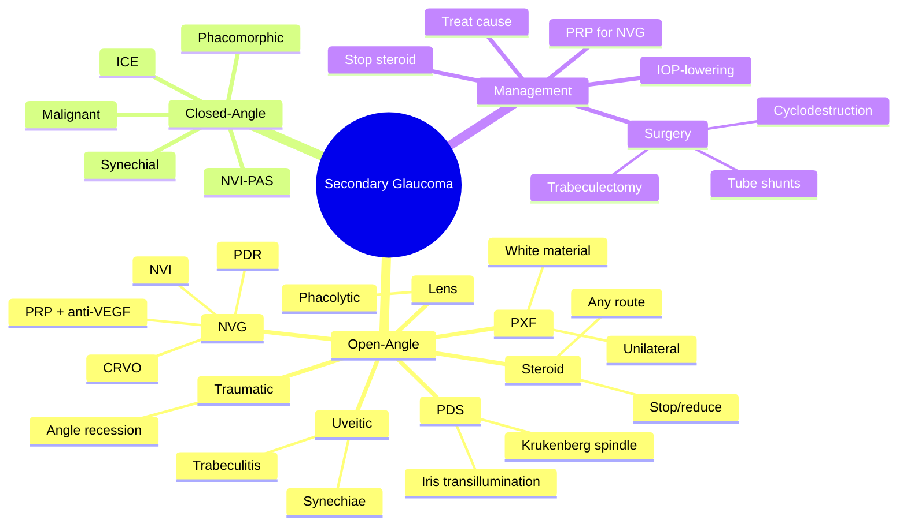

# Secondary Glaucoma

Related: [[Primary Open-Angle Glaucoma (POAG)]], [[Primary Angle-Closure Glaucoma (PACG)]]

> [!tip] **FCPS/MRCP Priority: HIGH**
> Glaucoma due to identifiable cause: pseudoexfoliation, pigment dispersion, neovascular, uveitic, traumatic, steroid. Treat underlying + IOP.

---

## Learning Objectives
- [ ] Define secondary glaucoma and differentiate from primary
- [ ] List the major causes (PXF, PDS, neovascular, uveitic, steroid, traumatic, lens-related)
- [ ] Recognise clinical clues (PXF material, Krukenberg spindle, NVI)
- [ ] Treat underlying cause AND control IOP
- [ ] Identify neovascular glaucoma as an ocular emergency
- [ ] Counsel on steroid-induced IOP response

---

## 1. Definition / Epidemiology / Classification

### Definition
- **Secondary glaucoma:** Glaucoma with identifiable ocular or systemic cause (vs primary POAG/PACG)
- Either open-angle or closed-angle mechanism

### Classification (by mechanism)
- **Open-angle** — trabecular meshwork dysfunction with open angle
- **Closed-angle** — angle closure from synechiae, NVI, lens, ICE

---

## 2. Aetiology / Pathophysiology

### Open-Angle Secondary Glaucoma

| Type | Mechanism / Pathology |
|------|------------------------|
| **Pseudoexfoliation syndrome (PXF/PEX)** | White flaky fibrillar material on lens capsule, pupillary margin, trabeculum; ↑ risk of glaucoma, often unilateral |
| **Pigment dispersion syndrome (PDS)** | Iris pigment loss (zonular friction); Krukenberg spindle; lens equator transillumination; young myopic males |
| **Neovascular (rubeotic)** | NVI from retinal ischaemia (PDR, CRVO, ocular ischaemic syndrome); fibrovascular membrane occludes angle; very severe |
| **Uveitic** | Trabeculitis, synechiae, steroid-induced; chronic uveitis |
| **Steroid-induced** | Any route (topical, systemic, inhaled, periocular); ↑ IOP, dose/duration-dependent |
| **Traumatic** | Angle recession (cleavage between longitudinal & circular fibres of ciliary body), hyphema |
| **Lens-related (phacolytic, phacomorphic, lens particle)** | Lens protein / particles clog trabeculum; intumescent lens pushes iris |
| **Intraocular tumours** | Melanoma, retinoblastoma, metastasis; direct invasion or infiltration |
| **Schwartz-Matsuo** | Photoreceptor outer segments in trabeculum (rhegmatogenous retinal detachment) |

### Closed-Angle Secondary Glaucoma
- **Synechial closure** (chronic uveitis)
- **Neovascular (NVI → PAS)**
- **Lens-induced** (phacomorphic, malignant)
- **ICE syndrome (iridocorneal endothelial)** — abnormal endothelium proliferates over angle

---

## 3. Risk Factors

| Type | Risk factors |
|------|--------------|
| PXF | Age, Northern European (Scandinavian), family history |
| PDS | Young, myopic, male, Caucasian |
| Neovascular | PDR, CRVO (ischaemic), ocular ischaemic syndrome, CRVO, chronic retinal detachment |
| Uveitic | Chronic anterior uveitis, juvenile idiopathic arthritis, sarcoidosis, TB, syphilis, Behçet |
| Steroid | Any route; high dose, prolonged use; family history of steroid response |
| Traumatic | Blunt ocular trauma (often years prior) |
| Lens | Hyper-mature cataract, dislocated lens, post-cataract surgery |

---

## 4. Clinical Features

- Glaucoma signs (cupping, field loss, ↑ IOP)
- Features of underlying cause:
  - PXF: white flaky material on lens, pupillary margin, trabeculum; iris transillumination defects
  - PDS: Krukenberg spindle (vertical pigment on corneal endothelium), iris transillumination
  - Neovascular: rubeosis iridis (NVI), severe IOP rise, often painful red eye
  - Uveitic: KPs, anterior chamber cells, synechiae
  - Steroid: history of steroid use (any route)
  - Traumatic: angle recession (gonioscopy), history of trauma, hyphaema
  - Lens-related: mature/hypermature cataract, subluxated lens

---

## 5. Investigations

- **Tonometry** — IOP (often very high, especially in neovascular)
- **Slit-lamp** — look for PXF, NVI, KPs, synechiae, Krukenberg spindle
- **Gonioscopy** — open vs closed; PAS, NVA (neovascularisation of angle), angle recession, heavy pigmentation, PXF
- **Dilated fundus** — disc cupping, retinal ischaemia (PDR, CRVO)
- **FFA** — for retinal ischaemia in neovascular glaucoma
- **OCT optic nerve / RNFL**
- **Visual fields**
- **B-scan** — if view obscured
- **Anterior segment OCT / UBM** — for angle anatomy
- **Biopsy** — for suspected tumour
- **Uveitis workup** — ACE, syphilis serology, TB, HLA-B27

---

## 6. Differential Diagnosis

- **POAG / PACG** — no identifiable secondary cause
- **Ocular hypertension** — no disc/field damage
- **Acute angle closure** — primary (covered separately)

---

## 7. Management

### Principles
- **Treat underlying cause** (e.g., PRP for NVI, anti-VEGF, stop/reduce steroid)
- **IOP-lowering** — drops, laser, surgery

### Specific Treatments

| Cause | Treatment |
|-------|-----------|
| **PXF glaucoma** | Drops (PGA first), SLT/ALT, trabeculectomy; lens extraction may help |
| **PDS glaucoma** | Drops (PGA), laser trabeculoplasty; rarely iridotomy |
| **Neovascular glaucoma** | **Panretinal photocoagulation (PRP)** + **anti-VEGF (intravitreal)** + IOP-lowering drops; cyclodestruction or tube shunts if end-stage |
| **Uveitic glaucoma** | Treat uveitis (steroid, cycloplegic); IOP drops; surgery (tube shunts) if needed |
| **Steroid-induced** | **Stop / reduce steroid**; IOP drops; switch to non-steroidal if possible |
| **Traumatic (angle recession)** | IOP drops; surgery if refractory |
| **Phacolytic** | Lens extraction (cataract surgery) |
| **Phacomorphic** | Lens extraction (definitive) |
| **Malignant** | Vitrectomy + zonulectomy; cycloplegics, mydriatics |
| **ICE syndrome** | Drops, surgery (often difficult); endothelial keratoplasty if corneal oedema |
| **Tumour** | Treat tumour (enucleation for large retinoblastoma / melanoma) |

### Surgical Options
- **Trabeculectomy ± antimetabolite** (MMC, 5-FU) — for refractory cases
- **Tube shunts** (Molteno, Baerveldt, Ahmed) — for high-risk failure (NVG, uveitic, ICE)
- **Cyclodestruction** (cyclodiode laser, cryotherapy) — end-stage blind painful eye

---

## 8. Complications

- **Optic atrophy** and permanent vision loss
- **Corneal decompensation** (especially in NVG, ICE)
- **Phthisis bulbi** (post-cyclodestruction)
- **Failure of surgery** (especially NVG, uveitic)
- **Hyphaema** (post-op, especially NVG)
- **End-stage blind painful eye** (cyclodestruction option)

---

## 9. Red Flags / Emergencies

- **Neovascular glaucoma with very high IOP** = ophthalmic emergency — PRP + anti-VEGF
- **Acute IOP rise with NVI** = treat ischaemia
- **Intumescent lens with angle closure** = lens extraction
- **Tumour causing glaucoma** = urgent oncology referral

---

## 10. FCPS/MRCP High-Yield Summary

| Cause | Key Feature |
|-------|-------------|
| Pseudoexfoliation | White material on lens, PXF; often unilateral; ↑ risk of zonular dialysis at surgery |
| Pigment dispersion | Krukenberg spindle, iris transillumination; young myopic males |
| Neovascular | NVI, rubeosis, severe; PRP + anti-VEGF |
| Uveitic | Trabeculitis, synechiae |
| Steroid | Any route, dose-related; STOP/reduce |
| Traumatic | Angle recession (years after trauma) |
| Lens | Phacolytic (mature cataract), phacomorphic (intumescent) |
| ICE | Unilateral, abnormal endothelium |

---

## 11. Viva Questions

1. **Q:** What is pseudoexfoliation syndrome?
   **A:** Systemic disorder with white flaky fibrillar material deposited on lens capsule, pupillary margin, and trabeculum. Associated with ↑ risk of glaucoma (often unilateral) and zonular weakness.

2. **Q:** What is the most common cause of neovascular glaucoma?
   **A:** Retinal ischaemia — proliferative diabetic retinopathy (PDR) and ischaemic CRVO.

3. **Q:** What is the treatment for neovascular glaucoma?
   **A:** Panretinal photocoagulation (PRP) + intravitreal anti-VEGF to treat ischaemia + IOP-lowering (drops, surgery, or cyclodestruction if end-stage).

4. **Q:** What is Krukenberg spindle?
   **A:** Vertical spindle of pigment on corneal endothelium in pigment dispersion syndrome.

5. **Q:** How is steroid-induced glaucoma treated?
   **A:** Stop / reduce steroid if possible, plus IOP-lowering drops.

---

## 12. Common Confusions / Exam Traps

| Confusion | Clarification |
|-----------|---------------|
| "PXF is bilateral" | Often UNILATERAL (or asymmetric) — important surgically |
| "PDS is bilateral" | Usually bilateral but asymmetric |
| "NVG treated with drops only" | Need PRP + anti-VEGF to treat ischaemia (cause) |
| "Stop steroid in all cases" | If essential (e.g., post-transplant), switch to less IOP-raising; treat IOP |
| "Angle recession causes acute glaucoma" | Usually chronic, years after trauma |
| "Phacolytic is a young person disease" | NO — it's a hypermature (senile) cataract leaking lens protein |
| "ICE is bilateral" | Unilateral; females; abnormal corneal endothelium |
| "Trabeculectomy works for NVG" | Higher failure rate — tube shunts preferred |
| "Steroid response is allergy" | It's a pressure response, not allergy |
| "Lens extraction cures PXF" | Helps IOP but glaucoma may persist |

---

## 13. Mnemonics

1. **"PXF = Patient's eXtra Flakes on lens"** — pseudoexfoliation
2. **"PDS = Pigment Drops from iris"** — pigment dispersion
3. **"NVG = Neovascular Vessels Grow (rubeosis)"** — treat ischaemia with PRP + anti-VEGF

---

## 14. Mind Map

---

## 15. One-Page Revision Card

| **Topic** | **Secondary Glaucoma** |
|-----------|------------------------|
| **Definition** | Glaucoma with identifiable ocular/systemic cause |
| **PXF** | White material on lens, often unilateral, ↑ zonular weakness |
| **PDS** | Krukenberg spindle, iris transillumination, young myopic male |
| **NVG** | NVI from PDR/CRVO; treat ischaemia (PRP + anti-VEGF) |
| **Steroid** | Any route, dose-related; stop/reduce |
| **Uveitic** | Treat uveitis + IOP |
| **Traumatic** | Angle recession (years after) |
| **Lens** | Phacolytic, phacomorphic |
| **Surgery** | Trabeculectomy, tube shunts, cyclodestruction |
| **Viva Pearl** | Treat the cause (e.g., PRP for NVG) AND the IOP |

---

## 16. Spaced Repetition Trackers

### 24-Hour Recall Prompts
- [ ] List 5 causes of secondary open-angle glaucoma
- [ ] Describe PXF and the surgical implication
- [ ] Outline management of neovascular glaucoma
- [ ] State how steroid-induced glaucoma is managed

### Revision Schedule
- [ ] **Day 1** completed (creation + 24h recall)
- [ ] **Day 3** revision completed
- [ ] **Day 7** revision completed
- [ ] **Day 15** revision completed
- [ ] **Day 30** revision completed
- [ ] **Day 90** revision completed

---

## 17. Must Know / Should Know / Nice to Know

### Must Know (Core for passing)
- [x] List of major causes (PXF, PDS, NVG, uveitic, steroid, traumatic, lens)
- [x] NVG = NVI from PDR/CRVO; treat with PRP + anti-VEGF
- [x] Steroid-induced: stop/reduce steroid
- [x] PXF material on lens
- [x] Krukenberg spindle in PDS
- [x] Lens-related (phacolytic/phacomorphic)

### Should Know (High probability)
- [x] Angle recession (post-traumatic, years later)
- [x] ICE syndrome (unilateral, female, abnormal endothelium)
- [x] Malignant glaucoma (post-op aqueous misdirection)
- [x] Tube shunts for high-risk failure cases
- [x] Cyclodestruction for end-stage blind painful eye

### Nice to Know (Differentiator)
- [ ] Uveitis workup (ACE, syphilis, TB, HLA-B27)
- [ ] Schwartz-Matsuo syndrome
- [ ] Anterior segment OCT / UBM
- [ ] SLT in PXF / PDS
- [ ] Genetics of PXF (LOXL1)

---

## 18. My Weak Points
- [ ] Add personal weak areas here

---

## 19. Self-Test Scorecard

| Section | Score /5 |
|---------|----------|
| Understanding: | /10 |
| Recall: | /10 |
| MCQ Performance: | /10 |
| SBA Performance: | /10 |
| Viva Confidence: | /10 |
| Total: | /50 |

> [!tip] **Interpretation:** <35 = weak topic, 35-44 = acceptable but insecure, 45+ = strong exam-ready topic.

---

## 20. Exam Answer Modes

### Long Answer Skeleton
1. Definition (glaucoma with identifiable cause)
2. Open-angle vs closed-angle classification
3. Major causes (PXF, PDS, NVG, uveitic, steroid, traumatic, lens, ICE)
4. Key features of each
5. Investigations (slit-lamp, gonioscopy, fundus, FFA)
6. Management principles
   - Treat underlying cause
   - IOP-lowering
   - Surgical options
7. NVG: PRP + anti-VEGF + IOP

### Short Note Skeleton
- Definition + classification
- 3 main causes (PXF, PDS, NVG) with one feature each
- Treat cause + IOP

### Viva One-Liners
- **Q:** What is the most common cause of NVG? → **A:** PDR and ischaemic CRVO
- **Q:** Treatment of NVG? → **A:** PRP + anti-VEGF + IOP lowering
- **Q:** Krukenberg spindle? → **A:** Vertical pigment on corneal endothelium in PDS
- **Q:** Steroid-induced glaucoma treatment? → **A:** Stop/reduce steroid + IOP drops

### Ward-Case Discussion Points
- Identify PXF material pre-operatively (zonular weakness risk)
- Recognise NVI in a painful red eye
- Stop topical steroid in chronic IOP rise
- Recognise angle recession in a trauma patient
- Counsel on PXF-associated systemic vascular disease

### Last-Night-Before-Exam Sheet
- **Top 3 facts:** NVG → PRP + anti-VEGF; PXF → unilateral white lens material; steroid → stop/reduce
- **1 mnemonic:** "PXF = eXtra Flakes"
- **Must-know differential:** POAG (no secondary cause)

---

## Summary
Secondary glaucoma has many causes (PXF, PDS, NVG, uveitic, steroid, traumatic, lens-related, ICE). Always treat the underlying cause AND the IOP. NVG is severe and requires urgent PRP + anti-VEGF to treat retinal ischaemia. Steroid-induced glaucoma responds to stopping/reducing steroid. PXF is often unilateral with surgical implications (zonular dialysis). Tube shunts are preferred in high-risk cases. Cyclodestruction is reserved for end-stage blind painful eyes.

---

## MCQs (10)

1. **Question:** The most common cause of neovascular glaucoma is:
   **Options:** A. Uveitis B. PDR and ischaemic CRVO C. Trauma D. Steroid E. Lens
   **Answer:** B
   **Explanation:** Retinal ischaemia (PDR, CRVO) drives NVI → NVG.

2. **Question:** Steroid-induced glaucoma is best treated by:
   **Options:** A. Continuing steroid B. Stopping/reducing steroid + IOP-lowering C. Vitrectomy D. Scleral buckle E. Observation
   **Answer:** B
   **Explanation:** Stop/reduce steroid + treat IOP.

3. **Question:** Pseudoexfoliation syndrome is associated with all EXCEPT:
   **Options:** A. White flaky material on lens B. ↑ Risk of glaucoma C. Zonular weakness D. Bilateral symmetrical disease E. ↑ Risk of zonular dialysis at surgery
   **Answer:** D
   **Explanation:** PXF is often UNILATERAL or asymmetric, NOT bilaterally symmetrical.

4. **Question:** Krukenberg spindle is seen in:
   **Options:** A. PXF B. PDS C. NVG D. Uveitis E. Steroid glaucoma
   **Answer:** B
   **Explanation:** Vertical spindle of pigment on corneal endothelium = pigment dispersion.

5. **Question:** Treatment of neovascular glaucoma includes all EXCEPT:
   **Options:** A. Panretinal photocoagulation B. Intravitreal anti-VEGF C. IOP-lowering drops D. Stopping the ischaemic stimulus E. Topical antibiotic
   **Answer:** E
   **Explanation:** Antibiotics don't treat NVG. PRP + anti-VEGF + IOP treatment is the key.

6. **Question:** Angle recession glaucoma is associated with:
   **Options:** A. Acute angle closure B. History of blunt ocular trauma (often years prior) C. Uveitis D. Steroid use E. Cataract surgery
   **Answer:** B
   **Explanation:** Angle recession follows blunt trauma; chronic glaucoma may develop years later.

7. **Question:** Phacolytic glaucoma is caused by:
   **Options:** A. Intumescent lens B. Leakage of lens protein from hypermature cataract C. Lens particle after trauma D. Dislocated lens E. None
   **Answer:** B
   **Explanation:** Phacolytic = leakage of lens protein from hypermature (Morgagnian) cataract clogging trabeculum.

8. **Question:** Phacomorphic glaucoma is due to:
   **Options:** A. Lens protein leakage B. Swollen (intumescent) lens pushing iris forward C. Lens particle D. Ectopia lentis E. Uveitis
   **Answer:** B
   **Explanation:** Phacomorphic = intumescent (swollen) lens → secondary angle closure.

9. **Question:** ICE syndrome characteristically shows:
   **Options:** A. Bilateral disease B. Males C. Unilateral, abnormal corneal endothelium D. Pupillary block E. Bilateral goniosynechiae
   **Answer:** C
   **Explanation:** Iridocorneal endothelial syndrome = unilateral, females, abnormal endothelium migrates over angle.

10. **Question:** Cyclodestruction is reserved for:
    **Options:** A. Early primary open-angle glaucoma B. End-stage blind painful eye C. Acute angle closure D. Steroid responders E. Children only
    **Answer:** B
    **Explanation:** Cyclodestruction (cyclodiode/cryo) is for end-stage blind painful eye — last resort.

---

## SBA Questions (10)

1. **Scenario:** A 60-year-old with proliferative diabetic retinopathy presents with a painful red eye, IOP 60 mmHg, rubeosis iridis, and hyphaema.
   **Question:** Most likely diagnosis and treatment?
   **Options:** A. POAG — start drops B. NVG — PRP + intravitreal anti-VEGF + IOP-lowering C. Uveitis — topical steroid D. Acute PACG — LPI E. Steroid response
   **Answer:** B
   **Explanation:** Painful red eye + NVI + PDR + very high IOP = NVG. Treat ischaemia + IOP.

2. **Scenario:** A 70-year-old patient on chronic topical steroid for chronic uveitis has IOP of 36 mmHg with mild cupping.
   **Question:** Most appropriate next step?
   **Options:** A. Continue steroid, add drops B. Reduce / switch steroid + start IOP-lowering drops C. Enucleation D. Cyclodestruction E. Vitrectomy
   **Answer:** B
   **Explanation:** Steroid-induced IOP rise — reduce or switch steroid and treat IOP.

3. **Scenario:** A 50-year-old myopic man with bilateral Krukenberg spindle and iris transillumination has IOP 28 mmHg.
   **Question:** Most likely diagnosis?
   **Options:** A. POAG B. Pigment dispersion glaucoma C. NVG D. Uveitis E. PXF
   **Answer:** B
   **Explanation:** Young myopic male + Krukenberg spindle + iris transillumination = PDS glaucoma.

4. **Scenario:** A 75-year-old with cataract surgery develops shallow AC, ↑IOP, and pain on day 1. Pupil is miotic. The patient is pseudophakic.
   **Question:** Most likely diagnosis?
   **Options:** A. Pupillary block B. Malignant glaucoma (aqueous misdirection) C. Endophthalmitis D. Uveitis E. Pupil block from capsular block
   **Answer:** B
   **Explanation:** Post-op flat AC + ↑IOP + miotic pupil = malignant glaucoma — treat with cycloplegics, vitrectomy.

5. **Scenario:** A 70-year-old has IOP 28 mmHg in one eye. Slit-lamp shows white flaky deposits on anterior lens capsule. The other eye is normal.
   **Question:** Most likely diagnosis?
   **Options:** A. POAG B. PXF glaucoma (often unilateral) C. PDS D. NVG E. Uveitis
   **Answer:** B
   **Explanation:** White flaky lens material + unilateral IOP rise = PXF glaucoma.

6. **Scenario:** A 25-year-old has a history of blunt trauma 10 years ago. Now has IOP 32 mmHg, normal disc, and gonioscopy shows a tear between longitudinal and circular ciliary muscle fibres.
   **Question:** Most likely diagnosis?
   **Options:** A. POAG B. Angle recession glaucoma C. Uveitis D. PXF E. NVG
   **Answer:** B
   **Explanation:** History of trauma + angle cleavage = angle recession glaucoma.

7. **Scenario:** A 90-year-old with hypermature (Morgagnian) cataract and very high IOP. AC shows lens protein and macrophages.
   **Question:** Most likely diagnosis and treatment?
   **Options:** A. POAG — drops B. Phacolytic glaucoma — lens extraction C. NVG — PRP D. Acute PACG — LPI E. Uveitis — steroid
   **Answer:** B
   **Explanation:** Hypermature cataract + lens protein in AC + high IOP = phacolytic; treat with lens extraction.

8. **Scenario:** A 60-year-old woman on maximal medical therapy for NVG has IOP 50 mmHg and is in pain, with no light perception.
   **Question:** Most appropriate option?
   **Options:** A. More drops B. Cyclodestruction (last resort for blind painful eye) C. Repeat PRP D. LPI E. Trabeculectomy
   **Answer:** B
   **Explanation:** Blind painful NVG → cyclodestruction (cyclodiode laser or cryotherapy).

9. **Scenario:** A 50-year-old patient with chronic anterior uveitis has IOP 38 mmHg, posterior synechiae, and KPs.
   **Question:** Best treatment strategy?
   **Options:** A. Treat uveitis (steroid + cycloplegic) + IOP drops B. LPI only C. PRP D. Cyclodestruction E. Lens extraction
   **Answer:** A
   **Explanation:** Uveitic glaucoma: treat underlying inflammation + IOP; cycloplegic prevents synechiae.

10. **Scenario:** A patient with PXF glaucoma is listed for cataract surgery. Intraoperatively, the zonules are weak.
    **Question:** What preoperative clue suggested this?
    **Options:** A. Krukenberg spindle B. PXF material on lens capsule and at pupil C. NVI D. KPs E. None
    **Answer:** B
    **Explanation:** PXF material on lens and pupil is associated with zonular weakness — capsular tension rings, prepare for vitrectomy.

---

## Flashcards

- **Q:** What is the most common cause of neovascular glaucoma?
  **A:** Retinal ischaemia — PDR and ischaemic CRVO.
- **Q:** What is Krukenberg spindle?
  **A:** Vertical pigment spindle on corneal endothelium in pigment dispersion syndrome.
- **Q:** How is pseudoexfoliation identified clinically?
  **A:** White flaky material on anterior lens capsule (central disc + peripheral band), pupillary margin, and trabeculum.
- **Q:** What is the first step in steroid-induced glaucoma?
  **A:** Stop or reduce the steroid (if possible) + IOP-lowering drops.
- **Q:** What is angle recession?
  **A:** Cleavage tear between longitudinal and circular ciliary muscle fibres after blunt trauma; chronic glaucoma risk.

---

## Answer Key with Explanations

### MCQs
1. B — PDR + CRVO drive NVG
2. B — Stop/reduce steroid + treat IOP
3. D — PXF is often UNILATERAL (not bilaterally symmetric)
4. B — Krukenberg spindle = PDS
5. E — Antibiotics don't treat NVG
6. B — Angle recession = post-traumatic
7. B — Phacolytic = hypermature cataract leaking lens protein
8. B — Phacomorphic = intumescent lens pushing iris forward
9. C — ICE = unilateral, abnormal endothelium
10. B — Cyclodestruction = blind painful eye (last resort)

### SBAs
1. B — NVG → PRP + anti-VEGF + IOP
2. B — Reduce/switch steroid + treat IOP
3. B — PDS = Krukenberg + transillumination
4. B — Malignant glaucoma (flat AC + ↑IOP post-op)
5. B — PXF = flaky material on lens
6. B — Angle recession after trauma
7. B — Phacolytic = lens extraction
8. B — Blind painful NVG → cyclodestruction
9. A — Uveitic glaucoma: treat uveitis + IOP
10. B — PXF material = zonular weakness

## Tags
#medicine #davidson #ophthalmology #secondary-glaucoma #fcps #mrcp

## PasTest Scenario SBAs (Clinical Vignettes)

> **Auto-generated PasTest/Mediscope-style scenario SBAs** grounded in the authored source. Each scenario tests a real clinical fact (triad, specific sign, contraindication, trial, first-line Rx) extracted from the topic. *Source: Ch 28: Medical Ophthalmology — Secondary Glaucoma*

**Q1.** What is the most appropriate first-line therapy for Secondary Glaucoma?

  - **A.** Treat underlying cause
  - **B.** An advanced/surgical therapy reserved for refractory disease
  - **C.** Symptomatic treatment only, no disease-modifying therapy
  - **D.** Empiric broad-spectrum therapy without specific indication

  > **Answer: A** — Treat underlying cause
  >
  > *Source:* **Treat underlying cause** (e.g., PRP for NVI, anti-VEGF, stop/reduce steroid)

