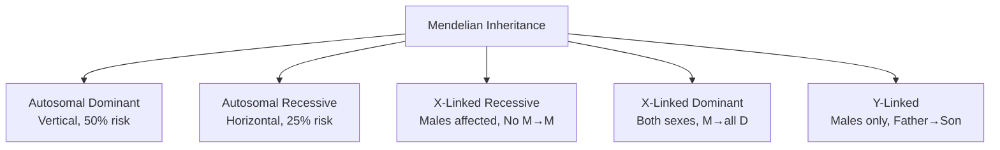
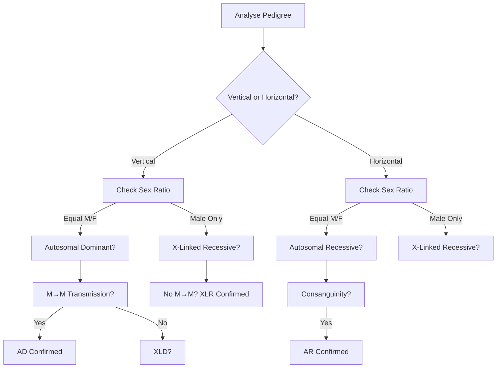
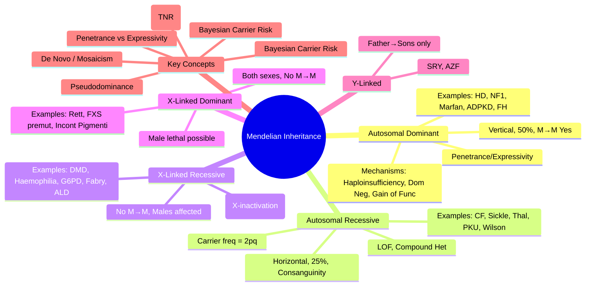

# 2.1 Mendelian Inheritance

---

## 🎯 Learning Objectives
- [ ] Recognise **pedigree patterns** for AD, AR, XLR, XLD, Y-linked inheritance
- [ ] Calculate **recurrence risks** for each inheritance type
- [ ] Explain **molecular mechanisms**: Haploinsufficiency, Dominant negative, Gain of function, Loss of function
- [ ] Apply **Bayesian risk calculation** with conditional probability
- [ ] Identify **key clinical features** of classic Mendelian disorders
- [ ] Answer viva: "Pedigree interpretation" and "Recurrence risk for AD/AR/XL disorders"

---

## 🧠 Core Concept: Mendelian Inheritance Patterns

---

## 1️⃣ Autosomal Dominant (AD) Inheritance

### Pedigree Features
| Feature | Description |
|---------|-------------|
| **Transmission** | Vertical (affected in every generation) |
| **Sex Ratio** | Equal (M = F) |
| **Recurrence Risk** | **50%** per pregnancy (if one parent affected) |
| **Male-to-Male** | **Yes** |
| **Skipped Generations** | Possible (incomplete penetrance, late onset, de novo) |
| **De Novo Mutations** | Common (e.g., Achondroplasia, NF1, Marfan) |

### Molecular Mechanisms
| Mechanism | Description | Examples |
|-----------|-------------|----------|
| **Haploinsufficiency** | 50% protein insufficient for normal function | TBX5 (Holt-Oram), PAX6 (Aniridia), PAH (RP), ELN (SVAS) |
| **Dominant Negative** | Mutant protein interferes with wild-type (multimeric proteins) | Collagen (OI, EDS), TP53, RUNX2, FBN1 (some) |
| **Gain of Function** | Novel toxic function, Constitutive activation | FGFR3 (Achondroplasia), RET (MEN2), HRAS (Costello), FGFR2 (Craniosynostosis) |
| **Toxic Protein** | Misfolded protein aggregation | Huntington (polyQ), TTR amyloidosis |

### Penetrance & Expressivity
| Term | Definition | Example |
|------|------------|---------|
| **Complete Penetrance** | All mutation carriers show phenotype | Huntington disease (age-dependent) |
| **Incomplete Penetrance** | Some carriers asymptomatic | BRCA1/2 (breast cancer ~70% by 80y), RB1 |
| **Variable Expressivity** | Severity varies among carriers | NF1 (café-au-lait only → MPNST), Marfan |
| **Pleiotropy** | Single gene → Multiple phenotypes | Marfan (skeletal, ocular, cardiovascular) |

### Recurrence Risk Calculations
| Scenario | Risk |
|----------|------|
| **One parent affected** (AD, complete penetrance) | **50%** |
| **One parent affected** (incomplete penetrance, e.g., 80%) | **40%** (50% × 0.8) |
| **De novo mutation** (unaffected parents) | **Population risk** (low) + **Germline mosaicism risk** (~1-5%) |
| **Affected child, unaffected parents** | Most likely **de novo** (unless incomplete penetrance/mosaicism) |
| **Germline mosaicism** (unaffected parents, >1 affected child) | **Empiric 1-5%** (depends on gene) |

### Classic AD Disorders — High-Yield

| Disorder | Gene | Chromosome | Key Features |
|----------|------|------------|--------------|
| **Huntington Disease** | HTT (CAG)n | 4p16.3 | Adult onset chorea, dementia, psychiatric; Anticipation (paternal) |
| **Neurofibromatosis Type 1** | NF1 | 17q11.2 | Café-au-lait ≥6, Neurofibromas, Lisch nodules, Optic glioma, MPNST risk |
| **Marfan Syndrome** | FBN1 | 15q21.1 | Tall, Arachnodactyly, Lens dislocation, Aortic root dilation, Ghent criteria |
| **ADPKD** | PKD1 (85%), PKD2 | 16p13.3 / 4q21 | Renal cysts, Hepatic cysts, Berry aneurysms, Hypertension |
| **Familial Hypercholesterolaemia** | LDLR, APOB, PCSK9 | 19p13.2 / 2p24 / 1p32 | High LDL, Tendon xanthomas, Premature CAD; Cascade testing |
| **Hereditary Haemochromatosis** | HFE (C282Y/H63D) | 6p22.2 | Iron overload, Cirrhosis, Diabetes, Arthritis; Phlebotomy |
| **Noonan Syndrome** | PTPN11, SOS1, RAF1, RIT1 | 12q24.1 / 2p22 | Short stature, Webb neck, Pulmonic stenosis, Hypertelorism, RASopathy |
| **Familial Adenomatous Polyposis** | APC | 5q22.2 | 100s-1000s adenomas, Desmoids, CHRPE, Duodenal cancer |
| **Tuberous Sclerosis** | TSC1 (9q34), TSC2 (16p13.3) | 9q34 / 16p13.3 | Hamartomas (brain, kidney, skin, heart), Seizures, Facial angiofibromas |
| **Von Hippel-Lindau** | VHL | 3p25.3 | RCC, Phaeochromocytoma, Haemangioblastoma, Renal cysts |
| **MEN1** | MEN1 | 11q13.1 | 3 Ps: Parathyroid, Pancreas, Pituitary |
| **MEN2A/2B** | RET | 10q11.2 | MTC, Phaeo, Hyperparathyroidism (2A), Marfanoid (2B) |
| **Achondroplasia** | FGFR3 (G380R) | 4p16.3 | Short limbs, Macrocephaly, Midface hypoplasia, 99% same mutation |
| **Osteogenesis Imperfecta** (Type I/II/III/IV) | COL1A1/COL1A2 | 17q21.3 / 7q21.3 | Fragile bones, Blue sclerae, Deafness, Dentinogenesis imperfecta |

---

## 2️⃣ Autosomal Recessive (AR) Inheritance

### Pedigree Features
| Feature | Description |
|---------|-------------|
| **Transmission** | Horizontal (affected sibs, unaffected parents) |
| **Sex Ratio** | Equal (M = F) |
| **Recurrence Risk** | **25%** per pregnancy (both parents carriers) |
| **Carrier Frequency** | Often 1/20 - 1/50 in general population |
| **Consanguinity** | **Strong risk factor** (F × q) |
| **Pseudodominance** | Affected + Carrier → 50% affected (mimics AD) |

### Molecular Mechanism
| Mechanism | Description | Examples |
|-----------|-------------|----------|
| **Loss of Function** | No functional protein (null or hypomorphic alleles) | CFTR, HBB, PAH, GAA, GBA, SMN1, ATP7B |
| **Compound Heterozygosity** | Two different pathogenic alleles | Most AR patients (e.g., CF: F508del / G551D) |
| **Founder Mutations** | High frequency in isolated populations | Ashkenazi Jews (CF, Tay-Sachs, Gaucher), Finns |

### Recurrence Risk Calculations
| Scenario | Risk |
|----------|------|
| **Both parents known carriers** | **25%** affected, 50% carrier, 25% normal |
| **One parent carrier, one unknown** | **Carrier freq / 2** (population risk) |
| **Affected child, parents unknown status** | **2/3** chance each parent is carrier (Bayesian) |
| **Consanguinity (1st cousins)** | Risk = q² + Fq (F = 1/16) |
| **Carrier × Affected (pseudodominance)** | **50%** affected |

### Bayesian Carrier Risk (Classic Example)
> **Prior:** Population carrier risk = 1/25 (CF).  
> **Data:** Healthy sibling of affected child.  
> **Posterior:** Carrier risk = **2/3** (not 1/25!) — Given unaffected, 2 of 3 possible genotypes are carriers.

| Genotype | Prior | Conditional (Unaffected) | Posterior |
|----------|-------|--------------------------|-----------|
| Carrier (Aa) | 2/3 | 1 | **2/3** |
| Normal (AA) | 1/3 | 1 | **1/3** |

### Classic AR Disorders — High-Yield

| Disorder | Gene | Chromosome | Key Features |
|----------|------|------------|--------------|
| **Cystic Fibrosis** | CFTR | 7q31.2 | ΔF508 (70%), Pancreatic insufficiency, Lung disease, CFTR modulators |
| **Sickle Cell Disease** | HBB (Glu6Val) | 11p15.4 | HbSS, Vaso-occlusive crisis, Stroke, Hydroxyurea, Crizanlizumab |
| **β-Thalassaemia** | HBB | 11p15.4 | Transfusion dependence, Iron overload, Chelation, BMT |
| **α-Thalassaemia** | HBA1/HBA2 | 16p13.3 | --/αα (silent), -/αα (trait), --/-α (HbH), --/-- (Hb Bart's, hydrops) |
| **Phenylketonuria** | PAH | 12q23.2 | Newborn screening, Phe-restricted diet, Sapropterin, Phe-free formula |
| **Sickle Cell Trait** | HBB (AS) | 11p15.4 | **Carrier** — AS; Renal medullary carcinoma risk, Splenic infarct at altitude |
| **Tay-Sachs Disease** | HEXA | 15q23-q24 | GM2 ganglioside accumulation, Cherry-red spot, Infantile death |
| **Gaucher Disease** | GBA | 1q21 | Glucocerebroside accumulation, Type 1 (non-neuropathic), ERT |
| **Niemann-Pick Type A/B** | SMPD1 | 11p15.4 | Sphingomyelin accumulation, Hepatosplenomegaly, Neurodegeneration (A) |
| **Wilson Disease** | ATP7B | 13q14.3 | Copper accumulation, Kayser-Fleischer rings, Neuro/hepatic, Penicillamine |
| **α1-Antitrypsin Deficiency** | SERPINA1 | 14q32.1 | ZZ genotype → Emphysema (early), Liver cirrhosis; Augmentation therapy |
| **Friedreich Ataxia** | FXN (GAA)n | 9q21.11 | GAA repeat, Ataxia, Cardiomyopathy, Diabetes, Scoliosis |
| **Spinal Muscular Atrophy** | SMN1 (exon 7 del) | 5q13.2 | SMN2 copy number modifies severity; Nusinersen, Risdiplam, Gene therapy |
| **Congenital Adrenal Hyperplasia** | CYP21A2 | 6p21.3 | 21-hydroxylase deficiency, Salt-wasting, Virilisation, 17-OHP |
| **Alkaptonuria** | HGD | 3q21-q23 | Ochronosis, Dark urine, Arthritis, Nitisinone |
| **Homocystinuria** | CBS | 21q22.3 | Marfanoid, Lens dislocation, Thrombosis, Intellectual disability, B6 responsive |
| **Maple Syrup Urine Disease** | BCKDHA/B/C | Multi | Branched-chain ketoacids, Neonatal encephalopathy, Dietary restriction |

---

## 3️⃣ X-Linked Inheritance

### X-Linked Recessive (XLR)
| Feature | Description |
|---------|-------------|
| **Affected** | Almost exclusively **males** (hemizygous) |
| **Carrier Females** | Usually asymptomatic (random X-inactivation) |
| **Transmission** | **No male-to-male** transmission |
| **Affected Male →** | All daughters = carriers; Sons = unaffected |
| **Carrier Female →** | 50% sons affected, 50% daughters carriers |
| **Skipped Generations** | Common (carrier females → affected males) |

| Disorder | Gene | Key Features |
|----------|------|--------------|
| **Duchenne/Becker MD** | DMD | Dystrophin; Proximal weakness, Gower sign, Cardiomyopathy; Exon deletion/duplication |
| **Haemophilia A** | F8 | Factor VIII deficiency; Inhibitors (30%), Emicizumab prophylaxis |
| **Haemophilia B** | F9 | Factor IX deficiency; Less common |
| **G6PD Deficiency** | G6PD | X-linked; Favism, Neonatal jaundice, Drug triggers (primaquine, sulfonamides) |
| **Fabry Disease** | GLA | α-Galactosidase A; Angiokeratomas, Acroparesthesias, Renal/Heart/CNS; ERT/Chaperone |
| **Hunter Syndrome (MPS II)** | IDS | Iduronate-2-sulfatase; Coarse facial, Hepatosplenomegaly, Joint stiffness; ERT |
| **Adrenoleukodystrophy** | ABCD1 | VLCFA accumulation; Cerebral ALD (childhood), Adrenomyeloneuropathy (adult); HSCT |
| **Fragile X Syndrome** | FMR1 | CGG repeat >200 = Full mutation; Intellectual disability, Macroorchidism, Autism |
| **Incontinentia Pigmenti** | IKBKG | XLD, Male lethal; Skin (vesicular→verrucous→hyperpigmented), Dental, CNS, Ocular |
| **Wiskott-Aldrich** | WAS | Thrombocytopenia (small platelets), Eczema, Recurrent infections, Lymphoma risk |

### X-Linked Dominant (XLD)
| Feature | Description |
|---------|-------------|
| **Both Sexes Affected** | Females often milder (X-inactivation) |
| **Affected Male →** | All daughters affected; All sons unaffected |
| **Affected Female →** | 50% offspring (both sexes) affected |
| **Male Lethality** | Some XLD lethal in males (e.g., Incontinentia Pigmenti, Rett) |

| Disorder | Gene | Key Features |
|----------|------|--------------|
| **Rett Syndrome** | MECP2 | Females; Normal 6-18m → Regression, Hand-wringing, Seizures, Ataxia |
| **Fragile X (Premutation)** | FMR1 | 55-200 CGG; FXPOI (premature ovarian insufficiency), FXTAS (tremor/ataxia) |
| **Incontinentia Pigmenti** | IKBKG | Male lethal; Skin (vesicular→verrucous→hyperpigmented), Dental, CNS |
| **Rett (Male Klinefelter 47,XXY)** | MECP2 | Rare surviving males |

### Y-Linked Inheritance
| Feature | Detail |
|---------|--------|
| **Transmission** | Father → All sons; No daughters |
| **Disorders** | SRY (sex determination), AZF (azoospermia factors), Hearing loss (DFNY1) |

---

## 4️⃣ Pedigree Analysis — Stepwise Approach

### Key Discriminators
| Feature | AD | AR | XLR | XLD | Y |
|---------|----|----|-----|-----|---|
| **Vertical/Horizontal** | Vertical | Horizontal | Diagonal | Vertical/Diagonal | Vertical |
| **Sex Ratio** | Equal | Equal | > Males | Both (F > M) | Males Only |
| **Male-to-Male** | Yes | No | **No** | No | Yes |
| **Affected Male →** | 50% all children carriers | N/A | All daughters carriers | All daughters affected | All sons affected |
| **Recurrence Risk** | 50% | 25% | 50% (sons of carrier) | 50% | 100% (sons) |

---

## ⚡ FCPS/MRCP High-Yield Summary

| Inheritance | Pedigree | Recurrence Risk | Key Examples |
|-------------|----------|-----------------|--------------|
| **AD** | Vertical, Equal sexes, M→M | 50% | HD, NF1, Marfan, ADPKD, FH, ADPKD, TSC, VHL, MEN |
| **AR** | Horizontal, Consanguinity | 25% | CF, Sickle cell, Thalassaemia, PKU, Wilson, Gaucher, FA, SMA |
| **XLR** | No M→M, Males affected | 50% sons of carrier | DMD/BMD, Haemophilia A/B, G6PD, Fabry, Hunter, ALD, FXS (premut) |
| **XLD** | Both sexes, No M→M | 50% | Rett, FXS (premut), Incontinentia Pigmenti |
| **Y-linked** | Father→Sons only | 100% sons | SRY, AZF |

---

## 🎤 Viva Questions (Expected Answers)

| # | Question | Expected Answer |
|---|----------|-----------------|
| 1 | How do you distinguish AD from AR on a pedigree? | **AD**: Vertical transmission, 50% risk, M→M transmission. **AR**: Horizontal, consanguinity, 25% risk, no M→M. |
| 2 | What is the recurrence risk for AD with 80% penetrance? | **40%** (50% × 0.8). |
| 3 | What is the molecular mechanism of Huntington disease? | **Gain of function** — CAG repeat expansion in HTT → Toxic polyQ protein aggregation. |
| 4 | What is the recurrence risk for CF if both parents are carriers? | **25%** affected, 50% carrier, 25% normal. |
| 5 | How does a female carrier of XLR manifest? | Usually asymptomatic (random X-inactivation). **Skewed X-inactivation** → Mild symptoms (e.g., Haemophilia carriers with low factor). |
| 6 | No male-to-male transmission in pedigree. Which inheritance? | **X-Linked** (recessive or dominant). Y-linked also no M→M but father→all sons. |
| 7 | What is pseudodominance in AR? | Carrier (Aa) × Affected (aa) → 50% affected offspring. Mimics AD pedigree. |
| 8 | Why is there no male-to-male transmission in X-linked? | Father passes Y chromosome to sons; X chromosome only to daughters. |
| 9 | Carrier frequency of CF is 1/25. Disease incidence? | q ≈ 1/50 (carrier 2pq ≈ 2q). q² = 1/2500. |
| 10 | What is anticipation? Which disorders show it? | Earlier onset/increased severity in successive generations. **TNR disorders**: HD, FXS, DM1, FRDA, SCA. |

---

## 🧩 Confusions & Mnemonics

| Confusion | Clarification |
|-----------|---------------|
| **"Incomplete penetrance = variable expressivity"** | **NO.** Penetrance = **proportion** expressing phenotype. Expressivity = **severity** among those expressing. |
| **"X-linked = only males affected"** | **NO.** XLD affects both sexes. XLR females can manifest if skewed X-inactivation. |
| **"No family history = not genetic"** | **NO.** De novo mutations (AD, XL), Incomplete penetrance, Late onset, Mosaicism, AR with small families. |
| **"All AD = 50% risk"** | **NO.** Incomplete penetrance (e.g., BRCA1 ~70%), Mosaicism, Germline mosaicism in parents lower recurrence. |
| **"Carrier = Affected in recessive"** | **NO.** Carriers (heterozygotes) asymptomatic. Exceptions: Sickle trait (splenic infarct), G6PD carriers, FXS premutation (FXPOI/FXTAS). |
| **"X-inactivation = 50:50 always"** | **NO.** Random but **skewed possible** (>80:20) → Carrier phenotype. Increases with age. |
| **"Consanguinity causes AR diseases"** | **NO.** Consanguinity **increases risk** for existing recessive alleles in population. Does not cause mutation. |
| **"Affected child + unaffected parents = AR always"** | **NO.** Could be AD (de novo, incomplete penetrance), XLR (carrier mother), Mosaicism. |
| **"X-linked = skipped generations"** | **AR also skips** (carriers). X-linked shows **obligate carrier females** connecting affected males. |
| **"Y-linked = rare"** | **True.** Only SRY, AZF, Hairy ears (myth). Very few genes on Y. |

> **Mnemonic: MENDELIAN INHERITANCE**  
> **M**endelian: **AD, AR, XLR, XLD, Y** — 5 Patterns  
> **E**qual Sex Ratio: **AD, AR, XLD** (except XLR male>female, Y male only)  
> **N**o Male-to-Male: **XLR, XLD, Y** (Y has M→M but no females)  
> **D**ominant (AD): **Vertical, 50%, M→M Yes**  
> **E**qual Transmission: **AD 50%, AR 25%, XLR 50% sons, XLD 50%, Y 100% sons**  
> **L**oss of Function: **AR = Null/Hypomorph**; **Gain of Function: AD = Toxic/Dominant Negative**  
> **I**ncomplete Penetrance: **AD (BRCA, RB1) / AR rare** — Not all carriers affected  
> **A**nticipation: **TNR (HD, FXS, DM1, FRDA, SCA)** — Earlier onset, worse severity  
> **N**o M→M: **XLR, XLD** — Father gives Y to sons, X only to daughters  
> **P**seudodominance: **AR carrier × Affected = 50% affected** — Mimics AD  
> **E**xpressivity vs Penetrance: **Penetrance = proportion; Expressivity = severity range**  
> **D**e Novo: **AD most common** (Achondroplasia, NF1, Marfan) — Unaffected parents  
> **I**nheritance Risk: **AD 50%, AR 25%, XLR 50% sons, XLD 50%, Y 100% sons**  
> **R**ecurrence Risk: **Bayesian for AR (2/3 carrier if unaffected sib of affected)**  
> **X**-inactivation: **Lyonisation** — Random, Skewed → Carrier females symptomatic  
> **M**osaicism: **Germline → Recurrence risk; Somatic → Segmental**  
> **A**nticipation: **TNR (CAG/CGG/CTG/GAA)** — HD, FXS, DM1, FRDA, SCA  
> **T**ertiary: **Genetic Counselling** — Non-directive, Risk calc, Cascade testing  
> **I**nheritance Risk Table: **AD 50%, AR 25%, XLR 50% sons, XLD 50%, Y 100% sons**  
> **A**utosomal vs Sex-Linked: **Autosomal = Equal sexes; Sex-linked = Skewed**  
> **N**omenclature: **OMIM numbers** — AD #1xxx, AR #2xxx, XLR #3xxx, XLD #3xxx  
> **C**ascade Testing: **Proband → Relatives (AR 50% carrier, AD 50% affected, XLR 50% females carriers)**  
> **E**thical: **Non-directive, Autonomy, Confidentiality, Duty to Warn**  

---

## 🗺️ Mind Map

---

## 📅 Spaced Repetition Tracker

| Review | Date | Score (0–5) | Notes |
|--------|------|-------------|-------|
| Day 1 | | | |
| Day 3 | | | |
| Day 7 | | | |
| Day 14 | | | |
| Day 30 | | | |
| Day 90 | | | |

---

## 📝 Self-Test Scorecard

| Section | Max | Score | % |
|---------|------|-------|---|
| AD Pedigree & Mechanisms | 4 | | |
| AR Pedigree, Consanguinity, Bayesian | 4 | | |
| X-Linked (Recessive/Dominant) | 3 | | |
| Y-Linked | 1 | | |
| Classic Disorders (AD/AR/XL) | 4 | | |
| Recurrence Risk Calculations | 3 | | |
| Penetrance vs Expressivity | 2 | | |
| **Total** | **20** | | |

---

## 💬 Exam Answer Modes

| Format | Prompt | Key Points |
|--------|--------|------------|
| **Long Essay** | "Describe the patterns of Mendelian inheritance with examples and recurrence risks." | AD/AR/XLR/XLD/Y pedigrees, Mechanisms, Penetrance vs Expressivity, Recurrence risks, Classic examples table |
| **Short Note** | "Autosomal recessive inheritance and Bayesian carrier risk." | Horizontal, 25% risk, Consanguinity, Carrier 2pq, Bayesian 2/3 for unaffected sib of affected |
| **Viva** | "Pedigree shows affected males in multiple generations, no male-to-male. Mother of affected male has affected brother. What is inheritance? Recurrence risk for her son?" | **X-Linked Recessive**. Mother carrier risk = 50% (from affected brother). Her son risk = 50% (mother carrier) × 50% = **25%**. |
| **Ward Round** | "Couple with CF child, pregnant again. What is recurrence risk? Prenatal options?" | **25%** recurrence. Prenatal: CVS (11-14w) qf-PCR + CFTR seq; Amnio (15-20w). PGD-M available. |
| **Last-Night** | "AD: Vert, 50%, M→M. AR: Horiz, 25%, Consang. XLR: No M→M, males. XLD: Both, no M→M. Y: Father→Sons. Penetrance=proportion, Expressivity=severity. AD: Haplo/DomNeg/Gain. AR: LOF, CompHet. XLR: Males, Carrier fem. XLD: Both, M lethal. TNR: HD/FXS/DM1/FRDA/SCA. Anticipation." | Compressed table. |

---

## 📌 Summary
- **Autosomal Dominant**: Vertical pedigree, 50% risk, **M→M transmission**. Mechanisms: Haploinsufficiency, Dominant negative, Gain of function. Incomplete penetrance common.
- **Autosomal Recessive**: Horizontal pedigree, 25% risk, **Consanguinity increases risk (F=1/16)**. Loss of function, Compound heterozygosity. Bayesian carrier risk for unaffected sib = **2/3**.
- **X-Linked Recessive**: **No male-to-male transmission**, Affected males, Carrier females (X-inactivation). 50% sons of carrier affected.
- **X-Linked Dominant**: Both sexes affected, **No M→M**. Male lethality possible (Rett, Incontinentia Pigmenti).
- **Y-Linked**: Father → All sons only. Very rare (SRY, AZF).
- **Key Mechanisms**: AD = HI / DN / GOF; AR = LOF; XLR = LOF in males; TNR = Anticipation.
- **Recurrence Risks**: AD 50% (40% if 80% penetrance), AR 25%, XLR 50% sons of carrier, XLD 50%, Y 100%.
- **Classic Disorders**: AD (HD, NF1, Marfan, ADPKD, FH); AR (CF, Sickle, Thal, PKU, Wilson); XLR (DMD, Haemophilia, G6PD, Fabry, ALD, FXS premut).

---

## ❓ MCQs (10)

1. **Pedigree: Vertical transmission, equal sexes, male-to-male present. Inheritance?**  
   A. AR  B. **AD**  C. XLR  D. XLD  
   *Answer: B. Vertical + M→M = Autosomal Dominant.*

2. **Cystic fibrosis — recurrence risk for carrier couple?**  
   A. 50%  B. **25%**  C. 12.5%  D. 100%  
   *Answer: B. AR → 25% affected, 50% carrier, 25% normal.*

3. **Unaffected sibling of AR affected child — carrier risk?**  
   A. 1/2  B. **2/3**  C. 1/4  D. 1/3  
   *Answer: B. Given unaffected, 2 of 3 genotypes are carriers (AA, Aa, aA).*

4. **X-linked recessive — male-to-male transmission?**  
   A. Yes  B. **No**  C. Sometimes  D. Only if mother affected  
   *Answer: B. Father gives Y to sons; X chromosome only to daughters.*

5. **Huntington disease — molecular mechanism?**  
   A. Haploinsufficiency  B. **Gain of function (toxic polyQ)**  C. Dominant negative  D. Loss of function  
   *Answer: B. CAG repeat expansion → Toxic polyglutamine protein aggregation.*

6. **Fragile X syndrome — repeat type?**  
   A. CAG  B. **CGG**  C. CTG  D. GAA  
   *Answer: B. FMR1 CGG repeat >200 = Full mutation; 55-200 = Premutation.*

7. **Turner syndrome — karyotype?**  
   A. 47,XXY  B. 47,XYY  C. **45,X**  D. 47,XXX  
   *Answer: C. Monosomy X (45,X) or mosaicism (45,X/46,XX).*

8. **Achondroplasia — inheritance and mutation?**  
   A. AR, FGFR3  B. **AD, FGFR3 (G380R)**  C. XLR, FGFR3  D. AD, FBN1  
   *Answer: B. AD, FGFR3 c.1138G>A (p.Gly380Arg) — 99% same mutation.*

9. **Prader-Willi syndrome — mechanism?**  
   A. Maternal UPD15  B. **Paternal deletion 15q11-13 / Maternal UPD15**  C. Maternal del  D. Paternal UPD only  
   *Answer: B. Paternal 15q11-13 deletion (~70%) or Maternal UPD15 (~25%). Imprinting (paternal expression).*

10. **Huntington disease anticipation — parental origin?**  
    A. Maternal > Paternal  B. **Paternal > Maternal**  C. Equal  D. Maternal only  
    *Answer: B. Anticipation greater with paternal transmission (spermatogenesis more unstable).*

---

## 📋 SBAs (10)

1. **Pedigree: Affected male, affected son, affected grandson. No affected females. Inheritance?**  
   A. AR  B. **AD**  C. XLR  D. Y-linked  
   *Answer: D. Father→Son→Grandson, no females = Y-linked (only males affected, direct father→son).*

2. **Couple, both carriers for Tay-Sachs. Have 2 unaffected children. Recurrence risk next pregnancy?**  
   A. 1/2  B. **1/4**  C. 1/8  D. 1/16  
   *Answer: B. Each pregnancy independent 25% risk (AR).*

3. **Woman with affected brother (XLR). Her son's risk?**  
   A. 1/2  B. **1/4**  C. 1/8  D. 0  
   *Answer: B. Mother carrier risk = 1/2 (from carrier mother). Her son risk = 1/2 × 1/2 = 1/4.*

4. **CF couple (ΔF508/F508del). Fetal CFTR testing shows ΔF508/G551D. Phenotype?**  
   A. Unaffected  B. **Classic CF (Compound heterozygote)**  C. Mild  D. Carrier  
   *Answer: B. Two different pathogenic alleles = Compound heterozygote = Affected.*

5. **Pedigree: Affected female, affected son, affected daughter. No affected father. Inheritance?**  
   A. AD  B. XLR  C. **XLD**  D. Mitochondrial  
   *Answer: C. Affected female → affected sons and daughters (50% each). No male-to-male = XLD.*

---

## 🔑 Answer Keys
| MCQs | SBAs |
|------|------|
| 1-B, 2-B, 3-B, 4-B, 5-B, 6-B, 7-C, 8-B, 9-A, 10-B | 1-D, 2-B, 3-B, 4-B, 5-C |

---

## 🔗 Cross-Links
- [[1. Fundamentals of Medical Genetics]] — DNA structure, Mutation types, HWE basis
- [[2.2 Non-Mendelian Inheritance]] — Mitochondrial, Imprinting, Repeats, Mosaicism
- [[2.3 Multifactorial Inheritance]] — Complex traits beyond Mendelian
- [[4.1 Autosomal Dominant Disorders]] — Detailed AD disorder phenotypes
- [[4.2 Autosomal Recessive Disorders]] — Detailed AR disorder phenotypes
- [[4.3 X-Linked Disorders]] — Detailed XL disorder phenotypes
- [[5.5 Genetic Counselling]] — Risk communication, Carrier testing, Prenatal options
- [[7. Pharmacogenetics]] — CYP2D6 (Codeine), CYP2C19 (Clopidogrel) AD/AR pharmacogenetics
- [[8. Population & Newborn Screening]] — HWE application in carrier screening programmes

---

**Last Updated:** 2026-06-14  
**Next:** Build `2.2 Non-Mendelian Inheritance.md` and `2.3 Multifactorial Inheritance.md`