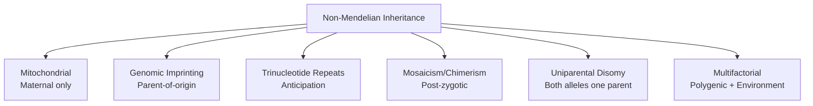
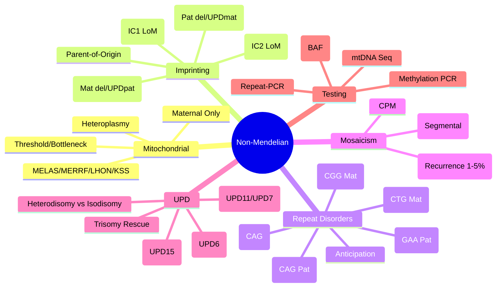

# 2.2 Non-Mendelian Inheritance

---

## 🎯 Learning Objectives
- [ ] Explain **mitochondrial inheritance** (maternal, heteroplasmy, threshold effect, bottleneck)
- [ ] Describe **genomic imprinting** mechanisms and disorders (PWS, AS, BWS, SRS)
- [ ] Explain **trinucleotide repeat disorders** (anticipation, premutation vs full mutation)
- [ ] Distinguish **mosaicism vs chimerism** (gonadal vs somatic, recurrence risks)
- [ ] Explain **uniparental disomy (UPD)** mechanisms and disorders
- [ ] Calculate recurrence risks for non-Mendelian conditions
- [ ] Answer viva: "Mitochondrial inheritance vs Mendelian" and "Imprinting in PWS vs AS"

---

## 🧠 Core Concept: Beyond Mendel

---

## 1️⃣ Mitochondrial Inheritance

### Key Principles
| Principle | Description |
|-----------|-------------|
| **Maternal Transmission** | mtDNA exclusively from oocyte (sperm mitochondria degraded) |
| **Heteroplasmy** | Mixture of mutant + wild-type mtDNA in same cell |
| **Threshold Effect** | Phenotype manifests when mutant load > tissue-specific threshold |
| **Mitotic Segregation** | Random distribution during cell division → Variable tissue levels |
| **Bottleneck Effect** | Drastic reduction in mtDNA copies during oogenesis → Shift in heteroplasmy between generations |
| **No Male Transmission** | Affected males do not transmit to offspring |

### mtDNA Structure
- **16.5 kb circular DNA**
- **37 genes**: 13 protein (OXPHOS complexes I, III, IV, V), 22 tRNA, 2 rRNA
- **No introns**, Compact, High mutation rate (10-20× nuclear)
- **D-loop** (Control region) — Replication/Transcription origin

### Key Mitochondrial Disorders

| Disorder | Mutation | Key Features |
|----------|----------|--------------|
| **MELAS** | m.3243A>G (MT-TL1, 80%) | **Stroke-like episodes** (<40y), Encephalopathy, Lactic acidosis, Diabetes, Deafness, Short stature; MRI: cortical lesions |
| **MERRF** | m.8344A>G (MT-TK) | **Myoclonus, Epilepsy, Ataxia**, Ragged-red fibres, Hearing loss, Short stature |
| **LHON** | m.11778G>A (MT-ND4, 50%), m.14484T>C (MT-ND6), m.3460G>A (MT-ND1) | **Acute/subacute bilateral vision loss** (young males), Cardiac pre-excitation, Dystonia; Incomplete penetrance (males > females) |
| **Kearns-Sayre (KSS)** | Large mtDNA deletions (4977 bp common) | **Onset <20y**: CPEO, Pigmentary retinopathy, Heart block, Cerebellar ataxia, CSF protein >100mg/dL; Single large deletion (sporadic) |
| **CPEO** | mtDNA deletions (sporadic) / Nuclear genes (POLG, RRM2B, TWNK) | Progressive external ophthalmoplegia, Ptosis, Exercise intolerance; Dominant (autosomal) if nuclear |
| **NARP / Leigh Syndrome** | m.8993T>G/C (MT-ATP6) | NARP: Neuropathy, Ataxia, Retinitis pigmentosa; Leigh: Subacute necrotising encephalomyelopathy (infancy) |
| **MNGIE** | TYMP (ECGF1) | Mitochondrial Neurogastrointestinal Encephalopathy; GI dysmotility, Cachexia, Leukoencephalopathy, Ptosis; Autosomal recessive (nuclear) |
| **mtDNA Depletion Syndromes** | POLG, MPV17, DGUOK, TK2, SUCLA2 | Infantile hepatic/neurologic; POLG = Alpers (hepatic failure + seizures) |
| **MELAS-like** | POLG (recessive) | Alpers syndrome (hepatic failure, seizures, refractory epilepsy) |

### Heteroplasmy & Threshold
| Tissue | Threshold (approx) |
|--------|-------------------|
| **Brain / Muscle** | High (80-90%) |
| **Blood** | Low (often <20% in adults) |
| **Urine epithelial** | Intermediate |

> **Key:** Blood heteroplasmy **may not reflect** muscle/brain levels. **Muscle biopsy** or **urine epithelial cells** preferred for testing.

### Genetic Counselling for mtDNA
| Scenario | Risk to Offspring |
|----------|------------------|
| **Affected Mother** | All children inherit mtDNA; **Heteroplasmy level unpredictable** (bottleneck) |
| **Affected Father** | **Zero risk** (no paternal mtDNA transmission) |
| **Heteroplasmy Level** | Low (<20%) → Low risk; High (>80%) → High risk; Intermediate → Unpredictable |
| **Prenatal Testing** | CVS/Amnio for heteroplasmy level; **Limitations**: Mosaicism, Tissue variability |

---

## 2️⃣ Genomic Imprinting

### Mechanism
| Component | Description |
|-----------|-------------|
| **Parent-of-Origin Expression** | Gene expressed only from **one parental allele** (maternal OR paternal) |
| **Epigenetic Marks** | **DNA methylation** at DMRs (Differentially Methylated Regions) — established in gametogenesis |
| **ICR/IC (Imprinting Control Region)** | Regulates imprinting cluster; CTCF binding blocks enhancer-promoter |
| **Erasure & Re-establishment** | Erased in PGCs → Re-established sex-specifically in spermatogenesis/oogenesis |
| **Dosage Sensitivity** | Imprinted genes often regulate growth/development; Biallelic expression = Disease |

### Imprinting Disorders

| Disorder | Chromosome | Imprinted Genes | Mechanism | Key Features |
|----------|------------|----------------|-----------|--------------|
| **Prader-Willi Syndrome (PWS)** | 15q11-q13 | **Paternal expression**: SNRPN, NDN, MAGEL2 | **Paternal deletion (~70%)**, Maternal UPD15 (~25%), Imprinting defect (<5%) | **Neonatal hypotonia**, Feeding difficulty → **Hyperphagia/Obesity**, Hypogonadism, Intellectual disability, Short stature, Small hands/feet |
| **Angelman Syndrome (AS)** | 15q11-q13 | **Maternal expression**: UBE3A | **Maternal deletion (~70%)**, Paternal UPD15 (~3-7%), Imprinting defect, UBE3A mutation | **Severe ID**, Ataxia, **Happy demeanor**, Seizures, Microcephaly, Speech absent, "Puppet-like" gait |
| **Beckwith-Wiedemann Syndrome (BWS)** | 11p15.5 | **IC1 (H19/IGF2)** & **IC2 (KCNQ1OT1/CDKN1C)** | **IC2 LoM (~50%)**, Paternal UPD(11)pat (~20%), IC1 GoM, CDKN1C mutation | **Macrosomia**, Macroglossia, Omphalocele, Hemihypertrophy, **Wilms tumour** risk (~5-10%), Neonatal hypoglycaemia |
| **Silver-Russell Syndrome (SRS)** | 11p15.5 (IC1) / 7q32 (GRB10) | IC1 (H19/IGF2) LoM / GRB10 maternal | **IC1 LoM (~40-50%)**, Maternal UPD7 (~10%) | **Severe IUGR**, Postnatal growth failure, Relative macrocephaly, Triangular face, 5th finger clinodactyly, Asymmetry |
| **Temple Syndrome** | 14q32 (DLK1/MEG3) | Paternal DLK1, Maternal MEG3 | Maternal UPD14 | Prenatal growth restriction, Hypotonia, Early puberty, Obesity |
| **Kagami-Ogata Syndrome** | 14q32 | Paternal UPD14 | Polyhydramnios, Distinctive face, Coat-hanger ribs, Placentomegaly |

### Imprinting Centre (IC) Mutations
| Type | Mechanism |
|------|-----------|
| **IC1 (H19/IGF2) GoM** | Gain of methylation → BWS (biallelic IGF2) |
| **IC2 (KCNQ1OT1) LoM** | Loss of methylation → BWS (CDKN1C silencing) / SRS (if maternal IC2) |
| **Deletion of IC** | Imprinting defect (e.g., PWS/AS IC deletions) |

> **Imprinting = Epigenetic, not sequence change.** Testing requires **methylation-specific PCR / MS-MLPA / Pyrosequencing**.

---

## 3️⃣ Trinucleotide Repeat Disorders (Anticipation)

### Mechanism
- **Repeat Expansion** via DNA polymerase slippage during replication/repair
- **Anticipation**: Earlier onset, increased severity in successive generations
- **Premutation vs Full Mutation**: Intermediate alleles unstable, expand to full mutation in meiosis
- **Parental Origin Bias**: Expansion often greater in paternal (HD, DM1) or maternal (FXS) transmission

| Disorder | Gene | Repeat | Normal | Premutation | Full Mutation | Anticipation Bias |
|----------|------|--------|--------|-------------|---------------|-------------------|
| **Huntington Disease (HD)** | HTT | CAG | 10-35 | 36-39 (intermediate) | ≥40 | **Paternal > Maternal** |
| **Fragile X Syndrome (FXS)** | FMR1 | CGG | 5-44 | 55-200 | >200 | **Maternal > Paternal** |
| **Myotonic Dystrophy Type 1 (DM1)** | DMPK | CTG | 5-34 | 35-49 | ≥50 | **Maternal > Paternal** (congenital DM1 from mother) |
| **Friedreich Ataxia (FRDA)** | FXN (intron 1) | GAA | 5-33 | 34-65 (variable) | >66 (often >600) | **Paternal > Maternal** |
| **SCA1** | ATXN1 | CAG | 6-35 | 36-44 | ≥45 | Paternal |
| **SCA2** | ATXN2 | CAG | 14-31 | 32-36 | ≥37 | Paternal |
| **SCA3 (MJD)** | ATXN3 | CAG | 12-40 | 41-45 | ≥45 | Paternal |
| **SCA6** | CACNA1A | CAG | 4-18 | — | ≥20 | Paternal |
| **SCA7** | ATXN7 | CAG | 4-19 | — | ≥37 | Maternal (retinal) |
| **SCA8** | ATXN8OS/ATXN8 | CTG/CAG | 16-40 | 50-80 | >80 | Maternal |
| **SBMA (Kennedy)** | AR | CAG | 9-36 | 37-40 | ≥38 | Paternal |

### Anticipation — Clinical Impact
- **HD**: Paternal transmission → Larger expansions → Earlier onset
- **FXS**: Premutation (55-200 CGG) in mother → Expansion to >200 in offspring; **FXPOI** (premature ovarian insufficiency), **FXTAS** (tremor/ataxia) in premutation carriers
- **DM1**: Congenital form almost exclusively from **mother** (severe expansion >1000 CTG in utero)
- **FRDA**: GAA repeat in intron 1 → Frataxin deficiency; Homozygous expansion >600 typical

---

## 4️⃣ Mosaicism & Chimerism

### Mosaicism
| Type | Origin | Characteristics |
|------|--------|----------------|
| **Gonadal Mosaicism** | Mutation in germline precursor | **Unaffected parent**, **Multiple affected offspring**; Recurrence risk **1-5%** (empiric) |
| **Somatic Mosaicism** | Post-zygotic mutation | **Segmental/linear distribution**; Non-heritable (unless gonadal also) |
| **Confined Placental Mosaicism (CPM)** | Mosaic in placenta only | Discordant CVS vs Fetal karyotype; UPD risk if trisomy rescue |

| Feature | Somatic Mosaicism | Gonadal Mosaicism |
|---------|------------------|------------------|
| **Transmission** | No (unless gonads also) | **Yes** (recurrence risk) |
| **Detection** | Affected tissue biopsy | Difficult (requires multiple gametes) |
| **Recurrence Risk** | Negligible | **1-5%** (empiric) |
| **Examples** | McCune-Albright (GNAS), Sturge-Weber (GNAQ), Proteus (AKT1) | Recurrent AR/AD in sibs with unaffected parents |

### Chimerism
| Type | Origin |
|------|--------|
| **Tetragametic** | Fusion of 2 zygotes (4 gametes) → 46,XX/46,XY |
| **Blood Group Chimerism** | Twin-twin transfusion |
| **Fetal-Maternal Microchimerism** | Fetal cells in mother (persists decades) |

> **Mosaicism = Single zygote, post-zygotic mutation. Chimerism = Multiple zygotes fused.**

### Recurrence Risk Counselling
| Scenario | Counselling |
|----------|-------------|
| **Unaffected parents, >1 affected child (AD/AR)** | **Gonadal mosaicism likely** → Risk **1-5%** per pregnancy |
| **Segmental disorder (linear Blaschko lines)** | **Somatic mosaicism** → Negligible recurrence risk |
| **Confined Placental Mosaicism** | UPD risk if trisomy rescue (e.g., trisomy 16 CPM → UPD16) |

---

## 5️⃣ Uniparental Disomy (UPD)

### Mechanisms
| Mechanism | Process |
|-----------|---------|
| **Trisomy Rescue** | Trisomic zygote → Loss of one chromosome → Disomy (if rescued chromosome from same parent → UPD) |
| **Gamete Complementation** | Nullisomic + Disomic gamete → Normal chromosome number, UPD |
| **Post-fertilisation Error** | Mitotic error → Trisomy → Loss → UPD |
| **Monosomy Rescue** | Nullisomic gamete + Normal gamete → Duplication of single chromosome → UPD |

### UPD Types
| Type | Description |
|------|-------------|
| **Heterodisomy (UPDhet)** | Both homologous chromosomes from one parent (Meiosis I error) |
| **Isodisomy (UPDiso)** | Two identical copies of one parental chromosome (Meiosis II error / Post-zygotic duplication) |
| **Segmental UPD** | Part of chromosome UPD, rest biparental (Post-zygotic recombination) |
| **Mixed UPD** | Segmental heterodisomy + isodisomy |

### UPD Disorders (Clinical Significance)

| UPD | Disorder | Mechanism |
|-----|----------|-----------|
| **UPD15 (Maternal)** | **Prader-Willi Syndrome** | Loss of paternal 15q11-13 expression (SNRPN, etc.) |
| **UPD15 (Paternal)** | **Angelman Syndrome** | Loss of maternal UBE3A expression |
| **UPD11 (Paternal)** | **Beckwith-Wiedemann Syndrome** | Biallelic IGF2 (IC1 GoM), Loss of CDKN1C |
| **UPD7 (Maternal)** | **Silver-Russell Syndrome** | Loss of paternal GRB10/IGF2 expression |
| **UPD14 (Maternal)** | **Temple Syndrome** | Loss of paternal DLK1 expression |
| **UPD14 (Paternal)** | **Kagami-Ogata Syndrome** | Loss of maternal MEG3 expression |
| **UPD6 (Maternal)** | **Transient Neonatal Diabetes (TNDM)** | 6q24 maternal UPD → PLAGL1/HYMAI overexpression |
| **UPD20 (Maternal)** | Pseudo-Hypoparathyroidism 1B | GNAS methylation defect |

> **UPD = Usually asymptomatic** unless imprinted region involved. **Isodisomy** → Homozygosity for recessive mutations (e.g., UPDiso → AR disease).

### Detection
| Method | Detects |
|--------|---------|
| **SNP Microarray** | UPD (B-allele frequency = 0 or 1 across chromosome) + LOH |
| **Methylation PCR** | Specific imprinted loci (e.g., 15q11, 11p15) |
| **STR/Karyotype** | Not detected (normal chromosome number) |

---

## ⚡ FCPS/MRCP High-Yield Summary

| Disorder | Category | Key Points |
|----------|----------|------------|
| **Mitochondrial** | MELAS/MERRF/LHON/KSS | **Maternal only**, Heteroplasmy, Threshold, Bottleneck, No male transmission |
| **Imprinting** | PWS/AS/BWS/SRS | Parent-of-origin, Methylation at ICR, PWS (pat del/UPDmat), AS (mat del/UPDpat), BWS (IC2 LoM), SRS (IC1 LoM) |
| **Repeat Disorders** | HD, FXS, DM1, FRDA, SCAs | CAG/CGG/CTG/GAA, **Anticipation**, Paternal (HD) vs Maternal (FXS, DM1) bias |
| **Mosaicism** | Somatic vs Gonadal | Segmental vs Recurrence risk 1-5% |
| **UPD** | PWS/AS/BWS/SRS/TNDM | Trisomy rescue, Gamete complementation, Isodisomy vs Heterodisomy |
| **Key Testing** | Methylation PCR, SNP Array, mtDNA seq, Repeat-primed PCR | Methylation-specific for imprinting; SNP array for UPD/LOH; mtDNA sequencing for mtDNA disorders |

---

## 🎤 Viva Questions (Expected Answers)

| # | Question | Expected Answer |
|---|----------|-----------------|
| 1 | Mitochondrial inheritance — key features? | **Maternal only**, Heteroplasmy, Threshold effect, Bottleneck, No male transmission. No male-to-male. |
| 2 | Prader-Willi vs Angelman — mechanism? | Both 15q11-13. **PWS: Paternal deletion/UPDmat** (loss of paternal SNRPN). **AS: Maternal deletion/UPDpat** (loss of maternal UBE3A). |
| 3 | Anticipation — mechanism and examples? | **Repeat expansion** in successive generations → Earlier onset, worse severity. **HD (CAG, paternal)**, **FXS (CGG, maternal)**, **DM1 (CTG, maternal)**, **FRDA (GAA, paternal)**. |
| 4 | Gonadal vs somatic mosaicism? | **Gonadal** = Germline mutation → Recurrence risk 1-5% (unaffected parents, >1 affected child). **Somatic** = Post-zygotic, segmental, non-heritable (unless gonadal also). |
| 5 | Uniparental disomy — mechanism? | **Trisomy rescue** (most common): Trisomic zygote loses one chromosome from one parent → Disomic but both from same parent. |
| 6 | PWS vs AS molecular difference? | Both 15q11-13. **PWS = loss of paternal genes (SNRPN)**. **AS = loss of maternal UBE3A**. Same region, opposite parent-of-origin. |
| 7 | Anticipation in HD — paternal vs maternal? | **Paternal transmission** → Larger CAG expansions → Earlier onset, anticipation. |
| 7 | Fragile X — premutation vs full mutation? | **Premutation**: 55-200 CGG (FXPOI, FXTAS). **Full**: >200 CGG + methylation → FXS (ID, autism). |
| 8 | UPD detection — best test? | **SNP Microarray** (BAF = 0 or 1 across chromosome) or **Methylation-specific PCR** for specific loci (15q11, 11p15). |
| 9 | Mitochondrial disorder — affected father, risk to children? | **Zero** (no paternal mtDNA transmission). |
| 10 | Mosaicism vs Chimerism? | **Mosaicism** = Single zygote, post-zygotic mutation. **Chimerism** = Fusion of 2+ zygotes (e.g., 46,XX/46,XY). |

---

## 🧩 Confusions & Mnemonics

| Confusion | Clarification |
|-----------|---------------|
| **"Imprinting = Mutation"** | **NO.** Imprinting = **Epigenetic** (methylation), not DNA sequence change. Testing = Methylation analysis. |
| **"UPD = Always causes disease"** | **NO.** Most UPD is **asymptomatic** unless imprinted region involved. Isodisomy can unmask recessive mutations. |
| **"Mitochondrial = Only maternal"** | **True for mtDNA**, but **nuclear-encoded mitochondrial genes** (POLG, TWNK, etc.) follow Mendelian. |
| **"Anticipation = Only expansion"** | **YES but** also **selection bias** (earlier onset → more likely to be diagnosed). |
| **"Mosaicism = Always heritable"** | **NO.** Only **gonadal mosaicism** is heritable (1-5% risk). **Somatic mosaicism** = Not transmitted. |
| **"UPD = Trisomy rescue always"** | **Mostly**, but also **gamete complementation** (nullisomic + disomic gametes) and **monosomy rescue**. |
| **"Imprinting = Same as methylation"** | **Imprinting is the phenomenon**; Methylation is the **mechanism** (also histone mods, ncRNA). |
| **"FXS premutation = Carrier only"** | **NO.** Premutation carriers at risk for **FXPOI** (women) and **FXTAS** (older adults). |
| **"Mosaicism = Always detectable in blood"** | **NO.** **Somtic mosaicism** often **not in blood** (e.g., McCune-Albright, Proteus). Need affected tissue biopsy. |
| **"UPD = Loss of heterozygosity"** | **UPD causes LOH** (isodisomy), but **LOH ≠ UPD** (LOH also in deletions, CN-LOH in tumours). |

> **Mnemonic: NON-MENDELIAN COMPLEX**  
> **N**on-Mendelian: **Mitochondrial, Imprinting, Repeats, Mosaicism, UPD**  
> **O**rganelles: **mtDNA Maternal Only** — Heteroplasmy, Threshold, Bottleneck, No Male Transmit  
> **N**uclear vs Mitochondrial: **Nuclear = Mendelian; mtDNA = Maternal Only**  
> **M**itochondrial Disorders: **MELAS (3243), MERRF (8344), LHON (11778/14484/3460), KSS (Del)**  
> **E**pigenetic Imprinting: **PWS (Pat del/UPDmat), AS (Mat del/UPDpat), BWS (IC2 LoM), SRS (IC1 LoM)**  
> **D**isorders: **PWS = SNRPN loss; AS = UBE3A loss; BWS = IGF2↑/CDKN1C↓; SRS = IGF2↓**  
> **E**xpectation: **Mosaicism = Somatic (Segmental) vs Gonadal (Recurrence 1-5%)**  
> **L**OH/UPD: **Trisomy Rescue → UPD; Isodisomy = Homozygous AR risk**  
> **I**mprinting: **ICR Methylation (IC1/IC2), CTCF, CTCF blocks Enhancer**  
> **A**nticipation: **TNR (CAG/CGG/CTG/GAA)** — **HD (Pat), FXS (Mat), DM1 (Mat), FRDA (Pat)**  
> **A**llele Origin: **Heterodisomy (MI error) vs Isodisomy (MII/Dup)**  
> **N**on-Mendelian: **Mitochondrial, Imprinting, Repeats, Mosaicism, UPD**  
> **I**solated CPM: **Confined Placental Mosaicism** — Discordant CVS vs Fetus; UPD risk if trisomy rescue  
> **C**himerism: **Tetragametic (46,XX/46,XY) vs Mosaicism (Single Zygote)**  
> **C**ascade: **Genetic Counselling** — Non-directive, Risk calc, Cascade testing, Prenatal  
> **O**xidative Phosphorylation: **mtDNA 13 Proteins (CI, CIII, CIV, CV)**  
> **M**itochondrial Bottleneck: **Oogenesis mtDNA Reduction → Heteroplasmy Shift**  
> **P**aternal vs Maternal: **HD (Pat), FXS (Mat), DM1 (Mat), FRDA (Pat)**  
> **L**eiomyoma: **Not genetic** (just mnemonic filler)  
> **E**pigenetics: **Methylation, Histone, ncRNA** — Imprinting, X-inactivation  
> **X**-inactivation: **Lyonisation** — Random, Skewed → Carrier phenotype  
> **S**ick: **Somatic vs Gonadal Mosaicism** — Befriend for Recurrence Risk Counselling  

---

## 🗺️ Mind Map

---

## 📅 Spaced Repetition Tracker

| Review | Date | Score (0–5) | Notes |
|--------|------|-------------|-------|
| Day 1 | | | |
| Day 3 | | | |
| Day 7 | | | |
| Day 14 | | | |
| Day 30 | | | |
| Day 90 | | | |

---

## 📝 Self-Test Scorecard

| Section | Max | Score | % |
|---------|-----|-------|---|
| Mitochondrial Inheritance | 4 | | |
| Genomic Imprinting (PWS/AS/BWS/SRS) | 4 | | |
| Trinucleotide Repeats & Anticipation | 4 | | |
| Mosaicism & Chimerism | 3 | | |
| Uniparental Disomy (Mechanisms/Disorders) | 3 | | |
| Recurrence Risk Counselling | 2 | | |
| Clinical Testing Modalities | 2 | | |
| **Total** | **20** | | |

---

## 💬 Exam Answer Modes

| Format | Prompt | Key Points |
|--------|--------|------------|
| **Long Essay** | "Describe non-Mendelian inheritance patterns with clinical examples." | Mitochondrial (maternal, heteroplasmy), Imprinting (PWS/AS/BWS/SRS), TNR/anticipation, Mosaicism (somatic/gonadal), UPD (mechanisms, PWS/AS/BWS/SRS). |
| **Short Note** | "Prader-Willi vs Angelman syndrome." | Both 15q11-13. PWS: Paternal del/UPDmat (SNRPN loss). AS: Maternal del/UPDpat (UBE3A loss). Testing: Methylation PCR. |
| **Viva** | "Woman with MELAS (m.3243A>G). Risk to children?" | **Maternal transmission → All children inherit mtDNA**. Heteroplasmy shift unpredictable (bottleneck). Cannot give precise risk. Prenatal testing for heteroplasmy level possible but limited predictive value. |
| **Viva** | "Couple with PWS child (paternal del 15q11). Recurrence risk?" | **Deletion de novo → <1%**. If parental translocation → Higher. If imprinting centre defect → 50%. If maternal UPD15 → Low de novo. |
| **Ward Round** | "Child with features of BWS. Karyotype normal. Microarray normal. Next test?" | **Methylation-specific PCR / MS-MLPA for 11p15** (IC1/IC2). BWS = IC2 LoM (~50%) or IC1 GoM or UPD11pat. |
| **Last-Night** | "Mito: Maternal, Heteroplasmy, Threshold, Bottleneck. Imp: PWS(Pat/UPDmat), AS(Mat/UPDpat), BWS(IC2 LoM), SRS(IC1 LoM). Repeats: HD(CAG Pat), FXS(CGG Mat), DM1(CTG Mat), FRDA(GAA Pat). Mosaic: Somatic vs Gonadal(1-5%). UPD: Trisomy rescue, Isodisomy=AR risk. Test: Methylation/Array/mtDNA/repeat-PCR." | Compressed. |

---

## 📌 Summary
- **Mitochondrial**: Maternal only. Heteroplasmy + Threshold + Bottleneck. No male transmission. MELAS (3243A>G), MERRF (8344A>G), LHON (11778/14484/3460), KSS (large del).
- **Imprinting**: Parent-of-origin expression via DNA methylation at ICRs. **PWS** (Paternal 15q11-13 del/UPDmat), **AS** (Maternal 15q11-13 del/UPDpat), **BWS** (11p15 IC2 LoM → IGF2↑/CDKN1C↓), **SRS** (11p15 IC1 LoM / UPD7mat).
- **TNR/Anticipation**: CAG (HD, SCAs, SBMA — Paternal), CGG (FXS — Maternal), CTG (DM1 — Maternal), GAA (FRDA — Paternal). Anticipation = Earlier onset/severity.
- **Mosaicism**: **Gonadal** (recurrence 1-5%) vs **Somatic** (segmental, non-heritable). CPM → UPD risk.
- **UPD**: Trisomy rescue (most common). **Heterodisomy** (MI error) vs **Isodisomy** (MII/duplication). Isodisomy → Homozygosity for recessive mutations. **PWS (UPD15mat), AS (UPD15pat), BWS (UPD11pat), SRS (UPD7mat), TNDM (UPD6mat)**.
- **Testing**: Methylation PCR (imprinting), SNP Array (UPD/LOH/CNV), mtDNA sequencing, Repeat-primed PCR (FXS, HD, DM1, FRDA), QF-PCR (rapid aneuploidy).

---

## ❓ MCQs (10)

1. **Mitochondrial inheritance — father affected, risk to offspring?**  
   A. 50%  B. 25%  C. **0%**  D. 100%  
   *Answer: C. No paternal mtDNA transmission.*

2. **Prader-Willi — most common mechanism?**  
   A. Maternal UPD15  B. **Paternal 15q11-13 deletion**  C. Imprinting defect  D. Maternal deletion  
   *Answer: B. ~70% paternal deletion, ~25% maternal UPD15, <5% IC defect.*

3. **Fragile X — premutation carriers at risk for:**  
   A. FXS only  B. **FXPOI and FXTAS**  C. Intellectual disability  D. Autism only  
   *Answer: B. Premutation (55-200 CGG): FXPOI (women), FXTAS (older adults).*

4. **Anticipation in HD — which parent?**  
   A. Maternal  B. **Paternal**  C. Equal  D. Neither  
   *Answer: B. Paternal transmission → larger CAG expansions → earlier onset.*

5. **UPD15 maternal → which syndrome?**  
   A. Angelman  B. **Prader-Willi**  C. BWS  D. SRS  
   *Answer: B. UPD15mat = loss of paternal genes → PWS.*

6. **Gonadal mosaicism recurrence risk:**  
   A. 25%  B. **1-5%**  C. 50%  D. <0.1%  
   *Answer: B. Empiric 1-5% for AD/AR disorders with unaffected parents and >1 affected child.*

6. **Imprinting centre 1 (IC1) Gain of Methylation → which syndrome?**  
   A. PWS  B. **BWS**  C. SRS  D. AS  
   *Answer: B. IC1 GoM → Biallelic IGF2 → BWS. IC2 LoM → CDKN1C silencing → BWS.*

8. **Uniparental disomy — isodisomy risk?**  
   A. AD disorders  B. **AR disorders (homozygosity)**  C. X-linked  D. Mitochondrial  
   *Answer: B. Isodisomy = Two identical copies → Homozygous for recessive mutations on that chromosome.*

9. **Mitochondrial bottleneck effect:**  
   A. Increase heteroplasmy  B. **Shift heteroplasmy in oocytes**  C. Prevent transmission  D. Increase mutation rate  
   *Answer: B. Drastic reduction in mtDNA copies during oogenesis → Random shift in heteroplasmy between generations.*

10. **Kearns-Sayre syndrome — genetic basis:**  
    A. Point mutation  B. **Large mtDNA deletion**  C. Nuclear gene (POLG)  D. Trinucleotide repeat  
    *Answer: B. Single large-scale mtDNA deletion (common 4977 bp), sporadic.*

---

## 📋 SBAs (10)

1. **Child with hypotonia, obesity, hypogonadism. Karyotype normal. Microarray normal. Methylation PCR for 15q11 shows loss of paternal methylation. Diagnosis?**  
   A. Angelman  B. **Prader-Willi**  C. Fragile X  D. BWS  
   *Answer: B. Loss of paternal methylation on 15q11 = PWS.*

2. **Woman with 80 CGG repeats in FMR1. Her risk of having child with FXS?**  
   A. 0%  B. **High (premutation expands to full in meiosis)**  C. 100%  D. 25%  
   *Answer: B. Premutation (55-200) → Expansion to full (>200) in maternal transmission → FXS.*

3. **Couple with child with BWS (IC2 LoM on 11p15). Karyotype normal, microarray normal. Recurrence risk?**  
   A. 50%  B. **<1% (de novo epigenetic)**  C. 25%  D. 1%  
   *Answer: B. IC2 LoM usually de novo (<1% recurrence). If familial IC mutation/CDKN1C mutation → higher.*

4. **Male with LHON (m.11778G>A). His daughter's risk?**  
   A. 100%  B. 50%  C. **0%**  D. 25%  
   *Answer: C. No paternal mtDNA transmission.*

5. **Couple with AR disorder child (SMA). Unaffected. Next pregnancy risk?**  
   A. 50%  B. **25%**  C. 100%  D. 0%  
   *Answer: B. AR recurrence = 25% each pregnancy.*

---

## 🔑 Answer Keys
| MCQs | SBAs |
|------|------|
| 1-C, 2-B, 3-B, 4-B, 5-B, 6-B, 7-B, 8-B, 9-B, 10-B | 1-B, 2-B, 3-B, 4-C, 5-B |

---

## 🔗 Cross-Links
- [[1. Fundamentals of Medical Genetics]] — Mutation types (TNR), Population genetics, Mitochondrial DNA
- [[2.1 Mendelian Inheritance]] — Mendelian patterns contrasted with non-Mendelian
- [[2.3 Multifactorial Inheritance]] — Beyond single-gene/variant models
- [[4.4 Mitochondrial Disorders]] — Detailed phenotype/genotype correlations
- [[4.5 Imprinting & UPD]] — Detailed disorder descriptions
- [[3. Chromosomal Disorders]] — UPD detection on microarray, CPM
- [[5.5 Genetic Counselling]] — Risk calculation for non-Mendelian conditions
- [[4.3 X-Linked Disorders]] — FMR1/Fragile X, DMD mosaicism
- [[4.4 Mitochondrial Disorders]] — Detailed phenotype/genotype
- [[6.1 Hereditary Cancer Syndromes]] — MSI vs MLH1 methylation (imprinting-like)
- [[9. ELSI]] — Counselling ethics for non-Mendelian conditions

---

**Last Updated:** 2026-06-14  
**Next:** Build `2.3 Multifactorial Inheritance.md` and `3. Chromosomal Disorders.md`