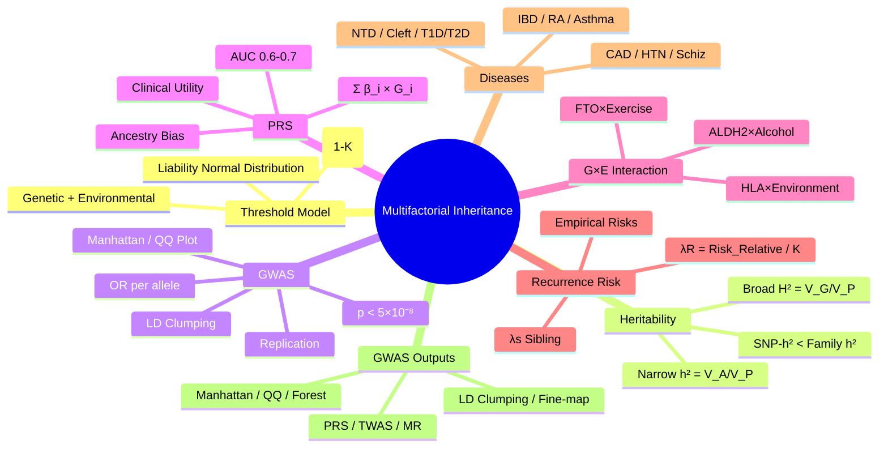

# 2.3 Multifactorial (Complex) Inheritance


---

## 🎯 Learning Objectives
- [ ] Understand the **threshold model** (liability distribution) for multifactorial traits
- [ ] Define **heritability (h²)** and distinguish from recurrence risk
- [ ] Interpret **GWAS** results: Odds ratios, P-values, Manhattan/QQ plots, LD clumping
- [ ] Calculate **recurrence risk** for relatives using λs and population prevalence
- [ ] Understand **Polygenic Risk Scores (PRS)**: Construction, validation, clinical utility
- [ ] Describe **gene-environment interaction** (G×E) and examples
- [ ] Answer viva: "Threshold model for NTD" and "PRS clinical implementation"

---

## 🧠 Core Concept: The Threshold (Liability) Model

```mermaid
flowchart LR
    A[Liability Distribution<br/>Normal (Bell Curve)] --> B[Threshold T]
    B --> C{Above Threshold?}
    C -->|Yes| D[Affected]
    C -->|No| E[Unaffected]
    B --> F[Liability = Genetic + Environmental]
    F --> G[Genetic: Polygenic (many small effects)]
    F --> H[Environmental: Lifestyle, Exposures, Stochastic]
```

> **Core Principle:** *Complex traits = Polygenic (many variants of small effect) + Environmental. No single variant is necessary or sufficient. Liability is normally distributed; threshold = disease.*

---

## 1️⃣ The Liability / Threshold Model

### Key Concepts
| Term | Definition |
|------|------------|
| **Liability** | Continuous, normally distributed trait underlying disease susceptibility |
| **Threshold (T)** | Liability value above which disease manifests |
| **Population Prevalence (K)** | Area under curve > T (e.g., 1% for Type 1 Diabetes) |
| **Heritability (h²)** | Proportion of liability variance due to genetic factors |
| **Recurrence Risk (λR)** | Risk to relative / Population prevalence |

### Liability Distribution Parameters
| Parameter | Symbol | Typical Values |
|-----------|--------|----------------|
| **Threshold (T)** | Z-score | T = Φ⁻¹(1-K) |
| **Mean Liability (Affected)** | μ_A | T + (z/K) where z = φ(T) |
| **Mean Liability (Unaffected)** | μ_U | -z/(1-K) |
| **Correlation (Relatives)** | r | MZ twins = 1, DZ/sibs = 0.5, 2nd deg = 0.25 |

### Calculating Recurrence Risk (λs)
| Relative | Correlation (r) | λR ≈ 1 + r × (h² / K) |
|----------|----------------|-----------------------|
| **MZ Twins** | 1.0 | λMZ = 1/h² |
| **DZ Twins / Siblings** | 0.5 | λSibling = 1 + 0.5 × (h²/K) |
| **Parent-Offspring** | 0.5 | Same as sibling |
| **2nd Degree** | 0.25 | λ2nd = 1 + 0.25 × (h²/K) |
| **3rd Degree** | 0.125 | λ3rd = 1 + 0.125 × (h²/K) |

### Example: Neural Tube Defects (NTD)
| Parameter | Value |
|-----------|-------|
| **Population Prevalence (K)** | 1/1000 = 0.001 |
| **Sibling Recurrence Risk** | ~3-5% (λs ~ 30-50) |
| **Heritability (h²)** | ~0.6-0.7 |
| **Folic Acid Prevention** | Reduces risk by ~70% (Environmental modifier) |

---

## 2️⃣ Heritability (h²) — Narrow vs Broad Sense

| Type | Formula | What It Captures |
|------|---------|------------------|
| **Broad-sense (H²)** | V_G / V_P | All genetic variance (Additive + Dominance + Epistasis) |
| **Narrow-sense (h²)** | V_A / V_P | **Additive genetic variance only** (breeding value) |

| Concept | Description |
|---------|-------------|
| **V_P** | Phenotypic variance |
| **V_G** | Genetic variance (Additive + Dominance + Epistatic) |
| **V_A** | Additive genetic variance (breeding value) |
| **V_D** | Dominance variance |
| **V_I** | Epistatic variance |
| **V_E** | Environmental variance |

> **h² is population-specific** and **trait-specific**. SNP-h² (from GWAS) typically < Family-based h² ("Missing heritability").

---

## 3️⃣ GWAS (Genome-Wide Association Studies)

### GWAS Design
| Component | Standard |
|-----------|----------|
| **Sample Size** | Cases/Controls: 1000s-100,000s |
| **Genotyping** | SNP Array (500K-5M SNPs) + Imputation |
| **Imputation** | Reference panels (TOPMed, 1000G, HRC) → ~50M variants |
| **Analysis** | Logistic/Linear regression per SNP + Covariates (PCs, Age, Sex) |
| **Multiple Testing** | Genome-wide significance: **p < 5×10⁻⁸** |
| **Replication** | Independent cohort required |

### GWAS Outputs
| Output | Description |
|--------|-------------|
| **Manhattan Plot** | -log₁₀(p) vs Chromosome position |
| **QQ Plot** | Observed vs Expected -log₁₀(p); Inflation λGC |
| **Locus Zoom** | Regional association + LD structure + Genes |
| **Forest Plot** | Effect sizes across cohorts (Meta-analysis) |

### GWAS Statistics
| Metric | Definition |
|--------|------------|
| **Odds Ratio (OR)** | Per-allele risk (case-control) |
| **Beta (β)** | Effect size per allele (quantitative traits) |
| **P-value** | -log₁₀(p) in Manhattan; Genome-wide sig p < 5×10⁻⁸ |
| **Effect Size** | OR per allele (multiplicative) |
| **PVE** | Proportion of variance explained (Σ 2p(1-p)β²) |

### LD & Clumping
| Term | Definition |
|------|------------|
| **LD (r², D')** | Correlation between SNPs |
| **Clumping** | Select index SNPs (p < 5×10⁻⁸) with r² < 0.1 within 250kb |
| **Conditional Analysis** | Adjust for lead SNP to find independent signals |

### Post-GWAS Analyses
| Analysis | Purpose |
|----------|---------|
| **Fine-mapping** | Identify causal variant(s) in locus (credible sets) |
| **Colocalisation** | Same causal variant for trait + eQTL/pQTL (COLOC) |
| **Mendelian Randomisation** | SNPs as IVs → Causal inference (Exposure → Outcome) |
| **TWAS/PWAS** | Transcriptome/Proteome-wide association (imputed expression) |
| **Pathway Enrichment** | Gene-set enrichment (MAGMA, GSEA) |
| **Polygenic Risk Score (PRS)** | Σ β_i × genotype_i |

---

## 4️⃣ Polygenic Risk Scores (PRS)

### Construction
```
PRS = Σ (β_j × G_j)  for j = 1 to M SNPs
```
- **β_j** = Effect size (log OR or β) from GWAS
- **G_j** = Genotype dosage (0, 1, 2) for effect allele
- **M** = Number of SNPs (clumped, p-value threshold)

### PRS Construction Pipeline
1. **Base GWAS** → Summary statistics (β, p, allele freq)
2. **LD Clumping** (r² < 0.1, 250kb window)
3. **P-value Thresholding** (PT) or **LDpred/PRS-CS** (Bayesian)
4. **Target Sample** → Calculate PRS per individual
5. **Validation** → AUC, R², Odds Ratio per SD, Calibration

### PRS Performance Metrics
| Metric | Interpretation |
|--------|----------------|
| **AUC** | Discrimination (0.5-1.0) |
| **R² (Nagelkerke)** | Variance explained on liability scale |
| **OR per SD PRS** | Odds ratio per 1 SD increase in PRS |
| **Net Reclassification (NRI)** | Improvement over clinical model |
| **Positive Predictive Value (PPV)** | At given threshold |

### Clinical Applications (Current/emerging)
| Disease | PRS Performance | Clinical Use |
|---------|----------------|--------------|
| **Breast Cancer** | OR/SD ~1.5-2.0; AUC 0.6-0.65 | Risk-stratified screening (age to start mammogram) |
| **Coronary Artery Disease** | OR/SD ~1.6-2.0; AUC ~0.65-0.70 | Statin eligibility, Risk stratification |
| **Type 2 Diabetes** | OR/SD ~1.3-1.5; AUC ~0.65 | Early intervention, Lifestyle targeting |
| **Schizophrenia** | OR/SD ~1.5-2.0; AUC ~0.65 | Early intervention in high PRS youth |
| **Prostate Cancer** | OR/SD ~1.8-2.5; AUC ~0.70 | PSA screening age/interval |

### PRS Limitations
| Limitation | Impact |
|------------|--------|
| **Ancestry Bias** | Most GWAS in European ancestry → Poor portability |
| **Effect Sizes Small** | Individual SNPs OR 1.05-1.2; PRS needed for utility |
| **Missing Heritability** | SNP-h² < Family h²; Rare variants, G×E, Epistasis not captured |
| **Calibration** | Absolute risk prediction requires baseline incidence |
| **Clinical Utility** | NNS (Number Needed to Screen) often high; Cost-effectiveness unclear |
| **Ethics** | Stigma, Discrimination, Equity, Informed consent |

---

## 5️⃣ Gene-Environment Interaction (G×E)

### Interaction Types
| Model | Definition | Example |
|-------|------------|---------|
| **Additive** | Effect of G + E = Sum of individual effects | SNP + Smoking → Additive risk |
| **Multiplicative** | Effect of G × E = Product | OR_G × OR_E |
| **Synergistic** | Effect > Sum/Product | **ALDH2*2 + Alcohol → Flush/Oesophageal cancer** |
| **Antagonistic** | Effect < Sum/Product | Protective E buffers genetic risk |

### Classic G×E Examples
| Gene | Environment | Outcome |
|------|-------------|---------|
| **ALDH2*2 (rs671)** | Alcohol | Acetaldehyde accumulation → Flush, Oesophageal cancer risk ↑↑ |
| **FTO** | Physical activity/Diet | Obesity risk attenuated by exercise |
| **CYP1A2** | Smoking/Coffee | CYP1A2 inducers alter caffeine/theophylline metabolism |
| **HLA-B*27** | Gut microbiome/Infection | Ankylosing spondylitis trigger |
| **TP53** | Radiation | Li-Fraumeni → Secondary cancers |
| **HLA-DQ2/8** | Gluten | Coeliac disease (Gene necessary, not sufficient) |

### Statistical Detection
| Method | Approach |
|--------|----------|
| **Case-Only** | Assumes G⊥E in population; Efficient but biased if G-E correlated |
| **Case-Control** | Interaction term in logistic regression (G×E term) |
| **Family-Based** | TDT with E (robust to population stratification) |
| **Mendelian Randomisation** | G as IV for E → Test G×E on Outcome |

---

## 6️⃣ Multifactorial Diseases — Clinical Examples

| Disease | Prevalence | h² (Narrow) | Key Genes/Loci | Environmental Factors |
|---------|------------|-------------|----------------|----------------------|
| **Type 1 Diabetes** | 0.3-0.5% | ~0.8 | HLA-DQ/DQ (40%), INS, PTPN22, CTLA4, IL2RA | Viral infections, Vitamin D, Cow's milk |
| **Type 2 Diabetes** | 5-10% | ~0.3-0.5 | TCF7L2, PPARG, KCNJ11, FTO, >400 loci | Obesity, Sedentary, Diet, Age |
| **Coronary Artery Disease** | 5-10% | ~0.4-0.6 | 9p21, PCSK9, LDLR, APOB, LPA, >200 loci | Smoking, HTN, Lipids, Diabetes, Diet |
| **Hypertension** | 20-30% | ~0.3-0.5 | ACE, AGT, AGTR1, CYP11B2, >1000 loci | Salt, Obesity, Alcohol, Stress |
| **Schizophrenia** | 1% | ~0.8 | MHC, C4, DRD2, GRM3, >100 loci | Cannabis, Urban birth, Winter birth, Infection |
| **Bipolar Disorder** | 1-2% | ~0.7-0.8 | CACNA1C, ANK3, ODZ4, >50 loci | Stress, Sleep disruption, Seasonal |
| **Type 1 Asthma** | 5-10% | ~0.5 | IL33, TSLP, IL1RL1, GSDMB, ORMDL3 | Allergens, Pollution, Respiratory viruses |
| **Inflammatory Bowel Disease** | 0.2-0.5% | ~0.3 | NOD2, IL23R, ATG16L1, >200 loci | Smoking (protective UC, risk CD), Microbiome |
| **Rheumatoid Arthritis** | 0.5-1% | ~0.6 | HLA-DRB1 (SE), PTPN22, >100 loci | Smoking (SE interaction), Silica |
| **Neural Tube Defects** | 1/1000 | ~0.6-0.7 | MTHFR, MTRR, SHMT1 | **Folic acid (70% prevention)**, Diabetes, Obesity |

---

## 6️⃣ Recurrence Risk Estimation

### Empirical Recurrence Risks (λs)

| Condition | Population Risk | Sibling Risk | Offspring Risk | MZ Twin Concordance |
|-----------|----------------|--------------|----------------|---------------------|
| **Neural Tube Defects** | 1/1000 | 3-5% | 3-5% | ~10% |
| **Cleft Lip/Palate** | 1/700 | 4-6% | 3-4% | ~20% |
| **Cleft Palate (isolated)** | 1/2500 | 2-3% | 1-2% | ~10% |
| **Type 1 Diabetes** | 0.4% | 5-6% | 4-6% | 30-50% |
| **Type 2 Diabetes** | 10% | 20-30% | 15-25% | 60-80% |
| **Hypertension** | 25% | 2-3x | 2x | 50% |
| **Schizophrenia** | 1% | 10% | 10% | 40-50% |
| **Bipolar Disorder** | 1% | 10% | 5-10% | 40-70% |
| **Coronary Artery Disease** | 5% | 2-3x | 2x | 40-60% |
| **Cleft Lip/Palate** | 1/700 | 4-6% | 3-4% | ~20% |

> **Formula:** λR = Risk to relative / Population prevalence. For siblings of NTD: λs ≈ 3-5% / 0.1% = 30-50.

---

## ⚡ FCPS/MRCP High-Yield Summary

| Concept | Key Points |
|---------|------------|
| **Threshold Model** | Liability = Genetic + Environmental; Normal distribution; Threshold T = disease cutoff |
| **Heritability (h²)** | Narrow = Additive variance (V_A/V_P); Population & trait specific; SNP-h² < Family h² |
| **GWAS** | p < 5×10⁻⁸; OR per allele; Manhattan/QQ plots; LD clumping; Replication essential |
| **PRS** | Σ β × genotype; AUC 0.6-0.7 for common diseases; Ancestry bias; Clinical utility evolving |
| **G×E** | ALDH2×Alcohol, FTO×Exercise, HLA×Environment; Multiplicative or synergistic |
| **Recurrence Risk** | λs = Risk_rel / Pop_prev; λs for sibs: NTD ~30-50, T1D ~10-15, Schiz ~10 |
| **Multifactorial Diseases** | NTD (folate), Cleft lip/palate, T1D/T2D, CAD, HTN, Schizophrenia, IBD, RA, Asthma |
| **GWAS Significance** | p < 5×10⁻⁸; LD clumping (r²<0.1); Replication essential |
| **PRS Clinical Use** | Risk stratification (Breast, CAD, T2D, Prostate); Ancestry bias major limitation |

---

## 🎤 Viva Questions (Expected Answers)

| # | Question | Expected Answer |
|---|----------|-----------------|
| 1 | What is the liability threshold model? | Liability (genetic + environmental) is normally distributed; individuals exceeding threshold T develop disease. |
| 2 | How does heritability differ from recurrence risk? | **h²** = proportion of variance due to genetics in population. **λR** = risk to relative / population prevalence. |
| 3 | What is genome-wide significance in GWAS? | **p < 5×10⁻⁸** (corrects for ~1M independent tests). |
| 4 | What is a polygenic risk score (PRS)? | Σ β_i × genotype_i across many SNPs; aggregates small effects into single risk score. |
| 5 | What is gene-environment interaction? Give an example. | Effect of gene depends on environment (or vice versa). Example: **ALDH2*2 × Alcohol → Oesophageal cancer**. |
| 6 | What is the sibling recurrence risk for neural tube defects? | Population risk ~1/1000; Sibling risk ~3-5% (λs ~30-50). |
| 7 | What is the genome-wide significance threshold in GWAS? | **p < 5×10⁻⁸** (Bonferroni for ~1M independent tests). |
| 8 | Why is PRS ancestry-dependent? | GWAS predominantly European → LD structure, allele freq, effect sizes differ across ancestries. |
| 9 | Gene-environment interaction example? | **ALDH2*2 × Alcohol → Acetaldehyde accumulation → Oesophageal cancer risk.** |
| 10 | What is the liability threshold? | Liability value above which disease manifests; T = Φ⁻¹(1-K) where K = prevalence. |

---

## 🧩 Confusions & Mnemonics

| Confusion | Clarification |
|-----------|---------------|
| **"h² = recurrence risk"** | **NO.** h² = variance explained in population. λR = relative risk ratio. |
| **"GWAS hits = causal variants"** | **NO.** GWAS hits = tag SNPs in LD with causal variant; fine-mapping needed. |
| **"PRS = diagnosis"** | **NO.** PRS = risk stratification, not diagnostic. Requires calibration, clinical context. |
| **"h² = same in all populations"** | **NO.** h² depends on allele frequencies, environment, LD structure. |
| **"GWAS hit = causal gene"** | **NO.** Tag SNP in LD; nearest gene not necessarily causal; fine-mapping/eQTL needed. |
| **"MZ twin concordance = h²"** | **Only for highly heritable traits with high prevalence.** Generally, λMZ = concordance / prevalence. |
| **"PRS works equally in all ancestries"** | **NO.** Major bias: GWAS 80%+ European → PRS performs poorly in non-European. |
| **"GWAS p < 0.05 = significant"** | **NO.** Genome-wide sig = p < 5×10⁻⁸ (multiple testing ~1M independent SNPs). |
| **"h² = proportion of disease caused by genes"** | **NO.** h² = proportion of *variance* explained, not proportion of cases "caused". |
| **"Multifactorial = many genes + many env"** | **Yes, but** also gene-gene (epistasis), gene-env interaction, stochastic developmental noise. |

> **Mnemonic: MULTIFACTORIAL THRESHOLD**  
> **M**ultifactorial: **Polygenic + Environmental** → Liability Distribution → Threshold  
> **U**nderlying Liability: **Normal Distribution** — Threshold T = Φ⁻¹(1-K)  
> **L**iability = **Genetic (Polygenic) + Environmental**  
> **T**hreshold: **Above = Affected; Below = Unaffected**  
> **I**nheritance: **Polygenic (many small effects) + Environmental**  
> **F**amily Recurrence: **λR = Risk_Relative / K** (λs sibling)  
> **A**dditive Heritability: **h² = V_A / V_P** (Narrow-sense)  
> **C**omplex Traits: **Diabetes, CAD, HTN, Schizophrenia, NTD, Cleft**  
> **T**ransmission: **Recurrence Risk λR = Risk_Relative / K**  
> **O**dds Ratios: **GWAS** — p<5×10⁻⁸, OR per allele, Manhattan/QQ, LD clumping  
> **R**ecurrence Risk: **λR = Risk_Relative / K**; Sib λs = Risk_Sib / K  
> **R**isk Stratification: **PRS = Σ β_i × G_i** — AUC 0.6-0.7, Ancestry bias  
> **I**nteraction G×E: **ALDH2×Alcohol, FTO×Exercise, HLA×Bug**  
> **A**ncestry Bias: **PRS = European GWAS → Poor portability**  
> **L**ocus: **GWAS p<5×10⁻⁸, Manhattan, QQ, LD clump, Fine-map, Coloc**  
> **T**hreshold Model: **Liability Normal Dist → T = Φ⁻¹(1-K)**  
> **H**eritability: **h² = V_A/V_P**; SNP-h² < Family-h² (Missing Heritability)  
> **E**pistasis/G×E: **ALDH2*2×Alcohol, FTO×Exercise, HLA×Microbiome**  
> **R**ecurrence: **λs = Sib_Risk / Pop_Prev** (NTD ~30-50, T1D ~10-15)  
> **O**mic: **GWAS → PRS → TWAS/PWAS → MR → Clinical Utility**  
> **H**aplotype/LD: **r²/D', Clumping (r²<0.1), Tag SNPs, Fine-map (Credible Sets)**  

---

## 🗺️ Mind Map



---

## 📅 Spaced Repetition Tracker

| Review | Date | Score (0–5) | Notes |
|--------|------|-------------|-------|
| Day 1 | | | |
| Day 3 | | | |
| Day 7 | | | |
| Day 14 | | | |
| Day 30 | | | |
| Day 90 | | | |

---

## 📝 Self-Test Scorecard

| Section | Max | Score | % |
|---------|-----|-------|---|
| Threshold Model | 3 | | |
| Heritability (Narrow/Broad) | 2 | | |
| GWAS Design & Statistics | 4 | | |
| PRS Construction & Utility | 3 | | |
| G×E Interaction | 2 | | |
| Recurrence Risk Calculations | 2 | | |
| Key Multifactorial Diseases | 3 | | |
| GWAS/Post-GWAS Analyses | 2 | | |
| **Total** | **20** | | |

---

## 💬 Exam Answer Modes

| Format | Prompt | Key Points |
|--------|--------|------------|
| **Long Essay** | "Explain the liability threshold model and its application to multifactorial disease." | Liability distribution, Threshold T, Genetic/Environmental variance, Heritability, Recurrence risk λR, GWAS/PRS |
| **Short Note** | "Polygenic risk scores — construction and clinical utility." | Σ β×G, LD clumping, P-value thresholding, AUC 0.6-0.7, Ancestry bias, Clinical stratification |
| **Viva** | "How would you explain recurrence risk for neural tube defects to a couple who had one affected child?" | Population risk 1/1000. Sibling risk 3-5% (λs ~30-50). Folic acid 400μg pre-conception → 70% risk reduction. |
| **Ward Round** | "Patient with T1D asks about risk to children. Population risk 0.4%, sibling risk 5-6%, offspring 4-6%. Heritability ~0.8." | High h² (0.8) but absolute risk low. HLA-DQ/DR major locus. Empirical risks used for counselling. |
| **Last-Night** | "Liability: Normal dist, T=Φ⁻¹(1-K). h²=V_A/V_P. GWAS: p<5e-8, OR, Manhattan. PRS: ΣβG, AUC0.6-0.7, ancestry bias. G×E: ALDH2×Alcohol, FTO×Exercise. λR=Risk_rel/K. NTD λs=30-50. PRS: ancestry bias." | Compressed. |

---

## 📌 Summary
- **Threshold Model**: Liability = Genetic + Environmental → Normal distribution. Disease if Liability > Threshold T = Φ⁻¹(1-K).
- **Heritability**: **Narrow h² = V_A/V_P** (additive variance only). Broad H² = V_G/V_P. **SNP-h² < Family h²** (missing heritability).
- **GWAS**: Case-control/Quantitative; p < **5×10⁻⁸**; OR per allele; Manhattan/QQ plots; LD clumping; Replication essential.
- **Polygenic Risk Scores**: PRS = Σ β_i × G_i; Clumping + P-threshold or Bayesian (LDpred/PRS-CS); AUC 0.6-0.7; **Ancestry bias** major limitation.
- **G×E Interaction**: Additive/Multiplicative/Synergistic. **ALDH2*2 × Alcohol**, FTO×Exercise, HLA×Environment.
- **Recurrence Risk**: λR = Risk_Relative / Population_Prevalence. Sibling λs for NTD ~30-50, T1D ~10-15, Schiz ~10.
- **Key Multifactorial Diseases**: NTD (folate prevents 70%), Cleft lip/palate, T1D/T2D, CAD, HTN, Schizophrenia, Bipolar, IBD, RA, Asthma.
- **GWAS**: p < 5×10⁻⁸, OR per allele, Manhattan/QQ, LD clumping (r²<0.1), Fine-mapping, Colocalisation, Mendelian Randomisation.
- **PRS Clinical**: Breast, CAD, T2D, Prostate, Schizophrenia. **Ancestry bias = major limitation**. Clinical utility evolving.

---

## ❓ MCQs (10)

1. **Liability threshold model — affected individuals are those with:**  
   A. Liability < Threshold  B. **Liability > Threshold**  C. Liability = Mean  D. Liability = Median  
   *Answer: B. Individuals with liability exceeding the threshold T manifest disease.*

2. **Heritability (narrow-sense) is defined as:**  
   A. V_G / V_P  B. **V_A / V_P**  C. V_E / V_P  D. V_D / V_P  
   *Answer: B. Narrow-sense h² = Additive genetic variance / Phenotypic variance.*

3. **GWAS genome-wide significance threshold:**  
   A. p < 0.05  B. p < 0.001  C. **p < 5×10⁻⁸**  D. p < 1×10⁻⁶  
   *Answer: C. Corrects for ~1 million independent common variants tested.*

4. **Polygenic Risk Score — formula:**  
   A. Σ OR_i × G_i  B. **Σ β_i × G_i**  C. Σ p_i × G_i  C. Σ OR_i × p_i  
   *Answer: B. PRS = Σ (effect size β_i × genotype dosage G_i) for i = 1 to M SNPs.*

5. **Gene-environment interaction example — ALDH2*2 and alcohol:**  
   A. Additive  B. **Synergistic**  C. Antagonistic  D. None  
   *Answer: B. ALDH2*2 reduces acetaldehyde clearance → Synergistic ↑ oesophageal cancer risk with alcohol.*

6. **Sibling recurrence risk ratio (λs) for T1D (pop 0.4%, sib 5%):**  
   A. 5  B. **12.5**  C. 25  D. 100  
   *Answer: B. λs = 5% / 0.4% = 12.5.*

7. **GWAS p-value threshold for genome-wide significance:**  
   A. 0.05  B. 0.001  C. **5×10⁻⁸**  D. 10⁻⁶  
   *Answer: C. Bonferroni for ~1 million independent tests.*

7. **Polygenic score construction — LD clumping purpose:**  
   A. Remove rare variants  B. **Remove correlated SNPs (r² < 0.1)**  C. Increase sample size  D. Impute missing  
   *Answer: B. Clumping removes SNPs in LD (r² < 0.1 within 250kb) to avoid double-counting.*

9. **Neural tube defect sibling recurrence risk (pop 1/1000, sib 4%):**  
   A. λs = 10  B. 20  C. **40**  D. 100  
   *Answer: C. λs = 4% / 0.1% = 40.*

10. **Polygenic risk score clinical limitation:**  
    A. Too expensive  B. **Ancestry bias (European GWAS)**  C. Not reproducible  D. No statistical significance  
    *Answer: B. Most GWAS in European ancestry → PRS performs poorly in non-European populations.*

---

## 📋 SBAs (10)

1. **Couple with child with NTD. Population risk 1/1000. Folic acid 5mg prescribed. What is sibling recurrence risk?**  
   A. 1/1000  B. **3-5%**  C. 25%  D. 50%  
   *Answer: B. NTD sibling recurrence = 3-5% (λs ~30-50). Folic acid reduces population risk but empirical sibling risk used for counselling.*

2. **GWAS for CAD identifies SNP rs12345 with OR 1.15 per allele, p=2×10⁻⁹. Interpretation?**  
   A. Not significant  B. **Significant (p < 5×10⁻⁸)**  C. Clinically diagnostic  D. Causal variant proven  
   *Answer: B. p < 5×10⁻⁸ = genome-wide significant. OR 1.15 = small effect per allele.*

3. **Polygenic risk score for breast cancer — AUC 0.63 in European women. Applied to African ancestry women. Likely result?**  
   A. **Reduced AUC/Calibration**  B. AUC increases  C. No change  D. Becomes diagnostic  
   *Answer: A. Ancestry bias: GWAS effect sizes, LD structure, allele frequencies differ → poor portability.*

4. **Patient with T1D asks risk to offspring. Population risk 0.4%, heritability ~0.8. Best counselling?**  
   A. 50% risk  B. **Empire 4-6% (offspring risk)**  C. 10%  D. Use PRS only  
   *Answer: B. Offspring risk ~4-6% (empirical). PRS not yet standard for T1D counselling.*

5. **Gene-environment interaction — which pair is classic?**  
   A. BRCA1 × Smoking  B. **ALDH2*2 × Alcohol**  C. CFTR × Diet  D. HTT × Exercise  
   *Answer: B. ALDH2*2 × Alcohol → Acetaldehyde accumulation → Oesophageal cancer (synergistic).*

---

## 🔑 Answer Keys
| MCQs | SBAs |
|------|------|
| 1-B, 2-B, 3-C, 4-B, 5-B, 6-B, 7-C, 8-B, 9-C, 10-B | 1-B, 2-B, 3-A, 4-B, 5-B |

---

## 🔗 Cross-Links
- [[2.1 Mendelian Inheritance]] — Contrast single-gene vs polygenic
- [[1. Fundamentals of Medical Genetics]] — HWE, Population genetics, Mutation types
- [[5.1-5.4 Genetic Testing Technologies]] — GWAS as discovery tool for PRS
- [[7. Pharmacogenetics]] — G×E in drug response (ALDH2, CYP)
- [[6.1 Hereditary Cancer Syndromes]] — Heritable cancer risk (monogenic) vs polygenic (PRS)
- [[8. Population & Newborn Screening]] — Risk stratification using PRS
- [[9. ELSI]] — PRS equity, Discrimination, Informed consent
- [[10. System-Based Clinical Genetics]] — Multifactorial diseases by system

---

**Last Updated:** 2026-06-14  
**Next:** Build `3. Chromosomal Disorders.md`

## PasTest Scenario SBAs (Clinical Vignettes)

> **Auto-generated PasTest/Mediscope-style scenario SBAs** grounded in the authored source. Each scenario tests a real clinical fact (triad, specific sign, contraindication, trial, first-line Rx) extracted from the topic. *Source: Ch 3: Clinical Genetics — Multifactorial Inheritance*

**Q1.** Which of the following features is most specific or characteristic of Multifactorial Inheritance?

  - **A.** "PRS = diagnosis"
  - **B.** A feature common to many acute inflammatory conditions
  - **C.** A non-specific sign that does not localise the diagnosis
  - **D.** An investigation finding rather than a clinical feature

  > **Answer: A** — "PRS = diagnosis"
  >
  > *Source:* |
| **"PRS = diagnosis"** | **NO.** PRS = risk stratification, not diagnostic

