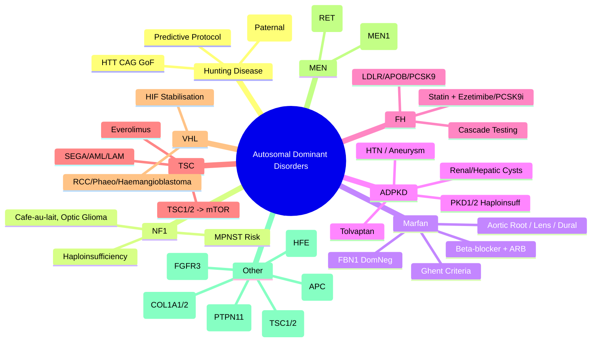

# 4.1 Autosomal Dominant Disorders


---

## 🎯 Learning Objectives
- [ ] Recognise **clinical features** of major AD disorders (NF1, Marfan, HD, ADPKD, FH, TSC, VHL, MEN)
- [ ] Explain **molecular mechanisms**: Haploinsufficiency, Dominant negative, Gain of function
- [ ] Apply **surveillance protocols** for major AD disorders
- [ ] Understand **genetic testing strategies** (Predictive, Confirmatory, Prenatal, PGT-M)
- [ ] Calculate **recurrence risks** (50%, de novo, mosaicism, incomplete penetrance)
- [ ] Answer viva: "Marfan vs Loeys-Dietz" and "HD predictive testing protocol"

---

## 🧠 Core Concept: Autosomal Dominant Disease Mechanisms

```mermaid
flowchart TD
    A[Autosomal Dominant Mechanism] --> B[Haploinsufficiency<br/>50% protein = insufficient]
    A --> C[Dominant Negative<br/>Mutant poisons WT multimer]
    A --> D[Gain of Function<br/>Toxic gain / Constitutive activation]
    A --> E[Toxic Protein Aggregation<br/>Misfolded protein]
    
    B --> F[Examples: TBX5, PAX6, ELN, PAH, NF1]
    C --> F2[Examples: COL1A1, TP53, FBN1]
    D --> F3[Examples: FGFR3, RET, HRAS, FGFR2]
    E --> F4[Examples: HTT (HD), ATXN1-3, ATXN7, TTR]
```

---

## 1️⃣ Neurofibromatosis Type 1 (NF1)

| Feature | Detail |
|---------|--------|
| **Gene** | **NF1** (7q11.2) — Neurofibromin (RAS GTPase activating protein) |
| **Incidence** | 1/2500-1/3000 |
| **Mechanism** | Haploinsufficiency (RAS hyperactivation) |
| **NIH Diagnostic Criteria (≥2 of 7)** | 1) ≥6 Café-au-lait macules (>5mm prepubertal, >15mm post) 2) ≥2 Neurofibromas or 1 plexiform 3) Axillary/inguinal freckling 4) Optic pathway glioma 5) ≥2 Lisch nodules 6) Osseous lesion (sphenoid dysplasia, tibial pseudoarthrosis) 6) 1st-degree relative with NF1 |
| **Major Complications** | Optic glioma (15%), MPNST (8-13%), Pheochromocytoma (1-5%), Scoliosis, Learning difficulties (50%), Hypertension (renal artery stenosis) |
| **Surveillance** | Annual clinical + Ophthalmology; MRI brain if symptomatic; BP annual; Scoliosis monitoring |
| **Genetic Testing** | NF1 sequencing + MLPA (95% detection); **De novo ~50%** |
| **Prenatal/PGT** | PGT-M available; Prenatal if familial variant known |

### Legius Syndrome (NF1-like)
| Feature | Detail |
|---------|--------|
| **Gene** | SPRED1 (15q13.2) — RAS pathway |
| **Phenotype** | Café-au-lait macules, Freckling, **No neurofibromas**, No Lisch nodules, No optic glioma, **No tumour risk** |
| **Differential** | NF1 vs Legius — SPRED1 testing if NF1 negative |

---

## 2️⃣ Marfan Syndrome (MFS)

| Feature | Detail |
|---------|--------|
| **Gene** | **FBN1** (15q21.1) — Fibrillin-1 (microfibril structural protein) |
| **Incidence** | 1/5000 |
| **Mechanism** | Dominant negative (mutant fibrillin disrupts microfibril assembly) + TGF-β dysregulation |
| **Ghent Nosology (2010) — Diagnostic Criteria** | **Major**: Aortic root Z≥2, Ectopia lentis, Dural ectasia, FBN1 mutation, Family history<br/>**Systemic Score** (≥7): Wrist/thumb sign, Pectus, Pes planus, Protrusio acetabuli, Scoliosis, Dural ectasia, Stretch marks, Myopia, Mitral valve prolapse, Aortic root dilation |
| **Diagnosis** | **Aortic root Z≥2 + Ectopia lentis** = Definitive MFS<br/>**FBN1 mutation + Aortic root Z≥2** = Definitive |
| **Major Complications** | **Aortic root aneurysm/dissection** (Type A), Mitral valve prolapse, Lens dislocation, Pneumothorax, Dural ectasia |
| **Management** | **Beta-blockers (Atenolol) + ARB (Losartan)** → Slows aortic growth; **Annual echo**; Elective aortic root replacement if ≥5cm (or Z≥3 in children); Avoid contact sports, Fluoroquinolones |
| **Surveillance** | Annual Echo (aortic root), Annual Ophthalmology, Skeletal monitoring, Dural ectasia MRI if symptomatic |
| **Genetic Testing** | FBN1 sequencing + MLPA (95% detection); **De novo ~25%** |

### Differential: Loeys-Dietz Syndrome (LDS)
| Syndrome | Gene | Key Features |
|----------|------|--------------|
| **LDS Type 1/2** | TGFBR1/2 | **Arterial aneurysms (widespread)**, Hypertelorism, Bifid uvula/Cleft palate, **Aneurysms at young age**, **Cervical spine instability** |
| **LDS Type 3** | SMAD3 | Aneurysms, Osteoarthritis, Skin striae |
| **LDS Type 4/5** | TGFB2, TGFB3 | Similar to LDS1/2 |
| **Key Differential** | LDS = **Widespread aneurysms, Hypertelorism, Bifid uvula, Cervical instability** | MFS = Ectopia lentis, Dural ectasia, FBN1 mutation |

---

## 3️⃣ Huntington Disease (HD)

| Feature | Detail |
|---------|--------|
| **Gene** | **HTT** (4p16.3) — CAG repeat in exon 1 |
| **Incidence** | 5-10/100,000 (Caucasian); rare in Asian/African |
| **Mechanism** | **Gain of function** — Polyglutamine expansion → Toxic protein aggregation, Transcriptional dysregulation |
| **CAG Repeat Ranges** | Normal: 10-26; Intermediate: 27-35 (reduced penetrance); **Full: ≥36** (36-39 = reduced penetrance; ≥40 = full penetrance) |
| **Anticipation** | **Paternal transmission** → Larger CAG expansions → Earlier onset, more severe |
| **Clinical Features** | **Chorea**, Cognitive decline, Psychiatric (depression, irritability, apathy), Weight loss, Dysarthria, Dysphagia; Onset 30-50y (juvenile if >60 CAG) |
| **Genetic Testing** | **Predictive Testing Protocol** (see below); Confirmatory if symptomatic |
| **Predictive Testing Protocol** | 1) Pre-test counselling (3 sessions: genetic, neurology, psychiatry) 2) Informed consent 3) In-person result disclosure (2 clinicians) 3) Post-test support |
| **Management** | Tetrabenazine/Deutetrabenazine (chorea), SSRIs (depression), Antipsychotics (psychosis), Speech/Swallowing therapy, Nutritional support |
| **Prenatal/PGT** | PGT-M (exclude affected embryos); Prenatal if parental allele known |

---

## 4️⃣ Autosomal Dominant Polycystic Kidney Disease (ADPKD)

| Feature | Detail |
|---------|--------|
| **Genes** | **PKD1 (85%)** (16p13.3), **PKD2 (15%)** (4q21) |
| **Incidence** | 1/400-1/1000 |
| **Mechanism** | Haploinsufficiency → Cilia dysfunction → Cystogenesis (cAMP ↑, mTOR ↑) |
| **Clinical Features** | Bilateral renal cysts, **Hypertension (80%)**, Hepatic cysts (80%), Intracranial aneurysms (10-15%), Mitral valve prolapse, Diverticulosis, Chronic pain |
| **Diagnosis** | **Ravine Criteria (Ultrasound)**: Age <30: ≥2 cysts; 30-59: ≥2 cysts each kidney; ≥60: ≥4 cysts each kidney |
| **Genotype-Phenotype** | **PKD1** → More severe, earlier ESRD (~58y); **PKD2** → Milder, later ESRD (~79y) |
| **Genetic Testing** | NGS panel (PKD1/PKD2) — Complex PKD1 (6 exons duplicated); MLPA for CNV; **Detection ~95%** |
| **Management** | **Tolvaptan** (V2 antagonist) → Slows cyst growth; **BP control** (<130/80); ACEi/ARB; Hydration; Avoid NSAIDs; **Aneurysm screening (MRA)** if family hx |
| **Surveillance** | Annual eGFR, BP, Liver US, MRI brain (if family hx aneurysm) |

### ADPKD vs ARPKD
| Feature | ADPKD | ARPKD |
|---------|-------|-------|
| **Gene** | PKD1/PKD2 | PKHD1 |
| **Onset** | Adult (30-50y) | Neonatal/Childhood |
| **Liver** | Cysts (80%) | Congenital hepatic fibrosis |
| **Prognosis** | ESRD 5th-6th decade | Early CKD, Portal hypertension |

---

## 5️⃣ Familial Hypercholesterolaemia (FH)

| Feature | Detail |
|---------|--------|
| **Genes** | **LDLR (85-90%)**, APOB (5-10%), PCSK9 (<1%), LDLRAP1 (AR) |
| **Incidence** | Heterozygous 1/250-1/300; Homozygous 1/300,000 |
| **Mechanism** | LDLR/APOB/PCSK9 → Impaired LDL clearance → **High LDL-C** |
| **Dutch Lipid Clinic Network (DLCN) Criteria** | Points: LDL-C levels, Personal/Family history of premature CVD, Tendon xanthomas, Arcus cornealis |
| **Clinical Features** | **Tendon xanthomas (Achilles)**, Xanthelasma, Corneal arcus, Premature CAD (<55M/<60F) |
| **Homozygous FH** | LDL-C >13 mmol/L, Planar xanthomas, Aortic stenosis, CHD in childhood |
| **Genetic Testing** | NGS panel (LDLR, APOB, PCSK9) + MLPA (CNV in LDLR) — **Pathogenic variant in ~80%** |
| **Cascade Testing** | **Index case → 1st-degree relatives** (50% risk each) — Identifies ~8 new cases per index |
| **Management** | **High-intensity statin** (Atorvastatin 80mg/Rosuvastatin 40mg) + **Ezetimibe**; **PCSK9 inhibitors** (Evolocumab, Alirocumab) if LDL-C > target; **Lipoprotein apheresis** (HoFH); Early statin in children (>8-10y) |
| **Surveillance** | Annual Lipid profile, CVD risk assessment, Echocardiogram (HoFH) |

---

## 6️⃣ Other High-Yield AD Disorders

### Neurofibromatosis Type 1 (NF1)
See [[2.1 Mendelian Inheritance]] for detailed table.

### Tuberous Sclerosis Complex (TSC)
| Feature | Detail |
|---------|--------|
| **Genes** | **TSC1 (9q34)** — Hamartin; **TSC2 (85%)** (16p13.3) — Tuberin |
| **Mechanism** | mTOR hyperactivation (loss of TSC1/2 inhibition of mTORC1) |
| **Diagnostic Criteria** | Major: Facial angiofibromas, Ungual fibromas, Hypomelanotic macules (≥3), Shagreen patch, Cortical tubers, SEN, Cardiac rhabdomyoma, LAM, AML.<br/>**Definite**: 2 Major or 1 Major + 2 Minor |
| **Complications** | Epilepsy (90%), Intellectual disability (50%), TAND (TSC-associated neuropsychiatric disorders), Renal AML, LAM (women), SEGA |
| **Treatment** | **mTOR inhibitors (Everolimus, Sirolimus)** for SEGA, AML, LAM; Vigabatrin for Infantile spasms |
| **Genetic Testing** | TSC1/TSC2 NGS + MLPA ~90% detection |

### Von Hippel-Lindau (VHL)
| Feature | Detail |
|---------|--------|
| **Gene** | **VHL** (3p25.3) — E3 ubiquitin ligase (HIF-α degradation) |
| **Mechanism** | Loss of VHL → HIF-α accumulation → VEGF/VEGFR ↑ → Angiogenesis |
| **Clinical Features** | **Clear cell RCC (40-70%)**, **Phaeochromocytoma (10-20%)**, Retinal/CNS haemangioblastomas, Pancreatic NETs/cysts, Endolymphatic sac tumours |
| **Surveillance** | Annual: Abdominal MRI (RCC), Plasma metanephrines (phaeo), Ophthalmology (retinal), Audiology (ELST) |
| **Genetic Testing** | VHL sequencing + MLPA (~95%) |

### Multiple Endocrine Neoplasia (MEN)
| Syndrome | Gene | Tumours |
|----------|------|---------|
| **MEN1** | MEN1 (11q13) — Menin | **3 Ps**: Parathyroid (>90%), Pancreatic NET (>50%), Pituitary (~30%) |
| **MEN2A** | RET (Cys634) | MTC (100%), Phaeo (50%), Hyperparathyroidism (20-30%) |
| **MEN2B** | RET (M918T) | MTC (100%), Phaeo (50%), Marfanoid habitus, Mucosal neuromas |
| **Familial MTC (FMTC)** | RET | MTC only (≥4 families) |

### Other High-Yield AD Disorders
| Disorder | Gene | Key Features |
|----------|------|--------------|
| **Achondroplasia** | FGFR3 (G380R) | Short limbs, Macrocephaly, Midface hypoplasia, **Foramen magnum stenosis** (infant mortality); 99% same mutation |
| **Hereditary Haemochromatosis** | HFE (C282Y/H63D) | Iron overload, Cirrhosis, Diabetes, Arthritis; Phlebotomy |
| **Familial Adenomatous Polyposis** | APC | 100s-1000s adenomas, Desmoids, CHRPE, Duodenal cancer; Colectomy |
| **Osteogenesis Imperfecta** | COL1A1/COL1A2 | Fragile bones, Blue sclerae, Deafness, DI |
| **Noonan Syndrome** | PTPN11, SOS1, RAF1, RIT1 | Short stature, Webb neck, PS, Hypertelorism, RASopathy |
| **Hereditary Spherocytosis** | ANK1, SPTB, SLC4A1, EPB42 | Haemolytic anaemia, Splenomegaly, Cholelithiasis |
| **Porphyrias** (Acute intermittent, VP, HCP) | HMBS, PPOX, CPOX | Neurovisceral attacks, Photosensitivity (VP/HCP), Urine porphyrins |

---

## ⚡ FCPS/MRCP High-Yield Summary

| Disorder | Gene | Mechanism | Key Features | Surveillance |
|----------|------|-----------|--------------|--------------|
| **HD** | HTT (CAG) | Gain of function | Chorea, Cognitive, Psychiatric | Predictive testing protocol |
| **NF1** | NF1 | Haploinsufficiency | Café-au-lait, Neurofibromas, Optic glioma, MPNST | Annual clinical, Ophthalmology, BP |
| **Marfan** | FBN1 | Dominant neg + TGF-β | Aortic root, Lens, Dural ectasia | Annual Echo, Ophthalmology |
| **ADPKD** | PKD1/2 | Haploinsufficiency | Renal/hepatic cysts, HTN, Aneurysm | Annual eGFR, BP, MRI brain |
| **FH** | LDLR/APOB/PCSK9 | LDL clearance defect | LDL-C ↑, Tendon xanthomas, CAD | Statin + Ezetimibe, Cascade testing |
| **TSC** | TSC1/2 | mTOR ↑ | Tubers, SEGA, AML, LAM, Facial angiofibromas | Everolimus for SEGA/AML/LAM |
| **VHL** | VHL | HIF stabilisation | RCC, Phaeo, Haemangioblastoma | Annual MRI, Metanephrines, Ophthalmology |
| **MEN1** | MEN1 | Tumour suppressor | 3 Ps (Parathyroid, Pancreas, Pituitary) | Annual Ca, PTH, MRI pituitary, CT pancreas |
| **MEN2A/2B** | RET | Gain of function | MTC, Phaeo, (HPT/Marfanoid) | Prophylactic thyroidectomy (RET mut) |

---

## 🎤 Viva Questions (Expected Answers)

| # | Question | Expected Answer |
|---|----------|-----------------|
| 1 | Marfan vs Loeys-Dietz — key differences? | **MFS**: FBN1, Ectopia lentis, Dural ectasia, Aortic root aneurysm. **LDS**: TGFBR1/2, **Widespread aneurysms**, Hypertelorism, Bifid uvula, **Cervical spine instability**, No ectopia lentis. |
| 2 | HD predictive testing protocol? | 3 pre-test counselling sessions (genetics, neurology, psychiatry) → Informed consent → In-person result disclosure by 2 clinicians → Post-test support. No testing <18y. |
| 3 | Marfan syndrome — aortic root surveillance? | **Annual echocardiogram** (aortic root Z-score); **Beta-blocker + ARB**; Elective surgery if aortic root ≥5cm (adult) or Z≥3 (child). |
| 4 | FH — cascade testing yield? | **1 index case identifies ~8 new cases** in 1st-degree relatives (50% risk each). |
| 5 | ADPKD — PKD1 vs PKD2 phenotype? | **PKD1**: Severe, ESRD ~58y. **PKD2**: Milder, ESRD ~79y. PKD1 = 85% of cases. |
| 6 | FH — LDL-C target on statin? | **>50% reduction** from baseline; **LDL-C <1.8 mmol/L** (or <1.4 mmol/L very high risk). |
| 7 | TSC — treatment for SEGA/AML/LAM? | **mTOR inhibitors (Everolimus, Sirolimus)** — Shrink lesions. |
| 8 | VHL — screening protocol? | **Annual**: Abdominal MRI (RCC), Plasma metanephrines (phaeo), Ophthalmology (retinal haemangioblastoma), Audiology (ELST). |
| 8 | ADPKD — Tolvaptan indication? | **Rapidly progressing ADPKD** (eGFR 25-65, TKV >750ml age <40, or eGFR decline >5ml/min/yr); **Slows cyst growth**. |
| 10 | Achondroplasia — foramen magnum stenosis management? | **Monitor for cord compression** (sleep study, MRI); **Suboccipital decompression** if symptomatic; Avoid neck manipulation. |

---

## 🧩 Confusions & Mnemonics

| Confusion | Clarification |
|-----------|---------------|
| **"Marfan = Aortic dissection only"** | **NO.** Multi-system: Lens dislocation, Dural ectasia, Skeletal, Pulmonary, Skin. |
| **"LDS = Marfan variant"** | **NO.** Different genes (TGFBR1/2 vs FBN1), **LDS = widespread aneurysms, hypertelorism, bifid uvula, cervical instability**. |
| **"HD = always 50% risk to children"** | **True if parent affected**, but **predictive testing protocol** mandatory before testing at-risk adults. |
| **"ADPKD = only renal"** | **NO.** Hepatic cysts (80%), Intracranial aneurysms (10-15%), Mitral valve prolapse, Diverticulosis. |
| **"FH = only cholesterol"** | **NO.** Premature CAD, Tendon xanthomas, Corneal arcus, Aortic stenosis (HoFH). |
| **"TSC = only skin findings"** | **NO.** Major: Tubers, SEGA, AML, LAM, Cardiac rhabdomyoma, Cardiac rhabdomyoma, Facial angiofibromas. |
| **"VHL = only RCC"** | **NO.** Phaeochromocytoma, Haemangioblastomas (retina/CNS), Pancreatic NETs, Endolymphatic sac tumours. |
| **"All AD = 50% risk"** | **NO.** Incomplete penetrance (BRCA1 70%), Mosaicism, Germline mosaicism, De novo mutations. |
| **"TSC = only skin/brain"** | **NO.** Renal AML, LAM (women), Cardiac rhabdomyoma, Renal cysts, Facial angiofibromas, Shagreen patch. |
| **"VHL = only renal"** | **NO.** Phaeochromocytoma, CNS/Retinal haemangioblastomas, Pancreatic NETs, Endolymphatic sac tumours. |

> **Mnemonic: AD DISORDERS HIGH YIELD**  
> **A**DPKD: **PKD1 (85%)/PKD2** — Cysts, HTN, Aneurysm, Tolvaptan  
> **D**ominant: **HD (CAG, Gain of Func), NF1 (Haplo), Marfan (DomNeg FBN1)**  
> **D**isorders Key: **HD, NF1, Marfan, ADPKD, FH, TSC, VHL, MEN**  
> **H**untington: **CAG Gain-of-Func, Anticipation (Paternal), Predictive Protocol**  
> **N**F1: **Haploinsufficiency, Café-au-lait, Optic Glioma, MPNST**  
> **I**nheritance: **AD = 50% risk, Vertical, M→M**  
> **R**ecurrence: **50% (AD), 25% (AR), 50% sons (XLR)**  
> **E**pistasis/Mechanisms: **Haploinsufficiency / Dominant Neg / Gain-of-Func**  
> **D**ifferential: **Marfan vs Loeys-Dietz (TGFBR, Hypertelorism, Bifid uvula)**  
> **I**mportant: **FH (Cascade testing yields 8x), ADPKD (Tolvaptan), TSC (mTORi)**  
> **O**ther High Yield: **VHL (RCC/Phaeo), MEN1/2A/2B (RET), TSC (TSC1/2, mTORi)**  
> **R**esearch: **Tolvaptan (ADPKD), Everolimus (TSC), Evolocumab (FH), PARPi (BRCA)**  
> **S**urveillance: **HD (Predictive Protocol), NF1 (Annual), Marfan (Echo), ADPKD (eGFR/BP/MRI), FH (Cascade), VHL (Annual MRI)**  
> **D**rug Therapy: **Tolvaptan (ADPKD), Everolimus (TSC), Statins+Ezetimibe/PCSK9i (FH), PARPi (BRCA)**  
> **P**redictive Testing: **HD Protocol (3 sessions, 2 clinicians, no <18y)**  
> **C**ascade Testing: **FH (8 new cases/index), BRCA (50% sib risk), Lynch (MMR IHC)**  
> **M**echanisms: **HI (NF1, TBX5), DomNeg (FBN1, COL1A1, TP53), GoF (FGFR3, RET, HRAS)**  
> **E**xpressivity: **Variable (NF1, Marfan) vs Penetrance (BRCA, RB1)**  
> **R**etinal: **VHL (Haemangioblastoma), TSC (Hamartoma), NF1 (Optic glioma)**  
> **D**e Novo: **AD most common** (Achondroplasia, NF1, Marfan, Apert)  
> **M**osaicism: **Gonadal (Recurrence 1-5%) vs Somatic (Segmental)**  
> **O**ptimal Surveillance: **Annual Echo (Marfan/ADPKD/VHL), Annual MRI (VHL/TSC), Annual Echo+BP (ADPKD)**  
> **E**lite: **FH Cascade = 8 new cases; NF1 Annual; Marfan Annual Echo; ADPKD Tolvaptan**  
> **R**ET: **MEN2A (Cys634), MEN2B (M918T), FMTC**  
> **S**yndromes: **TSC (mTORi), VHL (HIF→VEGF), MEN (3 Ps / RET), FH (Cascade)**  

---

## 🗺️ Mind Map



---

## 📅 Spaced Repetition Tracker

| Review | Date | Score (0–5) | Notes |
|--------|------|-------------|-------|
| Day 1 | | | |
| Day 3 | | | |
| Day 7 | | | |
| Day 14 | | | |
| Day 30 | | | |
| Day 90 | | | |

---

## 📝 Self-Test Scorecard

| Section | Max | Score | % |
|---------|-----|-------|---|
| HD (Mechanism, Testing, Anticipation) | 3 | | |
| NF1 (Diagnosis, Complications) | 2 | | |
| Marfan (Ghent, Surveillance, Diff Dx) | 3 | | |
| ADPKD (PKD1/2, Tolvaptan, Surveillance) | 3 | | |
| FH (Cascade, Statins, PCSK9i) | 3 | | |
| TSC (mTOR, Everolimus) | 2 | | |
| VHL (Surveillance) | 2 | | |
| MEN (MEN1/2A/2B) | 2 | | |
| Other High-Yield (Achondro, FH, FAP, OI) | 2 | | |
| **Total** | **20** | | |

---

## 💬 Exam Answer Modes

| Format | Prompt | Key Points |
|--------|--------|------------|
| **Long Essay** | "Describe the molecular pathogenesis, clinical features, and surveillance of Marfan syndrome." | FBN1, Dominant negative + TGF-β, Ghent criteria, Aortic root/ECT/Lens/Dural, Annual Echo/Ophtho, Beta-blocker+ARB, Surgery at 5cm. |
| **Short Note** | "HD predictive testing protocol." | 3 pre-test sessions (genetics, neuro, psych), Informed consent, In-person disclosure by 2 clinicians, No testing <18y, Post-test support. |
| **Viva** | "Patient with ADPKD, eGFR 45, TKV 900ml. Candidate for tolvaptan?" | **Yes** — Rapidly progressing (TKV >750ml age <40, or eGFR decline >5ml/min/yr). Monitor LFTs, Aquaresis. |
| **Ward Round** | "Patient with FH on maximal statin + ezetimibe, LDL-C still 4.5. Next step?" | **Add PCSK9 inhibitor** (Evolocumab/Alirocumab) — NICE TA393/394 criteria: LDL-C >4.0 on max tolerated therapy. |
| **Last-Night** | "HD: CAG GoF, Anticipation Pat, Protocol. NF1: Haplo, Cafe-au-lait, Optic glioma. Marfan: FBN1 DomNeg, Ghent, Echo/Ophtho. ADPKD: PKD1/2, Tolvaptan. FH: Cascade 8x, Statins/PCSK9i. TSC: mTORi. VHL: HIF, Surveillance. MEN: 3Ps/RET. Mech: HI/DomNeg/GoF. Cascade FH 8x. Diff: Marfan vs LDS (TGFBR, Hypertelorism, Bifid uvula)." | Compressed. |

---

## 📌 Summary
- **HD**: HTT CAG repeat → **Gain of function**, Anticipation (paternal), **Predictive testing protocol** (3 sessions, 2 clinicians, no testing <18y).
- **NF1**: NF1 haploinsufficiency → RAS hyperactivation. Café-au-lait, neurofibromas, optic glioma, MPNST. Annual surveillance.
- **Marfan**: FBN1 **dominant negative** + TGF-β dysregulation. Ghent criteria. **Aortic root, lens dislocation, dural ectasia**. Annual echo + ophthalmology. Beta-blocker + ARB.
- **ADPKD**: PKD1 (85%) / PKD2 haploinsufficiency. Renal/hepatic cysts, HTN, aneurysms. **Tolvaptan** for rapid progression. Annual eGFR, BP, MRI brain (if aneurysm hx).
- **FH**: LDLR/APOB/PCSK9 → LDL clearance defect. **Cascade testing** (yields ~8 new cases/index). High-intensity statin + ezetimibe ± PCSK9i.
- **TSC**: TSC1/2 → mTOR hyperactivation. SEGA, AML, LAM, facial angiofibromas, tubers. **Everolimus** for SEGA/AML/LAM.
- **VHL**: VHL mutation → HIF stabilisation → RCC, phaeochromocytoma, haemangioblastomas. Annual surveillance.
- **MEN**: MEN1 (3 Ps: Parathyroid, Pancreas, Pituitary); MEN2A/2B (RET); FMTC.
- **Mechanisms**: **Haploinsufficiency** (NF1, TBX5), **Dominant Negative** (FBN1, COL1A1, TP53), **Gain of Function** (FGFR3, RET, HRAS).
- **Surveillance**: HD (protocol), NF1 (annual), Marfan (annual echo/ophtho), ADPKD (eGFR/BP/MRI), FH (cascade), VHL (annual MRI), TSC (mTORi), ADPKD (tolvaptan).

---

## ❓ MCQs (10)

1. **Huntington disease — anticipation bias:**  
   A. Maternal > Paternal  B. **Paternal > Maternal**  C. Equal  D. Neither  
   *Answer: B. Paternal transmission → Larger CAG expansions → Earlier onset.*

2. **Marfan syndrome — aortic root surgery threshold (adult):**  
   A. 4.0 cm  B. **5.0 cm**  C. 5.5 cm  D. 6.0 cm  
   *Answer: B. Elective root replacement at ≥5.0 cm (or Z≥3 in children).*

3. **Familial Hypercholesterolaemia — cascade testing identifies how many new cases per index?**  
   A. 2  B. 4  C. **~8**  D. 16  
   *Answer: C. Cascade testing of 1st-degree relatives (50% risk) typically identifies ~8 new cases per index.*

3. **ADPKD — Tolvaptan indication:**  
   A. All ADPKD patients  B. **Rapidly progressing (TKV >750ml age <40 or eGFR decline >5ml/min/yr)**  C. Only ESRD  D. Only PKD1  
   *Answer: B. Rapid progression criteria: TKV >750ml age <40, or eGFR decline >5ml/min/yr, or age <40 with high PRO-PKD score.*

4. **FH Cascade testing — new cases identified per index case:**  
   A. 2  B. 4  C. **~8**  D. 16  
   *Answer: C. First-degree relatives 50% risk → typically identifies ~8 new cases per index case.*

4. **TSC — first-line treatment for SEGA/AML/LAM:**  
   A. Surgery  B. **Everolimus/Sirolimus (mTOR inhibitors)**  C. Chemotherapy  D. Radiation  
   *Answer: B. mTOR inhibitors (Everolimus, Sirolimus) shrink SEGA, AML, LAM.*

4. **VHL surveillance — which is NOT included?**  
   A. Annual abdominal MRI  B. Annual plasma metanephrines  C. **Annual colonoscopy**  D. Annual ophthalmology  
   *Answer: C. Annual: MRI abdomen (RCC), Plasma metanephrines (phaeo), Ophthalmology (retinal), Audiology (ELST). Colonoscopy not standard.*

8. **ADPKD — PKD1 vs PKD2 clinical difference:**  
   A. PKD1 milder  B. **PKD1 more severe, earlier ESRD**  C. No difference  D. PKD2 more cysts  
   *Answer: B. PKD1 (85%): ESRD ~58y; PKD2 (15%): ESRD ~79y.*

9. **FH — LDL-C target on maximal therapy:**  
   A. <2.5 mmol/L  B. **<1.8 mmol/L** (or <1.4 very high risk)  C. <3.0 mmol/L  D. <4.0 mmol/L  
   *Answer: B. LDL-C <1.8 mmol/L (or >50% reduction); Very high risk: <1.4 mmol/L.*

10. **TSC — gene and pathway?**  
    A. TSC1, mTOR  B. **TSC1/TSC2, mTOR (loss of inhibition)**  C. TSC2, PI3K  D. TSC1, RAS  
    *Answer: B. TSC1 (hamartin) and TSC2 (tuberin) form complex inhibiting mTORC1.*

---

## 📋 SBAs (10)

1. **35M with Marfan syndrome, aortic root 4.8cm on echo. On bisoprolol. Next step?**  
   A. Increase bisoprolol  B. **Add losartan (ARB)**  C. Refer for surgery  D. Repeat echo in 6 months  
   *Answer: B. Add ARB (losartan) per evidence; Surgery at ≥5cm (or Z≥3 child). Continue beta-blocker.*

2. **25M with ADPKD (PKD1), eGFR 55, TKV 850ml. Eligible for tolvaptan?**  
   A. No (eGFR >45)  B. **Yes (TKV >750ml age <40)**  C. Only if eGFR <45  D. Only if PKD2  
   *Answer: B. Tolvaptan criteria: TKV >750ml age <40 OR eGFR decline >5ml/min/yr.*

3. **FH patient on atorvastatin 80mg + ezetimibe 10mg, LDL-C 4.2. Next step?**  
   A. Increase statin  B. **Add PCSK9 inhibitor (Evolocumab)**  C. Lipoprotein apheresis  D. Add fibrate  
   *Answer: B. LDL-C >4.0 on max tolerated therapy → PCSK9 inhibitor per NICE TA393/394.*

4. **30F with VHL (confirmed mutation). Annual surveillance — which is NOT routine?**  
   A. Abdominal MRI  B. Plasma metanephrines  C. **Colonoscopy**  D. Ophthalmology  
   *Answer: C. VHL surveillance: MRI abdomen (RCC), Metanephrines (phaeo), Ophthalmology (retinal), Audiology (ELST).*

5. **PROPHYLACTIC thyroidectomy indicated in which RET mutation?**  
   A. MEN2A (Cys634)  B. **MEN2B (M918T)**  C. FMTC  D. MEN2A high risk only  
   *Answer: B. MEN2B (M918T) → Prophylactic thyroidectomy in infancy (<1y). MEN2A: by age 5.*

---

## 🔑 Answer Keys
| MCQs | SBAs |
|------|------|
| 1-B, 2-B, 3-B, 4-B, 5-B, 6-B, 7-B, 8-B, 9-B, 10-B | 1-B, 2-B, 3-B, 4-B, 5-B |

---

## 🔗 Cross-Links
- [[2.1 Mendelian Inheritance]] — AD inheritance patterns, mechanisms, recurrence risks
- [[1. Fundamentals of Medical Genetics]] — Mutation types, Haploinsufficiency, Dominant negative
- [[3. Chromosomal Disorders]] — Chromosomal basis of some AD disorders
- [[5.5 Genetic Counselling]] — Predictive testing (HD), Cascade testing (FH), Prenatal/PGT
- [[6.1 Hereditary Cancer Syndromes]] — Overlap with cancer predisposition (VHL, MEN, TSC, NF1)
- [[7. Pharmacogenetics]] — Drug response in AD disorders (e.g., FH statin response)
- [[5.5 Genetic Counselling]] — Predictive testing protocol (HD), Cascade testing (FH)
- [[5.4 Prenatal & Preimplantation Testing]] — PGT-M for AD disorders
- [[9. ELSI]] — Predictive testing ethics, Cascade testing consent, Genetic discrimination

---

**Last Updated:** 2026-06-14  
**Next:** Build `4.2 Autosomal Recessive Disorders.md`, `4.3 X-Linked Disorders.md`