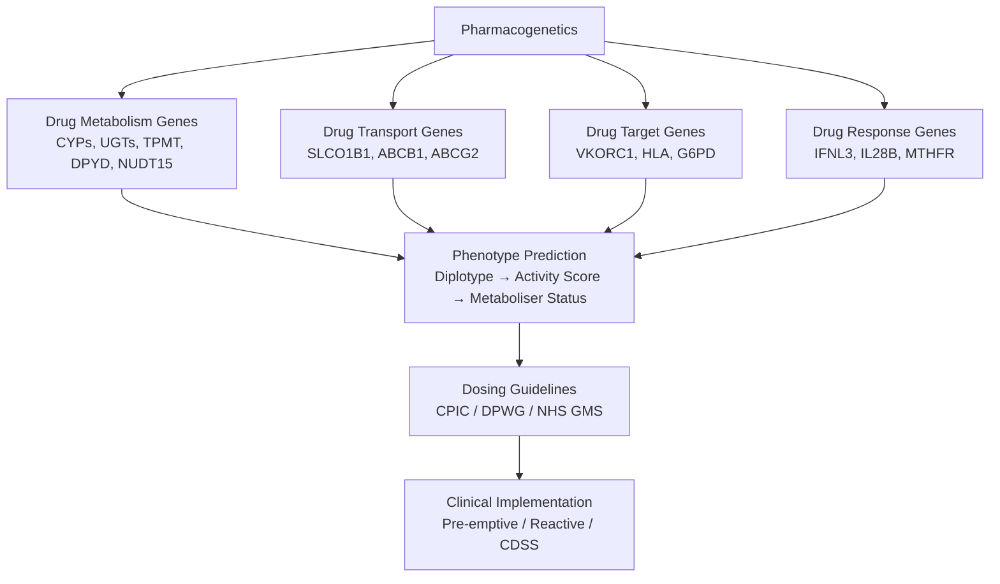

**Parent Topic:** [Clinical Genetics MOC](../Clinical%20Genetics%20MOC.md) → [Chapter 3 Hierarchy](../Davidson%20Chapter%203%20-%20Clinical%20Genetics%20Hierarchy.md)  
**Status:** `full-fcps-mrcp-note`  
**Priority:** ⭐⭐⭐ HIGHEST (FCPS/MRCP — Drug-gene pairs, Dosing guidelines, CPIC/DPWG, NHS GMS implementation)  
**Source:** Davidson 24th Ed Ch 3; CPIC/DPWG guidelines; NHS England Genomic Medicine Service; FCPS/MRCP syllabus; PharmGKB; ClinGen

---

## 1. 1. 🎯 Learning Objectives
- [ ] Identify **key drug-gene pairs** (CYP2D6, CYP2C19, CYP2C9, TPMT, DPYD, HLA, UGT1A1, NUDT15, G6PD, SLCO1B1)
- [ ] Apply **CPIC/DPWG dosing guidelines** for high-evidence drug-gene pairs
- [ ] Interpret **pharmacogenomic test results** (Phenotype prediction, Diplotype → Activity Score)
- [ ] Understand **NHS England Genomic Medicine Service** commissioned tests
- [ ] Apply **pre-emptive vs reactive** testing strategies
- [ ] Answer viva: "CYP2C19 clopidogrel" and "TPMT azathioprine" and "HLA-B*57:01 abacavir"

---

## 2. 2. 🧠 Core Concept: Pharmacogenetics



---

## 3. 3. ️⃣ Core Pharmacogenes — Drug-Gene Pairs

### 1. Cytochrome P450 (CYP) Enzymes

| Gene | Substrates (Key Drugs) | Phenotypes | Key Dosing Guidance |
|------|------------------------|------------|---------------------|
| **CYP2D6** | Codeine, Tramadol, Tamoxifen, Antidepressants (SSRIs, TCAs), Beta-blockers (Metoprolol), Atomoxetine, Ondansetron | **UM** (>2 copies), **NM** (1-2), **IM** (1 reduced), **PM** (0 active) | **Codeine/Tramadol**: PM = No analgesia; UM = Toxicity (Morphine) → Avoid; **Tamoxifen**: PM/IM → Consider AI switch |
| **CYP2C19** | Clopidogrel, PPIs (Omeprazole), SSRIs (Citalopram), Voriconazole, Phenytoin | **UM** (2x *17), **NM**, **IM**, **PM** | **Clopidogrel**: PM/IM → Reduced active metabolite → **Alternative (Prasugrel/Ticagrelor)**; **PPIs**: PM → ↑ Exposure → Dose reduce |
| **CYP2C9** | Warfarin, Phenytoin, NSAIDs (Ibuprofen), Sulfonylureas, Losartan | **NM**, **IM**, **PM** | **Warfarin**: IM/PM → ↓ Dose (Algorithm); **Phenytoin**: PM → ↓ Dose (Therapeutic window narrow) |
| **CYP3A4/5** | Statins (Simva, Atorva), Tacrolimus, Cyclosporine, Midazolam, Chemo (Docetaxel), DOACs | **CYP3A5 Expressor (NM)** vs **Non-expressor (PM)** | **Tacrolimus**: CYP3A5 Expressor → Higher dose needed; CYP3A5*3/*3 → Standard dose |
| **CYP1A2** | Clozapine, Olanzapine, Theophylline, Caffeine, Tizanidine | **Inducible** (Smoking, Cruciferous veg), **Inhibitable** (Fluvoxamine, Ciprofloxacin) | **Smoking**: ↑ Clearance → Higher dose; **Fluvoxamine** → Strong inhibitor → Avoid/Reduce |

### 2. Non-CYP Metabolism Genes

| Gene | Substrates | Key Variants | Dosing Guidance |
|------|------------|--------------|-----------------|
| **TPMT** | Azathioprine, 6-MP, 6-TG | *2, *3A, *3C (LoF) | **PM (0% activity)**: **Avoid** (Severe myelosuppression); **IM (30-60%)**: ↓ Dose 30-70%; **NM**: Standard |
| **NUDT15** | 6-MP, Azathioprine | *2, *3 (LoF) | Asian populations; **PM**: ↓ Dose 90% (Severe leucopenia risk); **IM**: ↓ Dose 50% |
| **DPYD** | 5-FU, Capecitabine | *2A, *13, *28 (LoF) | **PM (biallelic)**: **Avoid** (Fatal toxicity); **IM (heterozygous)**: ↓ Dose 50%; **CPIC**: Pre-emptive testing recommended |
| **UGT1A1** | Irinotecan, Atazanavir, Bilirubin | *28 (TA7TAA) | **Homozygous *28/*28**: ↓ Irinotecan dose (Neutropenia risk); Heterozygous: Consider ↓ dose |
| **G6PD** | Primaquine, Dapsone, Sulfonamides, Rasburicase | Mediterranean C563T, African A- | **Deficiency**: Avoid oxidative drugs; Screen before primaquine/rasburicase |
| **HLA-B*15:02** | Carbamazepine, Phenytoin, Oxcarbazepine, Lamotrigine | *15:02 | **Screen in at-risk populations** (Han Chinese, Thai, Malaysian) → **Avoid carbamazepine** if positive |
| **HLA-B*57:01** | Abacavir | *57:01 | **Screen before abacavir** → **Contraindicated if positive** (Hypersensitivity) |
| **HLA-B*58:01** | Allopurinol | *58:01 | Screen in at-risk (Han Chinese, Korean, Thai) → **Avoid allopurinol** if positive |
| **VKORC1** | Warfarin | -1639G>A, 1173C>T | Dose algorithm (CYP2C9 + VKORC1 + Clinical factors) |
| **SLCO1B1** | Statins (Simvastatin > Atorva > Rosuva), Methotrexate | *5 (rs4149056) | **TT (PM)**: Avoid Simvastatin 80mg; ↓ Dose or Switch to Rosuvastatin/Pravastatin |
| **IFNL3 (IL28B)** | PegIFN-α + RBV (HCV) | rs12979860 (CC/CT/TT) | CC = Better SVR; Guides treatment duration (Historical, DAAs now standard) |

---

## 4. 4. ️⃣ Phenotype Prediction — From Genotype to Phenotype

### 1. CYP2D6 Activity Score (AS) System
| Diplotype | Activity Score | Phenotype |
|-----------|----------------|-----------|
| *1/*1, *1/*2, *2/*2 | 2.0 | **Normal Metaboliser (NM)** |
| *1/*4, *1/*5, *2/*4 | 1.0 | **Intermediate Metaboliser (IM)** |
| *4/*4, *5/*5 | 0 | **Poor Metaboliser (PM)** |
| *1/*1xN, *2/*2xN | >2.0 | **Ultrarapid Metaboliser (UM)** |

> **Alleles:** *1 = Normal; *2 = Reduced; *3, *4, *5, *6 = Non-functional; *10 = Decreased; *17, *29, *41 = Decreased; xN = Gene duplication.

### 2. TPMT/NUDT15 Phenotype Assignment
| Gene | Genotype | Phenotype | Frequency (EU) | Frequency (East Asian) |
|------|----------|-----------|----------------|------------------------|
| **TPMT** | *1/*1 | Normal | ~89% | ~99% |
| | *1/*3A, *1/*3C | Intermediate | ~11% | ~1% |
| | *3A/*3A, *3C/*3C | Poor | ~0.3% | Rare |
| **NUDT15** | *1/*1 | Normal | Rare | ~70% |
| | *1/*3 | Intermediate | Rare | ~25% |
| | *3/*3 | Poor | Rare | ~5% |

### 3. DPYD Phenotype
| Genotype | Phenotype | 5-FU Dosing (CPIC) |
|----------|-----------|---------------------|
| Normal (*1/*1) | Normal | 100% |
| Heterozygous *2A/*1 | Intermediate | **50% dose reduction** |
| Homozygous *2A/*2A | Poor | **Avoid 5-FU/capecitabine** (Alternative: S-1, Oxaliplatin-based) |

---

## 5. 5. ️⃣ CPIC / DPWG / NHS GMS Guidelines

### 1. CPIC (Clinical Pharmacogenetics Implementation Consortium) — Levels
| Level | Evidence | Action |
|-------|----------|--------|
| **A** | Strong (RCTs, Meta-analyses) | **Prescribe per genotype** |
| **B** | Moderate (Observational, PK studies) | **Consider per genotype** |
| **C** | Weak (Case reports, Expert opinion) | **No recommendation** |
| **D** | Insufficient | No guideline |

### 2. Key CPIC Level A Guidelines (2024)
| Drug-Gene Pair | Level | Key Recommendation |
|----------------|-------|---------------------|
| **Clopidogrel / CYP2C19** | A | PM/IM → **Alternative (Prasugrel/Ticagrelor)** |
| **Azathioprine/6-MP / TPMT** | A | PM: **Avoid**; IM: ↓ 30-70% dose; Test before starting |
| **Azathioprine/6-MP / NUDT15** | A | PM: **Avoid**; IM: 50% dose; Test in East Asian |
| **5-FU/Capecitabine / DPYD** | A | PM: **Avoid**; IM: 50% dose; **Pre-emptive testing** |
| **Irinotecan / UGT1A1** | A | *28/*28 → ↓ Dose |
| **Codeine/Tramadol / CYP2D6** | A | PM: No analgesia; UM: Toxicity → **Avoid** |
| **SSRIs (Citalopram/Escitalopram) / CYP2C19** | A | PM → ↓ Dose (QTc risk) |
| **Carbamazepine / HLA-B*15:02** | A | Screen at-risk populations → **Avoid if positive** |
| **Abacavir / HLA-B*57:01** | A | **Screen all** → **Contraindicated if positive** |
| **Allopurinol / HLA-B*58:01** | A | Screen at-risk → **Avoid if positive** |

### 3. DPWG (Dutch Pharmacogenetics Working Group) — Notable Differences
| Drug-Gene | DPWG vs CPIC |
|-----------|--------------|
| **CYP2D6 / Tamoxifen** | DPWG: PM/IM → Switch to AI; CPIC: Optional (Level B) |
| **CYP2C19 / Clopidogrel** | Similar (PM/IM → Alternative) |
| **DPYD / 5-FU** | DPWG: Test all; CPIC: Test all (Level A) |

### 4. NHS England Genomic Medicine Service (GMS) — Commissioned Tests (2024/25)
| Test | Indication | Turnaround |
|------|------------|------------|
| **DPYD** (DPYD*2A, *13, *28, *29) | All patients before 5-FU/capecitabine | 3-5 days |
| **TPMT** | Before azathioprine/6-MP | 3-5 days |
| **CYP2C19** | Before clopidogrel (ACS/PCI) | 3-5 days |
| **CYP2D6** | Before codeine/tramadol/tamoxifen | 5-10 days |
| **HLA-B*57:01** | Before abacavir | 3-5 days |
| **HLA-B*57:01** | Before allopurinol (at-risk populations) | 5-10 days |
| **HLA-B*15:02** | Before carbamazepine (at-risk) | 5-10 days |
| **NUDT15** | Before azathioprine/6-MP (East Asian) | 5-10 days |

---

## 6. 6. ️⃣ Implementation Strategies

### 1. Pre-emptive vs Reactive Testing

| Strategy | Description | Pros | Cons |
|----------|-------------|------|------|
| **Pre-emptive** | Panel testing (PGx panel) before drug needed; Results stored in EHR | **Available at prescribing**; Avoids delays; Cost-effective long-term | Upfront cost; Variant re-classification; Data management |
| **Reactive** | Test ordered when drug prescribed | Lower upfront cost; Targeted | **Delay** (3-10 days); Missed opportunities; Repeated testing |

### 2. Clinical Decision Support (CDSS) Integration
| Component | Implementation |
|-----------|----------------|
| **EHR Integration** | PGx results in structured data → Real-time alerts at prescribing |
| **Alert Types** | Hard stop (DPYD PM → Avoid 5-FU), Soft alert (CYP2C19 IM → Consider alternative) |
| **Knowledge Base** | CPIC/DPWG guidelines integrated; Updated quarterly |
| **Patient Portal** | Access to own PGx results; Medication safety card |

### 3. Clinical Workflow Example: Clopidogrel + CYP2C19
```mermaid
flowchart TD
    A[Patient with ACS/PCI] --> B[CYP2C19 Genotype Available?]
    B -->|Yes| C[Check Phenotype]
    B -->|No| D[Order CYP2C19 Test (Rapid if urgent)]
    C --> E{Phenotype}
    E -->|PM/IM| F[Prescribe Alternative
Prasugrel / Ticagrelor]
    E -->|NM/UM| G[Standard Clopidogrel]
    D --> H[Result in 24-48h]
    H --> E
```

---

## 7. 7. ️⃣ Drug-Specific Clinical Scenarios

### 1. Clopidogrel + CYP2C19
| Scenario | Action |
|----------|--------|
| **ACS/PCI, CYP2C19 PM/IM** | **Switch to Prasugrel (if no stroke hx) or Ticagrelor**; Do not increase clopidogrel dose |
| **CYP2C19 UM** | Standard clopidogrel (May have ↑ bleeding risk) |
| **CYP2C19 Unknown** | **Test if time permits**; If urgent PCI → Use Prasugrel/Ticagrelor empirically |

### 2. Azathioprine/6-MP + TPMT/NUDT15
| Scenario | Action |
|----------|--------|
| **TPMT PM** | **Avoid azathioprine/6-MP** (Severe myelosuppression); Alternative: Mycophenolate, Tacrolimus |
| **TPMT IM** | ↓ Dose 30-70% (Start 50%); Monitor CBC weekly × 4w, then monthly |
| **NUDT15 PM (East Asian)** | **Avoid** or ↓ 90% dose; High myelosuppression risk |
| **NUDT15 IM** | ↓ Dose 50% |

### 3. Clopidogrel + PPI (CYP2C19)
| Interaction | Management |
|-------------|------------|
| **Omeprazole/Esomeprazole** | Strong CYP2C19 inhibitor → ↑ Clopidogrel non-response risk |
| **Management** | Use **Pantoprazole** (Weak CYP2C19 inhibition) or **H2 blocker** (Famotidine) |

### 4. Warfarin + CYP2C9 + VKORC1
| Genotype | Dose Adjustment (Approx) |
|----------|--------------------------|
| CYP2C9 *1/*1 + VKORC1 GG | Standard (5mg) |
| CYP2C9 *2/*3 + VKORC1 AA | ↓ 30-50% (2-3mg) |
| Algorithm | **IWPC Algorithm** (CYP2C9 + VKORC1 + Age + Weight + Amiodarone + Enzyme inducers) |

---

## 8. 8. ️⃣ Implementation Challenges & Ethics

### 1. Challenges
| Challenge | Mitigation |
|-----------|------------|
| **Variant Re-classification** | VUS → P/LP over time; Re-contact policy; Regular re-analysis |
| **Ancestry Bias** | PGx databases Eurocentric; Validate in diverse populations; Use ancestry-informative markers |
| **Cost-Effectiveness** | Pre-emptive panels cost-effective long-term; Single-gene reactive costly per test |
| **EHR Integration** | Standardised data formats (VCF, HL7 FHIR); CDS hooks; Patient-facing apps |
| **Education** | Clinician training (CME, PharmGKB, CPIC); Patient education materials |

### 2. Ethical Issues
| Issue | Guidance |
|-------|----------|
| **Incidental Findings** | ACMG SF v3.1 (59 genes): Opt-out option for secondary findings (PGx not typically included) |
| **Paediatric Testing** | Test only if **actionable in childhood** (e.g., TPMT before azathioprine); Defer predictive |
| **Direct-to-Consumer (DTC)** | PGx in DTC (23andMe, etc.) — **Not clinical grade**; Confirm in CLIA lab |
| **Insurance Discrimination** | UK: Equality Act 2010 (Genetic discrimination illegal); ABI Code on Genetic Testing |
| **Equity** | Ensure diverse representation in PGx databases; Equitable access to testing |

---

## 9. 9. ⚡ FCPS/MRCP High-Yield Summary

| Drug-Gene Pair | Key Action |
|----------------|------------|
| **Clopidogrel / CYP2C19** | PM/IM → **Prasugrel/Ticagrelor**; UM → Standard; *Pantoprazole* preferred PPI |
| **Azathioprine/6-MP / TPMT** | PM → **Avoid**; IM → ↓ 30-70% dose; **Test before start** |
| **Azathioprine/6-MP / NUDT15** | East Asian; PM → **Avoid/90% ↓**; IM → 50% dose |
| **5-FU/Capecitabine / DPYD** | PM → **Avoid**; IM → 50% dose; **Pre-emptive testing** (NHS GMS) |
| **Irinotecan / UGT1A1** | *28/*28 → ↓ Dose (Neutropenia risk) |
| **Codeine/Tramadol / CYP2D6** | PM → No analgesia; UM → Toxicity → **Avoid** |
| **Clopidogrel / PPI** | **Pantoprazole** (Weak CYP2C19 inhibitor) preferred over Omeprazole |
| **Carbamazepine / HLA-B*15:02** | **Screen at-risk (Asian)** → Avoid if positive |
| **Abacavir / HLA-B*57:01** | **Screen all** → Contraindicated if positive |
| **Allopurinol / HLA-B*58:01** | Screen at-risk (Asian) → Avoid if positive |
| **Warfarin / CYP2C9 + VKORC1** | IWPC Algorithm (CYP2C9 + VKORC1 + Clinical) |
| **Statins / SLCO1B1** | PM (TT) → Avoid Simvastatin 80mg; Use Rosuvastatin/Pravastatin |
| **Tamoxifen / CYP2D6** | PM/IM → Consider AI switch (Controversial, CPIC Level B) |

---

## 10. 10. 🎤 Viva Questions (Expected Answers)

| # | Question | Expected Answer |
|---|----------|-----------------|
| 1 | CYP2C19 PM on clopidogrel — management? | **Switch to Prasugrel (if no stroke) or Ticagrelor**; Do not increase clopidogrel dose. |
| 2 | TPMT poor metaboliser on azathioprine? | **Stop azathioprine immediately** (Severe myelosuppression risk); Use alternative (Mycophenolate, Tacrolimus). |
| 3 | DPYD poor metaboliser prescribed 5-FU? | **Stop 5-FU/capecitabine**; Use alternative regimen (e.g., S-1, Oxaliplatin-based). |
| 4 | CYP2D6 UM on codeine — risk? | **Morphine toxicity** (Respiratory depression, CNS depression) — **Avoid codeine/tramadol**. |
| 5 | HLA-B*15:02 screening — which population? | **Han Chinese, Thai, Malaysian, Singaporean** (Carrier freq 5-15%); **Screen before carbamazepine**. |
| 6 | HLA-B*57:01 — test before which drug? | **Abacavir** — **Contraindicated if positive** (Hypersensitivity reaction). |
| 6 | DPYD testing — when? | **Before 5-FU/capecitabine** (NHS GMS commissioned; Pre-emptive testing recommended). |
| 7 | CYP2D6 poor metaboliser on tamoxifen — controversial? | CPIC Level B — **Consider switch to AI** (Loss of endoxifen); Evidence mixed, shared decision. |
| 8 | HLA-B*58:01 — which drug, which population? | **Allopurinol**; Screen **Han Chinese, Korean, Thai** (High freq) → Avoid if positive (SJS/TEN risk). |
| 9 | SLCO1B1 rs4149056 TT — statin choice? | Simvastatin 80mg contraindicated; Use **Rosuvastatin or Pravastatin** (Less SLCO1B1 dependent). |
| 10 | Warfarin dosing — key genes + clinical factors? | **CYP2C9** (*2, *3), **VKORC1** (-1639G>A), **Age, Weight, Amiodarone, Interacting drugs** → IWPC Algorithm. |

---

## 11. 11. 🧩 Confusions & Mnemonics

| Confusion | Clarification |
|-----------|---------------|
| **"CYP2D6 PM = No effect from tamoxifen"** | **Controversial.** CPIC Level B: Consider AI switch; Evidence mixed; Shared decision-making. |
| **"All Asians need NUDT15 testing"** | **High frequency in East Asian** (Korean, Japanese, Chinese); Not all Asian populations. |
| **"DPYD testing only for 5-FU"** | **Also for Capecitabine** (Prodrug → 5-FU); Same DPYD guidelines. |
| **"HLA-B*15:02 = Only carbamazepine"** | **Also phenytoin, lamotrigine, oxcarbazepine** (aromatic AEDs). |
| **"HLA-B*57:01 = Only abacavir"** | **Also abacavir-containing regimens** (Triumeq, Trizivir, etc.). |
| **"CYP2C19 UM = Clopidogrel better"** | May have **↑ bleeding risk**; Standard dose, monitor. |
| **"TPMT IM = 50% dose"** | **30-70% reduction** (Start 50%, titrate based on CBC). |
| **"NUDT15 only East Asian"** | **High frequency in East Asian**; Also in Hispanic/Latino (~5-10%). |
| **"SLCO1B1 only for simvastatin"** | Also for **atorvastatin, rosuvastatin (less), methotrexate, statins in general**. |
| **"CYP2C19 *17 = UM"** | **Yes, *17 = Increased function**; UM = *1/*17 or *17/*17 (or *1/*2xN etc.). |

> **Mnemonic: PHARMACOGENETICS KEY PAIRS**  
> **P**harmacogenetics: **Gene → Protein → Drug Response**  
> **H**igh-Value Pairs: **CYP2C19/Clopidogrel, CYP2D6/Codeine/Tamoxifen, CYP2C9/Warfarin**  
> **A**zathioprine: **TPMT + NUDT15** — PM = Avoid, IM = Reduce dose  
> **R**efractory: **DPYD/5-FU** — PM = Avoid, IM = 50% dose; **Pre-emptive Testing (NHS)**  
> **M**etabolism: **CYP2D6 (Codeine, Tamoxifen, Antidepressants)** — PM = No effect/Toxic; UM = Toxic  
> **A**bacavir: **HLA-B*57:01** — Screen All, Contraindicated if Positive  
> **C**arbamazepine: **HLA-B*15:02** — Screen Asian, Avoid if Positive  
> **O**meprazole: **CYP2C19 Inhibitor** → Clopidogrel Interaction → **Use Pantoprazole**  
> **G**6PD: **Favism** — Avoid Primaquine, Sulfa, Rasburicase, Dapsone  
> **E**noxacin/Ciprofloxacin: **G6PD Caution** (Fluoroquinolones oxidative)  
> **N**UDT15: **East Asian** (Korean, Japanese, Chinese) — Azathioprine/6-MP  
> **E**thics: **Pre-emptive vs Reactive**, Equity, Re-classification, DTC Dangers  
> **T**esting Strategy: **Pre-emptive Panel vs Reactive Single** — EHR Integration Key  
> **I**rnin/Warfarin: **CYP2C9 + VKORC1 + Clinical** = IWPC Algorithm  
> **C**lorpromazine: **CYP2D6** (But less critical)  
> **S**LCO1B1: **Statins** (Simva > Ator > Rosuva) — PM = Avoid Simva 80mg  
> **V**KORC1: **Warfarin** — -1639G>A + CYP2C9 → IWPC Algorithm  
> **G**uidelines: **CPIC (Level A), DPWG, NHS GMS** — Commissioned Tests  
> **E**vidence Levels: **CPIC A (Strong) → Prescribe; B → Consider; C → No Rec; D → None**  
> **N**UDT15: **East Asian** (Korean, Japanese, Chinese) — Azathioprine/6-MP PM = Avoid  
> **E**xamples: **Clopidogrel/CYP2C19 (PM→Prasu/Tica), Codeine/CYP2D6 (PM=No effect), 5-FU/DPYD (PM=Avoid)**  
> **T**amoxifen/CYP2D6: **Controversial (Level B)** — PM/IM consider AI switch  
> **I**CPIC Levels: **A = Prescribe, B = Consider, C = No Rec, D = None**  
> **C**linical Decision Support: **EHR Integration → Hard Stop (DPYD PM), Soft Alert (CYP2C19 IM)**  
> **S**equencing: **Pre-emptive Panel (Cost-effective long-term)** vs Reactive Single  

---

## 12. 12. 🗺️ Mind Map

```mermaid
mindmap
  root((Pharmacogenetics))
    CYP Enzymes
      CYP2D6: Codeine/Tamoxifen/Antidepressants
      CYP2C19: Clopidogrel/PPIs
      CYP2C9: Warfarin/Phenytoin
      CYP3A4/5: Tacrolimus/Statins
      CYP1A2: Clozapine/Theophylline
    Non-CYP
      TPMT/NUDT15: Azathioprine/6-MP
      DPYD: 5-FU/Capecitabine
      UGT1A1: Irinotecan
      G6PD: Primaquine/Dapsone
      HLA: B*57:01(Abacavir), B*15:02(Carbamazepine), B*58:01(Allopurinol)
      VKORC1: Warfarin
      SLCO1B1: Statins
      NUDT15: Azathioprine (Asian)
      TPMT: Azathioprine/6-MP
    Guidelines
      CPIC Levels A-D
      DPWG
      NHS GMS Commissioned
    Implementation
      Pre-emptive vs Reactive
      CDSS/EHR Integration
      Re-classification
      Ancestry Bias
    Drug-Specific
      Clopidogrel/CYP2C19
      Azathioprine/TPMT/NUDT15
      5-FU/DPYD
      Codeine/CYP2D6
      Warfarin/CYP2C9+VKORC1
      Allopurinol/HLA-B*58:01
      Carbamazepine/HLA-B*15:02
      Abacavir/HLA-B*57:01
```

---

## 13. 13. 📅 Spaced Repetition Tracker

| Review | Date | Score (0–5) | Notes |
|--------|------|-------------|-------|
| Day 1 | | | |
| Day 3 | | | |
| Day 7 | | | |
| Day 14 | | | |
| Day 30 | | | |
| Day 90 | | | |

---

## 14. 14. 📝 Self-Test Scorecard

| Section | Max | Score | % |
|---------|-----|-------|---|
| Core Gene-Drug Pairs | 4 | | |
| Phenotype Prediction | 2 | | |
| CPIC/DPWG/NHS Guidelines | 3 | | |
| Implementation Strategies | 2 | | |
| Drug-Specific Scenarios | 3 | | |
| Implementation Challenges | 2 | | |
| Ethics & Equity | 2 | | |
| Key Clinical Scenarios | 2 | | |
| **Total** | **20** | | |

---

## 15. 15. 💬 Exam Answer Modes

| Format | Prompt | Key Points |
|--------|--------|------------|
| **Long Essay** | "Describe the clinical implementation of pharmacogenetics for clopidogrel, azathioprine, and 5-FU." | CYP2C19/Clopidogrel (PM/IM→Prasu/Tica), TPMT/NUDT15/Azathioprine (PM avoid, IM reduce), DPYD/5-FU (PM avoid, IM 50%), NHS GMS commissioned, CDSS integration |
| **Short Note** | "CYP2C19 and clopidogrel — pharmacogenetics and management." | CYP2C19 PM/IM → ↓ Active metabolite → Prasugrel/Ticagrelor; CYP2C19 UM → Standard; PPI interaction (Omeprazole); NHS GMS commissioned |
| **Viva** | "Patient on azathioprine develops severe neutropenia. TPMT testing ordered. Result: PM. Management?" | **Stop azathioprine immediately**; Switch to Mycophenolate/Tacrolimus; CBC monitoring; Genetic counselling for family. |
| **Ward Round** | "Patient on simvastatin 80mg develops myopathy. SLCO1B1 TT genotype. Action?" | **Stop simvastatin**; Switch to **Rosuvastatin or Pravastatin** (Less SLCO1B1 dependent); Avoid high-dose simvastatin in PM. |
| **Last-Night** | "Clopidogrel: CYP2C19 PM/IM→Prasugrel/Ticagrelor. Azathioprine: TPMT/NUDT15 PM=Avoid, IM=Reduce. 5-FU: DPYD PM=Avoid, IM=50%. Codeine: CYP2D6 PM=No effect, UM=Toxic. Warfarin: CYP2C9+VKORC1=IWPC. HLA: B*57:01 Abacavir, B*15:02 Carbamazepine, B*58:01 Allopurinol. DPYD pre-emptive NHS. CPIC A=Prescribe." | Compressed. |

---

## 16. 16. 📌 Summary
- **Key Drug-Gene Pairs**: CYP2C19/Clopidogrel, CYP2D6/Codeine/Tamoxifen, CYP2C9/Warfarin, TPMT-NUDT15/Azathioprine, DPYD/5-FU, CYP2D6/Codeine, HLA-B*57:01/Abacavir, HLA-B*15:02/Carbamazepine, HLA-B*58:01/Allopurinol, SLCO1B1/Statins, VKORC1/Warfarin, CYP2C19/PPIs.
- **Phenotype Prediction**: Activity Score (CYP2D6), Diplotype→Phenotype (TPMT, NUDT15, DPYD, CYP2C19, CYP2C9).
- **CPIC Guidelines**: Level A (Prescribe), B (Consider), C (No rec), D (None). Key Level A: Clopidogrel/CYP2C19, Azathioprine/TPMT/NUDT15, 5-FU/DPYD, Codeine/CYP2D6, Carbamazepine/HLA-B*15:02, Abacavir/HLA-B*57:01, Allopurinol/HLA-B*58:01.
- **NHS GMS Commissioned**: DPYD, TPMT, CYP2C19, CYP2D6, HLA-B*57:01, HLA-B*58:01, HLA-B*15:02, NUDT15.
- **Key Clinical Actions**: Clopidogrel PM/IM→Prasugrel/Ticagrelor; Azathioprine PM→Avoid, IM→Reduce; 5-FU PM→Avoid, IM→50%; Codeine PM→Avoid; Simvastatin SLCO1B1 PM→Avoid 80mg.
- **Implementation**: Pre-emptive panels (Cost-effective long-term), CDSS Integration (Hard stops/Soft alerts), Re-classification policy, Ancestry bias awareness.
- **Ethics**: Equity, DTC testing limits, Paediatric testing deferral, Insurance (Equality Act 2010/ABI Code), Incidental findings.

---

## 17. 17. ❓ MCQs (10)

1. **CYP2C19 poor metaboliser on clopidogrel — best alternative?**  
   A. Increase clopidogrel dose  B. **Prasugrel or Ticagrelor**  C. Add omeprazole  D. Switch to warfarin  
   *Answer: B. CYP2C19 PM/IM → ↓ Active metabolite → Prasugrel/Ticagrelor preferred.*

2. **TPMT poor metaboliser — azathioprine management?**  
   A. Reduce dose 50%  B. **Avoid completely**  C. Increase dose  D. Monitor only  
   *Answer: B. TPMT PM → Severe myelosuppression risk → Avoid azathioprine/6-MP.*

3. **DPYD poor metaboliser — 5-FU prescription?**  
   A. Standard dose  B. **Avoid 5-FU/capecitabine**  C. 50% dose  D. Monitor only  
   *Answer: B. DPYD PM → Severe/fatal toxicity → Avoid 5-FU/capecitabine.*

4. **HLA-B*57:01 positive — which drug contraindicated?**  
   A. Carbamazepine  B. **Abacavir**  C. Allopurinol  D. Phenytoin  
   *Answer: B. HLA-B*57:01 → Abacavir hypersensitivity → Contraindicated.*

5. **CYP2D6 ultra-rapid metaboliser — codeine risk?**  
   A. No analgesia  B. **Morphine toxicity (Respiratory depression)**  C. No effect  D. Seizures  
   *Answer: B. UM → Rapid conversion to morphine → Respiratory depression, CNS toxicity.*

6. **HLA-B*15:02 screening — which population?**  
   A. European  B. **Han Chinese, Thai, Malaysian**  C. African  D. Latin American  
   *Answer: B. High frequency in East/Southeast Asian populations (5-15%).*

7. **DPYD testing — when indicated?**  
   A. After 5-FU toxicity  B. **Before 5-FU/capecitabine**  C. After 1 cycle  D. Never  
   *Answer: B. Pre-emptive testing before 5-FU/capecitabine (NHS GMS commissioned).*

8. **Allopurinol + HLA-B*58:01 positive — action?**  
   A. Reduce dose  B. **Avoid allopurinol**  C. Monitor only  D. Use febuxostat instead  
   *Answer: B. HLA-B*58:01 → Allopurinol hypersensitivity (SJS/TEN) → Contraindicated.*

9. **SLCO1B1 rs4149056 TT (PM) — simvastatin 80mg?**  
   A. Safe  B. **Contraindicated (High myopathy risk)**  C. Reduce dose  D. Monitor CK  
   *Answer: B. SLCO1B1 TT → ↑ Simvastatin exposure → High myopathy risk → Avoid 80mg.*

10. **Warfarin dosing — key genetic factors?**  
    A. CYP2C9 only  B. VKORC1 only  C. **CYP2C9 + VKORC1 + Clinical factors**  D. CYP2D6 + VKORC1  
    *Answer: C. CYP2C9 (*2/*3), VKORC1 (-1639G>A), Age, Weight, Amiodarone, Enzyme inducers → IWPC Algorithm.*

---

## 18. 18. 📋 SBAs (10)

1. **Patient on clopidogrel 75mg post-PCI. CYP2C19 *2/*2 (PM). Best action?**  
   A. Increase to 150mg  B. **Switch to ticagrelor 90mg BD**  C. Add omeprazole  D. Continue same  
   *Answer: B. CYP2C19 PM → Switch to ticagrelor/prasugrel.*

2. **Patient starting azathioprine. TPMT genotype *1/*3A (IM). Starting dose?**  
   A. Standard (2.5mg/kg)  B. **50% dose (1.25mg/kg)**  C. 25% dose  D. Avoid  
   *Answer: B. IM → Start 30-70% dose (typically 50%); Monitor CBC weekly.*

3. **Asian patient starting 6-MP. NUDT15 *3/*3 (PM). Action?**  
   A. Standard dose  B. **Avoid or 10% dose (90% reduction)**  C. 50% dose  D. Monitor only  
   *Answer: B. NUDT15 PM → Severe myelosuppression risk; Avoid or 90% dose reduction.*

4. **Patient on simvastatin 80mg develops myopathy. SLCO1B1 rs4149056 TT. Next step?**  
   A. Reduce to 40mg  B. **Switch to rosuvastatin 20mg**  C. Stop statin  D. Add ezetimibe  
   *Answer: B. Switch to rosuvastatin/pravastatin (Less SLCO1B1 dependent).*

5. **Carbamazepine planned for Han Chinese patient. Pre-prescription test?**  
   A. CYP2C9  B. TPMT  C. **HLA-B*15:02**  D. DPYD  
   *Answer: C. HLA-B*15:02 screening mandatory in at-risk populations before carbamazepine.*

---

## 19. 19. 🔑 Answer Keys
| MCQs | SBAs |
|------|------|
| 1-B, 2-B, 3-B, 4-B, 5-B, 6-B, 7-B, 8-B, 9-B, 10-C | 1-B, 2-B, 3-B, 4-B, 5-C |

---

## 20. 20. 🔗 Cross-Links
- [[1. Fundamentals of Medical Genetics]] — Genetic variation, Allele frequencies, HWE
- [[2.1 Mendelian Inheritance]] — Autosomal inheritance of pharmacogenes
- [[3. Chromosomal Disorders]] — Gene dosage effects (e.g., CYP2D6 CNV)
- [[4.3 X-Linked Disorders]] — G6PD deficiency (X-linked)
- [[5.1-5.4 Genetic Testing Technologies]] — NGS panels for PGx, MLPA for CNV (CYP2D6), qPCR
- [[5.4 Prenatal & Preimplantation Testing]] — PGx in reproductive decisions
- [[5.5 Genetic Counselling]] — PGx results communication, Family implications
- [[6.1 Hereditary Cancer Syndromes]] — DPYD (5-FU), TPMT (Azathioprine) in cancer therapy
- [[6.2-6.3 Tumour Genetics & Testing]] — Germline PGx vs Somatic tumour testing
- [[7. Pharmacogenetics]] — CPIC/DPWG/NHS GMS guidelines
- [[9. ELSI]] — PGx equity, DTC testing, Insurance discrimination
- [[10. System-Based Clinical Genetics]] — PGx by specialty (Cardiology, Psychiatry, Oncology, Rheumatology)

---

**Last Updated:** 2026-06-14  
**Next:** Build `8. Population & Newborn Screening.md`, `9. ELSI.md`, `10. System-Based Clinical Genetics.md`
