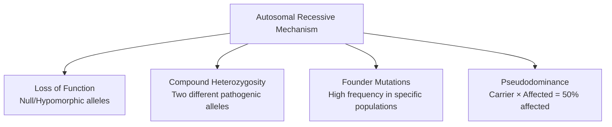

# 4.2 Autosomal Recessive Disorders


---

## 🎯 Learning Objectives
- [ ] Recognise **clinical features** of major AR disorders (CF, Sickle cell, Thalassaemia, PKU, Wilson, Gaucher, FA, SMA, CAH)
- [ ] Apply **carrier screening** strategies (Population, Ethnicity-based, Expanded panels)
- [ ] Understand **newborn blood spot screening** (UK programme, Tandem MS)
- [ ] Explain **molecular mechanisms**: Loss of function, Compound heterozygosity, Founder mutations
- [ ] Apply **Bayesian carrier risk** calculations
- [ ] Understand **reproductive options** (PND, PGT-M, Cascade testing)
- [ ] Answer viva: "CF screening pathway" and "Sickle cell vs Thalassaemia screening"

---

## 🧠 Core Concept: AR Disease Mechanisms



---

## 1️⃣ Cystic Fibrosis (CF)

| Feature | Detail |
|---------|--------|
| **Gene** | **CFTR** (7q31.2) — cAMP-regulated Cl⁻ channel |
| **Incidence** | 1/2500 (Caucasian); Carrier 1/25 |
| **Most Common Mutation** | **ΔF508** (p.Phe508del) — ~70% alleles (Class II: misfolding/trafficking) |
| **Mutation Classes** | I: No synthesis; II: Trafficking (ΔF508); III: Gating (G551D); IV: Reduced conductance; V: Reduced synthesis; VI: Reduced stability |
| **Clinical Features** | **Pancreatic insufficiency** (85%), Chronic lung disease (*P. aeruginosa*), Male infertility (CBAVD), Diabetes (CFRD), Liver disease, Osteoporosis |
| **Diagnosis** | Sweat chloride >60 mmol/L (diagnostic); Genetic testing (CFTR sequencing + MLPA) |
| **Newborn Screening** | IRT (Immunoreactive Trypsinogen) → CFTR mutation panel → Sweat test confirmation |
| **CFTR Modulators** | **Triple therapy (Elexacaftor/Tezacaftor/Ivacaftor)** — For ≥1 F508del allele (90% pts); **Ivacaftor** for Gating (Class III); **Lumacaftor/Ivacaftor** for F508del homozygotes |
| **Surveillance** | Quarterly CF clinic: Spirometry, Sputum culture, Nutritional status, DEXA, LFT, OGTT (CFRD), DEXA |
| **Genetic Testing** | CFTR sequencing + MLPA (detects CNV); **Population carrier screening** (F508del + common panel) |
| **Carrier Screening** | **Population-based** (1/25 Caucasian); **Ethnicity-based** (Ashkenazi Jewish panel); **Expanded panels** (100s of genes) |
| **Reproductive Options** | PND (CVS/Amnio), PGT-M, Cascade testing for relatives |

---

## 2️⃣ Haemoglobinopathies

### Sickle Cell Disease (SCD)
| Feature | Detail |
|---------|--------|
| **Gene** | **HBB** (11p15.4) — β-globin Glu6Val (GTG→GAG) |
| **Genotype** | **HbSS** (Sickle cell anaemia); **HbSC** (Compound het); **HbSβ⁰/β⁺ Thal** |
| **Sickle Cell Trait** | **HbAS** — Carrier; Usually asymptomatic; **Risks**: Renal medullary carcinoma, Splenic infarct at altitude, Exercise-related death |
| **Pathophysiology** | HbS polymerisation (deoxygenated) → Sickling → Vaso-occlusion, Haemolysis, Endothelial damage |
| **Clinical Features** | **Vaso-occlusive crisis (VOC)**, Acute chest syndrome, Stroke (childhood), Priapism, Splenic sequestration, Avascular necrosis, Chronic kidney disease, Pulmonary hypertension |
| **Screening** | **Newborn (UK)**: HPLC/Isoelectric focusing → HbS detection; **Prenatal**: CVS/Amnio + Hb analysis |
| **Management** | **Hydroxyurea** (↑HbF, ↓VOC), **Crizanlizumab** (P-selectin inhibitor), **Voxelotor** (HbS stabilisation), **Penicillin prophylaxis** (until 5y), **Transfusion** (Stroke prevention, Acute chest), **L-Glutamine** |
| **Curative** | **Allogeneic HSCT** (matched sibling, <16y); **Gene therapy** (Lentiviral β-globin) — Emerging |
| **Stroke Prevention** | **TCD Ultrasound** (ages 2-16) → TAM velocity ≥200 cm/s → Chronic transfusion |

### β-Thalassaemia
| Feature | Detail |
|---------|--------|
| **Gene** | **HBB** (11p15.4) — β-globin reduced/absent |
| **Genotypes** | **β⁰** (no β-chain) / **β⁺** (reduced); **Transfusion-dependent (TDT)** / **Non-transfusion-dependent (NTDT)** |
| **Clinical** | TDT: Transfusion dependence, Iron overload, Cardiac siderosis, Endocrine (hypogonadism, diabetes, hypothyroidism), Bone deformities, Extramedullary haematopoiesis |
| **Management** | **Transfusion** (Hb >9-10g/dL), **Iron Chelation** (Deferasirox, Deferiprone, Desferrioxamine), **Luspatercept** (TDT), **HSCT** (curative, matched donor), **Gene therapy** (Betibeglogene autotemcel) |
| **Screening** | NBS (HPLC), Prenatal (CVS/Amnio), Carrier screening (high-prevalence populations) |

### α-Thalassaemia
| Genotype | Clinical |
|----------|----------|
| **--/αα** (1 gene deleted) | **Silent carrier** (Normal Hb) |
| **-/αα** (2 genes, trans) | **α-Thal trait** (Mild microcytosis) |
| **--/-α** (3 genes) | **HbH disease** (Moderate anaemia, Hepatosplenomegaly, Leg ulcers) |
| **--/--** (4 genes) | **Hb Bart's hydrops fetalis** (Lethal in utero/neonatal) |

---

## 3️⃣ Phenylketonuria (PKU)

| Feature | Detail |
|---------|--------|
| **Gene** | **PAH** (12q23.2) — Phenylalanine hydroxylase |
| **Incidence** | 1/10,000 (Caucasian); Carrier 1/50 |
| **Pathophysiology** | Phe accumulation → Neurotoxicity (ID if untreated) |
| **Newborn Screening** | **Guthrie test / Tandem MS** — ↑ Phe, ↑ Phe/Tyr ratio |
| **Classification** | Classic PKU (Phe >1200 μmol/L); Mild PKU (600-1200); Mild hyperphenylalaninaemia (<600) |
| **Management** | **Low-phenylalanine diet** (Lifelong), **Phe-free formula**, **Sapropterin** (BH4 cofactor; responsive if residual PAH activity), **Large neutral amino acids (LNAA)** |
| **Maternal PKU** | **Strict Phe control pre-conception** (Phe 120-360 μmol/L) → Prevents fetal microcephaly, IUGR, CHD, ID |
| **Newborn Screening** | **Day 5 heel prick** — Tandem MS (Phe, Phe/Tyr) |

---

## 4️⃣ Wilson Disease

| Feature | Detail |
|---------|--------|
| **Gene** | **ATP7B** (13q14.3) — Copper-transporting ATPase |
| **Incidence** | 1/30,000; Carrier 1/90 |
| **Pathophysiology** | Impaired biliary copper excretion → Copper accumulation in liver, brain (basal ganglia), cornea (K-F rings) |
| **Clinical** | **Hepatic** (Hepatitis, Cirrhosis, Fulminant hepatic failure), **Neuropsychiatric** (Tremor, Dystonia, Dysarthria, Psychiatric), **Kayser-Fleischer rings** (corneal copper), Sunflower cataract |
| **Diagnosis** | **Low serum ceruloplasmin** (<20 mg/dL), **High 24h urinary copper** (>100 μg), **High hepatic copper** (>250 μg/g dry wt), **K-F rings** (slit lamp), **ATP7B sequencing** |
| **Treatment** | **Chelation**: Penicillamine, Trientine, **Zinc** (blocks intestinal absorption); **Liver transplant** (FHF, Decompensated cirrhosis); **Lifelong** |
| **Surveillance** | 6-monthly: LFT, CBC, Urinary copper, Neuro exam, Slit lamp |
| **Screening** | 1st-degree relatives (25% risk if sib); **ATP7B sequencing** |

---

## 5️⃣ Lysosomal Storage Disorders (LSDs)

### Gaucher Disease
| Feature | Detail |
|---------|--------|
| **Gene** | **GBA** (1q21) — Glucocerebrosidase |
| **Types** | **Type 1** (Non-neuronopathic, 90%): Hepatosplenomegaly, Thrombocytopenia, Bone crises, Erlenmeyer flask deformity; **Type 2** (Acute neuronopathic, Infantile); **Type 3** (Subacute neuronopathic) |
| **Treatment** | **ERT (Imiglucerase, Velaglucerase, Taliglucerase)**; **SRT (Eliglustat, Miglustat)** |
| **Carrier Risk** | Ashkenazi Jewish: **1/15** (N370S, L444P) |

### Other LSDs
| Disorder | Gene | Key Features |
|----------|------|--------------|
| **Tay-Sachs (GM2)** | HEXA | Cherry-red spot, Infantile neurodegeneration, Cherry-red spot |
| **Niemann-Pick A/B** | SMPD1 | Sphingomyelin accumulation, Hepatosplenomegaly, Neurodegeneration (A) |
| **Fabry** | GLA (XL) | α-Gal A deficiency; Angiokeratomas, Acroparesthesias, Renal/Heart/CNS; ERT/Chaperone |
| **Pompe** | GAA | Glycogen storage; Infantile (Cardiomegaly, Hypotonia) vs Late-onset (Myopathy); ERT (Alglucosidase alfa) |
| **MPS I (Hurler/Scheie)** | IDUA | Coarse facies, Corneal clouding, Hepatosplenomegaly, Cardiac, Skeletal; ERT, HSCT |
| **MPS II (Hunter)** | IDS (XL) | Similar to Hurler, No corneal clouding; ERT |

---

## 5️⃣ Friedreich Ataxia (FRDA)

| Feature | Detail |
|---------|--------|
| **Gene** | **FXN** (9q21.11) — Intron 1 GAA repeat |
| **Repeat** | Normal 5-33; **Premutation 34-65**; **Full >66** (often >600) |
| **Mechanism** | Frataxin deficiency → Mitochondrial iron accumulation, Oxidative stress |
| **Clinical** | **Ataxia** (gait, limb), **Cardiomyopathy** (Hypertrophic), Diabetes, Scoliosis, Pes cavus, **Absent reflexes**, Dysarthria |
| **Onset** | 10-15y (range 5-25) |
| **Genetic Testing** | **Repeat-primed PCR** (GAA expansion) + Sequencing (point mutations) |
| **Management** | **Omaveloxolone** (recently approved), Cardiology surveillance, Physiotherapy, Diabetes management |

---

## 6️⃣ Spinal Muscular Atrophy (SMA)

| Feature | Detail |
|---------|--------|
| **Gene** | **SMN1** (5q13.2) — Exon 7 deletion (95%) |
| **Modifier** | **SMN2 copy number** — More copies = Milder phenotype (Type 1: 1-2 copies; Type 2: 3; Type 3: 3-4; Type 4: 4+) |
| **Types** | **Type 1 (Werdnig-Hoffmann)**: Onset <6m, Never sit, Fatal <2y; **Type 2**: Sit, Not walk; **Type 3 (Kugelberg-Welander)**: Walk, Later weakness; **Type 4**: Adult onset |
| **Genetic Testing** | **qPCR/MLPA** for SMN1 exon 7 del + SMN2 copy number |
| **Treatment** | **Nusinersen** (ASO, Intrathecal), **Risdiplam** (Oral SMN2 splicing modifier), **Onasemnogene abeparvovec** (AAV9 gene therapy, <2y, <13.5kg) |
| **Newborn Screening** | **SMN1 exon 7 del** on dried blood spot (qPCR) — Early treatment → Better outcomes |

---

## 7️⃣ Congenital Adrenal Hyperplasia (CAH)

| Feature | Detail |
|---------|--------|
| **Gene** | **CYP21A2** (6p21.3) — 21-hydroxylase deficiency (90-95% CAH) |
| **Types** | **Salt-wasting** (Classic, 75%): Aldosterone deficiency → Salt loss, Shock; **Simple virilising** (Non-salt-wasting): Normal aldosterone; **Non-classic (Late-onset)**: Mild androgen excess |
| **Clinical** | **Salt-wasting crisis** (Neonate): Vomiting, Dehydration, Hyponatraemia, Hyperkalaemia; **Virilescence**: Ambiguous genitalia (46,XX), Precocious puberty, Infertility |
| **Newborn Screening** | **17-OHP** (Tandem MS) — Elevated in 21-hydroxylase deficiency |
| **Management** | **Glucocorticoid** (Hydrocortisone) + **Mineralocorticoid** (Fludrocortisone, salt-wasting); Stress dosing; Monitor 17-OHP, Androstenedione, Testosterone, Renin, Electrolytes |

---

## 8️⃣ α1-Antitrypsin Deficiency (A1AT)

| Feature | Detail |
|---------|--------|
| **Gene** | **SERPINA1** (14q32.1) |
| **Alleles** | **M** (Normal), **S** (Reduced), **Z** (Severe deficiency, Glu342Lys) |
| **Genotypes** | **MM** (Normal); **MZ** (Carrier); **ZZ** (Severe deficiency, 1/2500); **SZ** (Intermediate) |
| **Clinical** | **Panacinar emphysema** (Early, Basal), **Liver cirrhosis** (Z protein polymerisation in hepatocytes), **Panniculitis**, **ANCA-positive vasculitis** |
| **Management** | **Augmentation therapy** (IV A1AT), **Smoking cessation**, Liver transplant (cirrhosis), Lung transplant (emphysema) |
| **Screening** | Targeted (COPD <45y, Unexplained liver disease, Family hx) |

---

## 9️⃣ Other High-Yield AR Disorders

| Disorder | Gene | Key Features |
|----------|------|--------------|
| **Hereditary Spherocytosis** | ANK1, SPTB, SLC4A1, EPB42 | Haemolytic anaemia, Splenomegaly, Cholelithiasis, Aplastic crisis (Parvovirus) |
| **Fanconi Anaemia** | FANCA-W (22 genes) | Thumb/Radius anomalies, BM failure, Cancer predisposition; DEB test |
| **Ataxia-Telangiectasia** | ATM | Ataxia, Telangiectasia, Radiosensitivity, Lymphoma |
| **Nijmegen Breakage Syndrome** | NBN | Microcephaly, Bird-like face, Immunodeficiency |
| **Cystinosis** | CTNS | Renal Fanconi syndrome, Photophobia, Corneal crystals, Cysteamine |
| **Biotinidase Deficiency** | BTD | Seizures, Alopecia, Dermatitis, Developmental delay; **Biotin supplement** |
| **Galactosaemia** | GALT | Cataracts, Liver failure, E. coli sepsis; **Lactose-free diet** |
| **Maple Syrup Urine Disease** | BCKDHA/B/C | Branched-chain ketoacids, Neonatal encephalopathy, Dietary restriction |
| **Homocystinuria** | CBS | Marfanoid, Lens dislocation, Thrombosis, Intellectual disability, B6 responsive |

---

## 🔟 Carrier Screening & Newborn Screening

### UK Newborn Blood Spot Screening (Day 5)
| Condition | Method |
|-----------|--------|
| **PKU** | Tandem MS (Phe, Phe/Tyr) |
| **CHT** | TSH |
| **CF** | IRT → CFTR panel → Sweat test |
| **SCD** | HPLC / IEF (HbS) |
| **MCADD** | Acylcarnitines (C8) |
| **MSUD** | BCKA (Leucine, Isoleucine, Valine) |
| **IVA** | Isovalerylcarnitine (C5) |
| **GA1** | Glutarylcarnitine (C5DC) |
| **HCU** | Homocysteine / Metionine |

### Carrier Screening Strategies
| Strategy | Target Population |
|----------|------------------|
| **Population-based** | CF (1/25 caucasian) |
| **Ethnicity-based** | Thalassaemia (Mediterranean, Asian), Tay-Sachs (Ashkenazi Jewish), SCD (African/Caribbean) |
| **Expanded Panels** | 100-300 conditions (Commercial) |
| **Cascade Testing** | Relatives of index case |

---

## ⚡ FCPS/MRCP High-Yield Summary

| Disorder | Gene | Key Features | Screening/Treatment |
|----------|------|--------------|---------------------|
| **CF** | CFTR | Pancreatic insuff, Lung disease, CBAVD | NBS (IRT→CFTR), Sweat Cl⁻, **CFTR modulators** (Triple therapy) |
| **Sickle Cell** | HBB | Vaso-occlusion, Stroke, ACS, Priapism | NBS (HPLC), Hydroxyurea, Crizanlizumab, Voxelotor, TCD screening |
| **β-Thalassaemia** | HBB | TDT/NTDT, Iron overload, Chelation | NBS, Transfusion, Deferasirox, Luspatercept, HSCT |
| **PKU** | PAH | Neurotoxicity, ID if untreated | NBS (Phe/Tyr), **Low Phe diet + Sapropterin** |
| **Wilson** | ATP7B | Liver/Neuro, K-F rings, Low ceruloplasmin | Low ceruloplasmin, High urinary Cu, **Penicillamine/Trientine/Zinc** |
| **Gaucher** | GBA | Hepatosplenomegaly, Bone crises, Thrombocytopenia | ERT (Imiglucerase), SRT (Eliglustat) |
| **Friedreich Ataxia** | FXN (GAA) | Ataxia, Cardiomyopathy, Diabetes, Scoliosis | **Omaveloxolone**, Cardiology surveillance |
| **SMA** | SMN1 | Weakness, SMN2 copy number modifies | **Nusinersen, Risdiplam, Gene therapy (AVV9)** |
| **CAH** | CYP21A2 | Salt-wasting, Virilisation, 17-OHP ↑ | **17-OHP NBS**, Hydrocortisone + Fludrocortisone |
| **A1AT Deficiency** | SERPINA1 (ZZ) | Emphysema (basal), Liver cirrhosis | Augmentation therapy, Smoking cessation |
| **Sickle Cell Trait** | HbAS | Usually asymptomatic | Renal medullary Ca, Splenic infarct at altitude |

---

## 🎤 Viva Questions (Expected Answers)

| # | Question | Expected Answer |
|---|----------|-----------------|
| 1 | CF newborn screening pathway in UK? | **Day 5 heel prick → IRT → If elevated, CFTR mutation panel → If 2 mutations or 1 + high IRT → Sweat test (Cl⁻ >60 diagnostic)** |
| 2 | Sickle cell newborn screening — what is detected? | **HbS** via HPLC/Isoelectric focusing on dried blood spot |
| 3 | CF carrier frequency 1/25 — disease incidence? | q ≈ 1/50 → q² = **1/2500** |
| 4 | Sickle cell trait — clinical risks? | **Renal medullary carcinoma**, Splenic infarct at altitude, Exercise-related death, Haematuria |
| 4 | β-Thalassaemia major — management? | **Transfusion (Hb 9-10g/dL) + Iron chelation** (Deferasirox/Deferiprone/Desferrioxamine) + **Luspatercept** (Tertiary) |
| 5 | PKU — maternal PKU syndrome prevention? | **Strict Phe control pre-conception** (Phe 120-360 μmol/L) throughout pregnancy |
| 6 | Wilson disease — diagnostic triad? | **Low ceruloplasmin (<20 mg/dL), High 24h urinary copper (>100 μg), Kayser-Fleischer rings** |
| 7 | Friedreich ataxia — repeat expansion? | **FXN intron 1 GAA repeat** (>66 full mutation, often >600); **Anticipation (Paternal > Maternal)** |
| 8 | SMA — SMN2 copy number correlation? | **Type 1: 1-2 copies; Type 2: 3; Type 3: 3-4; Type 4: 4+** |
| 9 | CAH — salt-wasting crisis management? | **IV Hydrocortisone + Fludrocortisone + Saline + Glucose**; Monitor electrolytes, 17-OHP |
| 10 | A1AT deficiency — ZZ genotype risks? | **Early panacinar emphysema (basal), Liver cirrhosis, Panniculitis** |

---

## 🧩 Confusions & Mnemonics

| Confusion | Clarification |
|-----------|---------------|
| **"Sickle trait = No risk"** | **NO.** Renal medullary carcinoma, Splenic infarct (altitude), Exercise death, Haematuria |
| **"Thalassaemia trait = Silent"** | **NO.** Microcytosis, Mild anaemia; **Carrier screening essential** in high-prevalence populations |
| **"PKU diet only in childhood"** | **NO.** **Lifelong** low-Phe diet; **Maternal PKU** requires strict control pre-conception |
| **"Wilson = Only liver disease"** | **NO.** Neuropsychiatric (tremor, dystonia), K-F rings, Sunflower cataract |
| **"SMA Type 1 = Always fatal <2y"** | **Historically yes**, but **Nusinersen/Risdiplam/Gene therapy** dramatically improved survival |
| **"CF carriers asymptomatic"** | **Yes**, but **CFTR-related disorders** (CBAVD, Pancreatitis) possible in carriers |
| **"Thalassaemia screening = Only for high-risk"** | **UK:** **Universal NBS for SCD**; Targeted carrier screening for high-prevalence populations |
| **"A1AT deficiency = Only smokers get emphysema"** | **NO.** ZZ non-smokers also develop emphysema (later); **Liver disease independent of smoking** |
| **"CAH = Only genital ambiguity"** | **NO.** **Salt-wasting crisis** = Life-threatening emergency in neonates |
| **"Friedreich ataxia = Only ataxia"** | **NO.** **Cardiomyopathy (HCM) is major cause of death**, Diabetes, Scoliosis, Pes cavus |

> **Mnemonic: AR DISORDERS HIGH YIELD**  
> **A**R: **25% risk, Horizontal, Consanguinity, Carrier 2pq, Compound Het**  
> **R**ecessive: **CF, Sickle, Thal, PKU, Wilson, Gaucher, FA, SMA, CAH, A1AT**  
> **D**isorders: **CF (CFTR, Modulators), Sickle (HBB, Hydroxyurea), Thal (HBB, Chelation)**  
> **I**nheritance: **25% risk, Carrier freq 2pq (CF 1/25, Sickle 1/10 AA, Thal 1/20 SEA)**  
> **S**creening: **NBS (PKU, CHT, CF, SCD, MCADD, MSUD, IVA, GA1, HCU)**  
> **O**ther: **Wilson (ATP7B, Ceruloplasmin, K-F rings), Gaucher (GBA, ERT/SRT), FRDA (FXN, GAA repeat, Omaveloxolone)**  
> **R**are but High Yield: **SMA (SMN1, SMN2 copies, Nusinersen/Risdiplam/Gene Tx), CAH (CYP21A2, 17-OHP, Salt-wasting), A1AT (SERPINA1 ZZ, Emphysema/Liver)**  
> **D**isorders continued: **HS (Spherocytosis, Splenectomy), FA (DEB test), AT (ATM, 7;14), NBS (NBN, Microcephaly)**  
> **E**xpanded Carrier Screening: **Ethnicity (Ashkenazi, Mediterranean, African) + Expanded panels (100s genes)**  
> **R**ecurrence Risk: **AR 25%, Bayesian 2/3 carrier if unaffected sib, Consang F=1/16**  
> **S**ickle Trait: **Carrier (AS) — Renal medullary Ca, Splenic infarct at altitude, Exercise death**  
> **P**seudodominance: **Carrier × Affected = 50% affected** — Mimics AD  
> **E**xpanded Panels: **Pre-conception, PGT-M, Cascade testing**  
> **S**urveillance: **CF (Quarterly), Sickle (TCD 2-16y), Thal (Iron chelation), PKU (Diet), Wilson (Cu/Ceruloplasmin)**  

---

## 🗺️ Mind Map

```mermaid
mindmap
  root((AR Disorders))
    CF
      CFTR ΔF508
      Pancreatic insuff/Lung
      Modulators (Triple therapy)
      NBS: IRT → CFTR → Sweat
    Haemoglobinopathies
      Sickle (HbSS/SC/β-thal)
      Hydroxyurea/Crizanlizumab
      TCD screening 2-16y
      β-Thal: TDT/NTDT, Chelation
      α-Thal: Silent/Trait/HbH/Hydrops
    PKU
      PAH, Phe/Tyr NBS
      Low Phe diet + Sapropterin
      Maternal PKU control
    Wilson
      ATP7B, Cu accumulation
      Low Cp, High Ur Cu, K-F rings
      Penicillamine/Trientine/Zinc
    LSDs
      Gaucher (GBA, ERT/SRT)
      Tay-Sachs, Fabry (XL), Pompe
    Friedreich
      FXN GAA repeat
      Ataxia, Cardiomyopathy
      Omaveloxolone
    SMA
      SMN1 del, SMN2 copies
      Nusinersen/Risdiplam/Gene Tx
      NBS: SMN1 del
    CAH
      CYP21A2, 17-OHP NBS
      Salt-wasting crisis
      Hydrocortisone + Fludro
    A1AT
      SERPINA1 ZZ
      Emphysema + Liver
      Augmentation therapy
    Other
      Spherocytosis, FA, AT, NBS
      Cystinosis, Biotinidase, Galactosaemia
```

---

## 📅 Spaced Repetition Tracker

| Review | Date | Score (0–5) | Notes |
|--------|------|-------------|-------|
| Day 1 | | | |
| Day 3 | | | |
| Day 7 | | | |
| Day 14 | | | |
| Day 30 | | | |
| Day 90 | | | |

---

## 📝 Self-Test Scorecard

| Section | Max | Score | % |
|---------|-----|-------|---|
| CF (Genetics, Screening, Modulators) | 3 | | |
| Haemoglobinopathies (Sickle, Thal, α-Thal) | 4 | | |
| PKU + Wilson + LSDs | 3 | | |
| Friedreich / SMA / CAH / A1AT | 4 | | |
| Other AR (Spherocytosis, FA, AT, CAH) | 2 | | |
| Carrier/NBS Screening | 3 | | |
| **Total** | **20** | | |

---

## 💬 Exam Answer Modes

| Format | Prompt | Key Points |
|--------|--------|------------|
| **Long Essay** | "Describe the pathophysiology, screening, and management of cystic fibrosis." | CFTR ΔF508, Pancreatic insuff/Lung disease/CBAVD, NBS pathway, Sweat test, CFTR modulators (Triple therapy), Surveillance |
| **Short Note** | "Sickle cell disease — pathophysiology and stroke prevention." | HbS polymerisation, VOC/ACS/Stroke, TCD screening (2-16y), Hydroxyurea/Crizanlizumab/Voxelotor, HSCT/Gene therapy |
| **Viva** | "Couple with sickle cell trait (AS) and β-thalassaemia trait. Pregnancy risk counselling?" | 25% HbS/β-thal (Sickle-β-thal), 25% HbSS, 25% HbAS, 25% HbAβ-thal. Prenatal: CVS/Amnio + Hb analysis. |
| **Ward Round** | "Neonate with vomiting, dehydration, hyponatraemia, hyperkalaemia. 17-OHP elevated. Diagnosis & acute management?" | **CAH (21-hydroxylase deficiency)** — Salt-wasting crisis. **IV Hydrocortisone + Fludrocortisone + Saline + Glucose**. Monitor electrolytes. |
| **Last-Night** | "CF: CFTR F508del, Triple therapy, NBS IRT→CFTR→Sweat. Sickle: HbSS/SC, Hydroxyurea, TCD 2-16y. Thal: TDT/NTDT, Chelation. PKU: Phe/Tyr, Low diet+Sapropterin. Wilson: Low Cp, K-F rings, Penicillamine. FRDA: GAA repeat. SMA: SMN1 del, SMN2 copies, Nusinersen/Risdiplam/GeneTx. CAH: 17-OHP, Salt-wasting: IV HC+Fludro." | Compressed. |

---

## 📌 Summary
- **CF**: CFTR ΔF508 (Class II), Pancreatic insuff, Lung disease, CBAVD. **NBS: IRT → CFTR panel → Sweat Cl⁻**. **Triple therapy (Elexacaftor/Tezacaftor/Ivacaftor)** for ≥1 F508del.
- **Sickle Cell**: HbSS/SC/β-thal. **HbS polymerisation** → VOC, ACS, Stroke. **Hydroxyurea, Crizanlizumab, Voxelotor**. **TCD screening 2-16y**. **Sickle trait (AS) risks**: Renal medullary Ca, Splenic infarct at altitude.
- **β-Thalassaemia**: TDT (Transfusion + Chelation + Luspatercept); NTDT (Monitor); α-Thal (Silent/Trait/HbH/Hydrops).
- **PKU**: PAH, **NBS (Phe/Tyr)**, **Low-Phe diet + Sapropterin**. **Maternal PKU**: Strict Phe control pre-conception.
- **Wilson**: ATP7B, **Low ceruloplasmin, High urinary Cu, K-F rings**. **Penicillamine/Trientine/Zinc**.
- **Gaucher**: GBA, Type 1 (non-neuronopathic) **ERT (Imiglucerase) / SRT (Eliglustat)**.
- **Friedreich Ataxia**: FXN **GAA repeat**, Ataxia, Cardiomyopathy, Diabetes. **Omaveloxolone** approved.
- **SMA**: SMN1 exon 7 del, **SMN2 copy number** modifies severity. **Nusinersen (IT), Risdiplam (Oral), Gene therapy (AVV9)**.
- **CAH**: CYP21A2, **17-OHP NBS**, Salt-wasting crisis → **IV Hydrocortisone + Fludrocortisone + Saline**.
- **A1AT Deficiency**: SERPINA1 ZZ → **Panacinar emphysema (basal) + Liver cirrhosis**. **Augmentation therapy**.
- **Carrier Screening**: Universal NBS (PKU, CHT, CF, SCD, MCADD, MSUD, IVA, GA1, HCU). Ethnicity-based (Thalassaemia, Tay-Sachs, SCD). Expanded panels.

---

## ❓ MCQs (10)

1. **CF newborn screening — IRT elevated, 1 CFTR mutation found. Next step?**  
   A. Diagnose CF  B. **Sweat chloride test**  C. Repeat IRT  D. Refer Genetics  
   *Answer: B. 1 mutation + high IRT → Sweat test (Cl⁻ >60 diagnostic).*

2. **Sickle cell trait (HbAS) — clinical risk?**  
   A. None  B. **Renal medullary carcinoma**  C. Stroke  D. Acute chest syndrome  
   *Answer: B. Renal medullary carcinoma, Splenic infarct at altitude, Exercise death.*

3. **β-Thalassaemia major — iron chelation first-line?**  
   A. Penicillamine  B. **Deferasirox**  C. Deferiprone  D. Desferrioxamine  
   *Answer: B. Deferasirox (oral, once daily) is first-line; Deferiprone/Desferrioxamine alternatives.*

4. **Phenylketonuria — maternal PKH prevention?**  
   A. Low Phe diet during pregnancy only  B. **Strict Phe control pre-conception (120-360 μmol/L)**  C. Supplement BH4  C. No special diet needed  
   *Answer: B. Pre-conception control essential to prevent fetal microcephaly, IUGR, CHD.*

5. **Wilson disease — diagnostic hallmark?**  
   A. High ceruloplasmin  B. **Kayser-Fleischer rings (slit lamp)**  C. Low urinary copper  D. High serum copper  
   *Answer: B. K-F rings pathognomonic (copper deposition in Descemet's membrane).*

6. **Friedreich ataxia — repeat expansion locus?**  
   A. HTT CAG  B. **FXN intron 1 GAA**  C. DMPK CTG  D. FMR1 CGG  
   *Answer: B. FXN intron 1 GAA repeat (>66 full mutation, often >600).*

7. **Spinal muscular atrophy — SMN2 copy number correlates with:**  
   A. Age of onset  B. **Phenotype severity (Type 1: 1-2 copies, Type 3: 3-4)**  C. Treatment response  D. Carrier risk  
   *Answer: B. More SMN2 copies = Milder phenotype (Type 1: 1-2, Type 2: 3, Type 3: 3-4, Type 4: 4+).*

8. **Congenital adrenal hyperplasia — salt-wasting crisis acute management?**  
   A. Oral hydrocortisone  B. **IV Hydrocortisone + Fludrocortisone + Saline + Glucose**  C. IV saline only  D. Oral fludrocortisone  
   *Answer: B. Immediate IV hydrocortisone (stress dose) + Fludrocortisone + 0.9% Saline + 10% Dextrose.*

9. **α1-Antitrypsin deficiency — ZZ genotype phenotype?**  
   A. Liver disease only  B. **Panacinar emphysema (basal) + Liver cirrhosis**  C. Emphysema only  D. Neutropenia  
   *Answer: B. Panacinar (basal) emphysema + Liver cirrhosis (Z protein polymerisation in hepatocytes).*

10. **α-Thalassaemia — HbH disease genotype?**  
    A. --/αα  B. -/αα  C. **--/-α**  D. --/--  
    *Answer: C. 3 α-globin genes deleted → HbH disease (moderate anaemia, hepatosplenomegaly).*

---

## 📋 SBAs (10)

1. **Couple, both CF carriers (ΔF508/F508del). Fetal CFTR testing: ΔF508/G551D. Phenotype?**  
   A. Unaffected  B. **Classic CF (Compound heterozygote)**  C. Mild CF  D. Carrier  
   *Answer: B. Two different pathogenic alleles = Compound heterozygote = Affected.*

2. **Asian couple, both β-thalassaemia carriers. Prenatal diagnosis options?**  
   A. Ultrasound only  B. **CVS (11-14w) qf-PCR + HBB sequencing or Amniocentesis (15-20w)**  C. NIPT  D. Wait for birth  
   *Answer: B. CVS qf-PCR + HBB sequencing (rapid aneuploidy + specific mutation) or Amnio.*

3. **Child with SMA Type 1 (SMN1 del, SMN2 copies = 2). Best treatment?**  
   A. Physiotherapy only  B. **Nusinersen (IT) / Risdiplam (Oral) / Onasemnogene (Gene therapy <2y, <13.5kg)**  C. HSCT  D. Palliative only  
   *Answer: B. All three disease-modifying treatments available; Early treatment = Better outcome.*

4. **Neonate with ambiguous genitalia (46,XX), vomiting, hyponatraemia, hyperkalaemia. 17-OHP 800 nmol/L. Diagnosis?**  
   A. CAH (21-hydroxylase deficiency)  B. CAH (11β-hydroxylase)  C. Adrenal tumour  D. Pyloric stenosis  
   *Answer: A. 21-hydroxylase deficiency: Salt-wasting crisis + Virilisation in 46,XX.*

5. **Child with progressive ataxia, cardiomyopathy, diabetes, absent reflexes. Genetic test?**  
   A. HTT CAG  B. **FXN GAA repeat-primed PCR**  C. SMN1 exon 7  D. CFTR sequencing  
   *Answer: B. Friedreich ataxia: FXN intron 1 GAA repeat (>66 = full mutation).*

---

## 🔑 Answer Keys
| MCQs | SBAs |
|------|------|
| 1-B, 2-B, 3-B, 4-B, 5-B, 6-B, 7-B, 8-B, 9-B, 10-B | 1-B, 2-B, 3-B, 4-A, 5-B |

---

## 🔗 Cross-Links
- [[2.1 Mendelian Inheritance]] — AR inheritance, Carrier risk, Bayesian 2/3
- [[2.2 Non-Mendelian Inheritance]] — Mitochondrial, Imprinting contrasted
- [[1. Fundamentals of Medical Genetics]] — HWE, Carrier frequency, Mutation types
- [[5.1-5.4 Genetic Testing Technologies]] — Sequencing, MLPA, NGS, qPCR for diagnosis
- [[5.4 Prenatal & Preimplantation Testing]] — PND (CVS/Amnio), PGT-M for AR disorders
- [[5.5 Genetic Counselling]] — Carrier screening, Cascade testing, Reproductive options
- [[8. Population & Newborn Screening]] — UK NBS programme details
- [[7. Pharmacogenetics]] — TPMT (Azathioprine), NUDT15 (6-MP) in AR disorders
- [[9. ELSI]] — Carrier screening ethics, Reproductive autonomy, DTC testing

---

**Last Updated:** 2026-06-14  
**Next:** Build `4.3 X-Linked Disorders.md`