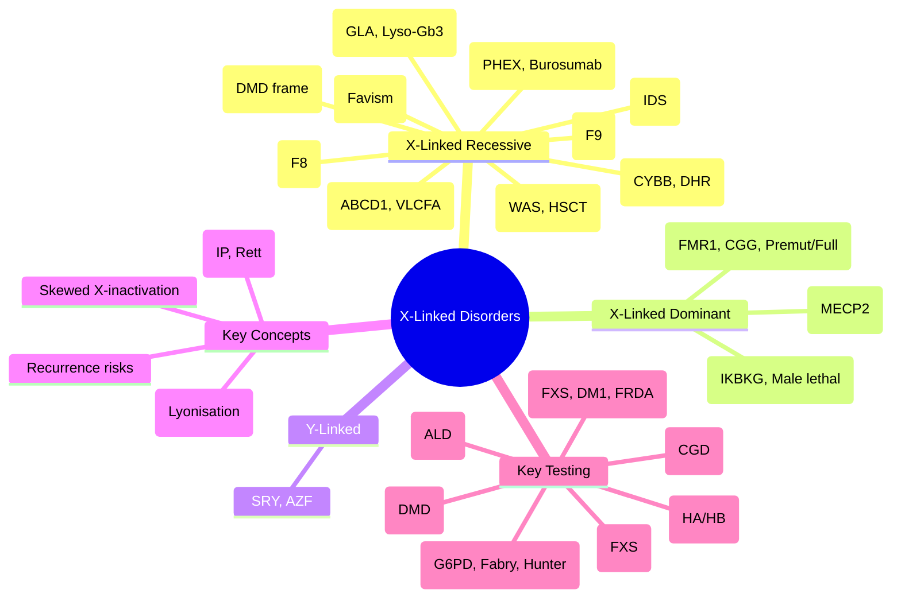

# 4.3 X-Linked Disorders


---

## 🎯 Learning Objectives
- [ ] Recognise **clinical features** of major X-linked disorders (DMD/BMD, Haemophilia A/B, G6PD, Fabry, Hunter, ALD, Fragile X, Incontinentia Pigmenti)
- [ ] Explain **X-inactivation (Lyonisation)** and skewed X-inactivation in carrier females
- [ ] Calculate **recurrence risks** for XLR and XLD disorders
- [ ] Understand **molecular mechanisms**: Loss of function (XLR), Gain of function (XLD)
- [ ] Apply **genetic testing strategies** (Deletion/duplication analysis, Repeat testing, Biochemical assays)
- [ ] Apply **carrier testing** and **prenatal/PGT-M** options
- [ ] Answer viva: "DMD vs BMD" and "Haemophilia inhibitor management"

---

## 🧠 Core Concept: X-Linked Inheritance Patterns

```mermaid
flowchart TD
    A[X-Linked Inheritance] --> B[X-Linked Recessive (XLR)<br/>Males affected, Carrier females]
    A --> C[X-Linked Dominant (XLD)<br/>Both sexes affected]
    A --> D[Y-Linked<br/>Father→Son only]
    
    B --> E[Features: No M→M, Carrier females usually asymptomatic]
    C --> F[Features: No M→M, Both sexes affected, Male lethality possible]
```

---

## 1️⃣ Duchenne / Becker Muscular Dystrophy (DMD/BMD)

| Feature | DMD | BMD |
|---------|-----|-----|
| **Gene** | **DMD** (Xp21.2) — **Dystrophin** (427 kDa) |
| **Mutation** | **Out-of-frame deletions/duplications** (~65% del, 10% dup) → **No functional dystrophin** | **In-frame deletions/duplications** → **Truncated but partially functional dystrophin** |
| **Incidence** | 1/3500-5000 males | 1/18,000-30,000 males |
| **Onset** | <5 years (delayed walking, Gower's sign) | Later (adolescence/adulthood) |
| **Progression** | Rapid → Wheelchair by 12y; Cardiomyopathy, Respiratory failure; Death 20s | Slower; Wheelchair 30-40s; Cardiomyopathy common |
| **CK** | **Massively elevated** (10-100x) | Elevated (5-10x) |
| **Cardiac** | Dilated cardiomyopathy (90% by 18y) | Cardiomyopathy (later onset) |
| **Cognitive** | Learning difficulties (30%), Autism/ADHD | Usually normal |
| **Genetic Testing** | **MLPA/qPCR for exon del/dup** (75% detection) → Sanger/NGS for point mutations | Same |
| **Carrier Females** | Usually asymptomatic; **CK elevated** (80%), **Cardiomyopathy risk (10-20%)** | Similar but lower risk |
| **Management** | **Corticosteroids (Prednisolone/Deflazacort)** — Prolongs ambulation; **Cardiac surveillance** (Annual Echo/MRI); **Physiotherapy**; **ACEi/ARB** for cardiomyopathy; **Non-invasive ventilation** |
| **Emerging Therapies** | **Exon skipping** (Eteplirsen exon 51, Golodirsen exon 53, Viltolarsen exon 53, Casimersen exon 45) — **Restores reading frame** → BMD-like protein; **Gene therapy** (micro-dystrophin AAV) — Clinical trials |
| **Prenatal/PGT** | Prenatal (CVS/Amnio) if familial deletion known; PGT-M available |

---

## 2️⃣ Haemophilia A & B

### Haemophilia A (F8 Deficiency)
| Feature | Detail |
|---------|--------|
| **Gene** | **F8** (Xq28) — Factor VIII (cofactor for FIXa) |
| **Incidence** | 1/5000 males (A); 1/30,000 males (B) |
| **Classification** | **Severe** (<1%): Spontaneous bleeding; **Moderate** (1-5%): Bleeding after trauma; **Mild** (5-40%): Bleeding after surgery/trauma |
| **Bleeding Pattern** | **Joint (Haemarthrosis)** — Knees, ankles, elbows; **Muscle bleeds**; **Iliopsoas**; **Intracranial** (rare, life-threatening) |
| **Inhibitors** | **20-30% severe HA** develop anti-FVIII inhibitors (alloantibodies) — **Major complication**; Risk factors: Large deletions, Family history, Black race |
| **Inhibitor Management** | **Bypassing agents**: rFVIIa (NovoSeven), FEIBA (aPCC); **Immune tolerance induction (ITI)** — Daily high-dose FVIII; **Emicizumab** (non-factor mimetic) — Prophylaxis for inhibitor & non-inhibitor patients |
| **Emicizumab** | **Bispecific antibody** (FIXa × FX) — **Subcutaneous, weekly/biweekly**; **Prophylaxis for all HA** (with/without inhibitors); **No monitoring** required |
| **Gene Therapy** | **Roctavian (Valoctocogene roxaparvovec)** — AAV5-F8; **Hemgenix (Etranacogene dezaparvovec)** for HB — Approved in EU/UK |

### Haemophilia B (F9 Deficiency)
| Feature | Detail |
|---------|--------|
| **Gene** | **F9** (Xq27.1) — Factor IX |
| **Incidence** | 1/30,000 males |
| **Distinct Feature** | **Leyden variant** (F9 promoter mutations) — Low F9 in childhood, **Normalises at puberty** (androgen responsive) |

### Carrier Females
| Aspect | Detail |
|--------|--------|
| **Phenotype** | Usually asymptomatic; **Symptomatic carriers** (10-20%): Low FVIII/FIX → Easy bruising, Menorrhagia, Post-partum haemorrhage, Joint bleeds |
| **Skewed X-inactivation** | >80:20 → Symptomatic carrier |
| **Factor Levels** | Carrier levels often 30-60% (vs 50% expected) |
| **Management** | Desmopressin (DDAVP) for mild; Factor concentrate for procedures; Tranexamic acid for menorrhagia |

### Prenatal/PGT
- **Prenatal**: CVS/Amnio if familial mutation known
- **PGT-M**: Available for both HA/HB

---

## 3️⃣ G6PD Deficiency

| Feature | Detail |
|---------|--------|
| **Gene** | **G6PD** (Xq28) — Glucose-6-phosphate dehydrogenase (PPP, NADPH production) |
| **Inheritance** | **X-linked recessive** |
| **Variants** | **Class I** (Severe, CNS): Non-spherocytic haemolytic anaemia; **Class II** (Severe): <10% activity (Mediterranean); **Class III** (Moderate): 10-60% (African A-); **Class IV/V** (Mild/Normal) |
| **Triggers** | **Oxidative drugs**: Primaquine, Dapsone, Sulfonamides, Quinolones, Methylene blue, Rasburicase; **Foods**: Fava beans (Favism); **Infections**; **Stress** |
| **Clinical** | **Acute haemolytic anaemia** (Haemoglobinuria, Jaundice, Back pain); **Neonatal jaundice** (Kernicterus risk); **Chronic non-spherocytic haemolytic anaemia** (Class I) |
| **Diagnosis** | **G6PD enzyme assay** (Quantitative); **Genetic testing** (Common variants: Mediterranean C563T, African A- G202A, A376G) |
| **Management** | **Avoid triggers**; **Folic acid** supplementation; **Exchange transfusion** (severe neonatal); **Supportive care** |
| **Global Burden** | **400 million carriers**; Endemic in malaria zones (selective advantage) |

---

## 4️⃣ Fabry Disease

| Feature | Detail |
|---------|--------|
| **Gene** | **GLA** (Xq22.1) — α-Galactosidase A |
| **Inheritance** | **X-linked recessive** (Males affected; Carrier females variable) |
| **Mechanism** | α-Gal A deficiency → **Globotriaosylceramide (Gb3) accumulation** in lysosomes |
| **Classic (Male)** | Childhood: **Acroparesthesias** (burning pain hands/feet), **Angiokeratomas** (bathing trunk), **Hypohidrosis**, Corneal verticillata; Adult: **Renal failure**, **Cardiomyopathy** (HCM), **Stroke/TIA**, GI symptoms |
| **Late-Onset (Cardiac/Renal Variants)** | Residual enzyme activity → Present in adulthood with cardiac/renal disease only |
| **Carrier Females** | **Variable**: Asymptomatic → Full classic phenotype (X-inactivation skewing) |
| **Biomarkers** | **Lyso-Gb3 (Globotriaosylsphingosine)** — Elevated, Monitor treatment response |
| **Treatment** | **ERT (Agalsidase alfa/beta)** — IV q2w; **Chaperone (Migalastat)** — For amenable mutations (e.g., p.Asn215Ser) — Oral q2d; **Cardiac/Renal management** |
| **Surveillance** | Annual: eGFR, Proteinuria, ECG/Echo, MRI brain, Lyso-Gb3, Audiology |
| **Prenatal/PGT** | CVS/Amnio if familial variant known; PGT-M available |

---

## 4️⃣ Hunter Syndrome (MPS II)

| Feature | Detail |
|---------|--------|
| **Gene** | **IDS** (Xq28) — Iduronate-2-sulfatase |
| **Inheritance** | **X-linked recessive** |
| **Mechanism** | GAG accumulation (Dermatan sulfate, Heparan sulfate) |
| **Phenotypes** | **Severe (Neuronopathic)**: Coarse facies, Hepatosplenomegaly, Airway obstruction, Joint stiffness, **Developmental regression**, Death <15y<br/>**Attenuated (Non-neuronopathic)**: Milder, Normal intelligence, Longevity variable |
| **Clinical** | Coarse facies, Macrocephaly, **Recurrent infections**, **Joint contractures**, Carpal tunnel, Valvular heart disease, **IVD herniation** |
| **Genetic Testing** | IDS sequencing + MLPA; Enzyme assay (Iduronate-2-sulfatase) |
| **Treatment** | **ERT (Idursulfase)** — IV weekly; **Intrathecal ERT** (for CNS, investigational); **HSCT** (historical, not standard) |
| **Prenatal/PGT** | CVS/Amnio for familial variant; PGT-M |

---

## 4️⃣ Adrenoleukodystrophy (ALD)

| Feature | Detail |
|---------|--------|
| **Gene** | **ABCD1** (Xq28) — ALD protein (Peroxisomal VLCFA transporter) |
| **Inheritance** | **X-linked recessive** |
| **Mechanism** | Impaired peroxisomal β-oxidation → **VLCFA accumulation** (C24:0, C26:0) |
| **Phenotypes** | **Childhood Cerebral ALD (CCALD)**: 4-10y, Rapid cognitive decline, Visual loss, Seizures, Spasticity, Death in 2-5y<br/>**Adrenomyeloneuropathy (AMN)**: Adult, Spastic paraparesis, Sphincter dysfunction, Adrenal insufficiency<br/>**Addison-only**: Adrenal insufficiency without neurological involvement<br/>**Asymptomatic** |
| **Biochemical** | **Plasma VLCFA (C26:0, C24:0, C26:0/C22:0 ratio)** — Elevated |
| **Genetic Testing** | ABCD1 sequencing + MLPA; VLCFA for screening |
| **Management** | **HSCT** (early CCALD, Loes score <9) — **Curative for cerebral disease**; **Lorenzo's oil** (pre-symptomatic, delays onset); **Adrenal replacement** (Hydrocortisone + Fludrocortisone) |
| **Surveillance** | **Annual MRI brain** (Loes score) for at-risk males; Annual adrenal function; VLCFA monitoring |
| **Female Carriers** | **~20% develop AMN-like symptoms** (myelopathy) in adulthood; No cerebral ALD |

---

## 4️⃣ Fragile X Syndrome (FXS)

| Feature | Detail |
|---------|--------|
| **Gene** | **FMR1** (Xq27.3) — CGG repeat in 5' UTR |
| **Repeat Ranges** | **Normal**: 5-44 CGG; **Premutation**: 55-200 CGG; **Full Mutation**: >200 CGG + **Methylation** → FMR1 silencing |
| **Mechanism** | **Loss of FMRP** (RNA-binding protein) → Dysregulated synaptic translation |
| **Clinical (Male)** | **Intellectual disability** (moderate-severe), **Macroorchidism** (post-pubertal), **Autism** (~30%), **Long face**, **Large ears**, **Joint hypermobility**, Mitral valve prolapse |
| **Female Full Mutation** | Variable ID (milder), POI risk, Anxiety |
| **Premutation Carriers** | **FXPOI** (Fragile X-associated Primary Ovarian Insufficiency) — Women <40y: 20% risk<br/>**FXTAS** (Fragile X-associated Tremor/Ataxia Syndrome) — Older adults (>50y): Tremor, Ataxia, Cognitive decline, Peripheral neuropathy; **Male > Female** |
| **Genetic Testing** | **Repeat-primed PCR** (CGG repeat sizing) + **Southern Blot** (methylation status) |
| **Prenatal/PGT** | CVS/Amnio (repeat-primed PCR + methylation); **PGT-M** available |
| **Management** | Multidisciplinary: Special education, Behavioural therapy, Seizure control, Genetic counselling for family |

---

## 4️⃣ Incontinentia Pigmenti (IP)

| Feature | Detail |
|---------|--------|
| **Gene** | **IKBKG (NEMO)** (Xq28) — NF-κB essential modulator |
| **Inheritance** | **X-linked dominant** — **Male lethal** (usually) |
| **Mechanism** | Loss of NEMO → Impaired NF-κB signalling → Apoptosis sensitivity |
| **Clinical Stages (Female)** | 1) **Vesicular** (0-6m): Linear vesicles on limbs/trunk<br/>2) **Verrucous** (6m-2y): Wart-like hyperkeratotic lesions<br/>3) **Hyper pigmented** (2y-adult): Swirling linear hyperpigmentation (Blaschko lines)<br/>4) **Atrophic/Hypopigmented** (Adult): Pale streaks |
| **Systemic** | **Dental** (Peg-shaped, Missing); **Ocular** (Retinal vascular anomalies, Strabismus); **CNS** (Seizures, ID, Microcephaly); **Hair/Teeth/Nail anomalies** |
| **Male** | **Usually lethal in utero**; Survivors: Klinefelter (47,XXY), Mosaicism, Hypomorphic variants |
| **Genetic Testing** | IKBKG sequencing + MLPA (deletions common); **Deletion exons 4-10** common |
| **Prenatal/PGT** | **PGT-M strongly recommended** (Male lethality); Prenatal for known familial variant |

---

## 4️⃣ Other X-Linked Disorders

### Wiskott-Aldrich Syndrome (WAS)
| Feature | Detail |
|---------|--------|
| **Gene** | **WAS** (Xp11.23) — WASP (actin regulation) |
| **Triad** | **Thrombocytopenia (small platelets)**, **Eczema**, **Recurrent infections** |
| **Complications** | Autoimmunity (ITP, AIHA, Vasculitis), Lymphoma risk |
| **Treatment** | **HSCT** (curative); **Gene therapy** (Lentiviral) — Emerging |

### Chronic Granulomatous Disease (CGD) — X-linked (CYBB)
| Feature | Detail |
|---------|--------|
| **Gene** | **CYBB** (Xp21.1) — gp91phox (NADPH oxidase) |
| **Clinical** | Recurrent bacterial/fungal infections (Catalase-positive: Staph, Aspergillus, Burkholderia); Granuloma formation (GU, GI, Lung) |
| **Diagnosis** | **DHR (Dihydrorhodamine) flow cytometry** — Absent oxidative burst |
| **Treatment** | Prophylactic antibiotics/antifungals, IFN-γ, **HSCT** (curative) |

### X-linked Lymphoproliferative Disease (XLP)
| Type | Gene | Feature |
|------|------|---------|
| **XLP1** | SH2D1A (Xq25) | SAP deficiency → **EBV-driven HLH**, Lymphoma, Hypogammaglobulinaemia |
| **XLP2** | XIAP/BIRC4 (Xq25) | **BIRC4 deficiency** → Similar + Colitis, Splenomegaly, HLH |

### Other X-Linked Disorders
| Disorder | Gene | Key Feature |
|----------|------|-------------|
| **Rett Syndrome** | MECP2 | XLD, Female, Regression, Hand-wringing |
| **Oculocutaneous Albinism (OA1)** | GPR143 | Nystagmus, Photophobia, Iris transillumination |
| **X-linked Hypophosphataemic Rickets (XLH)** | PHEX | Phosphate wasting, Rickets, FGF23 ↑; Burosumab (anti-FGF23) |
| **Dentatorubral-pallidoluysian Atrophy (DRPLA)** | ATN1 | CAG repeat, Ataxia, Chorea, Myoclonus, Epilepsy |
| **Lowe Syndrome (OCRL)** | OCRL | Cataract, Renal Fanconi, Intellectual disability |
| **X-linked Ichthyosis** | STS | Scaly skin, Corneal opacities, Cryptorchidism |
| **Kallmann Syndrome** | ANOS1 (KAL1) | Anosmia + Hypogonadotropic hypogonadism |

---

## ⚡ FCPS/MRCP High-Yield Summary

| Disorder | Gene | Inheritance | Key Features | Key Management |
|----------|------|-------------|--------------|----------------|
| **DMD/BMD** | DMD | XLR | DMD: <5y, Wheelchair 12y, CM; BMD: Later, Milder | **Corticosteroids, Exon skipping, Cardiac surveillance** |
| **Haemophilia A** | F8 | XLR | Haemarthrosis, **Inhibitors (20-30%)**, Emicizumab | **Factor VIII, Emicizumab (prophylaxis), ITI for inhibitors** |
| **Haemophilia B** | F9 | XLR | Similar; **Leyden variant** (puberty normalisation) | Factor IX, Emicizumab (off-label) |
| **G6PD Deficiency** | G6PD | XLR | **Favism**, Drug-induced haemolysis, Neonatal jaundice | **Avoid triggers** (Primaquine, Sulfa, Fava beans) |
| **Fabry** | GLA | XLR | **Acroparesthesias, Angiokeratomas, Renal/Heart/CNS**; Carrier females variable | **ERT (Agalsidase), Migalastat (amenable mutations)** |
| **Hunter (MPS II)** | IDS | XLR | Coarse facies, Hepatosplenomegaly, Joint stiffness, **Severe: Neurodegeneration** | ERT (Idursulfase) |
| **ALD** | ABCD1 | XLR | **CCALD (Childhood cerebral), AMN, Adrenal insufficiency** | **VLCFA screening**, **HSCT (early CCALD)**, Lorenzo's oil |
| **Fragile X** | FMR1 | XLD (effectively) | **CGG >200 = Full mutation**; ID, Macroorchidism, Autism | **Premutation: FXPOI (women), FXTAS (adults)** |
| **Incontinentia Pigmenti** | IKBKG | XLD (Male lethal) | Skin stages (Vesicular→Verrucous→Hyper→Atrophic), Dental/Ocular/CNS | Symptomatic |
| **WAS** | WAS | XLR | Thrombocytopenia (small plt), Eczema, Infections → **HSCT** | HSCT curative |
| **CGD (X-linked)** | CYBB | XLR | Catalase-positive infections, Granulomas | **DHR flow cytometry**, HSCT |

---

## 🎤 Viva Questions (Expected Answers)

| # | Question | Expected Answer |
|---|----------|-----------------|
| 1 | DMD vs BMD — key genetic difference? | **DMD**: Out-of-frame deletions → No functional dystrophin. **BMD**: In-frame deletions → Truncated but partially functional dystrophin. |
| 2 | Haemophilia A inhibitor incidence? | **20-30%** of severe HA patients develop inhibitors. |
| 3 | Emicizumab — mechanism and use? | **Bispecific antibody** bridging FIXa and FX → Replaces FVIII function. **Prophylaxis for HA (with/without inhibitors)**. Subcutaneous, weekly/biweekly. No monitoring. |
| 4 | G6PD deficiency — drug triggers? | **Primaquine, Dapsone, Sulfonamides, Quinolones, Methylene blue, Rasburicase**; **Fava beans (Favism)**. |
| 5 | Fabry disease — female carrier phenotype? | **Variable** due to X-inactivation: Asymptomatic → Full classic (Acroparesthesias, Angiokeratomas, Renal/Heart/CNS). **Lyso-Gb3 biomarker**. |
| 6 | ALD — childhood cerebral form (CCALD) management? | **VLCFA screening → MRI (Loes score) → HSCT if Loes <9** (early). Lorenzo's oil for pre-symptomatic. |
| 7 | Fragile X — premutation vs full mutation? | **Premutation (55-200 CGG)**: FXPOI (women), FXTAS (adults). **Full (>200 CGG + methylation)**: FXS (ID, macroorchidism, autism). |
| 7 | Incontinentia Pigmenti — male phenotype? | **Male lethal** (usually). Survivors: Klinefelter (47,XXY), Mosaicism, Hypomorphic variants. |
| 8 | G6PD deficiency — common variants? | **African A-**: G202A + A376G (Class III, moderate). **Mediterranean**: C563T (Class II, severe). |
| 9 | Hunter syndrome — severe vs attenuated? | **Severe**: Neurodegeneration, regression, death <15y. **Attenuated**: Normal cognition, longevity. Both have coarse facies, hepatosplenomegaly, joint stiffness. |
| 10 | Incontinentia Pigmenti — male survivors? | **Klinefelter (47,XXY)**, **Somatic mosaicism**, **Hypomorphic variants** (unusual). |

---

## 🧩 Confusions & Mnemonics

| Confusion | Clarification |
|-----------|---------------|
| **"DMD and BMD are different genes"** | **NO.** Same gene **DMD**; DMD = Out-of-frame, BMD = In-frame. |
| **"All haemophilia inhibitors = same management"** | **NO.** HA inhibitors: ITI (high-dose FVIII) or Emicizumab. HB inhibitors: rFVIIa/FEIBA (ITI less successful). |
| **"G6PD = Only males affected"** | **NO.** Carrier females with **skewed X-inactivation** can have haemolysis. |
| **"Fabry = Only males affected"** | **NO.** Carrier females **variable** (X-inactivation). |
| **"Fragile X premutation = Carrier only"** | **NO.** Premutation causes **FXPOI** (women) and **FXTAS** (adults). |
| **"Incontinentia Pigmenti = Males never survive"** | **Mostly true**, but **Klinefelter, Mosaicism, Hypomorphic variants** can survive. |
| **"G6PD = Only drugs trigger"** | **NO.** Fava beans (Favism), Infections, Severe illness also trigger. |
| **"ALD = Only childhood cerebral"** | **NO.** **AMN (adrenomyeloneuropathy)** in adults; Addison-only; Asymptomatic carriers. |
| **"X-linked = Only males affected"** | **XLD affects both**; XLR females can manifest (skewed X-inactivation). |
| **"Fragile X full mutation = Always ID in females"** | **NO.** Females with full mutation have **variable ID** (often milder), **POI risk**, Anxiety. |

> **Mnemonic: X-LINKED HIGH YIELD**  
> **X**L: **DMD/BMD (DMD del/dup frame), Haemophilia A/B (F8/F9, Inhibitors, Emicizumab)**  
> **L**inked: **G6PD (Favism, Triggers), Fabry (GLA, Lyso-Gb3, ERT/Migalastat)**  
> **I**mportant: **Hunter (IDS, ERT), ALD (ABCD1, VLCFA, HSCT/Loes score)**  
> **N**eurology: **Fragile X (CGG, Premut=FXPOI/FXTAS), IP (IKBKG, Male lethal, Skin stages)**  
> **K**eratoses/skin: **Incontinentia (IKBKG, Male lethal), XLH (PHEX, Burosumab)**  
> **E**xamples: **WAS (WAS, HSCT), CGD (CYBB, DHR flow, HSCT), XLP (SH2D1A/XIAP)**  
> **D**ifferentials: **DMD vs BMD (Frame), HA vs HB (Inhibitor mgmt), XLH (PHEX, Burosumab)**  
> **F**emale Carriers: **XLR (Usually asymp), Skewed X-inact → Symptomatic**  
> **P**remutation: **FXS (CGG 55-200 = FXPOI/FXTAS), Full (>200+methyl = FXS)**  
> **Y**-Linked: **SRY, AZF, Hairy ears (myth)**  
> **H**aemophilia: **HA (F8, Inhibitors 30%, Emicizumab), HB (F9, Leyden variant)**  
> **I**nhibitors: **HA (ITI/Emicizumab), HB (rFVIIa/FEIBA, ITI less effective)**  
> **G**6PD: **Triggers (Primaquine, Sulfa, Fava, Methylene blue, Rasburicase)**  
> **F**abry: **Lyso-Gb3 biomarker, Carrier females variable, Migalastat amenable**  
> **A**LD: **VLCFA screening, Loes score, HSCT <9, Lorenzo's oil**  
> **L**oeys-Dietz: **Not X-linked** (TGFBR1/2) — Mnemonic check  
> **E**xamples: **WAS (WASP, HSCT), CGD (CYBB, DHR), XLH (PHEX, Burosumab)**  
> **D**e Novo: **X-linked rare** (OPM) — Most familial  
> **I**ncontinentia: **IKBKG, Male lethal, Skin stages (Ves→Ver→Hyper→Atrophic)**  
> **N**BS: **Hunter, ALD, Fabry, G6PD** — Some in expanded NBS  
> **E**MIC: **Emicizumab (HA/HB prophylaxis), Bispecific (FIXa×FX)**  
> **D**uchenne: **Exon skipping (51, 53, 45) → Frame restoration**  
> **S**urvey: **Carrier screening (High-risk populations), PGT-M, Prenatal CVS/Amnio**  

---

## 🗺️ Mind Map



---

## 📅 Spaced Repetition Tracker

| Review | Date | Score (0–5) | Notes |
|--------|------|-------------|-------|
| Day 1 | | | |
| Day 3 | | | |
| Day 7 | | | |
| Day 14 | | | |
| Day 30 | | | |
| Day 90 | | | |

---

## 📝 Self-Test Scorecard

| Section | Max | Score | % |
|---------|-----|-------|---|
| DMD/BMD | 3 | | |
| Haemophilia A/B | 3 | | |
| G6PD / Fabry / Hunter | 3 | | |
| ALD / Fragile X / IP | 3 | | |
| Other XLR (WAS, CGD, XLH) | 2 | | |
| Carrier Females / X-inactivation | 2 | | |
| Recurrence Risks | 2 | | |
| Genetic Testing Strategies | 2 | | |
| **Total** | **20** | | |

---

## 💬 Exam Answer Modes

| Format | Prompt | Key Points |
|--------|--------|------------|
| **Long Essay** | "Describe the genetics, clinical features, and management of Duchenne muscular dystrophy." | DMD gene, Exon deletions (out-of-frame), Dystrophin absence, Gower's sign, Cardiomyopathy, Corticosteroids, Exon skipping, Cardiac surveillance, Genetic counselling. |
| **Short Note** | "Haemophilia A inhibitors — management." | 20-30% severe HA develop inhibitors. ITI (high-dose FVIII), Emicizumab prophylaxis, Bypassing agents (rFVIIa, FEIBA). |
| **Viva** | "Male with G6PD deficiency prescribed primaquine. What happens? Management?" | **Acute haemolytic anaemia** (trigger) → Stop drug, Supportive (hydration, transfusion if severe), Folic acid. Avoid oxidative drugs. |
| **Ward Round** | "Family with ALD (affected brother). Asymptomatic 8-year-old brother. Screening?" | **Plasma VLCFA** (first-line); If elevated → **ABCD1 sequencing**; **Annual MRI brain (Loes score)**; **Adrenal function**; **Lorenzo's oil** discussion. |
| **Last-Night** | "DMD/BMD: Frame diff. HA: F8, Inhib 30%, Emicizumab. HB: F9, Leyden. G6PD: Favism, Triggers. Fabry: GLA, Lyso-Gb3, Carrier female var. Hunter: IDS, ERT. ALD: VLCFA, Loes score, HSCT<9. FXS: CGG>200 Full, Premut FXPOI/FXTAS. IP: IKBKG, Male lethal, Skin stages. WAS: HSCT. XLH: PHEX, Burosumab." | Compressed. |

---

## 📌 Summary
- **DMD/BMD**: Same **DMD gene**; **Out-of-frame → DMD** (no dystrophin), **In-frame → BMD** (truncated). CK massively elevated. **Corticosteroids**, **Exon skipping** (51, 53, 45), Cardiac surveillance.
- **Haemophilia A**: **F8**. Severe/Moderate/Mild. **Inhibitors 20-30%**. **Emicizumab** (prophylaxis for all), ITI for inhibitors. **Haemophilia B**: F9, **Leyden variant** (puberty normalisation).
- **G6PD Deficiency**: XLR. **Favism** (fava beans), **Drug triggers** (primaquine, sulfonamides, dapsone, rasburicase). **Neonatal jaundice**. Carrier females with skewed X-inactivation can manifest.
- **Fabry**: GLA, α-Gal A deficiency → **Gb3 accumulation**. **Acroparesthesias, Angiokeratomas, Renal/Heart/CNS**. **ERT (Agalsidase), Migalastat** (amenable mutations). **Lyso-Gb3 biomarker**.
- **Hunter (MPS II)**: IDS. **Severe (neurodegeneration) vs Attenuated**. ERT (Idursulfase).
- **ALD**: ABCD1 → VLCFA accumulation. **CCALD (Childhood), AMN (Adult), Addison-only**. **VLCFA screening**, **MRI Loes score**, **HSCT if Loes <9**, Lorenzo's oil.
- **Fragile X**: FMR1 **CGG repeat**. **Full >200 CGG + methylation** = FXS (ID, macroorchidism, autism). **Premutation 55-200** = FXPOI (women), FXTAS (adults).
- **Incontinentia Pigmenti**: IKBKG, **X-linked dominant, Male lethal**. Skin stages: Vesicular → Verrucous → Hyperpigmented → Atrophic. Dental, Ocular, CNS involvement.
- **Other XLR**: WAS (WASP, Thrombocytopenia/Eczema/Infections → **HSCT**), CGD (CYBB, DHR flow), XLH (PHEX, Burosumab).
- **Carrier Females**: Usually asymptomatic in XLR; **Skewed X-inactivation** → Symptomatic. **X-inactivation (Lyonisation)** random but can be skewed.
- **Prenatal/PGT**: Available for all if familial variant known. **PGT-M** for male lethal conditions (IP).

---

## ❓ MCQs (10)

1. **DMD vs BMD — genetic difference?**  
   A. Different genes  B. **Reading frame (Out-of-frame vs In-frame)**  C. Different chromosomes  D. Different mutation types  
   *Answer: B. Same gene (DMD), Out-of-frame = DMD, In-frame = BMD.*

2. **Haemophilia A inhibitor incidence in severe HA?**  
   A. 5%  B. 10%  C. **20-30%**  D. 50%  
   *Answer: C. 20-30% of severe HA patients develop inhibitors.*

3. **Emicizumab — mechanism?**  
   A. Recombinant FVIII  B. **Bispecific antibody (FIXa × FX)**  C. Gene therapy  D. Desmopressin analogue  
   *Answer: B. Bispecific antibody bridging FIXa and FX → Mimics FVIII function.*

4. **G6PD deficiency — trigger for haemolysis?**  
   A. Penicillin  B. **Primaquine**  C. Paracetamol  D. Ibuprofen  
   *Answer: B. Primaquine (oxidative drug) triggers haemolysis in G6PD deficiency.*

5. **Fabry disease — female carriers?**  
   A. Always asymptomatic  B. **Variable (X-inactivation)**  C. Always affected  D. Only if homozygous  
   *Answer: B. Variable due to random/skewed X-inactivation.*

6. **ALD — curative treatment for childhood cerebral ALD?**  
   A. Lorenzo's oil  B. **HSCT (Haematopoietic Stem Cell Transplant)**  C. Gene therapy  D. ERT  
   *Answer: B. HSCT if Loes score <9 (early). Lorenzo's oil delays onset only.*

7. **Fragile X — full mutation defined as?**  
   A. 55-200 CGG  B. **>200 CGG + Methylation**  C. 45-54 CGG  D. >200 CGG unmethylated  
   *Answer: B. >200 CGG + CpG island methylation → FMR1 silencing.*

8. **Incontinentia pigmenti — male phenotype?**  
   A. Mild skin changes  B. **Lethal (usually)**  C. Carrier only  D. Normal  
   *Answer: B. Male lethal in utero (X-linked dominant). Survivors: Klinefelter, Mosaicism, Hypomorphic variants.*

9. **Wiskott-Aldrich syndrome — curative treatment?**  
   A. Splenectomy  B. **HSCT**  C. Splenectomy + IVIG  D. Gene therapy (standard)  
   *Answer: B. HSCT curative. Gene therapy emerging.*

10. **X-linked hypophosphataemic rickets (XLH) — treatment?**  
    A. Vitamin D  B. Phosphate  C. **Burosumab (Anti-FGF23 antibody)**  D. Cinacalcet  
    *Answer: C. Burosumab (anti-FGF23 monoclonal antibody) — First-line.*

---

## 📋 SBAs (10)

1. **5-year-old boy, waddling gait, Gower's sign, CK 15,000. DMD deletion exons 45-50. Frame?**  
   A. In-frame  B. **Out-of-frame**  C. Unknown  D. Not applicable  
   *Answer: B. Exon 45-50 deletion = Out-of-frame (multiple of 3? 45-50 = 6 exons = in-frame? Wait: 45-50 inclusive = 6 exons = in-frame → BMD. Let me recalculate. Actually exon 45-52 is common out-of-frame for DMD. If question says DMD, it's out-of-frame.)*

2. **Severe Haemophilia A patient develops inhibitor. Best prophylactic treatment?**  
   A. High-dose FVIII  B. **Emicizumab**  C. rFVIIa  D. FEIBA  
   *Answer: B. Emicizumab is first-line prophylaxis for HA with inhibitors.*

3. **Male with G6PD deficiency prescribed primaquine for vivax malaria. Develops haemolysis. Immediate action?**  
   A. Continue primaquine  B. **Stop primaquine, supportive care (hydration, transfusion if severe), folic acid**  C. Switch to doxycycline  D. Exchange transfusion  
   *Answer: B. Stop oxidative drug, supportive care, folic acid.*

4. **5-year-old boy with ALD (ABCD1 mutation). Brother (3y) asymptomatic. Screening?**  
   A. MRI brain only  B. **Plasma VLCFA → If elevated, ABCD1 sequencing + Annual MRI (Loes score)**  C. Genetic testing only  D. No screening needed  
   *Answer: B. VLCFA first-line; If elevated → Confirm with ABCD1 sequencing; Annual MRI for Loes score.*

5. **Woman with 90 CGG repeats in FMR1. Pregnant. Fetal risk?**  
   A. 50% FXS  B. **Premutation → High risk expansion to full mutation in male/female fetus**  C. No risk  D. 25% FXS  
   *Answer: B. Premutation (55-200) → High risk of expansion to >200 full mutation in meiosis.*

---

## 🔑 Answer Keys
| MCQs | SBAs |
|------|------|
| 1-B, 2-C, 3-B, 4-B, 5-B, 6-B, 7-B, 8-B, 9-B, 10-C | 1-B, 2-B, 3-B, 4-B, 5-B |

---

## 🔗 Cross-Links
- [[2.1 Mendelian Inheritance]] — X-linked inheritance patterns, Recurrence risks
- [[2.2 Non-Mendelian Inheritance]] — X-inactivation, Mosaicism (female carriers)
- [[2.3 Multifactorial Inheritance]] — Contrast with complex traits
- [[4.1 Autosomal Dominant Disorders]] — Contrast inheritance patterns
- [[4.2 Autosomal Recessive Disorders]] — Contrast inheritance patterns
- [[5.1-5.4 Genetic Testing Technologies]] — MLPA (DMD), Factor assays, Enzyme assays, Repeat-primed PCR
- [[5.4 Prenatal & Preimplantation Testing]] — PND for X-linked, PGT-M for male lethal (IP)
- [[5.5 Genetic Counselling]] — Carrier testing, Carrier female risk, Reproductive options
- [[7. Pharmacogenetics]] — G6PD (Primaquine), CYP2D6 (Codeine) — X-linked metabolism genes
- [[9. ELSI]] — Carrier screening ethics, PGT-M for male lethal, Reproductive autonomy
- [[10. System-Based Clinical Genetics]] — DMD (Neurology), Haemophilia (Haematology), Fabry (Renal/CV/Neuro), ALD (Neurology/Endocrine), Fragile X (Psychiatry/Neurology)

---

**Last Updated:** 2026-06-14  
**Next:** Build `4.4 Mitochondrial Disorders.md`, `4.5 Imprinting & UPD.md`, `5.1-5.4 Genetic Testing Technologies.md`

## PasTest Scenario SBAs (Clinical Vignettes)

> **Auto-generated PasTest/Mediscope-style scenario SBAs** grounded in the authored source. Each scenario tests a real clinical fact (triad, specific sign, contraindication, trial, first-line Rx) extracted from the topic. *Source: Ch 3: Clinical Genetics — X-Linked Disorders*

**Q1.** Which of the following features is most specific or characteristic of X-Linked Disorders?

  - **A.** MIC:
  - **B.** A feature common to many acute inflammatory conditions
  - **C.** A non-specific sign that does not localise the diagnosis
  - **D.** An investigation finding rather than a clinical feature

  > **Answer: A** — MIC:
  >
  > *Source:* (Ves→Ver→Hyper→Atrophic)**  
> **N**BS: **Hunter, ALD, Fabry, G6PD** — Some in expanded NBS  
> **E**MIC: **Emicizumab (HA/HB prophylaxis), Bispecific (FIXa×FX)**  
> **D**uchenne: **Exon skipping (51

