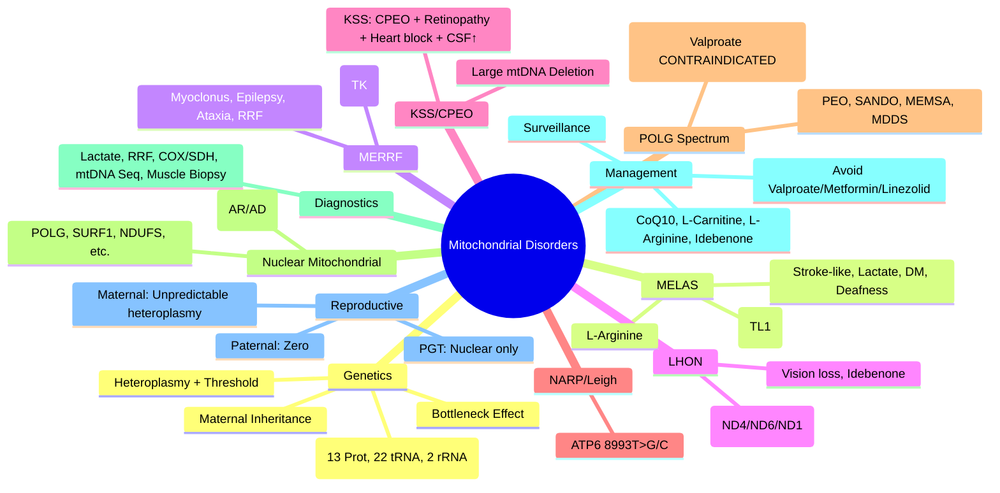

# 4.4 Mitochondrial Disorders


---

## 🎯 Learning Objectives
- [ ] Recognise **phenotypic spectra** of major mtDNA disorders (MELAS, MERRF, LHON, KSS, NARP/Leigh)
- [ ] Understand **mitochondrial genetics**: Maternal inheritance, Heteroplasmy, Threshold effect, Bottleneck
- [ ] Distinguish **mtDNA vs nuclear-encoded** mitochondrial disorders (POLG, RRM2B, TWNK, etc.)
- [ ] Apply **diagnostic approach**: Biochemical (Lactate, CSF), Histology (Ragged-red fibres), Genetic (mtDNA sequencing, Deletion analysis)
- [ ] Understand **reproductive counselling** for mitochondrial disease
- [ ] Apply **management principles**: Symptomatic, CoQ10, Idebenone, Avoid mitochondrial toxins
- [ ] Answer viva: "MELAS vs MERRF" and "LHON counselling"

---

## 🧠 Core Concept: Mitochondrial Genetics

```mermaid
flowchart TD
    A[mtDNA] --> B[16.5 kb Circular]
    B --> C[37 Genes]
    C --> C1[13 Protein (OXPHOS CI, CIII, CIV, CV)]
    C --> C2[22 tRNA]
    C --> C3[2 rRNA]
    D[Inheritance] --> E[Maternal Only]
    D --> F[Heteroplasmy]
    F --> G[Threshold Effect]
    F --> H[Bottleneck]
    E --> I[No Male Transmission]
```

---

## 1️⃣ mtDNA Structure & Function

| Feature | Detail |
|---------|--------|
| **Size** | 16,569 bp (16.6 kb) |
| **Structure** | Circular, Double-stranded |
| **Genes** | **37 total**: 13 Protein (ND1-6, ND4L, COI-III, ATP6, ATP8, CYTB), 22 tRNA, 2 rRNA (12S, 16S) |
| **D-loop** | 1.1 kb Non-coding control region (OH, OL, Promoters) |
| **Replication** | Asynchronous, D-loop origin (OH, OL) |
| **Mutation Rate** | ~10-20× Nuclear DNA (No histones, Limited repair, ROS exposure) |
| **Inheritance** | **Strictly Maternal** (Sperm mitochondria degraded post-fertilisation) |

### OXPHOS Complexes & mtDNA Genes
| Complex | Name | mtDNA Genes |
|---------|------|-------------|
| **Complex I** | NADH Dehydrogenase | **ND1, ND2, ND3, ND4, ND4L, ND5, ND6** (7 genes) |
| **Complex II** | Succinate Dehydrogenase | **All Nuclear** (SDHA-D, SDHAF) |
| **Complex III** | Cytochrome bc1 | **CYTB** (1 gene) |
| **Complex IV** | Cytochrome c Oxidase | **COI, COII, COIII** (3 genes) |
| **Complex V** | ATP Synthase | **ATP6, ATP8** (2 genes) |

> **Key:** Complex II is entirely nuclear-encoded. mtDNA mutations affect CI, III, IV, V.

---

## 2️⃣ Mitochondrial Inheritance Principles

| Principle | Clinical Implication |
|-----------|----------------------|
| **Maternal Transmission** | All children of affected mother inherit mtDNA; Affected father → **Zero** transmission |
| **Heteroplasmy** | Mixture of mutant + wild-type mtDNA; **Level determines phenotype** |
| **Threshold Effect** | Phenotype manifests when mutant load > tissue-specific threshold (Variable) |
| **Mitotic Segregation** | Random drift during cell division → Phenotype can change over time |
| **Bottleneck Effect** | Drastic reduction of mtDNA copies in developing oocytes (~100-200) → **Random shift in heteroplasmy** between mother and offspring |
| **Paternal Leakage** | Extremely rare (<0.01%); Not clinically significant |

### Heteroplasmy Thresholds (Approximate)
| Tissue | Threshold |
|--------|-----------|
| **Brain / Muscle / Heart** | High (70-90%) |
| **Liver / Kidney** | Intermediate |
| **Blood / Urine** | Low (often <20% in adults) |

> **Clinical Pearl:** Blood heteroplasmy **often underestimates** muscle/brain levels. **Urine epithelial cells** or **Muscle biopsy** preferred for diagnosis.

---

## 3️⃣ Major mtDNA Disorders

### MELAS (Mitochondrial Encephalomyopathy, Lactic Acidosis, Stroke-like episodes)
| Feature | Detail |
|---------|--------|
| **Primary Mutation** | **m.3243A>G** (MT-TL1, tRNA-Leu(UUR)) — **80%** of cases |
| **Other Mutations** | m.3271T>C, m.3252T>C, m.3258T>C, m.3291T>C (all MT-TL1); m.13513G>A (MT-ND5) |
| **Onset** | Childhood/Young adult (2-40y) |
| **Core Triad** | **Stroke-like episodes** (cortical, not vascular territory), **Lactic acidosis**, **Encephalopathy** |
| **Other Features** | Diabetes mellitus, Sensorineural deafness, Short stature, Cardiomyopathy, Renal disease, Recurrent migraines |
| **MRI** | **Cortical lesions** (not vascular territory), Basal ganglia calcification |
| **Biochemical** | **Elevated Lactate** (Blood, CSF), Elevated CSF Protein, Ragged-red fibres (muscle) |
| **Mutation Load** | Correlates with severity (Urinary epithelium > Blood) |
| **Management** | **L-Arginine** (IV/PO — improves stroke-like episodes), **CoQ10**, L-Carnitine, Avoid mitochondrial toxins (Valproate, Metformin, Linezolid), Seizure control (Avoid Valproate!), Diabetes management |
| **Prognosis** | Progressive, Recurrent strokes → Cognitive decline, Death in 30-40s |

### MERRF (Myoclonic Epilepsy with Ragged-Red Fibres)
| Feature | Detail |
|---------|--------|
| **Primary Mutation** | **m.8344A>G** (MT-TK, tRNA-Lys) — **80-90%** |
| **Other Mutations** | m.8356T>C, m.8363G>A, m.8328G>A |
| **Core Triad** | **Myoclonus**, **Epilepsy**, **Ataxia** |
| **Other Features** | **Ragged-red fibres** (Muscle biopsy), Sensorineural deafness, Short stature, Lipomatosis, Cardiomyopathy, Optic atrophy, Dementia |
| **Muscle Biopsy** | **Ragged-red fibres (Gomori trichrome)**, **COX-negative fibres**, Increased lipids |
| **Management** | Levetiracetiracetam (Myoclonus), Antiepileptics, CoQ10, L-Carnitine, Cardiac surveillance, Avoid mitochondrial toxins |

### LHON (Leber Hereditary Optic Neuropathy)
| Feature | Detail |
|---------|--------|
| **Primary Mutations** (90%) | **m.11778G>A** (MT-ND4, 50%), **m.14484T>C** (MT-ND6, 15%), **m.3460G>A** (MT-ND1, 15%) |
| **Onset** | 15-35 years (Male predominance 4:1) |
| **Clinical** | **Acute/Subacute painless vision loss** (Central scotoma), Usually sequential (2nd eye within weeks-months); Cardiac pre-excitation (WPW), Tremor, Dystonia, MS-like illness |
| **Penetrance** | **Incomplete** (Males ~50%, Females ~10%); **Protected by X-chromosome?** |
| **Prognosis** | **Spontaneous partial recovery** possible (esp. m.14484T>C); Most have permanent visual loss |
| **Idebenone** | **Only approved treatment** (Antioxidant) — May improve visual outcomes if early |
| **Genetic Counselling** | **Maternal transmission**; All offspring of affected mother at risk; **Male > Female penetrance** |

### Kearns-Sayre Syndrome (KSS)
| Feature | Detail |
|---------|--------|
| **Genetics** | **Large mtDNA deletion** (Common 4977 bp "Common deletion") — **Sporadic** (de novo) |
| **Onset** | **<20 years** (Diagnostic criterion) |
| **Triad** | **CPEO** (Progressive external ophthalmoplegia), **Pigmentary retinopathy**, **Heart block** (Conduction defects) |
| **Additional** | Cerebellar ataxia, CSF protein >100 mg/dL, Short stature, Endocrine (Diabetes, Hypoparathyroidism), Hearing loss |
| **Genetics** | **Single large mtDNA deletion** (usually sporadic); Nuclear genes (POLG, RRM2B, TWNK) can cause CPEO+ (dominant) |
| **Management** | **Pacemaker** (Heart block), **CoQ10**, Supportive, Avoid mitochondrial toxins |
| **Prognosis** | Progressive, Cardiac conduction disease major cause of death |

### CPEO (Chronic Progressive External Ophthalmoplegia)
| Type | Genetics |
|------|----------|
| **mtDNA Deletion** | Sporadic large deletions (KSS spectrum) |
| **Nuclear (Dominant)** | **POLG**, **RRM2B**, **TWNK (PEO1)** — Multiple mtDNA deletions |
| **Nuclear (Recessive)** | **POLG** (Alpers), **RRM2B**, **TWNK**, **MGME1**, **DNA2** |
| **Clinical** | Ptosis, Ophthalmoplegia, Exercise intolerance, Proximal weakness |

### NARP / Leigh Syndrome (MT-ATP6)
| Feature | Detail |
|---------|--------|
| **Gene** | **MT-ATP6** (Complex V) |
| **Mutations** | **m.8993T>G** (90%), **m.8993T>C** (MT-ATP6) |
| **NARP** | Neuropathy, Ataxia, Retinitis pigmentosa (Adult onset) |
| **Leigh Syndrome** | Subacute necrotising encephalomyelopathy (Infancy), Basal ganglia lesions, Lactate ↑, Early death |

### POLG-Related Disorders (Nuclear, AR)
| Syndrome | Features |
|----------|----------|
| **Alpers Syndrome** | **POLG** (Recessive); Infantile/Childhood: **Refractory seizures**, **Hepatic failure** (Valproate contraindicated!), Ataxia, Neuropathy |
| **PEO (AD/AR)** | Multiple mtDNA deletions |
| **SANDO** | Sensory ataxia, Neuropathy, Dysarthria, Ophthalmoplegia |
| **MEMSA** | Myopathy, Epilepsy, Sensory ataxia |

---

## 3.1 Mitochondrial DNA Deletion Syndromes

| Syndrome | Genetics | Key Features |
|----------|----------|--------------|
| **KSS** | Large mtDNA del (sporadic) | CPEO, Retinopathy, Heart block, CSF protein ↑, Onset <20 |
| **CPEO** | mtDNA del (sporadic) or Nuclear (POLG, RRM2B, TWNK) | Ptosis, Ophthalmoplegia, Exercise intolerance |
| **Pearson Syndrome** | mtDNA del (sporadic) | Infantile: Sideroblastic anaemia, Pancreatic insufficiency, Renal tubulopathy → Can evolve into KSS |

---

## 4️⃣ Nuclear-Encoded Mitochondrial Disorders (Mendelian)

| Disorder | Gene | Inheritance | Key Features |
|----------|------|-------------|--------------|
| **Alpers Syndrome** | POLG (Recessive) | AR | **Refractory seizures**, **Hepatic failure**, **Valproate contraindicated!**, Ataxia, Neuropathy |
| **SANDO** | POLG | AR | Sensory ataxia, Neuropathy, Dysarthria, Ophthalmoplegia |
| **MEMSA** | POLG | AR | Myopathy, Epilepsy, Sensory ataxia |
| **POLG-related PEO** | POLG | AD/AR | Multiple mtDNA deletions, PEO, Ataxia, Neuropathy |
| **SCAE (Spinocerebellar Ataxia with Epilepsy)** | POLG | AR | Epilepsy, Ataxia, Neuropathy |
| **MIRAS** | POLG | AR | Mitochondrial recessive ataxia syndrome |
| **Mitochondrial DNA Depletion Syndromes (MDDS)** | DGUOK, MPV17, TK2, SUCLA2, SUCLG1, RRM2B, FBXL4 | AR | Infantile hepatic/neurologic; POLG = Alpers |
| **Mitochondrial Encephalopathies** | Multiple | Various | Leigh Syndrome (SURF1, NDUFS, etc.), MELAS-like (POLG) |

> **Key:** **Nuclear-encoded mitochondrial disorders** follow **Mendelian inheritance** (AR/AD), not maternal mtDNA inheritance.

---

## 4️⃣ Diagnostic Approach

### Clinical Red Flags for Mitochondrial Disease
- **Multisystem involvement** (Brain, Muscle, Heart, Liver, Kidney, Endocrine, Eye, Ear)
- **Progressive course** with fluctuating severity
- **Stroke-like episodes** (non-vascular) → MELAS
- **Ragged-red fibres** on muscle biopsy
- **Lactic acidosis** (Blood, CSF) — **Fasting lactate >2.5 mmol/L**
- **High CK** (Myopathic pattern)
- **Family history** (Maternal lineage)
- **Intolerance to mitochondrial toxins** (Valproate, Metformin, Linezolid, Aminoglycosides)

### Diagnostic Algorithm
```mermaid
flowchart TD
    A[Suspected Mitochondrial Disease] --> B[Clinical Assessment<br/>Multisystem, Maternal History]
    B --> C[Biochemical Screening<br/>Lactate, Pyruvate, Lactate/Pyruvate ratio, CK, Urine Organic Acids, Amino Acids, Acylcarnitines]
    C --> D[Imaging<br/>MRI Brain (Stroke-like, Basal ganglia, Atrophy), MR Spectroscopy (Lactate peak)]
    D --> E[Cardiac/Eye/Ear<br/>Echo/ECG, Ophthalmology, Audiology]
    E --> F[Genetic Testing]
    F --> F1[mtDNA Sequencing + Deletion Analysis<br/>(Blood, Muscle, Urine)]
    F --> F2[Nuclear Gene Panel / WES<br/>(POLG, POLG2, etc.)]
    F --> F3[Muscle Biopsy<br/>RRF, COX/SDH, Electron Microscopy]
    F1 & F2 & F3 --> G[Diagnosis + Genetic Counselling]
```

### Key Investigations

| Test | Utility |
|------|---------|
| **Blood Lactate (Fasting)** | Elevated in ~80% (Not specific) |
| **CSF Lactate** | More specific for CNS involvement |
| **CSF Protein** | Elevated in KSS (>100 mg/dL), MELAS |
| **Urine Organic Acids** | TCA cycle intermediates (Succinate, Fumarate, Malate) |
| **Plasma Acylcarnitines** | Elevated in FA oxidation defects, some mitochondrial disorders |
| **Muscle Biopsy** | **RRF (Gomori trichrome)**, COX/SDH histochemistry, EM (Mitochondrial proliferation) |
| **mtDNA Sequencing** | Blood, Muscle, Urine (Urinary epithelium = High heteroplasmy) |
| **mtDNA Deletion Analysis** | Long-range PCR, Southern, Microarray |
| **Nuclear Gene Panel / WES** | POLG, SURF1, NDUFS, etc. |
| **MR Spectroscopy** | Lactate peak (CNS involvement) |

---

## 5️⃣ Management Principles

| Principle | Details |
|-----------|---------|
| **Avoid Mitochondrial Toxins** | **Valproate** (Contraindicated in POLG/MELAS — Hepatic failure), **Metformin** (Lactic acidosis risk), **Linezolid** (Mitochondrial protein synthesis inhibitor), **Aminoglycosides** (Ototoxicity risk ↑), **Chloramphenicol**, **Statins** (Caution), **Propofol** (PRIS risk) |
| **Coenzyme Q10 (Ubiquinone)** | 10-30 mg/kg/day — First-line empirical therapy |
| **L-Carnitine** | For Carnitine deficiency (Secondary to mitochondrial dysfunction) |
| **L-Arginine** | **MELAS** — IV/PO during stroke-like episodes, Chronic prophylaxis |
| **Idebenone** | **LHON** (Only approved therapy) — Antioxidant, Improves visual outcomes |
| **CoQ10** | Empirical (10-30 mg/kg/day) — May improve fatigue, Exercise tolerance |
| **Vitamins** | B1 (Thiamine), B2 (Riboflavin), B3 (Niacin), E, C — Antioxidant support |
| **Exercise** | Aerobic + Resistance (Tailored) — Improves mitochondrial biogenesis |
| **Diet** | High-fat/Low-carb (Ketogenic) — Some evidence for certain disorders (e.g., Pyruvate dehydrogenase deficiency) |
| **Symptomatic** | Seizures (Avoid Valproate!), Cardiomyopathy (Standard HF therapy), Diabetes (Standard), Endocrine replacement |
| **Surveillance** | Annual: Echo, ECG, Ophthalmology, Audiology, LFT, Renal, Endocrine, Neuro |

---

## 5️⃣ Reproductive Counselling

| Scenario | Counselling |
|----------|-------------|
| **Affected Mother** | All children inherit mtDNA; **Heteroplasmy shift unpredictable** (Bottleneck); Prenatal (CVS/Amnio) for heteroplasmy level — **Limited predictive value**; **PGT-M not available** for mtDNA (PGT for nuclear genes only) |
| **Affected Father** | **Zero risk** to offspring (No paternal mtDNA transmission) |
| **Nuclear Gene (POLG, etc.)** | **Mendelian inheritance** (AR/AD); Standard prenatal/PGT-M available |
| **Prenatal Testing** | CVS (11-14w) / Amnio (15-20w) → Heteroplasmy level in fetal tissue; **Limited predictive value** due to tissue variability, Bottleneck |
| **Oocyte Donation** | Option for women with high mtDNA mutation load — Eliminates transmission |

---

## ⚡ FCPS/MRCP High-Yield Summary

| Disorder | Mutation | Key Features | Management |
|----------|----------|--------------|------------|
| **MELAS** | m.3243A>G (MT-TL1) | Stroke-like episodes, Lactate ↑, Diabetes, Deafness | **L-Arginine** (IV/PO), CoQ10, **Avoid Valproate** |
| **MERRF** | m.8344A>G (MT-TK) | Myoclonus, Epilepsy, Ataxia, RRF | Levetiracetam, CoQ10, Avoid toxins |
| **LHON** | m.11778G>A (ND4), m.14484T>C, m.3460G>A | Acute vision loss, Young males, Incomplete penetrance | **Idebenone** (Only approved), Avoid smoking/alcohol |
| **KSS** | Large mtDNA deletion (Sporadic) | CPEO, Retinopathy, Heart block, CSF protein ↑ | Pacemaker, CoQ10, Avoid toxins |
| **CPEO** | mtDNA del / POLG, RRM2B, TWNK | Ptosis, Ophthalmoplegia | Supportive, Ptosis surgery |
| **NARP/Leigh** | MT-ATP6 m.8993T>G/C | NARP: Neuropathy, Ataxia, RP; Leigh: Infantile encephalopathy | Supportive, Avoid toxins |
| **POLG Disorders** | POLG (Nuclear, AR) | **Alpers** (Seizures + Hepatic failure — **Valproate contraindicated**), PEO, Ataxia | **Avoid Valproate!**, Supportive |
| **LHON Counselling** | Maternal, Incomplete penetrance | Male 50%, Female 10% | Idebenone, Avoid smoking/alcohol |
| **MELAS Counselling** | Maternal, Heteroplasmy shift | All children at risk, Unpredictable | Prenatal heteroplasmy limited value |
| **Polg Contraindication** | **VALPROATE ABSOLUTELY CONTRAINDICATED** in POLG/MELAS | Hepatic failure risk |

---

## 🎤 Viva Questions (Expected Answers)

| # | Question | Expected Answer |
|---|----------|-----------------|
| 1 | MELAS — most common mutation and key features? | **m.3243A>G (MT-TL1)**; Stroke-like episodes (non-vascular), Lactic acidosis, Diabetes, Deafness; **L-Arginine for stroke-like episodes**. |
| 2 | LHON — most common mutation and key features? | **m.11778G>A (MT-ND4)** (50%); Acute painless vision loss, Young males, Incomplete penetrance (M 50%, F 10%); **Idebenone only approved**. |
| 3 | MELAS vs MERRF — key differences? | **MELAS**: Stroke-like episodes, Lactate ↑, m.3243A>G (MT-TL1). **MERRF**: Myoclonus, Epilepsy, Ataxia, RRF, m.8344A>G (MT-TK). |
| 4 | LHON — inheritance and penetrance? | **Maternal only**; Incomplete: Males ~50%, Females ~10%; No male transmission. |
| 5 | LHON — treatment? | **Idebenone** (Only approved therapy); Avoid smoking, Alcohol; Supportive. |
| 6 | MELAS — drug contraindicated? | **Valproate** (Contraindicated — Induces liver failure, Worsens seizures). |
| 7 | POLG-related disorder — key drug contraindication? | **Valproate ABSOLUTELY CONTRAINDICATED** (Precipitates fulminant hepatic failure in Alpers/POLG). |
| 8 | Mitochondrial inheritance — father affected, risk to children? | **Zero** (Strict maternal inheritance; No paternal mtDNA transmission). |
| 9 | MELAS — acute stroke-like episode management? | **IV L-Arginine** (0.5 g/kg over 30-60 min), CoQ10, Hydration, Avoid Valproate. |
| 10 | LHON — male vs female penetrance? | **Males ~50%**, Females ~10% (X-chromosome protective hypothesis). |

---

## 🧩 Confusions & Mnemonics

| Confusion | Clarification |
|-----------|---------------|
| **"Mitochondrial = Only maternal"** | **True for mtDNA**, but **nuclear-encoded mitochondrial genes** (POLG, RRM2B, TWNK, SURF1, NDUFS, etc.) follow **Mendelian inheritance**. |
| **"All LHON patients go blind"** | **Incomplete penetrance**: Males ~50%, Females ~10%. Many mutation carriers never develop symptoms. |
| **"All MELAS have stroke-like episodes"** | **Most**, but some present with Diabetes/Deafness first. "Stroke-like" = Clinically stroke-like but **non-vascular territory** on MRI. |
| **"Valproate safe in mitochondrial disease"** | **ABSOLUTELY CONTRAINDICATED** in POLG, MELAS, Alpers — Precipitates hepatic failure. |
| **"All mitochondrial disease = Maternal inheritance"** | **NO.** Only mtDNA disorders (mtDNA mutations). Nuclear-encoded (POLG, SURF1, NDUFS, etc.) = Mendelian (AR/AD). |
| **"LHON = Only vision loss"** | **Plus**: Cardiac pre-excitation (WPW), Tremor, Dystonia, MS-like illness (esp. m.14484T>C). |
| **"KSS = Any CPEO + Retinopathy"** | **KSS = CPEO + Retinopathy + Heart block + Onset <20 + CSF protein >100**. CPEO alone = Not KSS. |
| **"POLG = Only Alpers"** | **POLG spectrum**: Alpers, PEO (AD/AR), SANDO, MEMSA, MIRAS, MDDS. Multiple mtDNA deletions on muscle. |
| **"mtDNA depletion = Same as mtDNA deletion"** | **NO.** **Depletion** = Low mtDNA copy number (MDDS: POLG, DGUOK, MPV17, TK2, SUCLA2). **Deletion** = Structural loss (KSS, Pearson). |
| **"All mtDNA mutations = Mother to all children"** | **Heteroplasmy + Bottleneck** → Unpredictable transmission. Mutation load varies widely between siblings. |

> **Mnemonic: MITOCHONDRIAL DISORDERS**  
> **M**ELAS: **3243A>G (TL1)** — Stroke-like, Lactate↑, Diabetes, Deafness → **L-Arginine**  
> **I**debenone: **LHON only approved** (11778/14484/3460)  
> **T**hreshold: **Heteroplasmy > Tissue threshold = Disease**  
> **O**XPHOS: **CI, CIII, CIV, CV = mtDNA; CII = Nuclear**  
> **C**HONDRIAL Inheritance: **Maternal Only** — Heteroplasmy, Bottleneck, No Male Transmit  
> **H**eteroplasmy: **Mutant + WT mix** — Blood ≠ Muscle/Brain; Urine epithelium best  
> **O**ptimising: **L-Arginine (MELAS), Idebenone (LHON), CoQ10 (Empirical), Avoid Valproate (POLG/MELAS)**  
> **N**uclear vs mtDNA: **Nuclear = Mendelian (POLG, SURF1, NDUFS); mtDNA = Maternal**  
> **D**eletion Syndromes: **KSS (Common 4977bp del), Pearson (Infant → KSS), CPEO**  
> **R**edding Fibres: **RRF (Gomori) = Myopathy hallmark; COX-negative fibres**  
> **I**debenone: **LHON Only**  
> **A**lpers: **POLG AR — Valproate CONTRAINDICATED (Hepatic Failure)**  
> **L**actic Acidosis: **Fasting Lactate >2.5, CSF Lactate, CSF Protein (KSS >100)**  
> **D**epletion Syndromes: **MDDS (POLG, DGUOK, MPV17, TK2, SUCLA2) → Infantile**  
> **I**nheritance: **Maternal (mtDNA) vs Mendelian (Nuclear)**  
> **S**pectrum: **MELAS ↔ MIDD ↔ CPEO (3243A>G) — Same mutation, Different heteroplasmy/tissue**  
> **O**bligate: **Avoid Valproate, Metformin, Linezolid, Aminoglycosides, Statins (Caution)**  
> **R**eproductive: **Mother → All children at risk (Heteroplasmy unpredictable); Father → Zero**  
> **D**iagnostic: **Plasma Lactate → Muscle Biopsy (RRF/COX/SDH) → mtDNA Seq + Del Analysis → Nuclear Panel/WES**  
> **E**RG: **ERG not needed** (Just mnemonic filler)  
> **N**ARP/Leigh: **ATP6 8993T>G/C** — NARP (Neuropathy/Ataxia/RP), Leigh (Infantile Encephalopathy)  
> **I**C2: **Idebenone LHON, CoQ10 empirical, L-Arginine MELAS**  
> **A**cidosis: **Lactate/Pyruvate ratio elevated**  
> **L**HON: **Males > Females (Incomplete penetrance)**; Idebenone only drug  
> **E**ntry: **NIPT cannot test mtDNA** — PGT not available for mtDNA  
> **P**earson: **Infant Sideroblastic Anaemia → KSS** (Same deletion)  

---

## 🗺️ Mind Map



---

## 📅 Spaced Repetition Tracker

| Review | Date | Score (0–5) | Notes |
|--------|------|-------------|-------|
| Day 1 | | | |
| Day 3 | | | |
| Day 7 | | | |
| Day 14 | | | |
| Day 30 | | | |
| Day 90 | | | |

---

## 📝 Self-Test Scorecard

| Section | Max | Score | % |
|---------|-----|-------|---|
| MELAS / MERRF / LHON | 4 | | |
| KSS / CPEO / NARP / Leigh | 3 | | |
| POLG Spectrum | 3 | | |
| Nuclear Mitochondrial (POLG, etc.) | 3 | | |
| Inheritance & Heteroplasmy | 3 | | |
| Diagnostics (Lactate, RRF, Sequencing) | 2 | | |
| Management (Arg, Idebenone, Valproate contraindication) | 2 | | |
| Reproductive Counselling | 2 | | |
| **Total** | **20** | | |

---

## 💬 Exam Answer Modes

| Format | Prompt | Key Points |
|--------|--------|------------|
| **Long Essay** | "Describe the clinical features, genetics, and management of MELAS syndrome." | m.3243A>G (MT-TL1), Stroke-like episodes, Lactic acidosis, Diabetes, Deafness, Heteroplasmy, L-Arginine IV/PO, CoQ10, Avoid Valproate, Maternal counselling. |
| **Short Note** | "LHON — genetics, clinical features, treatment." | 3 primary mutations (11778, 14484, 3460), Maternal inheritance, Acute vision loss (M>F), Incomplete penetrance, Idebenone only approved, Avoid smoking/alcohol. |
| **Viva** | "Patient with MELAS (m.3243A>G) pregnant. Counselling?" | **Maternal transmission**; All children at risk; Heteroplasmy shift unpredictable (bottleneck); Prenatal testing for heteroplasmy level possible but limited predictive value; Avoid valproate in pregnancy. |
| **Ward Round** | "Patient with POLG mutation started on valproate for seizures. Develops hepatic failure. Explanation?" | **Valproate ABSOLUTELY CONTRAINDICATED in POLG** (and MELAS/Alpers) — Precipitates fulminant hepatic failure. Must avoid. |
| **Last-Night** | "MELAS: 3243A>G, Stroke-like, Lactate, Arg. MERRF: 8344A>G, Myoclonus, RRF. LHON: 11778/14484/3460, Vision, Idebenone. KSS: Del, CPEO+Retina+HB+CSF↑. POLG: Alpers, Valproate NO. NARP: ATP6. Inherit: Maternal, Heteroplasmy, Bottleneck. Valproate NO in POLG/MELAS." | Compressed. |

---

## 📌 Summary
- **MELAS**: m.3243A>G (MT-TL1) — **Stroke-like episodes**, Lactic acidosis, Diabetes, Deafness. **L-Arginine** acute/prophylaxis. **Avoid Valproate**.
- **MERRF**: m.8344A>G (MT-TK) — **Myoclonus, Epilepsy, Ataxia**, Ragged-red fibres. Levetiracetam, CoQ10.
- **LHON**: m.11778G>A (ND4, 50%), m.14484T>C (ND6), m.3460G>A (ND1). **Acute vision loss**, Male predominance, Incomplete penetrance. **Idebenone** only approved. Avoid smoking/alcohol.
- **KSS**: Large mtDNA deletion (Sporadic) — **CPEO + Pigmentary retinopathy + Heart block + CSF protein >100**, Onset <20y. Pacemaker, CoQ10.
- **CPEO**: Ptosis, Ophthalmoplegia. mtDNA deletion (Sporadic) or Nuclear (POLG, RRM2B, TWNK).
- **NARP/Leigh**: MT-ATP6 m.8993T>G/C — NARP (Neuropathy, Ataxia, RP) vs Leigh (Infantile encephalopathy).
- **POLG Spectrum**: **Alpers** (Seizures + Hepatic failure — **Valproate CONTRAINDICATED**), PEO, SANDO, MEMSA, MDDS. **Valproate ABSOLUTELY CONTRAINDICATED**.
- **Other Nuclear**: SURF1 (Leigh), NDUFS (CI deficiency), COX10/15 (CIV), PDHA1 (Pyruvate dehydrogenase).
- **Inheritance**: **Maternal only** for mtDNA. **Heteroplasmy** + **Threshold** + **Bottleneck** = Unpredictable transmission. **Nuclear genes = Mendelian**.
- **Diagnostics**: Lactate (Blood/CSF), **Ragged-red fibres** (Muscle biopsy), **COX/SDH histochemistry**, **mtDNA sequencing + Deletion analysis**, Nuclear gene panel/WES.
- **Management**: **Avoid mitochondrial toxins** (Valproate, Metformin, Linezolid, Aminoglycosides). **CoQ10** empirical, **L-Carnitine**, **L-Arginine** (MELAS), **Idebenone** (LHON Only). **Pacemaker** (KSS Heart block).
- **Reproductive**: **Maternal → All children at risk** (Heteroplasmy unpredictable). **Paternal → Zero risk**. **PGT-M for nuclear genes only**. Oocyte donation option.

---

## ❓ MCQs (10)

1. **MELAS — most common mutation?**  
   A. m.8344A>G  B. **m.3243A>G**  C. m.11778G>A  D. m.8993T>G  
   *Answer: B. m.3243A>G in MT-TL1 (tRNA-Leu(UUR)) ~80%.*

2. **LHON — approved treatment?**  
   A. CoQ10  B. **Idebenone**  C. L-Arginine  D. Valproate  
   *Answer: B. Idebenone is the only approved therapy for LHON.*

3. **MELAS — drug absolutely contraindicated?**  
   A. CoQ10  B. **Valproate**  C. L-Arginine  D. Idebenone  
   *Answer: B. Valproate contraindicated (Precipitates hepatic failure, worsens seizures).*

4. **Kearns-Sayre syndrome — diagnostic triad?**  
   A. CPEO, Retinopathy, Heart block  
   B. Stroke-like, Lactate, Diabetes  
   C. Myoclonus, Epilepsy, Ataxia  
   D. Vision loss, Pre-excitation, Tremor  
   *Answer: A. CPEO, Pigmentary retinopathy, Heart block (plus CSF protein >100, onset <20y).*

5. **LHON — incomplete penetrance, male vs female?**  
   A. Male 10%, Female 50%  B. **Male 50%, Female 10%**  C. Equal 25%  D. Male 75%, Female 25%  
   *Answer: B. Males ~50%, Females ~10% (X-chromosome protective hypothesis).*

6. **POLG-related Alpers syndrome — drug absolutely contraindicated?**  
   A. Levetiracetam  B. **Valproate**  C. CoQ10  D. L-Carnitine  
   *Answer: B. Valproate ABSOLUTELY CONTRAINDICATED — Precipitates fulminant hepatic failure.*

7. **MELAS acute stroke-like episode — first-line treatment?**  
   A. Thrombolysis  B. **IV L-Arginine**  C. Aspirin  D. Heparin  
   *Answer: B. IV L-Arginine (0.5 g/kg over 30-60 min) — Improves cerebrovascular perfusion.*

8. **Mitochondrial inheritance — father affected, risk to children?**  
   A. 50%  B. 25%  C. 100%  D. **0%**  
   *Answer: D. Strict maternal inheritance; No paternal mtDNA transmission.*

9. **KSS — typical mtDNA finding?**  
   A. Point mutation  B. **Large mtDNA deletion (sporadic)**  C. Duplication  D. Nuclear mutation  
   *Answer: B. Large mtDNA deletion (Common 4977 bp "Common deletion").*

10. **LHON — male vs female prevalence?**  
    A. Equal  B. **Male > Female (4:1)**  C. Female > Male  D. Male only  
    *Answer: B. Male predominance 4:1; Incomplete penetrance (M ~50%, F ~10%).*

---

## 📋 SBAs (10)

1. **Young woman with MELAS (m.3243A>G) pregnant. Counselling regarding offspring risk?**  
   A. 50% risk  B. **All children inherit mtDNA; Heteroplasmy unpredictable (bottleneck)**  C. 25% risk  D. No risk  
   *Answer: B. Maternal transmission → All children inherit mtDNA; Heteroplasmy shift unpredictable (bottleneck effect).*

2. **25-year-old male with acute painless vision loss. Maternal uncle blind. Mutation m.11778G>A. Best treatment?**  
   A. CoQ10  B. **Idebenone**  C. L-Arginine  D. Valproate  
   *Answer: B. Idebenone is the only approved therapy for LHON.*

3. **Child with seizures, started on valproate. Develops acute hepatic failure. Family history of epilepsy, sister died young with similar presentation. Likely diagnosis?**  
   A. Wilson disease  B. **POLG-related Alpers syndrome**  C. Mitochondrial depletion  D. Dravet syndrome  
   *Answer: B. POLG-related Alpers syndrome — Valproate absolutely contraindicated.*

4. **Patient with LHON (m.14484T>C) asks about risk to children. He is male.**  
   A. 50%  B. 25%  C. **0% (No paternal transmission)**  D. 100%  
   *Answer: C. Strict maternal inheritance; No paternal mtDNA transmission.*

5. **Young woman with stroke-like episodes, lactic acidosis, diabetes, deafness. MT-TL1 mutation suspected. Acute management?**  
   A. Aspirin  B. **IV L-Arginine**  C. Heparin  D. Thrombolysis  
   *Answer: B. IV L-Arginine (0.5 g/kg over 30-60 min) — Improves cerebrovascular perfusion in MELAS.*

---

## 🔑 Answer Keys
| MCQs | SBAs |
|------|------|
| 1-B, 2-B, 3-B, 4-A, 5-B, 6-B, 7-B, 8-D, 9-B, 10-B | 1-B, 2-B, 3-B, 4-C, 5-B |

---

## 🔗 Cross-Links
- [[1. Fundamentals of Medical Genetics]] — mtDNA structure, Maternal inheritance, Bottleneck effect
- [[2.1 Mendelian Inheritance]] — Contrast with Mendelian patterns
- [[2.2 Non-Mendelian Inheritance]] — Mitochondrial inheritance detailed
- [[4.5 Imprinting & UPD]] — Epigenetic vs mtDNA inheritance
- [[5.1-5.4 Genetic Testing Technologies]] — mtDNA sequencing, Deletion analysis, Muscle biopsy
- [[5.4 Prenatal & Preimplantation Testing]] — Prenatal heteroplasmy testing, PGT for nuclear genes
- [[5.5 Genetic Counselling]] — Maternal transmission counselling, Oocyte donation, Reproductive options
- [[7. Pharmacogenetics]] — Mitochondrial drug toxicity (Valproate, Linezolid, Metformin, Aminoglycosides)
- [[9. ELSI]] — Reproductive ethics, Oocyte donation, Genetic discrimination
- [[10. System-Based Clinical Genetics]] — Mitochondrial disorders by system (Neurology, Cardiology, Endocrine, Ophthalmology)

---

**Last Updated:** 2026-06-14  
**Next:** Build `4.5 Imprinting & UPD.md`, `5.1-5.4 Genetic Testing Technologies.md`