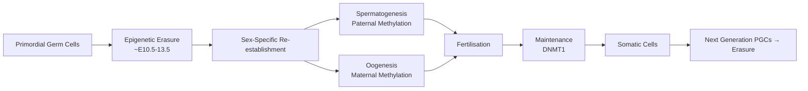

# 4.5 Genomic Imprinting & Uniparental Disomy (UPD)


---

## 🎯 Learning Objectives
- [ ] Explain **genomic imprinting** mechanism (Epigenetic, Parent-of-origin expression)
- [ ] Distinguish **Prader-Willi (PWS)** vs **Angelman (AS)** syndromes (15q11-13)
- [ ] Describe **Beckwith-Wiedemann (BWS)** and **Silver-Russell (SRS)** syndromes (11p15)
- [ ] Explain **UPD mechanisms** (Trisomy rescue, Gamete complementation, Monosomy rescue)
- [ ] Identify **UPD disorders** (UPD15, UPD11, UPD7, UPD14, UPD6)
- [ ] Apply **methylation testing** (MS-PCR, MS-MLPA, Pyrosequencing) for diagnosis
- [ ] Calculate **recurrence risks** for imprinting disorders
- [ ] Answer viva: "PWS vs AS molecular difference" and "BWS vs SRS opposite growth patterns"

---

## 🧠 Core Concept: Genomic Imprinting

```mermaid
flowchart TD
    A[Genomic Imprinting] --> B[Parent-of-Origin Expression]
    B --> C[Epigenetic Marks]
    C --> C1[DNA Methylation at DMRs]
    C --> C2[Histone Modifications]
    C --> C3[ncRNA (e.g., KCNQ1OT1, MEG3)]
    D[Establishment] --> E[Gametogenesis]
    E --> E1[Erased in PGCs]
    E --> E2[Re-established Sex-Specifically]
    F[Maintenance] --> G[Post-fertilisation]
    G --> H[DNMT1 Maintenance]
    I[Consequence] --> J[Biallelic Expression = Disease]
    I --> K[Loss of Function (LOF) = Disease]
```

### Key Definitions
| Term | Definition |
|------|------------|
| **Imprinted Gene** | Expressed from only one parental allele (Maternal OR Paternal) |
| **DMR (Differentially Methylated Region)** | CpG-rich region with parent-specific methylation |
| **ICR / IC (Imprinting Control Region)** | Regulates imprinting of a gene cluster |
| **Loss of Methylation (LoM)** | Hypomethylation at normally methylated DMR |
| **Gain of Methylation (GoM)** | Hypermethylation at normally unmethylated DMR |
| **CTCF** | Insulator protein; Binds unmethylated ICR → Blocks enhancer-promoter |

---

## 1️⃣ Mechanisms of Imprinting

### Epigenetic Regulation
| Mechanism | Description |
|-----------|-------------|
| **DNA Methylation** | 5-methylcytosine at CpG islands in DMRs; Established in gametogenesis; Maintained by DNMT1 |
| **Histone Modifications** | H3K4me3 (Active), H3K27me3 (Repressive), H3K9me3 (Heterochromatin) |
| **Non-coding RNA** | **KCNQ1OT1** (Silences paternal CDKN1C), **MEG3** (Silences paternal DLK1), **SNRPN** (Activates paternal cluster) |
| **CTCF Insulator** | Binds unmethylated ICR → Blocks enhancer-promoter interaction |

### Imprinting Cycle


---

## 2️⃣ Major Imprinting Disorders

### 15q11-q13 Region: Prader-Willi (PWS) vs Angelman (AS)

| Feature | **Prader-Willi Syndrome (PWS)** | **Angelman Syndrome (AS)** |
|---------|----------------------------------|----------------------------|
| **Gene Region** | **15q11-q13** (ICR at **SNRPN** promoter) | Same region |
| **Imprinted Genes** | **Paternal expressed**: SNRPN, NDN, MAGEL2, MKRN3, SNORD116 | **Maternal expressed**: **UBE3A** (brain-specific) |
| **ICR** | **SNRPN promoter** (IC) — Paternal methylation | **Same** — Maternal unmethylated |
| **Mechanisms** | 1. **Paternal deletion** 15q11-13 (~70%)<br/>2. **Maternal UPD15** (~25%)<br/>3. **Imprinting defect** (IC mutation/epimutation) <5%<br/>4. UBE3A point mutation (AS only) | 1. **Maternal deletion** 15q11-13 (~70%)<br/>2. **Paternal UPD15** (~3-7%)<br/>3. **Imprinting defect** <5%<br/>4. **UBE3A mutation** (~10%) |
| **Key Features** | **Neonatal hypotonia**, Poor feeding → **Hyperphagia/Obesity** (2-5y), **Hypogonadism**, Intellectual disability, Short stature, Small hands/feet, Behavioural (Skin picking, OCD) | **Severe ID**, Ataxia, **Happy demeanour** (Paroxysmal laughter), **Seizures** (EEG: High-amplitude slow), Microcephaly, Speech absent, "Puppet-like" gait |
| **Diagnostic Test** | **Methylation-specific PCR / MS-MLPA** for 15q11 (SNRPN DMR) | **Same** — Loss of maternal methylation = AS; Loss of paternal = PWS |
| **Methylation Pattern** | **Loss of paternal methylation** (Paternal allele silent) | **Loss of maternal methylation** (Maternal allele silent) |
| **Recurrence Risk** | De novo del: <1%; UPD: <1%; IC mutation: 50% | De novo del: <1%; UPD: <1%; IC mutation: 50%; UBE3A mut: 50% |
| **Prenatal/PGT** | Prenatal methylation PCR if familial IC mutation; PGT-M for IC mutations | Same + UBE3A sequencing |

### Key Differences Summary
| Aspect | PWS | AS |
|--------|-----|----|
| **Critical Parent** | **Paternal** contribution lost | **Maternal** contribution lost |
| **Key Gene** | SNRPN cluster (Paternal) | **UBE3A** (Maternal, brain-specific) |
| **Hyperphagia/Obesity** | **Yes (Hallmark)** | No |
| **Seizures** | Uncommon | **Yes (Hallmark)** |
| **Happy Demeanour** | No | **Yes (Hallmark)** |
| **Hyperphagia Onset** | 2-5 years | N/A |

---

## 3️⃣ 11p15.5 Region: Beckwith-Wiedemann (BWS) vs Silver-Russell (SRS)

### Imprinting Control Regions (ICRs)
| ICR | Genes Regulated | Methylation (Normal) |
|-----|-----------------|----------------------|
| **IC1 (H19/IGF2 DMR)** | **H19** (Maternal, ncRNA), **IGF2** (Paternal, Growth factor) | **Maternal Methylated**, Paternal Unmethylated |
| **IC2 (KCNQ1OT1 DMR)** | **KCNQ1OT1** (Paternal, ncRNA), **CDKN1C** (Maternal, Cell cycle inhibitor) | **Paternal Methylated**, Maternal Unmethylated |

### Beckwith-Wiedemann Syndrome (BWS) — Overgrowth
| Feature | Detail |
|---------|--------|
| **Mechanisms** | 1. **IC2 LoM (KCNQ1OT1 LoM)** ~50% (Paternal methylation lost → biallelic KCNQ1OT1 → CDKN1C silenced)<br/>2. **Paternal UPD11** ~20% (IC1 GoM + IC2 LoM) → Biallelic IGF2, No CDKN1C<br/>3. **IC1 GoM** (H19/IGF2 DMR) ~5% (IGF2 biallelic, H19 silenced)<br/>4. **CDKN1C mutation** (Maternal) ~5-10%<br/>5. **IC1 deletion** <1% |
| **Key Features** | **Macrosomia**, **Macroglossia**, **Omphalocele/Umbilical hernia**, **Hemihypertrophy**, **Wilms tumour** risk (~5-10%), **Neonatal hypoglycaemia**, Renal anomalies, Cardiac defects |
| **Diagnostic** | **Methylation MS-MLPA / Pyrosequencing** for 11p15 IC1/IC2; **CDKN1C sequencing** |
| **Molecular Subtypes** | **IC2 LoM** → Low CDKN1C, Normal IGF2; **UPD11/ IC1 GoM** → High IGF2, Low CDKN1C |
| **Tumour Surveillance** | **Abdominal US q3-4m** until age 7-8 (Wilms tumour, Hepatoblastoma, Neuroblastoma, Adrenocortical carcinoma) |
| **Recurrence Risk** | **De novo epigenetic** (IC2 LoM, IC1 GoM) → **<1%**; **Familial CDKN1C/IC mutation/UPD** → **50%** |

### Silver-Russell Syndrome (SRS) — Growth Restriction (Opposite of BWS)
| Feature | Detail |
|---------|--------|
| **Mechanisms** | 1. **IC1 LoM (H19/IGF2 DMR)** ~40-50% (Maternal methylation lost → H19 biallelic, IGF2 silenced)<br/>2. **Maternal UPD7** ~10% (Loss of paternal GRB10/IGF2)<br/>3. Other: IC2 GoM, CDKN1C mutation, 17q21 CNV |
| **Key Features** | **Severe IUGR**, **Postnatal growth failure**, **Relative macrocephaly**, **Triangular face**, **5th finger clinodactyly**, **Body asymmetry**, Feeding difficulties, Hypoglycaemia |
| **Diagnostic** | **Methylation MS-MLPA/Pyrosequencing** for 11p15 IC1/IC2; **Maternal UPD7** testing |
| **Recurrence Risk** | **De novo IC1 LoM** → **<1%**; **Familial IC1 mutation/UPD7** → **50%** |

### BWS vs SRS — Opposite Growth Phenotypes
| Feature | BWS (Overgrowth) | SRS (Growth Restriction) |
|---------|------------------|--------------------------|
| **IC1 (H19/IGF2)** | **GoM** → Biallelic IGF2 | **LoM** → IGF2 silenced |
| **IC2 (KCNQ1OT1)** | **LoM** → CDKN1C silenced | Normal |
| **ICD10** | Q87.3 | Q87.1 |
| **Tumour Risk** | **Wilms (5-10%)**, Hepatoblastoma | None |
| **UPD** | **Paternal UPD11** | **Maternal UPD7** |

---

## 3. Other Imprinting Disorders

| Disorder | Locus | Mechanism | Key Features |
|----------|-------|-----------|--------------|
| **Temple Syndrome** | 14q32 (DLK1/MEG3) | **Maternal UPD14** | Prenatal growth restriction, Hypotonia, Early puberty, Obesity |
| **Kagami-Ogata Syndrome** | 14q32 (DLK1/MEG3) | **Paternal UPD14** | Polyhydramnios, Distinctive face, **Coat-hanger ribs**, Placentomegaly |
| **Transient Neonatal Diabetes (TNDM)** | 6q24 (PLAGL1/HYMAI) | **Maternal UPD6** / **IC2 GoM (6q24)** | Neonatal diabetes (remits), Macroglossia, Macrocephaly, Umbilical hernia, Cardiac defects |
| **Pseudo-Hypoparathyroidism 1B** | 20q13 (GNAS) | **Maternal methylation defect** (IC LoM) | PTH resistance, AHO features absent |

---

## 4️⃣ Uniparental Disomy (UPD)

### Mechanisms of UPD Formation
| Mechanism | Process | Resulting UPD Type |
|-----------|---------|-------------------|
| **Trisomy Rescue** (Most common) | Trisomic zygote → Loss of one chromosome | **If lost chromosome from different parent → UPD** |
| **Gamete Complementation** | Nullisomic gamete + Disomic gamete → Normal chromosome number | UPD |
| **Monosomy Rescue** | Nullisomic gamete + Haploid gamete → Duplication of single chromosome | **Isodisomy** |
| **Post-fertilisation Error** | Trisomy → Mitotic loss → UPD | Heterodisomy / Isodisomy |

### UPD Types
| Type | Definition | Origin |
|-------|------------|--------|
| **Heterodisomy (UPDhet)** | Both homologous chromosomes from one parent | **Meiosis I error** (Non-disjunction MI) |
| **Isodisomy (UPDiso)** | Two identical copies of one parental chromosome | **Meiosis II error** OR **Post-zygotic duplication** |
| **Segmental UPD** | Part of chromosome UPD, rest biparental | Post-zygotic recombination |
| **Mixed UPD** | Segmental heterodisomy + isodisomy on same chromosome | Complex |

### UPD Disorders (Clinical Significance)

| UPD | Syndrome | Imprinting Consequence |
|-----|----------|------------------------|
| **UPD15 (Maternal)** | **Prader-Willi Syndrome** | Loss of paternal 15q11-13 expression (SNRPN) |
| **UPD15 (Paternal)** | **Angelman Syndrome** | Loss of maternal UBE3A expression |
| **UPD11 (Paternal)** | **Beckwith-Wiedemann Syndrome** | IC1 GoM (Biallelic IGF2), IC2 LoM (CDKN1C silenced) |
| **UPD7 (Maternal)** | **Silver-Russell Syndrome** | Loss of paternal GRB10/IGF2 (IC1 LoM) |
| **UPD14 (Maternal)** | **Temple Syndrome** | Loss of paternal DLK1 |
| **UPD14 (Paternal)** | **Kagami-Ogata Syndrome** | Loss of maternal MEG3 |
| **UPD6 (Maternal)** | **Transient Neonatal Diabetes (TNDM)** | 6q24 IC2 GoM → PLAGL1/HYMAI overexpression |
| **UPD20 (Maternal)** | **PHP1B** | GNAS methylation defect |

> **Key:** **Isodisomy** → Homozygosity for recessive mutations on that chromosome (unmasking AR disease). **Heterodisomy** → Usually no recessive unmasking.

### UPD Detection Methods
| Method | Detects |
|--------|---------|
| **SNP Microarray** | **BAF (B-allele frequency) = 0 or 1** across chromosome → UPD; Also detects LOH |
| **Methylation PCR / MS-MLPA** | Specific loci (15q11, 11p15, 6q24, 14q32) |
| **STR / Microsatellite Analysis** | Parent-of-origin determination (Informative markers) |
| **Karyotype** | **Normal** (UPD = Normal chromosome number) |

---

## 5️⃣ Molecular Testing for Imprinting Disorders

### First-Tier Testing
| Test | Target | Method |
|------|--------|--------|
| **Methylation Analysis** | 15q11 (PWS/AS), 11p15 (BWS/SRS), 6q24 (TNDM), 14q32 (Temple/Kagami) | **MS-MLPA**, **MS-PCR**, **Pyrosequencing** |
| **Chromosomal Microarray (SNP Array)** | CNV, LOH, **UPD (BAF = 0 or 1)**, Mosaicism | SNP Array |

### Second-Tier / Confirmatory
| Test | Target |
|------|--------|
| **Gene Sequencing** | CDKN1C (BWS), UBE3A (AS mutation), UBE3A (AS), KCNQ1OT1 (BWS IC2), H19/IGF2 (BWS/SRS IC1) |
| **STR / Microsatellite Analysis** | Parent-of-origin confirmation for UPD (Informative markers) |
| **Whole Genome Bisulphite Sequencing** | Genome-wide methylation (Research) |

### Testing Algorithm for Suspected Imprinting Disorder
```mermaid
flowchart TD
    A[Clinical Suspicion<br/>PWS/AS/BWS/SRS/TNDM] --> B[Methylation Analysis<br/>MS-MLPA/MS-PCR/Pyrosequencing<br/>Locus-Specific: 15q11, 11p15, 6q24, 14q32]
    B --> C{Abnormal Methylation?}
    C -->|Yes| D[Diagnosis Confirmed<br/>PWS/AS/BWS/SRS/TNDM/Temple/Kagami]
    C -->|No| E[SNP Microarray<br/>CNV, LOH, UPD (BAF=0/1)]
    E --> F{UPD Detected?}
    F -->|Yes| G[Imprinting Disorder Confirmed<br/>e.g., UPD15mat = PWS]
    F -->|No| H[Consider Gene Sequencing<br/>CDKN1C, UBE3A, KCNQ1OT1, etc.]
    G & H --> I[Genetic Counselling<br/>Recurrence Risk, Prenatal/PGT Options]
```

---

## ⚡ FCPS/MRCP High-Yield Summary

| Disorder | Locus | Mechanism | Key Features | Key Test |
|----------|-------|-----------|--------------|----------|
| **PWS** | 15q11-13 | **Paternal del (~70%) / Maternal UPD15 (~25%)** | Hypotonia → Hyperphagia/Obesity, Hypogonadism, ID | **Methylation PCR (SNRPN)** Loss of paternal methylation |
| **AS** | 15q11-13 | **Maternal del (~70%) / Paternal UPD15 (~3-7%) / UBE3A mut** | Severe ID, Ataxia, Happy demeanour, Seizures | **Methylation PCR** Loss of maternal methylation |
| **BWS** | 11p15.5 | **IC2 LoM (~50%) / Pat UPD11 (~20%) / IC1 GoM** | **Macrosomia, Macroglossia, Omphalocele, Wilms tumour risk** | MS-MLPA 11p15 (IC1/IC2) |
| **SRS** | 11p15.5 | **IC1 LoM (~40-50%) / Mat UPD7 (~10%)** | **IUGR, Growth failure, Triangular face, Asymmetry** | MS-MLPA 11p15 + UPD7 testing |
| **PWS vs AS** | Same 15q11-13 | **PWS = Paternal loss; AS = Maternal loss** | **PWS: Hyperphagia; AS: Happy + Seizures** | Methylation PCR (Same test, different pattern) |
| **BWS vs SRS** | Same 11p15.5 | **BWS = IC2 LoM / UPD11pat; SRS = IC1 LoM / UPD7mat** | **Opposite growth phenotypes** | MS-MLPA 11p15 (IC1/IC2) |
| **TNDM** | 6q24 | **Mat UPD6 / IC2 GoM** | Neonatal diabetes (remits), Macroglossia | Methylation 6q24 |
| **UPD Detection** | All chromosomes | Trisomy rescue, Gamete complementation | **SNP Array (BAF=0/1)**, Methylation PCR | SNP Array (BAF=0/1) + Methylation |
| **Isodisomy Risk** | Any chromosome | Isodisomy = Homozygous AR disease | Unmasks recessive mutations | SNP Array (ROH) |

---

## 🎤 Viva Questions (Expected Answers)

| # | Question | Expected Answer |
|---|----------|-----------------|
| 1 | PWS vs Angelman — molecular difference? | Both 15q11-13. **PWS = Loss of paternal expression (SNRPN)**; **AS = Loss of maternal UBE3A**. |
| 2 | PWS — most common genetic mechanism? | **Paternal 15q11-13 deletion** (~70%); Maternal UPD15 (~25%); Imprinting defect <5%. |
| 3 | Angelman — UBE3A mutation frequency? | **~10%** of AS cases (Maternal UBE3A mutation); Rest: Maternal del ~70%, Paternal UPD15 ~3-7%. |
| 4 | BWS — most common mechanism? | **IC2 LoM (KCNQ1OT1 LoM)** ~50%; Paternal UPD11 ~20%; IC1 GoM ~5%. |
| 5 | SRS — most common mechanism? | **IC1 LoM (H19/IGF2 DMR LoM)** ~40-50%; Maternal UPD7 ~10%. |
| 6 | BWS vs SRS — opposite growth? | **BWS = Overgrowth** (IC2 LoM/Pat UPD11 → IGF2↑, CDKN1C↓); **SRS = Growth restriction** (IC1 LoM → IGF2↓, UPD7mat). |
| 7 | UPD detection — best method? | **SNP Microarray** (BAF = 0 or 1 across chromosome) OR Methylation PCR for specific loci. |
| 8 | Isodisomy vs Heterodisomy? | **Isodisomy** = Two identical copies (MII error/duplication); **Heterodisomy** = Two homologs (MI error). Isodisomy → Homozygous for recessive mutations. |
| 9 | Trisomy rescue → UPD mechanism? | Trisomic zygote loses one chromosome from one parent → Two chromosomes from same parent = UPD. |
| 10 | Recurrence risk — de novo PWS deletion vs IC mutation? | **De novo deletion: <1%**; **IC mutation: 50%** (inherited in Mendelian fashion). |

---

## 🧩 Confusions & Mnemonics

| Confusion | Clarification |
|-----------|---------------|
| **"PWS and AS are different genes"** | **NO.** Same region **15q11-q13**, opposite parent-of-origin expression. |
| **"UPD = Always disease"** | **NO.** Most UPD **asymptomatic** unless imprinted region. Isodisomy can unmask recessive mutations. |
| **"UPD = Trisomy rescue only"** | **Mostly**, but also **Gamete complementation** (nullisomic + disomic gametes) and **Monosomy rescue**. |
| **"Imprinting = Mutation"** | **NO.** Imprinting = **Epigenetic (Methylation)**, not sequence change. Testing = Methylation analysis. |
| **"UPD = Trisomy rescue always"** | **Mostly**, but also **Gamete complementation** (Nullisomic + Disomic) and **Monosomy rescue**. |
| **"UPD = Always causes disease"** | **NO.** Most UPD **asymptomatic** unless imprinted region. **Isodisomy** → Homozygous recessive mutations. |
| **"IC1/IC2 = Same region"** | **IC1** = H19/IGF2 DMR; **IC2** = KCNQ1OT1/CDKN1C DMR. Different DMRs in 11p15. |
| **"UPD15 paternal = PWS"** | **NO.** UPD15 paternal = **Angelman** (Loss of maternal UBE3A). UPD15 maternal = PWS. |
| **"BWS = Always macrosomia"** | **Variable** — Some have hemihypertrophy without macrosomia; Tumour risk persists regardless. |
| **"SRS = Always pre-natal growth restriction"** | **Yes (IUGR)**, but catch-up growth possible; Asymmetry, Triangular face, Clinodactyly. |
| **"Methylation PCR = Diagnoses all imprinting disorders"** | **Yes for methylation defects**; **NO for UPD without methylation change** (need SNP array) or **Point mutations** (e.g., UBE3A, CDKN1C). |
| **"UPD = Always detectable on Karyotype"** | **NO.** Karyotype = Normal chromosome number. Need **SNP Array (BAF=0/1)** or **Methylation PCR**. |

> **Mnemonic: IMPRINTING UPD DISORDERS**  
> **I**mprinting: **Parent-of-Origin Expression** via Epigenetic Marks (Methylation, Histone, ncRNA)  
> **M**ethylation: **DMRs (IC1/IC2), CTCF, Histones, ncRNA (KCNQ1OT1, MEG3, SNRPN)**  
> **P**WS: **Paternal Loss** (15q11 Del/UPDmat) → **Hypotonia → Hyperphagia/Obesity**  
> **R**egion 15q11: **PWS (Pat Loss), AS (Mat Loss)** — Same Region, Opposite Parent  
> **I**mprinting Centres: **IC1 (H19/IGF2), IC2 (KCNQ1OT1/CDKN1C)** — 11p15  
> **N**on-Mendelian: **Epigenetic**, Not Sequence Change — Methylation Testing  
> **T**umour Risk: **BWS (Wilms 5-10%), Hepatoblastoma** — Surveillance US q3-4m  
> **I**mprinting Disorders: **PWS/AS (15q11), BWS/SRS (11p15), TNDM (6q24), Temple/Kagami (14q32)**  
> **I**C1/IC2: **IC1 (H19/IGF2), IC2 (KCNQ1OT1/CDKN1C)** — Opposite Methylation  
> **N**eonatal Diabetes: **6q24 (PLAGL1/HYMAI) — Mat UPD6 / IC2 GoM**  
> **G**ain of Meth: **IC1 GoM → BWS** (IGF2↑); **LoM: IC1 LoM → SRS** (IGF2↓), **IC2 LoM → BWS** (CDKN1C↓)  
> **U**PD: **Trisomy Rescue (Most Common) → UPD**; **Gamete Complementation**; **Monosomy Rescue**  
> **P**arental Origin: **UPD15 Mat = PWS; UPD15 Pat = AS**; **UPD11 Pat = BWS; UPD7 Mat = SRS**  
> **R**ecurrence Risk: **De novo Epigenetic <1%; IC Mutation = 50%**; CDKN1C/UBE3A mut = 50%  
> **I**sodisomy vs Heterodisomy: **Isodisomy = Identical Copies (MII/Dup) → Homozygous AR Risk**  
> **N**ormal Karyotype: **UPD = Normal 46,XX/XY** — Need SNP Array (BAF=0/1) or Methylation  
> **T**ransient Neonatal Diabetes: **6q24 (PLAGL1/HYMAI) — Mat UPD6 / IC2 GoM** — Remits, Relapses  
> **I**C1 vs IC2: **IC1 = H19/IGF2 (Mat Methylated); IC2 = KCNQ1OT1/CDKN1C (Pat Methylated)**  
> **N**ormal Methylation: **IC1 Mat Methylated, IC2 Pat Methylated** (Normal)  
> **G**enomic Imprinting: **Parent-of-Origin Expression via Epigenetic Marks**  

---

## 🗺️ Mind Map

```mermaid
mindmap
  root((Imprinting & UPD))
    15q11-q13
      PWS: Paternal Loss (Del/UPDmat)
        Hypotonia → Hyperphagia/Obesity
        Methylation: Pat Loss
      AS: Maternal Loss (Del/UPDpat/UBE3A mut)
        ID, Ataxia, Happy, Seizures
        Methylation: Mat Loss
    11p15.5
      IC1 (H19/IGF2) - Mat Methylated
      IC2 (KCNQ1OT1/CDKN1C) - Pat Methylated
      BWS: IC2 LoM / UPD11pat / IC1 GoM
        Macrosomia, Macroglossia, Wilms
      SRS: IC1 LoM / UPD7mat
        IUGR, Triangular face, Asymmetry
    Other
      TNDM: 6q24 (Mat UPD6 / IC2 GoM)
      Temple: 14q32 (Mat UPD14)
      Kagami: 14q32 (Pat UPD14)
      PHP1B: 20q13 (GNAS Mat Methylation Defect)
    UPD Mechanisms
      Trisomy Rescue (Most Common)
      Gamete Complementation
      Monosomy Rescue
    UPD Types
      Heterodisomy (MI Error)
      Isodisomy (MII/Dup) → Homozygous AR Risk
      Segmental / Mixed
    Detection
      Methylation PCR / MS-MLPA / Pyrosequencing
      SNP Array (BAF = 0/1)
      STR / Microsatellite
    Recurrence Risk
      De novo Epigenetic <1%
      IC Mutation = 50%
      CDKN1C/UBE3A mut = 50%
```

---

## 📅 Spaced Repetition Tracker

| Review | Date | Score (0–5) | Notes |
|--------|------|-------------|-------|
| Day 1 | | | |
| Day 3 | | | |
| Day 7 | | | |
| Day 14 | | | |
| Day 30 | | | |
| Day 90 | | | |

---

## 📝 Self-Test Scorecard

| Section | Max | Score | % |
|---------|-----|-------|---|
| PWS vs AS (15q11-13) | 4 | | |
| BWS vs SRS (11p15.5) | 4 | | |
| Other Imprinting (TNDM, Temple, Kagami) | 2 | | |
| UPD Mechanisms & Types | 3 | | |
| UPD Disorders (15, 11, 7, 14, 6, 20) | 3 | | |
| Methylation Testing & UPD Detection | 2 | | |
| Recurrence Risks | 2 | | |
| **Total** | **20** | | |

---

## 💬 Exam Answer Modes

| Format | Prompt | Key Points |
|--------|--------|------------|
| **Long Essay** | "Describe the molecular basis and clinical features of Prader-Willi and Angelman syndromes." | Both 15q11-13. PWS: Paternal loss (SNRPN) → Hyperphagia. AS: Maternal loss (UBE3A) → ID, Ataxia, Happy. Mechanisms: Del/UPD/IC mut. Methylation PCR diagnosis. |
| **Short Note** | "UPD — mechanisms and clinical significance." | Trisomy rescue, Gamete complementation, Monosomy rescue. Heterodisomy vs Isodisomy. UPD15mat=PWS, UPD15pat=AS, UPD11pat=BWS, UPD7mat=SRS. Isodisomy unmasks AR. |
| **Viva** | "Child with macrosomia, macroglossia, omphalocele. BWS suspected. Genetic testing?" | **MS-MLPA / MS-PCR / Pyrosequencing for 11p15 IC1/IC2**. IC2 LoM (~50%), Pat UPD11 (~20%), IC1 GoM. If negative → SNP array for UPD. |
| **Viva** | "PWS child (paternal del 15q11). Parents ask recurrence risk." | **De novo deletion → <1% recurrence**. If parental translocation/balanced rearrangement → Higher. If IC mutation → 50%. |
| **Ward Round** | "Newborn with IUGR, triangular face, clinodactyly. SRS suspected. Genetic testing?" | **MS-MLPA/PCR for 11p15 IC1/IC2**. IC1 LoM (~40-50%). If negative → SNP array for Maternal UPD7. |
| **Last-Night** | "PWS: Pat Loss (Del/UPDmat) → Hyperphagia. AS: Mat Loss (Del/UPDpat/UBE3A) → Happy/Seizures. BWS: IC2 LoM/PatUPD11/IC1GoM → Overgrowth. SRS: IC1 LoM/MatUPD7 → IUGR. UPD: Trisomy rescue/GC/Monosomy. PWS=UPD15mat, AS=UPD15pat, BWS=UPD11pat, SRS=UPD7mat. Test: Methylation PCR/MS-MLPA. Recurrence: De novo <1%, IC mut 50%." | Compressed. |

---

## 📌 Summary
- **Imprinting**: Parent-of-origin gene expression via **DNA methylation** at DMRs/ICRs; CTCF insulator blocks enhancer when unmethylated.
- **PWS (15q11-13)**: **Paternal loss** (Del ~70%, Mat UPD15 ~25%, IC mut <5%) → **Hypotonia → Hyperphagia/Obesity**, Hypogonadism, ID.
- **AS (15q11-13)**: **Maternal loss** (Del ~70%, Pat UPD15 ~3-7%, UBE3A mut ~10%, IC mut <5%) → **Severe ID, Ataxia, Happy demeanour, Seizures**.
- **BWS (11p15.5)**: **IC2 LoM (~50%)** / **Paternal UPD11 (~20%)** / IC1 GoM / CDKN1C mut → **Macrosomia, Macroglossia, Omphalocele, Wilms tumour risk (5-10%)**.
- **SRS (11p15.5)**: **IC1 LoM (~40-50%)** / Mat UPD7 (~10%) → **IUGR, Triangular face, Asymmetry, Clinodactyly**.
- **TNDM**: 6q24 (PLAGL1/HYMAI) — **Mat UPD6 / IC2 GoM** → Transient neonatal diabetes.
- **UPD**: **Trisomy rescue** (most common), Gamete complementation, Monosomy rescue. **UPDhet (MI) vs UPDiso (MII/dup)**. **Isodisomy → Homozygous AR risk**.
- **UPD Disorders**: UPD15mat=PWS, UPD15pat=AS, UPD11pat=BWS, UPD7mat=SRS, UPD6mat=TNDM, UPD14mat=Temple, UPD14pat=Kagami, UPD20mat=PHP1B.
- **Detection**: **Methylation PCR/MS-MLPA/Pyrosequencing** (Locus-specific); **SNP Array (BAF=0/1)** for genome-wide UPD/LOH.
- **Recurrence Risk**: De novo epigenetic <1%; IC mutation/CDKN1C/UBE3A mutation = **50%**.

---

## ❓ MCQs (10)

1. **Prader-Willi syndrome — most common genetic mechanism?**  
   A. Maternal UPD15  B. **Paternal 15q11-13 deletion**  C. Imprinting centre mutation  D. Maternal deletion  
   *Answer: B. Paternal 15q11-13 deletion (~70%). Maternal UPD15 ~25%, IC defect <5%.*

2. **Angelman syndrome — key feature distinguishing from PWS?**  
   A. Hyperphagia  B. Obesity  C. **Happy demeanour + Seizures**  D. Hypogonadism  
   *Answer: C. Happy demeanour (paroxysmal laughter) and Seizures are hallmarks of AS.*

3. **Beckwith-Wiedemann syndrome — most common mechanism?**  
   A. IC1 Gain of Methylation  B. **IC2 Loss of Methylation (KCNQ1OT1)**  C. Maternal UPD11  D. CDKN1C mutation  
   *Answer: B. IC2 LoM (KCNQ1OT1 LoM) ~50%. Paternal UPD11 ~20%, IC1 GoM ~5%, CDKN1C mut ~5-10%.*

4. **Silver-Russell syndrome — key genetic mechanism?**  
   A. IC2 LoM  B. **IC1 LoM (H19/IGF2 DMR)**  C. Paternal UPD7  D. Paternal UPD11  
   *Answer: B. IC1 LoM (H19/IGF2 DMR LoM) ~40-50%. Maternal UPD7 ~10%.*

5. **PWS vs AS — which parent is lost?**  
   A. PWS = Maternal, AS = Paternal  B. **PWS = Paternal, AS = Maternal**  C. Both Paternal  D. Both Maternal  
   *Answer: B. PWS = Loss of paternal 15q11-13 (SNRPN); AS = Loss of maternal 15q11-13 (UBE3A).*

6. **UPD15 maternal → which syndrome?**  
   A. Angelman  B. **Prader-Willi**  C. Beckwith-Wiedemann  D. Silver-Russell  
   *Answer: B. UPD15 maternal = Loss of paternal 15q11-13 = Prader-Willi.*

6. **UPD detection — best genome-wide method?**  
   A. Karyotype  B. **SNP Microarray (BAF = 0 or 1)**  C. FISH  D. Standard PCR  
   *Answer: B. SNP Microarray (B-allele frequency = 0 or 1 across chromosome = UPD).*

8. **Isodisomy vs Heterodisomy — which unmasks recessive mutations?**  
   A. Heterodisomy  B. **Isodisomy**  C. Both equally  D. Neither  
   *Answer: B. Isodisomy = Two identical copies → Homozygosity for recessive mutations on that chromosome.*

9. **UPD formation — most common mechanism?**  
   A. Gamete complementation  B. Monosomy rescue  C. **Trisomy rescue**  D. Post-zygotic error  
   *Answer: C. Trisomy rescue is the most common mechanism of UPD formation.*

10. **Beckwith-Wiedemann — recurrence risk for IC2 LoM de novo case?**  
    A. 50%  B. 25%  C. **<1%**  D. 100%  
    *Answer: C. De novo IC2 LoM is sporadic (<1% recurrence). If familial IC mutation → 50%.*

---

## 📋 SBAs (10)

1. **Newborn with macrosomia, macroglossia, omphalocele. Microarray normal. Methylation PCR for 11p15 shows IC2 LoM. Diagnosis?**  
   A. PWS  B. AS  C. **BWS**  D. SRS  
   *Answer: C. IC2 LoM = BWS (most common mechanism, ~50%).*

2. **Child with severe ID, ataxia, happy demeanour, seizures. Methylation PCR for 15q11 shows loss of maternal methylation. Diagnosis?**  
   A. PWS  B. **AS**  C. BWS  D. SRS  
   *Answer: B. Loss of maternal methylation on 15q11 = Angelman syndrome.*

3. **Couple with child with BWS due to IC2 LoM. No family history. Recurrence risk for next pregnancy?**  
   A. 50%  B. 25%  C. **<1%**  D. 10%  
   *Answer: C. De novo IC2 LoM is sporadic (<1% recurrence).*

4. **Child with Angelman syndrome (UBE3A mutation). Mother unaffected. Father unaffected. Recurrence risk for next pregnancy?**  
   A. 0%  B. **50%**  C. 25%  D. <1%  
   *Answer: B. UBE3A mutation is autosomal dominant (maternal transmission) → 50% risk if mother is carrier (she is, since she passed it).*

5. **Newborn with IUGR, triangular face, 5th finger clinodactyly. Microarray normal. Methylation PCR shows IC1 LoM on 11p15. Diagnosis?**  
   A. BWS  B. **SRS**  C. PWS  D. AS  
   *Answer: B. IC1 LoM on 11p15 = Silver-Russell Syndrome.*

---

## 🔑 Answer Keys
| MCQs | SBAs |
|------|------|
| 1-B, 2-C, 3-B, 4-B, 5-B, 6-B, 7-B, 8-B, 9-C, 10-C | 1-C, 2-B, 3-C, 4-B, 5-B |

---

## 🔗 Cross-Links
- [[2.1 Mendelian Inheritance]] — Contrast Mendelian vs Imprinting inheritance
- [[2.2 Non-Mendelian Inheritance]] — Imprinting, UPD, Mosaicism as non-Mendelian mechanisms
- [[3. Chromosomal Disorders]] — UPD detection on microarray, Trisomy rescue mechanism
- [[4.4 Mitochondrial Disorders]] — Differentiate mtDNA maternal inheritance from nuclear imprinting
- [[5.1-5.4 Genetic Testing Technologies]] — Methylation PCR, MS-MLPA, SNP Array, UPD detection
- [[5.4 Prenatal & Preimplantation Testing]] — Prenatal methylation testing, PGT-M for IC mutations
- [[5.5 Genetic Counselling]] — Recurrence risk counselling for imprinting disorders, PGT-M
- [[6.1 Hereditary Cancer Syndromes]] — BWS Wilms tumour risk, Surveillance protocols
- [[8. Population & Newborn Screening]] — Imprinting disorders in differential of IUGR/Overgrowth
- [[9. ELSI]] — Epigenetic testing ethics, PGT-M for imprinted loci, Reproductive autonomy

---

**Last Updated:** 2026-06-14  
**Next:** Build `5.1-5.4 Genetic Testing Technologies.md`, `5.5 Genetic Counselling.md`