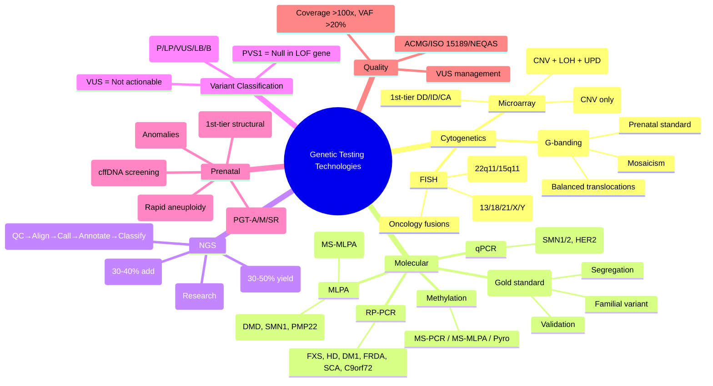

# 5.1-5.4 Genetic Testing Technologies


---

## 🎯 Learning Objectives
- [ ] Distinguish **cytogenetic** vs **molecular** testing modalities and indications
- [ ] Select appropriate test: **Karyotype, FISH, Microarray, Sanger, MLPA, NGS (Panels/WES/WGS)**
- [ ] Interpret **variant classification** (ACMG/AMP 5-tier: P, LP, VUS, LB, B)
- [ ] Understand **prenatal testing**: CVS, Amniocentesis, NIPT, QF-PCR, Microarray, PGT
- [ ] Apply **quality standards** (NEQAS, ISO 15189, ACMG standards)
- [ ] Answer viva: "Microarray vs Karyotype" and "ACMG variant classification"

---

## 🧠 Core Concept: Genetic Testing Landscape

```mermaid
flowchart TD
    A[Genetic Testing] --> B[Cytogenetics<br/>Chromosome Level]
    A --> C[Molecular Genetics<br/>Gene/DNA Level]
    
    B --> B1[Karyotype (G-banding)]
    B --> B2[FISH]
    B --> B3[Microarray (aCGH/SNP)]
    
    C --> C1[Sanger Sequencing]
    C --> C2[MLPA / qPCR]
    C --> C3[NGS (Panels/WES/WGS)]
    C --> C4[Methylation Analysis]
    C --> C4b[Repeat-Primed PCR]
    
    B3 & C3 --> D[Diagnostic Yield]
    D --> D1[Microarray: 15-20% DD/ID]
    D --> D2[WES: 30-40% additional]
    D --> D3[WGS: Comprehensive]
```

---

## 1️⃣ Cytogenetic Testing

### Karyotype (G-Banding)
| Feature | Detail |
|---------|--------|
| **Resolution** | ~5-10 Mb (400-550 bands); High-res: 850 bands (~3-5 Mb) |
| **Detects** | Aneuploidy, Balanced/Unbalanced translocations, Large insertions/deletions, Mosaicism (>10-15%), Ring chromosomes |
| **Limitations** | Cannot detect: Submicroscopic CNVs (<5 Mb), Point mutations, UPD, Balanced inversions (if small), Small insertions |
| **Turnaround** | 10-14 days (Culture required) |
| **Sample** | Peripheral blood (lymphocytes), Amniotic fluid, CVS, Products of conception, Bone marrow |
| **Indications** | Multiple congenital anomalies, DD/ID, Recurrent miscarriage, Infertility, Prenatal (ACOG/ACMG), Oncology (Haematological malignancies) |

### FISH (Fluorescence In Situ Hybridisation)
| Feature | Detail |
|---------|--------|
| **Principle** | Fluorescent probe hybridises to specific DNA sequence on metaphase/interphase chromosomes |
| **Probe Types** | Locus-specific (e.g., 22q11, 15q11), Centromeric (Enumeration), Whole chromosome paint (WCP), Subtelomeric, Break-apart (Gene fusions) |
| **Resolution** | ~50-500 kb (Locus-specific) |
| **Turnaround** | 24-48 hours (No culture for interphase) |
| **Indications** | **Prenatal** (Rapid aneuploidy: QF-PCR/FISH for 13, 18, 21, X, Y), **Microdeletions** (22q11, 15q11, 7q11, 1p36, 5p), **Oncology** (BCR::ABL1, MYC, HER2, ALK, ROS1, RET), **Mosaicism** |
| **Limitations** | Targeted only (Must know what to look for); Not genome-wide; Cannot detect balanced rearrangements (unless break-apart) |

### Chromosomal Microarray (CMA) — aCGH vs SNP Array
| Feature | **aCGH** | **SNP Array** |
|---------|----------|---------------|
| **Principle** | Test vs Reference DNA competitive hybridisation | SNP allele intensity (Log R Ratio) + B-Allele Frequency (BAF) |
| **Detects** | CNV (Gain/Loss) | **CNV + LOH + UPD + Mosaicism** |
| **Resolution** | ~50-100 kb (Oligonucleotide array) | ~10-50 kb (High-density SNP) |
| **LOH/UPD** | **No** | **Yes** (BAF = 0 or 1 across chromosome = UPD; Long stretches of homozygosity = LOH) |
| **Balanced Translocations** | No | No |
| **Mosaicism Detection** | ~20-30% | ~5-10% (BAF deviation) |
| **Triploidy** | No (Ratio-based) | **Yes** (BAF pattern) |
| **Clinical Indications** | **1st-tier for DD/ID/CA** (15-20% yield), Congenital anomalies, Dysmorphism, Autism, Epilepsy, Multiple congenital anomalies | **1st-tier for DD/ID/CA** + UPD/LOH detection (Imprinting disorders, Consanguinity, Tumour) |
| **Resolution Limit** | ~50 kb (Oligo) | ~5-10 kb (High-density) |

> **Key:** **SNP Array > aCGH** for clinical diagnostics (Additional LOH/UPD/BAF information). **1st-tier test for DD/ID/CA** (Replaces karyotype in many guidelines).

### Chromosome Analysis Nomenclature (ISCN 2020)
| Example | Interpretation |
|---------|----------------|
| **46,XX** | Normal female |
| **46,XY,del(22)(q11.2)** | Male, Deletion chr22 long arm band 11.2 |
| **46,XX,der(14;21)(q10;q10)** | Robertsonian translocation 14;21 |
| **46,XX,t(2;5)(q31;q14)** | Reciprocal translocation 2;5 |
| **47,XX,+21** | Trisomy 21 |
| **45,X** | Turner syndrome |
| **47,XXY** | Klinefelter syndrome |
| **mos 45,X/46,XX** | Mosaic Turner |
| **arr[GRCh38] 22q11.21q11.23(18,000,000-22,000,000)x1** | Microarray: 22q11.2 deletion (CNV loss) |

---

## 2️⃣ Molecular Genetic Testing

### Sanger Sequencing
| Feature | Detail |
|---------|--------|
| **Principle** | Chain-termination method (Dideoxynucleotides), Capillary electrophoresis |
| **Read Length** | ~800-1000 bp |
| **Accuracy** | >99.9% (Gold standard for single-gene confirmation) |
| **Throughput** | Low (1-96 samples/run) |
| **Applications** | **Confirmation** of NGS variants; **Known familial variant** testing; **Single-gene** disorders (e.g., CFTR, HBB, DMD point mutations); **Segregation analysis** |
| **Limitations** | Low throughput; Cannot detect CNVs efficiently; Cannot detect mosaicism <15-20% |

### MLPA (Multiplex Ligation-dependent Probe Amplification)
| Feature | Detail |
|---------|--------|
| **Principle** | Probe pairs hybridise to adjacent target sequences → Ligation → PCR amplification → Fragment analysis (Capillary electrophoresis) |
| **Detects** | **Copy number changes (Exon-level CNV)**, Methylation (MS-MLPA) |
| **Resolution** | Single exon level (~50-100 bp probes) |
| **Applications** | **Exon CNV in DMD, SMN1, PMP22, MLH1/MSH2, BRCA1/2, LDLR, CFTR**; **Methylation** (15q11 PWS/AS, 11p15 BWS/SRS, 6q24 TNDM) |
| **Advantages** | High throughput (40-50 probes/reaction), Cost-effective, Detects exon-level CNV missed by Sanger/NGS |
| **Limitations** | Targeted (Must design probes), Cannot detect point mutations, Breakpoint mapping limited |

### qPCR (Quantitative PCR)
| Feature | Detail |
|---------|--------|
| **Applications** | **Copy number quantification** (e.g., SMN1/2 copy number, HER2 amplification, MTB quantification); **Gene expression**; **Viral load**; **Chimerism monitoring** (Post-HSCT) |
| **Sensitivity** | High (Single copy detection) |
| **Limitations** | Targeted (Primer-specific), No sequence information |

### Methylation Analysis
| Method | Application |
|--------|-------------|
| **MS-PCR** (Methylation-Specific PCR) | Single locus methylation (e.g., 15q11 SNRPN, 11p15 IC1/IC2, 6q24) |
| **MS-MLPA** | Multiple loci + CNV simultaneously (e.g., 15q11 PWS/AS, 11p15 BWS/SRS, 6q24 TNDM) |
| **Pyrosequencing** | Quantitative methylation % (CpG resolution) |
| **Bisulphite Sequencing** | Gold standard for methylation mapping (Single-base resolution) |

### Repeat-Primed PCR (RP-PCR)
| Application | Target |
|-------------|--------|
| **Fragile X** | FMR1 CGG repeat sizing (Normal, Premutation, Full) + Methylation status |
| **Huntington** | HTT CAG repeat sizing |
| **DM1** | DMPK CTG repeat sizing |
| **Friedreich Ataxia** | FXN intron 1 GAA repeat |
| **SCAs** | CAG repeat expansions (SCA1,2,3,6,7,8,17) |
| **C9orf72** | GGGGCC repeat (ALS/FTD) |

---

## 3️⃣ Next-Generation Sequencing (NGS)

### NGS Platforms & Throughput
| Platform | Read Length | Throughput | Common Use |
|----------|-------------|------------|------------|
| **Illumina (NovaSeq/NextSeq/MiSeq)** | 150-300 bp (Paired-end) | Highest (Tb/run) | Clinical WES/WGS, Panels |
| **Ion Torrent (GeneStudio S5)** | 200-400 bp | Medium | Targeted panels, Microbial |
| **PacBio (HiFi)** | 10-25 kb (HiFi) | Medium | Long-read (Structural variants, Phasing) |
| **Oxford Nanopore** | >100 kb (Ultra-long) | Variable | Long-read, Epigenetics, Structural variants |

### NGS Test Types

| Test | Target | Coverage | Indications | Turnaround |
|------|--------|----------|-------------|------------|
| **Gene Panel** | 10-500 genes | >200-500x | Phenotype-specific (Epilepsy, Cardiomyopathy, Epilepsy, Immunodeficiency, Short stature, DD/ID) | 2-4 weeks |
| **Clinical Exome (CES)** | ~4,000-5,000 genes (Clinical) | 100-150x | Undiagnosed DD/ID, Multiple congenital anomalies, Heterogeneous phenotypes | 4-8 weeks |
| **Whole Exome (WES)** | ~20,000 genes (All coding) | 100-150x | Research, Undiagnosed complex phenotypes | 8-12 weeks |
| **Whole Genome (WGS)** | Entire genome (3.2 Gb) | 30-40x (30x clinical) | Research, Complex structural variants, Non-coding, Trio analysis | 12+ weeks |

### NGS Bioinformatics Pipeline
| Step | Tool/Description |
|------|------------------|
| **1. Basecalling** | Illumina bcl2fastq / ONT Guppy |
| **2. QC** | FastQC, MultiQC (Quality scores, Adapter content) |
| **3. Trimming** | Trimmomatic, Cutadapt (Adapters, Low-quality bases) |
| **4. Alignment** | BWA-MEM (Illumina), Minimap2 (Long-read) → BAM/CRAM |
| **5. Post-Alignment** | MarkDuplicates (Picard), Base Quality Recalibration (GATK) |
| **6. Variant Calling** | GATK HaplotypeCaller (Germline), Mutect2 (Somatic), DeepVariant |
| **7. Variant Filtering** | VQSR (GATK), Hard filters (QD, FS, MQ, ReadPosRankSum) |
| **8. Annotation** | VEP/ANNOVAR/BCFtools + ClinVar, gnomAD, CADD, REVEL, SpliceAI, dbNSFP |
| **9. Prioritisation** | Phenotype-driven (HPO terms), Gene panels, ACMG classification |
| **10. Reporting** | Pathogenic/LP/VUS/LB/Benign (ACMG/AMP) |

### NGS Quality Metrics (Clinical Standards)
| Metric | Minimum Standard |
|--------|------------------|
| **Mean Coverage** | ≥100x (Panels), ≥100x (WES), ≥30x (WGS) |
| **% Bases ≥20x** | >95% (Panels/WES), >90% (WGS) |
| **% Bases ≥10x** | >99% |
| **Variant Allele Fraction (VAF)** | >20% (Germline heterozygous), >5-10% (Mosaic) |
| **Contamination** | <1% (VerifyBamID) |
| **Gender Concordance** | 100% |
| **Duplicate Rate** | <20% (WES), <10% (WGS) |

---

## 4️⃣ Variant Classification (ACMG/AMP 2015)

### 5-Tier Classification
| Class | Terminology | Criteria Summary |
|-------|-------------|------------------|
| **1** | **Pathogenic (P)** | ≥1 Very Strong (PVS1) + ≥1 Strong (PS) OR ≥2 Strong + ≥2 Moderate, etc. |
| **2** | **Likely Pathogenic (LP)** | ≥1 Strong + 1-2 Moderate OR ≥3 Moderate OR 1 Strong + ≥2 Supporting |
| **3** | **Variant of Uncertain Significance (VUS)** | Insufficient evidence; Conflicting evidence; Criteria not met for P/LP or LB/B |
| **4** | **Likely Benign (LB)** | ≥1 Strong benign (BS) + 1 Supporting OR ≥2 Supporting |
| **5** | **Benign (B)** | ≥1 Standalone benign (BA1: Population frequency >5%) |

### Key ACMG/AMP Criteria (2015/??)
| Code | Strength | Category | Example |
|------|----------|----------|---------|
| **PVS1** | Very Strong | Pathogenic | Null variant (Nonsense, Frameshift, Canonical splice, Initiation codon) in LOF gene |
| **PS1** | Strong | Pathogenic | Same amino acid change as established pathogenic variant |
| **PS2** | Strong | Pathogenic | **De novo** (Confirmed maternity/paternity) |
| **PS3** | Strong | Pathogenic | **Functional studies** supportive of damaging effect |
| **PS4** | Strong | Pathogenic | **Case-control** enrichment (OR >5, p<0.05) |
| **PM1** | Moderate | Pathogenic | Located in **hotspot/critical domain** (No benign variants) |
| **PM2** | Moderate | Pathogenic | **Absent/very low frequency** in population databases (gnomAD) |
| **PM3** | Moderate | Pathogenic | **In trans** with pathogenic variant (AR disorders) |
| **PM4** | Moderate | Pathogenic | **Protein length change** (In-frame del/ins) in non-repeat region |
| **PP1** | Supporting | Pathogenic | **Co-segregation** with disease in multiple affected family members |
| **PP3** | Supporting | Pathogenic | **Multiple in silico** tools predict deleterious (CADD>20, REVEL>0.5) |
| **BS1** | Strong | Benign | **Allele frequency > expected** for disorder |
| **BS2** | Strong | Benign | **Observed in healthy adult** (Homozygous for severe AD) |
| **BS3** | Strong | Benign | **Functional studies** show no damaging effect |
| **BS4** | Strong | Benign | **Lack of segregation** in affected family members |
| **BP1** | Supporting | Benign | **Missense** in gene where only truncating cause disease |
| **BP4** | Supporting | Benign | **In silico** tools predict benign |
| **BP7** | Supporting | Benign | **Synonymous** variant with no splicing impact predicted |

### VUS Management
- **Do not use for clinical decision-making** (Diagnosis, Prediction, Prenatal)
- **Reclassification** over time (New evidence, Segregation, Functional studies, Re-analysis)
- **Report with appropriate caveats** ("VUS — not actionable")
- **Segregation analysis** in family (Key for reclassification)

---

## 5️⃣ Prenatal & Preimplantation Genetic Testing

### Prenatal Diagnosis (PND)

| Method | Timing | Sample | Indications | Limitations |
|--------|--------|--------|-------------|-------------|
| **NIPT (cfDNA)** | ≥10 weeks | Maternal blood (10mL) | **Screening**: T21, T18, T13, Sex chromosomes; **Not diagnostic** | **Screen only**; cffDNA fraction <4% unreliable; Maternal mosaicism, Vanishing twin, Maternal malignancy |
| **QF-PCR** | 11-14w (CVS), 15-20w (Amnio) | CVS/Amniotic fluid | **Rapid aneuploidy** (13, 18, 21, X, Y) <24-48h | Targeted (Aneuploidy only) |
| **FISH** | Same | Same | Rapid aneuploidy, Microdeletions (22q11) | Targeted |
| **Chromosomal Microarray** | CVS (11-14w), Amnio (15-20w) | CVS/Amniotic fluid | **1st-tier** for structural anomalies, DD/ID risk, Stillbirth | Cannot detect balanced rearrangements, Low-level mosaicism <10% |
| **Karyotype** | Same | Same | Balanced rearrangements, Family history of translocation | Slow (10-14d), Low resolution |
| **NGS (Panel/WES)** | Amnio (15-20w) | Amniotic fluid | Ultrasound anomalies, High-risk family history | VUS rate higher; Incidental findings |

### NIPT (Non-Invasive Prenatal Testing)
| Feature | Detail |
|--------|--------|
| **Source** | Cell-free fetal DNA (cffDNA) in maternal plasma (Placental origin) |
| **cffDNA Fraction** | Fetal fraction **≥4%** required for reliable results (Mean ~10-15% at 10-12w) |
| **Detects** | **T21, T18, T13** (Sensitivity >99%, Specificity >99.9%); **Sex chromosomes** (XXX, XXY, XYY, Turner); **Microdeletions** (Limited panels, lower PPV) |
| **Indications** | **High-risk** (Combined test >1:150), Advanced maternal age, Previous aneuploidy, **Screening only** |
| **Not Indicated** | Low-risk (False positives cause anxiety), Multiple gestation (Variable performance), Maternal malignancy, High BMI (<10w), Vanishing twin |
| **Confirmatory Testing** | **CVS/Amnio + Microarray/Karyotype** required for positive NIPT |

### Preimplantation Genetic Testing (PGT)

| Type | Purpose | Indications | Limitations |
|------|---------|-------------|-------------|
| **PGT-A** (Aneuploidy) | Screen embryos for aneuploidy | Advanced maternal age, RIF, RPL, Severe male factor | Mosaicism (TE biopsy), False ± (2-5%), Cost, Ethical |
| **PGT-M** (Monogenic) | Specific monogenic disorder | Known familial pathogenic variant (AD/AR/XL) | Requires known familial variant; Haplotype analysis for linkage |
| **PGT-SR** (Structural Rearrangement) | Translocation/Inversion carriers | Balanced translocation/inversion carriers | Complex segregation patterns |

### PGT Process
1. **IVF/ICSI** → Blastocyst culture (Day 5-6)
2. **Trophectoderm Biopsy** (5-10 cells)
3. **Genetic Analysis**: NGS (PGT-A/M), Karyomapping (PGT-SR), SNP Array
4. **Selection & Transfer** → Euploid / Unaffected embryo
5. **Cryopreservation** of remaining embryos

---

## ⚡ FCPS/MRCP High-Yield Summary

| Test | Indication | Yield | Turnaround |
|------|------------|-------|------------|
| **Karyotype** | Balanced translocations, Azoospermia, Recurrent miscarriage, Prenatal (CVS/Amnio) | ~3-5% | 10-14 days |
| **FISH** | Rapid prenatal (13/18/21/X/Y), Microdeletions (22q11, 15q11), Oncology fusions | N/A (Targeted) | 24-48h |
| **Microarray (SNP Array)** | **1st-tier DD/ID/CA** (15-20% yield), UPD/LOH | 15-20% | 10-14 days |
| **Sanger** | Single gene confirmation, Familial variant, Segregation | ~100% for known variant | 1-2 weeks |
| **MLPA** | Exon CNV (DMD, SMN1, PMP22, MLH1/MSH2, BRCA) + Methylation | ~95% for CNV | 1-2 weeks |
| **NGS Panel** | Targeted phenotype (Epilepsy, CM, ID, Immunodeficiency) | 30-50% | 2-4 weeks |
| **WES** | Undiagnosed DD/ID, Multiple anomalies | 30-40% (Additional) | 4-8 weeks |
| **WGS** | Research, Complex SV, Non-coding, Trio | Highest | 12+ weeks |
| **NIPT** | T21/T18/T13 screening | >99% Sens/Spec | 5-10 days |
| **ACMG Classification** | P/LP/VUS/LB/B (5-tier) | VUS management critical | — |

---

## 🎤 Viva Questions (Expected Answers)

| # | Question | Expected Answer |
|---|----------|-----------------|
| 1 | Karyotype vs Microarray — which is 1st-tier for DD/ID? | **Chromosomal Microarray (SNP Array)** — 15-20% yield vs 3-5% for karyotype; Detects submicroscopic CNVs, UPD, LOH. |
| 2 | FISH vs Karyotype — when to use FISH? | **Rapid prenatal** (T13/18/21/13/18/21/X/Y in 24h), **Targeted microdeletions** (22q11, 15q11), **Oncology fusions** (BCR::ABL1), Mosaicism. |
| 3 | aCGH vs SNP Array — key difference? | **SNP Array detects LOH, UPD, Mosaicism** (via BAF); aCGH = CNV only. |
| 4 | ACMG variant classification — 5 tiers? | **Pathogenic (P), Likely Pathogenic (LP), Variant of Uncertain Significance (VUS), Likely Benign (LB), Benign (B).** |
| 5 | PVS1 criterion — when applied? | **Null variant** (Nonsense, Frameshift, Canonical splice, Start codon) **in LOF disease gene** → Very Strong pathogenic evidence. |
| 6 | VUS management? | **Do not use for clinical decisions**; Segregation analysis, Functional studies, Re-analysis over time; Reclassification when evidence accumulates. |
| 7 | MLPA — what does it detect that Sanger/NGS miss? | **Exon-level CNV** (Exon deletions/duplications in DMD, SMN1, PMP22, MLH1/MSH2, BRCA); **Methylation** (MS-MLPA for PWS/AS, BWS/SRS). |
| 8 | NIPT vs Diagnostic testing? | **NIPT = Screening** (cffDNA, >99% sensitivity for T21); **CVS/Amnio = Diagnostic** (Karyotype/Microarray). Positive NIPT → Confirm with CVS/Amnio. |
| 9 | PGT-M — when indicated? | **Known familial pathogenic variant** (AD/AR/XL); Requires IVF/ICSI, Trophectoderm biopsy, NGS/haplotype analysis; PGT-A for aneuploidy screening. |
| 10 | QF-PCR vs Microarray prenatal? | **QF-PCR**: Rapid aneuploidy (13,18,21,X,Y) in 24-48h. **Microarray**: CNV, UPD, LOH, 1st-tier for anomalies. |

---

## 🧩 Confusions & Mnemonics

| Confusion | Clarification |
|-----------|---------------|
| **"Karyotype = Microarray replacement"** | **NO.** Karyotype still needed for **Balanced translocations, Inversions, Ring chromosomes, Low-level mosaicism** (<10% for array). |
| **"NGS detects everything"** | **NO.** NGS misses: **Large CNVs (>1kb)** (unless WGS), **Deep intronic/regulatory** (unless WGS), **Methylation**, **Repeat expansions** (need RP-PCR), **Balanced rearrangements**, **Mosaicism <10-20%**. |
| **"VUS = Likely pathogenic"** | **NO.** **VUS = Uncertain**. Do not use for clinical decisions. Segregation/Functional/Re-analysis needed. |
| **"MLPA = Sequencing"** | **NO.** MLPA = **Copy number** (Dosage) + Methylation. **No sequence data**. Use with Sequencing. |
| **"NIPT = Diagnostic"** | **NO.** **Screening only** (False + and -). **Must confirm with CVS/Amnio + Microarray/Karyotype**. |
| **"WES = Whole Genome"** | **NO.** WES = **Exons only** (~1-2% genome). Misses: Deep intronic, Regulatory, CNV (unless CNV caller), Structural variants, Mitochondrial. |
| **"WGS = Detects everything"** | **Nearly**, but: **Cost, Data burden, Interpretation challenge**, Mosaicism <10%, Balanced translocations (harder), Epigenetics (needs bisulphite). |
| **"Microarray = Karyotype replacement"** | **Mostly**, but Karyotype still for: **Balanced translocations, Inversions, Rings, Low-level mosaicism, Parental confirmation** of array findings. |
| **"PVS1 = Any truncating variant"** | **Only in LOF disease mechanism gene**. Not for Gain-of-function (e.g., FGFR3 Achondroplasia). |
| **"VUS = Benign until proven otherwise"** | **NO.** VUS = Uncertain. Treat as **non-contributory** for clinical decisions. |

> **Mnemonic: GENETIC TESTING TECHNOLOGIES**  
> **G**enomic Testing Hierarchy: **Karyotype → FISH → Microarray → Sanger → MLPA → NGS (Panel→WES→WGS)**  
> **E**xome: **WES = Coding (1-2%)**; **WGS = Whole Genome (3.2Gb)**  
> **N**on-Invasive Prenatal: **NIPT = cffDNA Screening (>99% T21) → Confirm CVS/Amnio**  
> **E**xome vs Genome: **WES = 1-2% genome (Exons)**; **WGS = 100% (SNV+CNV+SV+Non-coding)**  
> **T**argeted: **Panels (30-50% yield) → WES (30-40% add) → WGS (Research)**  
> **I**sochromosome/Inversion/Balanced: **Karyotype only** (Microarray misses balanced)  
> **C**NV Detection: **Microarray (1st-tier DD/ID)** → **MLPA (Exon CNV)** → **WGS**  
> **M**LPA: **Exon CNV (DMD, SMN1, PMP22) + Methylation (PWS/AS/BWS)**  
> **C**NV vs SNV: **Microarray = CNV; NGS = SNV/Small Indel**  
> **S**anger: **Gold Standard Confirmation** (Familial variant, Segregation, Validation)  
> **Q**F-PCR: **Rapid Aneuploidy (13,18,21,X,Y) <48h Prenatal**  
> **A**CMG: **5-Tier (P/LP/VUS/LB/B)** — **PVS1 = Null in LOF Gene**  
> **V**US: **Not Actionable** — Segregation, Functional, Re-analyse  
> **T**echnology Choice: **Karyotype (Balanced), FISH (Targeted/Rapid), Array (CNV/LOH/UPD), NGS (SNV/Indel)**  
> **E**pigenetics: **MS-MLPA (Methylation + CNV)**, Bisulphite Seq (Gold Standard)  
> **S**equencing Pipeline: **QC → Align → Call → Filter → Annotate → Classify (ACMG) → Report**  
> **T**rio WES: **Proband + Parents** → De novo, Phasing, Compound Het, Segregation  
> **K**aryotype: **Balanced Translocations, Mosaicism, Inversions, Rings, Low-level Mosaic**  
> **F**ISH: **Rapid (24h), Targeted (13,18,21,X,Y / 22q11/15q11 / Oncology Fusions)**  
> **A**rray: **SNP Array > aCGH** (LOH, UPD, BAF, Mosaicism, Triploidy)  
> **Q**C Metrics: **Coverage >100x, >95% >20x, VAF >20%, Contam <1%**  
> **E**thics: **VUS Not Actionable; Incidental Findings (ACMG SF v3.1); PGT Ethics**  

---

## 🗺️ Mind Map



---

## 📅 Spaced Repetition Tracker

| Review | Date | Score (0–5) | Notes |
|--------|------|-------------|-------|
| Day 1 | | | |
| Day 3 | | | |
| Day 7 | | | |
| Day 14 | | | |
| Day 30 | | | |
| Day 90 | | | |

---

## 📝 Self-Test Scorecard

| Section | Max | Score | % |
|---------|-----|-------|---|
| Cytogenetics (Karyotype/FISH/Array) | 3 | | |
| Molecular (Sanger/MLPA/qPCR/Methylation) | 3 | | |
| NGS (Panels/WES/WGS/Pipeline) | 3 | | |
| Variant Classification (ACMG/AMP) | 3 | | |
| Prenatal (NIPT/QF-PCR/Array/PGT) | 3 | | |
| Quality Standards/Confusions | 2 | | |
| **Total** | **20** | | |

---

## 💬 Exam Answer Modes

| Format | Prompt | Key Points |
|--------|--------|------------|
| **Long Essay** | "Describe the genetic testing pathway for a child with developmental delay and congenital anomalies." | 1st-tier: SNP Microarray (15-20% yield) → If negative: NGS Panel/WES (30-40% add) → Parental trio for segregation → Sanger confirmation → Genetic counselling |
| **Short Note** | "ACMG variant classification — PVS1 criterion." | PVS1 = Null variant (Nonsense, Frameshift, Canonical splice, Start codon) in LOF gene → Very Strong pathogenic evidence. |
| **Viva** | "Couple with recurrent miscarriages. Karyotype: balanced t(11;22). What test for embryos?" | **PGT-SR** (Preimplantation Genetic Testing for Structural Rearrangement): IVF → Blastocyst biopsy → Karyomapping/NGS/SNP Array → Select balanced/normal embryos. |
| **Ward Round** | "Child with DMD symptoms. CK 10,000. Genetic testing pathway?" | 1) **MLPA for DMD exon deletions/duplications** (75% detection) → 2) If negative → Sanger/NGS for point mutations → 3) If negative → Muscle biopsy (dystrophin) → 4) Carrier testing mother. |
| **Last-Night** | "Karyotype: Balanced/Inversion/Mosaic. FISH: Rapid/Targeted. Array: SNP>aCGH (LOH/UPD). Sanger: Gold std confirm. MLPA: Exon CNV+Methylation. NGS: Panel→WES→WGS. ACMG: P/LP/VUS/LB/B. PVS1=Null in LOF. VUS not actionable. NIPT=Screen→Confirm. PGT: A/M/SR." | Compressed. |

---

## 📌 Summary
- **Cytogenetics**: **Karyotype** (Balanced translocations, Mosaicism, Low-res); **FISH** (Rapid targeted: 13/18/21/X/Y, Microdeletions, Oncology); **SNP Microarray > aCGH** (CNV + LOH + UPD + Mosaicism) — **1st-tier for DD/ID/CA** (15-20% yield).
- **Molecular**: **Sanger** (Gold standard confirmation, Familial variants, Segregation); **MLPA** (Exon CNV — DMD, SMN1, PMP22; **Methylation** MS-MLPA for PWS/AS/BWS); **qPCR** (Copy number, Chimerism); **RP-PCR** (FXS, HD, DM1, FRDA, SCA, C9orf72).
- **NGS**: **Panels** (30-50% yield, phenotype-driven) → **WES** (30-40% additional) → **WGS** (Research, Non-coding, SV). Pipeline: QC→Align→Call→Annotate→Classify (ACMG).
- **Variant Classification (ACMG/AMP)**: **5 tiers** (P, LP, VUS, LB, B). **PVS1** = Null variant in LOF gene. **VUS = NOT actionable**.
- **Prenatal**: **NIPT** (Screening, cffDNA >99% T21) → **Confirm with CVS/Amnio + Microarray/Karyotype**. **QF-PCR** (Rapid aneuploidy 24-48h). **Microarray** 1st-tier for anomalies. **PGT-A/M/SR** for embryos.
- **Classification**: **5-tier** (P/LP/VUS/LB/B). **PVS1** = Null in LOF gene. **VUS = NOT actionable** (Segregation, Functional, Re-analysis).
- **Confusions**: Karyotype ≠ Array replacement; NIPT ≠ Diagnostic; WES ≠ WGS; MLPA ≠ Sequencing; VUS ≠ LP; PVS1 only for LOF genes.

---

## ❓ MCQs (10)

1. **First-tier test for developmental delay with congenital anomalies:**  
   A. Karyotype  B. **Chromosomal Microarray (SNP Array)**  C. NGS Panel  D. Whole Exome Sequencing  
   *Answer: B. Chromosomal Microarray (SNP Array) — 15-20% diagnostic yield, detects CNV/LOH/UPD.*

2. **MLPA — primary application in clinical genetics?**  
   A. Point mutation detection  B. **Exon-level copy number variation + Methylation**  C. Whole genome sequencing  D. RNA expression  
   *Answer: B. MLPA detects exon-level CNV (DMD, SMN1, PMP22) + Methylation (MS-MLPA for PWS/AS/BWS).*

3. **ACMG variant classification — "PVS1" applies to:**  
   A. Missense variant in hotspot  B. **Null variant (Nonsense/Frameshift) in LOF gene**  C. Variant with strong functional evidence  D. Variant absent from population databases  
   *Answer: B. PVS1 = Null variant (Nonsense, Frameshift, Canonical splice, Start codon) in LOF gene.*

4. **VUS (Variant of Uncertain Significance) — correct management?**  
   A. Treat as pathogenic  B. Treat as benign  C. **Do not use for clinical decisions; Segregation/Functional/Re-analyse**  D. Report as likely pathogenic  
   *Answer: C. VUS = Uncertain significance; Do not use for clinical decisions. Segregation, Functional studies, Re-analysis over time.*

5. **NIPT (cfDNA) — sensitivity for Trisomy 21?**  
   A. 90%  B. 95%  C. **>99%**  D. 99.9%  
   *Answer: C. >99% sensitivity for T21 (cfDNA screening).*

6. **QF-PCR prenatal — what does it detect?**  
   A. Single gene mutations  B. **Rapid aneuploidy (13, 18, 21, X, Y)**  C. Microdeletions  D. Whole genome CNV  
   *Answer: B. QF-PCR = Quantitative Fluorescent PCR for rapid aneuploidy screening (13, 18, 21, X, Y) in 24-48h.*

7. **SNP Array vs aCGH — key advantage of SNP Array?**  
   A. Higher resolution  B. **Detects LOH, UPD, Mosaicism**  C. Lower cost  D. Faster turnaround  
   *Answer: B. SNP Array provides B-Allele Frequency → Detects LOH, UPD, Mosaicism, Triploidy.*

8. **ACMG classification — "VUS" should be:**  
   A. Reported as pathogenic  B. **Not used for clinical decision-making**  C. Reported as benign  D. Ignored in report  
   *Answer: B. VUS = Variant of Uncertain Significance — Not actionable; Do not use for clinical decisions.*

9. **QF-PCR prenatal turnaround time?**  
   A. 10-14 days  B. 5-7 days  C. **24-48 hours**  D. 2-3 weeks  
   *Answer: C. QF-PCR provides rapid aneuploidy results in 24-48 hours.*

10. **MLPA — clinical application for DMD?**  
    A. Point mutation detection  B. **Exon deletion/duplication detection (75% of mutations)**  C. Methylation analysis  D. RNA expression  
    *Answer: B. DMD mutations: ~65% exon deletions, ~10% duplications → MLPA detects 75% of mutations.*

---

## 📋 SBAs (10)

1. **Child with developmental delay, dysmorphism. First-tier test?**  
   A. Karyotype  B. **SNP Microarray**  C. WES  D. FISH  
   *Answer: B. SNP Microarray (1st-tier for DD/ID/CA, 15-20% yield).*

2. **Pregnant woman, NIPT positive for Trisomy 21. Next step?**  
   A. Terminate pregnancy  B. **Confirm with CVS/Amnio + Microarray/Karyotype**  C. Repeat NIPT  D. Ultrasound only  
   *Answer: B. NIPT is screening; Positive result requires diagnostic confirmation (CVS/Amnio + Microarray/Karyotype).*

3. **Child with DMD symptoms. CK 20,000. First genetic test?**  
   A. WES  B. Sanger sequencing DMD  C. **MLPA for DMD exon del/dup**  D. Karyotype  
   *Answer: C. MLPA detects exon deletions/duplications (75% of DMD mutations). If negative → NGS/Sanger for point mutations.*

4. **Prenatal diagnosis — balanced translocation carrier couple. Best embryo test?**  
   A. PGT-A  B. **PGT-SR**  C. PGT-M  D. NIPT  
   *Answer: B. PGT-SR (Preimplantation Genetic Testing for Structural Rearrangement) for balanced translocation carriers.*

5. **Variant classification — nonsense variant in LOF gene. ACMG code?**  
   A. PS1  B. **PVS1**  C. PM1  D. PP3  
   *Answer: B. PVS1 = Null variant (Nonsense, Frameshift, Canonical splice, Start codon) in LOF gene.*

---

## 🔑 Answer Keys
| MCQs | SBAs |
|------|------|
| 1-B, 2-B, 3-B, 4-C, 5-C, 6-B, 7-B, 8-B, 9-C, 10-B | 1-B, 2-B, 3-C, 4-B, 5-B |

---

## 🔗 Cross-Links
- [[1. Fundamentals of Medical Genetics]] — Mutation types, Nomenclature (HGVS, ISCN)
- [[2.1 Mendelian Inheritance]] — Testing strategy by inheritance pattern
- [[3. Chromosomal Disorders]] — Karyotype, FISH, Microarray for chromosomal disorders
- [[3. Chromosomal Disorders]] — Microarray for microdeletions/duplications
- [[4.1 Autosomal Dominant Disorders]] — Sanger/NGS for specific genes (FBN1, HTT, etc.)
- [[4.2 Autosomal Recessive Disorders]] — MLPA for DMD/SMN1, Sanger for point mutations
- [[4.3 X-Linked Disorders]] — MLPA (DMD), Factor assays (HA/HB), RP-PCR (FXS)
- [[4.4 Mitochondrial Disorders]] — mtDNA sequencing, Deletion analysis, Muscle biopsy
- [[4.5 Imprinting & UPD]] — Methylation PCR/MS-MLPA, SNP Array for UPD detection
- [[5.5 Genetic Counselling]] — Pre-test counselling, VUS communication, PGT counselling
- [[5.4 Prenatal & Preimplantation Testing]] — NIPT, PND, PGT-A/M/SR workflows
- [[7. Pharmacogenetics]] — DPYD (5-FU), TPMT (Azathioprine), CYP2D6 (Codeine) — NGS panels
- [[9. ELSI]] — VUS reporting ethics, Incidental findings (ACMG SF v3.1), DTC testing, PGT ethics

---

**Last Updated:** 2026-06-14  
**Next:** Build `5.5 Genetic Counselling.md`