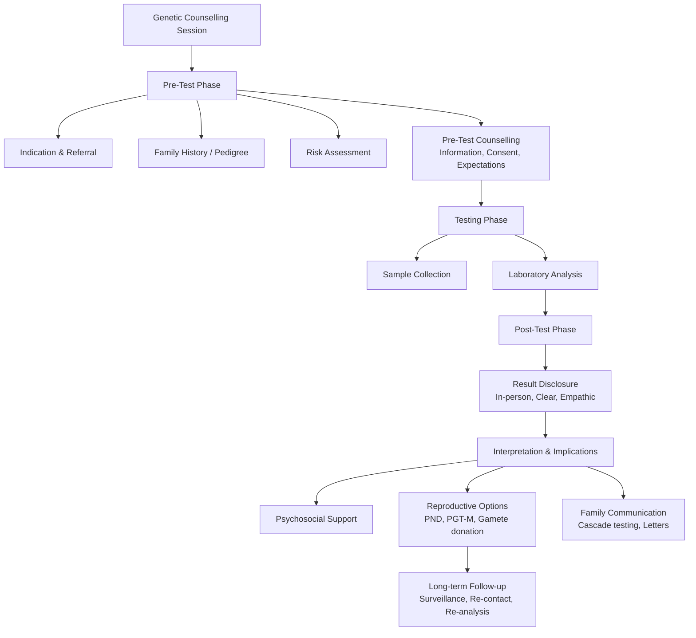

# 5.5 Genetic Counselling


---

## 🎯 Learning Objectives
- [ ] Apply **genetic counselling framework**: Pre-test, Post-test, Ongoing
- [ ] Communicate **risk** effectively (Absolute vs Relative, Visual aids, Numerical literacy)
- [ ] Conduct **predictive testing** counselling (HD, Cancer predisposition) — Protocol, Ethics
- [ ] Counsel for **reproductive options**: PND, PGT-M, Gamete donation, Adoption
- [ ] Navigate **ethical dilemmas**: Confidentiality vs Duty to warn, Paediatric testing, VUS communication
- [ ] Apply **psychosocial support**: Decision-making, Grief, Family dynamics
- [ ] Answer viva: "HD predictive testing protocol" and "VUS communication to patient"

---

## 🧠 Core Concept: Genetic Counselling Framework



---

## 1️⃣ Core Principles of Genetic Counselling

### Ethical Principles (NSGC/ESHG/GMC)
| Principle | Application |
|-----------|-------------|
| **Autonomy** | Non-directive counselling; Informed consent; Respect reproductive choices |
| **Beneficence** | Maximise benefit (Early diagnosis, Prevention, Reproductive autonomy) |
| **Non-maleficence** | Avoid harm (Psychological distress, Discrimination, Unnecessary testing) |
| **Justice** | Equitable access; Fair resource allocation; Non-discrimination |

### Key Features of Genetic Counselling
| Feature | Description |
|---------|-------------|
| **Non-directive** | Provide information, not recommendations; Support autonomous decision-making |
| **Non-judgmental** | Respect cultural, religious, personal values |
| **Confidential** | Bound by professional ethics, GDPR, GMC; Exceptions: Duty to warn (serious harm) |
| **Psychoeducational** | Risk communication, Empowerment, Coping strategies |
| **Family-centred** | Cascade testing, Family letters, Systemic perspective |

---

## 2️⃣ Genetic Counselling Process

### Pre-Test Counselling Checklist
| Element | Key Points |
|---------|------------|
| **Indication** | Why testing? (Diagnostic, Predictive, Carrier, Prenatal, PGT) |
| **Family History** | 3-generation pedigree; Consanguinity; Ethnicity; Adoption |
| **Risk Assessment** | Mendelian risk, Bayesian modification, Population carrier frequency |
| **Test Information** | Test type, Sensitivity/Specificity, Limitations, VUS rate, Incidental findings |
| **Possible Results** | Positive, Negative, VUS, Incidental/Secondary findings |
| **Implications** | Medical (Surveillance, Treatment), Psychological, Familial, Insurance, Reproductive |
| **Insurance/Discrimination** | GINA (US), Equality Act 2010 (UK), ABI Code (UK) — Life insurance implications |
| **Consent Process** | Written informed consent; Capacity assessment; Withdrawal rights |
| **Psychosocial Assessment** | Anxiety, Depression, Understanding, Support system, Decision-making style |

---

## 3️⃣ Risk Communication

### Principles
| Principle | Technique |
|-----------|-----------|
| **Use Absolute Risks** | "25% chance" not "2x risk" |
| **Visual Aids** | Icon arrays (100 faces), Bar charts, Decision aids |
| **Natural Frequencies** | "3 in 100" not "3%" |
| **Absolute vs Relative** | "ARR 2%, NNT 50" not "RRR 50%" |
| **Frame Positively & Negatively** | "75% chance unaffected" AND "25% chance affected" |
| **Check Understanding** | Teach-back: "Can you explain in your own words?" |

### Risk Formats

| Format | Example | Best For |
|--------|---------|----------|
| **Probability** | 1 in 4 (25%) | Simple Mendelian |
| **Percentage** | 25% | General |
| **Natural Frequency** | 1 in 4 | Low numeracy |
| **Icon Array** | ████░░░░░░ (25/100) | Visual learners |
| **NNT/ARR** | NNT 4 to prevent 1 case | Screening decisions |

---

## 4️⃣ Predictive Testing Counselling (HD, Cancer Predisposition)

### Huntington Disease Predictive Testing Protocol (International Standard)

| Session | Content |
|---------|---------|
| **1. Genetic Counselling (Pre-test)** | HD info, Inheritance, Test process, Implications (Insurance, Family, Psychosocial), Neurological exam baseline |
| **2. Neurological Assessment** | Detailed exam, Psychiatric screen (Depression, Suicide risk), Cognitive baseline |
| **3. Reflection Period** | **Minimum 2-4 weeks** (No rush); Opportunity to withdraw |
| **4. Result Disclosure** | **In-person**, Two professionals (Geneticist + Counsellor/Nurse), Private, Time for questions |
| **5. Post-Result Support** | Immediate counselling, Written summary, Referral (Neurology, Psychiatry, Support groups), Follow-up appointments |

### Huntington Protocol — Key Points
| Requirement | Detail |
|-------------|--------|
| **Minimum Age** | 18 years (Gillick competence if <18 but mature) |
| **Accompaniment** | Support person encouraged |
| **Result Disclosure** | **Never by phone/email/letter**; Always in-person |
| **Withdrawal Right** | Can withdraw at any point before result |
| **Confidentiality** | Strict; No disclosure to family without consent |

### Cancer Predisposition Predictive Testing (BRCA, Lynch, etc.)
| Phase | Key Elements |
|-------|--------------|
| **Pre-test** | Personal/family history, Risk models (CanRisk, BOADICEA), **Genetic testing criteria** (NICE/NHS), Insurance implications, Use of PRS (experimental) |
| **Psychological** | Anxiety, Cancer worry, Impact on family, Timing (e.g., pre-pregnancy) |
| **Result Disclosure** | In-person, Clear risk estimates, **Management options** (Surveillance, Risk-reducing surgery, Chemoprevention) |
| **Cascade Testing** | **Family letters** (template provided), Relatives' own counselling, **Do not disclose relatives' results without consent** |

---

## 5️⃣ Reproductive Counselling Options

### Prenatal Diagnosis (PND)
| Method | Timing | Indications | Key Counselling Points |
|--------|--------|-------------|------------------------|
| **CVS** | 11-14 weeks | Known familial variant; Advanced maternal age; Abnormal NIPT/Serum screen | **Miscarriage risk ~0.5-1%**; Limb reduction (rare, <10w); Confined placental mosaicism (1-2%) |
| **Amniocentesis** | 15-20 weeks | Same as CVS; Late referral | **Miscarriage risk ~0.1-0.3%**; Amniotic fluid culture (2-3 weeks) |
| **Fetal Blood Sampling** | >18 weeks | Rapid karyotype; Fetal anaemia; Infection | Higher risk (1-2%); Specialist centres only |

### Preimplantation Genetic Testing (PGT)
| Type | Indication | Process | Counselling Points |
|------|------------|---------|-------------------|
| **PGT-A** (Aneuploidy) | Advanced maternal age, RIF, RPL, Severe male factor | IVF → Blastocyst biopsy → NGS | **Mosaicism** (TE biopsy); False +/-, Not diagnostic; No guarantee of live birth |
| **PGT-M** (Monogenic) | Known familial pathogenic variant | IVF → Blastocyst biopsy → NGS/Haplotype | Requires **known familial variant**; Haplotype analysis; **Reproductive timeline** (months) |
| **PGT-SR** (Structural) | Balanced translocation/inversion carriers | Karyomapping/NGS/SNP array | Complex segregation; Aneuploidy risk also |

### Other Reproductive Options
| Option | Counselling Points |
|--------|-------------------|
| **Gamete Donation** | Donor anonymity (UK: ID release at 18); Genetic screening of donor; Legal parenthood |
| **Natural Conception + PND** | Acceptance of possible termination; Timing; Emotional impact |
| **Adoption** | Alternative if PGT/PND not acceptable; Process, Timeline |
| **Child-free Choice** | Respectful, Non-judgmental support |

---

## 6️⃣ Ethical Dilemmas in Genetic Counselling

### Confidentiality vs Duty to Warn
| Scenario | Resolution |
|----------|------------|
| **Patient refuses to inform at-risk relatives** | **Encourage disclosure**; Offer family letters; **Last resort**: MHC Guidelines — Disclose if **serious harm**, **identifiable person**, **no other way** (MHC 2019/GMC) |
| **Prenatal diagnosis — partner disagrees** | Explore values; Non-directive support; **Joint decision ideal**; Legal: Woman's right to choose (UK) |
| **Paediatric predictive testing** | **Defer until adulthood** unless medical benefit in childhood (e.g., FAP, MEN, RET) — **GMC/ESHG**: Test only if childhood benefit |

### VUS Communication
| Guideline | Practice |
|-----------|----------|
| **Do not use VUS for clinical decisions** | Explicitly state: "VUS — uncertain significance, not actionable" |
| **Explain uncertainty** | "We don't know if this variant causes disease" |
| **Offer segregation/functional studies** | Family testing for segregation; Functional assays if available |
| **Re-analysis plan** | "We will re-analyse in 1-2 years; Guidelines evolve" |
| **Document clearly** | "VUS — not actionable for clinical decisions" in report |

### Paediatric Testing
| Condition | Recommended Age |
|-----------|-----------------|
| **FAP (APC)** | 10-12 years (Surveillance colonoscopy) |
| **MEN1** | 5-10 years (Biochemical screening) |
| **MEN2A/2B** | **MEN2B: <1 year** (Prophylactic thyroidectomy); **MEN2A: 5 years** |
| **FAP/AFAP** | 10-12 years |
| **Hereditary Cancer (BRCA, Lynch)** | **18 years** (Adult onset) — **No childhood testing** |
| **HD / Adult-onset neurodegeneration** | **18 years** (Autonomy) |
| **Carrier testing (AR/XLR)** | **Defer until reproductive age** (Autonomy) |

---

## 7️⃣ Psychosocial Support & Communication

### Breaking Bad News (SPIKES Framework)
| Step | Action |
|------|--------|
| **S — Setting** | Private, Time, Support person, No interruptions |
| **P — Perception** | "What do you understand so far?" |
| **I — Invitation** | "How much detail would you like?" |
| **K — Knowledge** | **Warning shot** → Chunk & Check → Avoid jargon |
| **E — Emotions** | **Observe, Name, Validate, Empathise** ("I can see this is devastating") |
| **S — Strategy/Summary** | Next steps, Written info, Follow-up, Support resources |

### Grief & Coping
| Stage | Support |
|-------|---------|
| **Shock/Denial** | Repeat information, Written materials, Time |
| **Anger/Guilt** | Validate, Explore source, Non-judgmental |
| **Bargaining** | Reality testing, Realistic hope |
| **Depression** | Screen (PHQ-9), Referral (Psychology/Psychiatry) |
| **Acceptance** | Empowerment, Planning, Reproductive decisions |

### Family Communication
| Element | Tool |
|---------|------|
| **Family Letters** | Standardised template (Diagnosis, Risk, Testing options, Contact details) |
| **Cascade Testing** | Proband → 1st-degree → 2nd-degree; **Counselling each individual** |
| **Genetic Registers** | Regional/National (e.g., UK NHSDNA, EU RD-Connect) — Consent-based |

---

## 8️⃣ Risk Calculation & Bayesian Counselling

### Bayesian Carrier Risk Example (AR Disorder)
| Scenario | Prior | Likelihood | Posterior |
|----------|-------|------------|-----------|
| **Population carrier risk = 1/25** | 1/25 | — | 4% |
| **Unaffected sibling of affected child** | 2/3 | 1 (unaffected) | **2/3 = 67%** |
| **Bayes Formula** | P(C|U) = P(U|C) × P(C) / P(U) | P(U|C)=1, P(U|not C)=1, P(C)=2/3 | **2/3** |

### Conditional Probability Examples
| Scenario | Calculation |
|----------|-------------|
| **Unaffected sibling of AR affected** | 2/3 carrier risk |
| **Female with affected brother (XLR)** | 50% carrier risk |
| **Woman with affected son (XLR), no other family hx** | **100% carrier** (if de novo ruled out) |
| **Mother of isolated male with XLR** | **De novo** (if no other affected); **Carrier** if familial |

---

## 9️⃣ Documentation & Letters

### Genetic Counselling Note Template
| Section | Content |
|---------|---------|
| **Referral Reason** | Diagnostic / Predictive / Carrier / Prenatal / PGT |
| **Family History** | 3-generation pedigree (Symbols: Affected, Carrier, Deceased, Adopted) |
| **Risk Assessment** | Mendelian, Bayesian, Empirical |
| **Test Discussion** | Type, Limitations, VUS, Incidental findings, Turnaround |
| **Consent** | Informed, Written, Capacity, Withdrawal rights |
| **Result Disclosure** | Date, In-person/Phone, Personnel present, Patient understanding |
| **Psychosocial** | Reaction, Support, Referrals (Psychology, Social work, Support groups) |
| **Reproductive Options** | PND, PGT-M, Gamete donation, Adoption, Natural |
| **Family Communication** | Family letters sent, Cascade testing initiated |
| **Follow-up** | Next appointment, Surveillance, Re-contact policy |

### Family Letter Template
```
Dear [Relative],

Your relative [Name] has been diagnosed with [Condition], caused by a [Gene] mutation [c.DNA / p.Protein]. This condition is inherited in an [AD/AR/XL] manner.

As a [1st/2nd/3rd] degree relative, your risk of carrying this mutation is [X%]. A genetic test is available to determine your status.

We recommend you contact your local Clinical Genetics service for genetic counselling and testing. Early knowledge allows informed reproductive choices and, for some conditions, preventive surveillance.

Contact: [Genetics Centre Details]

Confidentiality: This information is for you and your healthcare providers only.
```

---

## ⚡ FCPS/MRCP High-Yield Summary

| Topic | Key Points |
|-------|------------|
| **Principles** | Non-directive, Confidential, Non-judgmental, Family-centred, Psychosocial |
| **Pre-test** | Pedigree, Risk assessment, Test info (Limitations, VUS), Consent, Insurance |
| **Predictive Testing (HD)** | Protocol: 3 sessions (Genetics, Neurology, Psych) → Reflection → In-person disclosure (2 clinicians) → No testing <18y |
| **Cancer Predisposition** | NICE criteria, CanRisk/BOADICEA, Cascade letters, Surveillance/RRSO/RRM options |
| **Prenatal Options** | CVS (11-14w, 0.5-1% miscarriage), Amnio (15-20w, 0.1-0.3%), NIPT (Screening only) |
| **PGT** | PGT-A (Aneuploidy), PGT-M (Monogenic), PGT-SR (Structural); IVF + Biopsy required |
| **Ethics** | Confidentiality vs Duty to warn (MHC 2019); Paediatric deferral (unless childhood benefit); VUS = Not actionable |
| **Paediatric Testing** | Defer until 18y unless childhood benefit (FAP, MEN, RET, etc.) |
| **VUS Communication** | "Not actionable", Segregation/Functional/Re-analysis, Document clearly |
| **Risk Communication** | Absolute risks, Icon arrays, Natural frequencies, Teach-back |
| **Breaking Bad News** | SPIKES: Setting, Perception, Invitation, Knowledge, Emotions, Strategy |

---

## 🎤 Viva Questions (Expected Answers)

| # | Question | Expected Answer |
|---|----------|-----------------|
| 1 | What are the key principles of genetic counselling? | Non-directive, Confidential, Non-judgmental, Family-centred, Informed consent, Psychosocial support |
| 2 | Huntington disease predictive testing — protocol? | 3 pre-test sessions (Genetics, Neurology, Psychiatry) → Reflection period (2-4 weeks) → In-person disclosure by 2 clinicians → No testing <18 years |
| 3 | How do you communicate a VUS to a patient? | Explain uncertainty, "Not actionable", Offer segregation/functional studies, Plan re-analysis, Document clearly |
| 4 | What is the cascade testing process? | Proband → 1st-degree relatives (50% risk) → 2nd-degree; Provide family letters; Each relative gets own counselling |
| 5 | Prenatal diagnosis — CVS vs Amniocentesis risks? | CVS 11-14w (0.5-1% miscarriage); Amnio 15-20w (0.1-0.3% miscarriage) |
| 6 | Paediatric predictive testing — when is it appropriate? | Only if **medical benefit in childhood** (e.g., FAP 10-12y, MEN1 5-10y, MEN2B <1y, RET) |
| 7 | HD predictive testing — minimum age? | **18 years** (Gillick competence if mature minor) |
| 8 | How to communicate absolute risk? | Use natural frequencies (1 in 4), Icon arrays, Avoid relative risk alone |
| 9 | Duty to warn — when can you breach confidentiality? | **Serious harm to identifiable person, no other way** (MHC 2019/GMC guidelines) |
| 10 | Cascade testing — who gets tested first? | Proband → 1st-degree relatives (50% risk) → 2nd-degree (25% risk) |

---

## 🧩 Confusions & Mnemonics

| Confusion | Clarification |
|-----------|---------------|
| **"Genetic counselling = Telling patient what to do"** | **NO.** **Non-directive** — Provide information, support autonomous decision |
| **"VUS = Probably pathogenic"** | **NO.** VUS = **Uncertain**, NOT actionable. Do not base clinical decisions on VUS. |
| **"Predictive testing = Any age"** | **NO.** HD protocol: **Minimum 18 years** (unless mature minor, exceptional circumstances) |
| **"PGT = Guaranteed healthy baby"** | **NO.** PGT reduces risk but not 100%; Mosaicism, False ±, No guarantee of pregnancy/live birth |
| **"Cascade testing = Test all relatives at once"** | **NO.** Sequential: Proband → 1st-degree → 2nd-degree; Each gets own counselling |
| **"Carrier testing children = OK"** | **NO.** Defer until **reproductive age** (autonomy); Exception: Childhood-onset conditions |
| **"Family letter = Breach of confidentiality"** | **NO.** Proband consents; Letter contains generic info; Recipient chooses action |
| **"PGT = Natural conception replacement"** | **NO.** Requires **IVF/ICSI**, Embryo biopsy, Time (months), Cost, Not 100% success |
| **"Confidentiality absolute in genetics"** | **NO.** **Duty to warn** if serious harm to identifiable person (MHC 2019) |
| **"Genetic counselling = Only for patients"** | **NO.** Family-centred; Cascade testing, Family letters, Systemic approach |

> **Mnemonic: GENETIC COUNSELLING ESSENTIALS**  
> **G**enetic Counselling: **Non-directive, Confidential, Family-centred, Psychosocial**  
> **E**thical Principles: **Autonomy, Beneficence, Non-maleficence, Justice**  
> **N**on-directive: **Info not Advice; Patient decides**  
> **E**thics: **Autonomy, Beneficence, Non-maleficence, Justice**  
> **T**esting Phases: **Pre-test (Pedigree, Risk, Consent) → Test → Post-test (Disclose, Support, Refer)**  
> **I**nformed Consent: **Capacity, Voluntary, Informed, Withdrawable**  
> **C**ascade Testing: **Proband → 1st-degree (50%) → 2nd-degree (25%) → Family Letters**  
> **O**ptions Reproductive: **PND (CVS/Amnio), PGT-M/PGT-A/PGT-SR, Gamete Donation, Adoption**  
> **U**VUS: **Not Actionable** — Explain Uncertainty, Segregation, Re-analyse, Document  
> **N**on-directive: **Empower, Not Direct**  
> **I**nsurance: **GINA (US), Equality Act 2010 (UK), ABI Code (Life Insurance)**  
> **N**on-directive: **Respect Autonomy** — Even for "Bad" Choices  
> **G**rief Support: **SPIKES (Setting, Perception, Invitation, Knowledge, Emotions, Strategy)**  
> **C**ascade: **Family Letters → Cascade Testing → Each Relative Own Counselling**  
> **O**ptions: **PND (CVS/Amnio), PGT-M/A/SR, Gamete Donation, Adoption**  
> **U**ncertainty (VUS): **Not Actionable** — "We don't know" → Segregation/Functional/Re-analysis  
> **U**ncertainty: **Explain Uncertainty** — "We don't know if this causes disease"  
> **N**on-directive: **Respect Values** — Cultural, Religious, Personal  
> **D**uty to Warn: **MHC 2019 — Serious Harm, Identifiable, No Other Way**  
> **E**thics: **Paediatric Testing Defer (Unless Childhood Benefit: FAP/MEN/RET)**  
> **C**onfidentiality: **Respect** — Except Duty to Warn (Serious Harm, Identifiable)  
> **L**egal: **Equality Act 2010 (UK), GINA (US), Data Protection/GDPR**  
> **I**ncidental Findings: **ACMG SF v3.1 List (59 genes)** — Opt-out option  
> **N**umeracy: **Absolute Risks (1 in 4), Icon Arrays, Natural Frequencies**  
> **G**enetic Discrimination: **Insurance (ABI Code UK), Employment (Equality Act)**  

---

## 🗺️ Mind Map

```mermaid
mindmap
  root((Genetic Counselling))
    Principles
      Non-directive
      Confidential
      Family-centred
      Psychosocial
    Process
      Pre-test: Pedigree, Risk, Consent
      Test: Sample, Lab, TAT
      Post-test: Disclose, Support, Refer
      Follow-up: Surveillance, Re-contact
    Risk Communication
      Absolute Risks
      Icon Arrays
      Natural Frequencies
      Teach-back
    Predictive Testing
      HD Protocol (3 sessions, Reflection, 2 clinicians)
      Cancer (BRCA, Lynch) — Cascade, Surveillance
      Paediatric: Defer unless Childhood Benefit
    Reproductive Options
      PND: CVS/Amnio/NIPT
      PGT: PGT-A/M/SR
      Gamete Donation / Adoption
    Ethics
      Confidentiality vs Duty to Warn
      VUS: Not Actionable
      Paediatric Deferral
      Duty to Warn (MHC)
    Psychosocial
      SPIKES Bad News
      Grief Stages
      Family Letters
      Cascade Testing
    Paediatric Testing
      Defer <18 unless Childhood Benefit
      FAP (10-12y), MEN2B (<1y), RET
    Documentation
      Counselling Note
      Family Letters
      Consent Forms
```

---

## 📅 Spaced Repetition Tracker

| Review | Date | Score (0–5) | Notes |
|--------|------|-------------|-------|
| Day 1 | | | |
| Day 3 | | | |
| Day 7 | | | |
| Day 14 | | | |
| Day 30 | | | |
| Day 90 | | | |

---

## 📝 Self-Test Scorecard

| Section | Max | Score | % |
|---------|-----|-------|---|
| Principles & Process | 3 | | |
| Risk Communication | 2 | | |
| Predictive Testing (HD, Cancer) | 3 | | |
| Reproductive Options (PND, PGT) | 3 | | |
| Ethical Dilemmas (Confidentiality, VUS, Paediatric) | 3 | | |
| Psychosocial Support | 2 | | |
| Risk Calculations | 2 | | |
| Documentation | 2 | | |
| **Total** | **20** | | |

---

## 💬 Exam Answer Modes

| Format | Prompt | Key Points |
|--------|--------|------------|
| **Long Essay** | "Describe the process of genetic counselling for a family with Huntington disease." | Pre-test (Pedigree, Risk, Protocol), 3 sessions, Reflection, In-person disclosure (2 clinicians), No testing <18y, Post-test support, Cascade testing, Reproductive options |
| **Short Note** | "VUS communication in genetic counselling." | Explain uncertainty, Not actionable, Segregation/Functional/Re-analysis, Document clearly, Non-directive |
| **Viva** | "Couple with family history of BRCA1 mutation. Woman pregnant. Counselling?" | Confirm mutation, BRCA1 risks (Breast/Ovarian/Prostate/Pancreatic), 50% inheritance, Reproductive options (PND, PGT-M), Surveillance if positive, Psychosocial support, Insurance |
| **Ward Round** | "Parents of child with AR disorder ask about recurrence risk. One unaffected sibling. Carrier risk?" | **2/3** (Bayesian: 2/3 given unaffected). Explain: 3 genotypes possible (AA, Aa, aA), 2 are carriers. |
| **Last-Night** | "Principles: Non-directive/Confidential/Family. HD Protocol: 3 sessions/Reflect/2clinicians/18+. VUS: Not actionable. Cascade: Proband→1st→2nd. PND: CVS 0.5-1%, Amnio 0.1-0.3%. PGT: A/M/SR. Ethics: Duty to warn (MHC), Paediatric defer. SPIKES bad news. Absolute risks/Icon arrays. Paediatric defer <18 unless benefit." | Compressed. |

---

## 📌 Summary
- **Core Principles**: Non-directive, Confidential, Family-centred, Psychosocial, Autonomy-respecting
- **Process**: Pre-test (Pedigree, Risk, Consent) → Test → Post-test (Disclose, Support, Refer) → Follow-up
- **Risk Communication**: Absolute risks (1 in 4), Icon arrays, Natural frequencies, Teach-back
- **Predictive Testing (HD)**: 3-session protocol, Reflection period, In-person disclosure by 2 clinicians, No testing <18y
- **Cancer Predisposition**: NICE criteria, CanRisk/BOADICEA, Cascade testing, Surveillance/RRSO/RRM
- **Prenatal**: CVS (11-14w, 0.5-1%), Amnio (15-20w, 0.1-0.3%), NIPT (Screening only)
- **PGT**: PGT-A (Aneuploidy), PGT-M (Monogenic), PGT-SR (Structural) — IVF required
- **Ethics**: **Duty to warn** (MHC 2019: Serious harm, Identifiable, No other way); **VUS not actionable**; **Paediatric deferral** (<18 unless childhood benefit)
- **Paediatric Testing**: Defer until 18 unless childhood benefit (FAP 10-12y, MEN1 5-10y, MEN2B <1y, RET)
- **VUS**: "Not actionable" — Explain uncertainty, Segregation/Functional/Re-analysis, Document
- **Risk Communication**: Absolute risks, Icon arrays, Natural frequencies, Teach-back
- **Bad News**: SPIKES (Setting, Perception, Invitation, Knowledge, Emotions, Strategy)
- **Cascade Testing**: Proband → 1st-degree (50%) → 2nd-degree (25%); Family letters; Own counselling each
- **Documentation**: Counselling notes, Family letters, Consent forms, Follow-up plan

---

## ❓ MCQs (10)

1. **Genetic counselling — core principle?**  
   A. Directive  B. **Non-directive**  C. Paternalistic  D. Authoritative  
   *Answer: B. Non-directive — Provide information, support autonomous decision-making.*

2. **Huntington predictive testing — minimum age?**  
   A. 16  B. **18**  C. 21  D. No minimum  
   *Answer: B. 18 years (Gillick competence if mature minor in exceptional cases).*

3. **VUS management — correct approach?**  
   A. Treat as pathogenic  B. **Not actionable; Segregation/Functional/Re-analyse**  C. Report as benign  D. Ignore  
   *Answer: B. VUS = Uncertain significance; Do not use for clinical decisions.*

4. **Cascade testing order?**  
   A. 2nd-degree → 1st-degree → Proband  B. **Proband → 1st-degree → 2nd-degree**  C. All simultaneously  D. Only affected relatives  
   *Answer: B. Proband → 1st-degree (50% risk) → 2nd-degree (25% risk).*

5. **CVS vs Amniocentesis — miscarriage risk?**  
   A. CVS 0.1%, Amnio 0.5%  B. **CVS 0.5-1%, Amnio 0.1-0.3%**  C. Both 1%  D. CVS 2%, Amnio 0.5%  
   *Answer: B. CVS 0.5-1% (11-14w); Amnio 0.1-0.3% (15-20w).*

6. **Paediatric predictive testing — when appropriate?**  
   A. Always  B. Never  C. **If medical benefit in childhood (FAP, MEN, RET)**  D. Parent requests  
   *Answer: C. Only if medical benefit in childhood (e.g., FAP 10-12y, MEN2B <1y).*

6. **Duty to warn — when permitted?**  
   A. Patient requests  B. **Serious harm, Identifiable person, No other way**  C. Family requests  D. Doctor decides  
   *Answer: B. MHC 2019: Serious harm to identifiable person, no alternative.*

8. **VUS communication — key message?**  
   A. "This causes disease"  B. **"We don't know if this causes disease; Not actionable"**  C. "Likely benign"  D. "Ignore"  
   *Answer: B. "We don't know if this variant causes disease; Not actionable for clinical decisions."*

9. **CVS vs Amniocentesis — timing and risk?**  
   A. CVS 15-20w (0.1%), Amnio 11-14w (0.5%)  B. **CVS 11-14w (0.5-1%), Amnio 15-20w (0.1-0.3%)**  C. Both 10w  D. Both 20w  
   *Answer: B. CVS 11-14w (0.5-1% miscarriage); Amnio 15-20w (0.1-0.3%).*

10. **Cascade testing — who counselled first?**  
    A. 2nd-degree relatives  B. **Proband**  C. Grandparents  D. All simultaneously  
    *Answer: B. Proband first → 1st-degree relatives → 2nd-degree relatives.*

---

## 📋 SBAs (10)

1. **25F with BRCA1 mutation (known familial). Requests predictive testing for her 15-year-old daughter. Appropriate?**  
   A. Test now  B. **Defer until 18 years**  C. Test if daughter wants  D. Test only if symptomatic  
   *Answer: B. Defer predictive testing until 18 (adult autonomy); No childhood benefit for BRCA.*

2. **Couple with CF child. Pregnant again. CVS at 12 weeks shows ΔF508/G551D. Counselling?**  
   A. Termination only option  B. **CF diagnosis (Compound het); Discuss options (Continue/PGT-M future)**  C. False positive  D. Carrier only  
   *Answer: B. ΔF508/G551D = Compound heterozygote = Affected with CF. Non-directive counselling on options.*

3. **Couple with FXS child (full mutation). Mother has 90 CGG repeats (premutation). Recurrence risk?**  
   A. 50%  B. **Near 100% (Premutation expands to full in maternal meiosis)**  C. 25%  D. 0%  
   *Answer: B. Premutation (55-200 CGG) → High risk of expansion to >200 full mutation in maternal transmission.*

4. **Indian couple, both β-thalassaemia carriers. 1st child affected. Prenatal testing option?**  
   A. NIPT only  B. **CVS qf-PCR + HBB sequencing (11-14w) or Amnio (15-20w)**  C. Ultrasound only  D. Wait for birth  
   *Answer: B. CVS (11-14w) with qf-PCR + HBB sequencing for rapid result; or Amnio 15-20w.*

5. **Couple seeks genetic counselling for SCA2 (ATXN2 CAG repeat). Father affected (45 CAG). Mother unaffected. Risk to child?**  
   A. 50% (AD)  B. 25%  C. **50% (Autosomal Dominant)**  D. 100%  
   *Answer: C. SCA2 = AD inheritance → 50% risk per child regardless of sex.*

---

## 🔑 Answer Keys
| MCQs | SBAs |
|------|------|
| 1-B, 2-B, 3-B, 4-B, 5-B, 6-B, 7-B, 8-B, 9-B, 10-B | 1-B, 2-B, 3-B, 4-B, 5-B |

---

## 🔗 Cross-Links
- [[1. Fundamentals of Medical Genetics]] — Mendelian risks, Bayesian calculations
- [[2.1 Mendelian Inheritance]] — AR/AD/XL recurrence risks
- [[2.2 Non-Mendelian Inheritance]] — Mitochondrial, Imprinting counselling
- [[5.1-5.4 Genetic Testing Technologies]] — NGS VUS management, PGT workflows
- [[5.4 Prenatal & Preimplantation Testing]] — CVS, Amnio, NIPT, PGT workflows
- [[4.3 X-Linked Disorders]] — X-linked recurrence risks, Carrier testing
- [[6.1 Hereditary Cancer Syndromes]] — BRCA, Lynch, Predictive testing, Cascade
- [[9. ELSI]] — VUS ethics, DTC testing, Insurance discrimination, Gene editing
- [[10. System-Based Clinical Genetics]] — Disorder-specific counselling pathways

---

**Last Updated:** 2026-06-14  
**Next:** Build remaining files (6.1, 6.2, 7, 8, 9, 10)