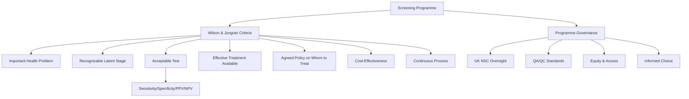
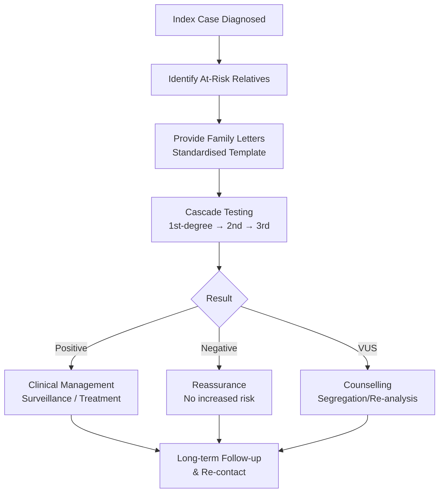

**Parent Topic:** [Clinical Genetics MOC](../Clinical%20Genetics%20MOC.md) → [Chapter 3 Hierarchy](../Davidson%20Chapter%203%20-%20Clinical%20Genetics%20Hierarchy.md)  
**Status:** `full-fcps-mrcp-note`  
**Priority:** ⭐⭐⭐ HIGHEST (FCPS/MRCP — UK NBS programme, Wilson & Jungner criteria, Carrier screening, Ethics)  
**Source:** Davidson 24th Ed Ch 3; UK NSC (National Screening Committee); PHE/NHS Screening Programmes; FCPS/MRCP syllabus; WHO Wilson & Jungner

---

## 1. 1. 🎯 Learning Objectives
- [ ] Apply **Wilson & Jungner criteria** for screening programme appraisal
- [ ] Describe **UK Newborn Blood Spot (NBS) Screening** programme (9 conditions)
- [ ] Understand **carrier screening** strategies (Population, Ethnicity-based, Expanded panels)
- [ ] Apply **prenatal screening** pathways (Combined test, NIPT, Diagnostic)
- [ ] Understand **cascade testing** and **family screening** for genetic conditions
- [ ] Evaluate **screening ethics**: Benefits, Harms, Informed choice, Equity
- [ ] Answer viva: "Wilson & Jungner criteria" and "NBS pathway for CF"

---

## 2. 2. 🧠 Core Concept: Screening Principles



---

## 3. 3. ️⃣ Wilson & Jungner Criteria (1968, Updated WHO 2008)

| # | Criterion | Key Question |
|---|-----------|--------------|
| 1 | **Important Health Problem** | Is the condition a significant public health burden? |
| 2 | **Latent/Early Stage** | Is there a detectable preclinical phase? |
| 3 | **Natural History Understood** | Progression from latent to clinical disease known? |
| 4 | **Suitable Test** | Acceptable, Safe, Validated, Reproducible; High Sens/Spec |
| 5 | **Acceptable to Population** | Acceptable to those screened & professionals |
| 6 | **Effective Treatment** | Evidence-based intervention for screen-detected cases |
| 7 | **Diagnostic/Treatment Pathway** | Clear pathway from screen+ → Diagnosis → Treatment |
| 8 | **Agreed Policy on Whom to Treat** | Defined eligibility, Intervals, Referral criteria |
| 9 | **Cost-Effectiveness** | Cost per QALY gained acceptable (NICE £20-30k/QALY) |
| 10 | **Continuous Process** | Not a one-off; Ongoing quality assurance, Review |

> **Key:** *Screening ≠ Diagnosis. Screening = Population test to identify at-risk; Diagnostic = Confirmatory.*

---

## 4. 4. ️⃣ UK Newborn Blood Spot (NBS) Screening Programme

### 1. Programme Overview
- **Timing**: Day 5 (Day 3-8 acceptable)
- **Sample**: Heel prick → 4 spots on Guthrie card
- **Coverage**: >99% of newborns in UK
- **Governance**: UK NSC / NHS England / PHE
- **Quality**: UKAS accredited labs, NEQAS participation

### 2. 9 Core Conditions (UK NBS Programme)

| Condition | Method | Incidence | Key Action if Positive |
|-----------|--------|-----------|------------------------|
| **Phenylketonuria (PKU)** | Tandem MS (Phe, Phe/Tyr) | 1/10,000 | Refer to metabolic team; Low-Phe diet + Sapropterin |
| **Congenital Hypothyroidism (CHT)** | TSH (Time-resolved fluoroimmunoassay) | 1/3,000 | Refer to paediatric endocrinology; Levothyroxine |
| **Cystic Fibrosis (CF)** | **IRT** → If high, **CFTR panel** (≥2 muts or 1 mut + high IRT) → Sweat test | 1/2,500 | Refer to CF centre; Multidisciplinary care, CFTR modulators |
| **Sickle Cell Disease (SCD)** | HPLC / IEF (HbS, HbC, HbD, HbE) | 1/2,000 (High in African/Caribbean) | Refer to haematology; Penicillin prophylaxis, Vaccines, TCD screening |
| **Medium-Chain Acyl-CoA Dehydrogenase Deficiency (MCADD)** | Tandem MS (C8 acylcarnitine) | 1/10,000 | Avoid fasting; Emergency regimen; Carnitine supplement |
| **Maple Syrup Urine Disease (MSUD)** | Tandem MS (Leu, Ile, Val, Alloisoleucine) | 1/100,000 | Metabolic team; BCAA-restricted diet, Emergency regimen |
| **Isovaleric Acidaemia (IVA)** | Tandem MS (C5 isovalerylcarnitine) | 1/100,000 | Glycine/Carnitine; Protein restriction, Emergency regimen |
| **Glutaric Aciduria Type 1 (GA1)** | Tandem MS (Glutarylcarnitine C5DC) | 1/100,000 | L-carnitine, Riboflavin, Protein restriction, Emergency regimen |
| **Homocystinuria (HCU)** | Tandem MS (Homocysteine, Metionine) | 1/200,000 | Pyridoxine (B6) responsiveness test; Low-Met diet, Betaine, B6/B12/Folate |

> **Future Expansions (Under Review)**: SCID (TREC assay), Spinal Muscular Atrophy (SMN1), Tyrosinaemia Type 1.

### 3. NBS Pathway for Cystic Fibrosis (Example)

```mermaid
flowchart TD
    A[Day 5 Heel Prick] --> B[IRT Measurement]
    B --> C{IRT Elevated?}
    C -->|No| D[Negative Result → Report]
    C -->|Yes| E[CFTR Mutation Panel
≥2 mutations OR 1 mut + high IRT]
    E --> F{CFTR Result}
    F -->|≥2 muts| G[CF Probable → Sweat Test]
    F -->|1 mut + high IRT| G
    F -->|Negative| H[Carrier Result → Genetic Counselling]
    G --> I[Sweat Cl⁻ >60 mmol/L = CF Confirmed]
    I --> J[Refer CF Centre]
```


### 4. Quality Metrics (UK NBS)
| Metric | Standard |
|--------|----------|
| **Coverage** | >99.5% eligible newborns tested |
| **Timeliness** | Sample taken Day 5 (Day 3-8); Result by Day 17 |
| **False Positive Rate** | <1% (Varies by condition) |
| **PPV** | >10% (Varies; CF ~1:3-1:5 screen positives) |
| **False Negative Rate** | <0.5% (Audit via clinical presentation) |

---

## 5. 5. ️⃣ Carrier Screening Programmes

### 1. Strategy Types
| Strategy | Target Population | Examples |
|----------|-------------------|----------|
| **Population-Based** | Entire population (or newborns) | **UK NBS** (PKU, CHT, CF, SCD, MCADD, etc.) |
| **Ethnicity-Based** | High-prevalence groups | **Thalassaemia** (Mediterranean, Asian, Middle Eastern); **Tay-Sachs** (Ashkenazi Jewish); **SCD** (African/Caribbean); **CF** (Caucasian) |
| **Expanded Panels** | Pre-conception / Early pregnancy | Commercial panels (100-300 genes); **ACMG/ACOG** recommend offer to all |
| **Cascade Testing** | Relatives of index case | **Familial hypercholesterolaemia**, **BRCA**, **Lynch**, **FAP**, **CF** |

### 2. UK Antenatal Screening Programmes

| Programme | Timing | Test | Conditions |
|-----------|--------|------|------------|
| **Sickle Cell & Thalassaemia** | Booking (<10w) | FBC + Hb variant analysis (HPLC/IEF) | Sickle cell, Thalassaemia |
| **Down’s/Edwards/Patau** | 11-14w | **Combined Test** (NT + PAPP-A + β-hCG) | T21, T18, T13 |
| **NIPT** | ≥10w | cfDNA (cfDNA) | T21, T18, T13, Sex chromosomes (Screening) |
| **Infectious Diseases** | Booking | Serology | HIV, Syphilis, Hepatitis B, Rubella |

> **NIPT Pathway (UK):** High-risk Combined test (>1:150) → NIPT → If positive → **Diagnostic CVS/Amnio + Microarray**.

---

## 6. 6. ️⃣ Cascade Testing & Family Screening

### 1. Cascade Testing Pathway


### 2. Cascade Testing by Condition
| Condition | Inheritance | 1st-Degree Risk | Testing Strategy |
|-----------|-------------|-----------------|------------------|
| **Familial Hypercholesterolaemia** | AD | 50% | LDL-C + Genetic testing (LDLR/APOB/PCSK9) |
| **Lynch Syndrome** | AD | 50% | MMR IHC/MSI → Germline testing |
| **HBOC (BRCA1/2)** | AD | 50% | Targeted variant test |
| **FAP** | AD | 50% | APC sequencing |
| **Cystic Fibrosis** | AR | 67% (if 1 affected sib) | CFTR sequencing (siblings) |
| **Haemophilia A/B** | XLR | 50% daughters carriers | Factor assay + Genetic testing |
| **DMD** | XLR | 50% daughters carriers | DMD MLPA/sequencing |

> **Family Letters**: Standardised template (Diagnosis, Gene, Variant, Inheritance, Risk, Testing options, Contact details).

---

## 7. 7. ️⃣ Prenatal Screening — Down Syndrome & Aneuploidy

### 1. Combined Test (11-14 weeks)
| Component | Details |
|-----------|---------|
| **NT** | Nuchal Translucency (CRL 45-84mm) |
| **PAPP-A** | Low in T21 |
| **Free β-hCG** | High in T21, Low in T18/T13 |
| **Maternal Age** | Continuous variable |
| **Output** | Risk score (e.g., 1:150) |

### 2. Risk Thresholds (UK)
| Threshold | Action |
|-----------|--------|
| **≥1:150** | **High Risk** → Offer **NIPT** (cfDNA) |
| **1:151 to 1:1000** | Low Risk → No further testing |
| **<1:1000** | Very Low Risk → Reassurance |

### 3. NIPT (cfDNA) — cfDNA Screening
| Feature | Detail |
|---------|--------|
| **Timing** | ≥10 weeks |
| **Detects** | T21 (>99%), T18 (>98%), T13 (>95%), Sex chromosome aneuploidies |
| **Fetal Fraction** | ≥4% required (Mean 10-15% at 10-12w) |
| **PPV** | T21 ~90% (High risk), T18 ~80%, T13 ~50% |
| **Limitations** | **Screening only**; False + (Maternal mosaicism, Vanishing twin, Malignancy); **Diagnostic confirmation required** |

### 4. Diagnostic Confirmation
| Method | Gestation | Risk | Indication |
|--------|-----------|------|------------|
| **CVS** | 11-14 weeks | 0.5-1% miscarriage | High-risk NIPT, Structural anomalies, Known familial variant |
| **Amniocentesis** | 15-20 weeks | 0.1-0.3% miscarriage | High-risk NIPT, Structural anomalies, Late presentation |
| **Microarray** | On CVS/Amnio | Standard for anomalies | Replaces karyotype for CNV/LOH/UPD |

---

## 8. 8. ️⃣ Screening Ethics & Evaluation

### 1. Ethical Principles (Wilson & Jungner + Modern)
| Principle | Application |
|-----------|-------------|
| **Informed Choice** | Not mandatory; Balanced info (Benefits, Harms, Uncertainty); Opt-out respected |
| **Beneficence vs Harm** | Benefit (Early treatment) vs Harm (False + anxiety, Overdiagnosis, False - false reassurance) |
| **Justice/Equity** | Equal access (Geographic, Socioeconomic, Ethnic); Address disparities |
| **Autonomy** | Right to decline; Right to know / not know; Pre-test counselling |
| **Confidentiality** | Data protection (GDPR); Sample retention policies |

### 2. Programme Evaluation Metrics
| Metric | Target |
|--------|--------|
| **Coverage** | >95% eligible population |
| **Detection Rate (Sensitivity)** | >95% for target conditions |
| **False Positive Rate** | <1-5% (Condition-specific) |
| **Positive Predictive Value (PPV)** | >10% (Varies by condition) |
| **Timeliness** | Sample → Result within defined window (e.g., NBS by Day 17) |
| **Uptake of Diagnostic** | >90% of screen+ve accept diagnostic test |
| **Treatment Initiation** | >95% screen+ve start treatment by defined age |
| **Equity** | No disparity by deprivation/ethnicity/geography |

---

## 9. 9. ⚡ FCPS/MRCP High-Yield Summary

| Screening Programme | Key Points |
|---------------------|------------|
| **Wilson & Jungner** | 10 Criteria (Health problem, Latent stage, Test, Treatment, Cost-effective, QA) |
| **UK NBS (Day 5)** | 9 conditions: PKU, CHT, CF, SCD, MCADD, MSUD, IVA, GA1, HCU |
| **CF NBS Pathway** | IRT → CFTR panel → Sweat test (Cl⁻ >60) |
| **SCD/Thalassaemia Screening** | Antenatal booking (HPLC/IEF) + NBS (HPLC) |
| **Down Syndrome** | Combined test (NT+PAPP-A+β-hCG) 11-14w → High risk → NIPT → CVS/Amnio |
| **NIPT** | cfDNA ≥10w; >99% Sens T21; **Screening only** → Confirm CVS/Amnio |
| **Carrier Screening** | Population (NBS), Ethnicity-based (Thal, SCD, Tay-Sachs), Expanded panels |
| **Cascade Testing** | Proband → 1st-degree (50%) → 2nd-degree; Family letters, Genetic counselling |
| **Ethics** | Informed choice, Non-mandatory, Equity, False +/-, Overdiagnosis, Confidentiality |
| **Wilson & Jungner** | 10 criteria (Health problem, Latent stage, Test, Treatment, Cost-effective) |

---

## 10. 10. 🎤 Viva Questions (Expected Answers)

| # | Question | Expected Answer |
|---|----------|-----------------|
| 1 | Wilson & Jungner criteria — name 5? | 1) Important health problem 2) Recognisable latent stage 3) Suitable test 4) Effective treatment 5) Cost-effectiveness |
| 2 | UK NBS — which 9 conditions screened? | PKU, CHT, CF, SCD, MCADD, MSUD, IVA, GA1, HCU |
| 3 | CF newborn screening pathway? | Heel prick Day 5 → IRT → If elevated, CFTR panel → If 2 muts or 1 mut + high IRT → Sweat test (Cl⁻ >60 = CF) |
| 4 | NIPT — what does it screen for? | T21, T18, T13, Sex chromosomes; **Screening only** → Confirm with CVS/Amnio |
| 5 | CF carrier couple — prenatal options? | CVS (11-14w) qf-PCR + CFTR sequencing, or Amnio (15-20w); PGT-M available |
| 6 | Cascade testing — who first? | **Proband** → 1st-degree relatives (50% risk) → 2nd-degree (25%); Family letters, Genetic counselling each |
| 7 | Sickle cell trait vs disease — NBS detection? | **HPLC/IEF** on dried blood spot detects HbS, HbC, HbD, HbE; Differentiates trait (AS) vs disease (SS, SC, Sβ-thal) |
| 8 | NIPT positive for T21 — next step? | **Confirm with CVS (11-14w) or Amniocentesis (15-20w) + Microarray/Karyotype** |
| 9 | Expanded carrier screening — what is it? | Panel of 100-300 genes offered pre-conception/early pregnancy; Detects carrier status for multiple AR/XL conditions |
| 10 | False positive NBS — impact on family? | Anxiety, Unnecessary testing, Potential harm to bonding; Need rapid confirmatory testing & counselling |

---

## 11. 11. 🧩 Confusions & Mnemonics

| Confusion | Clarification |
|-----------|---------------|
| **"NBS = Diagnostic"** | **NO.** NBS = Screening; Positive → Diagnostic confirmation (Sweat test, Genetic test) |
| **"NIPT = Diagnostic"** | **NO.** NIPT = **Screening only** (cfDNA); **Must confirm** with CVS/Amnio + Microarray/Karyotype |
| **"All screen-positive = Disease"** | **NO.** PPV varies (CF ~20-30%, SCD higher); False positives occur (Carriers, Transient) |
| **"Carrier screening = Mandatory"** | **NO.** **Informed choice** — Opt-out is valid; Non-directive counselling |
| **"Cascade testing = Mandatory for relatives"** | **NO.** Relatives choose; **Family letters** inform; Individual counselling each |
| **"Expanded carrier screening = Better"** | **Not always.** More VUS, Anxiety, Cost; ACMG: Offer to all, but counsel on limitations |
| **"NBS = Diagnostic for CF"** | **NO.** NBS +ve → Sweat test (Cl⁻ >60 diagnostic) + Genetic confirmation |
| **"All genetic conditions screened at birth"** | **NO.** Only 9 conditions in UK NBS; Others: Carrier status detected incidentally |
| **"False positive NBS = No harm"** | **NO.** Anxiety, Unnecessary tests, Bonding disruption; Rapid confirmatory pathway essential |
| **"Carrier = Affected"** | **NO.** Carrier (heterozygote) usually asymptomatic; AR carriers = asymptomatic (mostly) |

> **Mnemonic: SCREENING PRINCIPLES UK**  
> **S**creening ≠ Diagnosis: **Screen → Confirm → Treat**  
> **C**riteria Wilson & Jungner: **10 Points** (Health prob, Latent, Test, Treat, Cost-effective, QA)  
> **R**ecall: **Day 5 Heel Prick** → **9 Conditions** (PKU, CHT, CF, SCD, MCADD, MSUD, IVA, GA1, HCU)  
> **E**arly Detection: **CF (IRT→CFTR→Sweat), SCD (HPLC), CHT (TSH), PKU (Phe/Tyr)**  
> **E**quity: **Informed Choice** — Opt-out OK; Non-directive counselling  
> **N**IPT: **cfDNA Screening** (T21/T18/T13) → **Confirm CVS/Amnio**  
> **I**nformed Choice: **Non-directive, Opt-out OK, Balanced Info**  
> **N**ewborn CF Pathway: **IRT → CFTR Panel → Sweat Cl⁻ >60 = CF**  
> **G**estational Age: **Combined 11-14w → NIPT ≥10w → CVS 11-14w / Amnio 15-20w**  
> **P**ositive Predictive Value: **Varies (CF ~20%, SCD higher)** — False positives exist  
> **R**eflex Testing: **CFTR Panel after IRT; Hb Variant HPLC on NBS**  
> **A**ntenatal: **Sickle/Thal (Booking), Down’s (Combined 11-14w), NIPT (High risk)**  
> **M**ulti-cancer: **MCED (Galleri) — Research, Not Standard**  
> **S**ickle Cell Trait: **NBS Detects** (HPLC/IEF) — Carrier vs Disease Differentiated  
> **C**ascade Testing: **Proband → 1st → 2nd degree** — Family Letters, Counselling  
> **R**eflex: **CFTR after IRT; Hb Variant after NBS**  
> **E**thics: **Autonomy, Beneficence, Justice** — Informed Choice, Equity, Non-harm  
> **E**valuation: **Coverage, Sensitivity, PPV, Timeliness, Equity**  
> **N**BS Programme: **UK NSC Governance, UKAS Labs, NEQAS QA, Day 5 Heel Prick**  

---

## 12. 12. 🗺️ Mind Map

```mermaid
mindmap
  root((Population & Newborn Screening))
    Wilson & Jungner
      10 Criteria
      Health Problem → Latent Stage → Test → Treatment → Cost-effective → QA
    UK NBS (Day 5)
      9 Conditions: PKU, CHT, CF, SCD, MCADD, MSUD, IVA, GA1, HCU
      Pathways: CF (IRT→CFTR→Sweat), SCD (HPLC), PKU (Phe/Tyr)
    Antenatal Screening
      Sickle/Thal (Booking)
      Down's (Combined 11-14w)
      NIPT (cfDNA) → CVS/Amnio
    Carrier Screening
      Population (NBS)
      Ethnicity-based (Thal, SCD, Tay-Sachs, CF)
      Expanded Panels (Pre-conception)
    Prenatal
      Combined Test (NT+PAPP-A+β-hCG)
      NIPT (cfDNA >99% T21)
      CVS/Amnio Diagnostic
    Cascade Testing
      Proband → 1st→2nd degree
      Family Letters
      Counselling each
    Ethics
      Informed Choice
      Non-directive
      Equity
      False +/- Management
    Evaluation
      Coverage, Sensitivity, PPV
      Timeliness, Equity
```

---

## 13. 13. 📅 Spaced Repetition Tracker

| Review | Date | Score (0–5) | Notes |
|--------|------|-------------|-------|
| Day 1 | | | |
| Day 3 | | | |
| Day 7 | | | |
| Day 14 | | | |
| Day 30 | | | |
| Day 90 | | | |

---

## 14. 14. 📝 Self-Test Scorecard

| Section | Max | Score | % |
|---------|-----|-------|---|
| Wilson & Jungner Criteria | 3 | | |
| UK NBS Programme (9 conditions) | 3 | | |
| CF NBS Pathway | 2 | | |
| Antenatal/DN Screening | 3 | | |
| NIPT & Diagnostic Confirmation | 3 | | |
| Carrier Screening Types | 2 | | |
| Cascade Testing | 2 | | |
| Ethics & Evaluation | 2 | | |
| **Total** | **20** | | |

---

## 15. 15. 💬 Exam Answer Modes

| Format | Prompt | Key Points |
|--------|--------|------------|
| **Long Essay** | "Describe the UK newborn screening programme and its ethical framework." | Day 5 heel prick, 9 conditions, Pathways (CF, SCD, PKU, CHT), Wilson & Jungner criteria, Ethics (Informed choice, Equity, False + management), Governance (UK NSC, UKAS, NEQAS) |
| **Short Note** | "Wilson & Jungner criteria for screening programmes." | 10 criteria: Health problem, Latent stage, Suitable test, Effective treatment, Diagnostic pathway, Cost-effectiveness, Acceptability, Equity, QA, Continuous process |
| **Viva** | "Couple with CF child, pregnant 10 weeks. CF screening options?" | NIPT (cfDNA) not for CF; CVS 11-14w with qf-PCR + CFTR sequencing (known familial mutations); Amniocentesis 15-20w; PGT-M option for future |
| **Ward Round** | "Neonate with positive NBS for CF (IRT high, 1 CFTR mutation). Sweat chloride 55 mmol/L. Next step?" | **Sweat Cl⁻ 55 = Intermediate (30-59)**; Repeat sweat test in 2-4 weeks; Genetic counselling; CFTR sequencing for 2nd mutation |
| **Last-Night** | "Wilson: 10 criteria. NBS: 9 cond (PKU,CHT,CF,SCD,MCADD,MSUD,IVA,GA1,HCU). CF: IRT→CFTR→Sweat>60. Sickle: HPLC. Antenatal: Sickle/Thal booking, Down's Combined 11-14w, NIPT≥10w→CVS/Amnio. Cascade: Proband→1st→2nd. Ethics: Choice/Equity/False+. Wilson 10pts." | Compressed. |

---

## 16. 16. 📌 Summary
- **Wilson & Jungner**: 10 criteria (Health burden, Latent stage, Test, Treatment, Cost-effectiveness, QA, etc.)
- **UK NBS**: Day 5 heel prick, **9 conditions** (PKU, CHT, CF, SCD, MCADD, MSUD, IVA, GA1, HCU)
- **CF Pathway**: IRT → CFTR panel → Sweat Cl⁻ >60 = CF
- **Antenatal**: Sickle/Thal at booking; **Down’s: Combined Test (NT+PAPP-A+β-hCG) 11-14w** → High risk → **NIPT (cfDNA)** → **CVS/Amnio + Microarray**
- **NIPT**: cfDNA ≥10w, **Screening only** (>99% T21), **Confirm CVS/Amnio + Microarray**
- **Carrier Screening**: NBS (Population), Ethnicity-based (Thal, SCD, Tay-Sachs), **Expanded panels** (Pre-conception)
- **Cascade Testing**: Proband → 1st-degree (50%) → 2nd-degree (25%); Family letters; Counselling each
- **Ethics**: Informed choice (Opt-out OK), Non-directive, Equity, False +/-, Overdiagnosis, Confidentiality
- **Evaluation**: Coverage >95%, Sensitivity >95%, PPV, Timeliness, Equity, Treatment initiation

---

## 17. 17. ❓ MCQs (10)

1. **Wilson & Jungner — which is NOT a criterion?**  
   A. Important health problem  B. Latent stage  C. **Test must be 100% sensitive**  D. Cost-effectiveness  
   *Answer: C. Test must be acceptable/sensitive/specific — not 100%.*

2. **UK NBS — which is NOT screened?**  
   A. PKU  B. CHT  C. **Duchenne MD**  D. MCADD  
   *Answer: C. DMD not in UK NBS (9 conditions: PKU, CHT, CF, SCD, MCADD, MSUD, IVA, GA1, HCU).*

3. **CF NBS — borderline sweat chloride (30-59 mmol/L)?**  
   A. Diagnose CF  B. **Repeat in 2-4 weeks**  C. Diagnose carrier  D. No further action  
   *Answer: B. Intermediate (30-59) → Repeat in 2-4 weeks; >60 = CF; <30 = Normal.*

4. **NIPT — what is confirmed by CVS/Amnio?**  
   A. Positive NIPT  B. Negative NIPT  C. Inconclusive NIPT  D. All of above  
   *Answer: A. Positive NIPT → Diagnostic confirmation with CVS/Amnio + Microarray.*

5. **Sickle cell newborn screening — method?**  
   A. IRT  B. **HPLC / IEF**  C. TSH  C. Tandem MS for Phe/Tyr  
   *Answer: B. HPLC or Isoelectric Focusing (IEF) on dried blood spot.*

6. **Carrier screening — which is population-based in UK?**  
   A. Thalassaemia  B. **Newborn Blood Spot (PKU, CF, etc.)**  C. Tay-Sachs  D. Ashkenazi panel  
   *Answer: B. Newborn Blood Spot = Population screening for 9 conditions.*

6. **CF carrier couple — prenatal diagnosis options?**  
   A. NIPT only  B. **CVS 11-14w (qf-PCR + CFTR seq) or Amnio 15-20w**  C. Ultrasound only  D. Wait for birth  
   *Answer: B. CVS (11-14w) with qf-PCR + CFTR sequencing for known familial variants; Amnio 15-20w.*

8. **Cascade testing — who is tested first?**  
   A. Grandparents  B. **Proband (Index case)**  C. 2nd-degree relatives  D. All simultaneously  
   *Answer: B. Proband → 1st-degree (50%) → 2nd-degree (25%).*

9. **NIPT positive for T21 — next step?**  
   A. Terminate  B. **Confirm with CVS/Amnio + Microarray**  C. Repeat NIPT  D. Ultrasound only  
   *Answer: B. NIPT = Screening; Confirm with diagnostic CVS/Amnio + Microarray.*

10. **Expanded carrier screening — key counselling point?**  
    A. Tests all genetic diseases  B. **May identify VUS, anxiety, cost; Counselling on limitations**  C. Replaces NBS  D. Mandatory  
    *Answer: B. Expanded panels: More VUS, Anxiety, Cost; Counselling on limitations essential.*

---

## 18. 18. 📋 SBAs (10)

1. **UK newborn screening — day of sample collection?**  
   A. Day 1  B. Day 3  C. **Day 5**  D. Day 7  
   *Answer: Day 5 (Day 3-8 acceptable).*

2. **Sickle cell disease vs trait on NBS — differentiation?**  
   A. Not possible  B. **HPLC/IEF quantifies HbS, HbA, HbF**  C. Requires genetic test  D. Clinical only  
   *Answer: B. HPLC/IEF quantifies Hb fractions: SS/SC/Sβ-thal = Disease; AS = Trait.*

3. **Down syndrome screening — high risk Combined Test. Next step?**  
   A. Diagnostic CVS  B. **NIPT (cfDNA)**  C. Amniocentesis  D. Repeat Combined Test  
   *Answer: B. NIPT (cfDNA) offered for high-risk Combined test (≥1:150).*

4. **Cascade testing for FH — who tested first?**  
   A. Grandparents  B. **Proband → 1st-degree relatives**  C. Children  D. All family  
   *Answer: B. Proband → 1st-degree (50% risk) → 2nd-degree.*

5. **NIPT positive for Trisomy 18 — confirmatory test?**  
   A. Repeat NIPT  B. **CVS/Amniocentesis + Microarray**  C. Ultrasound only  D. Combined test  
   *Answer: B. Diagnostic confirmation with CVS/Amnio + Microarray required.*

---

## 19. 19. 🔑 Answer Keys
| MCQs | SBAs |
|------|------|
| 1-C, 2-C, 3-B, 4-A, 5-B, 6-B, 7-B, 8-B, 9-B, 10-B | 1-C, 2-B, 3-B, 4-B, 5-B |

---

## 20. 20. 🔗 Cross-Links
- [[2.1 Mendelian Inheritance]] — AR/AD/XL inheritance in screened conditions
- [[1. Fundamentals of Medical Genetics]] — HWE for carrier frequency calculations
- [[5.4 Prenatal & Preimplantation Testing]] — NIPT, CVS, Amnio, PGT-M pathways
- [[5.5 Genetic Counselling]] — Pre-test counselling, Result disclosure, Reproductive options
- [[4.2 Autosomal Recessive Disorders]] — CF, Sickle cell, Thalassaemia, PKU, MCADD, MSUD, IVA, GA1, HCU
- [[4.3 X-Linked Disorders]] — DMD, Haemophilia, G6PD in screening context
- [[5.1-5.4 Genetic Testing Technologies]] — NIPT (cfDNA), Microarray, qf-PCR, MLPA
- [[5.5 Genetic Counselling]] — Pre-test counselling, Result disclosure, Cascade testing
- [[8. Population & Newborn Screening]] — UK NSC governance, QA/QC, NEQAS
- [[9. ELSI]] — Screening ethics, Consent, Equity, False positives, Data protection

---

**Last Updated:** 2026-06-14  
**Next:** Build `9. ELSI.md`, `10. System-Based Clinical Genetics.md`

## PasTest Scenario SBAs (Clinical Vignettes)

> **Auto-generated PasTest/Mediscope-style scenario SBAs** grounded in the authored source. Each scenario tests a real clinical fact (triad, specific sign, contraindication, trial, first-line Rx) extracted from the topic. *Source: Ch 3: Clinical Genetics — Population & Newborn Screening*

**Q1.** Which of the following features is most specific or characteristic of Population & Newborn Screening?

  - **A.** "NBS = Diagnostic"
  - **B.** A feature common to many acute inflammatory conditions
  - **C.** A non-specific sign that does not localise the diagnosis
  - **D.** An investigation finding rather than a clinical feature

  > **Answer: A** — "NBS = Diagnostic"
  >
  > *Source:* Confusion | Clarification |
|-----------|---------------|
| **"NBS = Diagnostic"** | **NO.** NBS = Screening; Positive → Diagnostic confirmation (Sweat test, Genetic test) |
| **"NIPT = Diagnostic"** 

