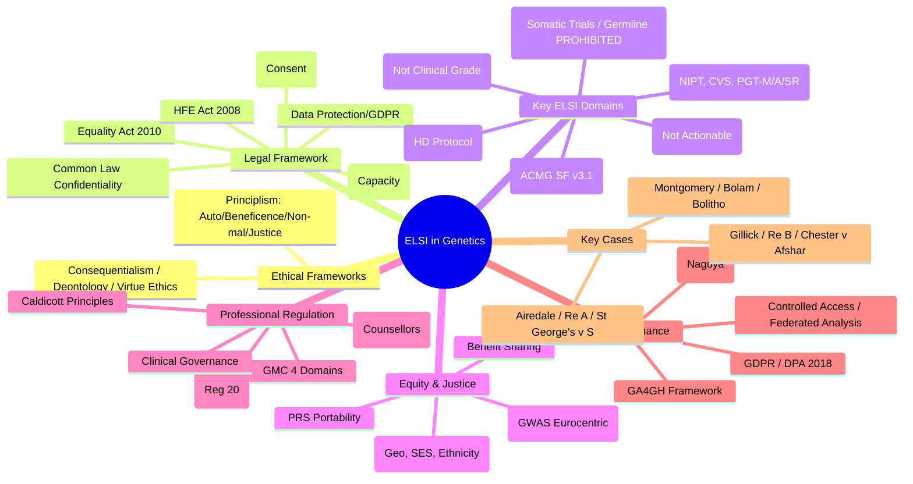

**Parent Topic:** [Clinical Genetics MOC](../Clinical%20Genetics%20MOC.md) → [Chapter 3 Hierarchy](../Davidson%20Chapter%203%20-%20Clinical%20Genetics%20Hierarchy.md)  
**Status:** `full-fcps-mrcp-note`  
**Priority:** ⭐⭐⭐ HIGHEST (FCPS/MRCP — Ethics frameworks, UK Law, Consent, Privacy, Discrimination, Justice, Gene editing)  
**Source:** Davidson 24th Ed Ch 3; Nuffield Council on Bioethics; GMC Good Medical Practice; UK Law (HRA 1998, Equality Act 2010, Data Protection Act 2018, HFE Act 2008); Nuffield/ESHG/ACMG statements; FCPS/MRCP syllabus

---

## 1. 1. 🎯 Learning Objectives
- [ ] Apply **ethical frameworks** (Principlism, Consequentialism, Virtue ethics) to genetic dilemmas
- [ ] Navigate **UK legal framework**: Consent (Montgomery), Capacity (MCA 2005), Confidentiality, Discrimination (Equality Act 2010), HFE Act
- [ ] Analyse **key ELSI issues**: Predictive testing, Prenatal/PGT, VUS, Incidental findings, DTC testing, Gene editing
- [ ] Apply **justice & equity** principles: Access, Ancestry bias, Resource allocation, Global genomics
- [ ] Navigate **professional regulation**: GMC, HCPC, Caldicott, Caldicott Guardians, Duty of candour
- [ ] Answer viva: "Duty to warn vs Confidentiality" and "VUS ethics" and "Gene editing ethics"

---

## 2. 2. 🧠 Core Concept: ELSI Framework

```mermaid
flowchart TD
    A[ELSI in Genetics] --> B[Ethical Frameworks]
    B --> B1[Principlism
Autonomy, Beneficence, Non-maleficence, Justice]
    B --> B2[Consequentialism
Outcomes-based]
    B --> B3[Virtue Ethics
Character, Phronesis]
    A --> C[Legal Framework]
    C --> C1[Autonomy & Consent
Montgomery, MCA 2005]
    C --> C2[Confidentiality & Privacy
Data Protection 2018, GDPR, Caldicott]
    C --> C3[Anti-Discrimination
Equality Act 2010, GINA (US), ABI Code]
    C --> C4[Reproductive Law
HFE Act 2008, Abortion Act 1967]
    C --> C5[Research Ethics
HRA, REC, GDPR, Declaration of Helsinki]
    A --> D[Key ELSI Domains]
    D --> D1[Predictive Testing]
    D --> D2[Prenatal/PGT]
    D --> D3[VUS & Incidental Findings]
    D --> D4[DTC Testing]
    D --> D5[Gene Editing]
    D --> D6[Equity & Justice]
    D --> D6b[Data Sharing & Governance]
```

---

## 3. 3. ️⃣ Ethical Frameworks

### 1. Four Principles (Beauchamp & Childress) — Dominant in Clinical Ethics
| Principle | Definition | Genetic Application |
|-----------|------------|---------------------|
| **Autonomy** | Respect for self-determination | Informed consent, Right to know/not know, Reproductive choices, Advance decisions |
| **Beneficence** | Act in patient's best interest | Early diagnosis, Preventive surveillance, Cascade testing, Therapeutic intervention |
| **Non-maleficence** | "First, do no harm" | Avoid unnecessary testing, Prevent discrimination, Manage VUS carefully, Protect privacy |
| **Justice** | Fair distribution of benefits/burdens | Equitable access to testing/therapy, Resource allocation, Address ancestry bias |

### 2. Other Ethical Theories
| Theory | Core Idea | Genetic Application |
|--------|-----------|---------------------|
| **Consequentialism / Utilitarianism** | Maximise overall good | Population screening (Maximise QALYs), Resource allocation (NICE ICER) |
| **Deontology** | Duties/Rules (Kant: Categorical Imperative) | Duty to warn, Truth-telling, Respect for autonomy as duty |
| **Virtue Ethics** | Character of moral agent (Phronesis/Practical Wisdom) | Clinical judgement in VUS, Compassionate communication, Professional integrity |
| **Principlism** (Mainstream) | Balance 4 principles in context | Balanced decision-making in complex cases (e.g., PGT, VUS, Duty to warn) |

> **No Hierarchy:** Principles balanced case-by-case using **proportionality** (least restrictive means), **necessity**, **subsidiarity**.

---

## 4. 4. ️⃣ UK Legal Framework — Key Statutes & Cases

### 1. Autonomy & Consent
| Law/Case | Principle | Genetic Relevance |
|----------|-----------|-------------------|
| **Montgomery v Lanarkshire (2015)** | **Patient-centred consent**: Material risks (reasonable patient test) + Reasonable alternatives | Genetic test risks (VUS, incidental, psychosocial), Alternatives (No testing, Alternative tests) |
| **Mental Capacity Act 2005** | **2-stage test**: Impairment → Functional (Understand, Retain, Weigh, Communicate) | Capacity for genetic testing decisions; Best interests if lacks capacity |
| **Gillick Competence** | Child <16 can consent if "sufficient understanding" | Consent for genetic testing in mature minors |
| **Re B (Adult: Refusal of Treatment)** | Competent adult can refuse life-saving treatment | Right to decline genetic testing / preventive surgery |

### 2. Negligence Standard
| Case | Standard |
|------|----------|
| **Bolam (1957)** | Not negligent if acts per "responsible body of medical opinion" |
| **Bolitho (1997)** | Court can reject medical opinion if **not logical / defensible** |
| **Chester v Afshar (2004)** | Failure to warn = Breach of duty (Causal link presumed for non-disclosure) |

### 3. Confidentiality & Data Protection
| Law | Key Provisions |
|-----|----------------|
| **Data Protection Act 2018 / UK GDPR** | Lawful basis (Consent/Public task); Data minimisation; Subject rights (Access, Rectification, Erasure, Portability); DPIA for high-risk processing |
| **Common Law Duty of Confidence** | Implied; Breach only if: Consent, Legal obligation, Public interest (Serious harm to others) |
| **Caldicott Principles** (1997/2013/2020) | 8 Principles: Justify purpose, Minimum necessary, Access on need-to-know, Awareness, Duty to share = Duty to protect, Legal compliance, Information governance |
| **Caldicott Guardians** | Senior clinician responsible for confidentiality in NHS organisations |

### 4. Anti-Discrimination Law
| Law | Protections |
|-----|-------------|
| **Equality Act 2010** | Protected characteristics (Disability includes genetic predisposition); Direct/Indirect discrimination, Harassment, Victimisation |
| **Genetic Information Non-discrimination Act (GINA) 2008 (US)** | Health insurance & Employment discrimination based on genetic info |
| **ABI Code on Genetic Testing (UK)** | Voluntary code: Insurers cannot require genetic tests; Only use results if voluntary disclosed; Predictive test results not used for most policies |

### 5. Reproductive Law (UK)
| Act | Provision |
|-----|-----------|
| **Human Fertilisation & Embryology Act 2008** | Regulates IVF, PGT, Embryo research, Gamete/Embryo donation, Surrogacy; HFEA regulation |
| **Abortion Act 1967** | Legal abortion <24w (Risk to mother > termination); Ground E: Substantial risk of serious handicap |
| **Mental Capacity Act 2005** | Best interests decision-making for those lacking capacity |
| **Children Act 1989/2004** | Welfare of child paramount; Gillick competence; Parental responsibility |

---

## 5. 5. ️⃣ Key ELSI Domains

### 1. 3.1 Predictive & Presymptomatic Testing
| Issue | Ethical/Legal Consideration |
|-------|----------------------------|
| **Adult-Onset (HD, Cancer)** | **Defer until 18** (Autonomy); Protocol: Pre-test counselling, Reflection, In-person disclosure |
| **Childhood-Onset (FAP, MEN, RET)** | **Test if childhood benefit** (FAP 10-12y, MEN2B <1y); Otherwise defer |
| **Paediatric Testing** | **Best interests**; Defer predictive unless childhood medical benefit |
| **Insurance** | UK: Equality Act 2010 (Genetic disability protected); ABI Code: No mandatory testing; Disclosure if asked |
| **Employment** | Equality Act 2010: Genetic discrimination illegal; GINA (US) |

### 2. 3.2 Prenatal & Preimplantation Genetic Testing
| Issue | Ethical/Legal Framework |
|-------|-------------------------|
| **Prenatal Diagnosis (PND)** | CVS/Amnio after high-risk screening; **Woman's right to choose** (Abortion Act 1967 Ground E); Non-directive counselling |
| **NIPT** | Screening only; High false + for rare conditions; Informed consent for cfDNA; **No sex selection** (UK illegal) |
| **PGT-M/PGT-A/PGT-SR** | HFEA regulated; PGT-M for known familial variant; PGT-A (Aneuploidy); PGT-SR (Translocations); Embryo selection ethics |
| **Sex Selection** | **Illegal in UK** (HFEA Act) except for X-linked disorders (e.g., DMD) |
| **Deaf/Disabled Embryo Selection** | Controversial; HFEA allows for "serious disability" (Contested by Deaf community) |

### 3. 3.2 VUS & Incidental Findings
| Issue | Guidance |
|-------|----------|
| **VUS Communication** | "Not actionable"; Explain uncertainty; Do not use for clinical decisions; Offer segregation/functional studies; Plan re-analysis |
| **Incidental Findings (IF)** | **ACMG SF v3.1** (59 genes): Pathogenic/LP variants in actionable genes; **Opt-out** for secondary findings; Disclose if actionable |
| **Secondary Findings in PGT/WES** | ACMG SF list; Opt-out option; Counselling pre-test |
| **Re-classification** | VUS → P/LP over time; Duty to re-contact? Emerging duty (GMC); Re-analysis policy |

### 4. 3.3 Direct-to-Consumer (DTC) Genetic Testing
| Issue | Concern |
|-------|---------|
| **Clinical Validity** | Not clinical grade; Limited variants; False +/-, Limited counselling |
| **Interpretation** | Consumers misinterpret risk; No genetic counselling included |
| **Data Privacy** | Data sharing/selling; GDPR applies but jurisdiction complex |
| **Regulation** | UK: MHRA (IVD regulation); FDA (US); Not clinical diagnostic standard |
| **Counselling Gap** | No pre/post-test counselling; Misinterpretation risk (e.g., BRCA, APOE) |

### 5. 3.4 Gene Editing (CRISPR/Cas9)
| Application | Status | Ethical Issues |
|-------------|--------|----------------|
| **Somatic (Somatic gene therapy)** | Clinical trials (Sickle cell, Beta-thalassaemia, Leber congenital amaurosis) | Safety, Off-target effects, Access, Cost |
| **Germline (Heritable)** | **Globally prohibited** (WHO moratorium, UK HFEA illegal, CRISPR babies scandal 2018) | **Heritable changes**, Consent impossible, Eugenics, Equity, "Designer babies", Unintended consequences |
| **Research** | Permitted (UK: HFEA licence, 14-day rule for embryos) | 14-day rule, No implantation, Strict oversight |

### 6. 3.5 Data Sharing & Governance
| Framework | Key Points |
|-----------|------------|
| **UK GDPR / DPA 2018** | Lawful basis (Public task/Consent); DPIA; Subject rights; International transfers (Adequacy decisions) |
| **Data Sharing Frameworks** | GA4GH (Framework for Responsible Sharing); National genomic data libraries (Genomics England, NHS GMS) |
| **Controlled Access** | DACs (Data Access Committees); Tiered access (Registered, Controlled, Open) |
| **Federated Analysis** | Analysis at source (No data transfer); Secure enclaves (Trusted Research Environments) |
| **Benefit Sharing** | Nagoya Protocol (Genetic resources); Benefit-sharing agreements for indigenous/population data |

---

## 6. 6. ️⃣ Equity & Justice in Genomics

### 1. Ancestry Bias
| Problem | Impact | Mitigation |
|---------|--------|------------|
| **GWAS 80%+ European** | PRS poor portability; Missed variants in underrepresented groups | Diverse biobanks (All of Us, Biobank Japan, H3Africa); Ancestry-specific PRS; Multi-ancestry GWAS |
| **PGx Guidelines Eurocentric** | Dosing algorithms fail in non-European | CPIC/DPWG expanding diversity; Ancestry-specific guidelines |
| **Reference Genomes** | GRCh38 primarily European | Pangenome graphs; Diverse reference panels |

### 2. Access & Equity
| Dimension | Challenge | Solution |
|-----------|-----------|----------|
| **Geographic** | Urban vs Rural access to genetics | Telegenetics, Mobile clinics, Hub-and-spoke |
| **Socioeconomic** | Cost, Insurance, Time off work | NHS free at point of care; Travel vouchers; Flexible hours |
| **Ethnic/Racial** | Underrepresentation in research; Mistrust | Community engagement; Diverse research teams; Culturally sensitive materials |
| **Language/Literacy** | Complex concepts, Low health literacy | Plain language, Interpreters, Visual aids, Teach-back |
| **Disability** | Accessible formats, Communication needs | Easy-read, BSL interpreters, Assistive technology |

---

## 7. 7. ️⃣ Professional Regulation & Governance

### 1. GMC Good Medical Practice (2024) — 4 Domains
| Domain | Genetic Relevance |
|--------|-----------------|
| **1. Knowledge, Skills & Performance** | Maintain genomic competence; Recognise limits; Use guidelines (NICE, NCCN) |
| **2. Safety & Quality** | Patient safety (VUS, Incidental findings); Risk management; Infection control |
| **3. Communication, Partnership & Teamwork** | Genetic counselling skills; Shared decision-making; MDT working (MDT, Genetics) |
| **4. Maintaining Trust** | Honesty (VUS uncertainty), Integrity, Confidentiality, Probity |

### 2. HCPC Standards (Genetic Counsellors)
- **Standards of Proficiency**: Genetic risk assessment, Counselling skills, Ethical practice, CPD
- **Standards of Conduct**: Honesty, Integrity, Boundaries, Confidentiality

### 3. Clinical Governance
| Element | Genetic Application |
|---------|---------------------|
| **Clinical Audit** | Testing turnaround, Diagnostic yield, VUS rate, Compliance with guidelines |
| **Incident Reporting** | Misdiagnosis, Wrong result, Wrong patient, Data breach, Duty of candour |
| **Risk Management** | Risk registers (VUS, Sample mix-up, Data breach); Mitigation plans |
| **Revalidation** | CPD in genomics; QI project; MSF/PSQ; Appraisal |
| **Caldicott Guardians** | Senior clinician overseeing genetic data confidentiality |

### 4. Duty of Candour (Statutory — Reg 20 HSCA 2008)
| Trigger | Action |
|---------|--------|
| **Notifiable Safety Incident** | Unintended/unexpected: Death, Severe harm, Moderate harm, Prolonged psychological harm |
| **Organisational Duty** | Tell patient (in person + writing), Apologise, Explain, Support, Record |
| **Professional Duty** | Same + Report to regulator if required |
| **Genetic Context** | Wrong result reported, VUS miscommunicated, Wrong patient tested, Data breach |

---

## 8. 8. ⚡ FCPS/MRCP High-Yield Summary

| Topic | Key Points |
|-------|------------|
| **Ethical Principles** | Autonomy, Beneficence, Non-maleficence, Justice (Principlism) |
| **Consent Law** | Montgomery (Material risk + Alternatives), MCA 2005 (2-stage capacity), Montgomery > Bolam |
| **Confidentiality** | Common law + GDPR + Caldicott; Exceptions: Consent, Law, Public interest (Serious harm) |
| **Duty to Warn** | MHC 2019: Serious harm, Identifiable person, No other way |
| **Predictive Testing** | HD protocol (3 sessions, Reflection, 2 clinicians, No <18y); Cancer (NICE criteria, Cascade) |
| **Paediatric Testing** | Defer <18y unless childhood benefit (FAP 10-12y, MEN2B <1y, RET) |
| **Prenatal/PGT** | NIPT = Screening (Confirm CVS/Amnio); PGT-M/A/SR (HFEA); Sex selection illegal (UK) |
| **VUS** | Not actionable; Explain uncertainty; Segregation/Functional/Re-analysis; Document |
| **Incidental Findings** | ACMG SF v3.1 (59 genes); Opt-out option; Actionable only |
| **DTC Testing** | Not clinical grade; No counselling; Caveat emptor; Confirm in CLIA lab |
| **Gene Editing** | Somatic = Trials; Germline = Prohibited (WHO, HFEA); 14-day rule |
| **Discrimination** | Equality Act 2010 (Genetic disability protected); ABI Code (Insurance); GINA (US) |
| **Duty of Candour** | Statutory (Reg 20): Tell, Apologise, Explain, Support, Record (Notifiable incidents) |
| **Equity** | Ancestry bias (GWAS Eurocentric); Access disparities; Diverse biobanks needed |

---

## 9. 9. 🎤 Viva Questions (Expected Answers)

| # | Question | Expected Answer |
|---|----------|-----------------|
| 1 | What are the 4 principles of medical ethics? | Autonomy, Beneficence, Non-maleficence, Justice (Principlism) |
| 2 | How did Montgomery v Lanarkshire change consent law? | Shifted from **Bolam (doctor-centric)** to **Montgomery (patient-centric)** — Must disclose **material risks** (reasonable patient test) + **reasonable alternatives** |
| 3 | When can you breach genetic confidentiality? | **Duty to warn** (MHC 2019): Serious harm to identifiable person, No other way to prevent harm. Also: Legal obligation (notifiable diseases, court order), Public interest (rare). |
| 4 | Predictive testing for Huntington disease — minimum age? | **18 years** (Gillick competence if mature minor; Standard protocol: 3 sessions, reflection, 2 clinicians). |
| 5 | VUS — how to communicate? | **Not actionable**; "We don't know if this causes disease"; Offer segregation/functional studies; Plan re-analysis; Document clearly. |
| 6 | Duty of Candour — when triggered? | **Notifiable safety incident**: Unintended/unexpected Death, Severe harm, Moderate harm, Prolonged psychological harm. |
| 6 | Paediatric predictive testing — when allowed? | Only if **medical benefit in childhood** (FAP 10-12y, MEN2B <1y, RET; NOT for HD, BRCA, adult-onset). |
| 7 | Gene editing — somatic vs germline? | **Somatic**: Clinical trials (Sickle cell, Thalassaemia, LCA). **Germline**: Prohibited (WHO moratorium, UK HFEA illegal). |
| 8 | Incidental findings in WES — ACMG SF v3.1? | 59 actionable genes; **Opt-out option**; Report Pathogenic/LP only; Counselling pre-test. |
| 9 | Gene editing — therapeutic vs enhancement? | Therapy = Treat disease; Enhancement = Improve beyond normal. **Germline enhancement prohibited** (Eugenics, Equity, Consent). |
| 10 | DTC genetic testing — key concerns? | Not clinical grade; No counselling; Misinterpretation; Data privacy; Regulation gaps; Confirm in CLIA lab. |

---

## 10. 10. 🧩 Confusions & Mnemonics

| Confusion | Clarification |
|-----------|---------------|
| **"Montgomery = Tell all risks"** | **NO.** Only **material risks** (reasonable person test + doctor's knowledge of patient). |
| **"VUS = Probably pathogenic"** | **NO.** VUS = **Uncertain significance**; NOT actionable. Do not base clinical decisions on VUS. |
| **"Duty to warn = Tell family everything"** | **NO.** Only if: Serious harm, Identifiable person, No alternative. Proportionate disclosure. |
| **"Germline editing = CRISPR babies allowed"** | **NO.** **Prohibited globally** (WHO moratorium, UK HFEA illegal). 14-day rule for embryos. |
| **"Somatic editing = Same ethics as germline"** | **NO.** Somatic = Treat patient (Clinical trials); Germline = Heritable changes (Prohibited). |
| **"DTC testing = Clinical grade"** | **NO.** Not clinical grade; Variants limited; No counselling; Confirm in CLIA lab. |
| **"VUS = Likely pathogenic"** | **NO.** VUS = UNCERTAIN. Do not act on it. Segregation/Functional/Re-analysis needed. |
| **"Paediatric testing = Parents decide"** | **NO.** Child's autonomy; Defer until 18 unless childhood medical benefit (FAP, MEN, RET). |
| **"Duty of candour = Admit negligence"** | **NO.** Apology = "Sorry this happened" ≠ "I was negligent". Statutory duty to be open. |
| **"All genetic tests need consent"** | **Yes, but** exceptions: Emergency (implied consent), Legal obligation (notifiable diseases), Public interest. |

> **Mnemonic: ELSI GENETICS FRAMEWORK**  
> **E**thical Principles: **Autonomy, Beneficence, Non-maleficence, Justice** (Principlism)  
> **L**egal Framework: **Montgomery (Consent), MCA 2005 (Capacity), Equality Act 2010 (Discrimination)**  
> **S**tatutes: **HRA 1998 (Art 2,3,5,8,9), Data Protection 2018/GDPR, HFE Act 2008, MCA 2005**  
> **I**nformed Consent: **Montgomery (Material Risk + Alternatives)** — **Bolam/Bolitho** (Negligence)  
> **G**enetic Counselling: **Non-directive, Confidential, Family-centred, Psychosocial**  
> **E**thical Domains: **Predictive, Prenatal/PGT, VUS, Incidental, DTC, Editing, Equity**  
> **N**on-directive: **Respect Autonomy** — Info not Advice; Patient Decides  
> **E**xceptions to Confidentiality: **Consent, Legal Obligation, Public Interest (Serious Harm)**  
> **T**esting Ethics: **Predictive (HD Protocol), Paediatric (Defer <18 unless Benefit)**  
> **I**ncidental Findings: **ACMG SF v3.1 (59 genes), Opt-out, Actionable Only**  
> **C**ascade Testing: **Proband → 1st → 2nd Degree → Family Letters → Each Counseled**  
> **S**creening Ethics: **Wilson & Jungner (10 Criteria) — Informed Choice, Non-directive**  
> **D**TC Testing: **Not Clinical Grade** — No Counselling, Caveat Emptor, Confirm CLIA  
> **G**ene Editing: **Somatic (Trials) vs Germline (PROHIBITED — WHO/HFEA)**  
> **E**quity: **Ancestry Bias (GWAS Eurocentric), Access, Diversity, Justice**  
> **D**uty to Warn: **MHC 2019 — Serious Harm + Identifiable + No Alternative**  
> **I**ncidental Findings: **ACMG SF v3.1 (59 Genes), Opt-out, Actionable Only**  
> **S**omatic vs Germline: **Somatic = Patient; Germline = Heritable (Prohibited)**  
> **C**andour: **Reg 20 HSCA — Tell, Apologise, Explain, Support, Record**  
> **R**esponsible Innovation: **GA4GH Framework, Benefit Sharing, Data Governance**  
> **E**diting Ethics: **Therapy vs Enhancement; Germline = Eugenics Risk**  
> **T**rust: **GMC 4 Domains (Knowledge, Safety, Communication, Trust)**  
> **I**nformation Governance: **Caldicott Principles (8), Caldicott Guardians, GDPR, DPA 2018**  
> **C**ascade Testing: **Proband → 1st → 2nd → Family Letters → Each Counsels**  
> **A**ccess & Justice: **Ancestry Bias, Diverse Biobanks, PRS Portability, Community Engagement**  
> **L**egal: **Equality Act 2010 (Genetic Disability Protected), ABI Code (Insurance), GINA (US)**  
> **S**ocial Justice: **Genomic Justice — Fair Distribution of Benefits/Burdens**  

---

## 11. 11. 🗺️ Mind Map



---

## 12. 12. 📅 Spaced Repetition Tracker

| Review | Date | Score (0–5) | Notes |
|--------|------|-------------|-------|
| Day 1 | | | |
| Day 3 | | | |
| Day 7 | | | |
| Day 14 | | | |
| Day 30 | | | |
| Day 90 | | | |

---

## 13. 13. 📝 Self-Test Scorecard

| Section | Max | Score | % |
|---------|-----|-------|---|
| Ethical Frameworks | 2 | | |
| Consent Law (Montgomery, MCA) | 3 | | |
| Confidentiality & Data Protection | 3 | | |
| Predictive Testing & HD Protocol | 3 | | |
| Prenatal/PGT Ethics | 2 | | |
| VUS & Incidental Findings | 2 | | |
| Gene Editing (Somatic vs Germline) | 2 | | |
| DTC Testing & DTC | 2 | | |
| Equity & Ancestry Bias | 2 | | |
| Professional Regulation (GMC, Candour) | 2 | | |
| **Total** | **20** | | |

---

## 14. 14. 💬 Exam Answer Modes

| Format | Prompt | Key Points |
|--------|--------|------------|
| **Long Essay** | "Discuss the ethical, legal, and social implications of predictive genetic testing for adult-onset conditions." | Autonomy/Principlism, HD protocol (3 sessions, reflection, 2 clinicians), Montgomery consent, VUS management, Insurance/Employment discrimination (Equality Act/ABI), Psychosocial impact, Counselling |
| **Short Note** | "Duty of candour in genetics." | Statutory (Reg 20 HSCA 2008); Notifiable incidents (Death, Severe/Mod harm, Psych harm); Tell + Apologise + Explain + Support + Record; Apology ≠ Admission of liability; Genetic examples (Wrong result, VUS, Data breach) |
| **Viva** | "Patient with BRCA1 mutation refuses to tell her sister. Your duty?" | Respect autonomy; Encourage disclosure; Offer family letter; **Duty to warn only if serious harm, identifiable, no alternative** (MHC 2019); Document |
| **Ward Round** | "WES returns VUS in BRCA2. Patient asks if she should have mastectomy. Your advice?" | **VUS not actionable**; Do not base surgery on VUS; Explain uncertainty; Offer segregation (test relatives), Functional studies, Re-analysis in 1-2y; Document |
| **Last-Night** | "Montgomery: Material risk + Alternatives. MCA: Impair→Func(U/R/W/C). Confidentiality: Consent/Law/Public Interest. VUS: Not actionable. HD: 3 sessions, 2 clinicians, 18+. Paediatric defer unless benefit. Gene editing: Somatic trials, Germline banned. DTC: Not clinical. Incidental: ACMG SF 59 genes, Opt-out. Candour: Tell+Apologise+Explain+Support+Record. Equity: Ancestry bias, PRS portability." | Compressed. |

---

## 15. 15. 📌 Summary
- **Ethical Frameworks**: **Principlism** (Autonomy, Beneficence, Non-maleficence, Justice) dominant; Also Consequentialism, Deontology, Virtue ethics.
- **Consent Law**: **Montgomery** (Material risk + Alternatives) > **Bolam/Bolitho** (Negligence); **MCA 2005** 2-stage capacity test.
- **Confidentiality**: Common law + GDPR + Caldicott; Exceptions: Consent, Legal obligation, **Public interest (Serious harm to others — Duty to warn, MHC 2019)**.
- **Predictive Testing (HD)**: Protocol — 3 sessions (Genetics, Neurology, Psychiatry), Reflection (2-4 weeks), In-person disclosure by 2 clinicians, No testing <18y.
- **Paediatric Testing**: **Defer until 18** unless childhood medical benefit (FAP 10-12y, MEN2B <1y, RET).
- **VUS**: **Not actionable**; "We don't know"; Segregation/Functional/Re-analysis; Document clearly.
- **Incidental Findings**: **ACMG SF v3.1 (59 genes)**; Opt-out option; Report only Pathogenic/LP.
- **DTC Testing**: Not clinical grade; No counselling; Misinterpretation risk; Confirm in CLIA lab.
- **Gene Editing**: **Somatic** = Clinical trials (Sickle cell, Thalassaemia); **Germline** = **Prohibited** (WHO moratorium, UK HFEA illegal, 14-day rule).
- **Duty of Candour (Statutory Reg 20)**: Notifiable incident → Tell (in person+writing), Apologise, Explain, Support, Record.
- **Discrimination**: **Equality Act 2010** (Genetic disability protected); **ABI Code** (Insurance); **GINA** (US).
- **Equity**: **Ancestry bias** (GWAS 80%+ European → PRS poor portability); Diverse biobanks needed; Access disparities.
- **Professional Regulation**: GMC 4 Domains; HCPC (Counsellors); Caldicott Principles (8); Clinical Governance; Revalidation.

---

## 16. 16. ❓ MCQs (10)

1. **Montgomery v Lanarkshire — key change to consent law?**  
   A. Doctor decides risks  B. **Patient-centred: Material risk test + Alternatives**  C. Written consent mandatory  D. Verbal consent sufficient  
   *Answer: B. Shift from Bolam (doctor-centric) to Montgomery (patient-centric).*

2. **MCA 2005 — Stage 2 functional test assesses:**  
   A. Diagnosis of dementia  B. **Understand, Retain, Use/Weigh, Communicate**  C. Best interests  D. Past wishes  
   *Answer: B. Four functional abilities: Understand, Retain, Use/Weigh, Communicate.*

3. **VUS — correct management?**  
   A. Treat as pathogenic  B. **Not actionable; Segregation/Functional/Re-analyse**  C. Report as benign  D. Ignore  
   *Answer: B. VUS = Uncertain significance; Do not use for clinical decisions.*

4. **Duty to warn (MHC 2019) — when permitted?**  
   A. Patient requests  B. **Serious harm, Identifiable person, No other way**  C. Family requests  D. Doctor decides  
   *Answer: B. Serious harm to identifiable person + No alternative.*

5. **Paediatric predictive testing — when appropriate?**  
   A. Always  B. Never  C. **If medical benefit in childhood (FAP, MEN, RET)**  D. Parent requests  
   *Answer: C. Only if medical benefit in childhood (e.g., FAP 10-12y, MEN2B <1y).*

6. **Germline gene editing — UK legal status?**  
   A. Permitted with HFEA licence  B. **Prohibited (HFEA Act illegal, WHO moratorium)**  C. Allowed for severe disease  D. Research only  
   *Answer: B. Prohibited (HFEA Act 2008; WHO moratorium; 14-day rule for embryos).*

7. **Incidental findings in WES — ACMG SF v3.1?**  
   A. Report all variants  B. **59 actionable genes; Opt-out option; P/LP only**  C. Report VUS  D. No reporting  
   *Answer: B. 59 actionable genes; Opt-out; Report P/LP only.*

7. **Duty of Candour — statutory trigger?**  
   A. Any complaint  B. **Notifiable safety incident (Death, Severe/Moderate harm, Prolonged psychological harm)**  C. Any error  D. Patient request  
   *Answer: B. Notifiable safety incident = Unintended/unexpected Death, Severe harm, Moderate harm, Prolonged psychological harm.*

9. **DTC genetic testing — key limitation?**  
   A. Not clinical grade  B. No counselling  C. Data privacy issues  D. **All of the above**  
   *Answer: D. Not clinical grade; No counselling; Data privacy; Misinterpretation risk.*

10. **PRS ancestry bias — cause?**  
    A. Technical error  B. **GWAS predominantly European ancestry**  C. Sample size  D. Algorithm flaw  
    *Answer: B. GWAS predominantly European ancestry → PRS poorly portable to other ancestries.*

---

## 17. 17. 📋 SBAs (10)

1. **35F requests predictive testing for HD. Mother affected. Protocol?**  
   A. Test immediately  B. **3 pre-test sessions (Genetics, Neurology, Psychiatry) → Reflection → 2-clinician disclosure**  C. Test if she insists  D. Defer until 30  
   *Answer: B. Standard HD predictive testing protocol.*

2. **WES on child with DD returns VUS in SCN1A. Parents ask if child has Dravet syndrome. Counselling?**  
   A. Yes, VUS = Pathogenic  B. **VUS = Uncertain; Not diagnostic; Segregation/Functional/Re-analyse**  C. No, VUS = Benign  D. Repeat test  
   *Answer: B. VUS = Uncertain significance; Do not use for diagnosis.*

3. **Patient with BRCA1 mutation refuses to inform sister. Sister at 50% risk. Doctor's duty?**  
   A. Tell sister  B. **Encourage disclosure; Offer family letter; Duty to warn only if serious harm + identifiable + no alternative**  C. Respect confidentiality absolutely  D. Refer to court  
   *Answer: B. Respect autonomy; Encourage disclosure; Duty to warn only if MHC criteria met.*

4. **16-year-old requests predictive testing for BRCA1 (mother positive). Appropriate?**  
   A. Yes, if Gillick competent  B. **Defer until 18 (No childhood benefit for BRCA)**  C. Test if parents consent  D. Test if psychologist agrees  
   *Answer: B. Defer predictive testing until 18; No childhood benefit for BRCA.*

5. **WES on proband reveals incidental P/LP variant in LDLR (FH). Proband asymptomatic. Action?**  
   A. Ignore (not primary indication)  B. **Report (ACMG SF v3.1 — LDLR actionable); Offer cascade testing**  C. Report only if proband consents  D. Refer to GP only  
   *Answer: B. ACMG SF v3.1 includes LDLR — Report actionable incidental finding; Cascade testing.*

---

## 18. 18. 🔑 Answer Keys
| MCQs | SBAs |
|------|------|
| 1-B, 2-B, 3-B, 4-B, 5-C, 6-B, 7-B, 8-B, 9-D, 10-B | 1-B, 2-B, 3-B, 4-B, 5-B |

---

## 19. 19. 🔗 Cross-Links
- [[1. Fundamentals of Medical Genetics]] — Genetic variation, Consent for genomic testing
- [[2.1 Mendelian Inheritance]] — Inheritance risks in predictive/cascade testing
- [[2.2 Non-Mendelian Inheritance]] — Imprinting, UPD, Mitochondrial in counselling
- [[4.1 Autosomal Dominant Disorders]] — HD, FH, Marfan — Predictive testing protocols
- [[4.2 Autosomal Recessive Disorders]] — CF, SMA, SMA carrier screening
- [[4.3 X-Linked Disorders]] — DMD, Haemophilia, Fragile X reproductive counselling
- [[5.1-5.4 Genetic Testing Technologies]] — NGS VUS management, Incidental findings (ACMG SF)
- [[5.4 Prenatal & Preimplantation Testing]] — NIPT, CVS, Amnio, PGT-M/A/SR ethics
- [[5.5 Genetic Counselling]] — Counselling process, VUS communication, Cascade testing
- [[6.1 Hereditary Cancer Syndromes]] — Predictive testing for BRCA, Lynch, LFS
- [[6.2-6.3 Tumour Genetics & Testing]] — Somatic vs Germline VUS, Incidental findings in tumour testing
- [[7. Pharmacogenetics]] — PGx ethics, DTC testing, Equity
- [[8. Population & Newborn Screening]] — Screening ethics, Informed choice, Wilson & Jungner
- [[10. System-Based Clinical Genetics]] — ELSI per speciality (Cardiology, Neurology, etc.)

---

**Last Updated:** 2026-06-14  
**Next:** Build `10. System-Based Clinical Genetics.md`
