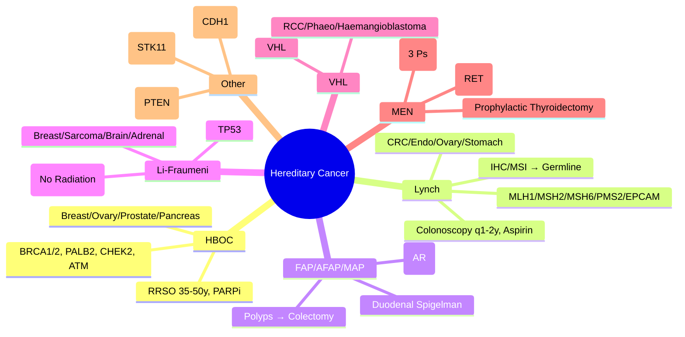

# 6.1 Hereditary Cancer Syndromes


---

## 🎯 Learning Objectives
- [ ] Recognise **clinical criteria** for major hereditary cancer syndromes (HBOC, Lynch, FAP, LFS, VHL, MEN)
- [ ] Apply **genetic testing criteria** (NICE, NCCN, UK NHS GMS) for hereditary cancer
- [ ] Understand **surveillance protocols** and **risk-reducing surgery** indications
- [ ] Calculate **genetic risk** and apply **cascade testing** principles
- [ ] Interpret **tumour testing** (IHC, MSI, Germline vs Somatic)
- [ ] Apply **pharmacogenomic implications** (PARPi for BRCA, Immunotherapy for MSI-H)
- [ ] Answer viva: "HBOC vs Lynch surveillance" and "BRCA testing criteria"

---

## 🧠 Core Concept: Hereditary Cancer Genetics

```mermaid
flowchart TD
    A[Hereditary Cancer Syndromes] --> B[Breast/Ovarian<br/>HBOC (BRCA1/2, PALB2, etc.)]
    A --> C[Colorectal/Endometrial<br/>Lynch (MMR genes), FAP/MAP]
    A --> D[Multi-organ<br/>Li-Fraumeni (TP53), VHL, MEN]
    A --> E[Other<br/>Cowden (PTEN), Peutz-Jeghers (STK11), FAP variants]
    
    B & C & D & E --> F[Genetic Testing Criteria<br/>NICE / NCCN / NHS GMS]
    F --> G[Germline Confirmation]
    G --> H[Surveillance Protocols]
    G --> I[Risk-Reducing Surgery]
    G --> J[Cascade Testing]
    H & I & J --> K[Pharmacogenomic Implications<br/>PARPi, Immunotherapy]
```

---

## 1️⃣ Hereditary Breast & Ovarian Cancer (HBOC)

### Genes & Cancer Risks
| Gene | Breast (F) | Ovarian | Prostate | Pancreatic | Other |
|------|------------|---------|----------|------------|-------|
| **BRCA1** | 60-70% by 80y | 40-50% | 10-20% | 2-5% | TNBC, Medullary |
| **BRCA2** | 50-70% | 10-20% | 20-30% | 5-10% | Male Breast, Pancreatic |
| **PALB2** | 40-60% | 5% | 2-5% | 2-3% | — |
| **CHEK2** | 25-30% | Low | 5-10% | — | — |
| **ATM** | 20-30% | Low | 5-10% | — | — |
| **TP53** (LFS) | ~85% | — | — | — | Sarcoma, Brain, Adrenal |
| **PTEN** (Cowden) | 25-50% | Low | — | — | Thyroid, Endometrial |

### Testing Criteria (NICE NG164 / NHS GMS)
| Category | Criteria |
|----------|----------|
| **Affected Individual** | Breast <40y; Triple-negative <60y; Bilateral; Male breast; Ovarian (any age); Pancreatic; Prostate (metastatic/Gleason ≥7); Multiple primaries |
| **Family History** | 1st-degree relative with breast <40y / ovarian / male breast / pancreatic / prostate (metastatic); 2+ relatives same side with breast/ovarian/prostate/pancreatic; Jewish ancestry + breast/ovarian/pancreatic |
| **Ancestry** | Ashkenazi Jewish (Founder mutations 185delAG, 5382insC BRCA1; 6174delT BRCA2) — Test if any breast/ovarian/pancreatic/prostate |

### Surveillance (NICE / NCCN / UK)
| Gene | Breast Surveillance | Ovarian Surveillance | Risk-Reducing Surgery |
|------|---------------------|----------------------|----------------------|
| **BRCA1** | Annual MRI 30-50y (+ Mammogram 40-50y); >50y Mammogram | **No effective screening**; Consider **RRSO 35-45y** (post-childbearing) | **BRRM** (Bilateral Risk-Reducing Mastectomy) option; **RRSO 35-45y** |
| **BRCA2** | Annual MRI 30-50y (+ Mammogram 40-50y); >50y Mammogram | **RRSO 45-50y** | **BRRM** option; **RRSO 45-50y** |
| **PALB2** | Annual MRI 30-50y | Consider RRSO 45-50y (discuss) | Discuss individually |
| **CHEK2/ATM** | Annual Mammogram 40-50y (MRI if dense) | Not routine | Not routine |

### Risk-Reducing Surgery (RRSO/BRRM)
| Surgery | Timing | Risk Reduction | Considerations |
|---------|--------|----------------|----------------|
| **RRSO** (Bilateral Salpingo-Oophorectomy) | BRCA1: 35-45y; BRCA2: 45-50y (post-childbearing) | **Ovarian Ca >90%**, Breast Ca ~50% (if premenopausal) | Surgical menopause → HRT until 50y; Bone/Heart health |
| **BRRM** (Bilateral Risk-Reducing Mastectomy) | Any age (often 30-50y) | **Breast Ca >90-95%** | Reconstruction options; Psychosocial support |

> **Key:** **RRSO is only proven mortality-reducing surgery** for BRCA carriers.

### PARP Inhibitors (PARPi) — BRCA-Mutated Cancers
| Drug | Indication | Setting |
|------|------------|---------|
| **Olaparib** | Ovarian (BRCA), Breast (BRCA, HER2-), Prostate (BRCA, mCRPC), Pancreatic (BRCA) | Maintenance / Treatment |
| **Talazoparib** | Breast (BRCA, HER2-) | 1st-line metastatic |
| **Niraparib** | Ovarian (BRCA/HRD) | Maintenance post-chemo |
| **Rucaparib** | Ovarian (BRCA/HRD) | Treatment |

> **Synthetic Lethality:** BRCA loss → HR deficiency → PARP inhibition → Unrepaired DNA damage → Cell death.

---

## 2️⃣ Lynch Syndrome (Hereditary Non-Polyposis Colorectal Cancer — HNPCC)

### Genes & Cancer Risks
| Gene | Protein | Colorectal | Endometrial | Ovarian | Gastric | Other |
|------|---------|------------|-------------|---------|---------|-------|
| **MLH1** | Mismatch Repair | 40-50% | 30-40% | 10% | 5-10% | Small bowel, Urinary tract, Hepatobiliary, Brain |
| **MSH2** | Mismatch Repair | 40-50% | 30-40% | 10% | 5-10% | Similar + Sebaceous tumours |
| **MSH6** | Mismatch Repair | 10-20% | 20-30% | 5% | Low | — |
| **PMS2** | Mismatch Repair | 10-20% | 15-20% | Low | Low | — |
| **EPCAM** (3' deletions) | Epigenetic MSH2 silencing | 20-30% | 10-20% | Low | Low | — |

### Testing Criteria (NICE NG151 / Amsterdam II / Revised Bethesda)
| Criterion | Threshold |
|-----------|-----------|
| **Amsterdam II** | 3+ relatives with Lynch cancers (CRC, Endometrial, Small bowel, Ureter, Renal pelvis); 1 <50y; 2 successive generations; FAP excluded |
| **Revised Bethesda** | CRC <50y; Synchronous/metachronous CRC/Lynch cancers; MSI-H histology <60y; CRC + 1st-degree relative Lynch cancer <50y; CRC + 2+ relatives Lynch cancers |
| **NICE** | CRC/Endometrial <50y; MSI-H / MMR deficient tumour; Multiple Lynch cancers; Family history meeting Amsterdam II |

### Tumour Testing → Germline Confirmation
| Step | Test | Result Interpretation |
|------|------|----------------------|
| **1. Tumour Screening** | **IHC (MLH1, MSH2, MSH6, PMS2)** or **MSI-PCR** | **Loss of protein / MSI-H** → Proceed to germline |
| **2. MLH1 Loss** | **BRAF V600E** or **MLH1 Promoter Methylation** | BRAF mut / Meth+ = Sporadic; Neither = Lynch likely |
| **3. Germline Testing** | NGS Panel (MLH1, MSH2, MSH6, PMS2, EPCAM) | Pathogenic variant = Lynch confirmed |

### Surveillance (NICE / NCCN / EU)
| Organ | Protocol |
|-------|----------|
| **Colorectal** | **Colonoscopy q1-2y** from age 25 (MLH1/MSH2) or 35 (MSH6/PMS2); **Chromoendoscopy** preferred |
| **Endometrial** | **Annual TVUS + Endometrial biopsy** from age 35-40 (or 5y pre-earliest diagnosis) |
| **Ovarian** | Annual TVUS + CA125 from 35-40 (Limited evidence) |
| **Gastric** | Gastroscopy q2-3y from 30-40 (if family hx / Asian ancestry) |
| **Small Bowel** | Capsule endoscopy / MR enterography q2-3y from 30-40 |
| **Urinary Tract** | Annual Urinalysis + US from 30-40 |
| **CNS** | Consider MRI brain if family hx (Turcot) |

> **Aspirin 100mg daily** recommended for Lynch (CAPP2 trial: ↓ CRC risk ~50%).

### Risk-Reducing Surgery
| Surgery | Indication | Timing |
|---------|------------|--------|
| **Prophylactic Hysterectomy + BSO** | Endometrial/Ovarian risk (MLH1/MSH2/MSH6) | Post-childbearing, ~40-45y |
| **Prophylactic Colectomy** | CRC diagnosis / Multiple adenomas / Non-compliance | Individualised |

---

## 3️⃣ Familial Adenomatous Polyposis (FAP) & Variants

| Syndrome | Gene | Polyps | Key Features | Management |
|----------|------|--------|--------------|------------|
| **Classic FAP** | **APC** (5q22) | 100-1000s | **CHRPE** (Congenital Hypertrophy of RPE), Desmoids, Osteomas, Duodenal adenomas, Thyroid cancer | **Prophylactic colectomy** (IRA vs IPAA) late teens/20s; Duodenal surveillance (Spigelman) |
| **AFAP** | **APC** (5' or 3' end) | <100 (Oligopolypoid) | Milder, Later onset | Delayed colectomy, Endoscopic surveillance |
| **MUTYH-Associated Polyposis (MAP)** | **MUTYH** (AR) | 10-100 | Autosomal Recessive; Duodenal polyps, Gastric polyps | Colectomy if >20 polyps; Duodenal surveillance |
| **Polymerase Proofreading** | **POLE/POLD1** | 10-100 | AD; Endometrial, Brain, Breast | Surveillance similar |

### Surveillance (Classic FAP)
| Organ | Protocol |
|-------|----------|
| **Colorectal** | Annual flexible sigmoidoscopy from 12-15y → Colectomy when >20 polyps / Advanced histology |
| **Duodenal** | **Side-viewing endoscopy q1-3y** (Spigelman stage); Ampullary surveillance |
| **Thyroid** | Annual US from 25-30y (Papillary thyroid Ca risk) |
| **Desmoids** | MRI if abdominal pain/mass (Post-surgical risk) |

---

## 4️⃣ Li-Fraumeni Syndrome (LFS)

| Feature | Detail |
|---------|--------|
| **Gene** | **TP53** (17p13.1) — Tumour suppressor (Guardian of Genome) |
| **Inheritance** | **AD** (De novo ~7-20%) |
| **Core Cancers** | **Breast** (<40y), **Sarcoma** (Bone, Soft tissue), **Brain** (Astrocytoma, Medulloblastoma), **Adrenocortical Carcinoma** (Childhood), **Leukaemia** |
| **Diagnostic Criteria** | **Chompret Criteria**: Proband with LFS cancer <46y + 1st/2nd deg relative with LFS cancer <56y; Or multiple primaries; Or Adrenocortical/CNS tumour |
| **Surveillance (Toronto Protocol)** | **Whole-body MRI annually** (No radiation); **Brain MRI annually**; **Rapid MRI** (DWI); **Breast MRI annually** (F, 20-50y); **Blood CBC, Chemistry q3-4m**; **Avoid radiation** (X-ray, CT, PET — Use MRI/US) |
| **Genetic Testing** | TP53 sequencing + CNV; **Cascade testing** critical (High penetrance) |
| **Radiation Avoidance** | **Absolute** — No diagnostic CT/PET/X-ray unless life-threatening; **MRI/US preferred** |

---

## 4️⃣ Von Hippel-Lindau (VHL) Disease

See [[4.1 Autosomal Dominant Disorders]] for detailed table.

### Key Surveillance (Annual)
- **Abdominal MRI** (Renal cysts/RCC, Pancreatic cysts/NETs, Phaeochromocytoma)
- **Plasma Metanephrines** (Phaeochromocytoma)
- **Ophthalmology** (Retinal haemangioblastomas)
- **Audiology** (Endolymphatic sac tumours)

---

## 5️⃣ Multiple Endocrine Neoplasia (MEN)

| Syndrome | Gene | Tumours | Key Surveillance |
|----------|------|---------|------------------|
| **MEN1** | **MEN1** (11q13) — Menin | **3 Ps**: Parathyroid (>90%), **Pancreatic NET** (>50%), **Pituitary** (~30%) | Annual: Ca/PTH, Fasting Gut Hormones, MRI Pituitary, CT Pancreas |
| **MEN2A** | **RET** (Cys634) | MTC (100%), Phaeo (50%), Hyperparathyroidism (20-30%) | Annual: Calcitonin, Metanephrines, Ca/PTH; **Prophylactic Thyroidectomy by 5y** |
| **MEN2B** | **RET** (M918T) | MTC (100%), Phaeo (50%), Marfanoid, Mucosal neuromas | **Prophylactic thyroidectomy <1y** |
| **FMTC** | RET | MTC only (≥4 families) | Prophylactic thyroidectomy by 5-10y |

---

## 6️⃣ Other High-Yield Syndromes

| Syndrome | Gene | Key Features |
|----------|------|--------------|
| **Cowden Syndrome** | **PTEN** (10q23) | Breast, Thyroid, Endometrial, Macrocephaly, Trichilemmomas, Hamartomas |
| **Peutz-Jeghers** | **STK11** | Hamartomatous polyps (GI), Mucocutaneous pigmentation (lips/buccal), Breast, Ovarian, Pancreatic, Testicular (Sertoli) |
| **Hereditary Diffuse Gastric Cancer** | **CDH1** (E-cadherin) | **Signet-ring gastric Ca** (Early, Linitis plastica), Lobular Breast Ca |
| **Familial Melanoma** | **CDKN2A** (p16INK4a), **CDK4** | Multiple Melanomas, Pancreatic Ca risk |
| **Renal Cancer Syndromes** | VHL, FH (HLRCC), FLCN (BHD), TSC, MET | RCC subtypes (Clear cell, Papillary, Chromophobe) |

---

## 🔟 Genetic Testing & Cascade Testing

### Testing Pathway
1. **Proband meets criteria** → Germline NGS Panel (HBOC/Lynch/FAP/MEN/LFS/VHL panels)
2. **Pathogenic variant identified** → **Cascade testing** of relatives
3. **Cascade Testing** → 1st-degree (50%) → 2nd-degree (25%) → 3rd-degree (12.5%)
4. **Family letters** → Standardised, Includes: Diagnosis, Gene, Variant, Risk, Testing options, Contact details

### Testing Strategy by Syndrome
| Syndrome | First-Line Test |
|----------|-----------------|
| **HBOC** | BRCA1/2 + PALB2/CHEK2/ATM panel (NGS) |
| **Lynch** | Tumour IHC/MSI → Germline MMR panel (MLH1, MSH2, MSH6, PMS2, EPCAM) |
| **FAP/AFAP** | APC sequencing + MLPA (CNV) |
| **MAP** | MUTYH sequencing (biallelic) |
| **LFS** | TP53 sequencing + CNV |
| **VHL** | VHL sequencing + MLPA |
| **MEN1** | MEN1 sequencing + MLPA |
| **MEN2A/2B** | RET sequencing (Hotspot exons 10, 11, 13-16) |

---

## ⚡ FCPS/MRCP High-Yield Summary

| Syndrome | Gene | Key Cancer Risks | Surveillance | Risk-Reducing Surgery |
|----------|------|------------------|--------------|----------------------|
| **HBOC (BRCA1/2)** | BRCA1/2, PALB2 | Breast 60-70%, Ovarian 10-50%, Prostate, Pancreatic | MRI 30-50y, RRSO 35-45y (BRCA1), 45-50y (BRCA2) | **RRSO** (Mortality benefit), BRRM option |
| **Lynch** | MLH1/MSH2/MSH6/PMS2/EPCAM | CRC 40-50%, Endometrial 30-40% | Colonoscopy q1-2y (25y), Endometrial US/Pipelle, Aspirin 100mg | Hysterectomy+BSO (post-childbearing), Colectomy if CRC |
| **FAP/AFAP** | APC | 100-1000s polyps, Duodenal, Desmoids, Thyroid | Sigmoidoscopy 12-15y, Duodenal q1-3y (Spigelman), Thyroid US | Colectomy (IRA/IPAA) late teens |
| **Li-Fraumeni** | TP53 | Breast, Sarcoma, Brain, Adrenocortical, Leukaemia | **Toronto Protocol**: WB MRI annual, Brain MRI, Breast MRI, CBC q3m | Avoid radiation! |
| **VHL** | VHL | RCC, Phaeo, Haemangioblastoma, Pancreatic NET | Annual MRI abdomen, Metanephrines, Ophthalmology, Audiology | Nephron-sparing surgery |
| **MEN1** | MEN1 | Parathyroid, Pancreas NET, Pituitary | Annual Ca/PTH, Gut hormones, MRI Pituitary, CT Pancreas | Parathyroidectomy, Pancreas surgery |
| **MEN2A/2B** | RET | MTC 100%, Phaeo 50%, HPT (2A) | Calcitonin, Metanephrines, Ca | **Prophylactic Thyroidectomy** (2B <1y, 2A by 5y) |

---

## 🎤 Viva Questions (Expected Answers)

| # | Question | Expected Answer |
|---|----------|-----------------|
| 1 | HBOC — BRCA1 vs BRCA2 ovarian cancer risk? | **BRCA1: 40-50%**; **BRCA2: 10-20%** by age 80. |
| 2 | Lynch syndrome — which gene most commonly mutated? | **MLH1** (~40%) and **MSH2** (~40%) together ~80%; MSH6/PMS2 ~10% each. |
| 3 | Lynch syndrome — tumour testing pathway? | **IHC for MMR proteins** → If loss: **MLH1 loss → check BRAF V600E / MLH1 promoter methylation** → If negative → Germline MMR panel. |
| 4 | Li-Fraumeni surveillance — key modality? | **Whole-body MRI annually** (No radiation — Avoid CT/PET/X-ray). |
| 5 | BRCA1 vs BRCA2 — RRSO timing? | **BRCA1: 35-45y**; **BRCA2: 45-50y** (post-childbearing). |
| 6 | FAP — when to do colectomy? | Late teens/20s, when >20 polyps or advanced histology; IRA vs IPAA. |
| 7 | Li-Fraumeni — radiation avoidance? | **Absolute** — No CT/PET/X-ray unless life-threatening; Use MRI/US. |
| 8 | Lynch — aspirin benefit? | **Aspirin 100mg daily** reduces CRC risk ~50% (CAPP2 trial). |
| 8 | HBOC — PARP inhibitors indication? | BRCA-mutated: Ovarian (maintenance), Breast (HER2-), Prostate (mCRPC), Pancreatic. |
| 10 | FAP vs AFAP — difference? | **FAP**: 100-1000s polyps, early onset; **AFAP**: <100 polyps, milder, later onset (APC 5'/3' mutations). |
| 10 | MEN2B — thyroidectomy timing? | **<1 year** (Prophylactic, MTC 100% penetrant). |

---

## 🧩 Confusions & Mnemonics

| Confusion | Clarification |
|-----------|---------------|
| **"All breast cancer = BRCA"** | **NO.** Only 5-10% breast cancer is hereditary; BRCA1/2 = ~25% of hereditary. |
| **"Lynch = Only CRC"** | **NO.** Endometrial (30-40%), Ovarian, Gastric, Small bowel, Urinary tract, Sebaceous. |
| **"All Lynch = Microsatellite Instability"** | **Most**, but **PMS2** can have lower MSI; **IHC is screening**. |
| **"All FAP = 1000s polyps"** | **AFAP** = <100 polyps, Milder; **MAP** = AR (MUTYH). |
| **"LFS = Only breast cancer"** | **NO.** Sarcoma, Brain, Adrenocortical, Leukaemia — **Core cancers**. |
| **"All VHL = RCC"** | **NO.** Phaeochromocytoma, Haemangioblastoma (CNS/Retina), Pancreatic NETs. |
| **"MEN2A = MEN2B"** | **NO.** Different RET mutations (Cys634 vs M918T), Different phenotypes (M2B: Marfanoid, Mucosal neuromas). |
| **"All HBOC = BRCA1/2"** | **NO.** **PALB2, CHEK2, ATM** also significant; TP53 (LFS), PTEN (Cowden). |
| **"Lynch = Only CRC screening"** | **NO.** Endometrial, Ovarian, Gastric, Small bowel, Urinary — **Multiorgan surveillance**. |
| **"All cancer genetics = Germline"** | **NO.** Tumour testing (IHC/MSI) first for Lynch; Somatic vs Germline distinction critical. |

> **Mnemonic: HEREDITARY CANCER SYNDROMES**  
> **H**BOC: **BRCA1/2, PALB2** — Breast/Ovary/Prostate/Pancreas → **RRSO 35-45y (B1), 45-50y (B2)**  
> **E**ndometrial/Colorectal: **Lynch (MLH1/MSH2/MSH6/PMS2/EPCAM)** — **Colonoscopy q1-2y, Aspirin 100mg**  
> **R**ectal/Polyposis: **FAP (APC) / AFAP / MAP (MUTYH AR)** → Colectomy / Duodenal Spigelman  
> **E**ndocrine: **MEN1 (3 Ps), MEN2A/2B (RET)** — Prophylactic Thyroidectomy (2B <1y, 2A 5y)  
> **D**ifficult: **Li-Fraumeni (TP53)** — **Toronto Protocol (WB MRI, No Radiation!)**  
> **I**mmunotherapy: **MSI-H / dMMR → Pembrolizumab** (Lynch tumours)  
> **T**umour Testing: **Lynch: IHC/MSI → BRAF/Meth → Germline**  
> **A**spirin: **Lynch 100mg daily → CRC risk ↓50% (CAPP2)**  
> **R**educing Surgery: **BRCA RRSO 35-50y; Lynch Hyst+BSO; FAP Colectomy**  
> **Y** (PARPi): **BRCA → PARPi (Olaparib, Talazoparib) — Synthetic Lethality**  
> **C**ascade: **Proband → 1st/2nd/3rd degree → Family Letters**  
> **A**drenocortical: **LFS (TP53), VHL (Phaeo), MEN2 (Phaeo)**  
> **N**eoplasia Types: **HBOC (Breast/Ovary), Lynch (CRC/Endo), FAP (Polyps), LFS (Multi), VHL (RCC/Phaeo)**  
> **E**MIS: **MEN1 (3 Ps), MEN2A/2B (RET), FMTC**  
> **R**isk Reduction: **BRCA RRSO 35-50y; Lynch Hyst+BSO; FAP Colectomy; MEN2B Thyroid <1y**  

---

## 🗺️ Mind Map



---

## 📅 Spaced Repetition Tracker

| Review | Date | Score (0–5) | Notes |
|--------|------|-------------|-------|
| Day 1 | | | |
| Day 3 | | | |
| Day 7 | | | |
| Day 14 | | | |
| Day 30 | | | |
| Day 90 | | | |

---

## 📝 Self-Test Scorecard

| Section | Max | Score | % |
|---------|-----|-------|---|
| HBOC (BRCA1/2, PALB2) | 3 | | |
| Lynch (MMR genes, Surveillance) | 3 | | |
| FAP/AFAP/MAP | 2 | | |
| Li-Fraumeni / VHL / MEN | 4 | | |
| Surveillance & Risk-Reducing Surgery | 3 | | |
| PARPi / Immunotherapy | 2 | | |
| Genetic Testing & Cascade | 2 | | |
| **Total** | **20** | | |

---

## 💬 Exam Answer Modes

| Format | Prompt | Key Points |
|--------|--------|------------|
| **Long Essay** | "Describe the genetics, surveillance, and management of Lynch syndrome." | MMR genes, IHC/MSI pathway, Amsterdam/Bethesda criteria, Colonoscopy q1-2y, Endometrial surveillance, Aspirin 100mg, Hysterectomy+BSO, Cascade testing. |
| **Short Note** | "BRCA1 vs BRCA2 — cancer risks and management." | BRCA1: Breast 60-70%, Ovarian 40-50%; BRCA2: Breast 50-70%, Ovarian 10-20%; RRSO timing; PARPi indication. |
| **Viva** | "Patient with CRC at 42, MSI-H, MLH1/PMS2 loss. Next step?" | **Check BRAF V600E / MLH1 promoter methylation** → If negative → Germline MMR panel (Lynch). |
| **Ward Round** | "BRCA1 mutation carrier, 40F, post-RRSO. Breast surveillance?" | **Annual MRI 30-50y + Mammogram 40-50y**. Discuss BRRM option. |
| **Last-Night** | "HBOC: BRCA1/2 PALB2. BRCA1 Ov 40-50%, B2 Ov 10-20%. RRSO B1 35-45, B2 45-50. Lynch: MLH1/MSH2/MSH6/PMS2. IHC/MSI. BRAF/Meth if MLH1 loss. Colonoscopy q1-2y. Aspirin 100mg. FAP: APC, Colectomy. MAP: MUTYH AR. LFS: TP53, WB MRI no rad. VHL: RCC/Phaeo. MEN: 3Ps/RET. PARPi BRCA. Cascade." | Compressed. |

---

## 📌 Summary
- **HBOC**: BRCA1/2 (PALB2, CHEK2, ATM); Breast 60-70%, Ovarian 10-50%; **RRSO 35-50y**; **PARPi** for BRCA-mutated cancers.
- **Lynch**: MLH1/MSH2/MSH6/PMS2/EPCAM; CRC 40-50%, Endometrial 30-40%; **IHC/MSI → BRAF/Meth → Germline**; Colonoscopy q1-2y; **Aspirin 100mg**; Hysterectomy+BSO.
- **FAP/AFAP**: APC; 100s-1000s polyps → Colectomy; Duodenal Spigelman surveillance.
- **MAP**: MUTYH (AR); 10-100 polyps.
- **Li-Fraumeni**: TP53; Core cancers (Breast, Sarcoma, Brain, Adrenal, Leukaemia); **Toronto Protocol (WB MRI, No radiation)**.
- **VHL**: RCC, Phaeo, Haemangioblastoma, Pancreatic NETs; Annual MRI/Meta/Ophtho/Audio.
- **MEN**: MEN1 (3 Ps), MEN2A/2B (RET); **Prophylactic thyroidectomy** (2B <1y, 2A by 5y).
- **PARPi**: BRCA-mutated — Ovarian, Breast, Prostate, Pancreatic (Synthetic lethality).
- **Immunotherapy**: MSI-H/dMMR (Lynch tumours) → Pembrolizumab.
- **Cascade Testing**: Proband → 1st/2nd-degree → Family letters; Genetic counselling each.
- **Surveillance Integration**: NICE/NHS GMS/NCCN guidelines; Aspirin for Lynch; PARPi for BRCA.

---

## ❓ MCQs (10)

1. **BRCA1 vs BRCA2 — ovarian cancer risk by age 80?**  
   A. BRCA1 10%, BRCA2 40%  B. **BRCA1 40-50%, BRCA2 10-20%**  C. Both 30%  D. BRCA1 20%, BRCA2 40%  
   *Answer: B. BRCA1 ~40-50%, BRCA2 ~10-20% by age 80.*

2. **Lynch syndrome — most common gene mutated?**  
   A. MSH6  B. PMS2  C. **MLH1/MSH2 (together ~80%)**  D. EPCAM  
   *Answer: C. MLH1 + MSH2 account for ~80% of Lynch cases.*

3. **Lynch syndrome tumour testing pathway for MLH1 loss?**  
   A. Direct germline testing  B. **BRAF V600E / MLH1 promoter methylation**  C. MSI only  D. IHC only  
   *Answer: B. MLH1 loss → Check BRAF V600E / MLH1 promoter methylation; If negative → Germline Lynch.*

4. **Li-Fraumeni syndrome — surveillance cornerstone?**  
   A. Annual CT  B. **Whole-body MRI annually (No radiation)**  C. Annual PET-CT  D. Annual US  
   *Answer: B. Toronto Protocol: Whole-body MRI annually (Avoid radiation — CT/PET/X-ray).* 

5. **Li-Fraumeni — TP53 mutation penetrance?**  
   A. 50% by 50y  B. **~90% by 60y (Near complete)**  C. 25%  D. 100% by 30y  
   *Answer: B. ~90% lifetime penetrance; Core cancers by 45y.*

6. **FAP vs AFAP — key difference?**  
   A. Different genes  B. **FAP 100-1000s polyps; AFAP <100 polyps**  C. Different inheritance  D. Same severity  
   *Answer: B. FAP = 100-1000s polyps; AFAP = <100 polyps (Attenuated), later onset.*

7. **Li-Fraumeni — radiation avoidance?**  
   A. Avoid CT only  B. **Avoid all ionising radiation (CT, PET, X-ray) — Use MRI/US**  C. CT OK if needed  D. Only avoid PET  
   *Answer: B. Absolute radiation avoidance — Use MRI/US instead.* 

8. **Lynch syndrome — aspirin for prevention?**  
   A. No evidence  B. **Aspirin 100mg daily reduces CRC risk ~50% (CAPP2)**  C. 300mg needed  D. Only for FAP  
   *Answer: B. Aspirin 100mg daily reduces CRC risk by ~50% (CAPP2 trial).*

9. **FAP — colectomy timing?**  
   A. At diagnosis  B. **Late teens/20s (>20 polyps or advanced histology)**  C. Age 40  D. Never (surveillance only)  
   *Answer: B. Late teens/20s when >20 polyps or advanced histology; IRA vs IPAA.*

10. **PARP inhibitor — mechanism?**  
    A. Inhibit DNA repair in all cells  B. **Synthetic lethality in HR-deficient cells (BRCA)**  C. Enhance chemotherapy  D. Immune checkpoint inhibitor  
    *Answer: B. PARP inhibition + HR deficiency (BRCA) → Unrepaired DNA damage → Synthetic lethality.*

---

## 📋 SBAs (10)

1. **45F with CRC, MSI-H, MLH1/PMS2 loss on IHC. BRAF WT, MLH1 promoter unmethylated. Next step?**  
   A. Lynch confirmed  B. Sporadic  C. **Germline MLH1/PMS2 testing**  D. No further testing  
   *Answer: C. MLH1 loss + BRAF WT + No methylation → Lynch likely → Germline testing.*

2. **35F BRCA1 mutation carrier. Completed childbearing. RRSO recommendation?**  
   A. Delay until 50  B. **RRSO now (35-45y per guidelines)**  C. Only if ovarian cyst  D. Not needed  
   *Answer: B. BRCA1 RRSO recommended 35-45y post-childbearing.*

3. **30M with Li-Fraumeni (TP53 mutation). Needs abdominal imaging. Modality?**  
   A. CT abdomen  B. **MRI abdomen**  C. PET-CT  D. Ultrasound only  
   *Answer: B. Absolute radiation avoidance in LFS — MRI preferred.*

4. **Woman with endometrial cancer at 38, MSI-H, MSH2 loss. Brother with CRC at 40. Genetic testing?**  
   A. BRCA1/2  B. **Germline MSH2/MLH1/MSH6/PMS2/EPCAM panel (Lynch)**  C. TP53  D. APC  
   *Answer: B. MSH2 loss + family history → Lynch syndrome likely → Germline MMR panel.*

5. **Couple with FAP child (APC mutation). Mother pregnant at 12 weeks. Prenatal testing?**  
   A. NIPT  B. **CVS (qf-PCR + APC sequencing) at 11-14 weeks**  C. Amnio at 16w  D. No testing  
   *Answer: B. CVS at 11-14w with qf-PCR + APC sequencing for known familial variant.*

---

## 🔑 Answer Keys
| MCQs | SBAs |
|------|------|
| 1-B, 2-C, 3-B, 4-B, 5-B, 6-B, 7-B, 8-B, 9-B, 10-B | 1-C, 2-B, 3-B, 4-B, 5-B |

---

## 🔗 Cross-Links
- [[2.1 Mendelian Inheritance]] — AD/AR/XL inheritance risks in cancer syndromes
- [[4.1 Autosomal Dominant Disorders]] — VHL, MEN, ADPKD, NF1 overlap
- [[4.4 Mitochondrial Disorders]] — TP53 mitochondrial functions
- [[5.1-5.4 Genetic Testing Technologies]] — NGS panels, IHC/MSI tumour testing
- [[5.4 Prenatal & Preimplantation Testing]] — PND for cancer syndromes, PGT-M
- [[5.5 Genetic Counselling]] — Predictive testing, Cascade testing, Reproductive options
- [[5.1-5.4 Genetic Testing Technologies]] — IHC/MSI tumour testing, NGS panels
- [[7. Pharmacogenetics]] — PARPi for BRCA, Immunotherapy for MSI-H
- [[9. ELSI]] — Predictive testing ethics, Insurance discrimination, Paediatric testing
- [[10. System-Based Clinical Genetics]] — Cancer genetics by system (Breast, Colorectal, Endocrine, Renal, CNS)

---

**Last Updated:** 2026-06-14  
**Next:** Build `6.2-6.3 Tumour Genetics & Testing.md`, `7. Pharmacogenetics.md`