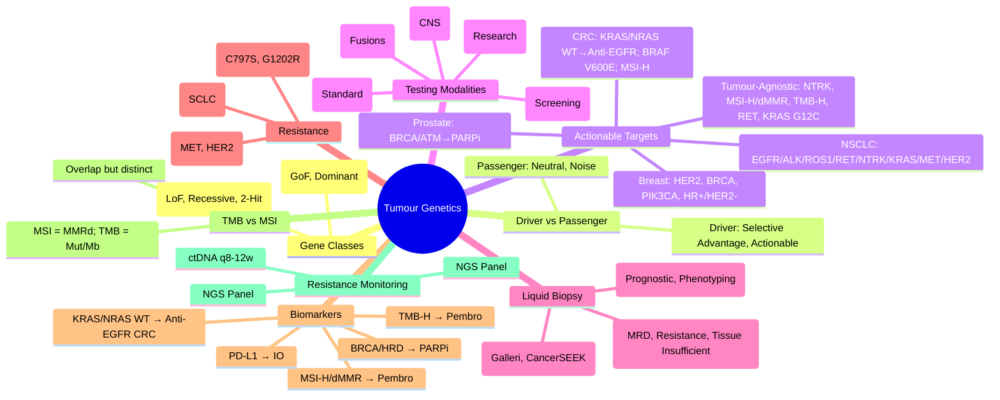

# 6.2-6.3 Tumour Genetics & Testing


---

## 🎯 Learning Objectives
- [ ] Distinguish **oncogenes** vs **tumour suppressor genes** (Two-hit hypothesis)
- [ ] Identify **driver** vs **passenger** mutations
- [ ] Apply **tumour testing** strategies: IHC, FISH, NGS panels, WES/WGS, MSI, TMB
- [ ] Interpret **actionable biomarkers** for targeted therapy (EGFR, ALK, ROS1, BRAF, HER2, KRAS, NTRK, RET, MET)
- [ ] Understand **liquid biopsy** (ctDNA) applications: MRD, Resistance monitoring, Early detection
- [ ] Apply **biomarker-guided therapy** guidelines (NCCN, ESMO, ASCO/CAP)
- [ ] Answer viva: "Oncogene vs TSG" and "Liquid biopsy clinical utility"

---

## 🧠 Core Concept: Cancer Genomics

```mermaid
flowchart TD
    A[Cancer Genomics] --> B[Driver Mutations<br/>Oncogenes / Tumour Suppressors]
    A --> C[Passenger Mutations<br/>Neutral, Hitchhiking]
    B --> D[Oncogenes<br/>Gain of Function<br/>Dominant]
    B --> E[Tumour Suppressors<br/>Loss of Function<br/>Recessive (Two-Hit)]
    C --> F[Genomic Noise<br/>Clonal Evolution]
    D & E --> G[Actionable Targets<br/>Targeted Therapy]
    D & E --> H[Resistance Mechanisms<br/>Secondary Mutations, Bypass]
    D & E --> I[Liquid Biopsy<br/>ctDNA, CTCs]
    G & H & I --> J[Precision Oncology<br/>Biomarker-Guided Therapy]
```

---

## 1️⃣ Oncogenes vs Tumour Suppressor Genes

### Oncogenes (Dominant, Gain-of-Function)
| Feature | Detail |
|---------|--------|
| **Mutation Type** | Activating: Point mutation, Amplification, Translocation → **Constitutive activation** |
| **Inheritance** | **Dominant** (Single allele sufficient) |
| **Two-Hit** | Not required (One hit = Activation) |
| **Examples** | **EGFR** (EGFR mut, Amp), **HER2** (Amplification), **ALK/ROS1/RET/NTRK** (Fusion), **KRAS/NRAS/HRAS** (G12/13 mut), **BRAF** (V600E), **MYC** (Amplification), **BCR::ABL1** (t(9;22)) |
| **Therapeutic Target** | **Inhibitors** (TKIs, mAbs, ADCs) — LoF = Sensitivity |

### Tumour Suppressor Genes (Recessive, Loss-of-Function)
| Feature | Detail |
|---------|--------|
| **Mechanism** | Inactivating: Nonsense, Frameshift, Deletion, Epigenetic silencing → **Loss of function** |
| **Inheritance** | **Recessive** at cellular level (Two-hit hypothesis — Knudson) |
| **Two-Hit** | **First hit** (Germline or Somatic) + **Second hit** (Somatic LOH) → Complete loss |
| **Examples** | **TP53** (Guardian of Genome), **RB1** (Retinoblastoma), **PTEN** (PI3K/AKT), **APC** (Wnt/β-catenin), **VHL** (HIF), **NF1** (RAS GAP), **BRCA1/2** (HR), **CDKN2A** (p16), **SMAD4** (TGF-β) |
| **Therapeutic Target** | **Restoration difficult**; Synthetic lethality (PARPi in BRCA), Reactivation (MDM2 inhibitors for TP53) |

### Knudson's Two-Hit Hypothesis (1971)
| Step | Somatic | Hereditary (Germline 1st hit) |
|------|---------|-------------------------------|
| **1st Hit** | Somatic mutation | **Inherited** germline mutation |
| **2nd Hit** | Second somatic mutation (LOH) | Somatic LOH / Second mutation |
| **Result** | Sporadic cancer | **Earlier onset, Bilateral/Multifocal**, Multifocal |

---

## 2️⃣ Driver vs Passenger Mutations

| Feature | Driver Mutation | Passenger Mutation |
|---------|-----------------|-------------------|
| **Functional Impact** | Confers selective growth advantage | Neutral, no selective advantage |
| **Frequency** | Recurrent in cancer cohorts | Random, low recurrence |
| **Location** | Cancer genes (Oncogenes/TSGs) | Anywhere in genome |
| **Clonality** | Often **Clonal** (Truncal) or Subclonal | Often **Subclonal** (Branch) |
| **Actionability** | **Potential therapeutic target** | Not actionable |
| **Examples** | EGFR mut, KRAS G12C, TP53 loss, BCR::ABL1 | Silent mutations, Non-coding (mostly), Synonymous |

> **Cancer Genome Landscape:** ~200-500 driver mutations per tumour; ~1-10 driver genes per cancer; ~99% of somatic mutations are passengers.

---

## 3️⃣ Actionable Biomarkers — Targeted Therapy

### Solid Tumours — Key Actionable Targets

| Cancer Type | Biomarker | Test | Targeted Therapy | Guideline |
|-------------|-----------|------|------------------|-----------|
| **NSCLC** | **EGFR** (Exon 19 del, L858R) | PCR/NGS | Osimertinib (1st-line), Gefitinib/Erlotinib | NCCN/ESMO |
| | **EGFR Exon 20 ins** | NGS | Amivantamab, Mobocertinib | NCCN |
| | **ALK** rearrangement | FISH/NGS/IHC | Lorlatinib (1st-line), Alectinib, Brigatinib | NCCN/ESMO |
| | **ROS1** rearrangement | FISH/NGS | Entrectinib, Lorlatinib, Repotrectinib | NCCN/ESMO |
| | **RET** rearrangement | NGS/FISH | Selpercatinib, Pralsetinib | NCCN |
| | **NTRK** fusion | NGS/RNA-seq | Larotrectinib, Entrectinib (Tumour-agnostic) | FDA/EMA |
| | **KRAS G12C** | NGS/PCR | Sotorasib, Adagrasib | NCCN |
| | **MET Exon 14 Skip** | NGS/RNA | Capmatinib, Tepotinib | NCCN |
| | **HER2** (Mutation/Amp) | IHC/FISH/NGS | Trastuzumab Deruxtecan, T-DXd | NCCN |
| **Breast** | **HER2** (IHC 3+ / FISH+) | IHC/FISH | Trastuzumab, Pertuzumab, T-DM1, T-DXd | ASCO/CAP |
| | **HR+/HER2-** | Clinical | CDK4/6i (Palbo/Ribo/Abem) + ET | ESMO |
| | **BRCA1/2** | Germline/Somatic | PARPi (Olaparib, Talazoparib) | NCCN |
| | **PIK3CA** | NGS | Alpelisib + Fulvestrant | SOLAR-1 |
| **Colorectal** | **KRAS/NRAS** (Exon 2/3/4) | NGS/PCR | **Anti-EGFR (Cetuximab/Panitumumab) ONLY if WT** | NCCN/ESMO |
| | **BRAF V600E** | NGS/PCR | Encorafenib + Cetuximab | BEACON |
| | **MSI-H / dMMR** | IHC/MSI | **Pembrolizumab** (1st-line MSI-H mCRC) | KEYNOTE-177 |
| | **HER2** Amp | IHC/FISH | Trastuzumab + Chemo | HERACLES |
| **Gastric** | **HER2** (IHC/FISH) | IHC/FISH | Trastuzumab + Chemo (ToGA) | NCCN |
| | **CLDN18.2** | IHC | Zolbetuximab + Chemo | SPOTLIGHT |
| | **FGFR2b** | FISH/NGS | Bemarituzumab + Chemo | FIGHT |
| **Ovarian** | **BRCA1/2** (Germline/Somatic) | NGS | PARPi (Olaparib, Niraparib, Rucaparib) | SOLO-1, PRIMA |
| | **HRD** (GIS/LOH/TAI) | MyChoice/Myriad | PARPi (Niraparib, Rucaparib) | PRIMA, NOVA |
| **Prostate** | **BRCA1/2, ATM, PALB2** | Germline/Somatic | PARPi (Olaparib, Rucaparib, Talazoparib) | PROfound, TRITON2/3 |
| | **MSI-H/dMMR** | IHC/MSI | Pembrolizumab | KEYNOTE |

> **Tumour-Agnostic Approvals:** **NTRK fusions** (Larotrectinib/Entrectinib), **MSI-H/dMMR** (Pembrolizumab), **RET fusions** (Selpercatinib/Pralsetinib), **KRAS G12C** (Sotorasib/Adagrasib — mainly NSCLC, expanding).

---

## 4️⃣ Tumour Testing Strategies

### Tissue-Based Testing Algorithm
```mermaid
flowchart TD
    A[New Cancer Diagnosis] --> B{Histology + Stage}
    B --> C{Early Stage / Curative Intent}
    B --> D{Advanced / Metastatic}
    C --> C1[Standard Pathology<br/>IHC Subtyping]
    C1 --> C2[Hereditary Risk Assessment<br/>Family History, Age]
    D --> D1[Biomarker-Driven Testing]
    D1 --> D2[NGS Panel (Tissue)<br/>Actionable Targets]
    D2 --> D3{Actionable Target?}
    D3 -->|Yes| E[Targeted Therapy]
    D3 -->|No| F[Standard Chemo/Immuno<br/>Clinical Trial]
    D1 --> D4[If MSI-H/dMMR → Pembrolizumab<br/>TMB-H → Consider Immuno]
    D1 --> D5[If NTRK/RET/ROS1/ALK → Targeted]
```

### Testing Modalities Comparison

| Modality | What It Detects | Sample | Turnaround | Clinical Use |
|----------|-----------------|--------|------------|--------------|
| **IHC** | Protein expression (HER2, PD-L1, MMR, ALK, ROS1) | FFPE Tissue | 1-2 days | Screening, Companion Dx |
| **FISH** | Gene amplification (HER2, ALK, ROS1, ALK, MET, FGFR2) | FFPE Tissue | 2-3 days | HER2, ALK, ROS1, MET, FGFR2 |
| **PCR/qPCR** | Hotspot mutations (EGFR, KRAS, BRAF, JAK2, BCR::ABL1) | FFPE/Blood | 1-3 days | Hotspot screening, MRD (BCR::ABL1) |
| **NGS Panel** | 50-500 genes (SNV, Indel, CNV, Fusion, TMB, MSI) | FFPE Tissue | 2-3 weeks | **Standard for advanced cancer** |
| **WES/WGS** | Exome/Genome (SNV, CNV, SV, TMB, MSI, Signatures) | FFPE/Fresh Frozen | 4-8 weeks | Clinical trials, Rare tumours, Research |
| **RNA-seq** | Fusions, Splicing, Expression, Immune repertoire | FFPE/Fresh Frozen | 3-4 weeks | Fusion detection, Immune profiling |
| **Methylation Array** | Methylation class (CNS tumours, Sarcomas) | FFPE/Fresh Frozen | 1-2 weeks | CNS tumour classification (WHO 2021) |

### Tissue Requirements
| Requirement | Standard |
|-------------|----------|
| **Tumour Cellularity** | ≥20% (NGS), ≥10% (PCR/IHC) |
| **Necrosis** | <50% |
| **Fixation** | 10% NBF, 6-72h (Avoid over/under-fixation) |
| **DNA Input** | ≥50 ng (Panels), ≥100 ng (WES), ≥200 ng (WGS) |
| **RNA Input** | ≥50 ng (RNA-seq), RIN >2 |

---

## 5️⃣ Liquid Biopsy (ctDNA / CTCs)

### Circulating Tumour DNA (ctDNA)
| Feature | Detail |
|---------|--------|
| **Source** | Apoptotic/necrotic tumour cells → Fragmented DNA (166 bp) in plasma |
| **Fraction** | **Tumour Fraction (TF)** = ctDNA / Total cfDNA (Range: 0.01% - >50%) |
| **Half-life** | ~15-30 minutes (Rapid clearance) |
| **Advantages** | Non-invasive, Real-time, Heterogeneity capture, Serial monitoring |
| **Limitations** | Low TF in early stage/Tumour burden low; No spatial info; CHIP confounder (CHIP = Clonal Haematopoiesis of Indeterminate Potential) |

### Clinical Applications
| Application | Stage | Evidence |
|--------------|-------|----------|
| **MRD Detection** | Post-surgery (Stage II/III CRC, Breast, NSCLC) | **ctDNA+ → High recurrence risk**; Guides adjuvant chemo (DYNAMIC, GALAXY, CIRCULATE) |
| **Resistance Monitoring** | On targeted therapy (EGFR, ALK, BRAF, KRAS) | Detect **resistance mutations** (EGFR C797S, ALK G1202R, KRAS G12C amplification) before radiographic progression |
| **Treatment Selection** | Advanced (Tissue insufficient) | **Guardant360, FoundationOne Liquid** — FDA-approved for NCCN guideline biomarkers |
| **Early Detection / Screening** | Multi-cancer (MCED) | **Galleri (GRAIL), CancerSEEK** — Not yet standard of care |
| **Pharmacodynamic Monitoring** | On therapy | ctDNA clearance → Response; Rise → Resistance |

### CTCs (Circulating Tumour Cells)
| Feature | Detail |
|---------|--------|
| **Detection** | CellSearch (EpCAM-based) — FDA-approved for Breast, Prostate, Colorectal |
| **Utility** | Prognostic (CTC count), Phenotypic characterisation (HER2, PD-L1, AR-V7) |
| **Limitation** | Rare (1-10/mL), EpCAM-dependent (Misses EMT), Low sensitivity early stage |

---

## 5️⃣ Resistance Mechanisms & Monitoring

### Common Resistance Patterns
| Target | Primary Resistance | Acquired Resistance | Monitoring |
|--------|-------------------|---------------------|------------|
| **EGFR (NSCLC)** | EGFR Exon 20 ins, MET Amp, KRAS mut | **EGFR C797S** (cis/trans), MET Amp, HER2 Amp, Histologic transformation (SCLC) | ctDNA q8-12w |
| **ALK** | ALK mutations (rare) | **ALK G1202R, L1196M, I1171T/N/S**, Bypass (EGFR, KIT, SRC) | ctDNA q8-12w |
| **BRAF V600E** (CRC) | NRAS mut, MEK mut, EGFR upregulation | BRAF splice variants, MEK mut, EGFR amp | ctDNA q8-12w |
| **PARPi (BRCA)** | HR restoration (BRCA reversion), 53BP1 loss, PARP1 loss | **BRCA reversion mutations**, PARP1 loss, P-glycoprotein | ctDNA q8-12w |
| **EGFR TKI (CRC)** | KRAS/NRAS/BRAF mut | EGFR ectodomain mut, KRAS amp, MET amp | ctDNA q8-12w |

---

## 5️⃣ TMB & MSI — Immunotherapy Biomarkers

| Biomarker | Definition | Assay | Clinical Threshold | Indication |
|-----------|------------|-------|-------------------|------------|
| **MSI-H / dMMR** | Deficient MMR → Hypermutation | **IHC (MLH1/MSH2/MSH6/PMS2)** or **MSI-PCR** | **MSI-H / dMMR** = Deficient | **Pembrolizumab** (Tumour-agnostic, 1st-line MSI-H mCRC, any MSI-H solid) |
| **TMB-H** | Non-synonymous mutations / Mb | **NGS Panel (≥1.5 Mb)** or **WES** | **≥10 mut/Mb** (FoundationOne) | **Pembrolizumab** (Tumour-agnostic, ≥10 mut/Mb) |
| **TMB-L / MSS** | Low TMB / Proficient MMR | Same | Low | Low immunotherapy benefit |

> **TMB-H ≠ MSI-H** (Overlap but distinct): MSI-H = MMR deficiency; TMB-H = High mutational load (Can be MSS, e.g., POLE/POLD1 mut, UV-signature melanoma, Smoking-signature lung).

---

## 5️⃣ Multi-Cancer Early Detection (MCED)

| Test | Platform | Target | Status |
|------|----------|--------|--------|
| **Galleri (GRAIL)** | cfDNA Methylation + Fragmentomics | 50+ cancers | NHS-Galleri Trial (NHS England); Not standard of care |
| **CancerSEEK** | Protein + ctDNA mutations | 8 cancers | Research phase |
| **PanSeer** | ctDNA Methylation | 5 cancers | Research |
| **DELFI** | Fragmentomics | Multi-cancer | Research |

> **Not yet standard of care** — Clinical utility trials ongoing (NHS-Galleri, REFLECTION, PATHFINDER).

---

## ⚡ FCPS/MRCP High-Yield Summary

| Concept | Key Points |
|---------|------------|
| **Oncogene** | Gain-of-function, Dominant, Activating mutations/Amplification/Fusion (EGFR, ALK, HER2, KRAS, BRAF, MYC, BCR::ABL1) |
| **Tumour Suppressor** | Loss-of-function, Recessive (Two-hit), Inactivating mutations/Deletion/LOH (TP53, RB1, PTEN, APC, BRCA1/2) |
| **Driver vs Passenger** | Driver = Selective advantage, Recurrent, Actionable; Passenger = Neutral, Random |
| **Actionable Targets** | NSCLC: EGFR, ALK, ROS1, RET, NTRK, KRAS G12C, MET, HER2, KRAS/NRAS (WT for anti-EGFR); CRC: KRAS/NRAS WT → Anti-EGFR; BRAF V600E → Enco+Cetux; MSI-H → Pembro; Breast: HER2, BRCA, PIK3CA, HR+/HER2- → CDK4/6i; Prostate: BRCA/ATM → PARPi; MSI-H/dMMR → Pembro (Tumour-agnostic) |
| **TMB-H** | ≥10 mut/Mb → Pembro (Tumour-agnostic); **MSI-H ≠ TMB-H** (Overlap but distinct) |
| **Liquid Biopsy** | ctDNA: MRD, Resistance monitoring, Treatment selection (if tissue insufficient); CTCs: Prognostic |
| **Resistance Monitoring** | ctDNA q8-12w on targeted therapy (EGFR C797S, ALK G1202R, KRAS amp, BRCA reversion) |
| **MRD** | Post-surgery ctDNA+ → High recurrence risk → Guides adjuvant chemo (CRC, Breast, NSCLC) |
| **Tumour-Agnostic** | NTRK, RET, MSI-H/dMMR, TMB-H, KRAS G12C, RET — Approved irrespective of histology |
| **Tumour Testing** | NGS Panel (Standard advanced); IHC/FISH (Screening/Companion Dx); WES/WGS (Research/Trials) |
| **Biomarker Testing** | NSCLC: EGFR/ALK/ROS1/RET/NTRK/KRAS/MET/HER2; CRC: KRAS/NRAS/BRAF/MSI; Breast: HER2/BRCA/PIK3CA/HR; Prostate: BRCA/ATM → PARPi; MSI-H → Pembro |

---

## 🎤 Viva Questions (Expected Answers)

| # | Question | Expected Answer |
|---|----------|-----------------|
| 1 | Oncogene vs Tumour Suppressor — key difference? | Oncogene = Gain-of-function, Dominant (1 hit); TSG = Loss-of-function, Recessive (Two-hit: Knudson) |
| 2 | Driver vs Passenger mutation? | Driver = Selective advantage, Recurrent, Actionable; Passenger = Neutral, Random, Not actionable |
| 3 | NSCLC actionable targets? | EGFR (Ex19del/L858R, Ex20ins), ALK, ROS1, RET, NTRK, KRAS G12C, MET Ex14 skip, HER2, KRAS/NRAS (WT for anti-EGFR) |
| 4 | CRC anti-EGFR therapy — when indicated? | **KRAS/NRAS WT** (Exons 2/3/4) → Cetuximab/Panitumumab + Chemo; **KRAS/NRAS mut** → No anti-EGFR |
| 5 | MSI-H vs TMB-H — difference? | MSI-H = MMR deficiency (IHC/MSI); TMB-H = High mutational burden (≥10 mut/Mb); Overlap but distinct |
| 6 | Liquid biopsy clinical utility? | MRD detection (post-op), Resistance monitoring (ctDNA q8-12w), Treatment selection (tissue insufficient) |
| 7 | Resistance to EGFR TKI (NSCLC) — common mechanisms? | EGFR C797S (cis/trans), MET amplification, HER2 amp, Histologic transformation (SCLC) |
| 8 | PARPi resistance in BRCA-mutated cancer? | BRCA reversion mutations, PARP1 loss, 53BP1 loss, P-gp upregulation |
| 9 | Tumour-agnostic approvals? | NTRK fusions, MSI-H/dMMR, TMB-H (≥10 mut/Mb), RET fusions, KRAS G12C (mainly NSCLC), NTRK, RET |
| 10 | ctDNA vs CTC — difference? | ctDNA = Fragmented DNA (166 bp), High sensitivity, MRD/Resistance; CTC = Intact cells, Prognostic count, Phenotyping (EpCAM-based) |

---

## 🧩 Confusions & Mnemonics

| Confusion | Clarification |
|-----------|---------------|
| **"Oncogene = TSG"** | **NO.** Oncogene = GOF (Activating), Dominant; TSG = LOF (Inactivating), Recessive (Two-hit) |
| **"All mutations in cancer are drivers"** | **NO.** >99% are passengers; Drivers are rare, recurrent, in cancer genes |
| **"MSI-H = TMB-H"** | **Overlap but distinct.** MSI-H = MMRd; TMB-H = High mutational burden. POLE mut = TMB-H but MSS. |
| **"ctDNA = CTC"** | **NO.** ctDNA = Free DNA fragments (166 bp); CTC = Intact cells (EpCAM). ctDNA = MRD/Resistance; CTC = Prognostic count |
| **"WES = WGS"** | **NO.** WES = Exons only (~1-2% genome); WGS = Whole genome (SNV+CNV+SV+Non-coding) |
| **"NGS detects everything"** | **NO.** NGS misses: Large CNVs (WGS better), Deep intronic, Balanced translocations, Methylation, Repeat expansions (need RP-PCR), Low-level mosaicism |
| **"All KRAS mutations = Same"** | **NO.** G12C = Druggable (Sotorasib/Adagrasib); G12D/G12V = Not yet druggable; KRAS WT needed for anti-EGFR in CRC |
| **"Resistance = Same mechanism"** | **NO.** Multiple parallel resistance pathways (On-target, Bypass, Histologic transformation) |
| **"Liquid biopsy replaces tissue biopsy"** | **NO.** Tissue still needed for: Histology, IHC, FISH, RNA, RNA-seq, Spatial context, Adequate DNA for NGS |
| **"TMB-H = Always immunotherapy benefit"** | **NO.** TMB-H predictive but not perfect; Some TMB-H tumours don't respond; Need PD-L1, TILs, HLA context |

> **Mnemonic: TUMOUR GENETICS TESTING**  
> **T**wo-Hit: **TSG = 2 hits (Knudson)**; **Oncogene = 1 hit (GOF)**  
> **U**niversal Drivers: **EGFR, KRAS, TP53, PIK3CA, MYC, BCR::ABL1**  
> **M**olecular Testing: **IHC/FISH (Screening) → NGS Panel (Actionable) → WES/WGS (Research)**  
> **O**ncogene vs TSG: **GoF (Dom) vs LoF (Rec, 2-hit)**  
> **U**tility of Liquid Biopsy: **MRD (Post-op), Resistance (q8-12w), Tissue Insufficient**  
> **R**esistance: **On-target (C797S), Bypass (MET), Transformation (SCLC)**  
> **G**enomic Landscape: **Drivers (Clonal) vs Passengers (Subclonal)**  
> **E**GFR in NSCLC: **Ex19del/L858R → Osimertinib; Ex20ins → Amivantamab; C797S → Resistance**  
> **N**SCLC Actionable: **EGFR, ALK, ROS1, RET, NTRK, KRAS G12C, MET, HER2, BRAF**  
> **E**GFR in CRC: **KRAS/NRAS WT → Anti-EGFR (Cetu/Pani); Mut → No Anti-EGFR**  
> **T**MB vs MSI: **MSI = MMRd; TMB = Mut/Mb; Both → Pembro (Tumour-agnostic)**  
> **E**liquid Biopsy: **ctDNA (MRD, Resistance) vs CTC (Prognostic, Phenotype)**  
> **S**ynthetic Lethality: **PARPi in BRCA (HRD)** — PARP + HRD = Cell Death  
> **T**umour Testing Pathway: **IHC/FISH → NGS Panel → WES/WGS (If Negative)**  
> **I**mmunotherapy Biomarkers: **MSI-H/dMMR, TMB-H, PD-L1** → Pembro  
> **S**ynthetic Lethality: **PARPi + BRCA (HRD)**  
> **I**nterpretation: **ACMG 5-tier (P/LP/VUS/LB/B)**  
> **N**GS Panel Standard: **50-500 genes, >200x, VAF >5-10%, Tumour % >20%**  
> **G**uidelines: **NCCN, ESMO, ASCO/CAP, AMP/ACMG**  

---

## 🗺️ Mind Map



---

## 📅 Spaced Repetition Tracker

| Review | Date | Score (0–5) | Notes |
|--------|------|-------------|-------|
| Day 1 | | | |
| Day 3 | | | |
| Day 7 | | | |
| Day 14 | | | |
| Day 30 | | | |
| Day 90 | | | |

---

## 📝 Self-Test Scorecard

| Section | Max | Score | % |
|---------|-----|-------|---|
| Oncogene vs TSG | 3 | | |
| Driver vs Passenger | 2 | | |
| Actionable Targets by Cancer | 4 | | |
| Tumour Testing Modalities | 3 | | |
| Liquid Biopsy & ctDNA | 3 | | |
| Resistance Mechanisms | 2 | | |
| TMB vs MSI | 2 | | |
| Biomarker-Guided Therapy | 2 | | |
| **Total** | **20** | | |

---

## 💬 Exam Answer Modes

| Format | Prompt | Key Points |
|--------|--------|------------|
| **Long Essay** | "Describe the molecular basis of targeted therapy in NSCLC and resistance mechanisms." | Oncogenes (EGFR, ALK, ROS1, RET, NTRK, KRAS, MET, HER2), Inhibitors, Resistance (C797S, MET amp, Histologic transformation), Liquid biopsy monitoring. |
| **Short Note** | "Liquid biopsy in oncology — clinical applications." | ctDNA for MRD (post-op), Resistance monitoring (q8-12w), Treatment selection (tissue insufficient), CTCs prognostic, MCED emerging. |
| **Viva** | "Patient with NSCLC on osimertinib develops progression. ctDNA shows EGFR C797S in cis. Next step?" | **C797S in cis** → Resistance to all current EGFR TKIs; Consider **Chemo + Bevacizumab** or **Clinical trial** (4th gen TKI e.g., BDTX-1535). |
| **Ward Round** | "CRC patient on cetuximab + FOLFIRI develops progression. KRAS WT at diagnosis. Repeat biopsy?" | **Liquid biopsy (ctDNA) first** — Detect KRAS/NRAS/BRAF mutations, EGFR ectodomain mutations, MET amp; If negative/insufficient → Tissue biopsy. |
| **Last-Night** | "Oncogene=GoF/Dom/1-hit; TSG=LoF/Rec/2-hit. Driver=Actionable/Recurrent; Passenger=Noise. NSCLC: EGFR/ALK/ROS1/RET/NTRK/KRAS/MET/HER2. CRC: KRAS/NRAS WT→Anti-EGFR; BRAF V600E→Enco+Cetu; MSI-H→Pembro. Liquid: MRD/Resistance/Tissue insuff. Resistance: C797S/MET/Trans. PARPi BRCA HRD. TMB-H≥10→Pembro. MSI-H≠TMB-H." | Compressed. |

---

## 📌 Summary
- **Oncogenes** = Gain-of-function, Dominant (1 hit); **Tumour Suppressors** = Loss-of-function, Recessive (Two-hit, Knudson).
- **Driver Mutations** = Selective advantage, Recurrent, Actionable; **Passenger Mutations** = Neutral noise.
- **Actionable Targets by Cancer**: NSCLC (EGFR, ALK, ROS1, RET, NTRK, KRAS G12C, MET, HER2); CRC (KRAS/NRAS WT → Anti-EGFR; BRAF V600E → Enco+Cetux; MSI-H → Pembro); Breast (HER2, BRCA, PIK3CA, CDK4/6i); Prostate (BRCA/ATM → PARPi); Tumour-agnostic (NTRK, MSI-H/dMMR, TMB-H, RET, KRAS G12C, RET).
- **Testing**: IHC/FISH (Screening) → **NGS Panel** (Standard, 50-500 genes) → WES/WGS (Research/Trials).
- **Liquid Biopsy**: ctDNA for **MRD** (post-surgery), **Resistance monitoring** (q8-12w on TKI), **Treatment selection** (tissue insufficient); CTCs = Prognostic.
- **Resistance Monitoring**: ctDNA q8-12w on TKI (EGFR C797S, ALK G1202R, MET amp, KRAS amp, BRCA reversion).
- **MRD**: ctDNA+ post-surgery → High recurrence risk → Guides adjuvant chemo (CRC DYNAMIC, Breast, NSCLC).
- **Resistance Patterns**: On-target (EGFR C797S, ALK G1202R), Bypass (MET, HER2, AXL), Histologic transformation (SCLC), Lineage plasticity.
- **Biomarkers**: MSI-H/dMMR → Pembro; TMB-H (≥10 mut/Mb) → Pembro; KRAS/NRAS WT → Anti-EGFR (CRC); BRCA/HRD → PARPi; NTRK/RET fusions → TKIs.
- **TMB vs MSI**: Overlap but distinct. MSI = MMR deficiency; TMB = Mutational burden. POLE mut → TMB-H but MSS.
- **Tumour-Agnostic Approvals**: NTRK, MSI-H/dMMR, TMB-H, RET, KRAS G12C (NSCLC), RET.

---

## ❓ MCQs (10)

1. **Oncogene vs Tumour Suppressor — key difference?**  
   A. Both need 2 hits  B. **Oncogene = 1 hit (GoF); TSG = 2 hits (LoF)**  C. Both dominant  D. Both recessive  
   *Answer: B. Oncogene = Gain-of-function, 1 hit; TSG = Loss-of-function, 2 hits (Knudson).*

2. **Driver mutation definition?**  
   A. Any mutation in cancer  B. **Confers selective growth advantage**  C. Passenger mutation  D. Germline mutation  
   *Answer: B. Driver = Selective advantage, recurrent, actionable.*

3. **Anti-EGFR therapy in colorectal cancer — when indicated?**  
   A. KRAS mutant  B. **KRAS/NRAS wild-type**  C. BRAF mutant  D. MSI-H  
   *Answer: B. Only if KRAS/NRAS WT (Exons 2/3/4). Mutant → No benefit, potential harm.*

4. **Liquid biopsy — primary clinical use for ctDNA?**  
   A. Cancer screening  B. **MRD detection & Resistance monitoring**  C. Diagnosis  D. Staging  
   *Answer: B. MRD detection (post-surgery) and Resistance monitoring (on TKIs).*

5. **EGFR TKI resistance in NSCLC — most common mechanism?**  
   A. MET amplification  B. **EGFR C797S (cis)**  C. HER2 amplification  D. SCLC transformation  
   *Answer: B. EGFR C797S in cis is the most common acquired resistance to osimertinib.*

6. **PARP inhibitor — synthetic lethality context?**  
   A. BRCA-proficient  B. **HR-deficient (BRCA1/2, HRD)**  C. TP53 mutant  D. KRAS mutant  
   *Answer: B. PARPi + HRD (BRCA1/2, PALB2, HRD+) → Synthetic lethality.*

7. **MSI-H vs TMB-H — relationship?**  
   A. Identical  B. **Overlap but distinct (MSI = MMRd; TMB = Mut/Mb)**  C. TMB-H subset of MSI-H  D. MSI-H subset of TMB-H  
   *Answer: B. Overlap but distinct. MSI = MMR deficiency; TMB = Mutational burden. POLE mut = TMB-H but MSS.*

8. **ctDNA half-life?**  
   A. 24 hours  B. **~15-30 minutes**  C. 2 hours  D. 6 hours  
   *Answer: B. ~15-30 minutes (Rapid clearance).*

9. **Tumour-agnostic pembrolizumab approval — biomarker?**  
   A. EGFR mut  B. **MSI-H/dMMR or TMB-H (≥10 mut/Mb)**  C. KRAS G12C  D. ALK fusion  
   *Answer: B. MSI-H/dMMR or TMB-H ≥10 mut/Mb.*

10. **PARP inhibitor resistance — mechanism?**  
    A. BRCA amplification  B. **BRCA reversion mutations**  C. PARP1 upregulation  D. BRCA methylation  
    *Answer: B. BRCA reversion mutations restore HR → PARPi resistance.*

---

## 📋 SBAs (10)

1. **Metastatic NSCLC, EGFR Ex19del, on osimertinib 10 months. Progression. ctDNA: EGFR C797S in cis. Next treatment?**  
   A. Continue osimertinib  B. **Chemo + Bevacizumab**  C. Switch to gefitinib  D. Add MET inhibitor  
   *Answer: B. C797S in cis = Resistance to all current EGFR TKIs; Chemo+Bevacizumab standard; Clinical trial for 4th gen TKI.*

2. **mCRC, KRAS WT, BRAF V600E. First-line?**  
   A. FOLFOX + Cetuximab  B. **FOLFOXIRI + Bevacizumab**  C. **Encorafenib + Cetuximab** (BEACON)  D. FOLFIRI + Panitumumab  
   *Answer: C. Encorafenib + Cetuximab (BEACON regimen) for BRAF V600E mCRC.*

3. **Breast cancer, BRCA1 germline mutation. Metastatic. PARPi indication?**  
   A. Adjuvant only  B. **Metastatic HER2-negative**  C. Neoadjuvant only  D. Only if HRD+  
   *Answer: B. Olaparib/Talazoparib approved for metastatic HER2- BRCA-mutated breast cancer.*

4. **mCRC, MSI-H/dMMR. First-line immunotherapy?**  
   A. Cetuximab  B. **Pembrolizumab**  C. Nivolumab  D. Atezolizumab  
   *Answer: B. Pembrolizumab 1st-line for MSI-H/dMMR mCRC (KEYNOTE-177).*

5. **NSCLC, ALK rearrangement, on lorlatinib. Progression. ctDNA shows ALK G1202R. Mechanism?**  
   A. On-target  B. **On-target (Gatekeeper mutation)**  C. Bypass  D. Transformation  
   *Answer: B. ALK G1202R = Gatekeeper mutation = On-target resistance.*

---

## 🔑 Answer Keys
| MCQs | SBAs |
|------|------|
| 1-B, 2-B, 3-B, 4-B, 5-B, 6-B, 7-B, 8-B, 9-B, 10-B | 1-B, 2-C, 3-B, 4-C, 5-B |

---

## 🔗 Cross-Links
- [[6.1 Hereditary Cancer Syndromes]] — Germline predisposition vs Somatic tumour genetics
- [[4.1 Autosomal Dominant Disorders]] — TP53 (LFS), VHL, MEN overlap
- [[4.2 Autosomal Recessive Disorders]] — BRCA1/2, MUTYH, MMR genes as AR/AD cancer genes
- [[5.1-5.4 Genetic Testing Technologies]] — NGS panels, IHC/FISH, Liquid biopsy platforms
- [[5.4 Prenatal & Preimplantation Testing]] — PGT for cancer predisposition
- [[5.5 Genetic Counselling]] — Somatic vs Germline communication, VUS in tumour testing
- [[7. Pharmacogenetics]] — DPYD (5-FU), TPMT (6-MP), UGT1A1 (Irinotecan) in oncology
- [[7. Pharmacogenetics]] — HLA-B*15:02 (Carbamazepine) in cancer patients
- [[9. ELSI]] — Somatic vs Germline VUS, Incidental findings, Tumour data sharing
- [[10. System-Based Clinical Genetics]] — Cancer genetics by organ system

---

**Last Updated:** 2026-06-14  
**Next:** Build `7. Pharmacogenetics.md`, `8. Population & Newborn Screening.md`