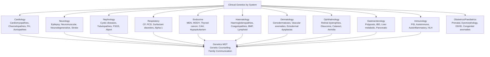

**Parent Topic:** [Clinical Genetics MOC](../Clinical%20Genetics%20MOC.md) → [Chapter 3 Hierarchy](../Davidson%20Chapter%203%20-%20Clinical%20Genetics%20Hierarchy.md)  
**Status:** `full-fcps-mrcp-note`  
**Priority:** ⭐⭐⭐ HIGHEST (FCPS/MRCP — Genetic disorders by organ system, Genotype-phenotype correlations, Specialty-specific pathways)  
**Source:** Davidson 24th Ed Ch 3; Specialty guidelines (ESC, ERS, KDIGO, EASL, EAN, BAD, RCOG, RCPCH); FCPS/MRCP syllabus; GeneReviews

---

## 1. 1. 🎯 Learning Objectives
- [ ] Recognise **genetic disorders by organ system** (Cardiology, Neurology, Nephrology, Respiratory, Endocrine, Haematology, Dermatology, Ophthalmology, Gastroenterology, Immunology)
- [ ] Apply **genotype-phenotype correlations** for major syndromes
- [ ] Navigate **specialty-specific genetic testing pathways** (When to refer, What to test, When to refer to Clinical Genetics)
- [ ] Integrate **genetics into clinical practice** (Screening, Surveillance, Family communication)
- [ ] Answer viva: "Genetic cardiomyopathy pathway" and "Epilepsy gene panel" and "Renal cystic disease workup"

---

## 2. 2. 🧠 Core Concept: Genetics Across Specialties



---

## 3. 3. ️⃣ Cardiology — Hereditary Cardiovascular Disorders

### 1. Cardiomyopathies
| Disorder | Gene(s) | Inheritance | Key Features | Testing Indication | Surveillance |
|----------|---------|-------------|--------------|-------------------|--------------|
| **HCM** | MYH7, MYBPC3, TNNT2, TNNI3, TPM1, ACTC1, MYL2, MYL3 | AD | LVH (asymmetric septal), HCM, SCD risk | Unexplained LVH, Family hx SCD, Abnormal ECG | Annual Echo + Holter; Cascade genetic testing; ICD if high risk |
| **DCM** | TTN (20%), LMNA, FLNC, MYH7, BAG3, RBM20, DSP, SCN5A | AD/AR | LV dilation, Systolic dysfunction, Arrhythmia | Idiopathic DCM, Family hx DCM/SCD, Conduction disease | Annual Echo + Holter; LMNA → Early ICD; TTN truncating = high penetrance |
| **ARVC** | PKP2, DSP, DSG2, DSC2, JUP, TMEM43 | AD | RV fibrofatty replacement, Ventricular arrhythmia, SCD | Task Force Criteria; Family hx ARVC/SCD | Annual Echo + Holter + MRI; Exercise restriction; ICD if high risk |
| **LVNC** | MYH7, MYBPC3, TTN, TAZ (X-linked) | AD/XL | Trabeculated LV, Heart failure, Arrhythmia, Embolism | Echo/MRI criteria; Family hx | Echo + MRI; Anticoag if EF<40%; ICD if high risk |
| **RCM** | TNNI3, TNNT2, MYH7, TPM1, ACTC1, DES, FLNC | AD | Restrictive filling, Bi-atrial enlargement, Diastolic dysfunction | Echocardiography; Family hx | Diuretic, Anticoag, ICD if high risk; Transplant eval |

### 2. Channelopathies (Primary Electrical Diseases)
| Disorder | Gene(s) | Inheritance | Key Features | Testing | Management |
|----------|---------|-------------|--------------|---------|------------|
| **LQTS** | KCNQ1 (LQT1), KCNH2 (LQT2), SCN5A (LQT3), KCNE1, KCNE2 | AD | QT prolongation, Syncope, SCD, TdP | Schwartz score; Genetic panel | Beta-blockers (Nadolol/Propranolol); ICD if high risk; Avoid QT-prolonging drugs |
| **BrS** | SCN5A (75-80%) | AD | J-wave (Type 1), VF risk, Fever-induced | Ajmaline/flecainide challenge | ICD if symptomatic/aborted SCD; Quinine for electrical storms |
| **CPVT** | RYR2 (AD), CASQ2 (AR) | AD/AR | Exercise-induced VT, Syncope, SCD in children | Exercise stress test; RYR2/CASQ2 | Beta-blockers (Nadolol); Flecainide add-on; ICD if breakthrough |
| **Short QT** | KCNH2, KCNQ1, KCNJ2 | AD | Short QT (<340ms), AF, SCD | ECG; Genetic panel | ICD; Quinidine |
| **SQTS** | KCNH2, KCNQ1, KCNJ2 | AD | Very short QT, AF, SCD | ECG; Genetic panel | ICD; Quinidine |

### 3. Familial Hypercholesterolaemia (FH)
| Feature | Detail |
|---------|--------|
| **Genes** | LDLR (85-90%), APOB (5-10%), PCSK9 (<1%), LDLRAP1 (AR, rare) |
| **Diagnosis** | DLCN Criteria (LDL-C, Personal/Family CVD, Tendon xanthomas, Arcus cornealis) |
| **Genetic Testing** | NGS Panel (LDLR, APOB, PCSK9) + MLPA (CNV in LDLR) |
| **Cascade Testing** | Index case → 1st-degree relatives (50% risk) → **~8 new cases per index** |
| **Management** | **High-intensity statin** (Atorva 80mg/Rosuv 40mg) + **Ezetimibe**; **PCSK9i** (Evolocumab, Alirocumab) if LDL-C > target; **Lipoprotein apheresis** (HoFH) |

### 4. Hereditary Aortopathies
| Syndrome | Gene(s) | Features | Surveillance |
|----------|---------|----------|--------------|
| **Marfan** | FBN1 | Aortic root dilation, Ectopia lentis, Dural ectasia, Skeletal | Annual Echo + Ophthalmology; Beta-blocker + ARB |
| **Loeys-Dietz** | TGFBR1/2, TGFB2/3, SMAD3 | Widespread arterial aneurysms, Hypertelorism, Bifid uvula, Cervical instability | Aggressive vascular surveillance (CT/MRI q6-12m); Early surgical threshold |
| **Vascular EDS** | COL3A1 | Arterial rupture, Bowel rupture, Thin skin, Bruising | Vascular surveillance (MRI); Avoid invasive procedures |
| **Familial Thoracic Aortic Aneurysm** | ACTA2, MYH11, MYLK, PRKG1 | TAAD, PDA, Bicuspid AV, Livedo reticularis | Annual CT/MRI aorta; Surgical threshold based on gene |

---

## 4. 4. ️⃣ Neurology — Neurogenetics

### 1. Epilepsy Genetics
| Syndrome | Gene(s) | Inheritance | Key Features | Testing |
|----------|---------|-------------|--------------|---------|
| **Dravet Syndrome** | SCN1A (>85%) | AD (De novo) | Fever-sensitive seizures <1y, Developmental regression, SCN1A spectrum | SCN1A sequencing + MLPA (CNV) |
| **SCN1A Spectrum** | SCN1A | AD | GEFS+, Dravet, EMFS, ICEGTC | SCN1A panel |
| **KCNQ2/3** | KCNQ2, KCNQ3 | AD | BFNS (Benign), EE (KCNQ2), Epileptic encephalopathy | KCNQ2/3 panel |
| **Early Infantile Epileptic Encephalopathy (EIEE)** | STXBP1, CDKL5, ARX, SLC25A22, etc. | AD/XL/AR | Infantile spasms, Developmental arrest, Specific EEG patterns | Epilepsy gene panel (>100 genes) / WES |
| **Lennox-Gastaut** | Multiple (STXBP1, SCN1A, etc.) | Mixed | Multiple seizure types, Slow spike-wave, ID | Epilepsy panel / WES |
| **Progressive Myoclonus Epilepsy** | CSTB (EPM1), PRNP, CERS1, etc. | AR/AD | Myoclonus, Ataxia, Seizures, Dementia | Targeted panel / WES |
| **Genetic Generalised Epilepsy (GGE)** | Multiple (GABRA1, CACNA1H, etc.) | Complex | CAE, JAE, JME, EGE | Targeted panel / WES |

### 2. Neuromuscular Disorders
| Disorder | Gene(s) | Inheritance | Key Features |
|----------|---------|-------------|--------------|
| **DMD/BMD** | DMD | XLR | Progressive weakness, Gower's sign, Cardiomyopathy |
| **SMA** | SMN1 | AR | SMN2 copies modify severity; Types 1-4 |
| **LGMD** | Multiple (CAPN3, DYSF, FKRP, SGCA-D, TCAP, etc.) | AR/AD | Proximal weakness, Variable onset, Cardiac/respiratory involvement |
| **CMT** | PMP22 (CMT1A dup), MPZ, GJB1 (X-linked), MFN2, GDAP1, etc. | AD/AR/XL | Peripheral neuropathy, Foot deformities, Pes cavus |
| **SMA** | SMN1 | AR | Exon 7 deletion (95%); SMN2 copies modify |
| **FSHD** | DUX4 (D4Z4 contraction) | AD | Facial, Scapular, Humeral weakness; D4Z4 repeat array |
| **DM1/DM2** | DMPK (CTG), CNBP (CCTG) | AD | Myotonia, Multisystem (Cataract, Cardiac, Endocrine, GI) |
| **FA** | FXN (GAA) | AR | Ataxia, Cardiomyopathy, Diabetes, Scoliosis |

### 3. Neurodegenerative Disorders
| Disorder | Gene(s) | Inheritance | Key Features |
|----------|---------|-------------|--------------|
| **Huntington Disease** | HTT (CAG) | AD | Chorea, Cognitive, Psychiatric; Anticipation (paternal) |
| **SCAs** | ATXN1, ATXN2, ATXN3, CACNA1A, ATXN7, ATXN8, ATXN10, etc. | AD | Ataxia, Variable features (Neuropathy, Pyramidal, Ocular) |
| **FRDA** | FXN (GAA) | AR | Ataxia, Cardiomyopathy, Diabetes, Scoliosis |
| **HD-like** | PRNP, JPH3, HTT-like | AD/AR | HD phenocopies |
| **FTD/ALS** | C9orf72 (GGGGCC), MAPT, GRN, SOD1, FUS, TARDBP | AD | FTD, ALS, FTD-ALS; C9orf72 = Most common |
| **Prion Disease** | PRNP | AD/Sp | Rapid dementia, Myoclonus, Ataxia; Iatrogenic/Genetic/Sporadic |

### 4. Stroke Genetics
| Condition | Gene(s) | Features |
|-----------|---------|----------|
| **CADASIL** | NOTCH3 | Migraine, Recurrent strokes, Mood disturbance, Dementia; MRI: WMH, Lacunes, Microbleeds |
| **CARASIL** | HTRA1 | AR; Early onset, Alopecia, Spondylosis |
| **RETINAL VASCULOPATHY** | TREX1 | RVCL (Retinal vasculopathy, Cerebral leukodystrophy) |
| **FAMILIAL CAVERNOMA** | KRIT1, CCM2, PDCD10 | Multiple cavernomas, Seizures, Haemorrhage |

---

## 5. 5. ️⃣ Nephrology — Renal Genetics

### 1. Cystic Kidney Diseases
| Disorder | Gene(s) | Inheritance | Key Features |
|----------|---------|-------------|--------------|
| **ADPKD** | PKD1 (85%), PKD2 | AD | Bilateral renal cysts, HTN, Hepatic cysts, Intracranial aneurysms |
| **ARPKD** | PKHD1 | AR | Neonatal/Childhood; Enlarged echogenic kidneys, Hepatic fibrosis, Pulmonary hypoplasia |
| **NPHP** | NPHP1-20 | AR | Childhood; Corticomedullary cysts, Tubulointerstitial nephritis, ESRD <30 |
| **Medullary Cystic** | MUC1 (MCKD1), UMOD (MCKD2) | AD | Adult-onset; Tubulointerstitial fibrosis, Gout (UMOD) |
| **BBS** | BBS1-21 | AR | Obesity, Polydactyly, Retinal dystrophy, Renal cysts, ID, Hypogonadism |
| **Joubert** | AHI1, CEP290, etc. | AR | Molar tooth sign, Ataxia, Renal cysts, ID |

### 2. Tubulopathies & Electrolyte Disorders
| Disorder | Gene(s) | Inheritance | Key Features |
|----------|---------|-------------|--------------|
| **Bartter Syndrome** | SLC12A1 (Type 1), KCNJ1 (Type 2), CLCNKB (Type 3), BSND (Type 4), MAGED2 (Type 5, XL) | AR/XL | Salt wasting, Hypokalaemia, Metabolic alkalosis, Hypercalciuria, Polyuria |
| **Gitelman Syndrome** | SLC12A3 (NCCT) | AR | Hypokalaemia, Hypomagnesaemia, Hypocalciuria, Metabolic alkalosis; Asymptomatic often |
| **Liddle Syndrome** | SCNN1B, SCNN1G | AD | Hypertension, Hypokalaemia, Low renin/aldosterone; Amiloride responsive |
| **Pseudohypoaldosteronism** | SCNN1A/B/G (PHA1), NR3C2 (PHA2) | AR/AD | Salt wasting, Hyperkalaemia, Acidosis (PHA1); HTN, Hyperkalaemia (PHA2) |
| **Dent Disease** | CLCN5 (Type 1), OCRL (Type 2, XL) | XLR | Low MW proteinuria, Hypercalciuria, Nephrolithiasis, Nephrocalcinosis, CKD |
| **Cystinosis** | CTNS | AR | Renal Fanconi, Photophobia, Corneal crystals, Hypothyroidism; Cysteamine |
| **X-linked Hypophosphataemia (XLH)** | PHEX | XLD | Phosphate wasting, Rickets, Osteomalacia; Burosumab (Anti-FGF23) |

### 3. Glomerular Diseases
| Disorder | Gene(s) | Inheritance | Features |
|----------|---------|-------------|----------|
| **Alport Syndrome** | COL4A5 (XL), COL4A3/A4 (AR/AD) | XL/AR/AD | Haematuria, Sensorineural deafness, Anterior lenticonus, ESRD |
| **Thin Basement Membrane** | COL4A3/A4 | AD | Benign familial haematuria; Thin GBM; Benign course |
| **FSGS** | NPHS1, NPHS2, WT1, ACTN4, INF2, TRPC6, APOL1 | AR/AD | Nephrotic syndrome, Steroid resistance, ESRD; APOL1 risk alleles (African ancestry) |
| **Congenital Nephrotic Syndrome** | NPHS1 (Finnish type), NPHS2, WT1, LAMB2 | AR | Massive proteinuria, Early onset; NPHS2 = Steroid-resistant |

---

## 6. 6. ️⃣ Respiratory — Pulmonary Genetics

| Disorder | Gene(s) | Inheritance | Key Features |
|----------|---------|-------------|--------------|
| **Cystic Fibrosis** | CFTR | AR | Pancreatic insufficiency, Lung disease, CBAVD, CFRD; CFTR modulators |
| **Primary Ciliary Dyskinesia (PCD)** | DNAH5, DNAI1, CCDC39/40, RPGR, etc. | AR | Chronic sinusitis, Bronchiectasis, Situs inversus (50% Kartagener), Male infertility |
| **Surfactant Disorders** | SFTPB, SFTPC, ABCA3, NKX2-1 | AR/AD | Neonatal respiratory distress, ILD, Pulmonary alveolar proteinosis |
| **Alpha-1 Antitrypsin Deficiency** | SERPINA1 | AR (Codominant) | Panacinar emphysema (basal), Liver cirrhosis; ZZ genotype; Augmentation therapy |
| **Familial Pulmonary Fibrosis** | TERT, TERC, RTEL1, PARN, SFTPA2, MUC5B | AD | ILD, Telomere shortening; Risk of BM failure, HCC |
| **Hermansky-Pudlak** | HPS1-10 | AR | Albinism, Bleeding diathesis, Pulmonary fibrosis, Granulomatous colitis |

---

## 7. 7. ️⃣ Endocrine — Endocrine Genetics

### 1. Multiple Endocrine Neoplasia
| Syndrome | Gene | Tumours | Surveillance |
|----------|-------|---------|--------------|
| **MEN1** | MEN1 (11q13) | **3 Ps**: Parathyroid (>90%), Pancreatic NET (>50%), Pituitary (~30%) | Annual Ca/PTH, Fasting Gut Hormones, MRI Pituitary, CT Pancreas |
| **MEN2A** | RET (Cys634) | MTC (100%), Phaeo (50%), Hyperparathyroidism (20-30%) | Annual Calcitonin, Metanephrines, Ca/PTH; **Prophylactic Thyroidectomy by 5y** |
| **MEN2B** | RET (M918T) | MTC (100%), Phaeo (50%), Marfanoid, Mucosal neuromas | **Prophylactic Thyroidectomy <1y** |
| **FMTC** | RET | MTC only (≥4 families) | Prophylactic thyroidectomy by 5-10y |

### 2. Diabetes Genetics
| Type | Genetic Basis | Key Genes |
|------|---------------|-----------|
| **MODY** | AD (Monogenic) | HNF1A (MODY3), GCK (MODY2), HNF4A (MODY1), HNF1B (MODY5), KCNJ11, ABCC8 |
| **Neonatal Diabetes** | KCNJ11, ABCC8 (Transient/Permanent), INS, GCK | Sulfonylurea responsive (KCNJ11/ABCC8) |
| **Type 1 Diabetes** | Complex (HLA-DR/DQ 50%, INS, PTPN22, CTLA4, IL2RA) | Complex (Polygenic + Environmental) |
| **Type 2 Diabetes** | Polygenic (TCF7L2, PPARG, KCNJ11, FTO, >400 loci) | Lifestyle + Genetics |

### 3. Thyroid Cancer Genetics
| Syndrome | Gene | Features |
|----------|------|----------|
| **Familial Non-Medullary Thyroid Cancer** | Multiple (FOXE1, NKX2-1, etc.) | Papillary thyroid Ca; AD, Low penetrance |
| **MEN2A/2B** | RET | MTC + Phaeo ± Hyperparathyroidism (2A) / Marfanoid (2B) |
| **Familial Medullary Thyroid Cancer (FMTC)** | RET | MTC only (≥4 families); Prophylactic thyroidectomy 5-10y |

### 4. Other Endocrine Genetics
| Disorder | Gene(s) | Inheritance |
|----------|---------|-------------|
| **Familial Isolated Hyperparathyroidism** | MEN1, CDC73, CASR | AD |
| **Familial Phaeochromocytoma** | VHL, RET, SDHB/SDHC/SDHD/SDHAF2, MAX, TMEM127 | AD |
| **Congenital Adrenal Hyperplasia** | CYP21A2 (21-OH def), CYP11B1 (11β-OH def), CYP17A1, STAR, HSD3B2 | AR |
| **Familial Glucocorticoid Deficiency** | MC2R, MRAP | AR |
| **Hypopituitarism** | PROP1, POU1F1, LHX3, LHX4, HESX1, OTX2 | AR/AD |

---

## 8. 8. ️⃣ Haematology — Haematogenetics

### 1. Haemoglobinopathies
| Disorder | Gene(s) | Key Features |
|----------|---------|--------------|
| **Sickle Cell Disease** | HBB (Glu6Val) | HbSS, HbSC, HbSβ-thal; VOC, ACS, Stroke, Priapism |
| **β-Thalassaemia** | HBB | TDT (Transfusion + Chelation), NTDT; Luspatercept |
| **α-Thalassaemia** | HBA1/HBA2 | Silent/Trait/HbH/Hydrops fetalis; --/αα, -/αα, --/-α, --/-- |
| **Hereditary Persistence of Fetal Hb (HPFH)** | HBB/HBD cluster | Asymptomatic; Modifies SCD/Thal severity |

### 2. Coagulation Disorders
| Disorder | Gene(s) | Inheritance |
|----------|---------|-------------|
| **Haemophilia A** | F8 | XLR |
| **Haemophilia B** | F9 | XLR |
| **von Willebrand Disease** | VWF | AD/AR |
| **Factor XI Deficiency** | F11 | AR |
| **Factor XIII Deficiency** | F13A1/F13B | AR |
| **AFibrinogenaemia/Dysfibrinogenaemia** | FGA/FGB/FGG | AR/AD |
| **Protein C/S Deficiency** | PROC/PROS1 | AD |
| **Antithrombin Deficiency** | SERPINC1 | AD |
| **Factor V Leiden** | F5 (R506Q) | AD (Thrombophilia) |
| **Prothrombin G20210A** | F2 | AD (Thrombophilia) |

### 3. Bone Marrow Failure & Predisposition
| Syndrome | Gene(s) | Inheritance |
|----------|---------|-------------|
| **Fanconi Anaemia** | FANCA-W (22 genes) | AR |
| **Diamond-Blackfan Anaemia** | RPL5, RPL11, RPS19, RPS24, RPS26, etc. | AD |
| **Shwachman-Diamond** | SBDS | AR |
| **Dyskeratosis Congenita** | DKC1 (X-linked), TERC, TERT, TINF2, RTEL1 | XLR/AD/AR |
| **Severn Congenital Neutropenia** | ELANE, HAX1, G6PC3, JAGN1 | AD/AR |

### 4. Haemoglobinopathy Screening
| Programme | Method |
|-----------|--------|
| **Antenatal** | HPLC/IEF at booking (Sickle, Thalassaemia) |
| **Newborn** | HPLC/IEF on dried blood spot (HbS, HbC, HbD, HbE, HbF) |
| **Pre-conception** | Carrier screening in high-prevalence populations |

---

## 9. 9. ️⃣ Dermatology — Genodermatoses

### 1. Epidermolysis Bullosa (EB)
| Type | Gene(s) | Level of Cleavage |
|------|---------|-------------------|
| **EBS** (Simplex) | KRT5, KRT14, PLEC | Intraepidermal |
| **JEB** (Junctional) | LAMB3, LAMC2, LAMA3, COL17A1 | Lamina lucida |
| **DEB** (Dystrophic) | COL7A1 | Sublamina densa (Anchoring fibrils) |
| **Kindler** | FERMT1 | Mixed |

### 2. Ichthyoses
| Disorder | Gene | Type |
|----------|------|------|
| **Ichthyosis Vulgaris** | FLG | AD (Semi-dominant) |
| **X-linked Ichthyosis** | STS | XLR |
| **Lamellar Ichthyosis** | TGM1, ABCA12, NIPAL4, CYP4F22 | AR |
| **Congenital Ichthyosiform Erythroderma** | ALOX12B, ALOXE3, NIPAL4 | AR |
| **Harlequin Ichthyosis** | ABCA12 | AR |
| **Netherton Syndrome** | SPINK5 | AR |

### 3. Vascular Anomalies
| Syndrome | Gene | Features |
|----------|------|----------|
| **Sturge-Weber** | GNAQ (Somatic) | Port-wine stain, Leptomeningeal angioma, Glaucoma |
| **Klippel-Trenaunay** | PIK3CA (Somatic) | Capillary malformation, Venous malformation, Limb overgrowth |
| **Parkes Weber** | RASA1 | AVM, Limb overgrowth |
| **Hereditary Haemorrhagic Telangiectasia (HHT)** | ENG (Type 1), ACVRL1 (Type 2), SMAD4 | Epistaxis, Telangiectasia, AVM (Lung, Liver, Brain) |

### 4. Other Genodermatoses
| Disorder | Gene | Key Features |
|----------|------|--------------|
| **Neurofibromatosis 1** | NF1 | Café-au-lait, Neurofibromas, Optic glioma, Lisch nodules |
| **Tuberous Sclerosis** | TSC1/TSC2 | Tubers, SEGA, AML, LAM, Facial angiofibromas |
| **Incontinentia Pigmenti** | IKBKG | XLD, Male lethal; Skin stages (Ves→Ver→Hyper→Atrophic) |
| **Xeroderma Pigmentosum** | XPA-G, XPV | AR; UV sensitivity, Skin cancer, Neurological |
| **Ectodermal Dysplasia** | EDA (XLR), EDAR, EDARADD, WNT10A | Hypohidrosis, Hypodontia, Sparse hair |
| **Pachyonychia Congenita** | KRT6A/B, KRT16, KRT17 | AD; Nail dystrophy, Palmoplantar keratoderma, Oral leukokeratosis |

---

## 10. 10. ️⃣ Ophthalmology — Ophthalmic Genetics

### 1. Retinal Dystrophies
| Disorder | Gene(s) | Inheritance | Key Features |
|----------|---------|-------------|--------------|
| **Retinitis Pigmentosa (RP)** | >100 genes (RHO, RPGR, USH2A, RP1, etc.) | AD/AR/XL | Night blindness, Tunnel vision, Bone spicules |
| **Leber Congenital Amaurosis (LCA)** | RPE65, CEP290, GUCY2D, AIPL1, etc. | AR | Severe visual impairment from infancy, Nystagmus, Amaurotic pupils |
| **Stargardt Disease** | ABCA4 (AR), ELOVL4 (AD) | AR/AD | Macular dystrophy, Flecks, Central vision loss |
| **Best Disease** | BEST1 | AD | Vitelliform macular dystrophy, Normal vision initially |
| **Choroideremia** | CHM (REP1) | XLR | Night blindness, Choroidal atrophy, Progressive |
| **Cone-Rod Dystrophy** | ABCA4, GUCY2D, CRX, etc. | AR/AD | Central vision loss, Photophobia, Colour vision defect |

### 2. Congenital Eye Disorders
| Disorder | Gene(s) | Features |
|----------|---------|----------|
| **Aniridia** | PAX6 | AD; Iris hypoplasia, Nystagmus, Glaucoma, Cataract, Corneal pannus |
| **Congenital Cataract** | CRYAA, CRYBB2, CRYGC, GJA8, MAF, FYCO1 | AD/AR; Lens opacity at birth |
| **Congenital Glaucoma** | CYP1B1 (AR), LTBP2 (AR), MYOC (AD) | AR/AD; Buphthalmos, Corneal oedema, Raised IOP |
| **Axenfeld-Rieger** | PITX2, FOXC1 | AD; Iridocorneal adhesions, Glaucoma, Dental, Umbilical anomalies |

### 3. Anterior Segment Dysgenesis
| Syndrome | Gene | Features |
|----------|------|----------|
| **Axenfeld-Rieger** | PITX2, FOXC1 | Iridocorneal adhesions, Posterior embryotoxon, Glaucoma (50%), Dental, Umbilical |
| **Peters Anomaly** | PAX6, FOXC1, CYP1B1 | Central corneal opacity, Iridocorneal/lenticular adhesions |

---

## 11. 11. ️⃣ Gastroenterology — GI Genetics

### 1. Polyposis Syndromes
| Syndrome | Gene | Features |
|----------|------|----------|
| **FAP** | APC (5q22) | 100-1000s adenomas, CHRPE, Desmoids, Duodenal adenomas, Thyroid Ca |
| **AFAP** | APC (5'/3') | <100 polyps, Later onset, Extracolonic features similar |
| **MUTYH-Associated Polyposis (MAP)** | MUTYH (AR) | 10-100 polyps, Duodenal polyps, Gastric polyps |
| **Peutz-Jeghers** | STK11 | Hamartomatous polyps, Mucocutaneous pigmentation, Cancer risk (GI, Breast, Ovarian, Pancreatic, Testicular) |
| **Juvenile Polyposis** | SMAD4, BMPR1A | Juvenile polyps, GI bleeding, SMAD4 = HHT overlap |
| **Cowden Syndrome** | PTEN | Hamartomas (Skin, Thyroid, Breast, Endometrium), Macrocephaly, Trichilemmomas |
| **Hereditary Mixed Polyposis** | BMPR1A, GREM1 | Mixed polyps (Adenomas, Hyperplastic, Juvenile) |

### 2. Inflammatory Bowel Disease (IBD)
| Type | Genetic Architecture |
|------|----------------------|
| **Crohn's Disease** | NOD2 (CARD15), ATG16L1, IL23R, IRGM, LRRK2, >200 loci |
| **Ulcerative Colitis** | HLA-DRB1, IL10, IL23R, RORC, >200 loci |
| **Very Early Onset IBD (VEO-IBD)** | Monogenic (IL10/IL10R, XIAP, CYBB, NCF1, LRBA, etc.) |

### 3. Liver & Pancreas
| Disorder | Gene(s) | Features |
|----------|---------|----------|
| **Hereditary Haemochromatosis** | HFE (C282Y/H63D) | Iron overload, Cirrhosis, Diabetes, Arthritis; Phlebotomy |
| **Wilson Disease** | ATP7B | Copper accumulation, Liver/Neuro, K-F rings, Penicillamine |
| **Alpha-1 Antitrypsin Deficiency** | SERPINA1 (ZZ) | Emphysema, Liver cirrhosis; Augmentation therapy |
| **Gilbert Syndrome** | UGT1A1 (TA7TAA) | Benign unconjugated hyperbilirubinaemia |
| **Crigler-Najjar** | UGT1A1 | Type 1 (Severe, Kernicterus); Type 2 (Milder, Phenobarbital responsive) |
| **Dubin-Johnson / Rotor** | ABCC2 / SLCO1B1/SLCO1B3 | Conjugated hyperbilirubinaemia |
| **Familial Pancreatitis** | PRSS1 (AD), SPINK1 (AR), CFTR (AR), CTRC, CPA1 | Recurrent acute pancreatitis → Chronic pancreatitis |
| **Cystic Fibrosis** | CFTR | Pancreatic insufficiency, Lung disease, CBAVD |

---

## 12. 12. 🔟 Immunology — Primary Immunodeficiencies (PID)

### 1. Antibody Deficiencies
| Disorder | Gene(s) | Inheritance |
|----------|---------|-------------|
| **X-linked Agammaglobulinaemia (XLA)** | BTK | XLR |
| **Common Variable Immunodeficiency (CVID)** | Multiple (TNFRSF13B, NFKB1, NFKB2, CTLA4, LRBA, etc.) | AD/AR |
| **IgA Deficiency** | Complex | Mostly sporadic |
| **Hyper-IgM Syndrome** | CD40LG (XLR), AICDA, UNG (AR) | XLR/AR |

### 2. Combined Immunodeficiencies
| Disorder | Gene(s) | Inheritance |
|----------|---------|-------------|
| **SCID** | IL2RG (XLR), ADA, RAG1/2, IL7R, JAK3, DCLRE1C (AR) | XLR/AR |
| **OMENN Syndrome** | RAG1/2, DCLRE1C | AR |
| **Ataxia-Telangiectasia** | ATM | AR |
| **Nijmegen Breakage Syndrome** | NBN | AR |

### 3. Phagocyte Defects
| Disorder | Gene(s) | Inheritance |
|----------|---------|-------------|
| **Chronic Granulomatous Disease** | CYBB (XLR), CYBA, NCF1, NCF2, NCF4 (AR) | XLR/AR |
| **Leukocyte Adhesion Deficiency** | ITGB2 (LAD1), SLC35C1 (LAD2), FERMT3 (LAD3) | AR |
| **Neutrophil-Specific Granule Deficiency** | CEBPE | AR |

### 4. Autoinflammatory Syndromes
| Syndrome | Gene | Inheritance |
|----------|---------|-------------|
| **FMF** | MEFV | AR |
| **TRAPS** | TNFRSF1A | AD |
| **CAPS (FCAS/MWS/NOMID)** | NLRP3 | AD |
| **MKD/HIDS** | MVK | AR |
| **DIRA** | IL1RN | AR |
| **SAVI** | STING1 | AD |

### 5. HLH & Immune Dysregulation
| Syndrome | Gene(s) | Inheritance |
|----------|---------|-------------|
| **Familial HLH** | PRF1, UNC13D, STX11, STXBP2, RAB27A | AR |
| **XLP1** | SH2D1A | XLR |
| **XLP2** | XIAP/BIRC4 | XLR |
| **ALPS** | FAS, FASLG, CASP10 | AD/AR |
| **AIFEC** | NLRC4 | AD |
| **CTLA4 Haploinsufficiency** | CTLA4 | AD |
| **LRBA Deficiency** | LRBA | AR |
| **STAT3 GOF** | STAT3 | AD |
| **STAT1 GOF/LOF** | STAT1 | AD/AR |
| **RAG1/2 Deficiency** | RAG1/RAG2 | AR (SCID/Omenn) |

---

## 13. 13. 🔟 Paediatrics & Obstetrics — Developmental Genetics

### 1. Dysmorphology & Congenital Anomalies
| Approach | Key Steps |
|----------|-----------|
| **Dysmorphology Assessment** | Major/Minor anomalies, Growth parameters, Developmental milestones, Family history (3-gen pedigree) |
| **Syndrome Recognition** | Pattern recognition (FACE, GESTALT); Databases (OMIM, POSSUM, Face2Gene) |
| **Genetic Testing** | **Microarray (1st-tier)** → CNV/LOH/UPD; **Exome/Genome** if array negative; **Targeted panel** for specific phenotypes |

### 2. Common Syndromes with Dysmorphology
| Syndrome | Gene(s) | Key Features |
|----------|---------|--------------|
| **Down Syndrome** | Trisomy 21 | Intellectual disability, Flat facies, Epicanthic folds, Single palmar crease, AVSD, Duodenal atresia |
| **Noonan Syndrome** | PTPN11, SOS1, RAF1, RIT1 | Short stature, Webb neck, PS, Hypertelorism, Pectus, Coagulopathy |
| **Williams Syndrome** | 7q11.23 del | Elfin facies, SVAS, Hypercalcaemia, Outgoing personality, ID |
| **Prader-Willi** | 15q11-13 (Pat del/UPDmat) | Hypotonia → Hyperphagia/Obesity, Hypogonadism, ID |
| **Angelman** | 15q11-13 (Mat del/UPDpat/UBE3A) | Severe ID, Ataxia, Happy demeanour, Seizures |
| **22q11 Deletion (DiGeorge/VCFS)** | 22q11.2 del | CATCH-22: Cardiac, Abnormal facies, Thymic hypoplasia, Cleft, Hypocalcaemia |
| **Smith-Magenis** | RAI1 (17p11.2 del) | Self-hug, Sleep disturbance, Hoarse voice, Behavioural, ID |
| **Cornelia de Lange** | NIPBL, SMC1A, SMC3, HDAC8, RAD21 | AR/AD/XL; Synophrys, Long lashes, Microcephaly, Limb defects, ID |
| **Rubinstein-Taybi** | CREBBP, EP300 | Broad thumbs/hallux, Microcephaly, ID, Characteristic face |
| **Kabuki** | KMT2D (AD), KDM6A (XLD) | Arched brows, Long palpebral fissures, Persistent fetal fingertip pads, ID |
| **CHARGE** | CHD7 | Coloboma, Heart, Atresia choanae, Retarded growth, Genital, Ear |

### 3. Neurodevelopmental Disorders
| Disorder | Genetic Basis |
|----------|-------------|
| **Autism Spectrum Disorder (ASD)** | Highly heterogeneous; >100 genes (SHANK3, NLGN3/4, NRXN1, CNTNAP2, CHD8, SYNGAP1, ADNP, etc.); CNV (16p11.2, 15q11-13, 22q11, 1q21.1) |
| **Intellectual Disability (ID)** | >1000 genes; Syndromic + Non-syndromic; CNV (Microarray 1st-tier) → WES/WGS |
| **Developmental & Epileptic Encephalopathies (DEE)** | SCN1A, STXBP1, KCNQ2, CDKL5, ARX, SLC25A22, etc. |

### 4. Congenital Anomalies — Genetic Basis
| Anomaly | Genetic Aetiology |
|---------|------------------|
| **Neural Tube Defects** | MTHFR, MTRR, SHMT1 (Folate pathway); Multifactorial |
| **Congenital Heart Disease** | NKX2-5, TBX5, GATA4, NOTCH1, JAG1, ZIC3, etc.; CNV (22q11, 1p36, 8p23) |
| **Cleft Lip/Palate** | IRF6 (Van der Woude), MSX1, TP63, BMP4, FGFR1; Multifactorial |
| **Renal/Urinary Tract Anomalies (CAKUT)** | PAX2, SIX2, EYA1, HNF1B, GDNF/RET, SALL1, etc. |
| **Skeletal Dysplasias** | FGFR3 (Achondroplasia), COL2A1 (Type II Collagenopathies), COL1A1/2 (OI), COMP (Pseudoachondroplasia) |

---

## 14. 14. 🔟 Genetic Testing in Clinical Practice — By Specialty

| Specialty | First-Line Test | When to Refer to Clinical Genetics |
|-----------|----------------|-----------------------------------|
| **Cardiology** | Cardiomyopathy/Channelopathy panels; FH panel | Unexplained cardiomyopathy, SCD family history, Aortopathy |
| **Neurology** | Epilepsy panel (>100 genes) / WES; Neuromuscular panel | Epileptic encephalopathy, Neuromuscular, Neurodegenerative, Ataxia |
| **Nephrology** | Cystic kidney panel; Tubulopathy panel; Alport panel | Cystic kidney disease, Tubulopathy, Early ESRD, Family history |
| **Respiratory** | CFTR (CF); PCD panel; Surfactant panel; SERPINA1 | CF, PCD, Surfactant disorders, Alpha-1, Familial IPF |
| **Endocrine** | MEN panels; MODY panel; Thyroid cancer panel; CAH panel | MEN, MODY, Medullary thyroid Ca, Phaeo, CAH |
| **Haematology** | Haemoglobinopathy screen; Coagulation panel; BMF panel | Haemoglobinopathy, Coagulopathy, BMF, PID |
| **Dermatology** | EB panel; Ichthyosis panel; Vascular anomaly panel; EB panel | Genodermatoses, Vascular anomalies, EB, Ichthyosis |
| **Ophthalmology** | Retinal dystrophy panel; LCA panel; Anterior segment panel | Retinal dystrophy, Congenital cataract/glaucoma, Aniridia |
| **Gastroenterology** | Polyposis panels (APC, MUTYH, STK11); IBD panel (VEO-IBD) | Polyposis, VEO-IBD, Hereditary pancreatitis |
| **Immunology** | PID panels (SCID, CID, CGD, ALPS, HLH); NGS panel | PID, HLH, Autoinflammatory, Unexplained cytopenias |
| **Paediatrics/Obs** | Microarray (1st-tier DD/ID/CA); WES/WGS; Prenatal panels | DD/ID, Congenital anomalies, Dysmorphism, Recurrent miscarriage |

---

## 15. 15. ⚡ FCPS/MRCP High-Yield Summary

| Specialty | Key Genetic Disorders | First-Line Test | Key Surveillance |
|-----------|----------------------|-----------------|------------------|
| **Cardiology** | HCM (MYH7/MYBPC3), DCM (TTN/LMNA), ARVC (PKP2), Channelopathies (LQTS/BrS/CPVT), FH, Marfan, Loeys-Dietz | Cardiomyopathy/Channelopathy panels; FH panel; Aortopathy panel | Annual Echo + Holter (Cardiomyopathies); Annual MRI aorta (Aortopathies); Cascade testing |
| **Neurology** | Epilepsy (SCN1A, KCNQ2, STXBP1); Neuromuscular (DMD, SMA, CMT, LGMD); Neurodegenerative (HD, SCA, FRDA, FTD/ALS) | Epilepsy panel / WES; Neuromuscular panel; HD predictive protocol | Annual neuro review; Cardiac surveillance (DMD, SMA); Predictive protocol (HD) |
| **Nephrology** | ADPKD (PKD1/2), ARPKD, Alport (COL4A5), Tubulopathies (Bartter, Gitelman, Liddle), Nephronophthisis | Cystic kidney panel; Tubulopathy panel; Alport panel | Annual eGFR/BP (ADPKD); Electrolyte monitoring (Tubulopathies); Hearing/eye (Alport) |
| **Respiratory** | CF (CFTR), PCD (DNAH5, etc.), Surfactant (SFTPB/C), Alpha-1 (SERPINA1), Familial IPF | CFTR (CF); PCD panel; SFTPC/B; SERPINA1; Telomere genes | CFTR modulators; Airway clearance; Augmentation (A1AT); Lung transplant eval |
| **Endocrine** | MEN1/2, MODY (HNF1A/GCK/HNF4A), CAH (CYP21A2), Thyroid Ca (RET), Familial Phaeo | MEN panels; MODY panel; Thyroid cancer panel; CAH panel | Annual surveillance (MEN); Glucose monitoring (MODY); Prophylactic surgery (MEN2) |
| **Haematology** | Haemoglobinopathies (CFTR, HBB), Coagulopathies (F8, F9, VWF), BMF (FA, DBA), PID | Haemoglobinopathy screen; Coagulation panel; BMF panel; PID panel | Transfusion/chelation (Thal); Factor replacement (Haemophilia); HSCT (BMF/PID) |
| **Dermatology** | EB (KRT5/14, COL7A1), Ichthyosis (FLG, STS, TGM1), Vascular anomalies (GNAQ, PIK3CA, RASA1) | EB panel; Ichthyosis panel; Vascular panel | Wound care (EB); Skin surveillance (Ichthyosis); AVM screening (HHT) |
| **Ophthalmology** | RP (RPGR, RHO), LCA (RPE65, CEP290), Stargardt (ABCA4), Aniridia (PAX6) | Retinal dystrophy panel; LCA panel; Anterior segment panel | Annual ophthalmology; Low vision aids; Gene therapy (RPE65) |
| **Gastroenterology** | Polyposis (APC, MUTYH, STK11, SMAD4, BMPR1A); IBD (VEO-IBD); Hereditary pancreatitis (PRSS1, SPINK1) | Polyposis panels; VEO-IBD panel; Pancreatitis panel | Colonoscopy (Polyposis); Duodenal surveillance (FAP); Endoscopic surveillance |
| **Immunology** | PID (BTK, IL2RG, ADA, CYBB, STAT1/3, CTLA4, LRBA); HLH (PRF1, UNC13D); Autoinflammatory | PID panels (SCID, CID, CGD, HLH, ALPS); Autoinflammatory panel | IVIG (Antibody deficiency); HSCT (SCID, HLH); Biologics (Autoinflammatory) |
| **Paediatrics/Obs** | DD/ID (Microarray 1st-tier → WES/WGS); Dysmorphism syndromes; Prenatal (CVS/Amnio/NIPT/PGT) | Microarray (1st-tier DD/ID); WES/WGS; Prenatal panels | Developmental surveillance; Syndrome-specific management; Prenatal counselling |

---

## 16. 16. 🎤 Viva Questions (Expected Answers)

| # | Question | Expected Answer |
|---|----------|-----------------|
| 1 | Cardiomyopathy genetic testing — which genes for HCM? | MYH7, MYBPC3 (80%), TNNT2, TNNI3, TPM1, ACTC1, MYL2, MYL3 |
| 2 | Channelopathy — Brugada syndrome gene? | **SCN5A** (75-80%); Sodium channel loss-of-function |
| 3 | FH — cascade testing yield? | **~8 new cases per index case** (1st-degree relatives, 50% risk) |
| 4 | Epilepsy — SCN1A spectrum disorders? | Dravet, GEFS+, EMFS, ICEGTC; De novo >85% |
| 5 | Neuromuscular — DMD vs BMD genetic difference? | **Reading frame**: Out-of-frame = DMD; In-frame = BMD (Same DMD gene) |
| 5 | Cystic kidney — ADPKD vs ARPKD genes? | ADPKD: PKD1 (85%), PKD2; ARPKD: PKHD1 |
| 6 | Tubulopathy — Gitelman vs Bartter? | Gitelman: SLC12A3 (NCCT), Hypomagnesaemia, Hypocalciuria; Bartter: SLC12A1/KCNJ1/CLCNKB/BSND, Hypercalciuria |
| 7 | CF — CFTR modulator therapy? | **Triple therapy (Elexacaftor/Tezacaftor/Ivacaftor)** for ≥1 F508del allele (90% patients) |
| 8 | Endocrine — MEN2B prophylactic thyroidectomy age? | **<1 year** (MTC 100% penetrant, aggressive) |
| 9 | Haematology — Hereditary spherocytosis genes? | ANK1, SPTB, SLC4A1, EPB42 (AD/AR) |
| 10 | Immunology — SCID newborn screening? | **TREC assay** (T-cell receptor excision circles) on dried blood spot |

---

## 17. 17. 🧩 Confusions & Mnemonics

| Confusion | Clarification |
|-----------|---------------|
| **"All cardiomyopathy = Genetic"** | **NO.** Many acquired (Ischaemic, Hypertensive, Viral, Alcohol, Amyloid); Genetic testing if unexplained + family history |
| **"All epilepsy = Genetic"** | **NO.** Many acquired (Stroke, Tumour, Trauma, Infection); Genetic testing for epileptic encephalopathy, early onset, family history |
| **"All kidney cysts = ADPKD"** | **NO.** ARPKD, Simple cysts, Medullary cystic, NPHP, BBS, Acquired cysts (Dialysis) |
| **"All nephrotic syndrome = Genetic"** | **NO.** Primary (FSGS genetic) vs Secondary (Diabetes, Amyloid, SLE, Drugs); Genetic if steroid-resistant, early onset, family history |
| **"All interstitial lung disease = Genetic"** | **NO.** Most acquired (IPF, CTD, Hypersensitivity, Drug, Sarcoid); Genetic if familial, young onset, syndromic (Surfactant, Telomeres) |
| **"All heart disease = Genetic"** | **NO.** Most acquired (Ischaemic, Hypertensive, Valvular); Genetic if young onset, family history, syndromic features |
| **"All epilepsy = SCN1A"** | **NO.** Many genes (KCNQ2, STXBP1, CDKL5, SCN2A, etc.); SCN1A = Dravet/GEFS+ spectrum |
| **"All arrhythmia = Channelopathy"** | **NO.** Many structural (Ischaemic, Cardiomyopathy, Valvular); Channelopathy if structurally normal heart |
| **"All high cholesterol = FH"** | **NO.** Most polygenic/lifestyle; FH if LDL-C very high, tendon xanthomas, family history, genetic confirmation |
| **"All anaemia = Genetic"** | **NO.** Most acquired (Iron deficiency, Chronic disease, B12/folate, Renal, Haemolysis); Genetic if congenital, family history, specific features |

> **Mnemonic: SYSTEM-BY-SYSTEM GENETICS**  
> **C**ardiology: **HCM (MYH7/MYBPC3), DCM (TTN/LMNA), Channelopathies (SCN5A, KCNQ1, RYR2), FH (LDLR/APOB/PCSK9), Aortopathies (FBN1, TGFBR, ACTA2)**  
> **Y** Neurology: **Epilepsy (SCN1A, KCNQ2, STXBP1), Neuromuscular (DMD/SMA/CMT/LGMD), Neurodegenerative (HD/SCA/FRDA/FTD-ALS)**  
> **S** Nephrology: **ADPKD (PKD1/2), ARPKD (PKHD1), Alport (COL4A5), Tubulopathies (Bartter/Gitelman/Liddle), NPHP**  
> **T** Respiratory: **CF (CFTR), PCD (DNAH5), Surfactant (SFTPB/C), Alpha-1 (SERPINA1), Familial IPF (TERT/TERC)**  
> **E**ndocrine: **MEN1/2A/2B (MEN1/RET), MODY (HNF1A/GCK/HNF4A), CAH (CYP21A2), Thyroid (RET), Phaeo (VHL/SDH)**  
> **M** Haematology: **Haemoglobinopathies (HBB), Coagulation (F8/F9/VWF), BMF (FA/DBA), PID (BTK/IL2RG/CYBB)**  
> **E** Dermatology: **EB (KRT5/14/COL7A1), Ichthyosis (FLG/STS/TGM1), Vascular (GNAQ/PIK3CA/RASA1/ENG/ACVRL1)**  
> **O**phthalmology: **RP (RHO/RPGR/USH2A), LCA (RPE65/CEP290), Stargardt (ABCA4), Aniridia (PAX6)**  
> **G**astroenterology: **Polyposis (APC/MUTYH/STK11/SMAD4), IBD (NOD2/ATG16L1), Pancreatitis (PRSS1/SPINK1)**  
> **I**mmunology: **PID (BTK/IL2RG/ADA/CYBB/STAT1/3), HLH (PRF1/UNC13D), Autoinflammatory (NLRP3/MEFV/TNFRSF1A)**  
> **P**aediatrics/Obs: **DD/ID (Microarray→WES), Dysmorphism syndromes (Down/Noonan/Williams/22q11), Prenatal (NIPT/CVS/Amnio/PGT)**  
> **Y**ield: **Refer to Clinical Genetics if: Unexplained phenotype, Family history, Reproductive planning, Surveillance planning**  

---

## 18. 18. 🗺️ Mind Map

```mermaid
mindmap
  root((System-Based Genetics))
    Cardiology
      Cardiomyopathies: HCM, DCM, ARVC, LVNC, RCM
      Channelopathies: LQTS, BrS, CPVT, SQTS
      FH: LDLR/APOB/PCSK9
      Aortopathies: Marfan, Loeys-Dietz, Vascular EDS, FTAA
    Neurology
      Epilepsy: SCN1A, KCNQ2, STXBP1, etc.
      Neuromuscular: DMD/BMD, SMA, CMT, LGMD, FSHD
      Neurodegenerative: HD, SCA, FRDA, FTD/ALS, Prion
      Stroke: CADASIL, CARASIL, RVCL
    Nephrology
      Cystic: ADPKD, ARPKD, NPHP, MCKD
      Tubulopathies: Bartter, Gitelman, Liddle, Dent
      Glomerular: Alport, Thin GBM, FSGS
    Respiratory
      CF, PCD, Surfactant, Alpha-1, Familial IPF
    Endocrine
      MEN1/2A/2B, MODY, CAH, Thyroid Ca, Phaeo
    Haematology
      Haemoglobinopathies, Coagulation, BMF, PID
    Dermatology
      EB, Ichthyosis, Vascular anomalies, Genodermatoses
    Ophthalmology
      RP, LCA, Stargardt, Best, Aniridia, Congenital glaucoma
    Gastroenterology
      Polyposis (FAP/AFAP/MAP/PJS/JPS), IBD, Pancreatitis, Liver
    Immunology
      PID (SCID, CGD, HLH), Autoinflammatory, ALPS, CTLA4/LRBA
    Paediatrics/Obs
      DD/ID (Microarray→WES), Dysmorphism syndromes, Prenatal (NIPT/CVS/PGT)
```

---

## 19. 19. 📅 Spaced Repetition Tracker

| Review | Date | Score (0–5) | Notes |
|--------|------|-------------|-------|
| Day 1 | | | |
| Day 3 | | | |
| Day 7 | | | |
| Day 14 | | | |
| Day 30 | | | |
| Day 90 | | | |

---

## 20. 20. 📝 Self-Test Scorecard

| Section | Max | Score | % |
|---------|-----|-------|---|
| Cardiology | 3 | | |
| Neurology | 3 | | |
| Nephrology | 3 | | |
| Respiratory | 2 | | |
| Endocrine | 2 | | |
| Haematology | 2 | | |
| Dermatology | 2 | | |
| Ophthalmology | 1 | | |
| Gastroenterology | 2 | | |
| Immunology | 2 | | |
| Paediatrics/Obs | 2 | | |
| **Total** | **20** | | |

---

## 21. 21. 💬 Exam Answer Modes

| Format | Prompt | Key Points |
|--------|--------|------------|
| **Long Essay** | "Describe the genetic basis, clinical features, and management of hypertrophic cardiomyopathy." | MYH7/MYBPC3 (80%), AD, LVH, SCD risk, Genetic testing, Cascade screening, Beta-blockers, ICD, Family screening |
| **Short Note** | "Genetic testing in developmental delay." | Microarray 1st-tier (CNV/LOH/UPD) → WES/WGS if negative → Parental trio for segregation → Genetic counselling |
| **Viva** | "Child with steroid-resistant nephrotic syndrome. Genetic workup?" | **FSGS panel** (NPHS1, NPHS2, WT1, ACTN4, TRPC6, INF2); **APOL1** risk alleles (African ancestry); Consider COL4A5 (Alport) if haematuria/deafness |
| **Ward Round** | "25M with syncope, ECG shows Type 1 Brugada pattern. Brother died suddenly at 30. Genetic test?" | **SCN5A sequencing** (75-80% BrS); If positive → Cascade testing family; ICD if symptomatic/aborted SCD; Ajmaline challenge for relatives |
| **Last-Night** | "Cardio: HCM/DCM/Channel/FH/Aortopathies. Neuro: Epilepsy/Neuromuscular/Neurodeg. Nephro: ADPKD/ARPKD/Alport/Tubulopathies. Resp: CF/PCD/Surfactant/A1AT. Endo: MEN/MODY/CAH. Haeme: Hbpathy/Coag/BMF/PID. Derm: EB/Ichthyosis/Vascular. Eye: RP/LCA/Stargardt/Aniridia. GI: Polyposis/IBD/Pancreatitis. Immune: PID/HLH/Autoinf. Paeds: DD/ID microarray→WES." | Compressed system-by-system. |

---

## 22. 22. 📌 Summary
- **Cardiology**: HCM (MYH7/MYBPC3), DCM (TTN/LMNA), Channelopathies (SCN5A, KCNQ1, RYR2), FH (LDLR/APOB/PCSK9), Aortopathies (FBN1, TGFBR, ACTA2)
- **Neurology**: Epilepsy (SCN1A, KCNQ2, STXBP1), Neuromuscular (DMD/BMD, SMA, CMT, LGMD), Neurodegenerative (HD, SCA, FRDA, FTD/ALS), Stroke (CADASIL)
- **Nephrology**: ADPKD (PKD1/2), ARPKD (PKHD1), Alport (COL4A5), Tubulopathies (Bartter, Gitelman, Liddle), FSGS (NPHS1/2, APOL1)
- **Respiratory**: CF (CFTR), PCD (DNAH5), Surfactant (SFTPB/C), Alpha-1 (SERPINA1), Familial IPF (TERT/TERC)
- **Endocrine**: MEN1/2A/2B (MEN1/RET), MODY (HNF1A/GCK/HNF4A), CAH (CYP21A2), Thyroid Ca (RET), Phaeo (VHL/SDHx)
- **Haematology**: Haemoglobinopathies (HBB), Coagulopathies (F8/F9/VWF), BMF (FA/DBA), PID (BTK/IL2RG/CYBB/STAT3)
- **Dermatology**: EB (KRT5/14, COL7A1), Ichthyosis (FLG/STS/TGM1), Vascular (GNAQ/PIK3CA/RASA1/ENG/ACVRL1)
- **Ophthalmology**: RP (RPGR/RHO), LCA (RPE65/CEP290), Stargardt (ABCA4), Aniridia (PAX6)
- **Gastroenterology**: Polyposis (APC, MUTYH, STK11, SMAD4), IBD (NOD2, IL23R), Pancreatitis (PRSS1, SPINK1)
- **Immunology**: PID (BTK, IL2RG, ADA, CYBB, STAT1/3, CTLA4, LRBA), HLH (PRF1, UNC13D), Autoinflammatory (NLRP3, MEFV)
- **Paediatrics/Obs**: DD/ID (Microarray 1st-tier → WES/WGS), Dysmorphism syndromes, Prenatal (NIPT, CVS, Amnio, PGT-M)

---

## 23. 23. ❓ MCQs (10)

1. **HCM — most commonly mutated genes?**  
   A. TTN, LMNA  B. **MYH7, MYBPC3 (80%)**  C. SCN5A, RYR2  D. PKP2, DSP  
   *Answer: B. MYH7 and MYBPC3 account for ~80% of HCM cases.*

2. **Brugada syndrome — primary gene?**  
   A. KCNQ1  B. KCNH2  C. **SCN5A**  D. RYR2  
   *Answer: C. SCN5A (loss-of-function) in 75-80% of BrS cases.*

3. **Cystic fibrosis — CFTR modulator for F508del homozygotes?**  
   A. Ivacaftor alone  B. Lumacaftor/Ivacaftor  C. **Elexacaftor/Tezacaftor/Ivacaftor (Triple therapy)**  D. Tezacaftor/Ivacaftor  
   *Answer: C. Triple therapy (Elexacaftor/Tezacaftor/Ivacaftor) for ≥1 F508del allele (covers 90% patients).*

4. **Alport syndrome — inheritance & key gene?**  
   A. AD, COL4A5  B. **XL, COL4A5 (85%)**  C. AR, COL4A3  D. AD, COL4A4  
   *Answer: B. X-linked (COL4A5) in 85%; AR (COL4A3/A4) in 15%.*

5. **Familial hypercholesterolaemia — cascade testing yield?**  
   A. 2 new cases/index  B. 4  C. **~8 new cases per index**  D. 16  
   *Answer: C. 1st-degree relatives 50% risk → typically identifies ~8 new cases per index.*

6. **Duchenne vs Becker — genetic difference?**  
   A. Different genes  B. **Reading frame (Out-of-frame vs In-frame)**  C. Different chromosomes  D. Different proteins  
   *Answer: B. Same DMD gene; DMD = Out-of-frame (no dystrophin); BMD = In-frame (truncated dystrophin).*

7. **Long QT syndrome — most common gene?**  
   A. SCN5A  B. **KCNQ1 (LQT1)**  C. KCNH2  D. KCNE1  
   *Answer: B. KCNQ1 (LQT1) ~35-40%; KCNH2 (LQT2) ~30%; SCN5A (LQT3) ~10%.*

8. **Spinal muscular atrophy — SMN2 copy number correlates with:**  
   A. Age of onset  B. **Phenotype severity**  C. Treatment response  D. Carrier risk  
   *Answer: B. More SMN2 copies = Milder phenotype (Type 1: 1-2, Type 2: 3, Type 3: 3-4, Type 4: 4+).*

9. **Tuberous sclerosis — gene and pathway?**  
   A. TSC1, mTOR  B. **TSC1/TSC2, mTOR (loss of inhibition)**  C. TSC2, PI3K  D. TSC1, RAS  
   *Answer: B. TSC1 (hamartin) + TSC2 (tuberin) complex inhibits mTORC1.*

10. **Hereditary haemorrhagic telangiectasia — genes?**  
    A. ENG (Type 1), ACVRL1 (Type 2), SMAD4  
    B. PIK3CA, RASA1, GNAQ  
    C. COL7A1, KRT5, KRT14  
    D. FLG, STS, TGM1  
    *Answer: A. ENG (HHT1), ACVRL1 (HHT2), SMAD4 (JPHT).*

---

## 24. 24. 📋 SBAs (10)

1. **25M with syncope, ECG shows coved ST elevation V1-V3 (Type 1 BrS). Brother died suddenly at 28. Genetic test?**  
   A. KCNQ1  B. **SCN5A**  C. RYR2  D. KCNJ2  
   *Answer: B. SCN5A (75-80% of BrS); Loss-of-function sodium channel mutation.*

2. **4-year-old with steroid-resistant nephrotic syndrome. Genetic testing indicated?**  
   A. NPHS1, NPHS2, WT1, ACTN4, TRPC6, INF2  
   B. PKD1, PKD2  
   C. COL4A5  
   D. SLC12A3  
   *Answer: A. FSGS panel: NPHS1, NPHS2, WT1, ACTN4, TRPC6, INF2; Also consider APOL1 risk alleles.*

3. **20M with recurrent syncope, exercise-induced. ECG: bidirectional VT. Gene?**  
   A. KCNQ1  B. **RYR2**  C. SCN5A  D. KCNH2  
   *Answer: B. CPVT: RYR2 (AD) or CASQ2 (AR); Exercise-induced bidirectional VT.*

4. **Child with developmental delay, congenital heart disease, hypocalcaemia. Microarray: 22q11.2 deletion. Syndrome?**  
   A. Williams  B. **DiGeorge/VCFS**  C. Prader-Willi  D. Noonan  
   *Answer: B. 22q11.2 deletion = DiGeorge/Velo-cardio-facial syndrome (CATCH-22).*

5. **Neonate with ambiguous genitalia (46,XX), vomiting, hyponatraemia, hyperkalaemia. 17-OHP elevated. Gene?**  
   A. CYP21A2  B. CYP11B1  C. CYP17A1  D. STAR  
   *Answer: A. 21-hydroxylase deficiency (CYP21A2) = Salt-wasting CAH.*

---

## 25. 25. 🔑 Answer Keys
| MCQs | SBAs |
|------|------|
| 1-B, 2-C, 3-C, 4-B, 5-C, 6-B, 6-B, 7-C, 8-B, 9-B, 10-A | 1-B, 2-A, 3-B, 4-B, 5-A |

---

## 26. 26. 🔗 Cross-Links
- [[1. Fundamentals of Medical Genetics]] — Core genetics principles applied across systems
- [[2.1 Mendelian Inheritance]] — Inheritance patterns in system-based disorders
- [[2.2 Non-Mendelian Inheritance]] — Mitochondrial, Imprinting, Mosaicism in system disorders
- [[3. Chromosomal Disorders]] — Chromosomal basis of syndromic presentations
- [[4.1 Autosomal Dominant Disorders]] — AD disorders by system (Marfan, HCM, FH, ADPKD, TSC, etc.)
- [[4.2 Autosomal Recessive Disorders]] — AR disorders by system (CF, Sickle, Thalassaemia, PKU, Wilson, etc.)
- [[4.3 X-Linked Disorders]] — XL disorders by system (DMD, Haemophilia, G6PD, Fabry, ALD, Fragile X)
- [[4.4 Mitochondrial Disorders]] — Mitochondrial disorders by system (MELAS, MERRF, LHON, KSS)
- [[4.5 Imprinting & UPD]] — Imprinting disorders by system (PWS, AS, BWS, SRS)
- [[5.1-5.4 Genetic Testing Technologies]] — Testing methodologies by specialty
- [[5.5 Genetic Counselling]] — Counselling pathways by specialty
- [[6.1 Hereditary Cancer Syndromes]] — Cancer genetics by organ system
- [[6.2-6.3 Tumour Genetics & Testing]] — Somatic tumour genetics by organ
- [[7. Pharmacogenetics]] — PGx by therapeutic area
- [[8. Population & Newborn Screening]] — Screening programmes by specialty
- [[9. ELSI]] — Ethical issues by clinical context

---

**Last Updated:** 2026-06-14  
**All 20 topic files for Chapter 3 (Clinical Genetics) now complete!**

## PasTest Scenario SBAs (Clinical Vignettes)

> **Auto-generated PasTest/Mediscope-style scenario SBAs** grounded in the authored source. Each scenario tests a real clinical fact (triad, specific sign, contraindication, trial, first-line Rx) extracted from the topic. *Source: Ch 3: Clinical Genetics — System-Based Clinical Genetics*

**Q1.** Which of the following features is most specific or characteristic of System-Based Clinical Genetics?

  - **A.** "All anaemia = Genetic"
  - **B.** A feature common to many acute inflammatory conditions
  - **C.** A non-specific sign that does not localise the diagnosis
  - **D.** An investigation finding rather than a clinical feature

  > **Answer: A** — "All anaemia = Genetic"
  >
  > *Source:* ygenic/lifestyle; FH if LDL-C very high, tendon xanthomas, family history, genetic confirmation |
| **"All anaemia = Genetic"** | **NO.** Most acquired (Iron deficiency, Chronic disease, B12/folate, R

