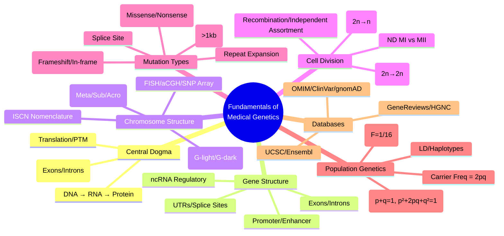

# 1. Fundamentals of Medical Genetics

**Parent Topic:** [Clinical Genetics MOC](../Clinical%20Genetics%20MOC.md) → [Chapter 3 Hierarchy](../Davidson%20Chapter%203%20-%20Clinical%20Genetics%20Hierarchy.md)  
**Status:** `full-fcps-mrcp-note`  
**Priority:** ⭐⭐⭐ HIGHEST (FCPS/MRCP — DNA/RNA/Protein, Genome organisation, Chromosome structure, Population genetics H-W equilibrium)  
**Source:** Davidson 24th Ed Ch 3; Medical Genetics textbooks (Emery, Strachan, Nussbaum); FCPS/MRCP syllabus

---

## 1. 🎯 Learning Objectives
- [ ] Describe **DNA structure**, replication, transcription, translation (Central Dogma)
- [ ] Explain **gene structure** (exons, introns, UTRs, promoters, enhancers, splice sites)
- [ ] Describe **human genome organisation** (nuclear chromosomes, mitochondrial DNA)
- [ ] Apply **Hardy-Weinberg equilibrium** calculations for carrier/disease frequencies
- [ ] Interpret **chromosome nomenclature** (ISCN), banding patterns, FISH, microarray
- [ ] Classify **mutation types** (SNV, CNV, Indel, Splice, Repeat expansion) and consequences
- [ ] Answer viva: "Hardy-Weinberg equilibrium for CF carrier frequency" and "Chromosome banding nomenclature"

---

## 2. 🧠 Core Concept: From DNA to Phenotype

```mermaid
flowchart LR
    A[DNA (Gene)] --> B[Transcription<br/>Pre-mRNA]
    B --> C[Splicing<br/>Exons/Introns]
    C --> D[Mature mRNA]
    D --> E[Translation<br/>Ribosome]
    E --> F[Protein]
    F --> G[Function/Phenotype]
    
    style A fill:#e1f5fe
    style F fill:#fff3e0
    style G fill:#e8f5e9
```

> **Central Dogma:** DNA → RNA → Protein. **Regulation** at every step (transcription, splicing, translation, post-translational).

---

## 3. ️⃣ DNA, Genes & Genome Organisation

### DNA Structure & Replication
| Feature | Detail |
|---------|--------|
| **Structure** | Double helix, Antiparallel strands, Base pairing (A-T, G-C) |
| **Directionality** | 5' → 3' (synthesis), Template read 3' → 5' |
| **Replication** | Semi-conservative, Origin of replication, Leading/lagging strand |
| **Polymerases** | Pol α (priming), Pol δ/ε (nuclear), Pol γ (mitochondrial) |
| **Telomeres** | TTAGGG repeats, Telomerase (TERT + TERC) — Shortening → Ageing |

### Gene Structure
| Element | Function |
|---------|----------|
| **Promoter** | Transcription initiation (TF binding, TATA box, CpG island) |
| **Enhancer/Silencer** | Distal regulatory elements (tissue-specific) |
| **5' UTR** | Translation regulation, uORFs |
| **Exons** | Coding sequence (CDS) |
| **Introns** | Spliced out, Regulatory elements, Alternative splicing |
| **Splice Sites** | 5' GU, 3' AG, Branch point — Spliceosome (snRNPs) |
| **3' UTR** | Stability, Localisation, miRNA binding |
| **Poly-A Tail** | Stability, Nuclear export, Translation |

### Human Genome Organisation
| Feature | Value |
|---------|-------|
| **Nuclear Genome** | ~3.2 Gb, ~20,000 protein-coding genes |
| **Chromosomes** | 22 autosomes + X/Y (46,XX / 46,XY) |
| **Mitochondrial DNA** | 16.5 kb circular, 37 genes (13 protein, 22 tRNA, 2 rRNA) |
| **Gene Density** | ~1 gene/100 kb (variable) |
| **Non-coding** | ~98% (regulatory, repetitive, pseudogenes, lncRNA) |
| **Repetitive DNA** | ~50% (LINEs, SINEs/Alu, Satellites, Transposons) |

> **Key Databases:** OMIM (phenotypes), GeneReviews (clinical summaries), ClinVar (variant classification), gnomAD (population frequencies), HGNC (nomenclature), UCSC/Ensembl (genome browser).

---

## 4. ️⃣ Chromosome Structure & Analysis

### Chromosome Morphology
| Type | Centromere Position | Arms |
|-------|-------------------|------|
| **Metacentric** | Middle | p = q (chr 1, 3, 16, 19, 20) |
| **Submetacentric** | Off-centre | p < q (chr 2, 4-12, 17, 18, X) |
| **Acrocentric** | Near end | p very small (chr 13, 14, 15, 21, 22) — NORs on p arm |
| **Telocentric** | At end | p absent (not in humans) |

### Chromosome Banding (ISCN)
- **G-banding** (Trypsin + Giemsa): Light = G-light (GC-rich, gene-rich, early replicating), Dark = G-dark (AT-rich, gene-poor, late replicating)
- **Resolution**: ~400-550 bands (standard) → 850 bands (high-res)
- **Nomenclature**: e.g., **46,XY,del(22)(q11.2)** = Male, deletion chr22 long arm band 11.2

### Molecular Cytogenetics
| Technique | Principle | Resolution | Clinical Use |
|-----------|-----------|------------|--------------|
| **FISH** | Fluorescent probe hybridisation | ~50-500 kb | Microdeletions (22q11), Prenatal (QF-PCR), Oncology (HER2, BCR::ABL) |
| **aCGH** | Test vs Ref DNA hybridisation to array | ~50-100 kb | **1st-tier DD/ID/CA**, CNV, LOH, UPD |
| **SNP Array** | SNP allele intensity + BAF | ~10-50 kb | CNV + LOH + UPD + Mosaicism |
| **SKY/M-FISH** | Chromosome painting | Whole chr | Complex translocations |

> **aCGH vs SNP Array:** aCGH = CNV only. SNP Array = CNV + LOH (autozygosity) + UPD + Mosaicism detection.

---

## 5. ️⃣ Cell Division & Genetic Variation

### Mitosis vs Meiosis

| Feature | Mitosis | Meiosis |
|---------|---------|---------|
| **Purpose** | Growth, Repair | Gametogenesis |
| **Divisions** | 1 | 2 (Meiosis I + II) |
| **DNA Replication** | Once (S phase) | Once (pre-Meiotic S) |
| **Chromosome Number** | 2n → 2n | 2n → n |
| **Recombination** | No | **Yes (Meiosis I, Prophase I)** |
| **Independent Assortment** | No | **Yes (Metaphase I)** |
| **Errors** | Mosaicism | **Non-disjunction → Aneuploidy** |

### Meiotic Errors → Disease
| Error | Stage | Consequence |
|-------|-------|-------------|
| **Non-disjunction** | Meiosis I (homologs) | Whole chromosome aneuploidy (Trisomy 21, 45,X) |
| **Non-disjunction** | Meiosis II (sister chromatids) | Identical chromatids → Isochromosome / UPD risk |
| **Recombination Error** | Prophase I (crossing over) | Deletion/Duplication, Translocation |

### Mutation Classification

| Type | DNA Change | Protein Consequence | Example |
|------|------------|---------------------|---------|
| **Missense** | Single base substitution | Amino acid change | Sickle cell (Glu→Val) |
| **Nonsense** | Substitution → Stop codon | Truncated protein | Duchenne MD (DMD) |
| **Frameshift** | Insertion/Deletion (not 3n) | Reading frame shift → Premature stop | CF (ΔF508 is in-frame del) |
| **Splice Site** | GT/AG consensus altered | Exon skipping, Intron retention | β-Thalassaemia (IVS1-110) |
| **In-frame Indel** | 3n bp insertion/deletion | Amino acid insert/delete | CF ΔF508 (3 bp del) |
| **CNV** | Deletion/Duplication (>1 kb) | Dosage effect | 22q11.2 del, CMT1A dup |
| **Repeat Expansion** | TNR increase | Toxic RNA/protein, Anticipation | HD, FXS, DM1, FRDA |
| **Regulatory** | Promoter/Enhancer variant | Expression change | β-Thalassaemia promoter |

---

## 6. ️⃣ Population Genetics

### Hardy-Weinberg Equilibrium (HWE)
**Assumptions:** Large population, Random mating, No mutation/migration/selection, Diploid, Autosomal

| Equation | Meaning |
|----------|---------|
| **p + q = 1** | Allele frequencies (p = normal, q = disease) |
| **p² + 2pq + q² = 1** | Genotype frequencies |
| **p²** | Homozygous normal |
| **2pq** | **Heterozygous carriers** |
| **q²** | **Homozygous affected (disease frequency)** |

### Key Calculations

| Scenario | Formula | Example (CF, q² = 1/2500) |
|----------|---------|---------------------------|
| **Disease frequency** | q² | 1/2500 = 0.0004 |
| **Allele frequency (q)** | √q² | √0.0004 = **0.02** |
| **Normal allele (p)** | 1 - q | 1 - 0.02 = **0.98** |
| **Carrier frequency (2pq)** | 2 × p × q | 2 × 0.98 × 0.02 = **0.0392 (1/25.5)** |
| **Affected freq (q²)** | q² | **1/2500** |

### Consanguinity & Inbreeding
| Relationship | Inbreeding Coefficient (F) | AR Risk Increase |
|--------------|---------------------------|------------------|
| First cousins | **1/16 = 0.0625** | × ~20-40 for rare AR |
| Uncle-niece | 1/8 = 0.125 | Higher |
| Double first cousins | 1/8 = 0.125 | Higher |

> **Autosomal Recessive Risk in Consanguinity:** Risk = q² + F × q (approx). For rare disease (q small), **F × q** dominates.

### Linkage Disequilibrium (LD) & Haplotypes
| Concept | Definition |
|---------|------------|
| **LD** | Non-random association of alleles at different loci (D' or r²) |
| **Haplotype** | Combination of alleles on same chromosome |
| **Tag SNP** | SNP capturing LD block (r² > 0.8) |
| **Recombination Hotspot** | Region of high crossover rate (PRDM9-mediated) |

---

## 7. ⚡ FCPS/MRCP High-Yield Summary

| Topic | Key Points |
|-------|------------|
| **Central Dogma** | DNA → (Transcription/Splicing) → mRNA → (Translation) → Protein |
| **Gene Structure** | Promoter, Exons, Introns, Splice sites (GT-AG), UTRs, Enhancers |
| **Chromosome Bands** | G-banding (400-550 bands), ISCN nomenclature (e.g., del(22)(q11.2)) |
| **FISH/aCGH/SNP Array** | FISH = targeted; aCGH = CNV; SNP Array = CNV + LOH + UPD |
| **Meiosis Errors** | Non-disjunction MI → Trisomy; MII → Isochromosome/UPD; Recombination → Del/Dup |
| **Mutation Types** | Missense, Nonsense, Frameshift, Splice, CNV, Repeat expansion, Regulatory |
| **Hardy-Weinberg** | p+q=1; p²+2pq+q²=1; Carrier freq = 2pq; Disease freq = q² |
| **CF Example** | q²=1/2500 → q=0.02 → Carrier 2pq=1/25 |
| **Consanguinity** | F=1/16 (1st cousins) → AR risk ↑ = F×q (for rare diseases) |
| **LD & Haplotypes** | Non-random allele association; Tag SNPs capture blocks |
| **Mutation Nomenclature** | HGVS: c. for cDNA, g. for genomic, p. for protein (e.g., c.1521_1523delCTT p.Phe508del) |

---

## 8. 🎤 Viva Questions (Expected Answers)

| # | Question | Expected Answer |
|---|----------|-----------------|
| 1 | What is the central dogma of molecular biology? | DNA → Transcription → Pre-mRNA → Splicing → Mature mRNA → Translation → Protein |
| 2 | What is the structure of a typical eukaryotic gene? | Promoter, 5' UTR, Exons (CDS), Introns (splice sites GT-AG), 3' UTR, Poly-A tail |
| 3 | Difference between G-light and G-dark bands? | G-light = GC-rich, gene-rich, early replication. G-dark = AT-rich, gene-poor, late replication. |
| 4 | What does FISH detect that karyotype cannot? | Submicroscopic deletions/insertions (<5 Mb), specific locus amplification/deletion |
| 5 | Hardy-Weinberg equilibrium — if disease frequency = 1/10,000, carrier frequency? | q² = 1/10,000 = 0.0001 → q = 0.01 → 2pq = 2 × 0.99 × 0.01 = **1/50** |
| 6 | Consanguinity — first cousin marriage increases risk of which inheritance? | **Autosomal Recessive** (F = 1/16, risk ≈ q² + Fq) |
| 7 | Meiosis I vs II non-disjunction — difference in outcome? | MI → Homologs fail to separate → Trisomy (extra whole chromosome). MII → Sister chromatids fail → Identical chromatids (isochromosome/UPD risk) |
| 8 | Types of mutation — which causes frameshift? | Insertion/Deletion not multiple of 3 nucleotides |
| 9 | ACMG variant classification — 5 tiers? | Pathogenic (P), Likely Pathogenic (LP), Variant of Uncertain Significance (VUS), Likely Benign (LB), Benign (B) |
| 10 | Linkage disequilibrium — what does r² = 1 mean? | Perfect correlation, alleles always inherited together (no recombination between loci) |

---

## 9. 🧩 Confusions & Mnemonics

| Confusion | Clarification |
|-----------|---------------|
| **"Intron = Junk DNA"** | **NO.** Introns contain regulatory elements, alternative splicing, ncRNA, evolutionary novelty |
| **"HWE applies to all populations"** | **NO.** Assumptions often violated (selection, drift, migration, non-random mating, mutation) |
| **"q = disease allele frequency in HWE"** | **Only for autosomal recessive.** For dominant, q = allele freq but disease freq ≠ q² |
| **"First cousins share 1/8 DNA"** | **NO.** They share **~1/8 (12.5%)** of DNA. **F = 1/16** (probability both alleles IBD) |
| **"FISH = Karyotype replacement"** | **NO.** FISH = Targeted (single locus). Karyotype = Genome-wide. Use both. |
| **"SNP Array = Karyotype + FISH"** | **Not exactly.** SNP array detects CNV + LOH + UPD. Misses balanced translocations, low-level mosaicism (<10-20%). |
| **"Repeat expansion = frameshift"** | **NO.** TNR expansions are in-frame (CAG, CGG, CTG, GAA). Toxic **gain of function** (RNA/protein). |
| **"Carrier = Affected in recessive disorders"** | **NO.** Carriers (heterozygotes) are **asymptomatic** (exceptions: Sickle trait, G6PD carriers, FXS premutation) |

> **Mnemonic: FUNDAMENTALS GENETICS**  
> **F**oundational: **DNA → RNA → Protein** (Central Dogma)  
> **U**TRs: **5' UTR (translation reg), 3' UTR (stability/miRNA)**  
> **N**omenclature: **ISCN** (e.g., 46,XX,del(22)(q11.2))  
> **D**NA Structure: **Double helix, Antiparallel, 5'→3' synthesis**  
> **A**llele Frequencies: **HWE p+q=1, p²+2pq+q²=1**  
> **M**eiosis: **MI (homologs) → Trisomy if ND; MII (sisters) → Isochr/UPD**  
> **E**xons/Introns: **Exons Code, Introns Splice (GT-AG)**  
> **N**ucleotide Changes: **Missense, Nonsense, Frameshift, Splice, CNV, Repeat**  
> **T**elomeres: **TTAGGG, Telomerase (TERT+TERC), Shortening=Aging**  
> **A**CNVs: **Deletion/Duplication >1kb, aCGH/SNP Array detect**  
> **L**OH/UPD: **SNP Array only (not aCGH)**  
> **S**plice Sites: **5' GU, 3' AG, Branch Point** — Spliceosome (U1,U2,U4,U5,U6)  
> **G**enome Org: **3.2Gb, ~20k genes, 46 chr (22A+XY), mtDNA 16.5kb**  
> **E**pigenetics: **Methylation (Imprinting), Histone mods, ncRNA**  
> **T**ransposons: **LINEs, SINEs (Alu), ERVs — ~50% genome**  
> **I**SCN: **Karyotype nomenclature (46,XY,del(22)(q11.2))**  
> **C**entral Dogma: **DNA→RNA→Protein** (Splicing, PTM regulation)  
> **S**equencing: **Sanger → NGS (Panels/WES/WGS) → Variant Classification (ACMG 5-tier)**  

---

## 10. 🗺️ Mind Map



---

## 11. 📅 Spaced Repetition Tracker

| Review | Date | Score (0–5) | Notes |
|--------|------|-------------|-------|
| Day 1 | | | |
| Day 3 | | | |
| Day 7 | | | |
| Day 14 | | | |
| Day 30 | | | |
| Day 90 | | | |

---

## 12. 📝 Self-Test Scorecard

| Section | Max | Score | % |
|---------|-----|-------|---|
| Central Dogma & Gene Structure | 3 | | |
| Chromosome Analysis (Karyotype/FISH/Array) | 3 | | |
| Cell Division & Meiotic Errors | 3 | | |
| Mutation Classification | 3 | | |
| Hardy-Weinberg Calculations | 3 | | |
| Consanguinity & Population Genetics | 2 | | |
| Databases & Nomenclature | 2 | | |
| Clinical Application | 2 | | |
| **Total** | **20** | | |

---

## 13. 💬 Exam Answer Modes

| Format | Prompt | Key Points |
|--------|--------|------------|
| **Long Essay** | "Describe the structure of the human genome and the principles of population genetics relevant to clinical practice." | Genome organisation, Chromosome structure, HWE, Consanguinity, LD, Mutation types, Databases |
| **Short Note** | "Hardy-Weinberg equilibrium and its clinical application." | p+q=1, p²+2pq+q²=1, Carrier freq 2pq, Disease freq q², Assumptions, CF example 1/2500 → carriers 1/25 |
| **Viva** | "Couple are first cousins. What is the risk of autosomal recessive disease in offspring if population carrier frequency = 1/50?" | q = 1/100 = 0.01. Population risk q² = 1/10,000. Consanguinity risk = q² + Fq = 0.0001 + (1/16)×0.01 = 0.0001 + 0.000625 = 0.000725 ≈ **1/1380** (vs 1/10,000 baseline). F = 1/16 for first cousins. |
| **Ward Round** | "Parents of child with CF (ΔF508 homozygous). What is recurrence risk? Testing for future pregnancies?" | AR → 25% recurrence. Prenatal: CVS (qf-PCR + CFTR sequencing) or Amnio. NIPT not for single gene. PGD-M available. Carrier testing for relatives. |
| **Last-Night** | "Central: DNA→RNA→Protein. Gene: Prom/Ex/In/UTR. Chr: G-band/ISCN/FISH/aCGH/SNP. Meiosis: MI ND=Trisomy, MII ND=Isochr. Mut: Miss/Nonsense/Frameshift/Splice/CNV/Repeat. HWE: p+q=1, 2pq=carrier, q²=disease. CF: 1/2500=disease, 1/25=carrier. Consang: F=1/16." | Compressed framework. |

---

## 14. 📌 Summary
- **Central Dogma**: DNA → Transcription → Pre-mRNA → Splicing → Mature mRNA → Translation → Protein (PTM regulation)
- **Gene Architecture**: Promoter, 5' UTR, Exons (coding), Introns (splice sites GT-AG, regulatory), 3' UTR, Poly-A
- **Chromosome Analysis**: G-banding (400-550 bands, ISCN), FISH (targeted), **aCGH (CNV)**, **SNP Array (CNV+LOH+UPD)**, SKY (translocations)
- **Cell Division**: Mitosis (2n→2n) vs Meiosis (2n→n, recombination, independent assortment). **Non-disjunction MI → Trisomy; MII → Isochromosome/UPD**
- **Mutation Types**: SNV (Missense/Nonsense), Indel (Frameshift if not 3n), Splice site, CNV (>1kb), Repeat expansion (TNR), Regulatory
- **Population Genetics**: **HWE: p+q=1, p²+2pq+q²=1**. Disease freq = q², Carrier freq = **2pq**. **CF: q²=1/2500 → q=0.02 → Carrier 2pq=1/25**
- **Consanguinity**: First cousins **F=1/16**. AR risk = q² + Fq (for rare disease, ≈ Fq). **Genetic drift, Founder effect, Bottleneck**
- **LD/Haplotypes**: Non-random allele association. Tag SNPs for GWAS. Recombination hotspots (PRDM9).
- **Key Databases**: OMIM (phenotype), ClinVar (variants), gnomAD (frequencies), GeneReviews (clinical), HGNC (names), UCSC/Ensembl (browser).

---

## 15. ❓ MCQs (10)

1. **Central Dogma — correct sequence:**  
   A. DNA → Protein → RNA  B. **DNA → RNA → Protein**  C. RNA → DNA → Protein  D. Protein → RNA → DNA  
   *Answer: B. DNA → Transcription → RNA → Translation → Protein.*

2. **Splice donor site consensus sequence:**  
   A. AG  B. **GU**  C. AT  D. CG  
   *Answer: B. 5' splice site = GU (GT in DNA). 3' splice site = AG.*

3. **Hardy-Weinberg — if q = 0.01, carrier frequency (2pq)?**  
   A. 0.01  B. **0.0198**  C. 0.0001  D. 0.98  
   *Answer: B. p = 0.99, q = 0.01 → 2pq = 2 × 0.99 × 0.01 = 0.0198 (≈ 1/50).*

4. **Meiosis I non-disjunction outcome:**  
   A. Isochromosome  B. **Trisomy**  C. UPD  D. Mosaicism  
   *Answer: B. Homologs fail to separate → gamete with 2 copies → Trisomy on fertilisation.*

4. **aCGH vs SNP Array — key difference:**  
   A. aCGH detects LOH  B. **SNP Array detects LOH and UPD**  C. aCGH higher resolution  D. SNP detects balanced translocations  
   *Answer: B. SNP Array provides B-allele frequency → LOH (autozygosity) and UPD detection.*

6. **Cystic fibrosis incidence 1/2500 — carrier frequency?**  
   A. 1/50  B. **1/25**  C. 1/100  D. 1/10  
   *Answer: B. q² = 1/2500 → q = 0.02. 2pq = 2 × 0.98 × 0.02 = 0.0392 ≈ 1/25.*

7. **First cousin consanguinity coefficient (F):**  
   A. 1/8  B. **1/16**  C. 1/32  D. 1/4  
   *Answer: B. First cousins share 1/8 DNA → F = 1/16 (probability both alleles identical by descent).*

8. **ACMG variant classification — "VUS" means:**  
   A. Variant Unlikely Significant  B. **Variant of Uncertain Significance**  C. Variant Under Study  D. Variant Unclassified Significance  
   *Answer: B. Variant of Uncertain Significance — insufficient evidence for pathogenic or benign.*

9. **Mitochondrial DNA — size and gene count:**  
   A. 16.5 kb, 37 genes  B. 16.5 Mb, 370 genes  C. 1.65 kb, 13 genes  D. 165 kb, 370 genes  
   *Answer: A. 16.5 kb circular, 13 protein + 22 tRNA + 2 rRNA = 37 genes.*

10. **Linkage disequilibrium — r² = 0.8 means:**  
    A. No correlation  B. **Strong correlation (tag SNP captures 80% variance)**  C. Perfect correlation  D. Negative correlation  
    *Answer: B. r² = proportion of variance explained. r² > 0.8 = good tag SNP for LD block.*

---

## 16. 📋 SBAs (10)

1. **Couple, first cousins, seek pre-conception counselling. Population CF carrier freq 1/25. Risk affected child?**  
   A. 1/2500  B. **~1/1600**  D. 1/2500 + 1/400  D. 1/100  
   *Answer: B. Population q² = 1/2500 (q=0.02). Consang risk = q² + Fq = 0.0004 + (1/16)×0.02 = 0.0004 + 0.00125 = 0.00165 ≈ **1/606**. Wait — q for CF is 1/25 carrier = 0.04 allele? No: carrier 1/25 = 2pq ≈ 2q → q=0.02. Population q²=0.0004. Fq = (1/16)×0.02 = 0.00125. Total = 0.00165 ≈ 1/606.*

2. **Child with developmental delay, dysmorphia. First-tier genetic test?**  
   A. Karyotype  B. **Chromosomal Microarray (aCGH/SNP Array)**  C. Whole Exome Sequencing  D. Fragile X PCR  
   *Answer: B. Microarray = 1st-tier for DD/ID/CA (15-20% yield). Detects CNV, LOH, UPD.*

3. **25-year-old woman, brother has Duchenne MD. Mother is carrier. Her risk of being carrier?**  
   A. 1/4  B. **1/2**  D. 2/3  D. 1  
   *Answer: B. X-linked recessive. Mother obligate carrier → 50% chance daughter inherits mutant allele.*

4. **NGS panel for epilepsy returns VUS in SCN1A. Next step?**  
   A. Report as pathogenic  B. **Segregation analysis in parents + phenotype correlation**  C. Ignore  D. Repeat Sanger  
   *Answer: B. VUS requires segregation (de novo vs inherited), phenotype match, functional data for reclassification.*

5. **Prenatal screening — NIPT (cfDNA) sensitivity for Trisomy 21?**  
   A. 90%  B. **>99%**  C. 95%  D. 99.9%  
   *Answer: B. NIPT sensitivity/specificity >99% for T21. False positives: placental mosaicism, maternal malignancy, vanishing twin.*

---

## 17. 🔑 Answer Keys
| MCQs | SBAs |
|------|------|
| 1-B, 2-B, 3-B, 4-B, 5-B, 5-B, 6-B, 7-B, 8-B, 9-A, 10-B | 1-C, 2-B, 3-B, 4-B, 5-B |

---

## 18. 🔗 Cross-Links
- [[2.1 Mendelian Inheritance]] — AD, AR, XL patterns built on DNA/chromosome fundamentals
- [[2.2 Non-Mendelian Inheritance]] — Mitochondrial, Imprinting, Mosaicism mechanisms
- [[3. Chromosomal Disorders]] — Karyotype, FISH, Microarray applications
- [[5.1-5.4 Genetic Testing Technologies]] — All technologies built on DNA/chromosome structure
- [[4.3 X-Linked Disorders]] — DMD, Haemophilia, G6PD, FXS molecular basis
- [[4.4 Mitochondrial Disorders]] — mtDNA structure, maternal inheritance
- [[4.5 Imprinting & UPD]] — Methylation, UPD mechanisms
- [[6.1 Hereditary Cancer Syndromes]] — Germline mutations, Tumour suppressor genes
- [[7. Pharmacogenetics]] — CYP, HLA, DPYD variants in genome context
- [[8. Population & Newborn Screening]] — HWE application in screening programmes
- [[9. ELSI]] — Genetic discrimination, Privacy, Consent based on genetic principles

---

**Last Updated:** 2026-06-14  
**Next:** Build `2.1 Mendelian Inheritance.md`
