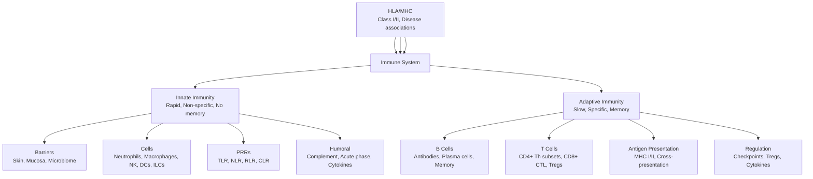

**Parent Topic:** [Clinical Immunology MOC](../Clinical%20Immunology%20MOC.md) → [Chapter 4 Hierarchy](../Davidson%20Chapter%204%20-%20Clinical%20Immunology%20Hierarchy.md)
**Status:** `full-fcps-mrcp-note`
**Priority:** ⭐⭐⭐ HIGHEST (FCPS/MRCP — Innate/Adaptive immunity, Complement, Cytokines, HLA, Immunological techniques)
**Source:** Davidson 24th Ed Ch 4; Abbas, Lichtman, Pillai; Abbas, Abbas; Janeway; FCPS/MRCP syllabus

---

## 1. 1. 🎯 Learning Objectives
- [ ] Describe **innate immunity** components: barriers, cells, PRRs, complement, cytokines
- [ ] Explain **adaptive immunity**: B/T cell development, activation, memory, regulation
- [ ] Understand **complement system**: 3 pathways, regulation, deficiencies
- [ ] Apply **cytokine classification** and signalling (JAK-STAT)
- [ ] Describe **HLA/MHC** structure, expression, disease associations
- [ ] Apply **immunological techniques**: Flow cytometry, ELISA, HLA typing, PCR
- [ ] Answer viva: "Innate vs adaptive immunity" and "Complement pathways"

---

## 2. 2. 🧠 Core Concept: Immune System Overview



---

## 3. 3. ️⃣ Innate Immunity

### 1. Physical & Chemical Barriers
| Barrier | Mechanism | Clinical Relevance |
|---------|-----------|-------------------|
| **Skin** | Keratin, low pH, antimicrobial peptides (defensins, cathelicidins) | Breach → Infection |
| **Mucosal** | Mucus, ciliary clearance, IgA, lysozyme, lactoferrin | Respiratory, GI, GU defence |
| **Microbiome** | Colonisation resistance, SCFA, immune training | Dysbiosis → IBD, C. diff |
| **Chemical** | Low pH (stomach, vagina), surfactant, surfactants | Barrier breach → Infection |

### 2. Cellular Components
| Cell Type | Origin | Key Functions | Surface Markers | Clinical Relevance |
|-----------|--------|---------------|-----------------|-------------------|
| **Neutrophils** | Myeloid | Phagocytosis, NETs, ROS, degranulation | CD15+, CD16+, CD66b+ | Neutropenia → sepsis; CGD, LAD |
| **Monocytes/Macrophages** | Myeloid | Phagocytosis, Ag presentation, cytokine production | CD14+, CD68+, HLA-DR+ | Tissue-specific (Kupffer, Microglia, Alveolar) |
| **Dendritic Cells (DCs)** | Myeloid/Lymphoid | Professional APC, T cell priming | CD11c+, HLA-DR+, CD80/86 | Migration to LNs, Cross-presentation |
| **Natural Killer (NK)** | Lymphoid | Cytotoxicity (missing self), ADCC, cytokines | CD56+, CD16+, KIRs | Missing self, ADCC, KIR mismatch |
| **Innate Lymphoid Cells (ILCs)** | Lymphoid | ILC1 (IFN-γ), ILC2 (IL-5/13), ILC3 (IL-17/22) | Lineage-, CD127+ | Mucosal immunity, tissue repair |
| **Mast Cells** | Myeloid | IgE-mediated degranulation, histamine | FcεRI+, c-Kit+ | Anaphylaxis, allergy |
| **Basophils/Eosinophils** | Myeloid | Parasite defence, allergy | FcεRI+, CCR3+ | Parasites, asthma, drug reactions |

### 3. Inflammatory Response
| Phase | Key Events | Mediators | Clinical Relevance |
|-------|------------|-----------|-------------------|
| **Recognition** | PRR-PAMP binding, DAMP release | — | Initial detection |
| **Vasodilation** | Histamine, PGD2, LTB4, NO | Mast cells, Macrophages | Heat, redness, swelling |
| **Cellular Recruitment** | Chemokines (CXCL8, CCL2), Adhesion molecules | Endothelium, Neutrophils | Neutrophilia, Pus formation |
| **Phagocytosis** | Opsonisation (IgG, C3b), FcγR/CR engagement | Neutrophils, Macrophages | Pathogen clearance |
| **Resolution** | Lipoxins, Resolvins, Protectins, Annexin A1 | Macrophages, Neutrophils | Return to homeostasis, Anti-inflammatory |

|### Pattern Recognition Receptors (PRRs)
| PRR Family | Location | Ligands | Signalling | Clinical Relevance |
|------------|----------|---------|------------|-------------------|
| **TLRs** (1-10) | Surface/Endosomal | PAMPs (LPS, flagellin, CpG, ssRNA, dsRNA) | MyD88/TRIF → NF-κB | Sepsis, vaccine adjuvants |
| **NLRs** (NOD1/2, NLRP3) | Cytosol | Peptidoglycan, crystals, ATP | Inflammasome (caspase-1) | CAPS (NLRP3), Crohn's (NOD2) |
| **RLRs** (RIG-I, MDA5) | Cytosol | Viral RNA (dsRNA, 5'ppp) | MAVS → IFN-α/β | Antiviral immunity |
| **CLRs** (Dectin-1, Mincle) | Surface | Fungal β-glucans, mycobacteria | Syk/CARD9 | Fungal immunity, CARD9 deficiency |
| **cGAS-STING** | Cytosol | Cytosolic DNA | STING → IFN-β | Autoimmune (SAVI), DNA viruses |

### 4. Complement System
| Pathway | Trigger | Key Components | Regulation | Clinical Relevance |
|---------|---------|----------------|------------|-------------------|
| **Classical** | Ab-Ag complexes (IgG/IgM) | C1q, C1r, C1s → C4, C2 | C1-INH, C4BP | SLE (C1q/C4/C2), Immune complexes |
| **Lectin** | MBL/Ficolins on pathogens | MASP-1/2 → C4, C2 | C1-INH | MBL deficiency → infections |
| **Alternative** | Spontaneous C3 hydrolysis | Factor B, D, Properdin → C3bBb | Factor H, I, CD55, CD46, CD59 | aHUS (FH, FI, MCP), C3G, C3GN |
| **Common Terminal** | C5 convertase | C5b-9 (MAC) | CD59, Vitronectin, Clusterin | PNH (CD55/59), aHUS, C5 inhibitors |

| Component | Deficiency Syndrome | Key Features |
|-----------|-------------------|--------------|
| **C1q, C1r, C1s, C4, C2** | Classical pathway | SLE-like, recurrent infections |
| **C3** | Central | Severe recurrent pyogenic infections |
| **C5, C6, C7, C8, C9** | Terminal (MAC) | **Neisserial infections** (meningitis) |
| **Factor H, I, MCP (CD46)** | Alternative (Regulatory) | aHUS, C3G, C3GN |
| **C1-INH** | C1-INH deficiency | Hereditary angioedema (HAE) |
| **Properdin** | Alternative (Positive) | Neisserial infections |
| **MBL** | Lectin | Recurrent infections, especially childhood |

> **Key:** mbL (Mannose-Binding Lectin) deficiency → recurrent infections in children; C1-INH deficiency → HAE (C4 low, C1q normal)

### 5. Acute Phase Proteins & Cytokines
| Acute Phase Protein | Inducer | Function | Clinical Use |
|---------------------|---------|----------|--------------|
| **CRP** | IL-6 | Opsonisation, complement activation | Inflammation marker |
| **Serum Amyloid A (SAA)** | IL-6, TNF-α | HDL modulation, chemotaxis | Inflammation, amyloidosis |
| **Fibrinogen** | IL-6 | Coagulation, wound healing | ESR, thrombosis risk |
| **Ferritin** | IL-1, IL-6 | Iron sequestration | Inflammation, HLH, Still's |
| **Procalcitonin** | Bacterial toxins | Sepsis marker | Sepsis diagnosis |
| **Hepcidin** | IL-6 | Iron restriction | Anaemia of chronic disease |

| Cytokine Family | Key Members | Signalling | Key Functions |
|----------------|-------------|------------|---------------|
| **Type I IFNs** | IFN-α, IFN-β | JAK1/TYK2-STAT1/2 | Antiviral, MHC upreg |
| **Type II IFN** | IFN-γ | JAK1/2-STAT1 | Macrophage activation, Th1 |
| **IL-1 Family** | IL-1α, IL-1β, IL-18, IL-33 | MyD88 → NF-κB | Inflammation, fever, Th17 |
| **TNF Family** | TNF-α, LT-α, LT-β, BAFF, APRIL | TNFR → NF-κB | Inflammation, lymphoid organogenesis |
| **IL-6 Family** | IL-6, IL-11, OSM, LIF | JAK-STAT3 | Acute phase, B cell diff, Th17 |
| **IL-12 Family** | IL-12, IL-23, IL-27, IL-35 | STAT3/4 | Th1 (IL-12), Th17 (IL-23), Treg (IL-27) |
| **IL-17 Family** | IL-17A-F | ACT1 → NF-κB | Neutrophil recruitment, mucosal immunity |
| **Chemokines** | CCL, CXCL, CX3CL, XCL | GPCR | Leukocyte trafficking |
| **Type 2** | IL-4, IL-5, IL-13 | STAT6 | Th2, allergy, helminths, IgE |
| **Regulatory** | IL-10, TGF-β | STAT3, SMAD | Suppression, Treg, tolerance |

### 6. JAK-STAT Signalling
| Cytokine Receptor | JAKs | STATs | Clinical Relevance |
|-------------------|------|-------|-------------------|
| **Type I IFN R** | JAK1/TYK2 | STAT1/2 | Antiviral, SLE (IFN signature) |
| **IFN-γ R** | JAK1/2 | STAT1 | MSMD, TB susceptibility |
| **IL-6 R** | JAK1/2 | STAT3 | Hyper-IgE, Castleman, tocilizumab |
| **IL-12/23 R** | JAK2/TYK2 | STAT3/4 | Th1/Th17, ustekinumab |
| **IL-6/GP130** | JAK1/2/TYK2 | STAT3 | Tocilizumab, sarilumab |
| **JAK2 V617F** | — | Constitutive | MPN (PV, ET, MF) |
| **JAK Inhibitors** | Tofacitinib (JAK1/3), Baricitinib (JAK1/2), Upadacitinib (JAK1), Filgotinib (JAK1) | RA, PsA, UC, AD, Alopecia |

---

## 4. 4. ️⃣ Adaptive Immunity

### 1. B Cell Development & Humoral Immunity
| Stage | Location | Key Events | Markers | Clinical Relevance |
|-------|----------|------------|---------|-------------------|
| **Pro-B** | Bone Marrow | D-J rearrangement | CD19+, CD43+, TdT+ | Pre-BCR checkpoint |
| **Pre-B** | Bone Marrow | V-DJ rearrangement, μ heavy chain | CD19+, CD20-, μ+ | Pre-BCR checkpoint |
| **Immature B** | Bone Marrow | IgM expression, negative selection | IgM+, IgD- | Central tolerance |
| **Transitional** | Spleen | Peripheral selection | IgMhi, IgD+ | BAFF-R, transitional |
| **Mature Naive** | Spleen/LN | IgM+IgD+, recirculation | IgM+, IgD+, CD21+, CD23+ | FO B vs MZ B |
| **Germinal Centre** | Lymph Node | SHM, CSR, Affinity maturation | BCL6+, AID+, GL7+ | SHM/CSR defects → Hyper-IgM |
| **Memory B** | Spleen/LN/BM | Long-lived, rapid response | CD27+, IgG/IgA/IgE | Vaccine memory |
| **Plasma Cell** | BM/Spleen/LN | Antibody factory | CD138+, Blimp-1+, XBP-1+ | Antibody secretion |

### 2. Immunoglobulin Structure & Function
| Isotype | Heavy Chain | Structure | Half-life | Key Functions | Clinical Relevance |
|---------|-------------|-----------|-----------|---------------|-------------------|
| **IgG** | γ | Monomer | 21-28 days | Opsonisation, complement, ADCC, placental transfer | IVIG, HDFN, subclass deficiency |
| **IgM** | μ | Pentamer (J chain) | 5 days | First response, complement activation | Early infection, cryoglobulins |
| **IgA** | α | Dimer (secretory) | 6 days | Mucosal immunity (SIgA) | Secretory IgA, IgA nephropathy |
| **IgE** | ε | Monomer | 2 days | Mast cell/basophil activation, parasites | Allergy, helminths, IgE myeloma |
| **IgD** | δ | Monomer | 3 days | BCR, unknown | IgD myeloma, hyper-IgD syndrome |

### 3. B Cell Activation & Class Switching
| Signal | Source | Molecule | Outcome |
|--------|--------|----------|---------|
| **Signal 1** | Antigen | BCR (mIg) | Antigen internalisation |
| **Signal 2** | T cell (CD4+) | CD40L-CD40 | Activation, proliferation, CSR |
| **Cytokines** | Tfh | IL-4, IL-21, IFN-γ, TGF-β | **CSR direction** |
| **AID** | — | Activation-induced deaminase | SHM + CSR enzyme |

| Cytokine | CSR Target | Antibody Class |
|----------|------------|----------------|
| **IL-4, IL-13** | ε, γ1 | IgE, IgG1 |
| **IFN-γ** | γ2a (γ3 human) | IgG2a (IgG3) |
| **TGF-β + IL-4** | ε | IgE |
| **TGF-β** | α | IgA |

### 4. T Cell Development & Cell-Mediated Immunity
| Stage | Location | Key Events | Markers | Clinical Relevance |
|-------|----------|------------|---------|-------------------|
| **DN1-4** | Thymus (Cortex) | TCR β/α rearrangement, β-selection | CD4-, CD8-, CD44, CD25 | β-selection (pre-TCR) |
| **DP (CD4+CD8+)** | Thymus (Cortex) | Positive selection (MHC I/II) | CD4+CD8+, TCRlo | MHC restriction |
| **SP (CD4+ or CD8+)** | Thymus (Medulla) | Negative selection (AIRE) | CD4+ or CD8+, TCRhi | Central tolerance |
| **Naive T** | Periphery | Homeostasis (IL-7, TCR tonic) | CD45RA+, CCR7+, CD62L+ | Recent thymic emigrants |
| **Effector** | Periphery | Activation, differentiation | CD45RO+, CCR7-, Effector molecules | Th1/Th2/Th17/Tfh/Treg |
| **Memory** | Periphery | Long-lived, rapid recall | CD45RO+, CCR7±, CD127+ | Central (Tcm) vs Effector (Tem) |

### 5. T Cell Subsets (CD4+ Th)
| Subset | Master Transcription Factor | Signature Cytokines | Function | Key Inducers | Pathology |
|--------|----------------------------|---------------------|----------|--------------|-----------|
| **Th1** | T-bet | IFN-γ, TNF-α, IL-2 | Intracellular pathogens, macrophage activation | IL-12, IFN-γ | Autoimmunity (RA, MS), TB |
| **Th2** | GATA3 | IL-4, IL-5, IL-13 | Helminths, allergy, IgE | IL-4, TSLP | Allergy, asthma, helminths |
| **Th17** | RORγt | IL-17A/F, IL-21, IL-22 | Extracellular bacteria/fungi, mucosal immunity | IL-6, TGF-β, IL-23, IL-1β | Psoriasis, IBD, autoimmune |
| **Tfh** | Bcl-6 | IL-21, CXCL13 | B cell help, GC formation | ICOS, IL-6, IL-21 | Autoimmunity, GC reactions |
| **Treg** | FoxP3 | IL-10, TGF-β, IL-35 | Suppression, tolerance | TGF-β, IL-2 | IPEX (FoxP3 mut), cancer |
| **Tr1** | — | IL-10 | Suppression, tolerance | IL-10, IL-27 | Tolerance |
| **Th9** | PU.1/IRF4 | IL-9 | Helminths, allergy | TGF-β + IL-4 | Allergy, asthma |

### 6. CD8+ Cytotoxic T Lymphocytes (CTL)
| Feature | Detail |
|---------|--------|
| **Recognition** | Peptide-MHC I (endogenous antigens) |
| **Effector** | Perforin, Granzymes, FasL, IFN-γ, TNF-α |
| **Memory** | TEM (effector), TCM (central), TRM (tissue-resident) |
| **Exhaustion** | PD-1, TIM-3, LAG-3, TIGIT, TOX (chronic infection, cancer) |
| **Cross-presentation** | DCs present exogenous Ag on MHC I → CD8+ priming |

### 7. Immunological Memory
| Feature | B Cell Memory | T Cell Memory |
|---------|---------------|---------------|
| **Longevity** | Decades (LLPC in BM) | Years-decades |
| **Recall** | Rapid Ab (days) | Rapid expansion (days) |
| **Subsets** | MBC, LLPC | Tcm (CCR7+), Tem (CCR7-), Trm (tissue) |
| **Recall Response** | Higher affinity, faster, more Ab | Faster proliferation, effector function |
| **Vaccines** | Booster induces GC reaction | Prime-boost expands memory |

---

## 5. 5. ️⃣ Antigen Presentation & MHC/HLA

### 1. MHC Class I vs II
| Feature | MHC Class I | MHC Class II |
|---------|-------------|--------------|
| **Genes** | HLA-A, -B, -C (Class Ia); E, F, G (Class Ib) | HLA-DP, -DQ, -DR (Class II) |
| **Structure** | α chain (HLA) + β2-microglobulin | α + β chains (both polymorphic) |
| **Expression** | All nucleated cells | APCs (DC, Mac, B), Thymus, Activated T |
| **Peptide Source** | Endogenous (cytosolic) | Exogenous (phagocytosed) |
| **Peptide Length** | 8-10 aa | 13-25 aa |
| **Binding Groove** | Closed ends | Open ends |
| **TCR Restriction** | CD8+ T cells | CD4+ T cells |
| **Cross-presentation** | DCs: Exogenous → MHC I | — |

### 2. Antigen Processing Pathways
| Pathway | Source | Processing | Loading | MHC |
|---------|--------|------------|---------|-----|
| **Class I (Endogenous)** | Cytosolic proteins | Proteasome → TAP → ER | Chaperones (Calnexin, Tapasin) | MHC I |
| **Class II (Exogenous)** | Phagocytosed/Endocytosed | Endosome/Lysosome → CLIP exchange | HLA-DM (CLIP exchange) | MHC II |
| **Cross-presentation** | Exogenous (dead cells) | Phagosome → Cytosol → Proteasome → TAP → ER | Same as Class I | MHC I |

### 3. HLA Disease Associations (High-Yield)
| HLA Allele | Disease | Odds Ratio | Population |
|------------|---------|-----------|------------|
| **HLA-B27** | Ankylosing Spondylitis | >100 | Strongest HLA association |
| | Reactive Arthritis | High | |
| | Acute Anterior Uveitis | High | |
| **HLA-DR3 (DRB1*03)** | SLE, T1DM, Autoimmune Hepatitis, Coeliac (DQ2) | 2-5 | European |
| **HLA-DR4 (DRB1*04)** | RA (SE), T1DM | 3-5 | SE (QKRAA) |
| **HLA-DQ2 (DQA1*05:DQB1*02)** | Coeliac Disease | >10 | 90-95% DQ2+ |
| **HLA-DQ8 (DQA1*03:DQB1*0302)** | Coeliac, T1DM | High | |
| **HLA-B51** | Behçet's Disease | High | Mediterranean, Asian |
| **HLA-B57:01** | Abacavir Hypersensitivity | >1000 | Screening required |
| **HLA-B*15:02** | Carbamazepine SJS/TEN | >100 | Han Chinese, Thai, Malaysian |
| **HLA-B*58:01** | Allopurinol SJS/TEN/DRESS | >100 | Han Chinese, Korean, Thai |
|| **HLA-DR15 (DRB1*15:01)** | MS, Narcolepsy | 3-5 | European |
|| **HLA-DR2 (DRB1*15:01)** | MS, Goodpasture | High | |
|| **HLA-DR4 (DRB1*04:01/04)** | RA (Shared Epitope) | 3-5 | SE motif QKRAA |

---

## 6. 6. 3 Immune System Development & Ageing

### 1. Primary & Secondary Lymphoid Organs
| Organ | Type | Key Function | Clinical Relevance |
|-------|------|--------------|-------------------|
| **Bone Marrow** | Primary | Haematopoiesis, B cell development | Aplastic anaemia, Leukaemia, B cell PID |
| **Thymus** | Primary | T cell maturation, Central tolerance | DiGeorge syndrome, Thymoma, Myasthenia gravis |
| **Lymph Nodes** | Secondary | Antigen trapping, T/B cell activation | Lymphadenopathy, Lymphoma, Sentinel node biopsy |
| **Spleen** | Secondary | Blood filtration, Encapsulated bacteria clearance | Splenectomy → OPSI, ITP, Hereditary spherocytosis |
| **MALT/GALT** | Secondary | Mucosal immunity, IgA production | IBD, Coeliac, IgA nephropathy |
| **Tonsils/Adenoids** | Secondary | Upper respiratory immune surveillance | Tonsillitis, Adenoid hypertrophy |

### 2. Thymic Involution & Immunosenescence
| Feature | Mechanism | Clinical Consequence |
|---------|-----------|---------------------|
| **Thymic Involution** | Fatty replacement from puberty; ↓ 3% per year after puberty | ↓ Naive T cell output, ↓ TCR diversity |
| **T Cell Changes** | ↓ CD45RA+ naive, ↑ CD45RO+ memory, ↓ CD28, ↑ Senescent (CD57+, KLRG1+), ↑ Tregs | ↓ Response to novel pathogens/vaccines, ↑ Latent virus reactivation (VZV, CMV) |
| **B Cell Changes** | ↓ Naive B cells, ↓ Class switch recombination, ↓ SHM | ↓ Vaccine response (lower affinity/avidity), ↓ New antigen response |
| **Innate Dysfunction** | Neutrophil chemotaxis/phagocytosis ↓, Macrophage dysfunction, ↓ NK cytotoxicity | ↑ Bacterial/fungal infections, ↓ Tumour surveillance |
| **Inflammageing** | Chronic low-grade inflammation (↑ IL-6, TNF-α, CRP, IL-1β, IFN-γ) | Frailty, Sarcopenia, Atherosclerosis, Neurodegeneration, Insulin resistance, Cancer |
| **CMV Seropositivity** | Accelerates immunosenescence — massive CMV-specific T cell expansions (memory inflation) | ↑ Mortality, ↓ Vaccine response, ↑ Frailty |

### 3. Neonatal Immunity
| Component | Characteristic | Clinical Relevance |
|-----------|----------------|-------------------|
| **Passive Immunity** | Transplacental IgG (peaks at 40w); Breast milk IgA | Protection until 6-12 months; Wanes → PID presentation |
| **Innate Immunity** | ↓ Neutrophil chemotaxis/ROS; ↓ Complement (C3 30-60% adult); ↓ NK cytotoxicity | ↑ Sepsis risk (GBS, E. coli, Listeria) |
| **Adaptive Immunity** | ↓ Naive T cells; Th2-skewed; ↓ IgG2/IgG4; ↓ Memory | ↑ Intracellular infections; Poor polysaccharide vaccine response |
| **Vaccination** | BCG, Hep B at birth; Delayed live vaccines if immunocompromised | Maternal antibodies interfere with measles <12m |

---

## 7. 7. ️⃣ Immunological Techniques

### 1. Flow Cytometry & Immunophenotyping
| Application | Markers | Clinical Use |
|-------------|---------|--------------|
| **T/B/NK** | CD3, CD4, CD8, CD19, CD56, CD16 | Lymphocyte subsets, PID (XLA, SCID) |
| **Activation** | CD25, CD69, HLA-DR, CD38 | Activation, HLH, activation syndromes |
| **Memory** | CD45RA/RO, CCR7, CD27, CD28 | Naive vs Memory (Tcm vs Tem) |
| **Treg** | CD4+CD25hiCD127loFoxP3+ | IPEX, Treg defects |
| **B cell subsets** | CD19, CD20, CD27, IgD, IgM, CD38, CD24 | CVID, XLA, Transitional, Memory |
| **Plasma cells** | CD138, CD38, CD19- | Myeloma, Plasmablasts |
| **Intracellular cytokines** | IFN-γ, IL-4, IL-17, TNF-α (PMA/Ionomycin) | Th1/Th2/Th17, TB (IGRA) |

### 2. Serological Assays
| Assay | Principle | Applications |
|-------|-----------|--------------|
| **ELISA** | Ag-Ab + Enzyme → Colour | Autoantibodies, Hormones, Infectious serology |
| **ELISA (Capture/Sandwich)** | Capture Ab + Ag + Detection Ab | Cytokines, Hormones, Antigens |
| **Western Blot** | SDS-PAGE + Transfer + Ab | HIV confirm, Lyme, Paraneoplastic |
| **Immunofluorescence (IIF)** | Ab + Fluorochrome on substrate | ANA pattern, ANCA, Antibody ID |
| **Immunoprecipitation** | Ab + Ag → Precipitation | IP-MS, Co-IP |
| **Luminex (Multiplex)** | Beads + Ab + Reporter | Cytokine panels, HLA antibodies (SAB) |

### 3. Molecular Techniques
| Technique | Application | Clinical Use |
|-----------|-------------|--------------|
| **PCR (Conventional/RT/Real-time)** | Gene amplification | Gene rearrangements (TCR/BCR), Viral load, Chimerism |
| **HLA Typing** | SSO/SSP/NGS | Transplant matching, Disease association, Pharmacogenetics |
| **NGS Panels/WES/WGS** | Gene panels, Exome, Genome | PID panels, Cancer, Rare disease |
| **FISH** | Locus-specific probes | BCR::ABL1, HER2, Microdeletions, Translocations |
| **MLPA** | Exon CNV, Methylation | DMD, SMN1, PMS2, MS-MLPA (PWS/AS/BWS) |
| **Repeat-Primed PCR** | Repeat expansions | FXS (CGG), HD (CAG), DM1 (CTG), FRDA (GAA), C9orf72 |

---

## 8. 8. ⚡ FCPS/MRCP High-Yield Summary

| Topic | Key Points |
|-------|------------|
| **Innate Cells** | Neutrophil (phagocytosis, NETs), Macrophage (phagocytosis, Ag presentation), NK (missing self, ADCC), DC (professional APC), ILCs (ILC1/2/3), Mast cells (IgE, anaphylaxis) |
| **PRRs** | TLRs (surface/endosomal), NLRs (inflammasome/NOD2), RLRs (viral RNA), CLRs (fungi), cGAS-STING (DNA) |
| **Complement** | Classical (C1q, Ab-Ag), Lectin (MBL), Alternative (spontaneous), Terminal (MAC), Regulators (C1-INH, FH, FI, CD55/46/59) |
| **Complement Deficiencies** | C1q/C4/C2 → SLE; C3 → severe infections; C5-9 → Neisseria; FH/FI/MCP → aHUS; C1-INH → HAE |
| **Cytokines** | Type I IFN (antiviral), IFN-γ (Th1, macrophage), IL-12 (Th1), IL-23 (Th17), IL-4/5/13 (Th2), IL-1/6/TNF (inflammation), IL-17 (neutrophil), IL-10/TGF-β (Treg) |
| **JAK-STAT** | JAK1/3 (γc cytokines), JAK1/2 (IL-6, IFN-γ), JAK2 (EPO/TPO, MPN), TYK2 (IFN-α/β, IL-12/23) |
| **B Cells** | Development (BM → Spleen), CSR/SHM (AID), GC reaction (Tfh), Plasma cells (BM), Ig classes (IgG, IgM, IgA, IgE, IgD) |
| **T Cells** | Thymus development (DP → SP, ± selection), Th subsets (Th1/Th2/Th17/Tfh/Treg), CTL (MHC I), Memory (Tcm/Tem/Trm) |
| **MHC/HLA** | Class I (HLA-A/B/C) → CD8; Class II (HLA-DR/DP/DQ) → CD4; Disease associations (B27, DR3/4, DQ2/8, B51, B57:01, B*15:02) |
| **Immunological Techniques** | Flow (CD markers), ELISA/ELISPOT, IFA (ANA/ANCA), Luminex (cytokines, HLA Ab), PCR/NGS (TCR/BCR rearrangement, HLA typing, variants) |

---

## 9. 9. 🎤 Viva Questions (Expected Answers)

| # | Question | Expected Answer |
|---|----------|-----------------|
| 1 | Differentiate innate vs adaptive immunity | Innate: Rapid (hrs), non-specific, no memory, germline-encoded PRRs. Adaptive: Slow (days), specific, memory, somatic recombination (TCR/BCR). |
| 2 | Describe the three complement pathways | Classical: C1q-Ab-Ag; Lectin: MBL; Alternative: Spontaneous C3 tickover. All converge at C3 → C5 → MAC. |
| 3 | Complement deficiency → Neisserial infections | Terminal pathway (C5-C9) deficiency → Impaired MAC formation on Neisseria. |
| 4 | C1-INH deficiency → HAE | C1-INH inhibits C1r/s, MASP-1/2, Kallikrein. Deficiency → Uncontrolled bradykinin → Angioedema. C4 low, C1q normal. |
| 5 | IL-12 vs IL-23 | IL-12 → STAT4 → Th1 (IFN-γ); IL-23 → STAT3 → Th17 (IL-17/22). |
| 6 | Th1 vs Th2 vs Th17 | Th1: T-bet, IFN-γ, intracellular; Th2: GATA3, IL-4/5/13, helminths/allergy; Th17: RORγt, IL-17/22, extracellular bacteria/fungi. |
| 7 | Treg mechanism | FoxP3+, IL-10, TGF-β, IL-35, CTLA-4, CD39/73. Suppress via cytokines, cytolysis, metabolic disruption, DC modulation. |
| 8 | MHC Class I vs II | Class I: HLA-A/B/C + β2m, endogenous peptides, CD8+. Class II: HLA-DR/DP/DQ, exogenous peptides, CD4+. |
| 9 | HLA-B27 associations | Ankylosing spondylitis (>100), Reactive arthritis, Acute anterior uveitis, PsA, IBD-associated SpA. |
| 10 | Cross-presentation | DCs phagocytose dead cells → antigens escape to cytosol → proteasome → TAP → MHC I → CD8+ T cell priming. |

---

## 10. 10. 🧩 Confusions & Mnemonics

| Confusion | Clarification |
|-----------|---------------|
| **"Classical vs Lectin vs Alternative"** | Classical = Antibody-dependent; Lectin = MBL/Ficolin (sugar); Alternative = Spontaneous C3 tickover (always on) |
| **"C3 deficiency vs C5-9 deficiency"** | C3 = Severe pyogenic infections (central); C5-9 = Neisserial infections only (MAC) |
| **"C1-INH deficiency = C1q low"** | **NO.** C1-INH deficiency → C4 low, C2 low, **C1q normal**. |
| **"Th1 = IFN-γ, Th2 = IL-4, Th17 = IL-17"** | Also: Th1 = T-bet/IFN-γ (intracellular); Th2 = GATA3/IL-4/5/13 (helminths/allergy); Th17 = RORγt/IL-17/22 (extracellular bacteria/fungi). |
| **"Treg = FoxP3 only"** | **NO.** FoxP3 is master regulator but stability needs TSDR demethylation. Tr1 = IL-10, FoxP3-. |
| **"MHC I = all cells, MHC II = APCs only"** | Mostly true. MHC II also on thymic epithelium, activated T cells (human), some endothelium. |
| **"HLA-B27 = AS only"** | **NO.** Also Reactive arthritis, Acute anterior uveitis, PsA, IBD-associated SpA. |
| **"CD4 = Helper, CD8 = Killer only"** | **NO.** CD4 can be cytotoxic (Th1, Treg). CD8 can have helper functions. |
| **"NK cells = Adaptive immunity"** | **NO.** NK = Innate (missing self, activating/inhibitory KIRs). But "memory-like" NK exists. |
| **"TLR4 = only LPS"** | TLR4 also recognises RSV fusion protein, HSPs, HMGB1, viral proteins. |

> **Mnemonic: IMMUNOLOGY FUNDAMENTALS**  
> **I**nnate: **Neutrophil (NETs), Macrophage, NK (Missing self), DC (APC), ILC1/2/3, Mast (IgE)**  
> **M**ucosal Barriers: **Skin (Defensins), Gut (IgA, Microbiome), Lung (Surfactant, Cilia)**  
> **M**PRRs: **TLR (LPS, Flagellin, CpG, RNA), NLR (NOD2, NLRP3), RLR (RNA), CLR (Fungi), cGAS-STING (DNA)**  
> **U**niversal Complement: **Classical (Ab), Lectin (MBL), Alternative (Tickover) → C3 → C5 → MAC**  
> **N**eutrophil: **Phagocytosis, NETs, ROS, Degranulation, Chemotaxis (fMLP, C5a, LTB4)**  
> **O**psonisation: **IgG, C3b, MBL** → FcγR, CR1, CR3  
> **L**ymphocytes: **B (Ab), T (CD4 Th, CD8 CTL, Treg)**  
> **O**ntogeny: **B (BM), T (Thymus: DN→DP→SP, ± Selection)**  
> **G**erminal Centre: **SHM (AID), CSR (AID + Cytokines), Tfh (Bcl6, IL-21, CD40L)**  
> **Y**-Globulins: **IgG (Opson, Placenta), IgM (Pentamer, 1st), IgA (Mucosal), IgE (Mast cell, Allergy), IgD (BCR)**  
> **T** Cell Subsets: **Th1 (T-bet, IFNγ, Intra), Th2 (GATA3, IL4/5/13, Allergy), Th17 (RORγt, IL17/22, Extra), Tfh (Bcl6, GC), Treg (FoxP3, IL10, TGFβ)**  
> **C**D8 CTL: **MHC I, Perforin/Granzyme, FasL, Exhaustion (PD1, TIM3, LAG3, TIGIT)**  
> **A**ntigen Presentation: **MHC I (Endogenous, CD8), MHC II (Exogenous, CD4), Cross-presentation (DC, Dead cells)**  
> **A**llorecognition: **Direct (Donor MHC), Indirect (Recipient APC), Semi-direct (Exosomes)**  
> **C**omplement: **Classical (C1q, Ab), Lectin (MBL), Alternative (Tickover) → C3 → C5 → MAC**  
> **Y**okefellow Cytokines: **IL-12→Th1, IL-23→Th17, IL-4→Th2, IL-6+TGFβ→Th17, IL-6/TGFβ→Treg**  
> **J**AK-STAT: **JAK1/3 (γc), JAK1/2 (IL-6, IFNγ), JAK2 (EPO/TPO/MPN), TYK2 (IFNα/β, IL-12/23)**  
> **H**LA: **Class I (A,B,C→CD8), Class II (DR,DP,DQ→CD4). B27=AS, DR3/4=SLE/RA, DQ2/8=Celiac, B51=Behcet, B57:01=Abacavir, B*15:02=Carbamazepine**  
> **T**echniques: **Flow (CD3/4/8/19/56), ELISA/IFA (ANA/ANCA), Luminex (Cytokines, HLA Ab), PCR/NGS (TCR/BCR, HLA, Variants)**  
> **P**athogen Recognition: **TLR4=LPS, TLR3=dsRNA, TLR7/8=ssRNA, TLR9=CpG, NLRP3=Inflammasome, cGAS=DNA**  
> **E**pigenetics: **AID (SHM/CSR), FoxP3 (Treg), Bcl6 (Tfh/GC), RORγt (Th17), T-bet (Th1), GATA3 (Th2)**  
> **T**umour Immunology: **Immunoediting (Elimination/Equilibrium/Escape), Checkpoints (PD1/PD-L1, CTLA4, LAG3, TIGIT), CAR-T (CD19, BCMA)**  
> **V**accines: **Platforms (mRNA, Viral vector, Protein, Live attenuated), Hesitancy, Schedules**  
> **F**undamental: **Self vs Non-self, Central/Peripheral Tolerance, Immune Memory, Immunodeficiency**  

---

## 11. 11. 🗺️ Mind Map

```mermaid
mindmap
  root((Immunology Fundamentals))
    Innate Immunity
      Barriers (Skin, Mucosa, Microbiome)
      Cells (Neutrophil, Macrophage, NK, DC, ILC, Mast)
      PRRs (TLR, NLR, RLR, CLR, cGAS-STING)
      Complement (Classical, Lectin, Alternative, Terminal)
      Acute Phase (CRP, SAA, PCT, Ferritin, Hepcidin)
    Adaptive Immunity
      B Cells
        Development (Pro-B → Plasma)
        Ig Classes (IgG, IgM, IgA, IgE, IgD)
        GC Reaction (SHM, CSR, Tfh)
      T Cells
        Thymus (DN→DP→SP, ± Selection)
        Subsets (Th1, Th2, Th17, Tfh, Treg, Th9)
        CTL (CD8, Perforin/Granzyme/FasL)
        Memory (Tcm, Tem, Trm)
      Antigen Presentation
        MHC I (Endogenous, CD8) vs MHC II (Exogenous, CD4)
        Cross-presentation
        HLA (Class I A/B/C, Class II DR/DP/DQ)
    Complement
      Pathways (Classical, Lectin, Alternative)
      Terminal Pathway (MAC)
      Regulators (C1-INH, FH, FI, CD55/46/59)
    Cytokines & Signalling
      Type I/II IFN, TNF, IL-1, IL-6, IL-12/23, IL-17, IL-4/5/13
      JAK-STAT (JAK1/3, JAK1/2, JAK2, TYK2)
    HLA & Disease
      Class I (A, B, C) vs Class II (DR, DP, DQ)
      Disease Associations (B27, DR3/4, DQ2, B51, B57:01, B*15:02)
    Techniques
      Flow, ELISA, IFA, Luminex, PCR/NGS, MLPA, FISH, HLA Typing
```

---

## 12. 12. 📅 Spaced Repetition Tracker

| Review | Date | Score (0–5) | Notes |
|--------|------|-------------|-------|
| Day 1 | | | |
| Day 3 | | | |
| Day 7 | | | |
| Day 14 | | | |
| Day 30 | | | |
| Day 90 | | | |

---

## 13. 13. 📝 Self-Test Scorecard

| Section | Max | Score | % |
|---------|-----|-------|---|
| Innate Immunity (Cells, PRRs, Barriers) | 3 | | |
| Complement (Pathways, Deficiencies, Regulation) | 3 | | |
| Cytokines & JAK-STAT | 3 | | |
| B Cell & Humoral Immunity | 3 | | |
| T Cell Development & Subsets | 3 | | |
| Antigen Presentation & MHC/HLA | 3 | | |
| Immunological Techniques | 2 | | |
| Key Associations & Clinical Application | 3 | | |
| **Total** | **20** | | |

---

## 14. 14. 💬 Exam Answer Modes

| Format | Prompt | Key Points |
|--------|--------|------------|
| **Long Essay** | "Describe the innate and adaptive immune responses to a bacterial infection." | Barriers, PRRs, Neutrophil recruitment, Complement, DC migration, T cell priming, Th1/Th17, Antibody production, Memory |
| **Short Note** | "Complement pathways and clinical deficiencies." | 3 pathways, Convergence at C3, MAC, Deficiencies (C1q/C4/C2→SLE, C3→sepsis, C5-9→Neisseria, FH/FI→aHUS, C1-INH→HAE) |
| **Viva** | "Explain the difference between MHC Class I and II antigen presentation." | MHC I: Endogenous, HLA-A/B/C+β2m, CD8+, 8-10aa, closed groove. MHC II: Exogenous, HLA-DR/DP/DQ, CD4+, 13-25aa, open groove, HLA-DM. |
| **Ward Round** | "Patient with recurrent Neisseria meningitidis. Which complement deficiency?" | **Terminal pathway (C5-C9)** deficiency. Test: CH50, AH50, Individual components (C5, C6, C7, C8, C9). Screen family. |
| **Last-Night** | "Innate: Neutrophil, Mac, NK, DC, PRR (TLR/NLR/RLR/CLR/cGAS). Complement: 3 paths→C3→MAC. Def: C1q/C4/C2=SLE, C3=sepsis, C5-9=Neisseria, FH/FI=aHUS, C1-INH=HAE. Cytokines: IL12→Th1, IL23→Th17, IL4→Th2, IL6+TGFb→Th17/Treg. JAK-STAT: JAK1/3(γc), JAK1/2(IL6/IFNγ), JAK2(EPO), TYK2(IFNα/β,IL12/23). B: Pro→Pre→Imm→Trans→Mature→GC→Plasma/Mem. Ig: G(M,O,A,D), M(pentamer), A(dimer), E(mast), D(BCR). T: Thymus(DN→DP→SP), Th1(Tbet/IFNγ), Th2(GATA3/IL4), Th17(RORγt/IL17), Tfh(Bcl6/IL21), Treg(FoxP3). MHC: I(A,B,C→CD8), II(DR,DP,DQ→CD4). HLA: B27=AS, DR3/4=SLE/RA, DQ2/8=Celiac, B57=Abacavir, B*15:02=Carbamazepine. Tech: Flow, ELISA, IFA, Luminex, PCR/NGS, MLPA, FISH, HLA Typing." | Compressed. |

---

## 15. 15. 📌 Summary
- **Innate Immunity**: Barriers, Neutrophils (NETs, phagocytosis), Macrophages (phagocytosis, presentation), NK (missing self, ADCC), DCs (professional APC), ILCs, Mast cells; PRRs (TLR, NLR, RLR, CLR, cGAS-STING); Complement (Classical, Lectin, Alternative → C3 → MAC), Regulators (C1-INH, FH, FI, CD55/46/59)
- **Complement Deficiencies**: C1q/C4/C2 → SLE; C3 → severe pyogenic infections; C5-9 → Neisserial infections; FH/FI/MCP → aHUS; C1-INH → HAE (C4 low, C1q normal)
- **Cytokines**: Type I IFN (antiviral), IFN-γ (Th1), IL-12 (Th1), IL-23 (Th17), IL-4/5/13 (Th2), IL-1/6/TNF (inflammation), IL-17 (neutrophils), IL-10/TGF-β (Treg); JAK-STAT pathways
- **B Cells**: BM development → GC (SHM, CSR via AID) → Plasma cells (BM) & Memory; Ig classes (IgG, IgM, IgA, IgE, IgD)
- **T Cells**: Thymus (DP→SP, ± selection); Th1 (T-bet, IFN-γ), Th2 (GATA3, IL-4/5/13), Th17 (RORγt, IL-17/22), Tfh (Bcl6, IL-21), Treg (FoxP3), CTL (CD8, perforin/granzyme)
- **MHC/HLA**: Class I (HLA-A/B/C + β2m, endogenous, CD8+); Class II (HLA-DR/DP/DQ, exogenous, CD4+); Cross-presentation; Disease associations (B27, DR3/4, DQ2/8, B51, B57:01, B*15:02)
- **Techniques**: Flow (immunophenotyping), ELISA/ELISPOT, IFA (ANA/ANCA), Luminex (cytokines, HLA Abs), PCR/NGS (TCR/BCR rearrangement, HLA typing), MLPA (CNV, methylation), FISH

---

## 16. 16. ❓ MCQs (10)

1. **Complement deficiency most associated with SLE:**  
   A. C3  B. **C1q, C4, or C2**  C. C5  D. Factor H  
   *Answer: B. Classical pathway deficiencies (C1q, C4, C2) strongly associated with SLE.*

2. **Terminal complement pathway deficiency predisposes to:**  
   A. Staphylococcus aureus  B. **Neisseria meningitidis**  C. Streptococcus pneumoniae  D. Escherichia coli  
   *Answer: B. Terminal pathway (C5-C9) deficiency → impaired MAC formation on Neisseria.*

3. **Which cytokine drives Th17 differentiation?**  
   A. IL-12  B. IL-4  C. **IL-23 (+ IL-6, TGF-β, IL-1β)**  D. IFN-γ  
   *Answer: C. IL-23 (with IL-6, TGF-β, IL-1β) → RORγt → Th17 (IL-17A/F, IL-22).*

4. **Transcription factor for Th1 differentiation:**  
   A. GATA3  B. **T-bet**  C. RORγt  D. FoxP3  
   *Answer: B. T-bet is master regulator for Th1 (IFN-γ).*

5. **MHC Class I presents peptides to:**  
   A. CD4+ T cells  B. **CD8+ T cells**  C. B cells  D. NK cells  
   *Answer: B. MHC Class I (HLA-A/B/C) presents endogenous peptides to CD8+ CTLs.*

6. **HLA-B27 is strongly associated with:**  
   A. Rheumatoid Arthritis  B. **Ankylosing Spondylitis**  C. SLE  D. Type 1 Diabetes  
   *Answer: B. HLA-B27 >100 odds ratio for Ankylosing Spondylitis.*

6. **Which cytokine signals via JAK1/JAK3?**  
   A. IFN-γ  B. IL-6  C. **IL-2 (γc chain cytokines)**  D. IFN-α  
   *Answer: C. γc cytokines (IL-2, 4, 7, 9, 15, 21) use JAK1/JAK3.*

8. **AID (Activation-Induced Deaminase) function:**  
   A. IgG synthesis  B. **SHM and CSR in B cells**  C. T cell activation  D. Complement activation  
   *Answer: B. AID mediates somatic hypermutation and class switch recombination in GC B cells.*

9. **HLA-B*57:01 screening is required before prescribing:**  
   A. Carbamazepine  B. **Abacavir**  C. Allopurinol  D. Phenytoin  
   *Answer: B. HLA-B*57:01 strongly associated with abacavir hypersensitivity reaction.*

10. **Treg master transcription factor:**  
    A. T-bet  B. GATA3  C. RORγt  D. **FoxP3**  
    *Answer: D. FoxP3 is master regulator of Treg development and function.*

---

## 17. 17. 📋 SBAs (10)

1. **25M with recurrent pneumococcal pneumonia. Low IgG2, normal IgG, IgA, IgM. Likely diagnosis?**  
   A. XLA  B. **IgG subclass deficiency**  C. CVID  D. Specific antibody deficiency  
   *Answer: B. Selective IgG2 subclass deficiency → recurrent encapsulated bacteria.*

2. **Child with recurrent Staph aureus, Aspergillus. NBT test normal. DHR flow cytometry: No oxidative burst. Diagnosis?**  
   A. CGD  B. **CGD (Confirmed by DHR)**  C. LAD  D. CHS  
   *Answer: B. Dihydrorhodamine (DHR) flow cytometry is gold standard for CGD (absent oxidative burst).*

3. **Patient with hereditary angioedema. C4 low, C1q normal. Deficiency?**  
   A. C1q  B. **C1-INH**  C. C4  D. C2  
   *Answer: B. C1-INH deficiency → Uncontrolled C1r/s → Low C4, Normal C1q.*

4. **HLA-B*57:01 screening is mandatory before:**  
   A. Carbamazepine  B. **Abacavir**  C. Allopurinol  D. Phenytoin  
   *Answer: B. Abacavir hypersensitivity strongly associated with HLA-B*57:01.*

10. **Patient on azathioprine develops severe neutropenia. TPMT genotype?**  
    A. *1/*1 (Normal)  B. **Homozygous variant (Poor metabolizer)**  C. Heterozygous (Intermediate)  D. *1/*17 (Ultra-rapid)  
    *Answer: B. TPMT poor metaboliser (homozygous variant) → Severe myelosuppression with azathioprine.*

---

## 18. 18. 🔑 Answer Keys
| MCQs | SBAs |
|------|------|
| 1-B (C1q/C4/C2), 2-B (Neisseria), 3-C (IL-23), 4-B (T-bet), 5-B (CD8+), 6-B (AS), 7-C (γc cytokines), 8-B (SHM/CSR), 8-B (Abacavir), 10-D (FoxP3) | 1-B, 2-B, 3-B, 4-B, 5-B |

---

## 19. 19. 🔗 Cross-Links
- [[Clinical Immunology MOC]] — Master index
- [[2.1 Primary Immunodeficiencies]] — Complement deficiencies, Phagocytic defects
- [[3.2 Systemic Autoimmune Diseases]] — SLE (Complement), Complement in SLE
- [[3.4 Autoimmune Diagnostics]] — Complement levels (C3, C4, CH50)
- [[2.2 Secondary Immunodeficiencies]] — HIV complement, Splenectomy
- [[5.1-5.4 Transplant Immunology]] — Complement in rejection, C4d staining
- [[6.1-6.7 Tumour Immunology & Immunotherapy]] — Complement in tumour microenvironment
- [[7.1-7.6 Immune-Based Therapies]] — Eculizumab (C5 inhibitor), Ravulizumab
- [[8.1-8.6 Special Situations Immunology]] — Complement in sepsis, Ageing
- [[9. ELSI]] — Genetic testing for complement deficiencies

---

**Last Updated:** 2026-06-14  
**Next:** Build `2.1 Primary Immunodeficiencies.md`
