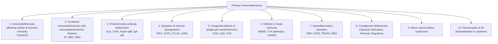

# 2.1 Primary Immunodeficiencies (PID)


---

## 🎯 Learning Objectives
- [ ] Classify PID using **IUIS 2022/2024** classification (10 categories)
- [ ] Differentiate **CVID vs XLA vs Hyper-IgM** — Clinical, Lab, Genetic, Management
- [ ] Recognise **SCID types** (IL2RG, ADA, RAG, IL7R, Artemis) — HSCT, Gene therapy
- [ ] Identify **Phagocytic defects** (CGD, LAD, CHS) — NBT/DHR, Organisms, HSCT
- [ ] Diagnose **Complement deficiencies** — Pathway-specific infections, Screening
- [ ] Identify **MSMD** (IFN-γ/IL-12 axis) — NTM, BCG-osis, IFN-γ therapy
- [ ] Recognise **Immune Dysregulation** (IPEX, ALPS, CTLA4, LRBA) — Biomarkers, Abatacept
- [ ] Answer viva: "CVID vs XLA" and "SCID types" and "CGD diagnosis"

---

## 🧠 Core Concept: IUIS PID Classification (2022/2024)



---

## 1️⃣ Predominantly Antibody Deficiencies

### X-Linked Agammaglobulinaemia (XLA — Bruton's)
| Feature | Detail |
|---------|--------|
| **Gene** | **BTK** (Xq22) — Bruton tyrosine kinase |
| **Inheritance** | X-linked recessive (Males affected) |
| **Pathogenesis** | Block at pre-B → mature B cell transition → **Absent B cells** (<1%), **Absent immunoglobulins** |
| **Onset** | 6-18 months (after maternal IgG wanes) |
| **Infections** | Recurrent **sinopulmonary** (S. pneumoniae, H. influenzae), **GI** (Giardia, Campylobacter), **Enteroviral** (CNS), **Sepsis** |
| **Labs** | **IgG/IgA/IgM very low**, **CD19+ B cells <1%**, **Absent tonsils/lymph nodes** |
| **Genetics** | BTK sequencing (95% detection) |
| **Treatment** | **IVIG** (400-600 mg/kg q3-4w) or **SCIG**, **Avoid live vaccines**, Monitor for enteroviral encephalitis |
| **Prenatal** | CVS/Amnio if familial variant known; PGT-M |

### Common Variable Immunodeficiency (CVID)
| Feature | Detail |
|---------|--------|
| **Genetics** | Heterogeneous (TNFRSF13B/TACI, NFKB1, STAT3, IKZF1, etc.) — **AD/AR/De novo** |
| **Incidence** | 1/25,000 — **Most common symptomatic PID** |
| **Onset** | **Bimodal**: Childhood (5-10y) & Adulthood (20-40y) |
| **Diagnostic Criteria (ESID/ESCI)** | 1) **Marked reduction IgG** + low IgA and/or IgM 2) **Impaired vaccine response** 3) Exclusion of other causes (secondary, XLA) 4) Age >2y (usually >4y) |
| **B Cells** | **Low/Normal** (vs XLA: absent) — **Switched memory B cells ↓** (CD27+IgD-) |
| **Clinical** | **Recurrent sinopulmonary infections**, **Bronchiectasis**, **Autoimmunity** (ITP, AIHA, RA), **Lymphoid hyperplasia** (Lymphadenopathy, Splenomegaly), **Granulomatous disease** (Non-caseating), **Lymphoma** risk (10-15%), **Enteropathy** |
| **Genetics** | NGS Panel (TNFRSF13B, NFKB1, STAT3, IKZF1, etc.) — **~20% monogenic** |
| **Treatment** | **IVIG/SCIG** (400-600 mg/kg q3-4w), **Antibiotic prophylaxis**, Surveillance for malignancy/autoimmunity, **Bronchiectasis management** |

### Hyper-IgM Syndromes
| Type | Gene | Inheritance | Key Features |
|------|------|-------------|--------------|
| **Type 1 (X-linked)** | **CD40LG** | XLR | **CD40L deficiency** → No class switching → **High IgM**, Low IgG/IgA/IgE, **Pneumocystis jirovecii**, **Cryptosporidium** (sclerosing cholangitis), Neutropenia |
| **Type 2** | **AICDA** | AR | **AID deficiency** → No SHM/CSR, Lymphoid hyperplasia, Autoimmunity |
| **Type 3** | **CD40** | AR | Similar to Type 1, plus **Ectodermal dysplasia** |
| **Type 4** | **UNG** | AR | **Uracil-DNA glycosylase** defect |
| **Type 5** | **INKOS** | AR | **IKZF1** — Combined immunodeficiency |

### Selective IgA Deficiency
| Feature | Detail |
|---------|--------|
| **Definition** | Serum IgA <0.07 g/L (≤7 mg/dL), Normal IgG/IgM, Age >4y |
| **Incidence** | **1/300-1/500** — **Most common PID** |
| **Clinical** | **Often asymptomatic** (50%); Sinopulmonary infections, **Giardia**, **Allergy**, **Autoimmunity** (Coeliac, SLE, RA), **Anaphylaxis to IVIG** (anti-IgA antibodies) |
| **Management** | **Avoid IVIG** (risk anaphylaxis); If needed → **Washed RBCs, IgA-depleted IVIG**; Coeliac screening |

### IgG Subclass Deficiency
| Subclass | Function | Deficiency Associations |
|----------|----------|------------------------|
| **IgG1** | Protein antigens | Severe infections (S. pneumoniae) |
| **IgG2** | **Polysaccharide antigens** | Recurrent sinopulmonary (H. influenzae, S. pneumoniae) |
| **IgG3** | Complement activation | Viral infections |
| **IgG4** | Allergy, Chronic inflammation | IgG4-related disease |

---

## 2️⃣ Combined Immunodeficiencies (CID/SCID)

### Severe Combined Immunodeficiency (SCID)
| Type | Gene | Pathway | Key Features |
|------|------|---------|--------------|
| **T-B-NK+ (X-linked)** | **IL2RG** | γc cytokine receptor | **Most common SCID** (~50%), T-B-NK+, IL-2/4/7/9/15/21 signalling defect |
| **T-B-NK+ (AR)** | **JAK3** | Downstream of γc | Similar to IL2RG |
| **T-B+NK-** | **IL7R** | IL-7 signalling | T-B+NK-, Thymic hypoplasia |
| **T-B-NK-** | **RAG1/RAG2** | V(D)J recombination | **Omenn syndrome** (if hypomorphic), Erythroderma, Hepatosplenomegaly |
| **T-B-NK-** | **DCLRE1C (Artemis)** | V(D)J + DNA repair | **Radiosensitivity** |
| **T-B-NK-** | **ADA** | Purine metabolism | **Toxic metabolites** (dATP) → Lymphocyte apoptosis, **Skeletal abnormalities** (Costochondral flaring) |
| **T-B-NK-** | **PNP** | Purine metabolism | **Neurological involvement** |

### SCID — Clinical & Management
| Feature | Detail |
|---------|--------|
| **Presentation** | <6 months: Failure to thrive, Chronic diarrhoea, **Pneumocystis jirovecii pneumonia (PJP)**, Chronic candidiasis, **Failure to thrive**, **Absent thymic shadow** (CXR) |
| **Labs** | **Lymphopenia** (<1500/μL <3m, <1000/μL >6m), **Absent T cells** (CD3+), **Low/absent immunoglobulins**, **Absent mitogen proliferation** |
| **Newborn Screening** | **TREC assay** (T-cell receptor excision circles) — **Dried blood spot**, Early detection → **HSCT before infection** |
| **Management** | **Urgent HSCT** (Best <3.5 months, matched sibling > MUD), **Gene therapy** (IL2RG, ADA, RAG - Lentiviral), **PJP prophylaxis** (Co-trimoxazole), **IVIG**, **Avoid live vaccines**, **Irradiated blood products** |
| **Outcome** | **>90% survival** if HSCT <3.5m without infection |

### Omenn Syndrome
| Feature | Detail |
|---------|--------|
| **Genetics** | Hypomorphic **RAG1/2**, **DCLRE1C**, **ADA** |
| **Clinical** | **Erythroderma**, **Alopecia**, **Hepatosplenomegaly**, **Lymphadenopathy**, **Eosinophilia**, **High IgE**, **Oligoclonal T cells**, **Absent B cells** |
| **Pathogenesis** | **Oligoclonal autoreactive T cells** → Olfactory mucosal inflammation |

### Other CID
| Syndrome | Gene | Key Features |
|----------|------|--------------|
| **Ataxia-Telangiectasia (AT)** | **ATM** (AR) | Cerebellar ataxia, Telangiectasia (bulbar conjunctiva), **Chromosomal breakage**, Radiosensitivity, IgA/IgE deficiency, **Lymphoma risk**, **Alpha-fetoprotein ↑** |
| **Nijmegen Breakage Syndrome** | **NBN** (AR) | Microcephaly, Bird-like face, **Chromosomal instability**, Radiosensitivity, Lymphoma |
| **Wiskott-Aldrich (WAS)** | **WAS** (XLR) | **Thrombocytopenia (small platelets)**, **Eczema**, **Recurrent infections**, **Autoimmunity**, **Lymphoma risk** — **HSCT curative** |
| **Hyper-IgE (STAT3)** | **STAT3** (AD) | **Recurrent staphylococcal abscesses**, **Pneumonia (pneumatoceles)**, **Eosinophilia**, **High IgE**, **Skeletal anomalies**, **Retained primary teeth** |

---

## 3️⃣ Phagocytic Defects

### Chronic Granulomatous Disease (CGD)
| Feature | Detail |
|---------|--------|
| **Genetics** | **CYBB** (XLR, 65%), **NCF1, NCF2, CYBA, CYBC1** (AR) — **NADPH oxidase** subunits |
| **Pathogenesis** | **Defective ROS production** → Impaired intracellular killing of **catalase-positive** organisms |
| **Organisms** | **Catalase-positive**: S. aureus, Burkholderia cepacia, Aspergillus, Nocardia, Serratia, Klebsiella; **BCG-osis** |
| **Diagnosis** | **DHR (Dihydrorhodamine) flow cytometry** — **Gold standard** (Absent/residual oxidative burst); **NBT test** (Qualitative) |
| **Management** | **Prophylactic Co-trimoxazole + Itraconazole**, **IFN-γ (1b) prophylaxis**, **HSCT** (curative, early), **IFN-γ for refractory infections** |
| **Screening** | **DHR flow** — Carrier mothers (skewed X-inactivation) |

### Leukocyte Adhesion Deficiency (LAD)
| Type | Gene | Key Features |
|------|------|-------------|
| **LAD I** | **ITGB2** (CD18) | **Leukocytosis** (>50,000), **Delayed umbilical cord separation**, **Recurrent soft tissue infections**, **No pus formation**, **Impaired wound healing** |
| **LAD II** | **SLC35C1** | **Bombay blood group**, **Mental retardation**, **Short stature** |
| **LAD III** | **FERMT3** | **LAD I + Bleeding disorder** (Platelet defect) |

### Chediak-Higashi Syndrome (CHS)
| Feature | Detail |
|---------|--------|
| **Gene** | **LYST** (AR) — Lysosomal trafficking |
| **Features** | **Partial oculocutaneous albinism**, **Giant granules** (neutrophils, melanocytes), **Recurrent pyogenic infections**, **Accelerated phase** (HLH-like), **Neuropathy** |
| **Diagnosis** | **Giant granules** on peripheral smear, **LYST sequencing** |
| **Management** | **HSCT** (before accelerated phase), **Prophylactic antibiotics**, **Ascorbic acid** |

### Papillon-Lefèvre Syndrome
| Feature | Detail |
|---------|--------|
| **Gene** | **CTSC** (AR) — Cathepsin C |
| **Clinical** | **Palmoplantar keratoderma** + **Severe early-onset periodontitis** (premature tooth loss), **Recurrent skin infections** (Staph, Pseudomonas), **Pyogenic liver abscesses**, **Intracranial calcifications** |
| **Mechanism** | Impaired serine protease activation → ↓ Neutrophil antimicrobial peptides (LL-37), ↓ CTL/NK granule exocytosis |
| **Diagnosis** | **Cathepsin C activity assay**, **CTSC sequencing** |
| **Management** | **Retinoid therapy** (Acitretin) for skin, **Aggressive periodontal care**, **Prophylactic antibiotics**, **HSCT** (curative for immune defect) |

---

## 4️⃣ Complement Deficiencies

### Classical Pathway Deficiencies
| Deficiency | Inheritance | Clinical |
|------------|-------------|----------|
| **C1q** | AR | **SLE-like disease** (<5y), **Recurrent infections** (encapsulated), **IC clearance defect** |
| **C1r/C1s** | AR | Similar to C1q |
| **C4** | AR | **SLE, Recurrent infections**, C4 null (Complete deficiency) |
| **C2** | AR | **Most common classical deficiency**, **SLE-like**, Recurrent infections |

### Alternative Pathway
| Deficiency | Inheritance | Clinical |
|------------|-------------|----------|
| **Factor D** | AR | Recurrent Neisseria |
| **Properdin** | XLR | **Meningococcal disease** (Males) |

### Lectin Pathway
| Deficiency | Inheritance | Clinical |
|------------|-------------|----------|
| **MBL (Mannose-Binding Lectin)** | AR/AD (Codominant) | **Recurrent childhood infections** (encapsulated bacteria), **Increased sepsis risk**, **Autoimmunity** (SLE-like), **Impaired opsonisation**; **MBL level < 100 ng/mL** = Deficiency |

### Terminal Pathway (MAC)
| Deficiency | Clinical |
|------------|----------|
| **C5, C6, C7, C8, C9** | **Recurrent Neisseria meningitidis** (atypical, recurrent), **Gonococcal infections** |
| **C5** | Also **aHUS risk** (Eculizumab target) |

### Regulatory Proteins
| Deficiency | Clinical |
|------------|----------|
| **C1-INH (Hereditary Angioedema)** | **C4 low, C1q normal**, Bradykinin-mediated angioedema, **Icatibant, C1-INH concentrate** |
| **Factor H** | aHUS, MPGN |
| **Factor I** | Recurrent infections, aHUS |
| **MCP (CD46)** | **aHUS** (Membrane Cofactor Protein — complement regulator on cell surfaces), **Autosomal recessive**; **CD46 flow cytometry** for diagnosis |

### C3 Deficiency
| Feature | Detail |
|---------|--------|
| **Clinical** | **Severe recurrent pyogenic infections**, **Autoimmunity** (SLE-like), **High risk sepsis** |
| **Mechanism** | Central to all 3 pathways — **Critical for opsonisation** |

---

## 5️⃣ Mendelian Susceptibility to Mycobacterial Disease (MSMD)

### IFN-γ / IL-12 Axis Defects
| Gene | Protein | Inheritance | Clinical |
|------|---------|-------------|------------|
| **IFNGR1/IFNGR2** | IFN-γ Receptor | AR/AD | **Severe BCG-osis**, Disseminated NTM, Salmonella, **No granulomas** |
| **STAT1** | Signal Transducer | AD/AR | **AD: AD CID + MSMD; AR: MSMD**, Impaired IFN-γ/IL-12 signaling |
| **IL12RB1** | IL-12 Receptor β1 | AR | **Most common MSMD** (~40%), NTM, BCG-osis, Salmonella |
| **IL12B** | IL-12 p40 | AR | Similar to IL12RB1 |
| **ISG15** | ISG15 | AR | **MSMD + Basal ganglia calcifications** |
| **TYK2** | JAK Kinase | AR | **MSMD + Hyper-IgE** |
| **CYBB** | gp91phox (XLR) | XL | **CGD + MSMD** (Combined phenotype) |

### MSMD Management
| Strategy | Detail |
|----------|--------|
| **Antimycobacterial Therapy** | Prolonged MDR regimens for NTM |
| **IFN-γ Therapy** | **Recombinant IFN-γ** (Subcut) — Adjunct for refractory NTM/BCG-osis |
| **HSCT** | Curative for severe IL12RB1/IFNGR1 defects |
| **BCG Vaccination** | **Contraindicated** in known MSMD |

---

## 6️⃣ Immune Dysregulation Disorders

### IPEX Syndrome
| Feature | Detail |
|---------|--------|
| **Gene** | **FOXP3** (Xp11.23) — Treg transcription factor |
| **Inheritance** | X-linked recessive |
| **Triad** | **Enteropathy** (Intractable diarrhoea, Villous atrophy), **Endocrinopathy** (Type 1 DM, Thyroiditis), **Eczema** (Dermatitis) |
| **Other** | **Autoimmune cytopenias**, **Nephropathy**, **Lymphoproliferation**, **Food allergies**, **Hyper IgE** |
| **Diagnosis** | **FOXP3 sequencing**, **Absent CD4+CD25+FOXP3+ Tregs** |
| **Management** | **HSCT (Curative)**, **Rapamycin (Sirolimus)** — mTOR inhibition expands Tregs, **Abatacept** (CTLA-4-Ig), **Immunosuppression** |

### ALPS (Autoimmune Lymphoproliferative Syndrome)
| Feature | Detail |
|---------|--------|
| **Gene** | **FAS (TNFRSF6)** (AD, 75%), **FASLG**, **CASP10** (AR) |
| **Mechanism** | **Defective Fas-FasL apoptosis** → Accumulation of **DNT cells** (Double-negative TCRαβ+ CD4-CD8-) |
| **Clinical** | **Lymphadenopathy**, **Splenomegaly**, **Autoimmune cytopenias** (AIHA, ITP), **Lymphoma risk** (Hodgkin, NHL) |
| **Diagnosis** | **Elevated DNT cells** (>1.5% TCRαβ+ CD4-CD8-), **Elevated sFasL, IL-10, IL-18, Vitamin B12** |
| **Management** | **Sirolimus (Rapamycin)** — mTOR inhibition reduces DNT cells, **Rituximab** (B-cell depletion), **Splenectomy** (cautious), **HSCT** (refractory) |

### CTLA-4 Haploinsufficiency
| Feature | Detail |
|---------|--------|
| **Gene** | **CTLA4** (AD, Incomplete penetrance) |
| **Mechanism** | **Impaired Treg function** → Immune dysregulation |
| **Clinical** | **Autoimmunity** (Cytopenias, Thyroiditis, Enteropathy), **Lymphoproliferation**, **Recurrent infections** (Low IgG), **Lymphoma risk** |
| **Treatment** | **Abatacept (CTLA-4-Ig)** — **First-line**, **Sirolimus**, **HSCT** (refractory) |

### LRBA Deficiency
| Feature | Detail |
|---------|--------|
| **Gene** | **LRBA** (AR) — LPS-responsive beige-like anchor |
| **Mechanism** | **Impaired CTLA-4 trafficking** → ↓ CTLA-4 surface expression |
| **Clinical** | **Early-onset IBD**, **Autoimmunity** (Cytopenias, Thyroiditis), **Hypogammaglobulinemia**, **Recurrent infections**, **Lymphoproliferation** |
| **Treatment** | **Abatacept (CTLA-4-Ig)** — **First-line, highly effective**, **Sirolimus**, **HSCT** |
| **Biomarker** | **Low CTLA-4 surface expression** on Tregs |

---

## 7️⃣ Autoinflammatory Disorders (Brief)

| Syndrome | Gene | Pathway | Key Features |
|----------|------|---------|--------------|
| **FMF** | **MEFV** (AR) | Pyrin → NLRP3 inflammasome | **Recurrent fevers**, Peritonitis, Pleuritis, Arthritis, Amyloidosis; **Colchicine** |
| **CAPS** | **NLRP3** (AD) | NLRP3 inflammasome ↑ | **FCAS/MWS/CINCA** spectrum; **Anakinra/Canakinumab/Rilonacept** (IL-1 blockade) |
| **TRAPS** | **TNFRSF1A** (AD) | TNF receptor shedding | **Prolonged fevers**, Migration rash, Periorbital oedema; **Etanercept/Anakinra** |
| **MKD/HIDS** | **MVK** (AR) | Mevalonate pathway | **Fever**, Lymphadenopathy, Aphthous ulcers, **High IgD/IgA**; **Anakinra** |
| **DIRA** | **IL1RN** (AR) | IL-1Ra deficiency | Neonatal pustulosis, Osteitis, Periostitis; **Anakinra curative** |

---

## ⚡ FCPS/MRCP High-Yield Summary

| Disorder | Key Gene | Key Features | Key Test | Treatment |
|----------|----------|--------------|----------|-----------|
| **XLA** | **BTK** | Males, <1% B cells, Low Igs, Recurrent sinopulmonary | **Absent B cells (CD19+)**, Low Igs | **IVIG lifelong** |
| **CVID** | Heterogeneous | **Low IgG + Low IgA/IgM**, Poor vaccine response, Normal/low B cells, **Autoimmunity, Lymphoma** | Low IgG + Poor vaccine response | **IVIG lifelong** |
| **XLA vs CVID** | BTK vs Hetero | **XLA: <1% B cells, Male, Early onset**; CVID: Normal/low B cells, Onset >2y | B cell count | Both: IVIG |
| **SCID** | IL2RG, ADA, RAG, IL7R | **Lymphopenia, Absent T cells, PJP, Failure to thrive** | **TREC (NBS)**, Lymphopenia, Absent T cells | **Urgent HSCT**, Gene therapy |
| **CGD** | CYBB, NCF1/2/4 | **Catalase-positive organisms**, Granulomas, DHR abnormal | **DHR Flow** (Gold standard) | Co-trimoxazole + Itraconazole + IFN-γ, HSCT |
| **LAD I** | ITGB2 (CD18) | **Leukocytosis, Delayed cord separation, No pus** | CD18 deficiency (Flow) | HSCT |
| **MSMD** | IFNGR1/2, IL12RB1, STAT1 | **BCG-osis, NTM, Salmonellosis** | IFN-γ/IL-12 axis genes | **IFN-γ therapy**, HSCT |
| **C3 Deficiency** | C3 | **Severe pyogenic infections, Autoimmunity** | C3 level, CH50 | Prophylactic antibiotics |
| **C5-9 Deficiency** | C5-9 | **Recurrent Neisseria** | C5-9 levels, CH50 | Vaccination, Prophylactic antibiotics |
| **C1-INH (HAE)** | SERPING1 | **C4 low, C1q normal**, Bradykinin angioedema | C4 low, C1q normal | **Icatibant, C1-INH concentrate** |
| **IPEX** | FOXP3 | **Triad: Enteropathy, Endocrinopathy, Eczema** | FOXP3 seq, Absent Tregs | **HSCT, Rapamycin, Abatacept** |
| **ALPS** | FAS | **DNT cells** (TCRαβ+ CD4-CD8-), Lymphoproliferation | **DNT cells >1.5%**, Elevated sFasL | Sirolimus, Rituximab, HSCT |
| **CTLA-4 Haplo** | CTLA4 | **Autoimmunity, Lymphoproliferation, Low IgG** | Low CTLA-4 on Tregs | **Abatacept (1st line)** |
| **LRBA** | LRBA | **IBD, Autoimmunity, Hypogammaglobulinemia** | Low CTLA-4 surface expression | **Abatacept (1st line)** |
| **Hyper-IgE (STAT3)** | STAT3 | **Staph abscesses, Pneumatoceles, Eosinophilia, High IgE** | STAT3 sequencing, IgE | Prophylactic antibiotics, IFN-γ |
| **AT** | ATM | **Ataxia, Telangiectasia, IgA/IgE low, AFP↑** | AFP ↑, Chromosomal breakage | Supportive, Cancer surveillance |
| **WAS** | WAS | **Thrombocytopenia (small platelets), Eczema, Infections** | Small platelets, WAS sequencing | HSCT |

---

## 🎤 Viva Questions (Expected Answers)

| # | Question | Expected Answer |
|---|----------|-----------------|
| 1 | XLA vs CVID — key differences? | **XLA**: BTK, Male, <6m, **Absent B cells**, Low Igs, De novo ~50%; **CVID**: Heterogeneous, Onset >2y, **Low/normal B cells**, Low IgG + IgA/IgM, Autoimmunity, Lymphoma risk |
| 2 | SCID — most common type & newborn screening? | **IL2RG (X-linked) ~50%**; **TREC assay** on dried blood spot (NBS) |
| 3 | CGD — diagnostic test of choice? | **DHR Flow Cytometry** (Gold standard) — Absent oxidative burst; NBT qualitative only |
| 4 | CGD — characteristic organisms? | **Catalase-positive**: S. aureus, Burkholderia cepacia, Aspergillus, Nocardia, Serratia |
| 5 | MSMD — key pathway & treatment? | **IFN-γ/IL-12 axis** (IFNGR1/2, IL12RB1, STAT1); **IFN-γ therapy adjunct**, HSCT for severe |
| 6 | CGD vs LAD I — key difference? | **CGD**: Impaired killing (ROS), Normal adhesion; **LAD I**: Impaired adhesion (CD18), **Leukocytosis, delayed cord separation** |
| 7 | Hyper-IgE (STAT3) — key features? | **Recurrent staph abscesses, Pneumonia with pneumatoceles, Eosinophilia, High IgE, Skeletal anomalies, Retained primary teeth** |
| 8 | IPEX — triad & treatment? | **Enteropathy, Endocrinopathy (T1DM), Eczema**; **HSCT curative**, Rapamycin, Abatacept |
| 9 | ALPS — diagnostic hallmark? | **DNT cells** (TCRαβ+ CD4-CD8-) >1.5%, Elevated sFasL, IL-10, IL-18, Vit B12 |
| 10 | CTLA-4 haploinsufficiency — first-line treatment? | **Abatacept (CTLA-4-Ig)** — Restores Treg function, First-line |

---

## 🧩 Confusions & Mnemonics

| Confusion | Clarification |
|-----------|---------------|
| **"CVID = XLA in adults"** | **NO.** CVID: Normal/low B cells, Onset >2y, Heterogeneous genetics. XLA: **Absent B cells**, Male, Infant. |
| **"All SCID = T-B-NK+"** | **NO.** T-B-NK+ (IL2RG, JAK3); T-B+NK- (IL7R); T-B-NK- (RAG, Artemis, ADA, PNP). |
| **"CGD = Only S. aureus"** | **NO.** **Catalase-positive**: S. aureus, **Burkholderia cepacia, Aspergillus, Nocardia, Serratia, Klebsiella**. |
| **"All SCID = Fatal without HSCT"** | **True** — But **Gene therapy** (IL2RG, ADA, RAG) now curative alternative; **HSCT <3.5m = Best outcome**. |
| **"Hyper-IgE = Just high IgE"** | **NO.** **STAT3** → **Staph abscesses, Pneumatoceles, Eosinophilia, Skeletal anomalies, Retained teeth, IgE >2000**. |
| **"ALPS = Just lymphadenopathy"** | **NO.** **DNT cells (TCRαβ+ CD4-CD8-) >1.5%** = Hallmark; Autoimmune cytopenias, Lymphoma risk. |
| **"IPEX = Only gut issues"** | **NO.** **Triad**: **Enteropathy, Endocrinopathy (T1DM), Eczema**; Also autoimmunity, Nephropathy. |
| **"C3 def = Just infections"** | **NO.** **Severe pyogenic infections + Autoimmunity (SLE-like)** — Central to all 3 pathways. |
| **"All SCID = No T cells"** | **Leaky SCID / Omenn** = Oligoclonal T cells present (Autoreactive), Erythroderma, Eosinophilia, High IgE. |
| **"CVID = Just low IgG"** | **NO.** Must have **Impaired vaccine response** + Exclusion of secondary causes + Age >2-4y. |

> **Mnemonic: PRIMARY IMMUNODEFICIENCIES**  
> **P**ID Classification: **IUIS 2022 = 10 Categories** (CID, Syndromic CID, Antibody, Dysregulation, Phagocytic, Innate, Autoinflammatory, Complement, BM Failure, Phenocopies)  
> **R**ecurrent Infections: **SPUR** (Severe, Persistent, Unusual, Recurrent) — Warning signs  
> **I**mmunoglobulins: **CVID (Low IgG + IgA/IgM)**, **XLA (Pan-hypogammaglobulinemia, No B cells)**, **Hyper-IgM (High IgM, Low IgG/IgA)**  
> **M**olecular: **XLA=BTK, SCID=IL2RG/ADA/RAG, CGD=CYBB/NCF1, HLH=PRF1/UNC13D**  
> **A**ntibody Deficiencies: **XLA (BTK, No B cells), CVID (Variable, Late onset, Autoimmunity), Hyper-IgM (CD40L, AICDA, Class Switch Defect)**  
> **R**eid (SCID): **IL2RG (X-linked), ADA, RAG, IL7R, Artemis** — **TREC NBS**, **HSCT <3.5m**  
> **Y** (Why CGD?): **Catalase-positive bugs** (Staph, Burkholderia, Aspergillus, Nocardia) — **DHR Flow Gold Standard**  
> **I**nate Defects: **MSMD (IFN-γ/IL-12 axis)** → BCG-osis, NTM, Salmonella → **IFN-γ therapy**  
> **D**ysregulation: **IPEX (FOXP3, XLR, Enteropathy+Endocrinopathy+Eczema), ALPS (FAS, DNT cells), CTLA4, LRBA**  
> **I**nflammatory: **FMF (MEFV, Colchicine), CAPS (NLRP3, Anakinra/Canakinumab), TRAPS (TNFRSF1A, Etanercept)**  
> **Y** (Complement): **C1q/C4/C2 (SLE-like), C3 (Severe infections + Autoimmunity), C5-9 (Neisseria), C1-INH (HAE, Bradykinin)**  
> **P**henocopies: **Anti-cytokine Abs (Anti-IFN-γ → NTM, Anti-GM-CSF → PAP)**  
> **I**mmune Dysregulation: **IPEX (FOXP3), ALPS (FAS/DN T cells), CTLA4 (Abatacept!), LRBA (Abatacept!)**  
> **D**iagnostic Flow: **SPUR → CBC+Diff+Ig → Lymphocyte Subsets → Functional → Genetic (Panel/WES)**  
> **E**arly HSCT: **SCID <3.5m = Best Outcome**; **CGD/FA/HLH/MSMD = HSCT Curative**  
> **F**amily Letters: **Cascade Testing** — Proband → 1st-degree (50%) → 2nd-degree (25%)  
> **I**VIG: **All Antibody Deficiencies** (XLA, CVID, Hyper-IgM, IgA def) — **400-600mg/kg q3-4w**  
> **C**ombined Deficiencies: **SCID (T-B-NK+ IL2RG/JAK3, T-B+NK- IL7R, T-B-NK- RAG/Artemis/ADA)**  
> **I**mmunodeficiencies Secondary: **HIV, Chemo, Biologics (Rituximab, Anti-TNF), Steroids, Splenectomy, Malignancy, Protein Loss**  
> **E**nd: **Genetic Counselling** — Cascade, PGT-M, Prenatal, Reproductive Options, Psychosocial Support  

---

## 🗺️ Mind Map

```mermaid
mindmap
  root((Primary Immunodeficiencies))
    IUIS Classification
      1. CID/SCID
      2. Syndromic CID
      3. Antibody Deficiencies
      4. Immune Dysregulation
      5. Phagocytic Defects
      6. Innate Immunity Defects
      7. Autoinflammatory
      8. Complement
      9. BM Failure
      10. Phenocopies
    Antibody Deficiencies
      XLA: BTK, No B cells
      CVID: Heterogeneous, Low Ig, Autoimmunity
      Hyper-IgM: CD40L, AID, Class Switch
      IgA Def: Most common, Anaphylaxis risk
    CID/SCID
      IL2RG (X-linked) ~50%
      ADA, RAG, Artemis
      TREC NBS, HSCT <3.5m
      Omenn: Erythroderma, Eosinophilia
    Phagocytic
      CGD: DHR flow, Catalase+ bugs
      LAD I: CD18, Leukocytosis
      LAD II: Bombay blood group
      CHS: Giant granules, Albinism
    Complement
      Classical: C1q/C4/C2 → SLE-like
      C3: Central, Severe infections + Autoimmunity
      Terminal C5-9: Neisseria
      C1-INH: HAE (Bradykinin)
    Innate/MSMD
      IFN-γ/IL-12 Axis: IFNGR, IL12RB1, STAT1
      BCG-osis, NTM
      IFN-γ therapy
    Dysregulation
      IPEX: FOXP3, Triad
      ALPS: FAS, DNT cells
      CTLA4: Abatacept!
      LRBA: Low CTLA-4 → Abatacept!
    Autoinflammatory
      FMF: MEFV, Colchicine
      CAPS: NLRP3, IL-1 blockade
      TRAPS: Etanercept
    Secondary
      HIV, Chemo, Biologics, Splenectomy
      Monitoring: Ig, CD4, Vaccines
```

---

## 📅 Spaced Repetition Tracker

| Review | Date | Score (0–5) | Notes |
|--------|------|-------------|-------|
| Day 1 | | | |
| Day 3 | | | |
| Day 7 | | | |
| Day 14 | | | |
| Day 30 | | | |
| Day 90 | | | |

---

## 📝 Self-Test Scorecard

| Section | Max | Score | % |
|---------|-----|-------|---|
| IUIS Classification | 2 | | |
| Antibody Deficiencies (XLA/CVID/Hyper-IgM) | 4 | | |
| SCID Types & Management | 4 | | |
| Phagocytic Defects (CGD, LAD, CHS) | 3 | | |
| Complement Deficiencies | 3 | | |
| MSMD & Innate Defects | 2 | | |
| Immune Dysregulation (IPEX, ALPS, CTLA4, LRBA) | 3 | | |
| Autoinflammatory & Secondary | 2 | | |
| **Total** | **20** | | |

---

## 💬 Exam Answer Modes

| Format | Prompt | Key Points |
|--------|--------|------------|
| **Long Essay** | "Classify Primary Immunodeficiencies and describe the clinical features of XLA vs CVID." | IUIS 10 categories, BTK vs Heterogeneous, B cells 0 vs Normal/low, Age onset, Genetics, IVIG for both |
| **Short Note** | "Chronic Granulomatous Disease — diagnosis and management." | CYBB/NCF1/2/4, NADPH oxidase, Catalase+ organisms, DHR flow gold standard, Co-trimoxazole + Itraconazole + IFN-γ, HSCT curative |
| **Viva** | "Infant with recurrent BCG-osis and NTM. IFN-γ receptor mutation suspected. Management?" | **MSMD** (IFN-γ/IL-12 axis), IFN-γ therapy adjunct, HSCT curative for severe IL12RB1/IFNGR1, Avoid BCG, Genetic counselling |
| **Ward Round** | "4M with recurrent staph abscesses, pneumatoceles, high IgE, eosinophilia. Diagnosis?" | **Hyper-IgE (STAT3)** — AD, Staph abscesses, pneumatoceles, eosinophilia, high IgE, skeletal anomalies, retained teeth. Genetic test: STAT3. |
| **Last-Night** | "XLA: BTK, No B cells, IVIG. CVID: Low IgG+IgA/IgM, Autoimmunity, IVIG. SCID: TREC NBS, HSCT<3.5m. CGD: DHR, Catalase+ bugs, IFN-γ. MSMD: IFN-γ/IL-12 axis. IPEX: FOXP3, Triad, HSCT. ALPS: FAS, DNT cells. CTLA4/LRBA: Abatacept. CGD: CYBB, DHR, IFN-γ. CVID: Autoimmunity, Lymphoma." | Compressed. |

---

## 📌 Summary
- **IUIS 2022**: 10 categories — CID/SCID, Syndromic CID, Antibody deficiencies, Dysregulation, Phagocytic, Innate, Autoinflammatory, Complement, BM failure, Phenocopies
- **XLA**: BTK, Absent B cells, Early onset, IVIG lifelong
- **CVID**: Heterogeneous, Low IgG+IgA/IgM, Normal/low B cells, Autoimmunity (25%), Lymphoma (10-15%), IVIG lifelong
- **SCID**: IL2RG (50%), ADA, RAG, IL7R, Artemis; **TREC NBS**; **HSCT <3.5m** best; Gene therapy emerging
- **CGD**: CYBB/NCF1/2/4, NADPH oxidase defect → Catalase-positive organisms; **DHR flow gold standard**; Co-trimoxazole + Itraconazole + IFN-γ prophylaxis; HSCT curative
- **LAD I**: ITGB2 (CD18), Leukocytosis, delayed cord separation, no pus; HSCT
- **MSMD**: IFN-γ/IL-12 axis (IFNGR1/2, IL12RB1, STAT1) → BCG-osis, NTM; IFN-γ therapy; HSCT for severe
- **Complement**: C1q/C4/C2 → SLE-like; C3 → Severe infections + Autoimmunity; C5-9 → Neisseria; C1-INH → HAE
- **Dysregulation**: IPEX (FOXP3, Triad), ALPS (FAS, DNT cells >1.5%), CTLA-4 haplo (Abatacept!), LRBA (Abatacept!)
- **Autoinflammatory**: FMF (Colchicine), CAPS (NLRP3, IL-1 blockade), TRAPS (Etanercept), MKD (Anakinra)
- **Secondary**: HIV, Chemo, Biologics (Rituximab, Anti-TNF), Steroids, Splenectomy, Malignancy

---

## ❓ MCQs (10)

1. **XLA vs CVID — key distinguishing feature?**  
   A. Age of onset  B. **B cell count (Absent vs Normal/Low)**  C. IgG level  D. Gender  
   *Answer: B. XLA = Absent B cells (<1%); CVID = Normal/low B cells.*

2. **SCID newborn screening test?**  
   A. CBC  B. **TREC assay**  C. Ig levels  C. Lymphocyte subsets  
   *Answer: B. TREC (T-cell receptor excision circles) on dried blood spot.*

3. **CGD — diagnostic gold standard?**  
   A. NBT test  B. **DHR Flow Cytometry**  C. Catalase test  D. Gene sequencing  
   *Answer: B. DHR flow = Gold standard (Quantitative oxidative burst).*

4. **Hyper-IgE syndrome (STAT3) — characteristic feature?**  
   A. Pneumonia with pneumatoceles  B. **Recurrent staph abscesses + Pneumatoceles + Eosinophilia + High IgE**  C. Lymphopenia  D. Low IgE  
   *Answer: B. Classic tetrad: Staph abscesses, Pneumatoceles, Eosinophilia, High IgE.*

5. **IPEX syndrome — triad?**  
   A. Eczema, Infections, Autoimmunity  B. **Enteropathy, Endocrinopathy (T1DM), Eczema**  C. Diarrhoea, Diabetes, Dermatitis  D. Diarrhoea, Deafness, Dysmorphism  
   *Answer: B. Triad: Enteropathy, Endocrinopathy (T1DM), Eczema.*

6. **ALPS — diagnostic hallmark?**  
   A. High IgE  B. **DNT cells (TCRαβ+ CD4-CD8-) >1.5%**  C. Low IgG  D. High IgM  
   *Answer: B. Double-negative T cells (TCRαβ+ CD4-CD8-) >1.5% = Hallmark.*

8. **CGD — characteristic organisms?**  
   A. Streptococcus  B. **Catalase-positive: S. aureus, Burkholderia, Aspergillus, Nocardia**  C. Anaerobes  D. Viruses  
   *Answer: B. Catalase-positive organisms: S. aureus, Burkholderia cepacia, Aspergillus, Nocardia.*

9. **Hyper-IgE (STAT3) — inheritance?**  
   A. XLR  B. **AD**  C. AR  D. XL dominant  
   *Answer: B. Autosomal Dominant (STAT3).*

10. **CTLA-4 haploinsufficiency — first-line treatment?**  
    A. Sirolimus  B. **Abatacept (CTLA-4-Ig)**  C. Rituximab  D. IVIG  
    *Answer: B. Abatacept (CTLA-4-Ig) restores Treg function — First-line.*

---

## 📋 SBAs (10)

1. **5-month-old boy with recurrent pneumonia, diarrhoea, no tonsils. IgG 1.2, IgA <0.07, IgM 0.1. B cells 0.2%. Diagnosis?**  
   A. CVID  B. **XLA**  C. Hyper-IgM  D. SCID  
   *Answer: B. <6m, absent B cells, pan-hypogammaglobulinemia = XLA.*

2. **30F with recurrent sinusitis, bronchiectasis, ITP, low IgG/IgA, normal B cells. Vaccine response impaired. Diagnosis?**  
   A. XLA  B. **CVID**  C. Selective IgA deficiency  D. Hyper-IgM  
   *Answer: B. Adult onset, low IgG+IgA/IgM, normal B cells, autoimmunity, poor vaccine response = CVID.*

3. **Neonate with erythroderma, alopecia, hepatosplenomegaly, eosinophilia, high IgE. Lymphocytes: oligoclonal T cells, absent B cells. Diagnosis?**  
   A. SCID  B. **Omenn Syndrome**  C. Wiskott-Aldrich  D. Hyper-IgE  
   *Answer: B. Omenn: Erythroderma, eosinophilia, high IgE, oligoclonal T cells, absent B cells.*

4. **Child with recurrent BCG-osis, NTM infections. IFN-γ receptor mutation. Management?**  
   A. BCG vaccine  B. **IFN-γ therapy adjunct, HSCT for severe**  C. Anti-TNF  D. IVIG only  
   *Answer: B. MSMD: IFN-γ therapy adjunct, HSCT curative for severe IL12RB1/IFNGR1 defects.*

5. **25M with recurrent staph abscesses, pneumatoceles, coarse facies, high IgE. Gene?**  
   A. BTK  B. **STAT3**  C. CYBB  D. FAS  
   *Answer: B. STAT3 = Hyper-IgE syndrome (AD).*

---

## 🔑 Answer Keys
| MCQs | SBAs |
|------|------|
| 1-B, 2-B, 3-B, 4-B, 5-B, 6-B, 7-B, 8-B, 9-B, 10-B | 1-B, 2-B, 3-B, 4-B, 5-B |

---

## 🔗 Cross-Links
- [[1. Fundamentals of Immunology]] — B/T cell development, Immunoglobulins, Complement
- [[2.2 Secondary Immunodeficiencies]] — Contrast PID vs Secondary (HIV, Drugs, Malignancy)
- [[2.3 Approach to Immunodeficiency]] — Diagnostic algorithm (SPUR, CBC, Ig, Lymphocyte subsets, Functional, Genetic)
- [[3.1 Mechanisms of Autoimmunity]] — PID-associated autoimmunity (CVID, ALPS, CTLA4)
- [[3.2 Systemic Autoimmune Diseases]] — SLE, SSc overlap with PID
- [[3.3 Organ-Specific Autoimmune]] — CVID autoimmune manifestations (ITP, AIHA)
- [[4.1-4.4 Hypersensitivity & Allergy]] — Anaphylaxis in IgA deficiency, Drug reactions in PID
- [[5.1-5.4 Transplant Immunology]] — HSCT for PID (SCID, CGD, WAS, HLH)
- [[7.1-7.6 Immune-Based Therapies]] — IVIG in PID, HSCT for SCID/CGD/WAS
- [[8.1-8.6 Special Situations]] — PID in adulthood, Transition care
- [[10. System-Based Clinical Genetics]] — PID genes by system

---

**Last Updated:** 2026-06-15  
**Next:** Build `2.2 Secondary Immunodeficiencies.md`
---

> Auto-generated study sections for "Clinical Immunology" — Ch 4: Clinical Immunology.

## Flashcards (109 generated)

- Q: What is Gene of Clinical Immunology?
  A: BTK (Xq22) — Bruton tyrosine kinase
- Q: What is Inheritance of Clinical Immunology?
  A: X-linked recessive (Males affected)
- Q: What is the pathogenesis of Clinical Immunology?
  A: Block at pre-B → mature B cell transition → Absent B cells (<1%), Absent immunoglobulins
- Q: What is Onset of Clinical Immunology?
  A: 6-18 months (after maternal IgG wanes)
- Q: What is Infections of Clinical Immunology?
  A: Recurrent sinopulmonary (S. pneumoniae, H. influenzae), GI (Giardia, Campylobacter), Enteroviral (CNS), Sepsis
- Q: What is Labs of Clinical Immunology?
  A: IgG/IgA/IgM very low, CD19+ B cells <1%, Absent tonsils/lymph nodes
- Q: What is Genetics of Clinical Immunology?
  A: BTK sequencing (95% detection)
- Q: How is Clinical Immunology managed?
  A: IVIG (400-600 mg/kg q3-4w) or SCIG, Avoid live vaccines, Monitor for enteroviral encephalitis
- Q: What is Prenatal of Clinical Immunology?
  A: CVS/Amnio if familial variant known; PGT-M
- Q: What is Genetics of Clinical Immunology?
  A: Heterogeneous (TNFRSF13B/TACI, NFKB1, STAT3, IKZF1, etc.) — AD/AR/De novo
- Q: What is the epidemiology of Clinical Immunology?
  A: 1/25,000 — Most common symptomatic PID
- Q: What is Onset of Clinical Immunology?
  A: Bimodal: Childhood (5-10y) & Adulthood (20-40y)
- Q: What is Diagnostic Criteria (ESID/ESCI) of Clinical Immunology?
  A: 1) Marked reduction IgG + low IgA and/or IgM 2) Impaired vaccine response 3) Exclusion of other causes (secondary, XLA) 4) Age >2y (usually >4y)
- Q: What is B Cells of Clinical Immunology?
  A: Low/Normal (vs XLA: absent) — Switched memory B cells ↓ (CD27+IgD-)
- Q: What is Clinical of Clinical Immunology?
  A: Recurrent sinopulmonary infections, Bronchiectasis, Autoimmunity (ITP, AIHA, RA), Lymphoid hyperplasia (Lymphadenopathy, Splenomegaly), Granulomatous disease (Non-caseating), Lymphoma risk (10-15%), Enteropathy
- Q: How is Clinical Immunology managed?
  A: IVIG/SCIG (400-600 mg/kg q3-4w), Antibiotic prophylaxis, Surveillance for malignancy/autoimmunity, Bronchiectasis management
- Q: What is the definition of Clinical Immunology?
  A: Serum IgA <0.07 g/L (≤7 mg/dL), Normal IgG/IgM, Age >4y
- Q: What is the epidemiology of Clinical Immunology?
  A: 1/300-1/500 — Most common PID
- Q: What is Clinical of Clinical Immunology?
  A: Often asymptomatic (50%); Sinopulmonary infections, Giardia, Allergy, Autoimmunity (Coeliac, SLE, RA), Anaphylaxis to IVIG (anti-IgA antibodies)
- Q: How is Clinical Immunology managed?
  A: Avoid IVIG (risk anaphylaxis); If needed → Washed RBCs, IgA-depleted IVIG; Coeliac screening
- Q: What are the clinical features of Clinical Immunology?
  A: <6 months: Failure to thrive, Chronic diarrhoea, Pneumocystis jirovecii pneumonia (PJP), Chronic candidiasis, Failure to thrive, Absent thymic shadow (CXR)
- Q: What is Labs of Clinical Immunology?
  A: Lymphopenia (<1500/μL <3m, <1000/μL >6m), Absent T cells (CD3+), Low/absent immunoglobulins, Absent mitogen proliferation
- Q: What is Newborn Screening of Clinical Immunology?
  A: TREC assay (T-cell receptor excision circles) — Dried blood spot, Early detection → HSCT before infection
- Q: How is Clinical Immunology managed?
  A: Urgent HSCT (Best <3.5 months, matched sibling > MUD), Gene therapy (IL2RG, ADA, RAG - Lentiviral), PJP prophylaxis (Co-trimoxazole), IVIG, Avoid live vaccines, Irradiated blood products
- Q: What is the prognosis of Clinical Immunology?
  A: >90% survival if HSCT <3.5m without infection
- Q: What is Genetics of Clinical Immunology?
  A: Hypomorphic RAG1/2, DCLRE1C, ADA
- Q: What is Clinical of Clinical Immunology?
  A: Erythroderma, Alopecia, Hepatosplenomegaly, Lymphadenopathy, Eosinophilia, High IgE, Oligoclonal T cells, Absent B cells
- Q: What is the pathogenesis of Clinical Immunology?
  A: Oligoclonal autoreactive T cells → Olfactory mucosal inflammation
- Q: What is Genetics of Clinical Immunology?
  A: CYBB (XLR, 65%), NCF1, NCF2, CYBA, CYBC1 (AR) — NADPH oxidase subunits
- Q: What is the pathogenesis of Clinical Immunology?
  A: Defective ROS production → Impaired intracellular killing of catalase-positive organisms
- Q: What is Organisms of Clinical Immunology?
  A: Catalase-positive: S. aureus, Burkholderia cepacia, Aspergillus, Nocardia, Serratia, Klebsiella; BCG-osis
- Q: What is the investigation of choice for Clinical Immunology?
  A: DHR (Dihydrorhodamine) flow cytometry — Gold standard (Absent/residual oxidative burst); NBT test (Qualitative)
- Q: How is Clinical Immunology managed?
  A: Prophylactic Co-trimoxazole + Itraconazole, IFN-γ (1b) prophylaxis, HSCT (curative, early), IFN-γ for refractory infections
- Q: What is Screening of Clinical Immunology?
  A: DHR flow — Carrier mothers (skewed X-inactivation)
- Q: What is Gene of Clinical Immunology?
  A: LYST (AR) — Lysosomal trafficking
- Q: What are the clinical features of Clinical Immunology?
  A: Partial oculocutaneous albinism, Giant granules (neutrophils, melanocytes), Recurrent pyogenic infections, Accelerated phase (HLH-like), Neuropathy
- Q: What is the investigation of choice for Clinical Immunology?
  A: Giant granules on peripheral smear, LYST sequencing
- Q: How is Clinical Immunology managed?
  A: HSCT (before accelerated phase), Prophylactic antibiotics, Ascorbic acid
- Q: What is Gene of Clinical Immunology?
  A: CTSC (AR) — Cathepsin C
- Q: What is Clinical of Clinical Immunology?
  A: Palmoplantar keratoderma + Severe early-onset periodontitis (premature tooth loss), Recurrent skin infections (Staph, Pseudomonas), Pyogenic liver abscesses, Intracranial calcifications
- Q: What is the mechanism of Clinical Immunology?
  A: Impaired serine protease activation → ↓ Neutrophil antimicrobial peptides (LL-37), ↓ CTL/NK granule exocytosis
- Q: What is the investigation of choice for Clinical Immunology?
  A: Cathepsin C activity assay, CTSC sequencing
- Q: How is Clinical Immunology managed?
  A: Retinoid therapy (Acitretin) for skin, Aggressive periodontal care, Prophylactic antibiotics, HSCT (curative for immune defect)
- Q: What is Clinical of Clinical Immunology?
  A: Severe recurrent pyogenic infections, Autoimmunity (SLE-like), High risk sepsis
- Q: What is the mechanism of Clinical Immunology?
  A: Central to all 3 pathways — Critical for opsonisation
- Q: What is Gene of Clinical Immunology?
  A: FAS (TNFRSF6) (AD, 75%), FASLG, CASP10 (AR)
- Q: What is the mechanism of Clinical Immunology?
  A: Defective Fas-FasL apoptosis → Accumulation of DNT cells (Double-negative TCRαβ+ CD4-CD8-)
- Q: What is Clinical of Clinical Immunology?
  A: Lymphadenopathy, Splenomegaly, Autoimmune cytopenias (AIHA, ITP), Lymphoma risk (Hodgkin, NHL)
- Q: What is the investigation of choice for Clinical Immunology?
  A: Elevated DNT cells (>1.5% TCRαβ+ CD4-CD8-), Elevated sFasL, IL-10, IL-18, Vitamin B12
- Q: How is Clinical Immunology managed?
  A: Sirolimus (Rapamycin) — mTOR inhibition reduces DNT cells, Rituximab (B-cell depletion), Splenectomy (cautious), HSCT (refractory)
- Q: What is Gene of Clinical Immunology?
  A: CTLA4 (AD, Incomplete penetrance)
- Q: What is the mechanism of Clinical Immunology?
  A: Impaired Treg function → Immune dysregulation
- Q: What is Clinical of Clinical Immunology?
  A: Autoimmunity (Cytopenias, Thyroiditis, Enteropathy), Lymphoproliferation, Recurrent infections (Low IgG), Lymphoma risk
- Q: How is Clinical Immunology managed?
  A: Abatacept (CTLA-4-Ig) — First-line, Sirolimus, HSCT (refractory)
- Q: What is Gene of Clinical Immunology?
  A: LRBA (AR) — LPS-responsive beige-like anchor
- Q: What is the mechanism of Clinical Immunology?
  A: Impaired CTLA-4 trafficking → ↓ CTLA-4 surface expression
- Q: What is Clinical of Clinical Immunology?
  A: Early-onset IBD, Autoimmunity (Cytopenias, Thyroiditis), Hypogammaglobulinemia, Recurrent infections, Lymphoproliferation
- Q: How is Clinical Immunology managed?
  A: Abatacept (CTLA-4-Ig) — First-line, highly effective, Sirolimus, HSCT
- Q: What is Biomarker of Clinical Immunology?
  A: Low CTLA-4 surface expression on Tregs
- Q: What is Gene of Clinical Immunology?
  A: BTK (Xq22) — Bruton tyrosine kinase
- Q: What is Inheritance of Clinical Immunology?
  A: X-linked recessive (Males affected)
- Q: What is the pathogenesis of Clinical Immunology?
  A: Block at pre-B → mature B cell transition → Absent B cells (<1%), Absent immunoglobulins
- Q: What is Onset of Clinical Immunology?
  A: 6-18 months (after maternal IgG wanes)
- Q: What is Infections of Clinical Immunology?
  A: Recurrent sinopulmonary (S. pneumoniae, H. influenzae), GI (Giardia, Campylobacter), Enteroviral (CNS), Sepsis
- Q: What is Labs of Clinical Immunology?
  A: IgG/IgA/IgM very low, CD19+ B cells <1%, Absent tonsils/lymph nodes
- Q: What is Genetics of Clinical Immunology?
  A: BTK sequencing (95% detection)
- Q: How is Clinical Immunology managed?
  A: IVIG (400-600 mg/kg q3-4w) or SCIG, Avoid live vaccines, Monitor for enteroviral encephalitis
- Q: What is Genetics of Clinical Immunology?
  A: Heterogeneous (TNFRSF13B/TACI, NFKB1, STAT3, IKZF1, etc.) — AD/AR/De novo
- Q: What is the epidemiology of Clinical Immunology?
  A: 1/25,000 — Most common symptomatic PID
- Q: What is Onset of Clinical Immunology?
  A: Bimodal: Childhood (5-10y) & Adulthood (20-40y)
- Q: What is Diagnostic Criteria (ESID/ESCI) of Clinical Immunology?
  A: 1) Marked reduction IgG + low IgA and/or IgM 2) Impaired vaccine response 3) Exclusion of other causes (secondary, XLA) 4) Age >2y (usually >4y)
- Q: What is B Cells of Clinical Immunology?
  A: Low/Normal (vs XLA: absent) — Switched memory B cells ↓ (CD27+IgD-)
- Q: What is Clinical of Clinical Immunology?
  A: Recurrent sinopulmonary infections, Bronchiectasis, Autoimmunity (ITP, AIHA, RA), Lymphoid hyperplasia (Lymphadenopathy, Splenomegaly), Granulomatous disease (Non-caseating), Lymphoma risk (10-15%), Enteropathy
- Q: What is the definition of Clinical Immunology?
  A: Serum IgA <0.07 g/L (≤7 mg/dL), Normal IgG/IgM, Age >4y
- Q: What is the epidemiology of Clinical Immunology?
  A: 1/300-1/500 — Most common PID
- Q: What is Clinical of Clinical Immunology?
  A: Often asymptomatic (50%); Sinopulmonary infections, Giardia, Allergy, Autoimmunity (Coeliac, SLE, RA), Anaphylaxis to IVIG (anti-IgA antibodies)
- Q: What are the clinical features of Clinical Immunology?
  A: <6 months: Failure to thrive, Chronic diarrhoea, Pneumocystis jirovecii pneumonia (PJP), Chronic candidiasis, Failure to thrive, Absent thymic shadow (CXR)
- Q: What is Labs of Clinical Immunology?
  A: Lymphopenia (<1500/μL <3m, <1000/μL >6m), Absent T cells (CD3+), Low/absent immunoglobulins, Absent mitogen proliferation
- Q: What is Newborn Screening of Clinical Immunology?
  A: TREC assay (T-cell receptor excision circles) — Dried blood spot, Early detection → HSCT before infection
- Q: How is Clinical Immunology managed?
  A: Urgent HSCT (Best <3.5 months, matched sibling > MUD), Gene therapy (IL2RG, ADA, RAG - Lentiviral), PJP prophylaxis (Co-trimoxazole), IVIG, Avoid live vaccines, Irradiated blood products
- Q: What is Genetics of Clinical Immunology?
  A: Hypomorphic RAG1/2, DCLRE1C, ADA
- Q: What is Clinical of Clinical Immunology?
  A: Erythroderma, Alopecia, Hepatosplenomegaly, Lymphadenopathy, Eosinophilia, High IgE, Oligoclonal T cells, Absent B cells
- Q: What is Genetics of Clinical Immunology?
  A: CYBB (XLR, 65%), NCF1, NCF2, CYBA, CYBC1 (AR) — NADPH oxidase subunits
- Q: What is the pathogenesis of Clinical Immunology?
  A: Defective ROS production → Impaired intracellular killing of catalase-positive organisms
- Q: What is Organisms of Clinical Immunology?
  A: Catalase-positive: S. aureus, Burkholderia cepacia, Aspergillus, Nocardia, Serratia, Klebsiella; BCG-osis
- Q: What is the investigation of choice for Clinical Immunology?
  A: DHR (Dihydrorhodamine) flow cytometry — Gold standard (Absent/residual oxidative burst); NBT test (Qualitative)
- Q: How is Clinical Immunology managed?
  A: Prophylactic Co-trimoxazole + Itraconazole, IFN-γ (1b) prophylaxis, HSCT (curative, early), IFN-γ for refractory infections
- Q: What is Gene of Clinical Immunology?
  A: LYST (AR) — Lysosomal trafficking
- Q: What are the clinical features of Clinical Immunology?
  A: Partial oculocutaneous albinism, Giant granules (neutrophils, melanocytes), Recurrent pyogenic infections, Accelerated phase (HLH-like), Neuropathy
- Q: What is the investigation of choice for Clinical Immunology?
  A: Giant granules on peripheral smear, LYST sequencing
- Q: What is Gene of Clinical Immunology?
  A: CTSC (AR) — Cathepsin C
- Q: What is Clinical of Clinical Immunology?
  A: Palmoplantar keratoderma + Severe early-onset periodontitis (premature tooth loss), Recurrent skin infections (Staph, Pseudomonas), Pyogenic liver abscesses, Intracranial calcifications
- Q: What is the mechanism of Clinical Immunology?
  A: Impaired serine protease activation → ↓ Neutrophil antimicrobial peptides (LL-37), ↓ CTL/NK granule exocytosis
- Q: What is the investigation of choice for Clinical Immunology?
  A: Cathepsin C activity assay, CTSC sequencing
- Q: How is Clinical Immunology managed?
  A: Retinoid therapy (Acitretin) for skin, Aggressive periodontal care, Prophylactic antibiotics, HSCT (curative for immune defect)
- Q: What is Clinical of Clinical Immunology?
  A: Severe recurrent pyogenic infections, Autoimmunity (SLE-like), High risk sepsis
- Q: What is the mechanism of Clinical Immunology?
  A: Central to all 3 pathways — Critical for opsonisation
- Q: What is Gene of Clinical Immunology?
  A: FAS (TNFRSF6) (AD, 75%), FASLG, CASP10 (AR)
- Q: What is the mechanism of Clinical Immunology?
  A: Defective Fas-FasL apoptosis → Accumulation of DNT cells (Double-negative TCRαβ+ CD4-CD8-)
- Q: What is Clinical of Clinical Immunology?
  A: Lymphadenopathy, Splenomegaly, Autoimmune cytopenias (AIHA, ITP), Lymphoma risk (Hodgkin, NHL)
- Q: What is the investigation of choice for Clinical Immunology?
  A: Elevated DNT cells (>1.5% TCRαβ+ CD4-CD8-), Elevated sFasL, IL-10, IL-18, Vitamin B12
- Q: What is Gene of Clinical Immunology?
  A: CTLA4 (AD, Incomplete penetrance)
- Q: What is the mechanism of Clinical Immunology?
  A: Impaired Treg function → Immune dysregulation
- Q: What is Clinical of Clinical Immunology?
  A: Autoimmunity (Cytopenias, Thyroiditis, Enteropathy), Lymphoproliferation, Recurrent infections (Low IgG), Lymphoma risk
- Q: What is Gene of Clinical Immunology?
  A: LRBA (AR) — LPS-responsive beige-like anchor
- Q: What is the mechanism of Clinical Immunology?
  A: Impaired CTLA-4 trafficking → ↓ CTLA-4 surface expression
- Q: What is Clinical of Clinical Immunology?
  A: Early-onset IBD, Autoimmunity (Cytopenias, Thyroiditis), Hypogammaglobulinemia, Recurrent infections, Lymphoproliferation
- Q: How is Clinical Immunology managed?
  A: Abatacept (CTLA-4-Ig) — First-line, highly effective, Sirolimus, HSCT
- Q: What is Biomarker of Clinical Immunology?
  A: Low CTLA-4 surface expression on Tregs

## MCQs (1 generated)

1. **Which of the following best describes Clinical Immunology?**
   A. **## 🧠 Core Concept: IUIS PID Classification (2022/2024)**
   B. An unrelated condition not matching the clinical picture of Clinical Immunology
   C. A complication seen late in the disease course of Clinical Immunology
   D. A condition that mimics Clinical Immunology but has a different underlying cause

## SBA Questions (1 generated)

1. A patient with suspected Clinical Immunology presents with: A[Primary Immunodeficiency] --> B[1. Immunodeficiencies affecting cellular & humoral immunity<br/>CID/SCID]; A --> C[2. Combined immunodeficiencies with associated/syndromic features<br/>AT, NBS, WAS]; A --> D[3. Predominantly antibody deficiencies<br/>XLA, CVID, Hyper-IgM, IgA def]. What is the most likely diagnosis?
   A. **Clinical Immunology**
   B. A condition that mimics Clinical Immunology but is not the same entity
   C. A complication of Clinical Immunology rather than the primary diagnosis
   D. An unrelated condition in the same clinical category as Clinical Immunology

## PasTest Scenario SBAs (Clinical Vignettes)

> **Auto-generated PasTest/Mediscope-style scenario SBAs** grounded in the authored source. Each scenario tests a real clinical fact (triad, specific sign, contraindication, trial, first-line Rx) extracted from the topic. *Source: Ch 4: Clinical Immunology — Primary Immunodeficiencies*

**Q1.** Which of the following features is most specific or characteristic of Primary Immunodeficiencies?

  - **A.** "ALPS = Just lymphadenopathy"
  - **B.** A feature common to many acute inflammatory conditions
  - **C.** A non-specific sign that does not localise the diagnosis
  - **D.** An investigation finding rather than a clinical feature

  > **Answer: A** — "ALPS = Just lymphadenopathy"
  >
  > *Source:* |
| **"ALPS = Just lymphadenopathy"** | **NO.** **DNT cells (TCRαβ+ CD4-CD8-) >1.5%** = Hallmark; Autoimmune cytopenias, Lymphoma risk

